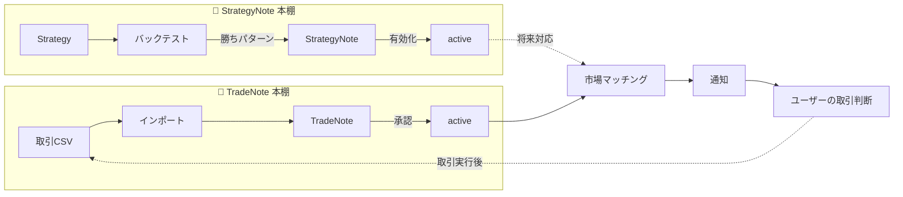
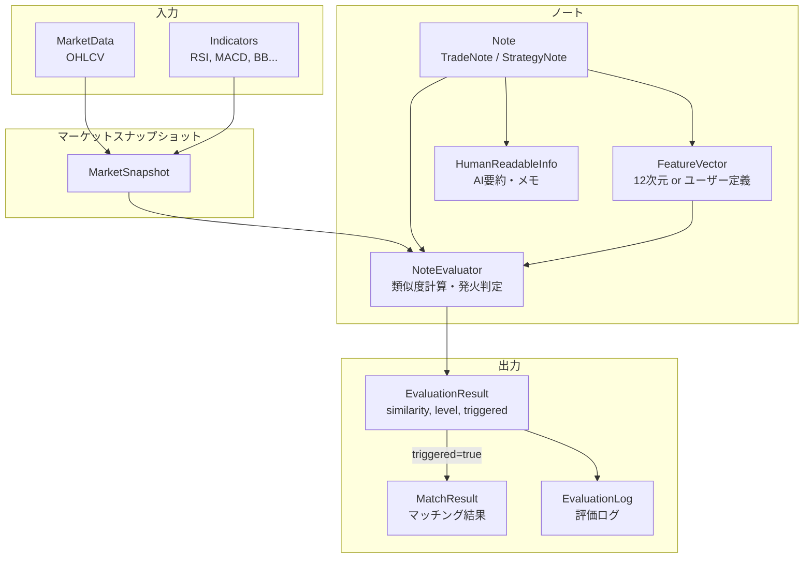
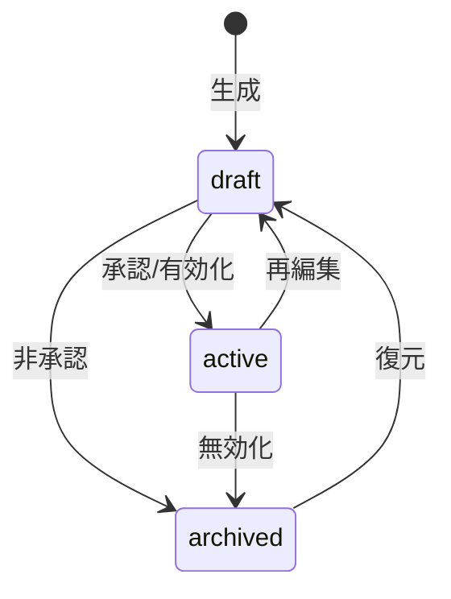

# ノート定義 | Note Domain Specification

## 1. 目的

このファイルは、**ノート（Note）をプロジェクト全体で共通に理解・参照可能なドメイン仕様として定義する**ことを目的とするドキュメントである。

ノートは単なる記録ではなく、**評価可能な判断単位としての知識資産**であり、通知・バックテスト・AI評価の中心となる。

---

## 2. ノートの定義（概念）

**ノート（Note）** とは：

1. 過去のトレード／観察情報に対して
2. 市場データから抽出された特徴量を組み合わせ
3. 再現可能な判断基準を付与した
4. **評価可能な知識資産** である

ノートは **評価の主語** となり、サービスはそれを使って **市場とのマッチ判定・通知** を行う。

---

## 3. ノートの分類（2つの本棚）

本プロジェクトでは、ノートを **起点の違い** により2種類に分類する。



### 3.1 TradeNote（取引ノート）

| 項目 | 内容 |
|------|------|
| **起点** | ユーザーの実取引履歴（CSVインポート） |
| **生成方法** | 取引データから自動生成 |
| **用途** | ① 取引記録の閲覧・振り返り<br>② 優位性検証（バックテスト）<br>③ 承認後は市場マッチング対象 |
| **親エンティティ** | `Trade`（1:1） |

**ライフサイクル:**
```
CSV Import → Trade 生成 → TradeNote 自動生成 (draft)
    → ユーザー確認 → 承認 (active) / 非承認 (archived)
    → active ノートは市場マッチング対象
```

### 3.2 StrategyNote（戦略ノート）

| 項目 | 内容 |
|------|------|
| **起点** | ユーザー作成の売買戦略（Strategy） |
| **生成方法** | バックテストで検出された勝ちパターンから生成 |
| **用途** | ① 戦略の有効性記録<br>② 有効化後は市場マッチング対象（将来対応） |
| **親エンティティ** | `Strategy`（N:1） |

**ライフサイクル:**
```
Strategy 作成 → バックテスト実行 → 勝ちパターン検出
    → StrategyNote 生成 (draft)
    → ユーザー確認 → 有効化 (active) / アーカイブ (archived)
```

### 3.3 両者の関係

- **共通点**: 同じ `NoteEvaluator` インターフェースで評価可能、同じ特徴量ベクトル基盤を使用
- **相違点**: 起点が「実取引」か「仮説戦略」かの違い
- **連携**: StrategyNote に基づいて行った取引は、インポート時に TradeNote として記録される

> **将来拡張**: StrategyNote 起点の取引を明示的に紐付ける機能は将来検討

---

## 4. ノートの責務

ノートは次の責務を持つ：

| 責務 | 説明 |
|------|------|
| **市場入力を受け取る** | 共通の MarketSnapshot（OHLCV + インジケーター値） |
| **特徴量を構築する** | ノート固有の特徴量生成ロジック（12次元 or ユーザー定義） |
| **評価ルールを保持し実行する** | `NoteEvaluator` による類似度計算・発火判定 |
| **状態を管理する** | `draft` / `active` / `archived` |
| **人間とAI双方で解釈可能** | 構造化データ + 可読情報（AI要約等） |

---

## 5. ドメインモデル図



---

## 6. ノートの状態

| 状態 | 説明 | マッチング対象 |
|------|------|----------------|
| `draft` | 作成中／未承認 | ❌ |
| `active` | 承認済み／有効 | ✅ |
| `archived` | 無効化／履歴保持 | ❌ |

**状態遷移:**


**追加フラグ（運用制御）:**

| フィールド | 型 | 説明 |
|------------|-----|------|
| `enabled` | boolean | マッチング有効フラグ（`active` でも一時停止可能） |
| `pausedUntil` | DateTime? | 一時停止期限 |
| `priority` | int (1-10) | 同時ヒット時のソート優先度 |

---

## 7. マーケット入力（MarketSnapshot）

全ノート共通で扱うマーケットデータ形式：

```typescript
interface MarketSnapshot {
  symbol: string;           // 銘柄シンボル
  timestamp: Date;          // データ取得時刻
  timeframe: string;        // 時間足 (1m, 5m, 1h, 1d...)
  ohlcv: {
    open: number;
    high: number;
    low: number;
    close: number;
    volume: number;
  };
  indicators: Record<string, number | null>;  // インジケーター値
}
```

**補足:**
- マーケットデータはノートごとに異なる形式にはしない
- 特徴量はこのデータからノート側で構築する
- `indicators` には計算済みのインジケーター値が格納される

---

## 8. 特徴量（FeatureVector）

**特徴量** とは、MarketSnapshot からノートが抽出する数値ベクトルであり、評価ルールの入力となる。

### 8.1 レガシー12次元ベクトル

`indicatorConfig` が未設定のノートで使用される固定次元ベクトル：

| 次元 | カテゴリ | 内容 |
|------|----------|------|
| 0-2 | トレンド系 | trendDirection, trendStrength, trendAlignment |
| 3-4 | モメンタム系 | macdHistogram, macdCrossover |
| 5-6 | 過熱度系 | rsiValue, rsiZone |
| 7-8 | ボラティリティ系 | bbPosition, bbWidth |
| 9-10 | ローソク足構造 | candleBody, candleDirection |
| 11 | 時間軸 | sessionFlag |

### 8.2 ユーザー定義ベクトル

`indicatorConfig` が設定されたノートでは、ユーザー指定のインジケーターから可変次元ベクトルを構築。

**要件:**
- 数値化可能であること
- 評価ルールと一貫性があること
- ドキュメント化されていること

> **参照**: インジケーター仕様は [indicators/README.md](indicators/README.md) を参照

---

## 9. 評価ルール（NoteEvaluator）

`NoteEvaluator` はノートの評価ロジックをカプセル化するインターフェース。

```typescript
interface NoteEvaluator {
  readonly noteId: string;
  readonly symbol: string;
  
  // 必要なインジケーター一覧
  requiredIndicators(): IndicatorSpec[];
  
  // 特徴量ベクトル構築
  buildFeatureVector(snapshot: MarketSnapshot): number[];
  
  // 類似度計算（コサイン類似度）
  similarity(vectorA: number[], vectorB: number[]): number;
  
  // 発火判定
  isTriggered(similarity: number): boolean;
  
  // 閾値取得
  getThresholds(): { strong: number; medium: number; weak: number };
  
  // 統合評価
  evaluate(snapshot: MarketSnapshot, noteVector?: number[]): EvaluationResult;
}
```

### 9.1 類似度閾値

| レベル | 閾値 | 意味 |
|--------|------|------|
| `strong` | ≥ 0.90 | 強い一致 |
| `medium` | ≥ 0.80 | 中程度の一致 |
| `weak` | ≥ 0.70 | 弱い一致 |
| `none` | < 0.70 | 一致なし |

**発火閾値（デフォルト）**: `0.75`

### 9.2 評価結果

```typescript
interface EvaluationResult {
  noteId: string;
  similarity: number;       // 0.0〜1.0
  level: SimilarityLevel;   // 'strong' | 'medium' | 'weak' | 'none'
  triggered: boolean;       // 発火したか
  vectorDimension: number;  // 使用した次元数
  usedIndicators: string[]; // 使用したインジケーター
  evaluatedAt: Date;
  diagnostics?: {           // デバッグ情報（オプション）
    noteVector: number[];
    marketVector: number[];
    missingIndicators: string[];
  };
}
```

> **参照**: NoteEvaluator の詳細実装は [docs/ARCHITECTURE.md](docs/ARCHITECTURE.md) を参照

---

## 10. 共通基盤

TradeNote と StrategyNote は以下の基盤を共有する：

| 基盤 | 説明 | 実装 |
|------|------|------|
| **特徴量サービス** | 12次元ベクトル計算 | `featureVectorService.ts` |
| **NoteEvaluator** | 評価ロジック抽象化 | `noteEvaluator.ts` |
| **バックテストエンジン** | 過去データでの検証 | `backtestService.ts` |
| **マッチングサービス** | 市場との照合 | `matchingService.ts` |

---

## 11. 関連ドキュメント

| ドキュメント | 内容 |
|--------------|------|
| [docs/ARCHITECTURE.md](docs/ARCHITECTURE.md) | NoteEvaluator 実装仕様、Service 連携フロー |
| [indicators/README.md](indicators/README.md) | インジケーター三層モデル、言語化ルール |
| [docs/MATCHING_ALGORITHM.md](docs/MATCHING_ALGORITHM.md) | マッチングアルゴリズム詳細 |
| [AGENTS.md](AGENTS.md) | AI エージェント向け開発指示 |

---

## 12. 変更履歴

| 日付 | 変更内容 |
|------|----------|
| 2026-01-03 | 初版作成。TradeNote / StrategyNote の2分類、状態の `active` 統一 |
