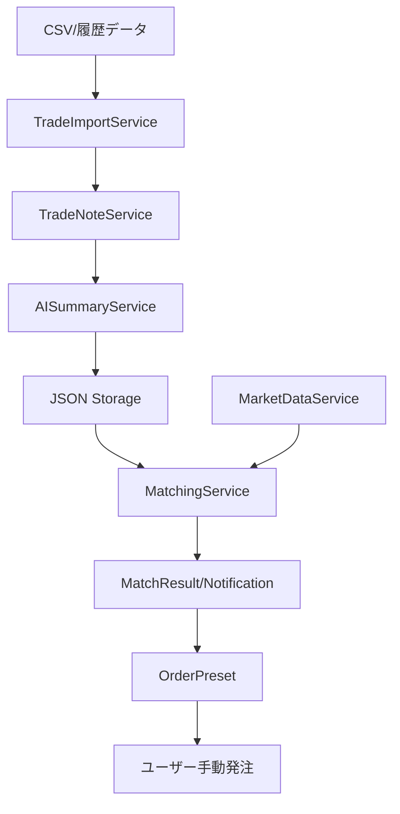

# アーキテクチャ概要（Phase0 版）

## C4 Context レベル
- ユーザー: トレーダー（ローカル環境で利用）
- システム: TradeAssist MVP（判断支援ツール、非自動売買）
- 外部システム: 市場データ API、AI API、Push 通知サービス
- データストア: ローカルファイル（JSON）を暫定採用

## C4 Container レベル
- フロント/クライアント: REST クライアント（ブラウザ/CLI）想定
- API サーバー: Node.js + Express（REST）
  - Controllers: trade / matching / notification / order
  - Services: tradeImport / tradeNote / aiSummary / marketData / matching / notification / orderPreset
  - Utils: scheduler（15 分周期が基準。設定で変更可能）
- 外部サービス: OpenAI API、Market Data API、Push 通知 API
- ストレージ: data/ 配下の JSON（notes, matches, notifications 等）

## データフロー（文章）
1. インポート: CSV → TradeImportService が検証 → TradeNoteService が特徴量抽出・ノート生成 → AISummaryService が要約 → JSON 保存
2. マッチング: Scheduler or 手動 → MarketDataService が最新データ取得 → MatchingService がノートと比較 → MatchResult 保存 → NotificationService が通知作成
3. 注文支援: Notification の matchResult を元に OrderPresetService が価格・数量案を生成 → ユーザーが確認し手動発注

## データフロー（Mermaid 図）

## リアルタイム処理の考え方
- デフォルトは 15 分周期のポーリング（Scheduler 利用）。負荷と API コストを抑制
- 手動トリガー POST /api/matching/check を併用し、設定変更後の即時検証を可能にする
- 将来: シンボル数が増えた場合はシンボル単位のバッチ分割を想定

## 非同期処理方針
- Node.js のイベントループ上で I/O 非同期化（API 呼び出しとファイル I/O を Promise で実装）
- AI 要約や市場データ取得は独立タスクとして実行し、タイムアウト/リトライを明示
- 将来: キュー（Bull/RabbitMQ）でマッチングワーカーを分離する前提で設計する

## 信頼性・回復力（MVP スコープ内）
- 外部 API 失敗時: リトライ上限到達で部分的にスキップし、エラーログを残す
- データ整合性: ノート生成に失敗しても元トレードは保持し、再実行可能にする
- ストレージ: 単一ノード前提。バックアップは手動コピーを想定（Phase1 で自動化検討）

## 完成度メモ（80% で停止）
- C4 Component レベルの詳細分解（各サービス内の関心分離）は未記載
- 監視・ロギング基盤の具体ツール選定は未決定
