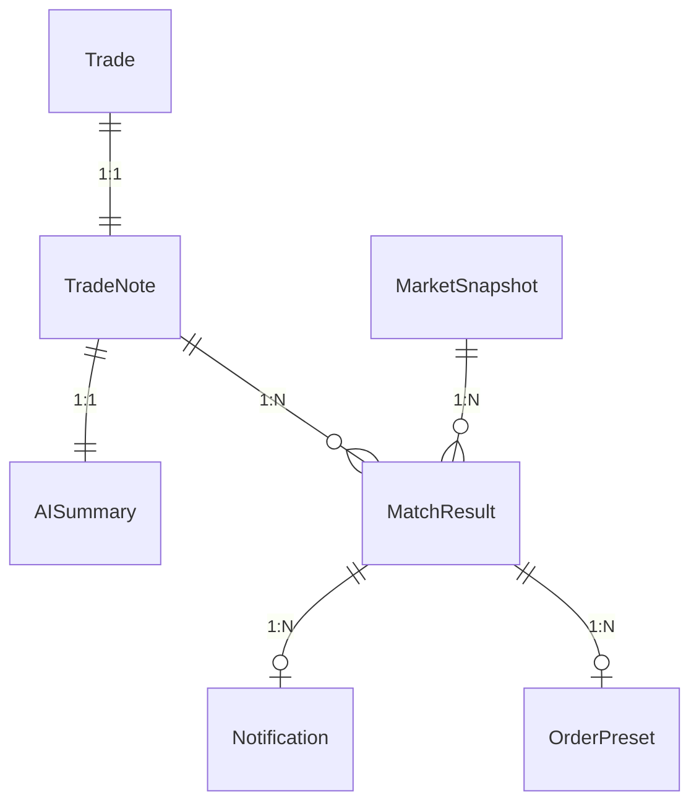

# データモデル（Phase0 版）

## 目的
トレード履歴・ノート・マッチ結果・通知を一意に表現するエンティティを定義し、Phase1 の実装指針とする。

## エンティティ一覧
- Trade: 元トレード履歴（CSV インポート）
- TradeNote: トレードから生成されたノート（特徴量・AI 要約を含む）
- AISummary: AI による短文サマリとメタ情報
- MarketSnapshot: マッチング時点の市場データ
- MatchResult: ノートと市場のマッチ結果
- Notification: マッチ通知のライフサイクル管理用
- OrderPreset: マッチ結果に基づく注文支援情報

## 属性定義
### Trade
- id (UUID, PK)
- timestamp (datetime, UTC)
- symbol (string)
- side (enum: buy/sell)
- price (number)
- quantity (number)
- fee (number, optional)
- exchange (string, optional)

### TradeNote
- id (UUID, PK)
- tradeId (UUID, FK → Trade.id)
- symbol (string)
- entryPrice (number)
- side (enum: buy/sell)
- indicators (object: rsi?, macd?, trend?)
- featureVector (number[] 固定長 7 想定)
- timeframe (string, optional)
- createdAt (datetime)
- updatedAt (datetime)

### AISummary
- id (UUID, PK)
- noteId (UUID, FK → TradeNote.id)
- summary (string)
- promptTokens (number, optional)
- completionTokens (number, optional)
- model (string, optional)
- createdAt (datetime)

### MarketSnapshot
- id (UUID, PK)
- symbol (string)
- timeframe (string)
- close (number)
- volume (number)
- indicators (object: rsi, macd, trend)
- fetchedAt (datetime)

### MatchResult
- id (UUID, PK)
- noteId (UUID, FK → TradeNote.id)
- marketSnapshotId (UUID, FK → MarketSnapshot.id)
- symbol (string)
- score (number, 0-1)
- threshold (number)
- trendMatched (boolean)
- priceRangeMatched (boolean)
- decidedAt (datetime)

### Notification
- id (UUID, PK)
- matchResultId (UUID, FK → MatchResult.id)
- title (string)
- message (string)
- status (enum: unread/read/deleted)
- sentAt (datetime)
- readAt (datetime, optional)

### OrderPreset
- id (UUID, PK)
- matchResultId (UUID, FK → MatchResult.id)
- symbol (string)
- side (enum: buy/sell)
- suggestedPrice (number)
- suggestedQuantity (number)
- confidence (number, 0-1)
- feesEstimate (number, optional)
- createdAt (datetime)

## ER 図（Mermaid）

## 主キー / 外部キー
- すべてのエンティティで UUID を PK とする
- TradeNote.tradeId → Trade.id
- AISummary.noteId → TradeNote.id
- MatchResult.noteId → TradeNote.id, MatchResult.marketSnapshotId → MarketSnapshot.id
- Notification.matchResultId → MatchResult.id
- OrderPreset.matchResultId → MatchResult.id

## 正規化方針
- Trade と TradeNote を分離し、取引そのものと生成ノートを独立管理
- AISummary を分離し、要約生成失敗時でもノートを保持可能にする
- MarketSnapshot を共有化し、同一スナップショットを複数マッチ結果で参照可能にする
- 可変属性（インジケータなど）は JSON カラムに保持し、必須最小限のみスカラーで管理

## 将来拡張時の注意点
- DB 移行時は TradeNote.featureVector を可変長にせず、別テーブルへ正規化する選択肢を検討（ANN/VDB 連携を想定）
- MarketSnapshot の保管期間と肥大化対策として、ロールアップ粒度（15m/1h）をメタデータで保持すると移行が容易
- Notification は多チャネル化（メール/SMS）を想定し、チャネル種別と送達ステータスを追加予定
- マルチアカウント対応が必要になった場合、User エンティティを追加し全 FK に userId をぶら下げる

## 完成度メモ（80% で停止）
- JSON フィールドの詳細スキーマ、インデックス設計、ユニーク制約は Phase1 で詳細化
- MarketSnapshot の保存ポリシー（TTL/アーカイブ）は未決定
