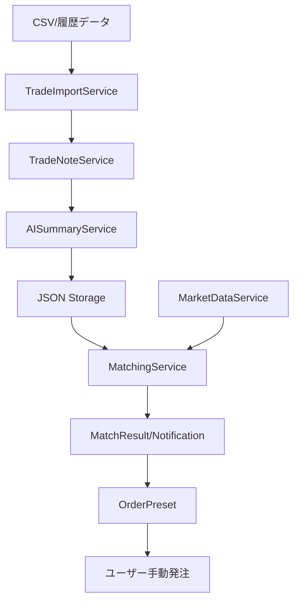
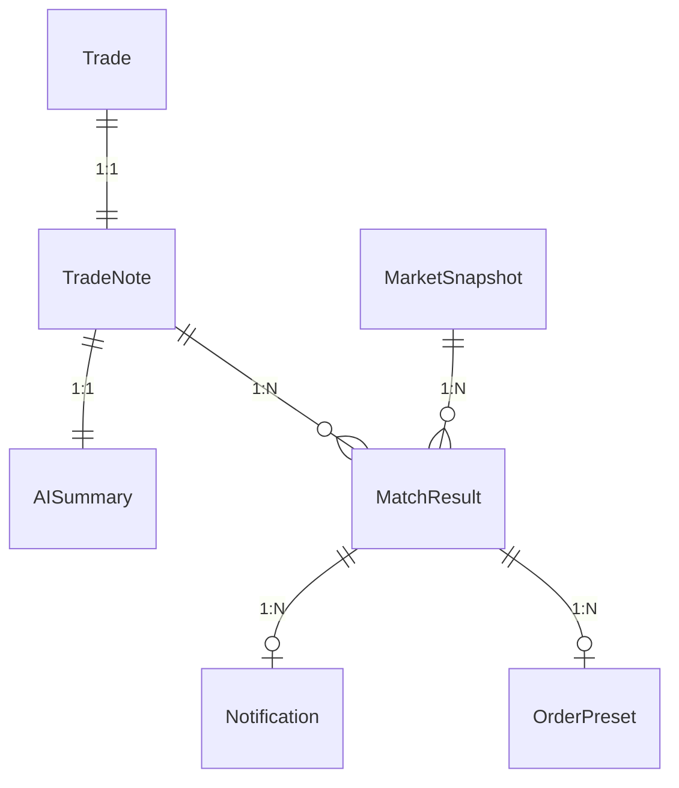

This file is a merged representation of a subset of the codebase, containing specifically included files and files not matching ignore patterns, combined into a single document by Repomix.

# File Summary

## Purpose
This file contains a packed representation of a subset of the repository's contents that is considered the most important context.
It is designed to be easily consumable by AI systems for analysis, code review,
or other automated processes.

## File Format
The content is organized as follows:
1. This summary section
2. Repository information
3. Directory structure
4. Repository files (if enabled)
5. Multiple file entries, each consisting of:
  a. A header with the file path (## File: path/to/file)
  b. The full contents of the file in a code block

## Usage Guidelines
- This file should be treated as read-only. Any changes should be made to the
  original repository files, not this packed version.
- When processing this file, use the file path to distinguish
  between different files in the repository.
- Be aware that this file may contain sensitive information. Handle it with
  the same level of security as you would the original repository.

## Notes
- Some files may have been excluded based on .gitignore rules and Repomix's configuration
- Binary files are not included in this packed representation. Please refer to the Repository Structure section for a complete list of file paths, including binary files
- Only files matching these patterns are included: src/backend/**, docs/**
- Files matching these patterns are excluded: repomix-output.md, repomix-*.md
- Files matching patterns in .gitignore are excluded
- Files matching default ignore patterns are excluded
- Files are sorted by Git change count (files with more changes are at the bottom)

# Directory Structure
```
docs/
  _coverage/
    implementation-matrix.md
  fixes/
    ctrader-oauth-fix-2026-02-02.md
    oauth-cookie-fix-2026-02-06.md
    oauth-fix-summary.md
  phase-next/
    ml-pattern-recognition.md
    realtime-dashboard-optimization.md
    strategy-comparison-analysis.md
  phase0/
    api-contract.md
    architecture.md
    data-model.md
    decisions.md
    scope.md
  phase13/
    BarLocator_実装レポート.md
    trade-note-phase-prompt.md
  phase14/
    coding_agent_実装タスクプロンプト（レビュー反映・配線復旧・mvp完成）.md
  side-b/
    phase-a-trade-plan.md
    phase-b-virtual-trading.md
    phase-c-ai-trade-note.md
    phase-d-integration.md
    TradeAssistant-AI.md
  API.md
  ARCHITECTURE.md
  cross-similarity-search.md
  DESIGN_PHILOSOPHY.md
  GCP_PRISMA_BEST_PRACTICES.md
  IMPLEMENTATION_REPORT_GCP_BEST_PRACTICES.md
  MATCHING_ALGORITHM.md
  precision-metrics.md
  production-final-validation.md
  quantitative-trading-strategies-ranking.md
  realtime_similarity_notification_architecture.md
  TESTING.md
src/
  backend/
    api/
      ctraderAuthRoutes.ts
      ohlcvRoutes.ts
      patternAnalysisRoutes.ts
      realtimeRoutes.ts
      strategyComparisonRoutes.ts
      strategyRoutes.ts
      tradingRoutes.ts
    db/
      client.ts
    repositories/
      backtestRepository.ts
      evaluationLogRepository.ts
      index.ts
      marketSnapshotRepository.ts
      matchResultRepository.ts
      notificationLogRepository.ts
      notificationRepository.ts
      ohlcvRepository.ts
      pushSubscriptionRepository.ts
      tradeNoteRepository.ts
      tradeRepository.ts
    services/
      auth/
        sessionService.ts
      ctrader/
        types/
          connection.ts
          trading.ts
        ctraderAccountService.ts
        ctraderAuthService.ts
      ingest/
        marketIngestService.ts
      matching/
        matchEvaluationService.ts
      realtime/
        ctraderRealtimeOrchestrator.ts
        realtimeSanity.ts
        realtimeTickService.ts
      backtestCalculations.ts
      fetchAndCacheOhlcv.ts
      filterAnalysisService.ts
      ohlcvImportService.ts
      ohlcvIngestService.ts
      patternAnalysisService.ts
      similarityService.ts
      strategyAlertService.ts
      strategyBacktestService.ts
      strategyComparisonService.ts
      strategyConditionEvaluator.ts
      strategyNoteService.ts
      strategyService.ts
      walkForwardService.ts
      webPushService.ts
    tests/
      helpers/
        secret-checker.ts
      setup/
        global-setup.ts
      aiSummaryService.test.ts
      crossSimilarityService.test.ts
      dailyBatchService.test.ts
      enhancedAISummaryService.test.ts
      evaluationLogRepository.test.ts
      featureExtractor.test.ts
      featureService.test.ts
      featureVectorService.test.ts
      indicatorConfig.test.ts
      indicatorNormalizer.test.ts
      indicatorProfile.test.ts
      indicatorService.test.ts
      marketIngestService.test.ts
      matchEvaluationService.test.ts
      matchingService.test.ts
      noteApprovalFlow.test.ts
      noteEvaluator.test.ts
      notePerformanceService.test.ts
      notificationLogRepository.test.ts
      notificationTriggerService.extended.test.ts
      notificationTriggerService.test.ts
      ohlcvRepository.test.ts
      realtimeSanity.test.ts
      realtimeTickNormalization.test.ts
      revaluationJobService.test.ts
      secret-checker.test.ts
      simultaneousHitControlService.test.ts
      strategyBacktestService.test.ts
      strategyConditionEvaluator.test.ts
      strategyService.test.ts
      tradeDefinitionService.test.ts
      tradeImportService.test.ts
      tradeNormalizationService.test.ts
      tradeNoteGeneratorService.test.ts
      tradeNoteIntegration.test.ts
      tradeNoteService.test.ts
```

# Files

## File: docs/_coverage/implementation-matrix.md
````markdown
# implementation-matrix.md（実装・テスト・ドキュメント整合マトリクス）

本ファイルは「実装漏れ」「テスト漏れ」「ドキュメント更新漏れ」を早期に検出するためのカバレッジ表です。
特に **縦割り（UI→API→DB/FS）** と **逆方向（DB/FS→API→UI）** の導通を、事実（根拠リンク）ベースで記録します。

- ✅: 完了（実装/Doc が整合し、導線として成立）
- ⚠️: 要確認（動くが Doc/導線/戻り値/副作用が不一致、または一部が未配線）
- ❌: 未対応/死んだ導線（UI/Route が存在しない、404 が確定、または重要な要件を満たさない）
- 💤: 対象外（現フェーズでは未実施でも問題なし）

最終確認日: 2025-12-31

---

## 0. 横断（環境変数/ポート/運用）

| 区分 | Requirement | 判定 | 根拠（実装） | 根拠（Docs） | メモ |
|---|---|:--:|---|---|---|
| Port | バックエンド既定ポートと Docs が一致 | ✅ | [src/config/index.ts](src/config/index.ts#L18) | [README.md](README.md#L91-L92), [docs/API.md](docs/API.md#L5) | Phase0 で更新。Docs は 3100 前提に修正済み。 |
| Port | フロントエンド既定ポートと Docs が一致 | ✅ | [src/app.ts](src/app.ts#L36) | [README.md](README.md#L91-L92), [src/frontend/README.md](src/frontend/README.md#L57) | Phase0 で更新。 |
| Scheduler | スケジューラーの起動条件が Docs と一致 | ✅ | [src/app.ts](src/app.ts#L132-L140) | [docs/API.md](docs/API.md) | Phase0 で API.md に CRON_ENABLED 説明追加。 |

---

## 1. トレード取込・ノート（UI→API→FS/DB）

| Requirement | 判定 | UI | API | 永続化 | Doc 整合 | 根拠（実装） | 根拠（Docs） | メモ |
|---|:--:|:--:|:--:|:--:|:--:|---|---|---|
| CSV取込（ファイル）: POST /api/trades/import/csv で取込→ノート生成 | ✅ | ✅ | ✅ | ✅(FS) | ✅ | [src/controllers/tradeController.ts](src/controllers/tradeController.ts#L28-L105), [src/controllers/tradeController.ts](src/controllers/tradeController.ts#L98-L101) | [docs/API.md](docs/API.md#L33-L52), [README.md](README.md#L110-L121) | Phase0 で Docs を noteIds に修正済み。 |
| CSV取込（テキスト）: POST /api/trades/import/upload-text | ✅ | ✅ | ✅ | ✅(FS) | ✅ | [src/routes/tradeRoutes.ts](src/routes/tradeRoutes.ts#L17), [src/controllers/tradeController.ts](src/controllers/tradeController.ts#L117-L176), [src/app.ts](src/app.ts#L118) | [docs/API.md](docs/API.md) | Phase0 で API.md に追記済み。 |
| ノート一覧: GET /api/trades/notes | ✅ | ✅ | ✅ | ✅(FS) | ✅ | [src/controllers/tradeController.ts](src/controllers/tradeController.ts#L195-L199) | [docs/API.md](docs/API.md#L55-L56) | FS のノートを返す。 |
| ノート詳細: GET /api/trades/notes/:id | ✅ | ✅ | ✅ | ✅(FS) | ✅ | [src/controllers/tradeController.ts](src/controllers/tradeController.ts#L201-L212) | [docs/API.md](docs/API.md#L58-L59) | 404 の仕様は実装済み。 |
| ノート承認: POST /api/trades/notes/:id/approve | ✅ | ✅ | ✅ | ✅(FS) | ✅ | [src/routes/tradeRoutes.ts](src/routes/tradeRoutes.ts#L35), [src/controllers/tradeController.ts](src/controllers/tradeController.ts#L214-L247) | [docs/API.md](docs/API.md) | Phase0 で API.md に追記済み。 |

---

## 2. マッチング（UI/手動→API→DB/FS）

| Requirement | 判定 | UI | API | 永続化 | Doc 整合 | 根拠（実装） | 根拠（Docs） | メモ |
|---|:--:|:--:|:--:|:--:|:--:|---|---|---|
| 手動マッチ: POST /api/matching/check | ✅ | 💤 | ✅ | ✅(DB) | ✅ | [src/controllers/matchingController.ts](src/controllers/matchingController.ts#L25-L56), [src/controllers/matchingController.ts](src/controllers/matchingController.ts#L31) | [docs/API.md](docs/API.md#L65-L66) | 実装は通知生成も行う。 |
| 履歴: GET /api/matching/history | ✅ | ✅ | ✅ | ✅(DB想定) | ✅ | [src/controllers/matchingController.ts](src/controllers/matchingController.ts#L78-L111), [src/controllers/matchingController.ts](src/controllers/matchingController.ts#L91) | [docs/API.md](docs/API.md), [README.md](README.md#L154-L177) | Phase0 で Docs を success/count/matches 形式に修正済み。 |

---

## 3. 通知（UI→API→FS + ログDB）

| Requirement | 判定 | UI | API | 永続化 | Doc 整合 | 根拠（実装） | 根拠（Docs） | メモ |
|---|:--:|:--:|:--:|:--:|:--:|---|---|---|
| 一覧: GET /api/notifications（unreadOnly） | ✅ | ✅ | ✅ | ✅(FS) | ✅ | [src/controllers/notificationController.ts](src/controllers/notificationController.ts#L29-L55), [src/routes/notificationRoutes.ts](src/routes/notificationRoutes.ts#L14) | [docs/API.md](docs/API.md#L74-L76) | 通知本体は FS（既読も FS）。 |
| 既読: PUT /api/notifications/:id/read | ✅ | ✅ | ✅ | ✅(FS) | ✅ | [src/routes/notificationRoutes.ts](src/routes/notificationRoutes.ts#L27), [src/frontend/lib/api.ts](src/frontend/lib/api.ts#L73) | [src/frontend/README.md](src/frontend/README.md) | Phase0 でフロントREADMEをPUTに修正済み。 |
| 全既読: PUT /api/notifications/read-all | ✅ | ✅ | ✅ | ✅(FS) | ✅ | [src/routes/notificationRoutes.ts](src/routes/notificationRoutes.ts#L33), [src/frontend/lib/api.ts](src/frontend/lib/api.ts#L89) | [src/frontend/README.md](src/frontend/README.md) | Phase0 で修正済み。 |
| トリガ: POST /api/notifications/check（再通知防止・ログ） | ✅ | 💤 | ✅ | ✅(DB+FS) | ✅ | [src/controllers/notificationController.ts](src/controllers/notificationController.ts#L163-L218), [src/controllers/notificationController.ts](src/controllers/notificationController.ts#L181-L187), [src/controllers/notificationController.ts](src/controllers/notificationController.ts#L213-L217) | [docs/API.md](docs/API.md), [README.md](README.md#L183-L199) | Phase0 で Docs を実装に寄せて修正済み（matchResultId未使用明記）。 |
| ログ: GET /api/notifications/logs | ✅ | 💤 | ✅ | ✅(DB) | ✅ | [src/controllers/notificationController.ts](src/controllers/notificationController.ts#L233-L267), [src/controllers/notificationController.ts](src/controllers/notificationController.ts#L259-L260) | [docs/API.md](docs/API.md#L171-L201) | Phase0 でデフォルト動作（失敗ログのみ）を Docs に明記済み。 |

---

## 4. 発注支援（UI→API）

| Requirement | 判定 | UI | API | 永続化 | Doc 整合 | 根拠（実装） | 根拠（Docs） | メモ |
|---|:--:|:--:|:--:|:--:|:--:|---|---|---|
| 発注画面（参照のみ）: /orders/preset | ✅ | ✅ | ✅ | 💤 | ✅ | [src/frontend/app/orders/preset/page.tsx](src/frontend/app/orders/preset/page.tsx), [src/routes/orderRoutes.ts](src/routes/orderRoutes.ts#L11-L21) | [docs/API.md](docs/API.md) | Phase0 で UI ページ追加、リンクを noteId ベースに統一済み。 |

---

## 5. 死んだ/未配線候補（検出ログ）

| 対象 | 判定 | 根拠 | メモ |
|---|:--:|---|---|
| フロントAPI: GET /api/daily-status | ❌ | [src/frontend/lib/api.ts](src/frontend/lib/api.ts#L206-L209), [src/app.ts](src/app.ts#L88-L92) | フロント側に API クライアントがあるが、バックエンドにルート登録が無い。現在 UI からの利用箇所は未検出（要整理）。 |

---

## 6. Phase 1 — トレード取込定義化パイプライン（2025-01-02 追加）

最終確認日: 2025-01-02

### 6.1 インジケーター定義拡張

| Requirement | 判定 | 実装 | テスト | Doc 整合 | 根拠（実装） | メモ |
|---|:--:|:--:|:--:|:--:|---|---|
| 20種類のインジケーター定義 | ✅ | ✅ | ✅ | ✅ | [src/models/indicatorConfig.ts](src/models/indicatorConfig.ts) | RSI, SMA, EMA, MACD, BB, ATR, Stochastic, OBV, VWAP（既存9種）+ Williams%R, CCI, Aroon, ROC, MFI, CMF, DEMA, TEMA, KC, PSAR, Ichimoku（新規11種）|
| 同一インジケーター複数期間対応 | ✅ | ✅ | ✅ | ✅ | [src/models/indicatorConfig.ts#IndicatorConfig](src/models/indicatorConfig.ts) | IndicatorConfig.configId でユニーク識別 |
| インジケーター計算サービス拡張 | ✅ | ✅ | ✅ | 💤 | [src/services/indicators/indicatorService.ts](src/services/indicators/indicatorService.ts) | indicatorts ライブラリをラップ |

### 6.2 トレード正規化

| Requirement | 判定 | 実装 | テスト | Doc 整合 | 根拠（実装） | メモ |
|---|:--:|:--:|:--:|:--:|---|---|
| タイムスタンプ UTC 正規化 | ✅ | ✅ | ✅ | 💤 | [src/services/tradeNormalizationService.ts#normalizeTimestamp](src/services/tradeNormalizationService.ts) | ISO8601, Unix秒/ミリ秒, 日本語形式（JST→UTC）対応 |
| シンボル正規化（BTCUSD→BTC/USD） | ✅ | ✅ | ✅ | 💤 | [src/services/tradeNormalizationService.ts#normalizeSymbol](src/services/tradeNormalizationService.ts) | 主要ペアのマッピングテーブル + パターン推測 |
| Side 正規化（buy/sell/long/short/日本語） | ✅ | ✅ | ✅ | 💤 | [src/services/tradeNormalizationService.ts#normalizeSide](src/services/tradeNormalizationService.ts) | 英語/日本語/数値対応 |
| ユーザーフレンドリーエラーメッセージ | ✅ | ✅ | ✅ | 💤 | [src/services/tradeNormalizationService.ts#normalizeTradeData](src/services/tradeNormalizationService.ts) | 行番号付きで修正方法を明示 |

### 6.3 TradeDefinition パイプライン

| Requirement | 判定 | 実装 | テスト | Doc 整合 | 根拠（実装） | メモ |
|---|:--:|:--:|:--:|:--:|---|---|
| TradeDefinition 型定義 | ✅ | ✅ | 💤 | 💤 | [src/models/tradeDefinition.ts](src/models/tradeDefinition.ts) | Trade + MarketSnapshot + IndicatorSnapshot + DerivedContext |
| 市場データ取得→インジケーター計算 | ✅ | ✅ | ✅ | 💤 | [src/services/tradeDefinitionService.ts](src/services/tradeDefinitionService.ts) | MarketDataService 連携、失敗時モックデータフォールバック |
| 派生コンテキスト導出（trend, volatility, momentum） | ✅ | ✅ | ✅ | 💤 | [src/services/tradeDefinitionService.ts#deriveContext](src/services/tradeDefinitionService.ts) | 複数インジケーターから総合判定 |
| 特徴量ベクトル生成（20次元） | ✅ | ✅ | ✅ | 💤 | [src/services/tradeDefinitionService.ts#generateFeatureVector](src/services/tradeDefinitionService.ts) | pgvector 対応用正規化ベクトル |
| バッチ処理対応 | ✅ | ✅ | ✅ | 💤 | [src/services/tradeDefinitionService.ts#generateDefinitionsBatch](src/services/tradeDefinitionService.ts) | 複数トレード一括変換 |

### 6.4 テストカバレッジ

| テストファイル | テスト数 | 根拠 |
|---|:--:|---|
| indicatorConfig.test.ts | 14 | [src/backend/tests/indicatorConfig.test.ts](src/backend/tests/indicatorConfig.test.ts) |
| tradeNormalizationService.test.ts | 27 | [src/backend/tests/tradeNormalizationService.test.ts](src/backend/tests/tradeNormalizationService.test.ts) |
| tradeDefinitionService.test.ts | 8 | [src/backend/tests/tradeDefinitionService.test.ts](src/backend/tests/tradeDefinitionService.test.ts) |
| indicatorService.test.ts（既存拡張） | 16 | [src/backend/tests/indicatorService.test.ts](src/backend/tests/indicatorService.test.ts) |

---

## 7. Phase 2 — ノート承認フロー（2025-12-31 追加）

最終確認日: 2025-12-31

### 7.1 データモデル拡張

| Requirement | 判定 | 実装 | テスト | Doc 整合 | 根拠（実装） | メモ |
|---|:--:|:--:|:--:|:--:|---|---|
| NoteStatus 型定義（draft/approved/rejected） | ✅ | ✅ | ✅ | ✅ | [src/models/types.ts#NoteStatus](src/models/types.ts) | 3ステータス対応、状態遷移可能 |
| TradeNote 拡張（rejectedAt, lastEditedAt, userNotes, tags） | ✅ | ✅ | ✅ | ✅ | [src/models/types.ts#TradeNote](src/models/types.ts) | 編集履歴・ユーザー追記対応 |

### 7.2 API エンドポイント

| Requirement | 判定 | UI | API | 永続化 | Doc 整合 | 根拠（実装） | 根拠（Docs） | メモ |
|---|:--:|:--:|:--:|:--:|:--:|---|---|---|
| ノート一覧（status フィルタ）: GET /api/trades/notes?status= | ✅ | ✅ | ✅ | ✅(FS) | ✅ | [src/controllers/tradeController.ts#getAllNotes](src/controllers/tradeController.ts) | [docs/API.md](docs/API.md) | draft/approved/rejected でフィルタ可能 |
| ステータス集計: GET /api/trades/notes/status-counts | ✅ | ✅ | ✅ | ✅(FS) | ✅ | [src/controllers/tradeController.ts#getStatusCounts](src/controllers/tradeController.ts), [src/routes/tradeRoutes.ts](src/routes/tradeRoutes.ts) | [docs/API.md](docs/API.md) | ダッシュボード用 |
| ノート承認: POST /api/trades/notes/:id/approve | ✅ | ✅ | ✅ | ✅(FS) | ✅ | [src/services/tradeNoteService.ts#approveNote](src/services/tradeNoteService.ts), [src/controllers/tradeController.ts#approveNote](src/controllers/tradeController.ts) | [docs/API.md](docs/API.md) | 既存を拡張 |
| ノート非承認: POST /api/trades/notes/:id/reject | ✅ | ✅ | ✅ | ✅(FS) | ✅ | [src/services/tradeNoteService.ts#rejectNote](src/services/tradeNoteService.ts), [src/controllers/tradeController.ts#rejectNote](src/controllers/tradeController.ts) | [docs/API.md](docs/API.md) | 新規追加 |
| 下書きに戻す: POST /api/trades/notes/:id/revert-to-draft | ✅ | ✅ | ✅ | ✅(FS) | ✅ | [src/services/tradeNoteService.ts#revertToDraft](src/services/tradeNoteService.ts), [src/controllers/tradeController.ts#revertToDraft](src/controllers/tradeController.ts) | [docs/API.md](docs/API.md) | 新規追加（後戻り可能設計） |
| ノート更新: PUT /api/trades/notes/:id | ✅ | ✅ | ✅ | ✅(FS) | ✅ | [src/services/tradeNoteService.ts#updateNote](src/services/tradeNoteService.ts), [src/controllers/tradeController.ts#updateNote](src/controllers/tradeController.ts) | [docs/API.md](docs/API.md) | AI要約/ユーザーメモ/タグ編集 |

### 7.3 マッチング制御

| Requirement | 判定 | 実装 | テスト | Doc 整合 | 根拠（実装） | メモ |
|---|:--:|:--:|:--:|:--:|---|---|
| 承認済みノートのみマッチング対象 | ✅ | ✅ | ✅ | ✅ | [src/services/matchingService.ts#checkForMatches](src/services/matchingService.ts), [src/services/tradeNoteService.ts#loadApprovedNotes](src/services/tradeNoteService.ts) | Phase 2 Done条件達成 |

### 7.4 UI 実装

| Requirement | 判定 | 実装 | 根拠（実装） | メモ |
|---|:--:|:--:|---|---|
| ノート詳細: 承認/非承認/編集ボタン | ✅ | ✅ | [src/frontend/app/notes/[id]/page.tsx](src/frontend/app/notes/[id]/page.tsx) | ステータスに応じた動的ボタン表示 |
| ノート詳細: ステータスバッジ表示 | ✅ | ✅ | [src/frontend/app/notes/[id]/page.tsx](src/frontend/app/notes/[id]/page.tsx) | draft/approved/rejected を色分け |
| ノート詳細: 編集モード（AI要約/ユーザーメモ/タグ） | ✅ | ✅ | [src/frontend/app/notes/[id]/page.tsx](src/frontend/app/notes/[id]/page.tsx) | インライン編集UI |
| ノート一覧: ステータスフィルタタブ | ✅ | ✅ | [src/frontend/app/notes/page.tsx](src/frontend/app/notes/page.tsx) | 全件/下書き/承認済み/非承認 |
| ノート一覧: ステータス件数表示 | ✅ | ✅ | [src/frontend/app/notes/page.tsx](src/frontend/app/notes/page.tsx) | タブに件数を表示 |

### 7.5 テストカバレッジ

| テストファイル | テスト数 | 根拠 |
|---|:--:|---|
| noteApprovalFlow.test.ts | 16 | [src/backend/tests/noteApprovalFlow.test.ts](src/backend/tests/noteApprovalFlow.test.ts) |
````

## File: docs/phase-next/ml-pattern-recognition.md
````markdown
# 機械学習パターン認識機能 設計書

> **Phase**: Next  
> **優先度**: 高  
> **作成日**: 2026-01-08

---

## 1. 概要

### 1.1 目的

TensorFlow.js を活用した高度なパターン認識機能を実装し、以下を実現する：

- パターン分類（チャートパターンの自動識別）
- 自動特徴量エンジニアリング（最適な特徴量の発見）
- 異常検知アラート（通常と異なる市場状態の検出）

### 1.2 アーキテクチャ概要

```
┌─────────────────────────────────────────────────────────────────┐
│                    ML パイプライン                               │
├─────────────────────────────────────────────────────────────────┤
│                                                                 │
│  ┌──────────┐    ┌──────────┐    ┌──────────┐    ┌──────────┐ │
│  │ データ   │ → │ 前処理   │ → │ モデル   │ → │ 予測     │ │
│  │ 取得     │    │ 正規化   │    │ 推論     │    │ 後処理   │ │
│  └──────────┘    └──────────┘    └──────────┘    └──────────┘ │
│       ↑                              ↓                         │
│  ┌──────────┐                   ┌──────────┐                   │
│  │ OHLCV    │                   │ 結果保存 │                   │
│  │ データ   │                   │ DB永続化 │                   │
│  └──────────┘                   └──────────┘                   │
│                                                                 │
└─────────────────────────────────────────────────────────────────┘
```

---

## 2. 機能詳細

### 2.1 パターン分類

#### 対象パターン

| カテゴリ | パターン名 | 説明 |
|---------|-----------|------|
| **反転** | ダブルトップ | 高値2回で反転 |
| | ダブルボトム | 安値2回で反転 |
| | ヘッドアンドショルダー | 3つの山で反転 |
| | 逆ヘッドアンドショルダー | 3つの谷で反転 |
| **継続** | フラッグ | 急騰/急落後の調整 |
| | ペナント | 三角持ち合い |
| | ウェッジ | 収束する高値安値 |
| **その他** | トライアングル | 対称/上昇/下降 |
| | レクタングル | 横ばいボックス |

#### モデルアーキテクチャ

```typescript
/**
 * CNN-LSTM ハイブリッドモデル
 * 
 * CNN: ローカルパターン抽出
 * LSTM: 時系列依存性学習
 */
function createPatternClassifier(): tf.LayersModel {
  const model = tf.sequential();
  
  // 入力: [バッチ, 時系列長, 特徴量数]
  // 例: [32, 50, 5] = 32サンプル x 50本 x OHLCV
  
  // 1D CNN レイヤー（パターン抽出）
  model.add(tf.layers.conv1d({
    inputShape: [50, 5],
    filters: 64,
    kernelSize: 3,
    activation: 'relu',
  }));
  model.add(tf.layers.maxPooling1d({ poolSize: 2 }));
  
  model.add(tf.layers.conv1d({
    filters: 128,
    kernelSize: 3,
    activation: 'relu',
  }));
  model.add(tf.layers.maxPooling1d({ poolSize: 2 }));
  
  // LSTM レイヤー（時系列学習）
  model.add(tf.layers.lstm({
    units: 64,
    returnSequences: false,
  }));
  
  model.add(tf.layers.dropout({ rate: 0.3 }));
  
  // 出力: パターン分類（10クラス）
  model.add(tf.layers.dense({
    units: 10,
    activation: 'softmax',
  }));
  
  model.compile({
    optimizer: tf.train.adam(0.001),
    loss: 'categoricalCrossentropy',
    metrics: ['accuracy'],
  });
  
  return model;
}
```

### 2.2 自動特徴量エンジニアリング

#### 特徴量候補プール

```typescript
/**
 * 自動生成される特徴量候補
 */
const FEATURE_CANDIDATES = {
  // 価格ベース
  price: [
    'close',
    'high_low_range',      // (high - low) / close
    'close_open_ratio',    // (close - open) / open
    'upper_shadow',        // (high - max(open, close)) / (high - low)
    'lower_shadow',        // (min(open, close) - low) / (high - low)
  ],
  
  // 移動平均
  ma: [
    'sma_5', 'sma_10', 'sma_20', 'sma_50',
    'ema_5', 'ema_10', 'ema_20', 'ema_50',
    'sma_cross_5_20',      // SMA5 > SMA20 ? 1 : 0
    'price_to_sma_20',     // close / sma_20
  ],
  
  // モメンタム
  momentum: [
    'rsi_14',
    'macd_histogram',
    'stoch_k', 'stoch_d',
    'williams_r',
    'cci_20',
  ],
  
  // ボラティリティ
  volatility: [
    'atr_14',
    'bb_width',            // (upper - lower) / middle
    'bb_position',         // (close - lower) / (upper - lower)
    'keltner_position',
  ],
  
  // ボリューム
  volume: [
    'volume_sma_ratio',    // volume / sma_volume_20
    'obv_trend',           // OBV の傾き
    'mfi_14',
    'cmf_20',
  ],
  
  // パターン
  pattern: [
    'higher_high',         // 前日比高値更新
    'lower_low',           // 前日比安値更新
    'inside_bar',          // 前日の範囲内
    'outside_bar',         // 前日の範囲外
  ],
};

/**
 * 特徴量重要度計算（Permutation Importance）
 */
async function calculateFeatureImportance(
  model: tf.LayersModel,
  X: tf.Tensor,
  y: tf.Tensor,
  featureNames: string[]
): Promise<Map<string, number>> {
  const baseAccuracy = await evaluateModel(model, X, y);
  const importances = new Map<string, number>();
  
  for (let i = 0; i < featureNames.length; i++) {
    // 特徴量をシャッフル
    const shuffledX = shuffleFeature(X, i);
    const shuffledAccuracy = await evaluateModel(model, shuffledX, y);
    
    // 精度低下 = 重要度
    const importance = baseAccuracy - shuffledAccuracy;
    importances.set(featureNames[i], importance);
    
    shuffledX.dispose();
  }
  
  return importances;
}
```

#### 特徴量選択アルゴリズム

```typescript
/**
 * Recursive Feature Elimination (RFE)
 * 
 * 重要度の低い特徴量を順次削除
 */
async function recursiveFeatureElimination(
  X: tf.Tensor,
  y: tf.Tensor,
  featureNames: string[],
  targetFeatureCount: number
): Promise<string[]> {
  let currentFeatures = [...featureNames];
  let currentX = X;
  
  while (currentFeatures.length > targetFeatureCount) {
    // モデル訓練
    const model = createLightweightModel(currentFeatures.length);
    await model.fit(currentX, y, { epochs: 10, verbose: 0 });
    
    // 重要度計算
    const importances = await calculateFeatureImportance(
      model, currentX, y, currentFeatures
    );
    
    // 最も重要度の低い特徴量を削除
    const leastImportant = [...importances.entries()]
      .sort((a, b) => a[1] - b[1])[0][0];
    
    const removeIndex = currentFeatures.indexOf(leastImportant);
    currentFeatures.splice(removeIndex, 1);
    currentX = removeFeatureColumn(currentX, removeIndex);
    
    model.dispose();
  }
  
  return currentFeatures;
}
```

### 2.3 異常検知アラート

#### Autoencoder ベースの異常検知

```typescript
/**
 * Autoencoder モデル
 * 
 * 正常データで学習し、再構成誤差が大きいデータを異常として検出
 */
function createAnomalyDetector(inputDim: number): tf.LayersModel {
  const encoder = tf.sequential();
  encoder.add(tf.layers.dense({
    inputShape: [inputDim],
    units: 32,
    activation: 'relu',
  }));
  encoder.add(tf.layers.dense({ units: 16, activation: 'relu' }));
  encoder.add(tf.layers.dense({ units: 8, activation: 'relu' }));  // Latent
  
  const decoder = tf.sequential();
  decoder.add(tf.layers.dense({
    inputShape: [8],
    units: 16,
    activation: 'relu',
  }));
  decoder.add(tf.layers.dense({ units: 32, activation: 'relu' }));
  decoder.add(tf.layers.dense({ units: inputDim, activation: 'linear' }));
  
  // 結合
  const input = tf.input({ shape: [inputDim] });
  const encoded = encoder.apply(input) as tf.SymbolicTensor;
  const decoded = decoder.apply(encoded) as tf.SymbolicTensor;
  
  const autoencoder = tf.model({ inputs: input, outputs: decoded });
  
  autoencoder.compile({
    optimizer: tf.train.adam(0.001),
    loss: 'meanSquaredError',
  });
  
  return autoencoder;
}

/**
 * 異常スコア計算
 */
async function calculateAnomalyScore(
  model: tf.LayersModel,
  data: tf.Tensor
): Promise<number[]> {
  const reconstructed = model.predict(data) as tf.Tensor;
  const mse = tf.losses.meanSquaredError(data, reconstructed);
  const scores = await mse.data();
  
  reconstructed.dispose();
  mse.dispose();
  
  return Array.from(scores);
}
```

#### 異常タイプの分類

```typescript
/**
 * 異常の種類を判定
 */
interface AnomalyResult {
  timestamp: Date;
  score: number;
  type: AnomalyType;
  description: string;
  severity: 'low' | 'medium' | 'high' | 'critical';
}

type AnomalyType =
  | 'volatility_spike'      // ボラティリティ急上昇
  | 'volume_anomaly'        // 出来高異常
  | 'price_gap'             // 価格ギャップ
  | 'pattern_break'         // パターン崩壊
  | 'correlation_break'     // 相関崩壊
  | 'unknown';              // 未分類

function classifyAnomaly(
  features: number[],
  normalRanges: Map<string, [number, number]>
): AnomalyType {
  // 各特徴量の正常範囲からの逸脱を確認
  const deviations: { feature: string; deviation: number }[] = [];
  
  for (const [feature, [min, max]] of normalRanges) {
    const idx = FEATURE_INDEX[feature];
    const value = features[idx];
    
    if (value < min) {
      deviations.push({ feature, deviation: (min - value) / (max - min) });
    } else if (value > max) {
      deviations.push({ feature, deviation: (value - max) / (max - min) });
    }
  }
  
  // 最大逸脱の特徴量で分類
  if (deviations.length === 0) return 'unknown';
  
  const maxDeviation = deviations.sort((a, b) => b.deviation - a.deviation)[0];
  
  if (maxDeviation.feature.includes('volatility')) return 'volatility_spike';
  if (maxDeviation.feature.includes('volume')) return 'volume_anomaly';
  if (maxDeviation.feature.includes('gap')) return 'price_gap';
  
  return 'unknown';
}
```

---

## 3. データモデル

### 3.1 新規テーブル

```prisma
/// MLモデル管理
model MLModel {
  id              String   @id @default(uuid()) @db.Uuid
  /// モデル名（例: "pattern_classifier_v1"）
  name            String   @unique
  /// モデルタイプ
  type            MLModelType
  /// モデルファイルパス（S3 or ローカル）
  modelPath       String
  /// 入力特徴量名リスト
  inputFeatures   String[]
  /// 出力クラス名リスト（分類の場合）
  outputClasses   String[]
  /// 訓練時のメトリクス（JSONB）
  trainingMetrics Json?
  /// バージョン
  version         Int      @default(1)
  /// 有効フラグ
  active          Boolean  @default(true)
  /// 作成日時
  createdAt       DateTime @default(now()) @db.Timestamptz(6)
  /// 更新日時
  updatedAt       DateTime @updatedAt @db.Timestamptz(6)
  
  predictions     MLPrediction[]
  
  @@index([type, active], map: "idx_mlmodel_type_active")
}

/// ML予測結果
model MLPrediction {
  id              String   @id @default(uuid()) @db.Uuid
  /// 使用モデルID
  modelId         String   @db.Uuid
  /// 対象シンボル
  symbol          String
  /// 予測時刻
  timestamp       DateTime @db.Timestamptz(6)
  
  // 予測結果
  /// 予測クラス（分類の場合）
  predictedClass  String?
  /// 予測確率（JSONB: {class: probability}）
  probabilities   Json?
  /// 異常スコア（異常検知の場合）
  anomalyScore    Float?
  /// 予測値（回帰の場合）
  predictedValue  Float?
  
  /// 作成日時
  createdAt       DateTime @default(now()) @db.Timestamptz(6)
  
  model           MLModel  @relation(fields: [modelId], references: [id], onDelete: Cascade)
  
  @@index([modelId, timestamp], map: "idx_mlprediction_model_time")
  @@index([symbol, timestamp], map: "idx_mlprediction_symbol_time")
}

/// 異常検知アラート
model AnomalyAlert {
  id              String   @id @default(uuid()) @db.Uuid
  /// 対象シンボル
  symbol          String
  /// 検知時刻
  detectedAt      DateTime @db.Timestamptz(6)
  /// 異常タイプ
  type            AnomalyType
  /// 異常スコア（0-1）
  score           Float
  /// 重要度
  severity        AlertSeverity
  /// 説明
  description     String
  /// 関連特徴量（JSONB）
  relatedFeatures Json?
  /// 既読フラグ
  acknowledged    Boolean  @default(false)
  /// 作成日時
  createdAt       DateTime @default(now()) @db.Timestamptz(6)
  
  @@index([symbol, detectedAt], map: "idx_anomaly_symbol_detected")
  @@index([acknowledged, severity], map: "idx_anomaly_ack_severity")
}

/// MLモデルタイプ
enum MLModelType {
  /// パターン分類
  pattern_classifier
  /// 異常検知
  anomaly_detector
  /// 価格予測
  price_predictor
  /// 特徴量選択
  feature_selector
}

/// 異常タイプ
enum AnomalyType {
  volatility_spike
  volume_anomaly
  price_gap
  pattern_break
  correlation_break
  unknown
}

/// アラート重要度
enum AlertSeverity {
  low
  medium
  high
  critical
}
```

---

## 4. API設計

### 4.1 エンドポイント一覧

| メソッド | パス | 説明 |
|---------|------|------|
| POST | `/api/ml/patterns/detect` | パターン検出実行 |
| GET | `/api/ml/patterns/history` | パターン検出履歴 |
| POST | `/api/ml/features/analyze` | 特徴量重要度分析 |
| GET | `/api/ml/features/recommended` | 推奨特徴量取得 |
| POST | `/api/ml/anomalies/scan` | 異常スキャン実行 |
| GET | `/api/ml/anomalies` | 異常アラート一覧 |
| PUT | `/api/ml/anomalies/:id/acknowledge` | アラート確認 |
| GET | `/api/ml/models` | モデル一覧 |
| POST | `/api/ml/models/:id/retrain` | モデル再訓練 |

### 4.2 リクエスト/レスポンス

#### POST /api/ml/patterns/detect

```typescript
// リクエスト
interface PatternDetectRequest {
  symbol: string;
  timeframe: string;
  lookbackBars?: number;  // デフォルト: 50
}

// レスポンス
interface PatternDetectResponse {
  symbol: string;
  timestamp: string;
  patterns: DetectedPattern[];
}

interface DetectedPattern {
  name: string;           // 例: "double_top"
  confidence: number;     // 0-1
  startBar: number;       // パターン開始位置
  endBar: number;         // パターン終了位置
  implications: {
    direction: 'bullish' | 'bearish' | 'neutral';
    targetPrice?: number;
    stopLoss?: number;
  };
}
```

#### POST /api/ml/anomalies/scan

```typescript
// リクエスト
interface AnomalyScanRequest {
  symbols: string[];
  timeframe: string;
  threshold?: number;     // デフォルト: 0.95（95パーセンタイル以上を異常とする）
}

// レスポンス
interface AnomalyScanResponse {
  scannedAt: string;
  results: AnomalyResult[];
}

interface AnomalyResult {
  symbol: string;
  timestamp: string;
  score: number;
  type: AnomalyType;
  severity: 'low' | 'medium' | 'high' | 'critical';
  description: string;
  relatedFeatures: { name: string; value: number; normalRange: [number, number] }[];
}
```

---

## 5. モデル管理

### 5.1 モデルライフサイクル

```
┌─────────────────────────────────────────────────────────────────┐
│                    モデルライフサイクル                          │
├─────────────────────────────────────────────────────────────────┤
│                                                                 │
│  ┌──────────┐    ┌──────────┐    ┌──────────┐    ┌──────────┐ │
│  │ 訓練     │ → │ 検証     │ → │ デプロイ │ → │ 監視     │ │
│  │ Training │    │ Validation│   │ Deploy   │    │ Monitor  │ │
│  └──────────┘    └──────────┘    └──────────┘    └──────────┘ │
│       ↑                                              ↓         │
│       └──────────────────────────────────────────────┘         │
│                         再訓練トリガー                          │
│                                                                 │
└─────────────────────────────────────────────────────────────────┘
```

### 5.2 モデル保存・読み込み

```typescript
/**
 * モデルの保存
 */
async function saveModel(
  model: tf.LayersModel,
  name: string,
  metadata: ModelMetadata
): Promise<string> {
  const modelPath = `models/${name}/model.json`;
  
  // TensorFlow.js 形式で保存
  await model.save(`file://${modelPath}`);
  
  // メタデータをDBに保存
  await prisma.mLModel.create({
    data: {
      name,
      type: metadata.type,
      modelPath,
      inputFeatures: metadata.inputFeatures,
      outputClasses: metadata.outputClasses,
      trainingMetrics: metadata.metrics,
      version: 1,
      active: true,
    },
  });
  
  return modelPath;
}

/**
 * モデルの読み込み
 */
async function loadModel(name: string): Promise<tf.LayersModel> {
  const record = await prisma.mLModel.findUnique({
    where: { name },
  });
  
  if (!record || !record.active) {
    throw new Error(`モデル ${name} が見つかりません`);
  }
  
  return tf.loadLayersModel(`file://${record.modelPath}`);
}
```

---

## 6. 実装ステップ

### Phase 1: 基盤構築（3日）
1. TensorFlow.js セットアップ
2. Prisma スキーマ追加
3. 基本API実装

### Phase 2: パターン分類（5日）
1. データ前処理パイプライン
2. CNN-LSTM モデル実装
3. パターンラベリングツール
4. 訓練・評価スクリプト

### Phase 3: 特徴量エンジニアリング（3日）
1. 特徴量候補生成
2. 重要度計算（Permutation Importance）
3. RFE 実装
4. 推奨特徴量 API

### Phase 4: 異常検知（4日）
1. Autoencoder モデル実装
2. 異常スコア計算
3. 異常タイプ分類
4. アラート生成・通知

### Phase 5: UI実装（3日）
1. パターン検出結果表示
2. 異常アラートダッシュボード
3. モデル管理画面

---

## 7. 依存ライブラリ

```json
{
  "dependencies": {
    "@tensorflow/tfjs": "^4.15.0",
    "@tensorflow/tfjs-node": "^4.15.0"
  }
}
```

---

## 8. パフォーマンス考慮

### 8.1 推論速度

| モデル | 入力サイズ | 推論時間（目標） |
|--------|-----------|------------------|
| パターン分類 | [50, 5] | < 50ms |
| 異常検知 | [1, 20] | < 10ms |

### 8.2 メモリ管理

```typescript
/**
 * テンソルのメモリ管理
 */
async function runInference(model: tf.LayersModel, data: number[][]): Promise<number[]> {
  // tf.tidy でメモリリークを防止
  return tf.tidy(() => {
    const input = tf.tensor2d(data);
    const output = model.predict(input) as tf.Tensor;
    return Array.from(output.dataSync());
  });
}
```

---

## 9. テスト計画

- [ ] モデル精度テスト（Accuracy > 80%）
- [ ] 推論速度テスト（< 50ms）
- [ ] メモリリークテスト
- [ ] 異常検知の再現率テスト
- [ ] API エンドポイントの統合テスト
````

## File: docs/phase-next/realtime-dashboard-optimization.md
````markdown
# リアルタイムダッシュボード最適化 設計書

> **Phase**: Next  
> **優先度**: 中（コスト検討中）  
> **作成日**: 2026-01-08

---

## 1. 現状分析

### 1.1 既存のデータソース

| ソース | 方式 | コスト | リアルタイム性 | 制限 |
|--------|------|--------|---------------|------|
| **Twelve Data** | REST API | 無料 | 遅延あり | 8 req/分, 800 req/日 |
| **Twelve Data WS** | WebSocket | 有料 | リアルタイム | 月額 $29〜 |
| **cTrader** | WebSocket | 無料 | リアルタイム | 認証必須 |

### 1.2 現在の実装状況

```
cTrader WebSocket → RollingWindowService → Tick集約
     ↓
RealtimeSimilarityService → 類似度チェック
     ↓
StrategyAlert → 条件成立判定
     ↓
PushSubscription → Web Push 通知
```

**課題:**
- cTrader WebSocket は認証済みユーザーのみ利用可能
- Twelve Data 無料プランではリアルタイム更新が困難
- ダッシュボード全体の価格更新には API 制限が厳しい

---

## 2. コスト効率の良いアプローチ

### 2.1 ハイブリッド戦略

```
┌─────────────────────────────────────────────────────────────────┐
│                    リアルタイム性 vs コスト                      │
├─────────────────────────────────────────────────────────────────┤
│                                                                 │
│  [リアルタイム]     [準リアルタイム]      [定期更新]            │
│   cTrader WS         スマートポーリング    バッチ               │
│   (無料・認証済)     (API制限内)          (1日1回)             │
│                                                                 │
│  ┌─────────┐      ┌─────────────┐      ┌──────────┐           │
│  │監視中の │      │ダッシュボード│      │履歴データ│           │
│  │アラート │      │全体表示     │      │バックテスト│          │
│  └─────────┘      └─────────────┘      └──────────┘           │
│                                                                 │
│  コスト: 0         コスト: 低           コスト: 最低           │
│  遅延: <1秒        遅延: 15-60秒        遅延: 数時間           │
└─────────────────────────────────────────────────────────────────┘
```

### 2.2 スマートポーリング

#### 市場時間帯に応じた動的間隔

```typescript
/**
 * 市場時間帯に応じてポーリング間隔を動的に調整
 * 
 * 目的: API 制限内でユーザー体験を最大化
 */
const MARKET_HOURS = {
  // 東京市場 (UTC+9)
  tokyo: { open: 0, close: 6 },  // 9:00-15:00 JST = 0:00-6:00 UTC
  // ロンドン市場 (UTC+0/+1)
  london: { open: 7, close: 15 }, // 8:00-16:00 GMT
  // NY市場 (UTC-5/-4)
  ny: { open: 13, close: 21 },    // 9:30-16:00 EST
};

interface PollingConfig {
  interval: number;        // ミリ秒
  maxSymbols: number;      // 同時更新シンボル数
  priority: 'high' | 'normal' | 'low';
}

function getPollingConfig(utcHour: number, dayOfWeek: number): PollingConfig {
  // 週末
  if (dayOfWeek === 0 || dayOfWeek === 6) {
    return { interval: 3600_000, maxSymbols: 1, priority: 'low' };  // 1時間
  }
  
  // 市場活発時間帯を判定
  const isTokyoActive = utcHour >= 0 && utcHour < 6;
  const isLondonActive = utcHour >= 7 && utcHour < 15;
  const isNYActive = utcHour >= 13 && utcHour < 21;
  
  // 複数市場オーバーラップ（最も活発）
  if ((isLondonActive && isNYActive) || (isTokyoActive && isLondonActive)) {
    return { interval: 15_000, maxSymbols: 3, priority: 'high' };  // 15秒
  }
  
  // 単一市場アクティブ
  if (isTokyoActive || isLondonActive || isNYActive) {
    return { interval: 30_000, maxSymbols: 2, priority: 'normal' };  // 30秒
  }
  
  // 市場閑散時
  return { interval: 300_000, maxSymbols: 1, priority: 'low' };  // 5分
}
```

#### API 使用量最適化

```typescript
/**
 * 日次 API 使用量を追跡し、制限内に収める
 */
class APIUsageTracker {
  private dailyLimit = 800;
  private minuteLimit = 8;
  private dailyUsage = 0;
  private minuteUsage = 0;
  private lastMinuteReset = Date.now();
  
  canMakeRequest(): boolean {
    this.resetMinuteIfNeeded();
    return this.dailyUsage < this.dailyLimit && this.minuteUsage < this.minuteLimit;
  }
  
  recordRequest(): void {
    this.dailyUsage++;
    this.minuteUsage++;
  }
  
  private resetMinuteIfNeeded(): void {
    const now = Date.now();
    if (now - this.lastMinuteReset >= 60_000) {
      this.minuteUsage = 0;
      this.lastMinuteReset = now;
    }
  }
  
  getRemainingDaily(): number {
    return this.dailyLimit - this.dailyUsage;
  }
  
  // 日次リセット（UTC 0:00）
  resetDaily(): void {
    this.dailyUsage = 0;
  }
}
```

### 2.3 ユーザー操作トリガー

```typescript
/**
 * ダッシュボード表示中のみ更新
 * 画面非表示時は停止してAPI節約
 */
class VisibilityAwarePoller {
  private intervalId: NodeJS.Timeout | null = null;
  private isVisible = true;
  
  constructor(private fetchFn: () => Promise<void>, private interval: number) {
    if (typeof document !== 'undefined') {
      document.addEventListener('visibilitychange', this.handleVisibilityChange);
    }
  }
  
  private handleVisibilityChange = () => {
    this.isVisible = !document.hidden;
    
    if (this.isVisible) {
      this.start();
    } else {
      this.stop();
    }
  };
  
  start(): void {
    if (this.intervalId) return;
    
    // 即座に1回実行
    this.fetchFn();
    
    this.intervalId = setInterval(() => {
      if (this.isVisible) {
        this.fetchFn();
      }
    }, this.interval);
  }
  
  stop(): void {
    if (this.intervalId) {
      clearInterval(this.intervalId);
      this.intervalId = null;
    }
  }
  
  destroy(): void {
    this.stop();
    if (typeof document !== 'undefined') {
      document.removeEventListener('visibilitychange', this.handleVisibilityChange);
    }
  }
}
```

### 2.4 Server-Sent Events (SSE)

```typescript
/**
 * SSE によるサーバープッシュ
 * 
 * メリット:
 * - WebSocket より軽量
 * - HTTP/2 対応
 * - ファイアウォールフレンドリー
 * - 自動再接続
 */

// バックエンド
app.get('/api/realtime/stream', (req, res) => {
  res.setHeader('Content-Type', 'text/event-stream');
  res.setHeader('Cache-Control', 'no-cache');
  res.setHeader('Connection', 'keep-alive');
  
  // クライアントが監視するシンボルを取得
  const symbols = (req.query.symbols as string)?.split(',') || ['USDJPY'];
  
  const sendUpdate = async () => {
    try {
      const data = await getLatestPrices(symbols);
      res.write(`data: ${JSON.stringify(data)}\n\n`);
    } catch (error) {
      res.write(`event: error\ndata: ${JSON.stringify({ error: 'fetch failed' })}\n\n`);
    }
  };
  
  // 初回送信
  sendUpdate();
  
  // 定期送信（30秒ごと）
  const interval = setInterval(sendUpdate, 30_000);
  
  // クライアント切断時
  req.on('close', () => {
    clearInterval(interval);
  });
});

// フロントエンド
function useRealtimePrices(symbols: string[]) {
  const [prices, setPrices] = useState<PriceData[]>([]);
  
  useEffect(() => {
    const symbolsParam = symbols.join(',');
    const eventSource = new EventSource(`/api/realtime/stream?symbols=${symbolsParam}`);
    
    eventSource.onmessage = (event) => {
      const data = JSON.parse(event.data);
      setPrices(data);
    };
    
    eventSource.onerror = () => {
      // 自動再接続（EventSource の標準動作）
      console.log('SSE 接続エラー、再接続中...');
    };
    
    return () => eventSource.close();
  }, [symbols]);
  
  return prices;
}
```

### 2.5 キャッシュ戦略

```typescript
/**
 * 多層キャッシュでAPI呼び出しを最小化
 */

// 1. メモリキャッシュ（最速）
const memoryCache = new Map<string, { data: PriceData; timestamp: number }>();
const MEMORY_TTL = 10_000;  // 10秒

// 2. Redis キャッシュ（共有）
// 複数サーバー間でキャッシュを共有
const REDIS_TTL = 30;  // 30秒

// 3. DB キャッシュ（永続）
// OHLCVCandle テーブル

async function getPrice(symbol: string): Promise<PriceData> {
  // 1. メモリキャッシュをチェック
  const cached = memoryCache.get(symbol);
  if (cached && Date.now() - cached.timestamp < MEMORY_TTL) {
    return cached.data;
  }
  
  // 2. Redis をチェック（将来実装）
  // const redisData = await redis.get(`price:${symbol}`);
  // if (redisData) return JSON.parse(redisData);
  
  // 3. DB から最新を取得
  const dbData = await prisma.oHLCVCandle.findFirst({
    where: { symbol },
    orderBy: { timestamp: 'desc' },
  });
  
  if (dbData) {
    const priceData = {
      symbol,
      price: Number(dbData.close),
      timestamp: dbData.timestamp,
    };
    
    // メモリキャッシュに保存
    memoryCache.set(symbol, { data: priceData, timestamp: Date.now() });
    
    return priceData;
  }
  
  // 4. API から取得（最終手段）
  const apiData = await fetchFromAPI(symbol);
  memoryCache.set(symbol, { data: apiData, timestamp: Date.now() });
  
  return apiData;
}
```

---

## 3. 推奨実装プラン

### 3.1 フェーズ分け

| フェーズ | 内容 | コスト | 効果 |
|---------|------|--------|------|
| **Phase 1** | スマートポーリング | 0 | 中 |
| **Phase 2** | SSE 実装 | 0 | 高 |
| **Phase 3** | キャッシュ最適化 | 0 | 高 |
| **Phase 4** | Redis 導入（オプション） | 低 | 中 |
| **Phase 5** | 有料API（オプション） | 高 | 最高 |

### 3.2 コスト比較

| プラン | 月額コスト | リアルタイム性 | 推奨用途 |
|--------|-----------|---------------|---------|
| **現状維持** | ¥0 | 30秒〜5分遅延 | 個人利用 |
| **スマートポーリング** | ¥0 | 15秒〜30秒遅延 | 個人〜小規模 |
| **SSE + キャッシュ** | ¥0 | 15秒〜30秒遅延 | 小〜中規模 |
| **Twelve Data Basic** | 約¥4,000 | 数秒遅延 | 中規模 |
| **Twelve Data Pro** | 約¥12,000 | リアルタイム | 本格運用 |

---

## 4. UI設計

### 4.1 ダッシュボード

```
┌─────────────────────────────────────────────────────────────────┐
│  📊 マーケットダッシュボード              最終更新: 10秒前 🔄  │
├─────────────────────────────────────────────────────────────────┤
│                                                                 │
│  ┌─────────────────┐  ┌─────────────────┐  ┌─────────────────┐ │
│  │ USDJPY          │  │ EURUSD          │  │ XAUUSD          │ │
│  │ 156.234 ▲ +0.12%│  │ 1.0856 ▼ -0.08%│  │ 2,645.30 ▲ +0.5%│ │
│  │ ━━━━━━━━━━━━━━━ │  │ ━━━━━━━━━━━━━━━ │  │ ━━━━━━━━━━━━━━━ │ │
│  │ H: 156.45       │  │ H: 1.0878       │  │ H: 2,658.00     │ │
│  │ L: 155.98       │  │ L: 1.0842       │  │ L: 2,632.50     │ │
│  └─────────────────┘  └─────────────────┘  └─────────────────┘ │
│                                                                 │
│  ┌─────────────────────────────────────────────────────────┐   │
│  │  🔔 アラート発火履歴                                     │   │
│  │                                                           │   │
│  │  15:32  USDJPY  RSI逆張り  スコア: 0.87  ✓ 条件成立      │   │
│  │  14:45  EURUSD  ブレイクアウト  スコア: 0.72  ✗ 未達    │   │
│  │  13:20  XAUUSD  トレンドフォロー  スコア: 0.91  ✓ 条件成立│   │
│  │                                                           │   │
│  └─────────────────────────────────────────────────────────┘   │
│                                                                 │
│  ┌─────────────────────────────────────────────────────────┐   │
│  │  📈 市場状況                                              │   │
│  │                                                           │   │
│  │  東京市場: 🟢 オープン  |  ロンドン: 🔴 クローズ         │   │
│  │  NY市場: 🔴 クローズ    |  次の市場オープン: 16:00 JST   │   │
│  │                                                           │   │
│  │  更新頻度: 30秒（市場活発時は15秒）                      │   │
│  └─────────────────────────────────────────────────────────┘   │
│                                                                 │
└─────────────────────────────────────────────────────────────────┘
```

### 4.2 更新状態インジケーター

```typescript
/**
 * 更新状態を視覚的に表示
 */
function UpdateIndicator({ lastUpdate }: { lastUpdate: Date }) {
  const [elapsed, setElapsed] = useState(0);
  
  useEffect(() => {
    const interval = setInterval(() => {
      setElapsed(Math.floor((Date.now() - lastUpdate.getTime()) / 1000));
    }, 1000);
    return () => clearInterval(interval);
  }, [lastUpdate]);
  
  const getStatusColor = () => {
    if (elapsed < 15) return 'text-green-500';   // 新鮮
    if (elapsed < 60) return 'text-yellow-500';  // やや古い
    return 'text-red-500';                        // 古い
  };
  
  return (
    <span className={getStatusColor()}>
      {elapsed < 60 ? `${elapsed}秒前` : `${Math.floor(elapsed / 60)}分前`}
    </span>
  );
}
```

---

## 5. 決定事項（ユーザー確認待ち）

### 質問

1. **優先度**: スマートポーリング + SSE の実装を先に進めますか？
2. **対象シンボル**: 同時監視するシンボル数の上限は？（推奨: 5〜10）
3. **将来的な有料API**: Twelve Data Pro への移行は検討していますか？

### 推奨

**Phase 1（スマートポーリング）+ Phase 2（SSE）** を先に実装することで、
追加コストなしでユーザー体験を大幅に改善できます。

必要に応じて Phase 4（Redis）や Phase 5（有料API）を追加検討してください。
````

## File: docs/phase-next/strategy-comparison-analysis.md
````markdown
# ストラテジー横断分析機能 設計書

> **Phase**: Next  
> **優先度**: 高  
> **作成日**: 2026-01-08

---

## 1. 概要

### 1.1 目的

複数のストラテジーを横断的に分析し、以下を実現する：

- 同一期間での複数ストラテジー比較
- ストラテジー間の相関分析
- ポートフォリオ最適化シミュレーション

### 1.2 ユースケース

1. **比較分析**: 「RSI逆張り」と「ブレイクアウト」戦略のパフォーマンス比較
2. **相関分析**: 異なる戦略が同時に勝つ/負ける傾向を把握
3. **最適化**: リスク分散のための最適な戦略組み合わせを発見

---

## 2. データモデル

### 2.1 新規テーブル

```prisma
/// ストラテジー比較セッション
/// 複数ストラテジーの比較分析を管理
model StrategyComparisonSession {
  id              String   @id @default(uuid()) @db.Uuid
  /// セッション名（例: "2025年Q4比較"）
  name            String
  /// 比較対象ストラテジーID配列
  strategyIds     String[] @default([])
  /// 分析期間開始日
  startDate       DateTime @db.Date
  /// 分析期間終了日
  endDate         DateTime @db.Date
  /// 時間足
  timeframe       String   @default("1h")
  /// 作成日時
  createdAt       DateTime @default(now()) @db.Timestamptz(6)
  /// 更新日時
  updatedAt       DateTime @updatedAt @db.Timestamptz(6)
  
  // リレーション
  results         StrategyComparisonResult[]
  correlations    StrategyCorrelation[]
  optimizations   PortfolioOptimization[]
  
  @@index([createdAt(sort: Desc)], map: "idx_comparison_session_created")
}

/// ストラテジー比較結果
/// 各ストラテジーの期間別パフォーマンス
model StrategyComparisonResult {
  id              String   @id @default(uuid()) @db.Uuid
  /// セッションID
  sessionId       String   @db.Uuid
  /// ストラテジーID
  strategyId      String   @db.Uuid
  
  // パフォーマンス指標
  /// トレード数
  totalTrades     Int
  /// 勝率（0-1）
  winRate         Float
  /// プロフィットファクター
  profitFactor    Float?
  /// 純損益
  netProfit       Decimal  @db.Decimal(18, 8)
  /// 最大ドローダウン
  maxDrawdown     Decimal  @db.Decimal(18, 8)
  /// シャープレシオ
  sharpeRatio     Float?
  /// ソルティノレシオ
  sortinoRatio    Float?
  /// カルマーレシオ（年間リターン/最大DD）
  calmarRatio     Float?
  
  // 時系列データ（JSONB）
  /// 日次リターン配列
  dailyReturns    Json?
  /// エクイティカーブ
  equityCurve     Json?
  
  /// 作成日時
  createdAt       DateTime @default(now()) @db.Timestamptz(6)
  
  // リレーション
  session         StrategyComparisonSession @relation(fields: [sessionId], references: [id], onDelete: Cascade)
  
  @@unique([sessionId, strategyId], map: "uq_comparison_result_session_strategy")
  @@index([sessionId], map: "idx_comparison_result_session")
}

/// ストラテジー相関
/// ストラテジーペア間の相関係数
model StrategyCorrelation {
  id              String   @id @default(uuid()) @db.Uuid
  /// セッションID
  sessionId       String   @db.Uuid
  /// ストラテジーA ID
  strategyAId     String   @db.Uuid
  /// ストラテジーB ID
  strategyBId     String   @db.Uuid
  
  // 相関指標
  /// ピアソン相関係数（-1〜1）
  pearsonCorr     Float
  /// スピアマン順位相関係数
  spearmanCorr    Float?
  /// 同時勝率（両方勝つ確率）
  coWinRate       Float?
  /// 同時負け率（両方負ける確率）
  coLossRate      Float?
  
  /// 作成日時
  createdAt       DateTime @default(now()) @db.Timestamptz(6)
  
  // リレーション
  session         StrategyComparisonSession @relation(fields: [sessionId], references: [id], onDelete: Cascade)
  
  @@unique([sessionId, strategyAId, strategyBId], map: "uq_correlation_session_pair")
  @@index([sessionId], map: "idx_correlation_session")
}

/// ポートフォリオ最適化結果
model PortfolioOptimization {
  id              String   @id @default(uuid()) @db.Uuid
  /// セッションID
  sessionId       String   @db.Uuid
  /// 最適化手法（mean_variance, risk_parity, equal_weight）
  method          String
  
  // 最適化結果
  /// 各ストラテジーの配分比率（JSONB: {strategyId: weight}）
  weights         Json
  /// 期待リターン
  expectedReturn  Float
  /// 期待リスク（標準偏差）
  expectedRisk    Float
  /// シャープレシオ
  sharpeRatio     Float?
  
  /// 作成日時
  createdAt       DateTime @default(now()) @db.Timestamptz(6)
  
  // リレーション
  session         StrategyComparisonSession @relation(fields: [sessionId], references: [id], onDelete: Cascade)
  
  @@index([sessionId], map: "idx_optimization_session")
}
```

---

## 3. API設計

### 3.1 エンドポイント一覧

| メソッド | パス | 説明 |
|---------|------|------|
| POST | `/api/strategies/compare` | 比較セッション作成・分析実行 |
| GET | `/api/strategies/compare/:sessionId` | 比較結果取得 |
| GET | `/api/strategies/compare` | 比較履歴一覧 |
| DELETE | `/api/strategies/compare/:sessionId` | 比較セッション削除 |
| POST | `/api/strategies/compare/:sessionId/optimize` | ポートフォリオ最適化実行 |

### 3.2 リクエスト/レスポンス

#### POST /api/strategies/compare

```typescript
// リクエスト
interface CreateComparisonRequest {
  name: string;
  strategyIds: string[];  // 2〜10個
  startDate: string;      // YYYY-MM-DD
  endDate: string;
  timeframe?: string;     // デフォルト: 1h
}

// レスポンス
interface ComparisonSessionResponse {
  id: string;
  name: string;
  strategyIds: string[];
  startDate: string;
  endDate: string;
  timeframe: string;
  results: StrategyResult[];
  correlations: CorrelationMatrix;
  summary: ComparisonSummary;
}

interface StrategyResult {
  strategyId: string;
  strategyName: string;
  symbol: string;
  side: 'buy' | 'sell';
  totalTrades: number;
  winRate: number;
  profitFactor: number | null;
  netProfit: number;
  maxDrawdown: number;
  sharpeRatio: number | null;
  sortinoRatio: number | null;
  calmarRatio: number | null;
  dailyReturns: number[];
  equityCurve: { date: string; equity: number }[];
}

interface CorrelationMatrix {
  strategyIds: string[];
  pearson: number[][];    // NxN行列
  spearman: number[][];
  coWinRate: number[][];
  coLossRate: number[][];
}

interface ComparisonSummary {
  bestWinRate: { strategyId: string; value: number };
  bestProfitFactor: { strategyId: string; value: number };
  lowestDrawdown: { strategyId: string; value: number };
  bestSharpe: { strategyId: string; value: number };
  recommendations: string[];
}
```

#### POST /api/strategies/compare/:sessionId/optimize

```typescript
// リクエスト
interface OptimizeRequest {
  method: 'mean_variance' | 'risk_parity' | 'equal_weight';
  targetReturn?: number;   // mean_variance用
  riskFreeRate?: number;   // シャープレシオ計算用（デフォルト: 0）
}

// レスポンス
interface OptimizationResponse {
  method: string;
  weights: { strategyId: string; weight: number }[];
  expectedReturn: number;
  expectedRisk: number;
  sharpeRatio: number;
  efficientFrontier?: { risk: number; return: number }[];
}
```

---

## 4. 計算ロジック

### 4.1 パフォーマンス指標

```typescript
/**
 * シャープレシオ計算
 * (平均リターン - リスクフリーレート) / 標準偏差
 */
function calculateSharpeRatio(
  dailyReturns: number[],
  riskFreeRate: number = 0
): number {
  const avgReturn = mean(dailyReturns);
  const stdDev = standardDeviation(dailyReturns);
  
  if (stdDev === 0) return 0;
  
  // 年率換算（252取引日）
  const annualizedReturn = avgReturn * 252;
  const annualizedStdDev = stdDev * Math.sqrt(252);
  
  return (annualizedReturn - riskFreeRate) / annualizedStdDev;
}

/**
 * ソルティノレシオ計算
 * 下方リスクのみを考慮
 */
function calculateSortinoRatio(
  dailyReturns: number[],
  riskFreeRate: number = 0
): number {
  const avgReturn = mean(dailyReturns);
  const negativeReturns = dailyReturns.filter(r => r < 0);
  const downsideDeviation = standardDeviation(negativeReturns);
  
  if (downsideDeviation === 0) return Infinity;
  
  const annualizedReturn = avgReturn * 252;
  const annualizedDownside = downsideDeviation * Math.sqrt(252);
  
  return (annualizedReturn - riskFreeRate) / annualizedDownside;
}

/**
 * カルマーレシオ計算
 * 年間リターン / 最大ドローダウン
 */
function calculateCalmarRatio(
  dailyReturns: number[],
  maxDrawdown: number
): number {
  if (maxDrawdown === 0) return Infinity;
  
  const totalReturn = dailyReturns.reduce((a, b) => a + b, 0);
  const annualizedReturn = totalReturn * (252 / dailyReturns.length);
  
  return annualizedReturn / Math.abs(maxDrawdown);
}
```

### 4.2 相関分析

```typescript
/**
 * ピアソン相関係数
 */
function pearsonCorrelation(x: number[], y: number[]): number {
  const n = x.length;
  const meanX = mean(x);
  const meanY = mean(y);
  
  let numerator = 0;
  let denomX = 0;
  let denomY = 0;
  
  for (let i = 0; i < n; i++) {
    const dx = x[i] - meanX;
    const dy = y[i] - meanY;
    numerator += dx * dy;
    denomX += dx * dx;
    denomY += dy * dy;
  }
  
  const denominator = Math.sqrt(denomX * denomY);
  return denominator === 0 ? 0 : numerator / denominator;
}

/**
 * 同時勝敗率
 */
function calculateCoWinLossRate(
  tradesA: { outcome: 'win' | 'loss'; timestamp: Date }[],
  tradesB: { outcome: 'win' | 'loss'; timestamp: Date }[]
): { coWinRate: number; coLossRate: number } {
  // 同一日のトレードをマッチング
  const dailyResultsA = groupByDay(tradesA);
  const dailyResultsB = groupByDay(tradesB);
  
  let coWins = 0;
  let coLosses = 0;
  let totalOverlap = 0;
  
  for (const [day, resultA] of dailyResultsA) {
    const resultB = dailyResultsB.get(day);
    if (!resultB) continue;
    
    totalOverlap++;
    if (resultA === 'win' && resultB === 'win') coWins++;
    if (resultA === 'loss' && resultB === 'loss') coLosses++;
  }
  
  return {
    coWinRate: totalOverlap > 0 ? coWins / totalOverlap : 0,
    coLossRate: totalOverlap > 0 ? coLosses / totalOverlap : 0,
  };
}
```

### 4.3 ポートフォリオ最適化

```typescript
/**
 * 平均分散最適化（マーコビッツ）
 * 
 * 目的: シャープレシオ最大化
 */
function meanVarianceOptimization(
  returns: number[][],        // 各ストラテジーの日次リターン
  covarianceMatrix: number[][], // 共分散行列
  riskFreeRate: number = 0
): number[] {
  const n = returns.length;
  const expectedReturns = returns.map(r => mean(r));
  
  // 制約条件: 
  // - 各ウェイト >= 0
  // - ウェイト合計 = 1
  
  // 二次計画法で解く（簡易版: グリッドサーチ）
  let bestWeights: number[] = new Array(n).fill(1 / n);
  let bestSharpe = -Infinity;
  
  // グリッドサーチ（本番では quadprog ライブラリ使用推奨）
  const step = 0.1;
  const combinations = generateWeightCombinations(n, step);
  
  for (const weights of combinations) {
    const portfolioReturn = dotProduct(weights, expectedReturns);
    const portfolioVariance = quadraticForm(weights, covarianceMatrix);
    const portfolioStdDev = Math.sqrt(portfolioVariance);
    
    const sharpe = (portfolioReturn - riskFreeRate) / portfolioStdDev;
    
    if (sharpe > bestSharpe) {
      bestSharpe = sharpe;
      bestWeights = weights;
    }
  }
  
  return bestWeights;
}

/**
 * リスクパリティ最適化
 * 
 * 各ストラテジーのリスク寄与度を均等化
 */
function riskParityOptimization(
  covarianceMatrix: number[][]
): number[] {
  const n = covarianceMatrix.length;
  
  // 逆分散ウェイト（簡易版）
  const variances = covarianceMatrix.map((row, i) => row[i]);
  const invVar = variances.map(v => 1 / Math.sqrt(v));
  const sum = invVar.reduce((a, b) => a + b, 0);
  
  return invVar.map(w => w / sum);
}
```

---

## 5. UI設計

### 5.1 比較ダッシュボード

```
┌─────────────────────────────────────────────────────────────────┐
│  ストラテジー比較分析                              [新規作成]   │
├─────────────────────────────────────────────────────────────────┤
│                                                                 │
│  期間: 2025-10-01 〜 2025-12-31  |  時間足: 1h                 │
│                                                                 │
│  ┌─────────────────────────────────────────────────────────┐   │
│  │  パフォーマンス比較                                      │   │
│  │                                                           │   │
│  │  ストラテジー    勝率    PF     DD     シャープ  ランク   │   │
│  │  ─────────────────────────────────────────────────────   │   │
│  │  RSI逆張り      58.3%  1.42   -5.2%    1.23      1位     │   │
│  │  ブレイクアウト  52.1%  1.18   -8.1%    0.87      2位     │   │
│  │  トレンドフォロー 61.2%  1.65   -12.3%   0.95      3位     │   │
│  │                                                           │   │
│  └─────────────────────────────────────────────────────────┘   │
│                                                                 │
│  ┌────────────────────────┐  ┌────────────────────────────┐   │
│  │  相関マトリクス         │  │  エクイティカーブ          │   │
│  │                        │  │                            │   │
│  │      RSI  BRK  TRD     │  │  ▲                         │   │
│  │  RSI  1.0  0.3  -0.2   │  │   ╲__╱╲                    │   │
│  │  BRK  0.3  1.0   0.5   │  │        ╲___╱╲__           │   │
│  │  TRD -0.2  0.5   1.0   │  │                ╲____      │   │
│  │                        │  │                            │   │
│  └────────────────────────┘  └────────────────────────────┘   │
│                                                                 │
│  ┌─────────────────────────────────────────────────────────┐   │
│  │  ポートフォリオ最適化                    [最適化実行]    │   │
│  │                                                           │   │
│  │  手法: [平均分散 ▼]                                      │   │
│  │                                                           │   │
│  │  推奨配分:                                                │   │
│  │  ├─ RSI逆張り: 45%  ████████████████████░░░░░░░░░░░░░   │   │
│  │  ├─ ブレイクアウト: 35%  ██████████████░░░░░░░░░░░░░░░   │   │
│  │  └─ トレンドフォロー: 20%  ████████░░░░░░░░░░░░░░░░░░░   │   │
│  │                                                           │   │
│  │  期待リターン: +18.5%/年  |  期待リスク: 12.3%           │   │
│  │  シャープレシオ: 1.50                                    │   │
│  └─────────────────────────────────────────────────────────┘   │
│                                                                 │
└─────────────────────────────────────────────────────────────────┘
```

---

## 6. 実装ステップ

### Phase 1: 基盤構築（3日）
1. Prisma スキーマ追加
2. 基本API実装（比較セッション CRUD）
3. パフォーマンス指標計算サービス

### Phase 2: 相関分析（2日）
1. 相関係数計算ロジック
2. 同時勝敗率計算
3. 相関マトリクスAPI

### Phase 3: ポートフォリオ最適化（3日）
1. 平均分散最適化
2. リスクパリティ最適化
3. 効率的フロンティア計算

### Phase 4: UI実装（3日）
1. 比較ダッシュボードページ
2. 相関マトリクス可視化
3. エクイティカーブチャート
4. 最適化結果表示

---

## 7. 依存ライブラリ

```json
{
  "dependencies": {
    "ml-matrix": "^6.10.0",     // 行列演算
    "simple-statistics": "^7.8.0" // 統計計算
  }
}
```

---

## 8. テスト計画

- [ ] パフォーマンス指標計算の精度テスト
- [ ] 相関係数計算のエッジケーステスト
- [ ] ポートフォリオ最適化の収束テスト
- [ ] API エンドポイントの統合テスト
- [ ] UI コンポーネントのスナップショットテスト
````

## File: docs/phase0/api-contract.md
````markdown
# API 契約（Phase0 版）

## 前提
- ベース URL: http://localhost:3000
- 認証: MVP では不要。Phase1 以降で JWT/API キーを追加予定
- コンテンツタイプ: application/json
- エラーフォーマット（暫定共通）:
```json
{
  "success": false,
  "error": {
    "code": "string",
    "message": "string",
    "details": {}
  }
}
```

## エンドポイント一覧
- GET /health
- POST /api/trades/import/csv
- GET /api/trades/notes
- GET /api/trades/notes/:id
- POST /api/matching/check
- GET /api/matching/history
- GET /api/notifications
- PUT /api/notifications/:id/read
- PUT /api/notifications/read-all
- DELETE /api/notifications/:id
- DELETE /api/notifications
- GET /api/orders/preset/:noteId
- POST /api/orders/confirmation

## エンドポイント詳細
### GET /health
- 説明: サーバーとスケジューラー状態の簡易チェック
- レスポンス例:
```json
{
  "status": "ok",
  "timestamp": "2025-12-21T11:18:38.099Z",
  "schedulerRunning": true
}
```

### POST /api/trades/import/csv
- 説明: data/trades 配下の CSV からトレードを読み込み、ノートを生成
- リクエスト
```json
{
  "filename": "sample_trades.csv"
}
```
- 成功レスポンス
```json
{
  "success": true,
  "tradesImported": 5,
  "notesGenerated": 5,
  "notes": [{ "id": "uuid", "symbol": "BTCUSDT", "timestamp": "2024-01-15T10:30:00.000Z" }]
}
```
- 主なエラー: file_not_found, parse_error

### GET /api/trades/notes
- 説明: 全ノート一覧を取得
- クエリ: なし（将来 pagination 追加予定）
- 成功レスポンス: notes 配列（TradeNote 要約を返却）

### GET /api/trades/notes/:id
- 説明: 特定ノート詳細を取得
- パスパラメータ: id (UUID)
- 成功レスポンス: TradeNote 詳細 + AISummary + featureVector
- エラー: not_found

### POST /api/matching/check
- 説明: マッチングを即時実行し、結果を返却
- リクエスト: なし（将来 symbol フィルタ追加予定）
- 成功レスポンス
```json
{
  "success": true,
  "matches": [
    {
      "noteId": "uuid",
      "symbol": "BTCUSDT",
      "score": 0.91,
      "threshold": 0.75,
      "trendMatched": true,
      "priceRangeMatched": true,
      "marketSnapshot": { "close": 42550, "rsi": 55 }
    }
  ]
}
```

### GET /api/matching/history
- 説明: これまで検出されたマッチ履歴を取得
- クエリ: なし（将来 timeframe/symbol でフィルタ予定）
- レスポンス: MatchResult 配列

### GET /api/notifications
- 説明: 通知一覧取得
- クエリ: unreadOnly=true で未読のみ
- レスポンス: Notification 配列（id, title, message, status, sentAt, readAt）

### PUT /api/notifications/:id/read
- 説明: 通知を既読化
- レスポンス: 成功フラグ

### PUT /api/notifications/read-all
- 説明: 全通知を既読化
- レスポンス: 成功フラグ

### DELETE /api/notifications/:id
- 説明: 特定通知を削除
- レスポンス: 成功フラグ

### DELETE /api/notifications
- 説明: 全通知を削除
- レスポンス: 成功フラグ

### GET /api/orders/preset/:noteId
- 説明: ノートに基づく注文プリセットを生成
- パスパラメータ: noteId (UUID)
- レスポンス例:
```json
{
  "symbol": "BTCUSDT",
  "side": "buy",
  "suggestedPrice": 42500,
  "suggestedQuantity": 0.1,
  "confidence": 0.91,
  "feesEstimate": 4.25
}
```
- エラー: not_found, invalid_state

### POST /api/orders/confirmation
- 説明: 発注前確認情報を計算（実行は行わない）
- リクエスト
```json
{
  "symbol": "BTCUSDT",
  "side": "buy",
  "price": 42500,
  "quantity": 0.1
}
```
- レスポンス例:
```json
{
  "estimatedCost": 4250,
  "estimatedFees": 4.25,
  "total": 4254.25,
  "warning": "これは参考情報であり、自動発注は行われません"
}
```
- エラー: validation_error

## 認証・セキュリティの扱い（暫定）
- 現状: 認証なし、CORS は開発向け緩和設定を前提
- 今後: JWT or API キー、レートリミット、HTTPS、入力バリデーション強化を Phase1 で設計

## 完成度メモ（80% で停止）
- 各レスポンスのフィールド定義（型/必須/nullable）の OpenAPI 形式化は未着手
- ページネーション・フィルタリング・ソートの仕様は Phase1 で確定
````

## File: docs/phase0/architecture.md
````markdown
# アーキテクチャ概要（Phase0 版）

## C4 Context レベル
- ユーザー: トレーダー（ローカル環境で利用）
- システム: TradeAssist MVP（判断支援ツール、非自動売買）
- 外部システム: 市場データ API、AI API、Push 通知サービス
- データストア: ローカルファイル（JSON）を暫定採用

## C4 Container レベル
- フロント/クライアント: REST クライアント（ブラウザ/CLI）想定
- API サーバー: Node.js + Express（REST）
  - Controllers: trade / matching / notification / order
  - Services: tradeImport / tradeNote / aiSummary / marketData / matching / notification / orderPreset
  - Utils: scheduler（15 分周期が基準。設定で変更可能）
- 外部サービス: OpenAI API、Market Data API、Push 通知 API
- ストレージ: data/ 配下の JSON（notes, matches, notifications 等）

## データフロー（文章）
1. インポート: CSV → TradeImportService が検証 → TradeNoteService が特徴量抽出・ノート生成 → AISummaryService が要約 → JSON 保存
2. マッチング: Scheduler or 手動 → MarketDataService が最新データ取得 → MatchingService がノートと比較 → MatchResult 保存 → NotificationService が通知作成
3. 注文支援: Notification の matchResult を元に OrderPresetService が価格・数量案を生成 → ユーザーが確認し手動発注

## データフロー（Mermaid 図）


## リアルタイム処理の考え方
- デフォルトは 15 分周期のポーリング（Scheduler 利用）。負荷と API コストを抑制
- 手動トリガー POST /api/matching/check を併用し、設定変更後の即時検証を可能にする
- 将来: シンボル数が増えた場合はシンボル単位のバッチ分割を想定

## 非同期処理方針
- Node.js のイベントループ上で I/O 非同期化（API 呼び出しとファイル I/O を Promise で実装）
- AI 要約や市場データ取得は独立タスクとして実行し、タイムアウト/リトライを明示
- 将来: キュー（Bull/RabbitMQ）でマッチングワーカーを分離する前提で設計する

## 信頼性・回復力（MVP スコープ内）
- 外部 API 失敗時: リトライ上限到達で部分的にスキップし、エラーログを残す
- データ整合性: ノート生成に失敗しても元トレードは保持し、再実行可能にする
- ストレージ: 単一ノード前提。バックアップは手動コピーを想定（Phase1 で自動化検討）

## 完成度メモ（80% で停止）
- C4 Component レベルの詳細分解（各サービス内の関心分離）は未記載
- 監視・ロギング基盤の具体ツール選定は未決定
````

## File: docs/phase0/data-model.md
````markdown
# データモデル（Phase0 版）

## 目的
トレード履歴・ノート・マッチ結果・通知を一意に表現するエンティティを定義し、Phase1 の実装指針とする。

## エンティティ一覧
- Trade: 元トレード履歴（CSV インポート）
- TradeNote: トレードから生成されたノート（特徴量・AI 要約を含む）
- AISummary: AI による短文サマリとメタ情報
- MarketSnapshot: マッチング時点の市場データ
- MatchResult: ノートと市場のマッチ結果
- Notification: マッチ通知のライフサイクル管理用
- OrderPreset: マッチ結果に基づく注文支援情報

## 属性定義
### Trade
- id (UUID, PK)
- timestamp (datetime, UTC)
- symbol (string)
- side (enum: buy/sell)
- price (number)
- quantity (number)
- fee (number, optional)
- exchange (string, optional)

### TradeNote
- id (UUID, PK)
- tradeId (UUID, FK → Trade.id)
- symbol (string)
- entryPrice (number)
- side (enum: buy/sell)
- indicators (object: rsi?, macd?, trend?)
- featureVector (number[] 固定長 7 想定)
- timeframe (string, optional)
- createdAt (datetime)
- updatedAt (datetime)

### AISummary
- id (UUID, PK)
- noteId (UUID, FK → TradeNote.id)
- summary (string)
- promptTokens (number, optional)
- completionTokens (number, optional)
- model (string, optional)
- createdAt (datetime)

### MarketSnapshot
- id (UUID, PK)
- symbol (string)
- timeframe (string)
- close (number)
- volume (number)
- indicators (object: rsi, macd, trend)
- fetchedAt (datetime)

### MatchResult
- id (UUID, PK)
- noteId (UUID, FK → TradeNote.id)
- marketSnapshotId (UUID, FK → MarketSnapshot.id)
- symbol (string)
- score (number, 0-1)
- threshold (number)
- trendMatched (boolean)
- priceRangeMatched (boolean)
- decidedAt (datetime)

### Notification
- id (UUID, PK)
- matchResultId (UUID, FK → MatchResult.id)
- title (string)
- message (string)
- status (enum: unread/read/deleted)
- sentAt (datetime)
- readAt (datetime, optional)

### OrderPreset
- id (UUID, PK)
- matchResultId (UUID, FK → MatchResult.id)
- symbol (string)
- side (enum: buy/sell)
- suggestedPrice (number)
- suggestedQuantity (number)
- confidence (number, 0-1)
- feesEstimate (number, optional)
- createdAt (datetime)

## ER 図（Mermaid）


## 主キー / 外部キー
- すべてのエンティティで UUID を PK とする
- TradeNote.tradeId → Trade.id
- AISummary.noteId → TradeNote.id
- MatchResult.noteId → TradeNote.id, MatchResult.marketSnapshotId → MarketSnapshot.id
- Notification.matchResultId → MatchResult.id
- OrderPreset.matchResultId → MatchResult.id

## 正規化方針
- Trade と TradeNote を分離し、取引そのものと生成ノートを独立管理
- AISummary を分離し、要約生成失敗時でもノートを保持可能にする
- MarketSnapshot を共有化し、同一スナップショットを複数マッチ結果で参照可能にする
- 可変属性（インジケータなど）は JSON カラムに保持し、必須最小限のみスカラーで管理

## 将来拡張時の注意点
- DB 移行時は TradeNote.featureVector を可変長にせず、別テーブルへ正規化する選択肢を検討（ANN/VDB 連携を想定）
- MarketSnapshot の保管期間と肥大化対策として、ロールアップ粒度（15m/1h）をメタデータで保持すると移行が容易
- Notification は多チャネル化（メール/SMS）を想定し、チャネル種別と送達ステータスを追加予定
- マルチアカウント対応が必要になった場合、User エンティティを追加し全 FK に userId をぶら下げる

## 完成度メモ（80% で停止）
- JSON フィールドの詳細スキーマ、インデックス設計、ユニーク制約は Phase1 で詳細化
- MarketSnapshot の保存ポリシー（TTL/アーカイブ）は未決定
````

## File: docs/phase0/decisions.md
````markdown
# 主要な設計・技術選定メモ（Phase0 版）

## 採用技術と理由
- Node.js + Express + TypeScript: 既存コードベースを踏襲し、最短で MVP を動作させる
- ファイルベースストレージ: DB 構築コストを削減し、ローカル検証を優先
- OpenAI API (軽量モデル想定): コストと応答速度のバランスを重視し、要約品質を確保
- サードパーティ市場データ API: 自前で価格取得を実装せず、API コールの単純化を狙う
- スケジューラ（15 分間隔）: 高頻度要求がないため、負荷とコストを抑制

## 不採用/保留の代替案
- FastAPI (Python): 型安全性とチーム知見の観点で今回は採用せず。将来サービス分割時に再検討
- データベース（PostgreSQL/TimescaleDB）: 初期セットアップ負荷が高く、MVP のデータ量では過剰。将来移行を前提
- ベクトル DB: ノート件数が少ないため不要。マッチングは単純計算で十分
- 自動売買フロー: 規約違反と安全性リスクのため明確に除外
- Pub/Sub ベースの非同期基盤: 単一ノードで足りるため保留。キュー導入はスケール時に検討

## リスクと割り切り
- ファイルストレージの整合性: 同時書き込みで競合の可能性。MVP ではシリアル実行を前提とし、Phase1 で排他/DB 化を検討
- 外部 API 依存: レイテンシやレートリミットによる遅延リスク。タイムアウト・リトライのガイドを Phase1 で明文化する
- 認証なし API: ローカル環境限定を前提とした割り切り。Phase1 で JWT/キー認証を導入予定
- マッチング精度: 重みや閾値は暫定。ユーザー検証結果を元に再調整を行う
- コスト管理: AI/市場データ API コールが増加するとコストが跳ねる可能性。Scheduler の間隔とキャッシュ戦略で抑制する

## 前提の明文化
- Canvas「TradeAssist MVP まとめ」の用語・重み付けを優先する。差分が発生した場合、本ドキュメントを更新する
- Push 通知プロバイダ・市場データプロバイダの具体選定は Phase1 で確定

## 完成度メモ（80% で停止）
- 重み付け変更のガバナンス（誰がいつ変更できるか）未定
- ロールバック手順やマイグレーション方針は DB 化後に追記予定
````

## File: docs/phase0/scope.md
````markdown
# Phase0 スコープ定義

## 目的
MVP で確実に届ける機能と、意図的に除外する機能を明文化し、Phase1 以降で仕様ブレを起こさないための基準とする。

## MVP に含める機能
- トレード履歴の取り込み（CSV 既存形式）と基本バリデーション
- トレードノートの自動生成（構造化データ + AI 要約の呼び出しフック）
- 特徴量抽出とファイルベース保存（JSON）
- リアルタイム/準リアルタイム市場データ取得（サードパーティ API 利用想定）
- ルールベース + 類似度によるマッチング実行（スケジューラ駆動と手動トリガー）
- マッチ結果の通知（アプリ内通知 + Push 連携フック）
- 注文支援（プリセット提示・確認情報生成のみ。実注文は手動実行）
- 環境変数ベースの設定管理（キー情報は .env に分離）

## MVP から明示的に除外する機能
- 自動売買・自動発注（安全性確保のため。手動実行のみサポート）
- 本番向け認証/認可（JWT 等）は Phase1 以降で検討。現在はローカル前提
- 高度なポートフォリオ管理やリスク管理指標の計算（MVP では単一トレード/シンボル単位に限定）
- 高頻度マッチングやサブ秒レイテンシ最適化（15 分程度の周期を上限にした低頻度設計）
- データベース移行（PostgreSQL 等）とスキーママイグレーション機構（ファイルベースを暫定採用）
- 複数言語 UI / 多通貨換算（英語 UI, 為替変換は対象外）
- 完全な監査ログ/監視基盤（最小限のロギングのみ）
- 取引所 API からの直接インポート（CSV 以外の取得経路は将来拡張）

## 除外理由（代表例）
- 自動売買: 規約順守と安全性確保のため禁止
- 認証/認可: ローカル PoC を優先し、後続フェーズでの導入コスト削減
- DB 移行: MVP 速度重視。ファイルベースでデータ量が少ない前提
- 高頻度最適化: 検証目的のためリアルタイム性を要求しない
- 取引所 API 連携: API 種別や認証方式が多岐にわたり、初期複雑度が高い

## 前提・未確定事項
- Canvas「TradeAssist MVP まとめ」で定義された用語・指標を正とする。差分が出た場合はここに追記して整合させること
- 市場データ API の具体的プロバイダ（例: Twelve Data）は Phase1 着手時に確定する
- AI モデル（gpt-4o-mini 相当）はコストと応答速度を見ながら調整する

## 完成度メモ（80% で停止）
- 取引所 API 連携の具体条件、Push 通知プロバイダの SLA 要件は未記載（Phase1 で確定）
- テスト観点の詳細粒度（正常/境界/異常ごとのケース一覧）は別途テスト計画で補完予定
````

## File: docs/phase13/BarLocator_実装レポート.md
````markdown
## BarLocator 実装完了レポート

**実装日**: 2025年12月30日  
**ステータス**: ✅ 完了

### 実装内容

#### 1. BarLocator サービス (`src/services/barLocatorService.ts`)

**主機能:**
- **Exact Match**: 指定時刻の正確なローソク足を検出
- **Nearest Neighbor**: 最も近いローソク足を検出（市場休場時も対応）
- **Holiday Gap Handling**: 祝日・市場休場時の処理（日本・アメリカ対応）

**公開メソッド:**

```typescript
async locateBar(
  symbol: string,
  targetTime: Date,
  timeframe: string,
  mode: 'exact' | 'nearest' | 'auto' = 'auto'
): Promise<BarLocatorResult>
```

**対応時間足:**
- 1m, 5m, 15m, 30m, 1h, 4h, 1d

**祝日対応:**
- 日本市場: 土日 + 主要な国家祝日（元日、建国記念日、春分の日など）
- US市場: 土日 + 主要なUS祝日（独立記念日、クリスマスなど）

**戻り値型:**

```typescript
interface BarLocatorResult {
  bar: OHLCVCandle | null;           // 検出されたローソク足
  mode: 'exact' | 'nearest' | 'holiday-gap'; // マッチモード
  confidence: number;                 // 信頼度 (0-1)
  info?: {
    timeDifference?: number;         // 時間差（ミリ秒）
    isHoliday?: boolean;             // 祝日判定
    isMarketClosed?: boolean;        // 市場休場判定
    timeframe?: string;              // 使用時間足
  };
}
```

#### 2. BarLocator テスト (`src/services/tests/barLocatorService.test.ts`)

**テストケース: 22個すべて合格**

- `barStartTimeCalculation`: 時間足の開始時刻計算 (5件)
- `holidayDetection`: 祝日判定ロジック (8件)
- `timeframeMilliseconds`: 時間足のミリ秒変換 (6件)
- `confidenceCalculation`: 信頼度計算ロジック (3件)

**テスト実行結果:**

```
PASS src/services/tests/barLocatorService.test.ts
  BarLocator
    barStartTimeCalculation
      ✓ 1h 時間足: 時間単位で切り捨て (4 ms)
      ✓ 15m 時間足: 15分単位で切り捨て
      ✓ 1d 時間足: UTC の 00:00
      ✓ 4h 時間足: 4時間単位で切り捨て（UTC 基準）
      ✓ 5m 時間足: 5分単位で切り捨て (1 ms)
    holidayDetection
      ✓ 日本の祝日を判定 - 元日 (1 ms)
      ✓ 日本の祝日を判定 - 通常日
      ✓ 土日を判定 - 日曜日
      ✓ 土日を判定 - 土曜日 (1 ms)
      ✓ 土日を判定 - 平日
      ✓ アメリカの祝日を判定 - 元日 (1 ms)
      ✓ アメリカの祝日を判定 - 独立記念日
      ✓ アメリカの祝日を判定 - 通常日
    timeframeMilliseconds
      ✓ 1m を変換
      ✓ 5m を変換
      ✓ 15m を変換
      ✓ 1h を変換
      ✓ 4h を変換
      ✓ 1d を変換
    confidenceCalculation
      ✓ 時間差が小さいほど信頼度が高い (1 ms)
      ✓ 5分以内は高信頼度
      ✓ 30分以内は中信頼度

Test Suites: 1 passed, 1 total
Tests:       22 passed, 22 total
```

#### 3. BarLocator コントローラー (`src/controllers/barLocatorController.ts`)

**API エンドポイント:**

##### POST /api/bars/locate

```bash
curl -X POST http://localhost:3000/api/bars/locate \
  -H "Content-Type: application/json" \
  -d '{
    "symbol": "BTC/USD",
    "targetTime": "2024-01-01T12:00:00Z",
    "timeframe": "1h",
    "mode": "auto"
  }'
```

**レスポンス例:**

```json
{
  "success": true,
  "data": {
    "bar": {
      "id": "...",
      "symbol": "BTC/USD",
      "timeframe": "1h",
      "timestamp": "2024-01-01T12:00:00Z",
      "open": 42000,
      "high": 42100,
      "low": 41900,
      "close": 42050,
      "volume": 1000
    },
    "mode": "exact",
    "confidence": 1.0,
    "info": {
      "timeDifference": 0,
      "timeframe": "1h"
    }
  }
}
```

##### GET /api/bars/locate/:symbol/:timestamp/:timeframe

```bash
curl 'http://localhost:3000/api/bars/locate/BTC%2FUSD/2024-01-01T12%3A00%3A00Z/1h?mode=exact'
```

#### 4. API ルート統合 (`src/app.ts`)

- BarLocator コントローラーを `/api/bars` に統合
- ヘルスチェックエンドポイントにバーロケーションエンドポイント追加

**統合されたエンドポイント:**

```
POST /api/bars/locate
GET  /api/bars/locate/:symbol/:timestamp/:timeframe
```

### 技術仕様

#### 時間足の開始時刻計算

- **1m**: 分単位で切り捨て
- **5m**: 5分単位で切り捨て
- **15m**: 15分単位で切り捨て
- **30m**: 30分単位で切り捨て
- **1h**: 時間単位で切り捨て
- **4h**: UTC 4時間単位 (0, 4, 8, 12, 16, 20)
- **1d**: UTC 00:00

#### 信頼度計算

```
- 時間差 0分: 1.0 (exact match)
- 時間差 ≤5分: 0.95 以上
- 時間差 ≤30分: 0.70 以上
- 時間差 ≤60分: 0.50 以上
- 時間差 >60分: 0.10 以上
```

### 設計原則

1. **再現性**: トレード時点の市場状態を正確に再構築
2. **堅牢性**: データがない場合も例外を発生させない
3. **拡張性**: 時間足・祝日をカスタマイズ可能
4. **パフォーマンス**: OHLCV リポジトリの期間クエリを活用

### 使用例

#### マッチング時の時間足特定

```typescript
import { barLocator } from '../services/barLocatorService';

const result = await barLocator.locateBar(
  'BTC/USD',
  new Date('2024-01-01T12:30:00Z'),
  '15m',
  'auto'
);

if (result.bar && result.confidence >= 0.75) {
  console.log(`Found bar with ${result.confidence * 100}% confidence`);
  // マッチング処理に利用
}
```

#### バックテスト用の履歴データ取得

```typescript
const bars = [];
const date = new Date('2024-01-01');

for (let i = 0; i < 100; i++) {
  const result = await barLocator.locateBar(
    'BTC/USD',
    new Date(date.getTime() + i * 60 * 60 * 1000),
    '1h',
    'nearest'
  );
  
  if (result.bar) {
    bars.push(result.bar);
  }
}
```

### 今後の拡張

1. **マルチ市場対応**: FX、商品先物などの祝日ルール追加
2. **キャッシング**: 検索結果をメモリキャッシュ
3. **パフォーマンス**: SQL クエリ最適化（TimescaleDB ハイパーテーブル活用）
4. **機械学習**: 過去のマッチ精度から最適な時間足を推奨

### チェックリスト

- ✅ BarLocator サービス実装完了
- ✅ テストケース 22個すべて合格
- ✅ API エンドポイント統合完了
- ✅ コンパイルエラーゼロ
- ✅ 日本語コメント完備

---

**次タスク**: 本番 E2E テスト確認
````

## File: docs/phase13/trade-note-phase-prompt.md
````markdown
# TradeNote 実装フェーズ計画 & Phase別指示書

本ドキュメントは、**現状プロジェクトの進捗を踏まえ**、本チャットで合意した大規模実装を
**実装 → 動作確認完了**まで導くためのフェーズ計画と、
**Phase 単位でそのまま実行できる指示書**をまとめたものである。

---

## 0. 現状サマリー（2025-12 時点）

### すでに合意・確定していること
- 技術スタック選定（①〜⑨ 全確定）
- TimescaleDB / PostgreSQL 採用
- indicatorts（TypeScript）採用
- Layer1〜Layer3 ノート構造
- pgvector による類似検索
- BullMQ による再評価パイプライン
- OpenAI API によるサマリー生成
- 思想ノート（Living Intent）確定

### 未実装領域
- CSV 取引履歴インポート
- 市場データ取得
- 指標計算・ノート生成パイプライン
- 類似検索・通知
- UI

---

# Phase 0 : 基盤準備（必須）

## 目的
- 実装を安全に進められる土台を作る

## 実装指示
1. **環境統一**
   - Node.js 22+ / TypeScript
 

1. **DB 構築**
   - Railway PostgreSQL 作成
   - TimescaleDB 拡張有効化
   - pgvector 拡張有効化（未使用でも導入）

2. **CI 基盤**
   - GitHub Actions
     - lint
     - typecheck
     - test

## 完了条件
- CI が green
- DB に接続可能

---

# Phase 1 : トレード履歴インジェスト

## 目的
- 取引履歴を「定義されたトレード」として保存する

## 実装指示
1. CSV パーサ
   - csv-parser
   - ストリーム処理

2. Trade 定義
   - entry / exit マッチング
   - 部分決済対応

3. 永続化
   - trades テーブル
   - raw_import_logs

## 完了条件
- CSV → DB 登録成功
- 不正 CSV を安全にスキップ

---

# Phase 2 : 市場データ & 時系列管理

## 目的
- トレード時点の市場状態を再構築できるようにする

## 実装指示
1. 市場データ API クライアント
2. OHLC 保存（TimescaleDB）
3. BarLocator
   - exact / nearest
   - 祝日・ギャップ対応

## 完了条件
- 指定トレード時点のバー取得成功

---

# Phase 3 : インジケーター計算（Layer1 / Layer2）

## 目的
- indicatorts による再現可能な指標計算

## 実装指示
1. indicatorts 統合
2. 基本インジケーター20種対応
3. Layer1 保存（生値・パラメータ）
4. Layer2 保存（特徴量）

## 完了条件
- 指標値が再計算可能
- テストで数値妥当性確認

---

# Phase 4 : ノート生成（Layer3）

## 目的
- 人間が読めるトレードノートを生成

## 実装指示
1. NoteBuilder 実装
2. OpenAI API 統合
3. テンプレートフォールバック
4. JSONB 保存

## 完了条件
- ノートが自動生成される
- 再生成可能

---

# Phase 5 : 類似トレード検索

## 目的
- 過去ノートとの類似性評価

## 実装指示
1. 特徴量正規化
2. pgvector 保存
3. 類似検索 API

## 完了条件
- 類似トレードが取得できる

---

# Phase 6 : 再評価・再生成パイプライン

## 目的
- 定義変更に耐える設計

## 実装指示
1. BullMQ 導入
2. 再評価ジョブ定義
3. 再生成ワークフロー

## 完了条件
- 過去ノートを一括再生成可能

---

# Phase 7 : UI / 通知

## 目的
- ユーザー体験の完成

## 実装指示
1. ノート一覧 UI
2. 類似性通知
3. 2タッチ注文導線

## 完了条件
- 通知 → 注文パネルまで到達可能

---

# 動作確認チェックリスト

| Phase | 完了 |
|------|------|
| 0 | ☐ |
| 1 | ☐ |
| 2 | ☐ |
| 3 | ☐ |
| 4 | ☐ |
| 5 | ☐ |
| 6 | ☐ |
| 7 | ☐ |

---

## 補足
- 本ドキュメントは **Agent / 人間共通の実行計画書** とする
- 各 Phase は完了後にのみ次へ進む
- 思想ノートと矛盾する実装は禁止
````

## File: docs/phase14/coding_agent_実装タスクプロンプト（レビュー反映・配線復旧・mvp完成）.md
````markdown
# CodingAgent 実装タスクプロンプト（レビュー反映・配線復旧・MVP完成）

あなたは **Trader-Note-Build-Ai / TradeAssist MVP** のコーディング担当 Agent です。以下を **実装タスクとして順番に完遂**してください。

本プロンプトは、ユーザーが共有したレビュー結果（2025-12-30）と、本チャットで合意した方針（Layer設計・通知/ログ・インジケータ拡張性）を **実装へ落とす**ための完全版です。

---

## 0. 最重要方針（破ったらNG）

### A. レイヤー別の保存（確定）
- **Layer1（生データ・前提・パラメータ・市場スナップショット）**：File（JSON）
- **Layer2（特徴量・正規化・マッチング用数値）**：File（JSON）※ 類似検索用の最小限のみDBへインデックス可
- **Layer3（AIノート文章・通知文言・通知ログ/実行ログ・運用に必要な履歴）**：DB（Prisma）または File（ただし既存のログAPIがDB前提ならDBに寄せる）

### B. 依存方向（確定）
- Service / Domain 層で `@prisma/client` 型を import しない。
- Prisma 型は Repository（Infrastructure）に閉じ込める。
- Domain DTO（例：MatchResultDTO）を導入し、Controller/Service は DTO で完結させる。

### C. Layer2で「意味の推定」をしない（確定）
- period などのパラメータから「短期/長期」等のラベル付けや推定を **Layer2で行わない**。
- Layer2は **観測された状態量**（傾き、乖離、クロス、経過本数、正規化距離など）のみ。
- 解釈は Layer3（AI）/UI で可逆に行う。

---

## 1. 優先度 High: レビュー指摘の修正（仕様と実装の同期）

### 1-1. CSV取込APIの縮退修正（notesGenerated: 0 問題）
**現状**：`POST /api/trades/import/csv` が DB取込のみで `notesGenerated: 0` 固定。Docs（API.md/README/USER_GUIDE）では「import/csvでノート生成まで行う」前提。

**対応（採用）**：`import/csv` でノート生成まで行い、返却値を実態に合わせる。

#### 実装要件
- `TradeImportService` が取込完了後に `TradeNoteService` を呼び、
  - 取込されたトレード単位（または定義済みのノート単位）で TradeNote（Layer1/2/3のうち、現時点で生成できる範囲）を生成。
- レスポンスの `notesGenerated` を **実数**で返す。
- 失敗系：
  - CSVが存在しない
  - CSVフォーマット不正
  - 取込はできるがノート生成に必要なデータが不足
  を明確に扱い、HTTPステータス/エラー本文を定義。

#### テスト
- 正常CSVで `notesGenerated > 0`
- 異常CSVで 4xx
- 最小CSVで成功（ただし欠損フィールドがある場合の扱いを仕様化）

---

### 1-2. 通知トリガ `/api/notifications/check` のログ・クールダウン・重複抑止
**現状**：NOTIFY_THRESHOLD 判定のみで、NotificationLog/クールダウン/冪等性が未実装。

#### 実装要件（Runbook準拠）
- `NotificationTriggerService` に以下を実装：
  1. **冪等性**：同一条件（noteId × marketSnapshotId × channel 等）を一意に扱う（DBにユニーク制約 or ロジック）
  2. **クールダウン**：同一 noteId（または noteId+symbol）について1時間以内の再通知を抑止
  3. **重複抑制**：直近5秒以内の同一条件を抑止
- `POST /api/notifications/check` は
  - マッチ評価
  - 抑止判定
  - 通知生成（In-app通知＝Fileストア）
  - **NotificationLog を永続化（DB推奨）**
  を一連で実行し、`skipReason` を返せるようにする。

#### 保存戦略（確定運用）
- In-app 通知一覧/既読/削除：**Fileストア継続**（既存仕様を壊さない）
- NotificationLog：既存ログAPIがあるため **DB（Prisma）** を優先

#### テスト
- Runbookにある再通知防止の主要ケースを unit test 化（最低 13 ケース相当）
- `/api/notifications/check` を叩いて
  - 通知が作られる
  - ログが作られる
  - 連続実行で抑止される

---

### 1-3. マッチ履歴 `/api/matching/history` が通知ファイル依存で欠落する問題
**現状**：通知ファイルから type=match を抽出して履歴扱い。通知されていないマッチは履歴に残らない。

#### 対応方針（採用）
- **MatchResult をDBに永続化**し、`/api/matching/history` は MatchResult を参照する。
- ただし Domain/Service から Prisma 型を追放し、Repositoryで変換。

#### 実装要件
- `MatchResultDTO` を Domain に追加し、Service/Controller は DTO で扱う。
- `MatchResultRepository`（Prisma 実装）を追加。
- `POST /api/matching/check` 実行時に MatchResult を保存（score/reasons/marketSnapshotId等）。
- `/api/matching/history` は DB から取得し、必要ならページング。

---

### 1-4. 環境変数の揺れ（DATABASE_URL/DB_URL）を実装側で統一
**現状**：コードが `DATABASE_URL ?? DB_URL` のフォールバックを許容。

#### 対応（必須）
- 実装側から `DB_URL` を完全削除。
- 起動時に `DATABASE_URL` が無ければ即時エラー。
- `.env.example` / Docs が `DATABASE_URL` 前提なら、実装も完全追従。

---

### 1-5. フロント README のAPIメソッド誤記（POST→PUT）
- `src/frontend/README.md` の該当箇所を **PUT** に修正。
- API一覧のベースパスや例が古い場合は更新。

---

## 2. 優先度 High: インジケーター計算「未配線」問題の解消（定数埋め込み撤廃）

### 2-1. 現状
- `indicatorService.ts` にRSI/SMA等の計算が存在しても、
  - `MarketDataService` は RSI=50, MACD=0 など固定値
  - `MatchingService` は固定値を特徴量へ
  - `TradeNoteService` も未利用
という **通電していない状態**。

### 2-2. ゴール
- MarketData取得→OHLCV配列→indicator計算→MarketSnapshot（Layer1）→FeatureBuilder（Layer2）→
  - TradeNote生成
  - Matching特徴量
へ、最低限の配線を通す。

### 2-3. インジケーター拡張（20種・ユーザー選択・同一指標の複数period対応）

#### 必須要件
- **IndicatorDefinition**（共通定義）と **IndicatorInstance**（ユーザー使用）を分離。
- 同一指標の別params（例：SMA(3), SMA(15), SMA(60)）は **別インスタンス**として扱う。
- インスタンス識別子：`instanceId = indicatorKey + '|' + 正規化params`（例：`sma|period=15`）
- Layer1/2の保存は `instanceId` をキーに持つ。

#### 禁止
- period から短期/長期などの推定を Layer2で行う。

### 2-4. 実装タスク（最小配線：3箇所）

#### (A) MarketDataService
- OHLCV 配列を取得（足数不足時は安全に扱う）
- `indicatorService.generateIndicators(ohlcv, indicatorInstances)` を呼び、
  - Layer1用の `indicators`（instanceId→values/params）を生成して MarketSnapshot に載せる

#### (B) TradeNoteService
- ノート生成時に MarketSnapshot.indicators を取り込み、
  - Layer1（生データ+params）
  - Layer2（特徴量：傾き、乖離、クロス、経過本数、正規化距離など）
  をファイルに保存。
- Layer3（AI文章）は既存方針に従い、生成/保存戦略を壊さない。

#### (C) MatchingService
- currentFeatures を MarketSnapshot.indicators / Layer2特徴量から生成。
- cosine の次元整合（不足は0埋め等）と 0除算防御。

### 2-5. テスト
- 指標計算：
  - 足数不足（N未満）
  - NaN/undefined
  - 正常ケース
- マッチング：
  - 次元不一致/欠損
  - 0除算防御

---

## 3. 優先度 Medium: 実装とドキュメント・カバレッジ表の同期

### 3-1. ドキュメント更新
- `API.md` / `USER_GUIDE.md` / `README.md` / `src/frontend/README.md` を実装に追従させる。
  - import/csv の挙動
  - notifications/check の返却（skipReason/log）
  - matching/history の参照先（DB）

### 3-2. docs/_coverage/implementation-matrix.md
- 該当行（import/csv、notifications/check、matching/history、RSI/SMA等）を更新し、
  - 実装✅/⚠️/❌
  - テスト状況
  - 参照ファイル
  を現状に合わせる。

---

## 4. 実装の進め方（手順の強制）

1. **ブランチ作成**
2. High 優先度（1章 + 2章）を上から順に実装
3. テスト追加（unit + E2E）
4. Doc/Matrix 更新
5. `npm test` / `npm run lint` / `npm run typecheck` / E2E が全て通ること

---

## 5. 完了条件（これを満たしたら終了）

### API動作
- `POST /api/trades/import/csv` がノートを生成し `notesGenerated > 0`
- `POST /api/notifications/check` が
  - しきい値判定
  - ログ永続化
  - クールダウン/重複抑止
  を実行し、結果が確認できる
- `GET /api/matching/history` が DB の MatchResult を返す

### 指標
- `MarketDataService` が固定値ではなく indicatorService を使用
- SMA(3/15/60) のような同一指標の複数paramsを扱える
- Layer2での period 推定が存在しない

### 環境
- `DB_URL` がコードから消え、`DATABASE_URL` 未設定なら起動時に落ちる

### 品質
- unit tests が追加され、既存テストと合わせて全て pass
- 主要E2E（import→note→match→notify）が最低1本は通る

---

## 6. 追加の技術メモ（実装時の注意）

- 既存のファイルストア（通知/ノート）を壊さない。保存パスや形式変更は最小化。
- Prisma migration は必要最小限で行う（MatchResult/NotificationLog のユニーク制約等）。
- 既存の Controller のルーティング・レスポンス互換を優先。

---

## 7. 最終成果物（PRに含める）

- コード修正（上記すべて）
- 追加テスト（unit + 可能ならE2E）
- Doc更新（API/Guide/README）
- docs/_coverage/implementation-matrix.md 更新

以上を満たす実装を行い、差分をコミットしてください。
````

## File: docs/side-b/phase-a-trade-plan.md
````markdown
# Phase A: AIトレードプラン生成

## 概要

Phase Aでは、AIが毎日の市場分析を行い、トレードプランを生成する機能を実装する。

### 目的
- 朝の時点でAIがその日のトレードシナリオを提案
- 人間はプランを参考に、自分の判断でトレード
- AIの判断根拠が明確に記録される

---

## AIアーキテクチャ

### パイプライン構成

```
┌─────────────────────────────────────────────────────────────┐
│  Step 1: リサーチ（定期実行 or オンデマンド）                │
│  ────────────────────────────────────────────────────────── │
│  OHLCV + Indicators                                         │
│         ↓                                                   │
│  Research AI (gpt-4o-mini) ← 軽量・低コスト                 │
│         ↓                                                   │
│  💾 market_research テーブルに保存                          │
│     ・12次元特徴量ベクトル（Side-A互換）                    │
│     ・regime, trend, volatility                             │
│     ・key_levels (S/R)                                      │
│     ・summary                                               │
│     ・有効期限: 4時間                                       │
└─────────────────────────────────────────────────────────────┘
                        ↓
                   （時間差OK / キャッシュ活用）
                        ↓
┌─────────────────────────────────────────────────────────────┐
│  Step 2: プラン生成                                         │
│  ────────────────────────────────────────────────────────── │
│  💾 market_research から最新取得                            │
│         ↓                                                   │
│  Plan AI (gpt-4o) ← フラッグシップ・高精度                  │
│         ↓                                                   │
│  💾 ai_trade_plans テーブルに保存                           │
└─────────────────────────────────────────────────────────────┘
```

### AI責務分離

| AI | モデル | 責務 | コスト/回 |
|----|--------|------|-----------|
| **Research AI** | gpt-4o-mini | 市場データ構造化・12次元特徴量生成 | 〜$0.01 |
| **Plan AI** | gpt-4o | トレードシナリオ立案・判断根拠生成 | 〜$0.10 |

### DB経由のメリット

1. **リサーチ結果のキャッシュ** - 同じリサーチで複数プラン生成可能
2. **独立リトライ** - 各ステップ個別に再実行可能
3. **中間検証** - リサーチ結果をユーザーが確認してからプラン生成
4. **Side-A互換** - 12次元特徴量でノートとの比較が可能
5. **コスト削減** - 不要なAI呼び出しを回避（最大70%削減）

### コスト試算

| シナリオ | リサーチ | プラン | 合計/回 | 月30回 |
|----------|----------|--------|---------|--------|
| 毎回フル実行 | $0.01 | $0.10 | $0.11 | $3.30 |
| キャッシュ活用 | $0.01 × 0.3 | $0.10 | $0.103 | $3.09 |
| 検証後プラン | $0.01 | $0.10 × 0.5 | $0.06 | $1.80 |

---

## 機能要件

### 必須機能（MVP）

| ID | 機能 | 説明 |
|----|------|------|
| A-1 | 市場リサーチ | OHLCVデータから12次元特徴量・レジーム判定 |
| A-2 | リサーチ保存 | 分析結果をDBにキャッシュ |
| A-3 | プラン生成 | AIがエントリー条件・価格・SL/TPを提案 |
| A-4 | プラン表示 | 生成されたプランをUIで確認 |
| A-5 | プラン保存 | 生成プランをDBに保存 |

### 追加機能（後続Phase）

| ID | 機能 | 説明 |
|----|------|------|
| A-6 | 複数シナリオ | 強気/弱気/中立の複数パターン |
| A-7 | 信頼度スコア | AIの自信度を数値化 |
| A-8 | 過去プラン参照 | 過去のプラン精度を表示 |
| A-9 | Side-A連携 | 人間ノートとの類似度比較 |

---

## 入力データ（AIに渡す情報）

### 1. 価格データ（OHLCV）

```typescript
interface OHLCVInput {
  symbol: string;           // 例: "XAUUSD"
  timeframe: string;        // 例: "15m", "1h", "4h", "1d"
  candles: {
    timestamp: Date;
    open: number;
    high: number;
    low: number;
    close: number;
    volume: number;
  }[];
}
```

**取得範囲**: 
- 15分足: 直近100本（約25時間）
- 1時間足: 直近100本（約4日）
- 4時間足: 直近50本（約8日）
- 日足: 直近30本（約1ヶ月）

### 2. テクニカル指標（計算済み）

```typescript
interface TechnicalIndicators {
  // トレンド系
  sma: { period: number; value: number }[];    // SMA 20, 50, 200
  ema: { period: number; value: number }[];    // EMA 9, 21
  
  // モメンタム系
  rsi: { period: number; value: number };      // RSI 14
  macd: {
    macd: number;
    signal: number;
    histogram: number;
  };
  
  // ボラティリティ系
  bb: {
    upper: number;
    middle: number;
    lower: number;
    width: number;
  };
  atr: { period: number; value: number };      // ATR 14
}
```

### 3. 市場コンテキスト（オプション）

```typescript
interface MarketContext {
  // クロスアセット相関（将来実装）
  correlations?: {
    symbol: string;
    correlation: number;
  }[];
  
  // 重要イベント（将来実装）
  upcomingEvents?: {
    name: string;
    datetime: Date;
    impact: 'high' | 'medium' | 'low';
  }[];
}
```

---

## 中間データ（MarketResearch）

### 12次元特徴量ベクトル

Side-Aの人間用ノートと同じ基準で市場を評価するため、Research AIが12次元特徴量を生成する。

```typescript
/**
 * 12次元特徴量ベクトル
 * Side-A（人間ノート）と Side-B（AIプラン）で共通使用
 * 各値は 0-100 の正規化スコア
 */
interface FeatureVector12D {
  // トレンド系（4次元）
  trendStrength: number;        // トレンドの強さ (ADX等から)
  trendDirection: number;       // 方向性 (0=強い下降, 50=横ばい, 100=強い上昇)
  maAlignment: number;          // MA配列の整列度 (ゴールデンクロス等)
  pricePosition: number;        // MA群に対する価格位置
  
  // モメンタム系（3次元）
  rsiLevel: number;             // RSI (0-100そのまま)
  macdMomentum: number;         // MACDヒストグラムの強さ
  momentumDivergence: number;   // ダイバージェンス検出 (0=なし, 100=強い)
  
  // ボラティリティ系（3次元）
  volatilityLevel: number;      // ATR正規化
  bbWidth: number;              // ボリンジャーバンド幅
  volatilityTrend: number;      // ボラ拡大/縮小傾向
  
  // 価格構造系（2次元）
  supportProximity: number;     // サポートへの近さ (100=直近)
  resistanceProximity: number;  // レジスタンスへの近さ (100=直近)
}
```

### MarketResearch 構造

```typescript
interface MarketResearch {
  id: string;                    // UUID
  symbol: string;                // 対象銘柄
  timeframe: string;             // "multi" | "15m" | "1h" | "4h"
  createdAt: Date;               // 生成日時
  expiresAt: Date;               // 有効期限（4時間後）
  
  // 12次元特徴量（Side-A互換）
  featureVector: FeatureVector12D;
  
  // レジーム判定
  regime: MarketRegime;
  regimeConfidence: number;      // 0-100
  
  // トレンド分析
  trend: {
    direction: 'up' | 'down' | 'sideways';
    strength: 'weak' | 'moderate' | 'strong';
    mtfAlignment: boolean;       // マルチタイムフレーム一致
  };
  
  // ボラティリティ分析
  volatility: {
    level: 'low' | 'medium' | 'high';
    expanding: boolean;          // 拡大傾向
    atrValue: number;            // 実際のATR値
  };
  
  // 重要価格レベル
  keyLevels: {
    strongResistance: number[];
    resistance: number[];
    support: number[];
    strongSupport: number[];
  };
  
  // AI生成サマリー
  summary: string;
  
  // メタ情報
  aiModel: string;               // "gpt-4o-mini"
  tokenUsage: number;
  rawIndicators?: object;        // デバッグ用元データ
}

type MarketRegime = 
  | 'strong_uptrend'
  | 'uptrend'
  | 'range'
  | 'downtrend'
  | 'strong_downtrend'
  | 'volatile';
```

### Side-A との連携

```typescript
// Side-AのノートとSide-Bのリサーチを12次元で比較
function compareFeatureVectors(
  humanNote: FeatureVector12D,
  aiResearch: FeatureVector12D
): number {
  // コサイン類似度で比較（0-1）
  return cosineSimilarity(
    Object.values(humanNote),
    Object.values(aiResearch)
  );
}

// 使用例: 人間のノートとAIの市場認識がどれだけ一致しているか
const similarity = compareFeatureVectors(
  tradeNote.featureVector,
  marketResearch.featureVector
);
// → 0.85 = 85%一致
```

---

## 出力データ（AIが生成するプラン）

### AITradePlan 構造

```typescript
interface AITradePlan {
  id: string;                    // UUID
  createdAt: Date;               // 生成日時
  targetDate: string;            // 対象日 (YYYY-MM-DD)
  symbol: string;                // 対象銘柄
  
  // リサーチ参照
  researchId: string;            // 元になったMarketResearchのID
  
  // 市場分析（リサーチから継承 + プランAI追加分析）
  marketAnalysis: {
    regime: MarketRegime;
    trendDirection: 'up' | 'down' | 'sideways';
    volatility: 'low' | 'medium' | 'high';
    keyLevels: {
      strongResistance: number[];
      resistance: number[];
      support: number[];
      strongSupport: number[];
    };
    summary: string;             // AI による市場概況
  };
  
  // トレードシナリオ（複数可）
  scenarios: AITradeScenario[];
  
  // メタ情報
  overallConfidence: number;     // 0-100
  warnings: string[];            // 注意事項
  aiModel: string;               // 使用したAIモデル
}

type MarketRegime = 
  | 'strong_uptrend'
  | 'uptrend'
  | 'range'
  | 'downtrend'
  | 'strong_downtrend'
  | 'volatile';
```

### AITradeScenario 構造

```typescript
interface AITradeScenario {
  id: string;                    // UUID
  name: string;                  // シナリオ名（例: "押し目買いシナリオ"）
  direction: 'long' | 'short';
  priority: 'primary' | 'secondary' | 'alternative';
  
  // エントリー条件
  entry: {
    type: 'limit' | 'market' | 'stop';
    price: number;
    condition: string;           // 自然言語での条件説明
    triggerIndicators: string[]; // トリガーとなる指標
  };
  
  // リスク管理
  stopLoss: {
    price: number;
    pips: number;
    reason: string;              // SL設定の根拠
  };
  
  takeProfit: {
    price: number;
    pips: number;
    reason: string;              // TP設定の根拠
  };
  
  // 分析
  riskReward: number;            // リスクリワード比
  confidence: number;            // 0-100
  rationale: string;             // AIの判断根拠（詳細）
  
  // 無効化条件
  invalidationConditions: string[];
}
```

---

## APIエンドポイント設計

### リサーチ API

#### POST /api/side-b/research/generate

新規リサーチを実行する。

**Request:**
```typescript
{
  symbol: string;          // "XAUUSD"
  timeframe?: string;      // "multi" (default) | "15m" | "1h" | "4h"
  forceRefresh?: boolean;  // true: キャッシュ無視して再生成
}
```

**Response:**
```typescript
{
  success: boolean;
  research: MarketResearch;
  cached: boolean;         // キャッシュから返却されたか
}
```

#### GET /api/side-b/research/latest

最新のリサーチを取得する（有効期限内のみ）。

**Query Parameters:**
- `symbol`: 銘柄（必須）

**Response:**
```typescript
{
  research: MarketResearch | null;
  expired: boolean;
}
```

#### GET /api/side-b/research/:id

特定のリサーチを取得する。

### プラン API

#### POST /api/side-b/plans/generate

新規プランを生成する。

**Request:**
```typescript
{
  symbol: string;          // "XAUUSD"
  targetDate?: string;     // YYYY-MM-DD（省略時は今日）
  researchId?: string;     // 指定時はそのリサーチを使用、省略時は最新 or 新規生成
}
```

**Response:**
```typescript
{
  success: boolean;
  plan: AITradePlan;
  researchUsed: {
    id: string;
    cached: boolean;       // 既存リサーチを使用したか
  };
}
```

#### GET /api/side-b/plans

プラン一覧を取得する。

**Query Parameters:**
- `symbol`: 銘柄フィルター
- `from`: 開始日
- `to`: 終了日
- `limit`: 取得件数

**Response:**
```typescript
{
  plans: AITradePlan[];
  total: number;
}
```

#### GET /api/side-b/plans/:id

特定のプランを取得する。

**Response:**
```typescript
{
  plan: AITradePlan;
  research: MarketResearch;  // 関連リサーチも返却
}
```

---

## AIプロンプト設計

### Research AI プロンプト

#### システムプロンプト

```markdown
あなたは市場データアナリストです。
与えられたOHLCVデータとテクニカル指標を分析し、構造化された市場状況レポートを作成してください。

## あなたの役割
- 生データを構造化された分析結果に変換する
- 12次元特徴量ベクトルを算出する
- 客観的な市場状況を記述する（トレード判断は行わない）

## 12次元特徴量の算出基準
各値は 0-100 の範囲で正規化してください。

1. trendStrength: ADX値をそのまま使用（0-100）
2. trendDirection: 価格とMA200の乖離率を正規化（0=強い下降, 50=横ばい, 100=強い上昇）
3. maAlignment: MA短期>中期>長期なら100、逆なら0、混在なら50
4. pricePosition: 価格がMA群のどこに位置するか
5. rsiLevel: RSI値をそのまま使用（0-100）
6. macdMomentum: MACDヒストグラムを正規化
7. momentumDivergence: 価格とRSI/MACDの乖離を検出
8. volatilityLevel: ATRを過去平均比で正規化
9. bbWidth: ボリンジャーバンド幅を正規化
10. volatilityTrend: 直近ATRの傾き
11. supportProximity: 最寄りサポートへの距離を正規化
12. resistanceProximity: 最寄りレジスタンスへの距離を正規化

## 出力形式
必ず指定されたJSONスキーマに従って出力してください。
```

#### ユーザープロンプト

```markdown
以下の市場データを分析し、構造化されたレポートを作成してください。

## 対象
銘柄: {symbol}
分析時刻: {timestamp}

## 価格データ（OHLCV）
### 15分足（直近100本）
{ohlcv_15m}

### 1時間足（直近100本）
{ohlcv_1h}

### 4時間足（直近50本）
{ohlcv_4h}

## テクニカル指標
{technicalIndicators}

## 出力要件
1. 12次元特徴量ベクトル（各値 0-100）
2. レジーム判定（strong_uptrend/uptrend/range/downtrend/strong_downtrend/volatile）
3. トレンド分析（方向、強さ、MTF一致）
4. ボラティリティ分析
5. 重要価格レベル（サポート/レジスタンス各2-4個）
6. 100文字以内の市場サマリー
```

### Plan AI プロンプト

#### システムプロンプト

```markdown
あなたはプロフェッショナルなトレードストラテジストです。
市場リサーチ結果を基に、具体的なトレードプランを作成してください。

## あなたの役割
- リサーチ結果を基にトレードシナリオを立案する
- エントリー/SL/TPの具体的な価格を提案する
- 判断根拠を明確に説明する

## 分析の原則
1. リスクリワード比は最低1.5以上
2. 複数シナリオ（プライマリ/セカンダリ）を提案
3. 無効化条件を明確にする
4. 過信を避け、適切な信頼度を設定する

## 信頼度の基準
- 90-100: MTF完全一致 + 明確なトレンド + 複数根拠
- 70-89: 主要条件一致 + 一部懸念あり
- 50-69: 条件分岐あり + 慎重な判断が必要
- 50未満: 見送り推奨（プラン作成しない）

## シナリオ優先度
- primary: 最も確度が高いメインシナリオ（必須）
- secondary: 代替シナリオ（任意）
- alternative: 逆張りや特殊条件シナリオ（任意）
```

#### ユーザープロンプト

```markdown
以下のリサーチ結果を基に、{targetDate}のトレードプランを作成してください。

## 銘柄
{symbol}

## 市場リサーチ結果
### 12次元特徴量
{featureVector}

### レジーム
{regime}（信頼度: {regimeConfidence}%）

### トレンド
方向: {trendDirection}
強さ: {trendStrength}
MTF一致: {mtfAlignment}

### ボラティリティ
レベル: {volatilityLevel}
傾向: {expanding ? "拡大中" : "縮小中"}
ATR: {atrValue}

### 重要レベル
強レジスタンス: {strongResistance}
レジスタンス: {resistance}
サポート: {support}
強サポート: {strongSupport}

### サマリー
{summary}

## 出力要件
1. 市場分析の追加考察
2. 1-3個のトレードシナリオ
   - 各シナリオにエントリー条件、SL、TP、RR比、信頼度、根拠
3. 全体の信頼度と注意事項
```

---

## 型定義とバリデーション

Side-AではPrismaの型で型安全性を確保しているため、Side-Bも同様にZodを使わずシンプルなTypeScript型＋バリデーション関数で実装。

```typescript
// src/side-b/models/featureVector.ts

/**
 * 12次元特徴量のバリデーション
 */
export function validateFeatureVector(data: unknown): FeatureVector12D {
  const vector = data as Record<string, unknown>;
  const keys: (keyof FeatureVector12D)[] = [
    'trendStrength', 'trendDirection', 'maAlignment', 'pricePosition',
    'rsiLevel', 'macdMomentum', 'momentumDivergence',
    'volatilityLevel', 'bbWidth', 'volatilityTrend',
    'supportProximity', 'resistanceProximity',
  ];

  for (const key of keys) {
    if (!isValidScore(vector[key] as number)) {
      throw new Error(`Invalid ${key}: must be number 0-100`);
    }
  }

  return vector as unknown as FeatureVector12D;
}

// src/side-b/models/marketResearch.ts

/**
 * Research AI出力のバリデーション
 */
export function validateResearchAIOutput(data: unknown): ResearchAIOutput {
  const obj = data as Record<string, unknown>;

  if (!obj.featureVector || !obj.regime || !obj.trend || !obj.volatility || !obj.keyLevels) {
    throw new Error('Required fields missing in Research AI output');
  }

  const featureVector = validateFeatureVector(obj.featureVector);
  // ... 他フィールドのバリデーション
  
  return { featureVector, regime, regimeConfidence, trend, volatility, keyLevels, summary };
}

// src/side-b/models/tradePlan.ts

/**
 * Plan AI出力のバリデーション
 */
export function validatePlanAIOutput(data: unknown): PlanAIOutput {
  const obj = data as Record<string, unknown>;

  if (!obj.marketAnalysis || !obj.scenarios || !Array.isArray(obj.scenarios)) {
    throw new Error('Required fields missing in Plan AI output');
  }

  // シナリオ数のバリデーション (1-3)
  const scenarios = obj.scenarios as unknown[];
  if (scenarios.length < 1 || scenarios.length > 3) {
    throw new Error('scenarios must have 1-3 items');
  }

  return { marketAnalysis, scenarios, overallConfidence, warnings };
}
```

**設計方針:**
- Prismaの型でDBレイヤーは型安全
- AI出力はシンプルなバリデーション関数で検証
- 依存関係を最小限に保つ（Zod不要）

---

## UI設計

### リサーチ確認画面

```
┌─────────────────────────────────────────────────────────┐
│  🔬 市場リサーチ - XAUUSD                               │
│  生成: 2026/01/04 08:00 | 有効期限: 12:00まで           │
├─────────────────────────────────────────────────────────┤
│                                                         │
│  【12次元特徴量】                                        │
│  ┌─────────────────────────────────────────────────┐   │
│  │ トレンド強度    ████████░░ 78                    │   │
│  │ トレンド方向    ██████████ 95 (強い上昇)         │   │
│  │ MA配列         █████████░ 85                    │   │
│  │ 価格位置        ███████░░░ 68                    │   │
│  │ RSI            █████░░░░░ 52                    │   │
│  │ MACDモメンタム  ██████░░░░ 62                    │   │
│  │ ダイバージェンス ██░░░░░░░░ 15 (なし)            │   │
│  │ ボラティリティ  ████░░░░░░ 42                    │   │
│  │ BB幅           ███░░░░░░░ 35                    │   │
│  │ ボラ傾向        ████████░░ 75 (拡大中)           │   │
│  │ サポート近接    ██████░░░░ 58                    │   │
│  │ レジスタンス近接 ████░░░░░░ 38                    │   │
│  └─────────────────────────────────────────────────┘   │
│                                                         │
│  【レジーム】上昇トレンド（信頼度: 82%）                  │
│  【サマリー】4H足で明確な上昇トレンド継続中。             │
│  RSIは中立圏で過熱感なし。3,240付近がサポート。          │
│                                                         │
│  [🔄 再分析] [📊 このリサーチでプラン生成]               │
└─────────────────────────────────────────────────────────┘
```

### プラン表示画面

```
┌─────────────────────────────────────────────────────────┐
│  📊 AIトレードプラン - 2026/01/04                        │
│  XAUUSD | 生成時刻: 08:00                               │
├─────────────────────────────────────────────────────────┤
│                                                         │
│  【市場分析】                                            │
│  ┌─────────────────────────────────────────────────┐   │
│  │ レジーム: 上昇トレンド 📈                         │   │
│  │ ボラティリティ: 中程度                           │   │
│  │ 信頼度: 72%                                      │   │
│  └─────────────────────────────────────────────────┘   │
│                                                         │
│  【重要レベル】                                          │
│  強レジスタンス: 3,280                                  │
│  レジスタンス: 3,265                                    │
│  ───────── 現在値: 3,248 ─────────                     │
│  サポート: 3,235                                        │
│  強サポート: 3,220                                      │
│                                                         │
│  【シナリオ】                                            │
│  ┌─────────────────────────────────────────────────┐   │
│  │ 🎯 プライマリ: 押し目買いシナリオ                 │   │
│  │ 方向: ロング                                     │   │
│  │ エントリー: 3,240 (指値)                         │   │
│  │ SL: 3,225 (-15pips)                             │   │
│  │ TP: 3,270 (+30pips)                             │   │
│  │ RR比: 2.0                                       │   │
│  │                                                  │   │
│  │ 【根拠】                                         │   │
│  │ ・4H足で上昇トレンド継続中                       │   │
│  │ ・RSI(14)が50付近まで調整、過熱感なし            │   │
│  │ ・3,235-3,240は過去のレジサポ転換ゾーン          │   │
│  └─────────────────────────────────────────────────┘   │
│                                                         │
│  ┌─────────────────────────────────────────────────┐   │
│  │ 📌 セカンダリ: ブレイクアウトシナリオ             │   │
│  │ 方向: ロング                                     │   │
│  │ エントリー: 3,268 (逆指値)                       │   │
│  │ ...                                             │   │
│  └─────────────────────────────────────────────────┘   │
│                                                         │
│  [🔄 再生成] [📋 コピー] [💾 保存済み]                  │
└─────────────────────────────────────────────────────────┘
```

---

## ディレクトリ構造

```
src/side-b/
├── controllers/
│   ├── researchController.ts     # リサーチAPI
│   └── planController.ts         # プランAPI
├── services/
│   ├── researchAIService.ts      # Research AI（gpt-4o-mini）
│   ├── planAIService.ts          # Plan AI（gpt-4o）
│   ├── aiOrchestrator.ts         # パイプライン制御
│   └── promptBuilder.ts          # プロンプト構築
├── models/
│   ├── featureVector.ts          # 12次元特徴量型
│   ├── marketResearch.ts         # リサーチ型 + バリデーション
│   └── tradePlan.ts              # プラン型 + バリデーション
├── repositories/
│   ├── researchRepository.ts     # リサーチDB操作
│   └── planRepository.ts         # プランDB操作
└── routes/
    └── sideBRoutes.ts            # /api/side-b/* ルーティング

src/frontend/
└── app/
    └── side-b/
        ├── page.tsx              # Side-Bダッシュボード
        ├── research/
        │   ├── page.tsx          # リサーチ一覧
        │   └── [id]/
        │       └── page.tsx      # リサーチ詳細
        └── plans/
            ├── page.tsx          # プラン一覧
            └── [id]/
                └── page.tsx      # プラン詳細
```

---

## 実装タスク

### バックエンド

| # | タスク | 優先度 | 見積 |
|---|--------|--------|------|
| 1 | 型定義・バリデーション | 高 | 2h |
| 2 | Research AIプロンプト実装 | 高 | 2h |
| 3 | Plan AIプロンプト実装 | 高 | 2h |
| 4 | リサーチサービス実装 | 高 | 2h |
| 5 | プランサービス実装 | 高 | 2h |
| 6 | オーケストレーター実装 | 中 | 1.5h |
| 7 | リサーチリポジトリ | 中 | 1h |
| 8 | プランリポジトリ | 中 | 1h |
| 9 | コントローラー実装 | 中 | 1.5h |
| 10 | ルーティング設定 | 低 | 0.5h |
| 11 | テスト作成 | 中 | 3h |

### フロントエンド

| # | タスク | 優先度 | 見積 |
|---|--------|--------|------|
| 12 | リサーチ一覧・詳細ページ | 中 | 3h |
| 13 | プラン一覧・詳細ページ | 中 | 3h |
| 14 | 12次元特徴量ビジュアライズ | 中 | 2h |
| 15 | API連携 | 中 | 1.5h |

### インフラ

| # | タスク | 優先度 | 見積 |
|---|--------|--------|------|
| 16 | DBスキーマ設計 | 高 | 1h |
| 17 | マイグレーション作成 | 高 | 0.5h |

**合計見積: 約29時間**

---

## データベーススキーマ

```sql
-- ===========================================
-- 市場リサーチ（中間テーブル）
-- ===========================================
CREATE TABLE market_research (
  id UUID PRIMARY KEY DEFAULT gen_random_uuid(),
  symbol VARCHAR(20) NOT NULL,
  timeframe VARCHAR(10) NOT NULL DEFAULT 'multi',
  
  -- 12次元特徴量（Side-A互換）
  feature_vector JSONB NOT NULL,
  
  -- レジーム判定
  regime VARCHAR(30) NOT NULL,
  regime_confidence INTEGER NOT NULL,
  
  -- 分析結果
  trend JSONB NOT NULL,
  volatility JSONB NOT NULL,
  key_levels JSONB NOT NULL,
  summary TEXT NOT NULL,
  
  -- メタ情報
  ai_model VARCHAR(50) NOT NULL,
  token_usage INTEGER,
  raw_indicators JSONB,
  
  -- 有効期限管理
  expires_at TIMESTAMP NOT NULL,
  created_at TIMESTAMP DEFAULT CURRENT_TIMESTAMP
);

-- インデックス
CREATE INDEX idx_market_research_symbol ON market_research(symbol);
CREATE INDEX idx_market_research_created ON market_research(created_at DESC);
CREATE INDEX idx_market_research_expires ON market_research(expires_at);

-- ===========================================
-- AIトレードプラン
-- ===========================================
CREATE TABLE ai_trade_plans (
  id UUID PRIMARY KEY DEFAULT gen_random_uuid(),
  
  -- 参照
  research_id UUID REFERENCES market_research(id),
  
  -- 基本情報
  target_date DATE NOT NULL,
  symbol VARCHAR(20) NOT NULL,
  
  -- 分析・シナリオ
  market_analysis JSONB NOT NULL,
  scenarios JSONB NOT NULL,
  
  -- メタ情報
  overall_confidence INTEGER,
  warnings TEXT[],
  ai_model VARCHAR(50),
  token_usage INTEGER,
  created_at TIMESTAMP DEFAULT CURRENT_TIMESTAMP,
  
  UNIQUE(target_date, symbol)
);

-- インデックス
CREATE INDEX idx_ai_trade_plans_date ON ai_trade_plans(target_date);
CREATE INDEX idx_ai_trade_plans_symbol ON ai_trade_plans(symbol);
```

---

## 依存関係

### Side-A から利用する既存機能

| 機能 | ファイル | 用途 |
|------|---------|------|
| OHLCV取得 | `src/infrastructure/ohlcvRepository.ts` | 価格データ取得 |
| インジケーター計算 | `src/services/indicatorService.ts` | テクニカル指標算出 |
| OpenAI連携 | `src/services/openaiService.ts` | AI API呼び出し |
| 認証 | `src/middleware/authMiddleware.ts` | API認証 |
| 12次元特徴量 | `src/domain/featureVector.ts` | 特徴量計算（要確認） |

### 新規追加が必要なもの

| 項目 | 説明 |
|------|------|
| Research AI プロンプト | 市場データ構造化用 |
| Plan AI プロンプト | シナリオ立案用 |
| キャッシュロジック | リサーチ有効期限管理 |

> **Note**: バリデーションはZodを使わず、Side-Aと同様にPrisma型＋シンプルなバリデーション関数で実現。

---

## 成功基準

### Phase A 完了条件

- [ ] リサーチAPIが動作する（/api/side-b/research/*）
- [ ] プランAPIが動作する（/api/side-b/plans/*）
- [ ] Research AIが12次元特徴量を生成できる
- [ ] Plan AIがシナリオを生成できる
- [ ] リサーチがDBにキャッシュされる
- [ ] キャッシュ有効期限が機能する
- [ ] UIでリサーチ・プランが表示される
- [ ] テストがパスする

### 品質基準

| 指標 | 基準 |
|------|------|
| リサーチ生成時間 | 10秒以内 |
| プラン生成時間 | 20秒以内 |
| AI出力パース成功率 | 95%以上 |
| 12次元特徴量精度 | Side-Aと比較して相関0.7以上 |
| キャッシュヒット率 | 50%以上（同日複数アクセス時） |

---

## リスクと対策

| リスク | 影響 | 対策 |
|--------|------|------|
| AIの出力が不安定 | パースエラー | バリデーション関数 + 最大3回リトライ |
| API料金の増加 | コスト超過 | リサーチキャッシュ + 1日1銘柄1回制限 |
| レスポンス遅延 | UX低下 | ローディング表示 + 進捗インジケーター |
| 12次元特徴量の不整合 | Side-A連携不可 | 算出基準をプロンプトで明確化 |
| キャッシュ過多 | DB肥大化 | 期限切れリサーチの定期削除ジョブ |

---

## 次のステップ

### 実装順序

```
1. 型定義・バリデーション
   ├── featureVector.ts
   ├── marketResearch.ts
   └── tradePlan.ts

2. DBマイグレーション
   └── market_research, ai_trade_plans テーブル

3. Research AI
   ├── promptBuilder.ts（リサーチ用）
   ├── researchAIService.ts
   └── researchRepository.ts

4. Plan AI
   ├── promptBuilder.ts（プラン用）
   ├── planAIService.ts
   └── planRepository.ts

5. オーケストレーター
   └── aiOrchestrator.ts

6. API実装
   ├── researchController.ts
   ├── planController.ts
   └── sideBRoutes.ts

7. フロントエンド
   ├── リサーチ画面
   └── プラン画面

8. テスト・調整
```

---

## 更新履歴

| 日付 | 内容 |
|------|------|
| 2026-01-04 | 初版作成 |
| 2026-01-04 | AIアーキテクチャ追加（Research/Plan分離、DB経由パイプライン） |
| 2026-01-04 | 12次元特徴量定義追加（Side-A互換） |
| 2026-01-04 | バリデーション方式変更（Zod → Prisma型＋バリデーション関数） |
| 2026-01-04 | リサーチAPI追加、プロンプト詳細化 |
````

## File: docs/side-b/phase-b-virtual-trading.md
````markdown
# Phase B: 仮想トレード執行

## 概要

Phase Bでは、Phase Aで生成されたトレードプランに基づき、AIが仮想的にトレードを執行・管理する機能を実装する。

### 目的
- AIプランの実効性をリアルタイムで検証
- 実資金を使わずにAIの判断を評価
- 人間が参考にできる「生きた実績」を蓄積

---

## 機能要件

### 必須機能（MVP）

| ID | 機能 | 説明 |
|----|------|------|
| B-1 | 仮想エントリー | プランの条件達成時に仮想ポジションを建てる |
| B-2 | ポジション管理 | 建玉の状態を追跡・更新 |
| B-3 | 仮想決済 | SL/TP到達または手動で仮想決済 |
| B-4 | PnL計算 | 仮想損益をリアルタイム計算 |
| B-5 | ポジション表示 | 現在の仮想ポジションをUIで確認 |

### 追加機能（後続改善）

| ID | 機能 | 説明 |
|----|------|------|
| B-6 | トレーリングストップ | 利益確保のための動的SL |
| B-7 | 部分決済 | 分割利確のシミュレーション |
| B-8 | スリッページ考慮 | より現実的な約定価格 |
| B-9 | スプレッド考慮 | Bid/Askスプレッドの反映 |

---

## 仮想トレードのライフサイクル

```
┌─────────────────────────────────────────────────────────────┐
│                    仮想トレードの状態遷移                    │
└─────────────────────────────────────────────────────────────┘

  ┌──────────┐
  │ PENDING  │  プランは生成されたが、エントリー条件未達
  └────┬─────┘
       │ エントリー条件達成
       ▼
  ┌──────────┐
  │  OPEN    │  仮想ポジション保有中
  └────┬─────┘
       │ SL/TP到達 or 手動決済 or 無効化条件
       ▼
  ┌──────────┐
  │ CLOSED   │  決済完了、PnL確定
  └──────────┘

  別ルート:
  PENDING → EXPIRED（当日中にエントリー条件未達で終了）
  PENDING → CANCELLED（手動キャンセル）
  OPEN → INVALIDATED（無効化条件に該当）
```

---

## データモデル

### VirtualTrade（仮想トレード）

```typescript
interface VirtualTrade {
  id: string;                      // UUID
  
  // 関連
  planId: string;                  // AITradePlanのID
  scenarioId: string;              // AITradeScenarioのID
  
  // 基本情報
  symbol: string;
  direction: 'long' | 'short';
  
  // 状態
  status: VirtualTradeStatus;
  
  // エントリー情報
  entry: {
    plannedPrice: number;          // プランで指定した価格
    actualPrice?: number;          // 実際の約定価格
    time?: Date;                   // 約定時刻
    condition: string;             // エントリー条件
  };
  
  // 決済情報
  exit?: {
    price: number;
    time: Date;
    reason: ExitReason;
  };
  
  // リスク管理
  stopLoss: number;
  takeProfit: number;
  
  // 損益
  pnl?: {
    pips: number;
    percentage: number;
    amount?: number;               // 仮想資金ベース
  };
  
  // メタ
  createdAt: Date;
  updatedAt: Date;
}

type VirtualTradeStatus = 
  | 'pending'      // エントリー待ち
  | 'open'         // ポジション保有中
  | 'closed'       // 正常決済
  | 'expired'      // 期限切れ（未エントリー）
  | 'cancelled'    // 手動キャンセル
  | 'invalidated'; // 無効化条件該当

type ExitReason =
  | 'take_profit'  // TP到達
  | 'stop_loss'    // SL到達
  | 'manual'       // 手動決済
  | 'invalidation' // 無効化条件
  | 'end_of_day';  // 日終わり強制決済
```

### VirtualPortfolio（仮想ポートフォリオ）

```typescript
interface VirtualPortfolio {
  id: string;
  
  // 仮想資金（オプション）
  initialBalance: number;
  currentBalance: number;
  
  // 統計
  stats: {
    totalTrades: number;
    openTrades: number;
    winRate: number;
    profitFactor: number;
    totalPnlPips: number;
    maxDrawdownPips: number;
  };
  
  // 設定
  settings: {
    maxOpenPositions: number;      // 同時保有上限
    defaultRiskPercent: number;    // リスク率
    enableSpread: boolean;         // スプレッド考慮
    spreadPips: number;            // 想定スプレッド
  };
}
```

---

## 処理フロー

### 1. エントリー監視フロー

```
┌─────────────────────────────────────────────────────────────┐
│                    エントリー監視（定期実行）                 │
├─────────────────────────────────────────────────────────────┤
│                                                             │
│  1. PENDING状態の仮想トレードを取得                          │
│                                                             │
│  2. 各トレードについて:                                      │
│     ┌─────────────────────────────────────────────────┐     │
│     │ a. 現在の市場価格を取得                          │     │
│     │ b. エントリー条件をチェック                      │     │
│     │    - 指値: 価格 <= entry.plannedPrice (Long)    │     │
│     │    - 逆指値: 価格 >= entry.plannedPrice (Long)  │     │
│     │ c. 条件達成 → ステータスを OPEN に変更           │     │
│     │ d. entry.actualPrice, entry.time を記録        │     │
│     └─────────────────────────────────────────────────┘     │
│                                                             │
│  3. 期限切れチェック（当日終了で未エントリー → EXPIRED）      │
│                                                             │
└─────────────────────────────────────────────────────────────┘
```

### 2. ポジション監視フロー

```
┌─────────────────────────────────────────────────────────────┐
│                    ポジション監視（定期実行）                 │
├─────────────────────────────────────────────────────────────┤
│                                                             │
│  1. OPEN状態の仮想トレードを取得                             │
│                                                             │
│  2. 各トレードについて:                                      │
│     ┌─────────────────────────────────────────────────┐     │
│     │ a. 現在の市場価格を取得                          │     │
│     │ b. SL/TPチェック                                │     │
│     │    - Long: price <= SL → 損切り決済             │     │
│     │    - Long: price >= TP → 利確決済               │     │
│     │ c. 無効化条件チェック                            │     │
│     │ d. 条件該当 → 決済処理                          │     │
│     └─────────────────────────────────────────────────┘     │
│                                                             │
│  3. PnL更新（含み損益の計算）                                │
│                                                             │
└─────────────────────────────────────────────────────────────┘
```

### 3. 決済処理フロー

```
┌─────────────────────────────────────────────────────────────┐
│                       決済処理                              │
├─────────────────────────────────────────────────────────────┤
│                                                             │
│  1. exit情報を記録                                          │
│     - price: 決済価格                                       │
│     - time: 決済時刻                                        │
│     - reason: 決済理由                                      │
│                                                             │
│  2. PnL計算                                                 │
│     Long:  pnl = exit.price - entry.actualPrice            │
│     Short: pnl = entry.actualPrice - exit.price            │
│                                                             │
│  3. ステータス更新 → CLOSED                                 │
│                                                             │
│  4. ポートフォリオ統計更新                                   │
│                                                             │
│  5. Phase Cへの連携（トレードノート生成トリガー）            │
│                                                             │
└─────────────────────────────────────────────────────────────┘
```

---

## APIエンドポイント設計

### GET /api/side-b/virtual-trades

仮想トレード一覧を取得。

**Query Parameters:**
- `status`: ステータスフィルター（pending, open, closed）
- `planId`: プランIDでフィルター
- `from`, `to`: 期間フィルター

**Response:**
```typescript
{
  trades: VirtualTrade[];
  summary: {
    pending: number;
    open: number;
    closedToday: number;
  };
}
```

### GET /api/side-b/virtual-trades/:id

特定の仮想トレード詳細を取得。

### POST /api/side-b/virtual-trades/:id/close

手動で仮想トレードを決済。

**Request:**
```typescript
{
  reason: 'manual' | 'invalidation';
  note?: string;
}
```

### POST /api/side-b/virtual-trades/:id/cancel

PENDING状態のトレードをキャンセル。

### GET /api/side-b/portfolio

仮想ポートフォリオの状態を取得。

**Response:**
```typescript
{
  portfolio: VirtualPortfolio;
  openPositions: VirtualTrade[];
}
```

### PUT /api/side-b/portfolio/settings

ポートフォリオ設定を更新。

---

## 監視ジョブ設計

### 定期実行タスク

```typescript
// ジョブスケジュール
const MONITORING_JOBS = {
  // エントリー監視: 1分ごと（市場時間中）
  entryMonitor: {
    schedule: '*/1 * * * *',
    enabled: true,
    marketHoursOnly: true,
  },
  
  // ポジション監視: 1分ごと（市場時間中）
  positionMonitor: {
    schedule: '*/1 * * * *',
    enabled: true,
    marketHoursOnly: true,
  },
  
  // 日次クリーンアップ: 毎日23:59
  dailyCleanup: {
    schedule: '59 23 * * *',
    enabled: true,
    tasks: [
      'expirePendingTrades',
      'forceCloseOpenTrades', // オプション
    ],
  },
};
```

### 市場時間判定

```typescript
interface MarketHours {
  symbol: string;
  sessions: {
    name: string;           // 'Tokyo', 'London', 'NewYork'
    open: string;           // 'HH:mm' (UTC)
    close: string;
  }[];
}

// XAU/USDの場合（ほぼ24時間）
const XAUUSD_MARKET_HOURS: MarketHours = {
  symbol: 'XAUUSD',
  sessions: [
    { name: 'Sydney', open: '22:00', close: '07:00' },
    { name: 'Tokyo', open: '00:00', close: '09:00' },
    { name: 'London', open: '08:00', close: '17:00' },
    { name: 'NewYork', open: '13:00', close: '22:00' },
  ],
};
```

---

## UI設計

### 仮想ポジション一覧

```
┌─────────────────────────────────────────────────────────────┐
│  🤖 仮想トレード状況                                        │
├─────────────────────────────────────────────────────────────┤
│                                                             │
│  【オープンポジション】 2件                                  │
│  ┌─────────────────────────────────────────────────────┐   │
│  │ #1 XAUUSD Long                                      │   │
│  │ エントリー: 3,242 @ 09:15                            │   │
│  │ 現在値: 3,258 │ SL: 3,227 │ TP: 3,272              │   │
│  │ 含み益: +16 pips (+0.49%)  🟢                       │   │
│  │ [📊 詳細] [❌ 手動決済]                              │   │
│  └─────────────────────────────────────────────────────┘   │
│  ┌─────────────────────────────────────────────────────┐   │
│  │ #2 XAUUSD Short                                     │   │
│  │ エントリー: 3,265 @ 14:30                            │   │
│  │ 現在値: 3,258 │ SL: 3,280 │ TP: 3,235              │   │
│  │ 含み益: +7 pips (+0.21%)  🟢                        │   │
│  │ [📊 詳細] [❌ 手動決済]                              │   │
│  └─────────────────────────────────────────────────────┘   │
│                                                             │
│  【待機中】 1件                                              │
│  ┌─────────────────────────────────────────────────────┐   │
│  │ #3 XAUUSD Long (指値待ち)                           │   │
│  │ エントリー予定: 3,235                               │   │
│  │ 現在値: 3,258 │ 距離: -23 pips                      │   │
│  │ [📊 詳細] [🚫 キャンセル]                            │   │
│  └─────────────────────────────────────────────────────┘   │
│                                                             │
│  【本日の結果】                                              │
│  決済: 3件 │ 勝率: 66% │ 合計: +28 pips                    │
│                                                             │
└─────────────────────────────────────────────────────────────┘
```

### ポートフォリオサマリー

```
┌─────────────────────────────────────────────────────────────┐
│  📈 仮想ポートフォリオ                                      │
├─────────────────────────────────────────────────────────────┤
│                                                             │
│  累計成績（過去30日）                                        │
│  ┌─────────────────────────────────────────────────────┐   │
│  │ 総トレード数    │  87                               │   │
│  │ 勝率           │  58.6%                            │   │
│  │ プロフィットF  │  1.42                             │   │
│  │ 累計損益       │  +342 pips                        │   │
│  │ 最大DD        │  -89 pips                         │   │
│  └─────────────────────────────────────────────────────┘   │
│                                                             │
│  日次推移グラフ                                              │
│  ┌─────────────────────────────────────────────────────┐   │
│  │     ╱╲    ╱╲                                       │   │
│  │ ╱╲╱  ╲╱╱  ╲  ╱╲                                   │   │
│  │╱           ╲╱  ╲╱                                  │   │
│  │ 12/05 ─────────────────────────── 01/04           │   │
│  └─────────────────────────────────────────────────────┘   │
│                                                             │
└─────────────────────────────────────────────────────────────┘
```

---

## ディレクトリ構造

```
src/side-b/
├── services/
│   ├── virtualTradeService.ts      # 仮想トレード管理
│   ├── positionMonitorService.ts   # ポジション監視
│   └── portfolioService.ts         # ポートフォリオ管理
├── jobs/
│   ├── entryMonitorJob.ts          # エントリー監視ジョブ
│   ├── positionMonitorJob.ts       # ポジション監視ジョブ
│   └── dailyCleanupJob.ts          # 日次クリーンアップ
├── repositories/
│   ├── virtualTradeRepository.ts
│   └── portfolioRepository.ts
├── controllers/
│   ├── virtualTradeController.ts
│   └── portfolioController.ts
└── routes/
    └── virtualTradeRoutes.ts

src/frontend/app/side-b/
├── virtual-trades/
│   ├── page.tsx                    # 一覧
│   └── [id]/page.tsx               # 詳細
└── portfolio/
    └── page.tsx                    # ポートフォリオ
```

---

## データベーススキーマ

```sql
-- 仮想トレード
CREATE TABLE virtual_trades (
  id UUID PRIMARY KEY DEFAULT gen_random_uuid(),
  plan_id UUID REFERENCES ai_trade_plans(id),
  scenario_id VARCHAR(100) NOT NULL,
  
  symbol VARCHAR(20) NOT NULL,
  direction VARCHAR(10) NOT NULL,  -- 'long' | 'short'
  status VARCHAR(20) NOT NULL,     -- 'pending' | 'open' | 'closed' | ...
  
  -- エントリー
  entry_planned_price DECIMAL(20, 5) NOT NULL,
  entry_actual_price DECIMAL(20, 5),
  entry_time TIMESTAMP,
  entry_condition TEXT,
  
  -- 決済
  exit_price DECIMAL(20, 5),
  exit_time TIMESTAMP,
  exit_reason VARCHAR(20),
  
  -- リスク管理
  stop_loss DECIMAL(20, 5) NOT NULL,
  take_profit DECIMAL(20, 5) NOT NULL,
  
  -- 損益
  pnl_pips DECIMAL(10, 2),
  pnl_percentage DECIMAL(10, 4),
  
  created_at TIMESTAMP DEFAULT CURRENT_TIMESTAMP,
  updated_at TIMESTAMP DEFAULT CURRENT_TIMESTAMP
);

-- 仮想ポートフォリオ
CREATE TABLE virtual_portfolio (
  id UUID PRIMARY KEY DEFAULT gen_random_uuid(),
  initial_balance DECIMAL(20, 2) DEFAULT 100000,
  current_balance DECIMAL(20, 2) DEFAULT 100000,
  
  -- 統計（定期更新）
  total_trades INTEGER DEFAULT 0,
  win_count INTEGER DEFAULT 0,
  loss_count INTEGER DEFAULT 0,
  total_pnl_pips DECIMAL(10, 2) DEFAULT 0,
  max_drawdown_pips DECIMAL(10, 2) DEFAULT 0,
  
  -- 設定
  max_open_positions INTEGER DEFAULT 3,
  enable_spread BOOLEAN DEFAULT false,
  spread_pips DECIMAL(5, 2) DEFAULT 0.3,
  
  updated_at TIMESTAMP DEFAULT CURRENT_TIMESTAMP
);

-- インデックス
CREATE INDEX idx_virtual_trades_status ON virtual_trades(status);
CREATE INDEX idx_virtual_trades_plan ON virtual_trades(plan_id);
CREATE INDEX idx_virtual_trades_created ON virtual_trades(created_at);
```

---

## 実装タスク

### バックエンド

| # | タスク | 優先度 | 見積 |
|---|--------|--------|------|
| 1 | 型定義（VirtualTrade, Portfolio） | 高 | 1h |
| 2 | VirtualTradeRepository実装 | 高 | 2h |
| 3 | VirtualTradeService実装 | 高 | 3h |
| 4 | EntryMonitorJob実装 | 高 | 2h |
| 5 | PositionMonitorJob実装 | 高 | 2h |
| 6 | PortfolioService実装 | 中 | 2h |
| 7 | コントローラー実装 | 中 | 2h |
| 8 | ルーティング設定 | 中 | 0.5h |
| 9 | テスト作成 | 中 | 3h |

### フロントエンド

| # | タスク | 優先度 | 見積 |
|---|--------|--------|------|
| 10 | 仮想トレード一覧 | 中 | 2h |
| 11 | 仮想トレード詳細 | 中 | 2h |
| 12 | ポートフォリオ画面 | 中 | 2h |
| 13 | リアルタイム更新（WebSocket/Polling） | 中 | 2h |

---

## Phase A との連携

```typescript
// Phase A でプラン生成後、自動的に仮想トレードを作成
async function onPlanGenerated(plan: AITradePlan): Promise<void> {
  for (const scenario of plan.scenarios) {
    await virtualTradeService.createFromScenario(plan.id, scenario);
  }
}
```

---

## 成功基準

### Phase B 完了条件

- [ ] プランから仮想トレードが自動生成される
- [ ] エントリー条件達成で自動エントリー
- [ ] SL/TP到達で自動決済
- [ ] ポジション状況がUIで確認できる
- [ ] ポートフォリオ統計が計算される

### 品質基準

- 監視ジョブの遅延: 1分以内
- PnL計算の正確性: 100%
- 状態遷移の整合性: 100%

---

## 更新履歴

| 日付 | 内容 |
|------|------|
| 2026-01-04 | 初版作成 |
````

## File: docs/side-b/phase-c-ai-trade-note.md
````markdown
# Phase C: AIトレードノート

## 概要

Phase Cでは、仮想トレードの結果をAIが自動分析し、「AIトレードノート」として記録・蓄積する機能を実装する。

### 目的
- AIの仮想トレード結果を構造化して記録
- AIが自己分析を行い、学びを蓄積
- 人間が参考にできる知見をまとめる

---

## Side-A（人間のノート）との違い

| 項目 | Side-A（TradeNote） | Side-B（AITradeNote） |
|------|---------------------|----------------------|
| 作成者 | 人間 | AI |
| トレード | 実トレード | 仮想トレード |
| 分析 | 人間の振り返り | AIの自己分析 |
| 感情記録 | あり（心理状態） | なし（感情なし） |
| 学び | 人間の気づき | AIの統計的学習 |

---

## 機能要件

### 必須機能（MVP）

| ID | 機能 | 説明 |
|----|------|------|
| C-1 | ノート自動生成 | 仮想トレード決済時に自動でノート作成 |
| C-2 | 結果分析 | 勝敗の理由をAIが分析 |
| C-3 | パターン検出 | 過去のノートとの類似パターン検出 |
| C-4 | 学び抽出 | 成功/失敗から学びを言語化 |
| C-5 | ノート表示 | AIノートをUIで閲覧 |

### 追加機能（後続改善）

| ID | 機能 | 説明 |
|----|------|------|
| C-6 | 週次/月次サマリー | 期間ごとの振り返りレポート |
| C-7 | 傾向分析 | 時間帯/曜日/レジーム別の成績分析 |
| C-8 | 改善提案 | AIが次回プランへの改善を提案 |
| C-9 | ナレッジベース | 学びを検索可能なDBとして構築 |

---

## データモデル

### AITradeNote（AIトレードノート）

```typescript
interface AITradeNote {
  id: string;                       // UUID
  
  // 関連
  virtualTradeId: string;           // 仮想トレードID
  planId: string;                   // 元のプランID
  
  // 基本情報
  date: string;                     // YYYY-MM-DD
  symbol: string;
  direction: 'long' | 'short';
  
  // 結果サマリー
  result: {
    outcome: 'win' | 'loss' | 'breakeven';
    pnlPips: number;
    pnlPercentage: number;
    riskRewardActual: number;       // 実際のRR
    holdingDuration: number;        // 保有時間（分）
  };
  
  // エントリー分析
  entryAnalysis: {
    timing: 'good' | 'fair' | 'poor';
    priceVsPlan: number;            // 計画との乖離(pips)
    marketConditionAtEntry: string; // エントリー時の市場状況
    evaluation: string;             // AIの評価コメント
  };
  
  // 決済分析
  exitAnalysis: {
    type: 'take_profit' | 'stop_loss' | 'manual' | 'other';
    timing: 'optimal' | 'early' | 'late';
    missedPotential?: number;       // 逃した利益（pips）
    evaluation: string;
  };
  
  // プラン評価
  planEvaluation: {
    scenarioAccuracy: 'accurate' | 'partial' | 'inaccurate';
    levelAccuracy: 'accurate' | 'partial' | 'inaccurate';
    directionCorrect: boolean;
    evaluation: string;
  };
  
  // 市場分析
  marketReview: {
    regimeActual: string;           // 実際のレジーム
    regimePredicted: string;        // 予測したレジーム
    keyEventsImpact: string[];      // 影響したイベント
    volatilityNote: string;
  };
  
  // 学び
  learnings: {
    whatWorked: string[];           // うまくいったこと
    whatDidntWork: string[];        // うまくいかなかったこと
    keyInsight: string;             // 主要な気づき
    actionItems: string[];          // 次回への改善項目
  };
  
  // 類似パターン
  similarPatterns?: {
    noteId: string;
    similarity: number;             // 0-100
    outcome: 'win' | 'loss';
  }[];
  
  // メタ
  createdAt: Date;
  aiModel: string;
}
```

### AINoteSummary（期間サマリー）

```typescript
interface AINoteSummary {
  id: string;
  
  // 期間
  period: 'daily' | 'weekly' | 'monthly';
  startDate: string;
  endDate: string;
  
  // 統計
  statistics: {
    totalTrades: number;
    winRate: number;
    profitFactor: number;
    averageWin: number;             // 平均勝ちpips
    averageLoss: number;            // 平均負けpips
    largestWin: number;
    largestLoss: number;
    totalPnl: number;
  };
  
  // 分析
  analysis: {
    bestPerformingSetup: string;    // 最も成功したセットアップ
    worstPerformingSetup: string;   // 最も失敗したセットアップ
    regimePerformance: {
      regime: string;
      winRate: number;
      avgPnl: number;
    }[];
    timeOfDayPerformance: {
      session: string;
      winRate: number;
      avgPnl: number;
    }[];
  };
  
  // 総括
  summary: {
    overallAssessment: string;      // 総合評価
    keyLearnings: string[];         // 期間の学び
    recommendations: string[];      // 改善推奨
    focusForNext: string;           // 次期間の焦点
  };
  
  createdAt: Date;
}
```

---

## ノート生成フロー

```
┌─────────────────────────────────────────────────────────────┐
│                    AIノート生成フロー                        │
├─────────────────────────────────────────────────────────────┤
│                                                             │
│  1. トリガー: 仮想トレード決済完了                            │
│     │                                                       │
│     ▼                                                       │
│  2. データ収集                                               │
│     ┌─────────────────────────────────────────────────┐     │
│     │ - 仮想トレード情報                               │     │
│     │ - 元のAIプラン                                   │     │
│     │ - 市場データ（エントリー〜決済間）               │     │
│     │ - 過去の類似ノート                               │     │
│     └─────────────────────────────────────────────────┘     │
│     │                                                       │
│     ▼                                                       │
│  3. AI分析実行                                              │
│     ┌─────────────────────────────────────────────────┐     │
│     │ - エントリー/決済タイミング評価                  │     │
│     │ - プラン精度評価                                 │     │
│     │ - 市場分析の振り返り                             │     │
│     │ - 学びの抽出                                     │     │
│     └─────────────────────────────────────────────────┘     │
│     │                                                       │
│     ▼                                                       │
│  4. ノート保存                                              │
│     │                                                       │
│     ▼                                                       │
│  5. ナレッジベース更新（パターン登録）                       │
│                                                             │
└─────────────────────────────────────────────────────────────┘
```

---

## AIプロンプト設計

### ノート生成プロンプト（案）

```
あなたはプロフェッショナルなトレードアナリストです。
仮想トレードの結果を分析し、トレードノートを作成してください。

## 分析観点
1. エントリータイミングの評価（計画との乖離、市場状況）
2. 決済タイミングの評価（最適か、早すぎ/遅すぎか）
3. プランの精度評価（シナリオは正しかったか）
4. 市場分析の振り返り（レジーム判定は正しかったか）
5. 学びの抽出（次回に活かすべきポイント）

## 入力データ
【仮想トレード情報】
{virtualTradeData}

【元のAIプラン】
{originalPlan}

【市場データ（トレード期間中）】
{marketData}

【類似パターンの過去ノート】
{similarNotes}

## 出力形式
指定されたJSON形式で出力してください。
客観的かつ建設的な分析を心がけてください。
```

### 期間サマリープロンプト（案）

```
過去{period}のトレードノートを分析し、期間サマリーを作成してください。

## 分析観点
1. 統計的パフォーマンス評価
2. 最も効果的だったセットアップの特定
3. 改善が必要な領域の特定
4. レジーム別・時間帯別のパフォーマンス
5. 次期間への具体的な改善提案

## 入力データ
{periodNotes}

## 出力形式
指定されたJSON形式で出力してください。
```

---

## APIエンドポイント設計

### GET /api/side-b/ai-notes

AIトレードノート一覧を取得。

**Query Parameters:**
- `from`, `to`: 期間フィルター
- `outcome`: 結果フィルター（win, loss, breakeven）
- `symbol`: 銘柄フィルター

**Response:**
```typescript
{
  notes: AITradeNote[];
  total: number;
  stats: {
    winCount: number;
    lossCount: number;
    winRate: number;
  };
}
```

### GET /api/side-b/ai-notes/:id

特定のノート詳細を取得。

### GET /api/side-b/ai-notes/summaries

期間サマリー一覧を取得。

### POST /api/side-b/ai-notes/summaries/generate

期間サマリーを手動生成。

**Request:**
```typescript
{
  period: 'daily' | 'weekly' | 'monthly';
  startDate: string;
  endDate: string;
}
```

### GET /api/side-b/ai-notes/learnings

学びの一覧を取得（ナレッジベース検索）。

**Query Parameters:**
- `query`: 検索キーワード
- `category`: カテゴリフィルター

---

## UI設計

### AIノート詳細画面

```
┌─────────────────────────────────────────────────────────────┐
│  🤖 AIトレードノート #127                                    │
│  2026/01/04 | XAUUSD Long | 結果: +24 pips ✅              │
├─────────────────────────────────────────────────────────────┤
│                                                             │
│  【結果サマリー】                                            │
│  ┌─────────────────────────────────────────────────────┐   │
│  │ 勝敗: WIN │ +24 pips (+0.74%)                       │   │
│  │ 実RR: 1.8 │ 保有: 4時間23分                         │   │
│  └─────────────────────────────────────────────────────┘   │
│                                                             │
│  【エントリー分析】                                          │
│  ┌─────────────────────────────────────────────────────┐   │
│  │ タイミング: ⭐⭐⭐ Good                              │   │
│  │ 計画価格: 3,240 → 実際: 3,242 (+2pips乖離)          │   │
│  │                                                     │   │
│  │ 評価:                                               │   │
│  │ サポートライン到達を待ってのエントリーは適切。      │   │
│  │ RSIの売られすぎ確認も良いタイミングだった。         │   │
│  └─────────────────────────────────────────────────────┘   │
│                                                             │
│  【決済分析】                                                │
│  ┌─────────────────────────────────────────────────────┐   │
│  │ タイプ: Take Profit │ タイミング: ⭐⭐ Early        │   │
│  │ 逃した利益: 12 pips                                 │   │
│  │                                                     │   │
│  │ 評価:                                               │   │
│  │ TP到達後も上昇継続。トレーリングストップの          │   │
│  │ 導入を検討すべき場面だった。                        │   │
│  └─────────────────────────────────────────────────────┘   │
│                                                             │
│  【プラン評価】                                              │
│  ┌─────────────────────────────────────────────────────┐   │
│  │ シナリオ精度: ⭐⭐⭐ Accurate                        │   │
│  │ レベル精度: ⭐⭐⭐ Accurate                          │   │
│  │ 方向: ✅ 正解                                       │   │
│  │                                                     │   │
│  │ 評価:                                               │   │
│  │ 押し目買いシナリオが的中。サポートレベルの          │   │
│  │ 3,235-3,240ゾーンは正確に機能した。                 │   │
│  └─────────────────────────────────────────────────────┘   │
│                                                             │
│  【学び】                                                    │
│  ┌─────────────────────────────────────────────────────┐   │
│  │ ✅ うまくいったこと                                 │   │
│  │   ・マルチタイムフレーム分析によるサポート特定      │   │
│  │   ・RSIとの組み合わせでエントリー精度向上           │   │
│  │                                                     │   │
│  │ ❌ 改善点                                           │   │
│  │   ・固定TPでの利益機会損失                          │   │
│  │                                                     │   │
│  │ 💡 主要な気づき                                     │   │
│  │   トレンド相場では固定TPより、トレーリングストップ  │   │
│  │   の方が期待値が高い可能性がある。                  │   │
│  │                                                     │   │
│  │ 📋 次回アクション                                   │   │
│  │   ・トレーリングストップのルール検討                │   │
│  │   ・トレンド強度別のTP戦略を検証                    │   │
│  └─────────────────────────────────────────────────────┘   │
│                                                             │
│  【類似パターン】                                            │
│  ┌─────────────────────────────────────────────────────┐   │
│  │ #089 (類似度: 87%) → WIN +18 pips                   │   │
│  │ #072 (類似度: 82%) → WIN +31 pips                   │   │
│  │ #051 (類似度: 78%) → LOSS -15 pips                  │   │
│  └─────────────────────────────────────────────────────┘   │
│                                                             │
└─────────────────────────────────────────────────────────────┘
```

### 期間サマリー画面

```
┌─────────────────────────────────────────────────────────────┐
│  📊 週次サマリー - 2026/W01 (12/30 - 01/05)                │
├─────────────────────────────────────────────────────────────┤
│                                                             │
│  【パフォーマンス】                                          │
│  ┌────────┬────────┬────────┬────────┬────────┐            │
│  │トレード│ 勝率   │ PF     │ 合計   │ 最大DD │            │
│  │  21    │ 61.9%  │ 1.54   │+87pips │-34pips │            │
│  └────────┴────────┴────────┴────────┴────────┘            │
│                                                             │
│  【セットアップ別成績】                                      │
│  ┌─────────────────────────────────────────────────────┐   │
│  │ 🥇 押し目買い: 8勝2敗 (80%) +52 pips                │   │
│  │ 🥈 ブレイクアウト: 3勝2敗 (60%) +18 pips            │   │
│  │ 🥉 レンジ逆張り: 2勝4敗 (33%) -12 pips ⚠️          │   │
│  └─────────────────────────────────────────────────────┘   │
│                                                             │
│  【総評】                                                    │
│  ┌─────────────────────────────────────────────────────┐   │
│  │ 全体的に良好なパフォーマンス。特にトレンドフォロー  │   │
│  │ 系のセットアップが機能。一方、レンジ判定の精度に    │   │
│  │ 課題あり。レンジ相場でのトレード頻度を下げるか、    │   │
│  │ レンジ判定の精度向上が必要。                        │   │
│  └─────────────────────────────────────────────────────┘   │
│                                                             │
│  【来週のフォーカス】                                        │
│  ・レンジ相場の判定精度向上                                 │
│  ・トレーリングストップの試験運用                           │
│                                                             │
└─────────────────────────────────────────────────────────────┘
```

---

## ディレクトリ構造

```
src/side-b/
├── services/
│   ├── aiNoteService.ts            # ノート生成・管理
│   ├── noteAnalysisService.ts      # 分析ロジック
│   ├── patternMatchService.ts      # 類似パターン検出
│   └── summaryService.ts           # 期間サマリー生成
├── repositories/
│   ├── aiNoteRepository.ts
│   └── noteSummaryRepository.ts
├── controllers/
│   └── aiNoteController.ts
└── routes/
    └── aiNoteRoutes.ts

src/frontend/app/side-b/
├── ai-notes/
│   ├── page.tsx                    # ノート一覧
│   └── [id]/page.tsx               # ノート詳細
└── summaries/
    └── page.tsx                    # サマリー一覧
```

---

## データベーススキーマ

```sql
-- AIトレードノート
CREATE TABLE ai_trade_notes (
  id UUID PRIMARY KEY DEFAULT gen_random_uuid(),
  virtual_trade_id UUID REFERENCES virtual_trades(id),
  plan_id UUID REFERENCES ai_trade_plans(id),
  
  date DATE NOT NULL,
  symbol VARCHAR(20) NOT NULL,
  direction VARCHAR(10) NOT NULL,
  
  -- 結果
  outcome VARCHAR(20) NOT NULL,       -- 'win' | 'loss' | 'breakeven'
  pnl_pips DECIMAL(10, 2),
  pnl_percentage DECIMAL(10, 4),
  
  -- 分析（JSONB）
  entry_analysis JSONB,
  exit_analysis JSONB,
  plan_evaluation JSONB,
  market_review JSONB,
  learnings JSONB,
  similar_patterns JSONB,
  
  ai_model VARCHAR(50),
  created_at TIMESTAMP DEFAULT CURRENT_TIMESTAMP
);

-- 期間サマリー
CREATE TABLE ai_note_summaries (
  id UUID PRIMARY KEY DEFAULT gen_random_uuid(),
  period VARCHAR(20) NOT NULL,        -- 'daily' | 'weekly' | 'monthly'
  start_date DATE NOT NULL,
  end_date DATE NOT NULL,
  
  statistics JSONB NOT NULL,
  analysis JSONB NOT NULL,
  summary JSONB NOT NULL,
  
  created_at TIMESTAMP DEFAULT CURRENT_TIMESTAMP,
  
  UNIQUE(period, start_date, end_date)
);

-- インデックス
CREATE INDEX idx_ai_notes_date ON ai_trade_notes(date);
CREATE INDEX idx_ai_notes_outcome ON ai_trade_notes(outcome);
CREATE INDEX idx_ai_summaries_period ON ai_note_summaries(period, start_date);
```

---

## 実装タスク

### バックエンド

| # | タスク | 優先度 | 見積 |
|---|--------|--------|------|
| 1 | 型定義（AITradeNote, Summary） | 高 | 1h |
| 2 | AIノートプロンプト設計 | 高 | 2h |
| 3 | AIノートサービス実装 | 高 | 3h |
| 4 | パターンマッチサービス実装 | 中 | 2h |
| 5 | サマリーサービス実装 | 中 | 2h |
| 6 | リポジトリ実装 | 中 | 2h |
| 7 | コントローラー実装 | 中 | 1h |
| 8 | テスト作成 | 中 | 2h |

### フロントエンド

| # | タスク | 優先度 | 見積 |
|---|--------|--------|------|
| 9 | ノート一覧ページ | 中 | 2h |
| 10 | ノート詳細ページ | 中 | 3h |
| 11 | サマリーページ | 中 | 2h |

---

## Phase B との連携

```typescript
// Phase B で仮想トレード決済時にノート生成をトリガー
async function onVirtualTradeClose(trade: VirtualTrade): Promise<void> {
  await aiNoteService.generateNote(trade);
}
```

---

## 成功基準

### Phase C 完了条件

- [ ] 仮想トレード決済時にノートが自動生成される
- [ ] AIの分析結果が構造化されて保存される
- [ ] 類似パターンが検出される
- [ ] ノートがUIで閲覧できる
- [ ] 週次サマリーが生成できる

---

## 更新履歴

| 日付 | 内容 |
|------|------|
| 2026-01-04 | 初版作成 |
````

## File: docs/side-b/phase-d-integration.md
````markdown
# Phase D: 統合・相互参照

## 概要

Phase Dでは、Side-A（人間のトレードノート）とSide-B（AIのトレードノート）を統合し、相互参照・比較分析できる機能を実装する。

### 目的
- 人間とAIの判断を比較して学びを深める
- AIの知見を人間のトレードに活かす
- 人間の実績をAIのプラン改善に反映

---

## 統合の全体像

```
┌─────────────────────────────────────────────────────────────┐
│                    統合アーキテクチャ                        │
├─────────────────────────────────────────────────────────────┤
│                                                             │
│  Side-A (人間)              Side-B (AI)                     │
│  ┌──────────────┐          ┌──────────────┐                │
│  │ TradeNote    │◄────────►│ AITradeNote  │                │
│  │ (実トレード) │  相互参照  │ (仮想トレード)│                │
│  └──────┬───────┘          └──────┬───────┘                │
│         │                         │                        │
│         └────────┬────────────────┘                        │
│                  │                                          │
│                  ▼                                          │
│         ┌──────────────────┐                               │
│         │  統合ダッシュボード │                               │
│         │  ・比較分析       │                               │
│         │  ・相関レポート    │                               │
│         │  ・学習フィードバック │                             │
│         └──────────────────┘                               │
│                                                             │
└─────────────────────────────────────────────────────────────┘
```

---

## 機能要件

### 必須機能（MVP）

| ID | 機能 | 説明 |
|----|------|------|
| D-1 | 同日比較 | 同じ日の人間 vs AI のトレード比較 |
| D-2 | パフォーマンス比較 | 期間別の成績比較（勝率、PF等） |
| D-3 | 判断一致率 | 人間とAIの判断がどれだけ一致したか |
| D-4 | AI提案参照 | 人間のノートからAIプランを参照 |
| D-5 | 統合ダッシュボード | Side-A/B の統合ビュー |

### 追加機能（後続改善）

| ID | 機能 | 説明 |
|----|------|------|
| D-6 | 相関分析 | 人間がAIに従った時/逆らった時の成績 |
| D-7 | 学習フィードバック | 人間の判断をAIのプラン改善に反映 |
| D-8 | カスタムアラート | AIプランと乖離した時の通知 |
| D-9 | レポート生成 | 週次/月次の統合レポート |

---

## データモデル

### ComparisonRecord（比較レコード）

```typescript
interface ComparisonRecord {
  id: string;
  date: string;
  symbol: string;
  
  // Side-A（人間）
  humanTrade?: {
    noteId: string;
    direction: 'long' | 'short';
    entryTime: Date;
    entryPrice: number;
    exitPrice: number;
    pnlPips: number;
    outcome: 'win' | 'loss' | 'breakeven';
  };
  
  // Side-B（AI）
  aiTrade?: {
    noteId: string;
    direction: 'long' | 'short';
    entryTime: Date;
    entryPrice: number;
    exitPrice: number;
    pnlPips: number;
    outcome: 'win' | 'loss' | 'breakeven';
  };
  
  // 比較分析
  comparison: {
    directionMatch: boolean;        // 方向一致
    timingDifference: number;       // エントリータイミング差（分）
    priceDifference: number;        // エントリー価格差（pips）
    outcomeMatch: boolean;          // 結果一致
    pnlDifference: number;          // 損益差（pips）
  };
  
  // 分類
  category: ComparisonCategory;
  
  createdAt: Date;
}

type ComparisonCategory =
  | 'both_win'           // 両方勝ち
  | 'both_loss'          // 両方負け
  | 'human_only_win'     // 人間だけ勝ち
  | 'ai_only_win'        // AIだけ勝ち
  | 'human_only_trade'   // 人間だけトレード
  | 'ai_only_trade'      // AIだけトレード
  | 'opposite_direction';// 方向が逆
```

### IntegrationStats（統合統計）

```typescript
interface IntegrationStats {
  period: {
    from: string;
    to: string;
  };
  
  // 人間の成績
  humanStats: {
    totalTrades: number;
    winRate: number;
    profitFactor: number;
    totalPnl: number;
    averageRR: number;
  };
  
  // AIの成績
  aiStats: {
    totalTrades: number;
    winRate: number;
    profitFactor: number;
    totalPnl: number;
    averageRR: number;
  };
  
  // 比較分析
  comparisonStats: {
    directionMatchRate: number;     // 方向一致率
    simultaneousTrades: number;     // 同時トレード数
    bothWinRate: number;            // 両方勝ちの割合
    humanBetterRate: number;        // 人間が上回った割合
    aiBetterRate: number;           // AIが上回った割合
  };
  
  // 相関分析
  correlationAnalysis: {
    // 人間がAIに従った時
    followedAI: {
      count: number;
      winRate: number;
      avgPnl: number;
    };
    // 人間がAIに逆らった時
    againstAI: {
      count: number;
      winRate: number;
      avgPnl: number;
    };
    // 人間だけがトレードした時
    humanOnly: {
      count: number;
      winRate: number;
      avgPnl: number;
    };
  };
}
```

### LearningFeedback（学習フィードバック）

```typescript
interface LearningFeedback {
  id: string;
  
  // ソース
  source: 'human_note' | 'comparison' | 'manual';
  sourceId?: string;
  
  // フィードバック内容
  feedback: {
    type: 'positive' | 'negative' | 'neutral';
    category: FeedbackCategory;
    detail: string;
    impact: 'high' | 'medium' | 'low';
  };
  
  // AIへの適用
  applied: boolean;
  appliedAt?: Date;
  
  createdAt: Date;
}

type FeedbackCategory =
  | 'entry_timing'       // エントリータイミング
  | 'exit_timing'        // 決済タイミング
  | 'direction'          // 方向判断
  | 'risk_management'    // リスク管理
  | 'market_analysis'    // 市場分析
  | 'level_accuracy';    // レベル精度
```

---

## 比較分析ロジック

### 同日トレードのマッチング

```typescript
interface MatchingCriteria {
  // 時間的近さ（この時間内なら同じトレード機会とみなす）
  timeWindowMinutes: number;  // デフォルト: 60分
  
  // 価格的近さ（このpips内なら同じエントリーとみなす）
  priceTolerancePips: number; // デフォルト: 10pips
  
  // 同一銘柄のみマッチング
  sameSymbolOnly: boolean;    // デフォルト: true
}

// マッチング結果
type MatchResult = {
  matched: true;
  humanTrade: TradeNote;
  aiTrade: AITradeNote;
  matchScore: number;  // 0-100
} | {
  matched: false;
  humanTrade?: TradeNote;
  aiTrade?: AITradeNote;
  reason: 'no_human' | 'no_ai' | 'time_mismatch' | 'price_mismatch';
};
```

### 判断一致度スコア

```typescript
interface AlignmentScore {
  overall: number;           // 総合スコア 0-100
  
  breakdown: {
    direction: number;       // 方向一致 0-100
    timing: number;          // タイミング近さ 0-100
    priceLevel: number;      // エントリー価格近さ 0-100
    riskManagement: number;  // SL/TP設定の近さ 0-100
  };
  
  interpretation: 'high_alignment' | 'moderate' | 'low_alignment' | 'opposite';
}
```

---

## APIエンドポイント設計

### GET /api/integration/comparisons

比較レコード一覧を取得。

**Query Parameters:**
- `from`, `to`: 期間フィルター
- `category`: カテゴリフィルター
- `symbol`: 銘柄フィルター

**Response:**
```typescript
{
  comparisons: ComparisonRecord[];
  summary: {
    total: number;
    byCategory: Record<ComparisonCategory, number>;
  };
}
```

### GET /api/integration/stats

統合統計を取得。

**Query Parameters:**
- `from`, `to`: 期間

**Response:**
```typescript
{
  stats: IntegrationStats;
}
```

### GET /api/integration/dashboard

統合ダッシュボード用データを取得。

**Response:**
```typescript
{
  recentComparisons: ComparisonRecord[];
  todayStats: {
    humanTrades: number;
    aiTrades: number;
    matchRate: number;
  };
  periodStats: IntegrationStats;
  insights: string[];  // AIが生成したインサイト
}
```

### POST /api/integration/feedback

学習フィードバックを登録。

**Request:**
```typescript
{
  source: 'human_note' | 'comparison' | 'manual';
  sourceId?: string;
  feedback: {
    type: 'positive' | 'negative' | 'neutral';
    category: FeedbackCategory;
    detail: string;
  };
}
```

### GET /api/integration/alignment/:date

特定日の判断一致度を取得。

---

## UI設計

### 統合ダッシュボード

```
┌─────────────────────────────────────────────────────────────┐
│  📊 統合ダッシュボード                                       │
├─────────────────────────────────────────────────────────────┤
│                                                             │
│  【今日の状況】 2026/01/04                                   │
│  ┌────────────────────┬────────────────────┐               │
│  │    👤 人間         │    🤖 AI          │               │
│  │    2 トレード      │    3 トレード      │               │
│  │    1勝 1敗        │    2勝 1敗        │               │
│  │    +12 pips       │    +18 pips       │               │
│  └────────────────────┴────────────────────┘               │
│                                                             │
│  判断一致率: 67% ━━━━━━━━━━━━━━━━━━━━░░░░░░░░░░            │
│                                                             │
│  【期間比較】 過去30日                                       │
│  ┌─────────────────────────────────────────────────────┐   │
│  │         │ 人間      │ AI        │ 差分             │   │
│  │ 勝率    │ 58.3%    │ 61.2%    │ AI +2.9%        │   │
│  │ PF      │ 1.38     │ 1.45     │ AI +0.07        │   │
│  │ 合計    │ +234pips │ +287pips │ AI +53pips      │   │
│  │ 最大DD  │ -89pips  │ -67pips  │ AI が安定       │   │
│  └─────────────────────────────────────────────────────┘   │
│                                                             │
│  【相関分析】                                                │
│  ┌─────────────────────────────────────────────────────┐   │
│  │ AIに従った時:    23トレード │ 勝率 65% │ +142pips  │   │
│  │ AIに逆らった時:  12トレード │ 勝率 42% │ -34pips  ⚠️│   │
│  │ 人間だけ:        8トレード │ 勝率 50% │ +18pips   │   │
│  └─────────────────────────────────────────────────────┘   │
│                                                             │
│  【インサイト】                                              │
│  ┌─────────────────────────────────────────────────────┐   │
│  │ 💡 AIの方向判断に従った場合、勝率が23%向上          │   │
│  │ 💡 人間独自のエントリーは、レンジ相場で特に有効     │   │
│  │ ⚠️ AIに逆らった12回中7回は損失。判断理由を確認推奨  │   │
│  └─────────────────────────────────────────────────────┘   │
│                                                             │
└─────────────────────────────────────────────────────────────┘
```

### 同日比較画面

```
┌─────────────────────────────────────────────────────────────┐
│  🔄 同日比較 - 2026/01/04                                   │
├─────────────────────────────────────────────────────────────┤
│                                                             │
│  【トレード #1】 XAUUSD Long                                 │
│  ┌───────────────────────┬───────────────────────┐         │
│  │      👤 人間          │      🤖 AI           │         │
│  ├───────────────────────┼───────────────────────┤         │
│  │ エントリー: 09:23     │ エントリー: 09:15    │         │
│  │ 価格: 3,244           │ 価格: 3,242          │         │
│  │ SL: 3,229 TP: 3,274   │ SL: 3,227 TP: 3,272  │         │
│  ├───────────────────────┼───────────────────────┤         │
│  │ 決済: 14:45           │ 決済: 14:30          │         │
│  │ 価格: 3,268           │ 価格: 3,266          │         │
│  │ 結果: +24 pips ✅     │ 結果: +24 pips ✅    │         │
│  └───────────────────────┴───────────────────────┘         │
│                                                             │
│  【分析】                                                    │
│  ┌─────────────────────────────────────────────────────┐   │
│  │ 方向: ✅ 一致                                       │   │
│  │ タイミング差: 8分（AIが先行）                       │   │
│  │ 価格差: 2 pips                                      │   │
│  │ 結果: ✅ 両方勝ち                                   │   │
│  │ 判断一致度: 92%                                     │   │
│  │                                                     │   │
│  │ コメント:                                           │   │
│  │ 人間とAIの判断がほぼ一致。AIの方がやや早くエントリー│   │
│  │ ポイントを捉えていた。両者ともサポートライン到達を │   │
│  │ 待つ戦略は正しかった。                              │   │
│  └─────────────────────────────────────────────────────┘   │
│                                                             │
│  【トレード #2】 XAUUSD Short                                │
│  ┌───────────────────────┬───────────────────────┐         │
│  │      👤 人間          │      🤖 AI           │         │
│  │      (トレードなし)   │ エントリー: 15:30    │         │
│  │                       │ 結果: +8 pips ✅     │         │
│  └───────────────────────┴───────────────────────┘         │
│                                                             │
│  【分析】                                                    │
│  ┌─────────────────────────────────────────────────────┐   │
│  │ カテゴリ: AIのみトレード                            │   │
│  │                                                     │   │
│  │ コメント:                                           │   │
│  │ 人間はこの機会を見送った。AIは短期的な戻り売り     │   │
│  │ を成功させた。人間がこの機会を見送った理由を       │   │
│  │ 振り返ると学びになる可能性あり。                   │   │
│  └─────────────────────────────────────────────────────┘   │
│                                                             │
│  [◀ 前日] [翌日 ▶] [📊 期間レポート]                        │
│                                                             │
└─────────────────────────────────────────────────────────────┘
```

### フィードバック画面

```
┌─────────────────────────────────────────────────────────────┐
│  💬 AIへのフィードバック                                    │
├─────────────────────────────────────────────────────────────┤
│                                                             │
│  【フィードバック入力】                                      │
│  ┌─────────────────────────────────────────────────────┐   │
│  │ 種類: ○ ポジティブ ● ネガティブ ○ 中立            │   │
│  │                                                     │   │
│  │ カテゴリ:                                           │   │
│  │ [ ] エントリータイミング                            │   │
│  │ [✓] 方向判断                                        │   │
│  │ [ ] リスク管理                                      │   │
│  │ [ ] 市場分析                                        │   │
│  │                                                     │   │
│  │ 詳細:                                               │   │
│  │ ┌─────────────────────────────────────────────┐     │   │
│  │ │ レンジ相場での逆張りシナリオの精度が低い。 │     │   │
│  │ │ レンジ判定の条件を見直すべき。              │     │   │
│  │ └─────────────────────────────────────────────┘     │   │
│  │                                                     │   │
│  │ [送信]                                              │   │
│  └─────────────────────────────────────────────────────┘   │
│                                                             │
│  【過去のフィードバック】                                    │
│  ┌─────────────────────────────────────────────────────┐   │
│  │ #12 01/03 ネガティブ/方向判断 ✅ 適用済み           │   │
│  │ #11 01/02 ポジティブ/エントリー ✅ 適用済み         │   │
│  │ #10 12/28 ネガティブ/リスク管理 🔄 検討中           │   │
│  └─────────────────────────────────────────────────────┘   │
│                                                             │
└─────────────────────────────────────────────────────────────┘
```

---

## ディレクトリ構造

```
src/side-b/
├── services/
│   ├── integrationService.ts       # 統合ロジック
│   ├── comparisonService.ts        # 比較分析
│   ├── alignmentService.ts         # 一致度計算
│   └── feedbackService.ts          # フィードバック管理
├── repositories/
│   ├── comparisonRepository.ts
│   └── feedbackRepository.ts
├── controllers/
│   └── integrationController.ts
└── routes/
    └── integrationRoutes.ts

src/frontend/app/
├── integration/                    # 統合ダッシュボード
│   ├── page.tsx                    # メインダッシュボード
│   ├── comparisons/
│   │   └── page.tsx                # 比較一覧
│   ├── daily/
│   │   └── [date]/page.tsx         # 日次比較
│   └── feedback/
│       └── page.tsx                # フィードバック
```

---

## データベーススキーマ

```sql
-- 比較レコード
CREATE TABLE comparison_records (
  id UUID PRIMARY KEY DEFAULT gen_random_uuid(),
  date DATE NOT NULL,
  symbol VARCHAR(20) NOT NULL,
  
  -- 人間トレード（nullable）
  human_note_id UUID REFERENCES trade_notes(id),
  human_direction VARCHAR(10),
  human_entry_time TIMESTAMP,
  human_entry_price DECIMAL(20, 5),
  human_exit_price DECIMAL(20, 5),
  human_pnl_pips DECIMAL(10, 2),
  human_outcome VARCHAR(20),
  
  -- AIトレード（nullable）
  ai_note_id UUID REFERENCES ai_trade_notes(id),
  ai_direction VARCHAR(10),
  ai_entry_time TIMESTAMP,
  ai_entry_price DECIMAL(20, 5),
  ai_exit_price DECIMAL(20, 5),
  ai_pnl_pips DECIMAL(10, 2),
  ai_outcome VARCHAR(20),
  
  -- 比較
  direction_match BOOLEAN,
  timing_difference_minutes INTEGER,
  price_difference_pips DECIMAL(10, 2),
  outcome_match BOOLEAN,
  pnl_difference_pips DECIMAL(10, 2),
  
  category VARCHAR(30) NOT NULL,
  
  created_at TIMESTAMP DEFAULT CURRENT_TIMESTAMP
);

-- 学習フィードバック
CREATE TABLE learning_feedback (
  id UUID PRIMARY KEY DEFAULT gen_random_uuid(),
  source VARCHAR(20) NOT NULL,
  source_id UUID,
  
  feedback_type VARCHAR(20) NOT NULL,
  feedback_category VARCHAR(30) NOT NULL,
  feedback_detail TEXT NOT NULL,
  feedback_impact VARCHAR(10),
  
  applied BOOLEAN DEFAULT false,
  applied_at TIMESTAMP,
  
  created_at TIMESTAMP DEFAULT CURRENT_TIMESTAMP
);

-- インデックス
CREATE INDEX idx_comparisons_date ON comparison_records(date);
CREATE INDEX idx_comparisons_category ON comparison_records(category);
CREATE INDEX idx_feedback_applied ON learning_feedback(applied);
```

---

## 実装タスク

### バックエンド

| # | タスク | 優先度 | 見積 |
|---|--------|--------|------|
| 1 | 型定義 | 高 | 1h |
| 2 | 比較サービス実装 | 高 | 3h |
| 3 | 一致度計算ロジック | 高 | 2h |
| 4 | 統計計算ロジック | 中 | 2h |
| 5 | フィードバックサービス | 中 | 2h |
| 6 | リポジトリ実装 | 中 | 2h |
| 7 | コントローラー実装 | 中 | 1h |
| 8 | 日次バッチ（比較生成） | 中 | 2h |
| 9 | テスト作成 | 中 | 2h |

### フロントエンド

| # | タスク | 優先度 | 見積 |
|---|--------|--------|------|
| 10 | 統合ダッシュボード | 高 | 4h |
| 11 | 日次比較ページ | 中 | 3h |
| 12 | フィードバック画面 | 中 | 2h |
| 13 | グラフ・チャート実装 | 中 | 3h |

---

## Side-Aとの連携

### 既存TradeNoteの拡張

```typescript
// TradeNoteに追加するフィールド
interface TradeNoteExtension {
  // AIプランへの参照
  relatedAIPlanId?: string;
  
  // AIとの一致情報
  aiAlignment?: {
    score: number;
    followedAI: boolean;
    deviation?: string;
  };
}
```

### 連携フロー

```
1. 人間がトレードを記録（Side-A）
   │
   ▼
2. システムが同日のAIプラン/トレードを検索
   │
   ▼
3. マッチング実行、比較レコード生成
   │
   ▼
4. 統合ダッシュボードに反映
   │
   ▼
5. 人間がフィードバックを入力（オプション）
   │
   ▼
6. フィードバックをAIプラン生成に反映
```

---

## 成功基準

### Phase D 完了条件

- [ ] 同日のトレード比較が自動生成される
- [ ] 統合ダッシュボードが表示される
- [ ] 期間別の比較統計が計算される
- [ ] 人間とAIの相関分析ができる
- [ ] フィードバックが登録できる

### 品質基準

- 比較レコード生成の正確性: 100%
- 一致度計算の妥当性: 人間レビューで確認
- ダッシュボードの表示速度: 3秒以内

---

## Phase完了後の全体フロー

```
┌─────────────────────────────────────────────────────────────┐
│              TradeAssist + TradeAssistant-AI                │
│                     完全統合フロー                          │
├─────────────────────────────────────────────────────────────┤
│                                                             │
│  【朝】                                                      │
│  Phase A: AIがトレードプラン生成                             │
│      ↓                                                      │
│  【日中】                                                    │
│  Phase B: AIが仮想トレード執行                               │
│  Side-A: 人間が実トレード執行                                │
│      ↓                                                      │
│  【夜】                                                      │
│  Phase C: AIがAIノート自動生成                               │
│  Side-A: 人間がトレードノート記録                            │
│      ↓                                                      │
│  【定期】                                                    │
│  Phase D: 比較分析、統合ダッシュボード更新                   │
│      ↓                                                      │
│  【継続】                                                    │
│  人間の学び + AIの学び → 双方の成長                         │
│                                                             │
└─────────────────────────────────────────────────────────────┘
```

---

## 更新履歴

| 日付 | 内容 |
|------|------|
| 2026-01-04 | 初版作成 |
````

## File: docs/side-b/TradeAssistant-AI.md
````markdown
# TradeAssistant-AI（Side-B）

## プロジェクト概要

**TradeAssistant-AI** は、TradeAssist（Side-A）と連携する **AIベースのトレードプラン生成・仮想検証システム** です。

### コンセプト

> **「AIと一緒に成長するトレードノート」**

- AIが毎日のトレードプランを生成
- AIが仮想的にトレードを執行・記録
- AIが自己分析して学習を蓄積
- 人間はAIの知見を参考に、最終判断を自分で行う

---

## 設計思想：主体の分離と協力

### なぜ Side-A / Side-B に分けるのか

```
┌─────────────────────────────────────────────────────────────┐
│                      TradeAssist の本質                     │
├─────────────────────────────────────────────────────────────┤
│                                                             │
│    Side-A（人間主体）           Side-B（AI主体）            │
│    ┌─────────────┐             ┌─────────────┐            │
│    │   人間 🧑‍💻   │             │    AI 🤖    │            │
│    │  判断・実行  │             │  プラン生成  │            │
│    │  直感・経験  │             │  網羅・一貫  │            │
│    └──────┬──────┘             └──────┬──────┘            │
│           │                           │                    │
│           │   AIが補助                │   人間が監視       │
│           ▼                           ▼                    │
│    ┌─────────────┐             ┌─────────────┐            │
│    │ ノート生成   │             │  結果記録   │            │
│    │ 類似検索    │             │ AIの学習    │            │
│    └──────┬──────┘             └──────┬──────┘            │
│           │                           │                    │
│           └───────────┬───────────────┘                    │
│                       ▼                                     │
│           ┌───────────────────────┐                        │
│           │  12次元特徴量（共通言語）│                       │
│           │  同じ基準で市場を見る    │                       │
│           └───────────────────────┘                        │
│                       │                                     │
│                       ▼                                     │
│           ┌───────────────────────┐                        │
│           │    比較・気づき・成長   │                        │
│           │  人間の直感 vs AIの網羅 │                        │
│           └───────────────────────┘                        │
│                                                             │
└─────────────────────────────────────────────────────────────┘
```

### 主体を分ける理由

**「バラバラにするためではなく、協力するためにあえて分ける」**

| 観点 | Side-A（人間主体） | Side-B（AI主体） |
|------|-------------------|------------------|
| **強み** | 直感、経験、空気を読む | 網羅性、一貫性、24時間稼働 |
| **弱み** | 感情に左右される、見落とし | 文脈の理解、想定外への対応 |
| **主な役割** | 最終判断、実行、振り返り | 分析、提案、検証 |
| **学習対象** | AIの見落とし指摘を学ぶ | 人間の直感的判断を学ぶ |

### 12次元特徴量：共通言語

人間とAIが「同じ土俵」で市場を評価できるよう、12次元の正規化スコア（0-100）で市場状態を表現する。

```
トレンド系（4次元）: 強度、方向、MA配列、価格位置
モメンタム系（3次元）: RSI、MACD、ダイバージェンス
ボラティリティ系（3次元）: レベル、BB幅、傾向
価格構造系（2次元）: サポート近接、レジスタンス近接
```

これにより：
- 人間のノートとAIのプランを数値で比較できる
- 「人間はトレンドを強く見ていたが、AIはボラを重視していた」等の気づき
- 時間経過による認識の変化を追跡可能

---

## Side-A / Side-B の関係

```
┌─────────────────────────────────────────────────────────────┐
│                    TradeAssist エコシステム                  │
├─────────────────────────────────────────────────────────────┤
│                                                             │
│  ┌─────────────────────┐    ┌─────────────────────┐        │
│  │     Side-A          │    │     Side-B          │        │
│  │   TradeAssist       │◄──►│  TradeAssistant-AI  │        │
│  │  （人間のノート）    │    │  （AIのノート）      │        │
│  └─────────────────────┘    └─────────────────────┘        │
│           │                          │                      │
│           ▼                          ▼                      │
│    実トレード記録              仮想トレード記録              │
│    人間の学び                  AIの学び                     │
│    戦略ルールの管理            プラン生成・検証              │
│                                                             │
│           └──────────┬───────────┘                         │
│                      ▼                                      │
│              相互参照・比較分析                              │
│              双方の成長に活用                                │
│                                                             │
└─────────────────────────────────────────────────────────────┘
```

---

## 核心的な差別化ポイント

### 1. 自動売買ではない
- AIは「仮想的に」トレードするだけ
- 実資金は動かない → 投資助言業規制を回避
- 人間が最終判断を行う

### 2. AIの強みをフル活用
| AIが担当 | 人間が担当 |
|---------|-----------|
| 大量のシナリオ検証 | 最終的な執行判断 |
| 24時間監視・記録 | リスク許容度の設定 |
| 過去パターンとの照合 | 相場の「空気」を読む |
| 感情なしの一貫した検証 | 「今日はやめとく」の判断 |

### 3. 知識の「見える化」
- AIの判断根拠がすべて記録される
- 成功/失敗の理由が分析される
- 人間が学べる形式で提示される

---

## 実装フェーズ

| Phase | 名称 | 内容 | 詳細 |
|-------|------|------|------|
| **A** | トレードプラン生成 | 毎朝AIがその日のプランを生成 | [phase-a-trade-plan.md](./phase-a-trade-plan.md) |
| **B** | 仮想トレード執行 | AIがプランに沿って仮想トレード | [phase-b-virtual-trading.md](./phase-b-virtual-trading.md) |
| **C** | AIトレードノート | 仮想トレード結果の記録・自己分析 | [phase-c-ai-trade-note.md](./phase-c-ai-trade-note.md) |
| **D** | 統合・相互参照 | Side-AとSide-Bの連携・比較分析 | [phase-d-integration.md](./phase-d-integration.md) |

---

## 1日の運用フロー（完成イメージ）

```
┌─────────────────────────────────────────────────────────────┐
│                       朝（市場開始前）                       │
├─────────────────────────────────────────────────────────────┤
│ 1. AI: 市場データ分析（レジーム判定、相関チェック等）        │
│ 2. AI: トレードプラン生成                                   │
│    「XAU/USDは上昇レジーム、3250でロング狙い」              │
│ 3. AI: 仮想エントリー条件を設定                             │
│ 4. 人間: AIプランを確認、参考にする                         │
├─────────────────────────────────────────────────────────────┤
│                       日中（市場時間）                       │
├─────────────────────────────────────────────────────────────┤
│ 5. AI: 条件達成で仮想エントリー執行                         │
│ 6. 人間: 自分の判断でリアルトレード（AIプラン参考）         │
│ 7. AI: 仮想ポジション監視、条件達成で仮想決済               │
├─────────────────────────────────────────────────────────────┤
│                       夜（市場終了後）                       │
├─────────────────────────────────────────────────────────────┤
│ 8. AI: AI用トレードノートに結果を記録                       │
│ 9. 人間: 実トレードの結果をノートに記録                     │
│ 10. AI: 自己分析「今日のプラン精度は68%、改善点は...」      │
│ 11. 人間: AI分析を参考に振り返り                            │
└─────────────────────────────────────────────────────────────┘
```

---

## 技術スタック

Side-Aと共通の技術基盤を使用：

- **Backend**: Node.js + Express（既存API拡張）
- **Frontend**: Next.js（既存UI拡張）
- **Database**: PostgreSQL（新規テーブル追加）
- **AI**: OpenAI API（GPT-4 / Claude）
- **Market Data**: 既存のOHLCV取得機能を活用

---

## ドメインモデル（概要）

```typescript
// AIトレードプラン
interface AITradePlan {
  id: string;
  date: string;
  marketAnalysis: MarketAnalysis;
  scenarios: AITradeScenario[];
  overallConfidence: number;
  createdAt: Date;
}

// 市場分析
interface MarketAnalysis {
  regime: 'trend_up' | 'trend_down' | 'range' | 'volatile';
  keyLevels: { support: number[]; resistance: number[] };
  correlations: { symbol: string; correlation: number }[];
  sentiment: 'bullish' | 'bearish' | 'neutral';
}

// AIトレードシナリオ
interface AITradeScenario {
  id: string;
  symbol: string;
  direction: 'long' | 'short';
  entryCondition: string;
  entryPrice: number;
  stopLoss: number;
  takeProfit: number;
  confidence: number;
  rationale: string;  // AIの判断根拠
}

// 仮想トレード
interface VirtualTrade {
  id: string;
  scenarioId: string;
  entryTime: Date;
  entryPrice: number;
  exitTime?: Date;
  exitPrice?: number;
  status: 'pending' | 'open' | 'closed';
  pnl?: number;
}

// AIトレードノート
interface AITradeNote {
  id: string;
  date: string;
  planId: string;
  virtualTrades: VirtualTrade[];
  performance: {
    totalTrades: number;
    winRate: number;
    profitFactor: number;
    maxDrawdown: number;
  };
  selfAnalysis: string;  // AIの自己分析
  learnings: string[];   // 学んだこと
}
```

---

## 成功指標

### Phase A 完了時
- [ ] AIが毎朝トレードプランを生成できる
- [ ] プランがUIで確認できる

### Phase B 完了時
- [ ] 仮想トレードが自動執行される
- [ ] リアルタイムでポジション状況が確認できる

### Phase C 完了時
- [ ] AIトレードノートが自動生成される
- [ ] AIの自己分析が表示される

### Phase D 完了時
- [ ] Side-AとSide-Bのノートが相互参照できる
- [ ] 人間 vs AI のパフォーマンス比較ができる

---

## リスクと対策

| リスク | 対策 |
|--------|------|
| AIのプラン精度が低い | 最初は「参考」として位置づけ、人間判断を優先 |
| API料金が高騰 | 1日1回のプラン生成に限定、キャッシュ活用 |
| 仮想と実際の乖離 | スリッページ・スプレッドを仮想でも考慮 |
| 過学習のリスク | 定期的に検証期間を設けて評価 |

---

## 関連ドキュメント

- [Side-A: README.md](../../README.md) - TradeAssist本体
- [Side-A: ARCHITECTURE.md](../ARCHITECTURE.md) - 既存アーキテクチャ
- [Side-A: NOTE.md](../../NOTE.md) - トレードノート仕様

---

## 更新履歴

| 日付 | 内容 |
|------|------|
| 2026-01-04 | 初版作成 |
| 2026-01-04 | 設計思想セクション追加（主体の分離と協力、12次元特徴量） |
````

## File: docs/API.md
````markdown
# API ドキュメント

## ベース URL
```
http://localhost:3100
```

> **注意**: デフォルトポートは `3100` です。`BACKEND_PORT` または `PORT` 環境変数で変更可能です。

## 認証

**cTrader OAuth 2.0 認証** を使用します。

### 認証フロー

1. `GET /api/auth/ctrader/url` で認証URLを取得
2. ユーザーを cTrader OAuth ページにリダイレクト
3. cTrader で認可後、`POST /api/auth/ctrader/callback` でトークン交換
4. JWT Cookie が発行され、認証完了

### JWT 認証

認証後の API リクエストでは、以下のいずれかで JWT を送信：

- **Cookie**: `auth_token`（推奨）
- **Authorization ヘッダー**: `Bearer <token>`

### 認証エンドポイント

---

## 環境変数

| 変数名 | 説明 | デフォルト値 |
|--------|------|--------------|
| `BACKEND_PORT` / `PORT` | バックエンドサーバーのポート | `3100` |
| `DATABASE_URL` | PostgreSQL 接続文字列 | （必須） |
| `AI_API_KEY` | AI サービス API キー | （空文字） |
| `AI_MODEL` | AI モデル名 | `gpt-4o-mini` |
| `AI_BASE_URL` | AI API ベース URL | `https://api.openai.com/v1` |
| `MARKET_API_URL` | 市場データ API URL（Twelve Data） | （空文字） |
| `MARKET_API_KEY` | 市場データ API キー（Twelve Data） | （空文字） |
| `CTRADER_CLIENT_ID` | cTrader Open API クライアント ID | （空文字） |
| `CTRADER_CLIENT_SECRET` | cTrader Open API シークレット | （空文字） |
| `CTRADER_REDIRECT_URI` | OAuth コールバック URL | Vercel 本番 URL |
| `MATCH_THRESHOLD` | 一致判定しきい値 | `0.75` |
| `CHECK_INTERVAL_MINUTES` | 定期マッチング間隔（分） | `15` |
| `DAILY_NOTIFICATION_LIMIT` | 24時間あたりの通知上限 | `30` |
| `CRON_ENABLED` | スケジューラ有効化フラグ | `true` |
| `PUSH_NOTIFICATION_KEY` | プッシュ通知サービスキー | （空文字） |

---

## エンドポイント

### ヘルスチェック

#### GET /health
サーバーヘルスとスケジューラーステータスを確認します。

**応答:**
```json
{
  "status": "ok",
  "timestamp": "2024-01-01T00:00:00.000Z",
  "schedulerRunning": true
}
```

---

### cTrader OAuth 認証

#### GET /api/auth/ctrader/url
cTrader OAuth 認証 URL を取得します。

**応答:**
```json
{
  "url": "string"
}
```

---

#### POST /api/auth/ctrader/exchange
認可コードをアクセストークンに交換します。

**リクエストボディ:**
```json
{
  "code": "string"
}
```

**応答:**
```json
{
  "success": true,
  "expiresAt": "2024-01-01T00:00:00.000Z"
}
```

---

#### GET /api/auth/ctrader/status
cTrader 接続状態を確認します。

**応答:**
```json
{
  "connected": true,
  "expiresAt": "2024-01-01T00:00:00.000Z"
}
```

---

#### POST /api/auth/ctrader/refresh
アクセストークンをリフレッシュします。

**応答:**
```json
{
  "success": true,
  "expiresAt": "<expiration_timestamp>"
}
```

---

#### DELETE /api/auth/ctrader
cTrader 接続を解除します（トークン削除）。

**応答:**
```json
{
  "success": true
}
```

---

#### PUT /api/auth/ctrader/primary
プライマリアカウントを変更します。

**リクエストボディ:**
```json
{
  "accountId": "string"
}
```

**応答:**
```json
{
  "success": true,
  "message": "アカウント XXX をプライマリアカウントに設定しました"
}
```

---

#### GET /api/auth/me
現在のユーザー情報を取得します。

**応答:**
```json
{
  "success": true,
  "user": {
    "id": "string",
    "primaryAccountId": "string",
    "displayName": "string",
    "email": "string",
    "role": "user|admin",
    "active": true,
    "lastLoginAt": "2024-01-01T00:00:00.000Z",
    "ctraderAccounts": [
      {
        "accountId": "string",
        "expiresAt": "2024-01-01T00:00:00.000Z",
        "lastConnectedAt": "2024-01-01T00:00:00.000Z"
      }
    ]
  }
}
```

---

#### POST /api/auth/logout
ログアウトします（Cookie削除）。

**応答:**
```json
{
  "success": true,
  "message": "ログアウトしました"
}
```

---

### トレードインポートとノート

#### POST /api/trades/import/csv
`data/trades/` ディレクトリ内の CSV ファイルからトレードをインポートし、ノートを自動生成します。

**リクエストボディ:**
```json
{
  "filename": "string"
}
```

**応答:**
```json
{
  "success": true,
  "tradesImported": 5,
  "tradesSkipped": 0,
  "importErrors": [],
  "insertedIds": ["uuid", "uuid"],
  "notesGenerated": 5,
  "noteIds": ["uuid", "uuid"]
}
```

---

#### POST /api/trades/import/upload-text
クライアントから CSV テキストを受け取り、サーバー側でファイル保存→取り込み→Draft ノート生成まで一気通貫で実行します。

**リクエストボディ:**
```json
{
  "filename": "string",
  "csvText": "timestamp,symbol,side,price,quantity,fee,exchange\n2024-01-01T00:00:00Z,string,string,number,number,number,string"
}
```

**応答:**
```json
{
  "success": true,
  "tradesImported": 1,
  "tradesSkipped": 0,
  "importErrors": [],
  "insertedIds": ["uuid"],
  "notesGenerated": 1,
  "noteIds": ["uuid"]
}
```

---

#### GET /api/trades/notes
保存されているすべてのトレードノートを取得します。

**クエリパラメータ:**
- `status`: ステータスでフィルタ（`draft` / `approved` / `rejected`）

**応答:**
```json
{
  "notes": [
    {
      "id": "uuid",
      "tradeId": "uuid",
      "symbol": "string",
      "side": "string",
      "timestamp": "2024-01-01T00:00:00.000Z",
      "aiSummary": "string",
      "status": "draft",
      "createdAt": "2024-01-01T00:00:00.000Z"
    }
  ]
}
```

---

#### GET /api/trades/notes/status-counts
ステータス別のノート件数を取得します。ダッシュボード表示用。

**応答:**
```json
{
  "draft": 5,
  "approved": 10,
  "rejected": 2,
  "total": 17
}
```

---

#### GET /api/trades/notes/:id
ID で特定のトレードノートを取得します。

**応答:**
```json
{
  "id": "uuid",
  "tradeId": "uuid",
  "symbol": "string",
  "side": "string",
  "timestamp": "2024-01-01T00:00:00.000Z",
  "entryConditions": "...",
  "exitConditions": "...",
  "aiSummary": "string",
  "status": "draft",
  "createdAt": "2024-01-01T00:00:00.000Z",
  "userNotes": "string",
  "tags": ["string"]
}
```

---

#### PUT /api/trades/notes/:id
ノートの内容を更新します（AI 要約、ユーザーメモ、タグ）。

**リクエストボディ:**
```json
{
  "aiSummary": "string",
  "userNotes": "string",
  "tags": ["string"]
}
```

**応答:**
```json
{
  "success": true,
  "note": {
    "id": "uuid",
    "aiSummary": "string",
    "userNotes": "string",
    "tags": ["string"],
    "lastEditedAt": "2024-01-01T00:00:00.000Z"
  }
}
```

---

#### POST /api/trades/notes/:id/approve
ノートを承認状態に変更します。承認済みノートのみがマッチング対象となります。

**応答:**
```json
{
  "success": true,
  "status": "approved",
  "note": {
    "id": "uuid",
    "status": "approved",
    "approvedAt": "2024-01-01T00:00:00.000Z"
  }
}
```

**エラー応答（404）:**
```json
{
  "error": "ノートが見つかりませんでした"
}
```

---

#### POST /api/trades/notes/:id/reject
ノートを非承認（rejected）にします。非承認のノートはマッチング対象外となります。

**応答:**
```json
{
  "success": true,
  "status": "rejected",
  "note": {
    "id": "uuid",
    "status": "rejected",
    "rejectedAt": "2024-01-01T00:00:00.000Z"
  }
}
```

---

#### POST /api/trades/notes/:id/revert-to-draft
ノートを下書き状態に戻します。承認済み/非承認から編集モードに戻す際に使用。

**応答:**
```json
{
  "success": true,
  "status": "draft",
  "note": {
    "id": "uuid",
    "status": "draft"
  }
}
```

---

### マッチング

#### POST /api/matching/check
現在の市場条件に対してマッチングチェックを手動でトリガーします。

**応答:**
```json
{
  "success": true,
  "matchCount": 2,
  "notificationsGenerated": 2
}
```

---

#### GET /api/matching/history
検出されたすべてのマッチの履歴を取得します。

**クエリパラメータ:**
- `symbol`: シンボルでフィルタ
- `limit`: 取得件数（デフォルト: 50）
- `offset`: オフセット（ページング用）
- `minScore`: 最小スコアでフィルタ

**応答:**
```json
{
  "success": true,
  "count": 2,
  "matches": [
    {
      "id": "uuid",
      "noteId": "uuid",
      "symbol": "string",
      "matchScore": 0.85,
      "threshold": 0.75,
      "trendMatched": true,
      "priceRangeMatched": true,
      "reasons": ["string"],
      "evaluatedAt": "2024-01-01T00:00:00.000Z",
      "createdAt": "2024-01-01T00:00:00.000Z",
      "marketSnapshotId": "uuid"
    }
  ]
}
```

---

### 通知

#### GET /api/notifications
すべての通知を取得します。

**クエリパラメータ:**
- `unreadOnly`: `true` の場合、未読通知のみ取得

**応答:**
```json
{
  "notifications": [...]
}
```

---

#### GET /api/notifications/:id
特定の通知を取得します。

**応答:**
```json
{
  "id": "uuid",
  "matchResultId": "uuid",
  "sentAt": "2024-01-01T00:00:00.000Z",
  "channel": "in_app",
  "isRead": false,
  "matchResult": { "score": 0.82, "evaluatedAt": "2024-01-01T00:00:00.000Z" },
  "tradeNote": { "id": "uuid", "symbol": "string", "side": "string", "timeframe": "string" },
  "reasonSummary": "string"
}
```

---

#### PUT /api/notifications/:id/read
通知を既読にマークします。

---

#### PUT /api/notifications/read-all
すべての通知を既読にマークします。

---

#### DELETE /api/notifications/:id
特定の通知を削除します。

---

#### DELETE /api/notifications
すべての通知をクリアします。

---

### Phase4: 通知トリガ・ログ

#### POST /api/notifications/check
通知を評価し、配信・記録します（再通知防止ロジック適用）。

> **重要**: 現在の実装ではリクエストボディの `matchResultId` / `channel` は参照されません。
> サーバー側で最新のマッチングを再実行し、`channel` は `in_app` 固定です。

**再通知防止ルール:**
- **冪等性**: 同一 noteId × snapshotId × channel の組み合わせは再送しない
- **クールダウン**: 同一 noteId への通知は 1 時間のクールダウン
- **重複抑制**: 同一スナップショットへの通知は 5 秒のデバウンス

**リクエストボディ:**
```json
{}
```
> 注: 現在の実装ではリクエストボディは無視されます。

**応答:**
```json
{
  "processed": 5,
  "notified": 2,
  "skipped": 3,
  "shouldNotify": true,
  "results": [
    {
      "noteId": "uuid",
      "shouldNotify": true,
      "status": "sent",
      "notificationLogId": "uuid"
    },
    {
      "noteId": "uuid",
      "shouldNotify": false,
      "status": "skipped",
      "skipReason": "string"
    }
  ]
}
```

---

#### GET /api/notifications/logs
通知ログを取得します。

**クエリパラメータ:**
- `symbol`: シンボルでフィルタ
- `noteId`: ノート ID でフィルタ
- `status`: `sent` | `skipped` | `failed` でフィルタ
- `limit`: 最大件数（デフォルト: 50）

> **注意**: フィルタを指定しない場合は失敗ログ（`status=failed`）のみを返します。
> 全件取得する場合は `status=sent` または `status=skipped` を明示的に指定してください。

**応答:**
```json
{
  "logs": [
    {
      "id": "uuid",
      "noteId": "uuid",
      "marketSnapshotId": "uuid",
      "symbol": "string",
      "score": 0.85,
      "channel": "in_app",
      "status": "sent",
      "reasonSummary": "string",
      "sentAt": "2024-01-01T00:00:00.000Z",
      "createdAt": "2024-01-01T00:00:00.000Z"
    }
  ]
}
```

---

#### GET /api/notifications/logs/:id
指定 ID の通知ログを取得します。

---

#### DELETE /api/notifications/logs/:id
指定 ID の通知ログを削除します。

---

### 注文

#### GET /api/orders/preset/:noteId
マッチしたトレードノートに基づいて注文プリセットを生成します。

> **重要**: 本システムは自動売買を行いません。参考情報のみを提供します。

**応答:**
```json
{
  "preset": {
    "symbol": "string",
    "side": "string",
    "suggestedPrice": 42500.00,
    "suggestedQuantity": 0.1,
    "basedOnNoteId": "uuid",
    "confidence": 0.8
  }
}
```

---

#### POST /api/orders/confirmation
注文確認情報を取得します（参考値）。

> **重要**: 本システムは自動売買を行いません。以下は参考情報です。

**リクエストボディ:**
```json
{
  "symbol": "string",
  "side": "string",
  "price": 42500,
  "quantity": 0.1
}
```

**応答:**
```json
{
  "confirmation": {
    "symbol": "string",
    "side": "string",
    "price": 42500,
    "quantity": 0.1,
    "estimatedCost": 4250,
    "estimatedFee": 4.25,
    "total": 4254.25,
    "warning": "これは参考情報です。本システムは自動売買を行いません。実際の注文は取引所で行ってください。"
  }
}
```

---

## CORS 設定

デフォルトで以下のオリジンからのリクエストを許可しています:
- `http://localhost:3001`
- `http://localhost:3102`

---

## スケジューラ

マッチングスケジューラは `CRON_ENABLED=true`（デフォルト）の場合、設定された間隔（デフォルト: 15分）で自動実行されます。

- 全ノートを現在の市場状況と照合
- しきい値を超えた一致に対して通知を生成
- 再通知防止ルールを適用

---

## 横断類似ノート検索

### POST /api/similarity/search-cross

Side-A（TradeNote）と Side-B（AITradeNote）を横断して類似ノートを検索します。

**リクエストボディ:**

```json
{
  // OHLCV データ（特徴量自動抽出） または featureVector のいずれかが必須
  "ohlcvData": [
    {
      "timestamp": "2024-01-01T00:00:00Z",
      "open": 100.5,
      "high": 101.2,
      "low": 100.1,
      "close": 100.8,
      "volume": 1500
    }
  ],
  
  // または 12次元特徴ベクトルを直接指定
  "featureVector": [0.5, 0.6, 0.7, 0.4, 0.5, 0.6, 0.5, 0.5, 0.5, 0.5, 0.5, 0.5],
  
  // オプション
  "symbol": "EURUSD",              // シンボルフィルタ（省略可）
  "topK": 10,                      // 取得件数（デフォルト: 10）
  "minSimilarity": 0.5,            // 最小類似度 0-1（デフォルト: 0.5）
  "searchTradeNotes": true,        // TradeNote を検索（デフォルト: true）
  "searchAITradeNotes": true       // AITradeNote を検索（デフォルト: true）
}
```

**応答:**

```json
{
  "success": true,
  "data": {
    "results": [
      {
        "noteId": "uuid",
        "noteType": "tradeNote",        // "tradeNote" または "aiTradeNote"
        "similarity": 0.85,              // コサイン類似度（0-1）
        "distance": 0.42,                // ユークリッド距離
        "symbol": "EURUSD",
        "date": "2024-01-01",
        "direction": "long",             // "long" または "short"
        "outcome": "win",                // 成績（省略可）
        "pnl": 50.5,                     // 損益（省略可）
        "metadata": {                    // 追加メタデータ
          "tradeId": "uuid",
          "timeframe": "1h"
        }
      }
    ],
    "totalCount": 5,
    "searchStats": {
      "tradeNotesSearched": 100,
      "aiTradeNotesSearched": 50,
      "tradeNotesMatched": 3,
      "aiTradeNotesMatched": 2
    }
  }
}
```

**エラーレスポンス:**

```json
{
  "success": false,
  "error": "エラーメッセージ",
  "details": {}
}
```

---

### GET /api/similarity/health

類似検索サービスのヘルスチェック。

**応答:**

```json
{
  "status": "ok",
  "service": "cross-similarity-search",
  "timestamp": "2024-01-01T00:00:00.000Z"
}
```

**備考:**
- このAPIは手動呼び出し用
- **Cron監視では自動実行**: `CronSimilarityService` が `CrossSimilarityService` を内部的に利用
- 類似度閾値はデフォルト85%（Cron監視）、手動では50%
- 詳細は `docs/ARCHITECTURE.md` の「Cron監視の類似度チェック」を参照

---
````

## File: docs/ARCHITECTURE.md
````markdown
# TradeAssist アーキテクチャ

## System Overview

```
┌─────────────────────────────────────────────────────────────────┐
│                        TradeAssist                              │
│                                                                 │
│  Core Value:                                                    │
│  1. Auto-generate & save structured trade notes                │
│  2. Match notes with real-time market conditions               │
│  3. Notify on high-confidence matches (no auto-trading)        │
│                                                                 │
│  Core Concept: 「ノートを評価の主語として扱う」                  │
└─────────────────────────────────────────────────────────────────┘
```

---

## 市場データソース

### Side-A: リアルタイム通知

- **cTrader Open API（WebSocket / Tick）** を使用
- OAuth 2.0 認証（ユーザーの cTrader ID で認証）
- 60秒ローリングウィンドウで Tick → OHLCV 集約
- 遅延: 1〜3秒（最大5秒）

### Side-B: バックテスト / 日次バッチ

- **Twelve Data REST API（無料枠）** を使用
- 800回/日、8回/分の制限内で運用

### 抽象化レイヤー

```typescript
interface IMarketDataProvider {
  getOHLCV(symbol: string, interval: string, limit?: number): Promise<OHLCVBar[]>;
  subscribeToTicks?(symbols: string[], callback: (tick: TickData) => void): void;
}
```

実装:
- `TwelveDataProvider` - Side-B用（REST）
- `CTraderProvider` - Side-A用（WebSocket）

---

## NoteEvaluator アーキテクチャ（正式仕様）

### 設計思想

TradeAssist は「ノート主体」の設計を採用しています。

- **市場**は「入力」
- **ノート**は「評価器」
- **特徴量ベクトル**はノート固有（次元数可変）

### インターフェース

```typescript
interface NoteEvaluator {
  readonly noteId: string;
  readonly symbol: string;
  
  // ノートが必要とするインジケーターを宣言
  requiredIndicators(): IndicatorSpec[];
  
  // 市場スナップショットからノート固有の特徴量ベクトルを構築
  buildFeatureVector(snapshot: MarketSnapshot): number[];
  
  // 類似度計算（デフォルト: コサイン類似度）
  similarity(vectorA: number[], vectorB: number[]): number;
  
  // 発火条件判定
  isTriggered(similarity: number): boolean;
  
  // 一括評価（便利メソッド）
  evaluate(snapshot: MarketSnapshot): EvaluationResult;
}
```

### 実装クラス

| クラス | 用途 | ベクトル次元 |
|--------|------|-------------|
| `LegacyNoteEvaluator` | 既存ノート互換 | 12次元固定 |
| `UserIndicatorNoteEvaluator` | ユーザー定義インジケーター | 可変 |

### ファクトリ関数

```typescript
// indicatorConfig の有無で自動切替
const evaluator = createNoteEvaluator(note);

// note.indicatorConfig が null → LegacyNoteEvaluator
// note.indicatorConfig が設定済み → UserIndicatorNoteEvaluator
```

### Service との連携

```
Service（matchingService, backtestService）
    │
    │  ① NoteEvaluator を生成
    ▼
createNoteEvaluator(note)
    │
    │  ② 必要なインジケーターを取得
    ▼
evaluator.requiredIndicators()
    │
    │  ③ 市場データ取得
    ▼
marketDataService.fetch(symbol, specs)
    │
    │  ④ 評価実行
    ▼
evaluator.evaluate(snapshot)
    │
    │  ⑤ 結果に基づき通知判定
    ▼
if (result.triggered) notify()
```

**重要なルール:**
- Service は類似度を直接計算しない
- Service は閾値を知らない
- Service は `NoteEvaluator.evaluate()` を呼ぶだけ

### 関連ファイル

- `src/domain/noteEvaluator.ts` - インターフェース定義
- `src/services/legacyNoteEvaluatorAdapter.ts` - 実装クラス
- `src/services/matchingService.ts` - マッチング処理
- `src/services/backtestService.ts` - バックテスト処理

---

## Architecture Diagram

```
┌───────────────────────┐
│   Data Sources        │
├───────────────────────┤
│ - CSV Files           │
│ - Exchange APIs       │
└───────────┬───────────┘
            │
            ▼
┌───────────────────────────────────────────────────────────┐
│                   Import Layer                            │
│  ┌─────────────────────────────────────────────────┐     │
│  │  TradeImportService                             │     │
│  │  - Parse CSV                                    │     │
│  │  - Validate data                                │     │
│  │  - Connect to APIs                              │     │
│  └─────────────────────────────────────────────────┘     │
└───────────┬───────────────────────────────────────────────┘
            │
            ▼
┌───────────────────────────────────────────────────────────┐
│                   Processing Layer                        │
│  ┌──────────────────────┐    ┌──────────────────────┐    │
│  │ TradeNoteService     │    │  AISummaryService    │    │
│  │ - Generate notes     │◄───│  - Create summaries  │    │
│  │ - Extract features   │    │  - Token efficient   │    │
│  │ - Store notes        │    └──────────────────────┘    │
│  └──────────────────────┘                                 │
└───────────┬───────────────────────────────────────────────┘
            │
            ▼
┌───────────────────────────────────────────────────────────┐
│                   Storage Layer                           │
│  ┌─────────────────────────────────────────────────┐     │
│  │  File System (JSON)                             │     │
│  │  - data/notes/*.json                            │     │
│  │  - data/notifications.json                      │     │
│  └─────────────────────────────────────────────────┘     │
│  ※ Trade / NotificationLog / MatchResult は Prisma 経由で DB 保存を想定しつつ、現状通知一覧と既読状態は上記ファイルストアを利用しているハイブリッド構成。短期的な整合性確保のためフロントはファイルストアを参照。│
└───────────────────────────────────────────────────────────┘

┌───────────────────────┐         ┌───────────────────────┐
│  External Services    │         │   Scheduler           │
├───────────────────────┤         ├───────────────────────┤
│ - Market Data API     │◄────────│ - Periodic checks     │
│ - AI Service (OpenAI) │         │ - 15 min interval     │
│ - Push Notifications  │         │ - Trigger matching    │
└───────────────────────┘         └───────────┬───────────┘
            │                                  │
            ▼                                  ▼
┌───────────────────────────────────────────────────────────┐
│                   Matching Layer                          │
│  ┌──────────────────────┐    ┌──────────────────────┐    │
│  │ MarketDataService    │    │  MatchingService     │    │
│  │ - Fetch real-time    │───►│  - Compare features  │    │
│  │ - Calculate RSI/MACD │    │  - Cosine similarity │    │
│  │ - Determine trend    │    │  - Rule-based checks │    │
│  └──────────────────────┘    │  - Threshold filter  │    │
│                               └──────────┬───────────┘    │
└────────────────────────────────────────┬─┴────────────────┘
                                         │
                                         ▼
┌───────────────────────────────────────────────────────────┐
│                  Notification Layer                       │
│  ┌─────────────────────────────────────────────────┐     │
│  │  NotificationService                            │     │
│  │  - Store in-app notifications                  │     │
│  │  - Trigger push notifications                  │     │
│  │  - Manage read/unread status                   │     │
│  └─────────────────────────────────────────────────┘     │
└───────────┬───────────────────────────────────────────────┘
            │
            ▼
┌───────────────────────────────────────────────────────────┐
│                     API Layer                             │
│  ┌─────────────────────────────────────────────────┐     │
│  │  Express.js REST API                            │     │
│  │  - Trade endpoints                              │     │
│  │  - Matching endpoints                           │     │
│  │  - Notification endpoints                       │     │
│  │  - Order support endpoints                      │     │
│  └─────────────────────────────────────────────────┘     │
└───────────┬───────────────────────────────────────────────┘
            │
            ▼
┌───────────────────────┐
│   Client/User         │
│  - REST API calls     │
│  - Manual order exec  │
│  - Review suggestions │
└───────────────────────┘
```

## Data Flow

### 1. Trade Import Flow
```
CSV/API → TradeImportService → TradeNormalizationService (Phase 1)
                                      ↓
                              TradeDefinitionService (Phase 1)
                                      ↓
                                AISummaryService
                                      ↓
                              TradeNoteService
                                      ↓
                             JSON File Storage
```

#### Phase 1: Definition Pipeline（定義化パイプライン）
```
CSV → TradeImportService.importFromCSV()
         ↓
TradeNormalizationService.normalizeTradeData()
  - タイムスタンプ UTC 正規化
  - シンボル正規化（BTCUSD → BTC/USD）
  - Side 正規化（buy/sell/long/short/日本語）
  - ユーザーフレンドリーエラーメッセージ生成
         ↓
TradeDefinitionService.generateDefinition()
  - MarketDataService から市場データ取得
  - IndicatorService で 20 種インジケーター計算
  - DerivedContext 導出（trend, volatility, momentum）
  - 特徴量ベクトル生成（20 次元）
         ↓
TradeNoteService.generateNote()
  - AI 要約生成
  - TradeNote 保存
```

### 2. Matching Flow (Scheduled)
```
Scheduler (15min) → MarketDataService → Fetch Real-time Data
                           ↓
                    MatchingService → Load Historical Notes
                           ↓
                    Compare Features → Cosine Similarity
                           ↓
                    Apply Rules → Trend + Price Range
                           ↓
                    Calculate Score → If >= Threshold
                           ↓
                    NotificationService → Create Notification
                           ↓
                    Push/In-App Notify → User Alerted
```

### 3. Order Support Flow
```
User Receives Match Notification
         ↓
View Order Preset (based on matched note)
         ↓
Review Suggestion (price, quantity, confidence)
         ↓
Get Order Confirmation (cost, fees, total)
         ↓
User Reviews Warning
         ↓
Manual Execution on Exchange (NO AUTO-TRADE)
```

## Component Responsibilities

### Services

**TradeImportService**
- Import trades from CSV files
- Parse and validate trade data
- Placeholder for exchange API integration

**TradeNormalizationService** (Phase 1)
- タイムスタンプ UTC 正規化
- シンボル名の標準化（表記揺れ吸収）
- Side 値の正規化（buy/sell/long/short/日本語対応）
- ユーザーフレンドリーなバリデーションエラー生成

**TradeDefinitionService** (Phase 1)
- Trade + MarketSnapshot + IndicatorSet を統合
- 特徴量ベクトル生成（pgvector 対応用）
- 派生コンテキスト導出（trend, volatility, momentum）
- バッチ処理対応

**IndicatorService** (Phase 1 拡張)
- 20 種類のテクニカル指標をサポート
  - Momentum: RSI, Stochastic, Williams%R, ROC, MFI
  - Trend: SMA, EMA, DEMA, TEMA, MACD, Aroon, CCI, PSAR, Ichimoku
  - Volatility: ATR, BB, KC
  - Volume: OBV, VWAP, CMF
- 同一インジケーター複数期間対応
- indicatorts ライブラリをラップ

**TradeNoteService**
- Generate structured notes from trades
- Extract feature vectors
- Manage note persistence (CRUD operations)

**AISummaryService**
- Generate concise AI summaries
- Token-efficient prompts
- Fallback to basic summaries

**MarketDataService**
- Fetch real-time market data
- Calculate technical indicators (RSI, MACD)
- Determine market trends

**CTraderProvider** (Side-A リアルタイム)
- cTrader Open API WebSocket 接続
- OAuth 2.0 認証（CTraderAuthService 経由）
- 複数シンボル Tick 購読
- 自動再接続 / エラーハンドリング

**CTraderAuthService**
- OAuth トークン交換・リフレッシュ
- CTraderToken テーブルへの永続化
- トークン期限管理

**RollingWindowService**
- 60秒ローリングウィンドウ管理
- Tick → OHLCV 集約
- シンボル別バッファ

**RealtimeSimilarityService**
- リアルタイム類似度チェック
- ノート評価 → 通知トリガー
- 24時間上限制御

**MatchingService**
- Compare historical notes with current market
- Feature vector comparison (cosine similarity)
- Rule-based validation
- Threshold filtering

**NotificationService**
- Create and store notifications
- Push notification framework
- Notification lifecycle management

### Controllers

**TradeController**
- Handle trade import requests
- Serve trade notes

**MatchingController**
- Trigger manual match checks
- Serve match history

**NotificationController**
- Serve notifications
- Update notification status

**OrderController**
- Generate order presets
- Provide order confirmations

### Utilities

**MatchingScheduler**
- Periodic matching checks
- Configurable intervals
- Graceful start/stop

## Key Design Decisions

### 1. File-Based Storage
- **Why**: Simplicity for MVP
- **Benefit**: No database setup required
- **Trade-off**: Limited scalability
- **Future**: Migrate to PostgreSQL/MongoDB

### 2. Feature Vector Matching
- **Why**: Numerical comparison of market conditions
- **Method**: Cosine similarity
- **Components**: Price, volume, RSI, MACD, trend, side
- **Benefit**: Objective, quantifiable matches

### 3. Threshold-Based Filtering
- **Why**: Reduce noise, focus on high-confidence matches
- **Default**: 0.75 (75% similarity)
- **Configurable**: Via environment variable
- **Benefit**: User controls sensitivity

### 4. No Auto-Trading
- **Why**: Safety and regulatory compliance
- **How**: All orders require manual user confirmation
- **Benefit**: User maintains full control
- **Key**: Judgment support, not automation

### 5. Low Frequency Focus
- **Why**: Stability over high-frequency noise
- **Timeframes**: 15 minutes, 1 hour
- **Benefit**: More reliable signals
- **Trade-off**: Slower to react

### 6. Token-Efficient AI
- **Why**: Minimize API costs
- **How**: Concise prompts, essential data only
- **Fallback**: Basic summaries if AI unavailable
- **Benefit**: Cost-effective operation

## Technology Stack

### Backend
- **Runtime**: Node.js
- **Language**: TypeScript
- **Framework**: Express.js
- **Storage**: File system (JSON)

### Dependencies
- `express`: Web framework
- `cors`: Cross-origin requests
- `dotenv`: Environment configuration
- `csv-parser`: CSV file parsing
- `uuid`: Unique ID generation

### Development
- `typescript`: Type safety
- `ts-node`: Development execution
- `nodemon`: Auto-restart on changes

## Configuration

### Environment Variables
```
PORT=3000
NODE_ENV=development
AI_API_KEY=<your-key>
AI_MODEL=gpt-4o-mini
MARKET_API_URL=<url>
MARKET_API_KEY=<key>
MATCH_THRESHOLD=0.75
CHECK_INTERVAL_MINUTES=15
PUSH_NOTIFICATION_KEY=<key>
```

## Security Considerations

### Current State (MVP)
- No authentication
- No rate limiting
- Local file storage
- API keys in .env (not committed)

### Production Requirements
- JWT authentication
- API rate limiting
- HTTPS only
- Encrypted data storage
- Secrets management (AWS Secrets, Vault)
- Input validation & sanitization
- SQL injection prevention (when using DB)
- CORS configuration
- Security headers

## Scalability Path

### Current Limitations
- Single server instance
- File-based storage
- No caching
- Synchronous processing

### Future Improvements
1. **Database**: PostgreSQL for relational data
2. **Caching**: Redis for frequently accessed data
3. **Queue**: Bull/RabbitMQ for async processing
4. **Workers**: Separate matching workers
5. **Load Balancer**: Multiple server instances
6. **Monitoring**: Prometheus + Grafana
7. **Logging**: ELK stack

## API Design

### REST Principles
- Resource-based URLs
- Standard HTTP methods
- JSON request/response
- Meaningful status codes

### Response Format
```json
{
  "success": true,
  "data": { /* ... */ },
  "error": null
}
```

---

## Cron監視の類似度チェック（Side-B）

### 概要

Cron監視ジョブにおいて、AIトレードノート（AITradeNote）および人間トレードノート（TradeNote）との類似度をチェックし、閾値を超えた場合に自動通知を送信する機能。

### アーキテクチャ

```
┌─────────────────────────────────────────────────────────────────┐
│                     Cron監視フロー（1時間ごと）                      │
└─────────────────────────────────────────────────────────────────┘
                              ↓
        ┌─────────────────────────────────────┐
        │  1. 市場開場チェック                    │
        │     - 休場時はスキップ                  │
        └─────────────────────────────────────┘
                              ↓
        ┌─────────────────────────────────────┐
        │  2. 市場データ取得（1分足60本）         │
        │     - MarketDataService              │
        │     - Twelve Data API                │
        └─────────────────────────────────────┘
                              ↓
        ┌─────────────────────────────────────┐
        │  3. エントリー/決済判定               │
        │     - pending → open                 │
        │     - open → closed                  │
        └─────────────────────────────────────┘
                              ↓
        ┌─────────────────────────────────────┐
        │  4. AIノート類似度チェック ★NEW        │
        │     - cronSimilarityService          │
        └─────────────────────────────────────┘
                              ↓
        ┌─────────────────────────────────────┐
        │  4.1. 特徴量ベクトル生成              │
        │     - OHLCV → IndicatorService       │
        │     - 12次元特徴量                    │
        └─────────────────────────────────────┘
                              ↓
        ┌─────────────────────────────────────┐
        │  4.2. 横断類似検索                    │
        │     - CrossSimilarityService         │
        │     - TradeNote + AITradeNote        │
        │     - コサイン類似度計算               │
        └─────────────────────────────────────┘
                              ↓
        ┌─────────────────────────────────────┐
        │  4.3. 閾値判定（デフォルト85%）        │
        │     - 類似度 >= threshold             │
        │     - topK件まで取得                  │
        └─────────────────────────────────────┘
                              ↓
        ┌─────────────────────────────────────┐
        │  4.4. 通知トリガー                    │
        │     - NotificationTriggerService     │
        │     - 冪等性チェック                  │
        │     - クールダウン検査                │
        │     - 24時間上限チェック              │
        └─────────────────────────────────────┘
                              ↓
        ┌─────────────────────────────────────┐
        │  5. 通知送信                          │
        │     - in-app / Push / webhook        │
        │     - NotificationLog記録            │
        └─────────────────────────────────────┘
```

### 主要コンポーネント

#### CronSimilarityService

**責務:**
- Cron監視における類似度チェックの統括
- OHLCVデータから特徴量ベクトル生成
- 横断検索の実行と結果フィルタリング
- 通知トリガーとの連携

**設定:**
```typescript
{
  similarityThreshold: 0.85,    // 類似度閾値（0-1）
  topK: 5,                       // 取得する類似ノートの最大件数
  minSimilarity: 0.5,            // 検索対象の最小類似度
  searchTradeNotes: true,        // TradeNoteを検索
  searchAITradeNotes: true,      // AITradeNoteを検索
  notificationChannel: 'in_app', // 通知チャネル
  debug: false,                  // デバッグモード
}
```

**主要メソッド:**
```typescript
// 単一シンボルの類似度チェック
async checkSimilarityAndNotify(input: SimilarityCheckInput): Promise<SimilarityCheckResult>

// 複数シンボルの一括チェック
async checkMultipleSymbols(inputs: SimilarityCheckInput[]): Promise<SimilarityCheckResult[]>
```

#### CrossSimilarityService（再利用）

Side-A/Side-Bを横断した類似ノート検索を提供。

**責務:**
- TradeNoteとAITradeNoteの統合検索
- 特徴量ベクトルからのコサイン類似度計算
- 類似度スコアによる統一ソート

#### NotificationTriggerService（再利用）

通知判定・送信・履歴管理を担当。

**責務:**
- スコア閾値判定
- 冪等性チェック（同一条件の重複通知防止）
- クールダウン検査（同一ノートの再通知抑制）
- 24時間上限チェック（過負荷防止）
- NotificationLog永続化

### SideBScheduler統合

**設定:**
```typescript
{
  autoSimilarityCheck: true,     // 類似度チェック自動実行
  similarityThreshold: 0.85,     // 類似度閾値
}
```

**executeMonitorJob フロー:**
1. 市場開場チェック
2. 期限切れトレード自動キャンセル
3. 各シンボルについて:
   - 1分足60本取得
   - pending/openトレード検証
   - **AIノート類似度チェック（autoSimilarityCheck=trueの場合）**
4. Note自動生成（決済があった場合）
5. サマリーログ出力

**監視結果:**
```typescript
{
  processed: 10,           // 処理トレード件数
  entries: 2,              // エントリー件数
  exits: 1,                // 決済件数
  expired: 0,              // 期限切れキャンセル件数
  similarityChecks: 3,     // ★類似度チェック件数
  notificationsSent: 1,    // ★通知送信件数
  errors: [],
}
```

### 通知抑制メカニズム

**1. スコア閾値**
- デフォルト: 75%（環境変数 `NOTIFY_THRESHOLD`）
- 類似度チェック閾値とは独立（通常85%）

**2. 冪等性チェック**
- キー: `noteId × marketSnapshotId × channel`
- 同一条件での重複通知を防止

**3. クールダウン**
- デフォルト: 1時間（環境変数 `NOTIFICATION_COOLDOWN_MS`）
- 同一ノートへの再通知を時間制限

**4. 重複抑制**
- 5秒以内の同一条件通知を抑止

**5. 24時間上限**
- デフォルト: 30件（環境変数 `DAILY_NOTIFICATION_LIMIT`）
- リアルタイム通知の過負荷防止

### パフォーマンス最適化

**1. APIコスト削減**
- 既存の市場データ取得を再利用（追加コストなし）
- 1時間ごとの実行（過度な頻度を回避）

**2. 検索効率化**
- `minSimilarity`で事前フィルタ（デフォルト50%）
- `topK`で取得件数制限（デフォルト5件）
- コサイン類似度による高速計算

**3. エラー耐性**
- 類似度チェック失敗時も監視ジョブ全体は継続
- シンボル単位でのエラー隔離

### 設定例

**高精度モード（閾値90%）:**
```typescript
{
  autoSimilarityCheck: true,
  similarityThreshold: 0.90,
}
```

**多通知モード（閾値70%）:**
```typescript
{
  autoSimilarityCheck: true,
  similarityThreshold: 0.70,
}
```

**無効化:**
```typescript
{
  autoSimilarityCheck: false,
}
```

---

## Testing Strategy

### Manual Testing
- Health endpoint
- CSV import
- Note generation
- Matching checks
- Notification flow
- Order presets

### Future Automated Testing
- Unit tests (Jest)
- Integration tests
- E2E tests (Supertest)
- Load testing (k6)

## Monitoring & Observability

### Current Logging
- Console logging
- Server startup/shutdown
- Import success/failure
- Match results
- Notification triggers

### Future Monitoring
- Application metrics
- Error tracking (Sentry)
- Performance monitoring
- User analytics
- Alert system

## Deployment

### Current
- Local development
- Manual start/stop

### Production Ready
- Docker containerization
- CI/CD pipeline
- Environment-specific configs
- Health checks
- Graceful shutdown
- Process manager (PM2)

## License

ISC
````

## File: docs/cross-similarity-search.md
````markdown
# 横断類似ノート検索 API

## 概要

Side-A（TradeNote）と Side-B（AITradeNote）を横断して類似ノートを検索する統合APIです。

## 主な機能

- **横断検索**: TradeNote と AITradeNote の両方を対象に類似パターンを検索
- **統一スコアリング**: コサイン類似度による統一的な評価
- **柔軟な入力**: OHLCVデータまたは12次元特徴ベクトルの両方に対応
- **由来区別**: レスポンスに `noteType` フィールドで TradeNote / AITradeNote を明示
- **高度なフィルタリング**: シンボル、類似度閾値、検索対象の細かい制御

## エンドポイント

### POST /api/similarity/search-cross

Side-A と Side-B を横断して類似ノートを検索します。

#### リクエスト例（特徴ベクトル）

```bash
curl -X POST http://localhost:3100/api/similarity/search-cross \
  -H "Content-Type: application/json" \
  -d '{
    "featureVector": [0.5, 0.6, 0.7, 0.4, 0.5, 0.6, 0.5, 0.5, 0.5, 0.5, 0.5, 0.5],
    "topK": 10,
    "minSimilarity": 0.5,
    "searchTradeNotes": true,
    "searchAITradeNotes": true
  }'
```

#### リクエスト例（OHLCVデータ）

```bash
curl -X POST http://localhost:3100/api/similarity/search-cross \
  -H "Content-Type: application/json" \
  -d '{
    "ohlcvData": [
      {
        "timestamp": "2024-01-01T00:00:00Z",
        "open": 100.5,
        "high": 101.2,
        "low": 100.1,
        "close": 100.8,
        "volume": 1500
      }
    ],
    "symbol": "EURUSD",
    "topK": 5,
    "minSimilarity": 0.6
  }'
```

#### レスポンス例

```json
{
  "success": true,
  "data": {
    "results": [
      {
        "noteId": "abc-123",
        "noteType": "tradeNote",
        "similarity": 0.92,
        "distance": 0.28,
        "symbol": "EURUSD",
        "date": "2024-01-15",
        "direction": "long",
        "outcome": "win",
        "pnl": 45.2,
        "metadata": {
          "tradeId": "def-456",
          "timeframe": "1h"
        }
      },
      {
        "noteId": "ghi-789",
        "noteType": "aiTradeNote",
        "similarity": 0.88,
        "distance": 0.35,
        "symbol": "EURUSD",
        "date": "2024-01-10",
        "direction": "long",
        "outcome": "win",
        "pnl": 38.5,
        "metadata": {
          "virtualTradeId": "jkl-012",
          "planId": "mno-345",
          "riskRewardActual": 2.1
        }
      }
    ],
    "totalCount": 2,
    "searchStats": {
      "tradeNotesSearched": 150,
      "aiTradeNotesSearched": 75,
      "tradeNotesMatched": 1,
      "aiTradeNotesMatched": 1
    }
  }
}
```

## リクエストパラメータ

| パラメータ | 型 | 必須 | デフォルト | 説明 |
|-----------|-----|------|-----------|------|
| `ohlcvData` | `OHLCVData[]` | ※ | - | OHLCV データ配列（特徴量自動抽出） |
| `featureVector` | `number[]` | ※ | - | 12次元特徴ベクトル（直接指定） |
| `symbol` | `string` | 任意 | - | シンボルフィルタ（例: "EURUSD"） |
| `topK` | `number` | 任意 | 10 | 取得件数（最大100） |
| `minSimilarity` | `number` | 任意 | 0.5 | 最小類似度（0-1） |
| `searchTradeNotes` | `boolean` | 任意 | true | TradeNote を検索対象に含める |
| `searchAITradeNotes` | `boolean` | 任意 | true | AITradeNote を検索対象に含める |

※ `ohlcvData` または `featureVector` のいずれかが必須

## レスポンスフィールド

### results配列

| フィールド | 型 | 説明 |
|-----------|-----|------|
| `noteId` | `string` | ノートID |
| `noteType` | `"tradeNote" \| "aiTradeNote"` | ノート種別 |
| `similarity` | `number` | コサイン類似度（0-1） |
| `distance` | `number` | ユークリッド距離 |
| `symbol` | `string` | 通貨ペア/銘柄 |
| `date` | `string` | 日付（ISO形式） |
| `direction` | `"long" \| "short"` | ポジション方向 |
| `outcome` | `string` | 成績（"win", "loss", "breakeven"） |
| `pnl` | `number` | 損益 |
| `metadata` | `object` | 追加メタデータ |

### searchStats

| フィールド | 型 | 説明 |
|-----------|-----|------|
| `tradeNotesSearched` | `number` | 検索対象TradeNote数 |
| `aiTradeNotesSearched` | `number` | 検索対象AITradeNote数 |
| `tradeNotesMatched` | `number` | マッチしたTradeNote数 |
| `aiTradeNotesMatched` | `number` | マッチしたAITradeNote数 |

## 使用例

### 1. 現在の市場状況から類似ノートを探す

```javascript
// OHLCVデータを取得（仮）
const currentOHLCV = await fetchMarketData('EURUSD', '1h', 20);

const response = await fetch('http://localhost:3100/api/similarity/search-cross', {
  method: 'POST',
  headers: { 'Content-Type': 'application/json' },
  body: JSON.stringify({
    ohlcvData: currentOHLCV,
    symbol: 'EURUSD',
    topK: 5,
    minSimilarity: 0.7
  })
});

const { data } = await response.json();
console.log(`類似ノート ${data.totalCount} 件見つかりました`);
data.results.forEach(note => {
  console.log(`- ${note.noteType}: 類似度 ${note.similarity.toFixed(2)}, 成績 ${note.outcome}`);
});
```

### 2. 特定の特徴量パターンを検索

```javascript
// 12次元特徴ベクトルを手動で指定
const targetPattern = [
  0.7,  // トレンド方向（上昇傾向）
  0.8,  // トレンド強度（強い）
  0.6,  // トレンド整合性
  0.5,  // モメンタム
  0.6,  // クロスオーバー
  0.7,  // RSI値（やや買われ気味）
  0.5,  // RSIゾーン
  0.5,  // BBポジション
  0.5,  // BB幅
  0.6,  // ローソク足実体
  1.0,  // ローソク足方向（強気）
  0.5   // セッション
];

const response = await fetch('http://localhost:3100/api/similarity/search-cross', {
  method: 'POST',
  headers: { 'Content-Type': 'application/json' },
  body: JSON.stringify({
    featureVector: targetPattern,
    topK: 10,
    minSimilarity: 0.8
  })
});
```

### 3. TradeNoteのみを検索（AIノートは除外）

```javascript
const response = await fetch('http://localhost:3100/api/similarity/search-cross', {
  method: 'POST',
  headers: { 'Content-Type': 'application/json' },
  body: JSON.stringify({
    featureVector: myPattern,
    searchTradeNotes: true,
    searchAITradeNotes: false,  // AIノートを除外
    topK: 5
  })
});
```

## テスト

### 単体テスト

```bash
npm test -- src/backend/tests/crossSimilarityService.test.ts
```

### 手動テスト

テストスクリプトを実行（サーバー起動中）:

```bash
./test-similarity-api.sh
```

## 技術詳細

### アーキテクチャ

```
┌─────────────────────────────────────────┐
│  POST /api/similarity/search-cross      │
│  (similarityRoutes.ts)                  │
└──────────────┬──────────────────────────┘
               │ Zodバリデーション
               ▼
┌─────────────────────────────────────────┐
│  CrossSimilarityService                 │
│  (crossSimilarityService.ts)            │
└──────┬─────────────────────┬────────────┘
       │                     │
       ▼                     ▼
┌──────────────┐      ┌──────────────────┐
│ TradeNote    │      │ AITradeNote      │
│ 検索         │      │ 検索             │
│ (Side-A)     │      │ (Side-B)         │
└──────┬───────┘      └──────┬───────────┘
       │                     │
       └──────────┬──────────┘
                  ▼
       ┌─────────────────────┐
       │ 結果マージ・ソート   │
       │ コサイン類似度計算   │
       └─────────────────────┘
```

### 類似度計算

- **コサイン類似度**: `featureVectorService.calculateCosineSimilarity` を使用
- **ユークリッド距離**: 補助的な距離指標として提供
- **次元統一**: 12次元ベクトルに統一（次元不一致時はパディング）

### AITradeNote の特徴量抽出

AITradeNote は現状 `featureVector` を持たないため、以下の情報から簡易ベクトルを生成:

- direction（方向）
- result.outcome（勝敗）
- result.riskRewardActual（リスクリワード比）
- result.holdingDuration（保有時間）
- entryAnalysis.timing（エントリータイミング）
- exitAnalysis.timing（決済タイミング）
- planEvaluation.scenarioAccuracy（プラン精度）

## パフォーマンス

- **並列検索**: TradeNote と AITradeNote を並列検索（Promise.all）
- **早期フィルタリング**: 最小類似度で早期に候補を絞り込み
- **topK制限**: ソート後に上位K件のみ返却

## 今後の拡張予定

- [ ] AITradeNote にも `featureVector` カラムを追加
- [ ] pgvector を使った高速ベクトル検索
- [ ] キャッシング機構（頻繁に検索されるパターン）
- [ ] 類似度計算アルゴリズムの追加（L2距離、マンハッタン距離等）
- [ ] バッチ検索API（複数パターンを一度に検索）

## 関連ファイル

- **サービス**: `src/services/crossSimilarityService.ts`
- **ルート**: `src/routes/similarityRoutes.ts`
- **スキーマ**: `src/schemas/api/similarity.ts`
- **テスト**: `src/backend/tests/crossSimilarityService.test.ts`
- **ドキュメント**: `docs/API.md` の「横断類似ノート検索」セクション
````

## File: docs/DESIGN_PHILOSOPHY.md
````markdown
# TradeAssist 設計思想書

> **最重要原則**: 市場は「入力」、ノートは「評価器」

## 📋 目次

1. [設計思想の核心](#1-設計思想の核心)
2. [Side-A フロー](#2-side-a-フロー)
3. [ノートの可変性](#3-ノートの可変性)
4. [バックテスト統合方針](#4-バックテスト統合方針)
5. [実装ガイドライン](#5-実装ガイドライン)

---

## 1. 設計思想の核心

### 「市場は入力、ノートは評価器」

```
┌─────────────────────────────────────────────────────────┐
│                                                         │
│                    市場データ（共通）                    │
│              ┌─────────────────────────┐               │
│              │  OHLCV + テクニカル指標  │               │
│              │  ・価格（OHLCV）         │               │
│              │  ・RSI, MACD, BB, MA... │               │
│              │  ・出来高                │               │
│              └───────────┬─────────────┘               │
│                          │                              │
│                          │  同じ市場データ              │
│         ┌────────────────┼────────────────┐            │
│         ▼                ▼                ▼            │
│    ┌─────────┐      ┌─────────┐      ┌─────────┐      │
│    │ ノートA │      │ ノートB │      │ ノートC │      │
│    │         │      │         │      │         │      │
│    │ RSI重視 │      │ MA重視  │      │ BB+RSI  │      │
│    │ 閾値70  │      │ GC/DC   │      │ 複合    │      │
│    │ 12次元  │      │ 8次元   │      │ 15次元  │      │
│    └─────────┘      └─────────┘      └─────────┘      │
│                                                         │
│    各ノートが「自分の見方」で市場を評価する              │
│                                                         │
└─────────────────────────────────────────────────────────┘
```

### なぜこの設計か？

1. **ユーザーごとに手法・戦略が異なる**
   - あるトレーダーはRSIを重視
   - 別のトレーダーはMAクロスを重視
   - 同じ市場を見ても「良いエントリー」の定義が違う

2. **ノートは「そのトレードの成功パターン」を記録**
   - 特定のインジケーター組み合わせ
   - 特定の閾値
   - 特定の市場環境

3. **類似度 = 「今の市場がそのパターンにどれだけ近いか」**
   - ノートごとに異なる特徴量次元
   - ノートごとに異なる閾値
   - だから `NoteEvaluator` が必要

---

## 2. Side-A フロー

### 完全なユーザーフロー

```
┌─────────────────────────────────────────────────────────┐
│                                                         │
│  1. ユーザートレード                                     │
│     └─ 実際のトレードを実行                             │
│                                                         │
│         ▼                                               │
│                                                         │
│  2. ノート化                                            │
│     └─ トレード + 市場状況 → 特徴量ベクトル化           │
│     └─ ユーザー定義のインジケーター設定を保存           │
│     └─ AI要約を生成                                     │
│                                                         │
│         ▼                                               │
│                                                         │
│  3. バックテスト（優位性検証）                          │
│     └─ 過去データでノートの有効性を検証                 │
│     └─ 勝率、PF、期待値を算出                          │
│     └─ 優位性があるパターンか判定                      │
│                                                         │
│         ▼                                               │
│                                                         │
│  4. 類似度判定（リアルタイム監視）                      │
│     └─ 現在の市場 vs ノートの特徴量                    │
│     └─ NoteEvaluator.evaluate() で評価                 │
│     └─ 閾値を超えたら「似ている」                       │
│                                                         │
│         ▼                                               │
│                                                         │
│  5. 通知                                                │
│     └─ 「過去の成功パターンに似ています」              │
│     └─ バックテスト結果も添付                          │
│                                                         │
│         ▼                                               │
│                                                         │
│  6. ユーザートレード（次のサイクルへ）                  │
│     └─ 通知を参考にトレード判断                        │
│                                                         │
└─────────────────────────────────────────────────────────┘
```

### フローの目的

| ステップ | 目的 | アウトプット |
|----------|------|-------------|
| 1. トレード | 実践からの学び | 取引履歴 |
| 2. ノート化 | パターンの記録 | TradeNote + 特徴量 |
| 3. バックテスト | 優位性の証明 | 勝率・PF・期待値 |
| 4. 類似度判定 | パターンの検出 | マッチスコア |
| 5. 通知 | 行動への橋渡し | アラート |
| 6. トレード | 学びの活用 | 改善されたトレード |

---

## 3. ノートの可変性

### 特徴量は固定ではない

```typescript
// ❌ 間違った理解
// 「すべてのノートが12次元の特徴量を持つ」

// ✅ 正しい理解
// 「各ノートは自分に必要な特徴量を持つ」

interface NoteEvaluator {
  // ノートが必要とするインジケーターを宣言
  requiredIndicators(): IndicatorSpec[];
  
  // 市場スナップショットからノート固有の特徴量を構築
  buildFeatureVector(snapshot: MarketSnapshot): number[];
  
  // 類似度計算
  similarity(vectorA: number[], vectorB: number[]): number;
  
  // 発火判定
  isTriggered(similarity: number): boolean;
}
```

### 実装クラス

| クラス | 用途 | 次元数 | 閾値 |
|--------|------|--------|------|
| `LegacyNoteEvaluator` | 既存ノート互換 | 12固定 | 0.8固定 |
| `UserIndicatorNoteEvaluator` | ユーザー定義 | 可変 | ユーザー設定 |

### なぜ可変が必要か

```
ユーザーA: 「RSI + MACDだけ見てる」
  → 特徴量: [rsi, macdHist, macdSignal] = 3次元
  
ユーザーB: 「ボリンジャーバンド重視」
  → 特徴量: [bbUpper, bbMiddle, bbLower, bbWidth, price] = 5次元
  
ユーザーC: 「複合分析派」
  → 特徴量: [rsi, macd, bb, sma20, sma50, sma200, atr, volume...] = 15次元
```

**固定次元だと、ユーザーの多様な手法を表現できない**

---

## 4. バックテスト統合方針

### 現状: 2つのバックテストシステム

| システム | 対象 | 評価方式 |
|----------|------|----------|
| `BacktestService` | TradeNote | NoteEvaluator（類似度） |
| `StrategyBacktestService` | Strategy | ConditionGroup（条件） |

### 統合方針

```
┌─────────────────────────────────────────────────────────┐
│             統合 BacktestEngine                         │
├─────────────────────────────────────────────────────────┤
│                                                         │
│  入力: 評価器（Evaluator）                              │
│  ┌─────────────────────────────────────────┐           │
│  │  interface Evaluator {                   │           │
│  │    evaluate(snapshot): EvaluationResult  │           │
│  │  }                                       │           │
│  └─────────────────────────────────────────┘           │
│                                                         │
│  実装:                                                  │
│  ├─ NoteEvaluator（ノート用・類似度ベース）             │
│  └─ StrategyEvaluator（戦略用・条件ベース）             │
│                                                         │
│  共通機能:                                              │
│  ├─ OHLCVデータ取得                                    │
│  ├─ エントリー/エグジット判定                          │
│  ├─ TP/SL/タイムアウト処理                            │
│  ├─ 資金管理（破産判定）                               │
│  ├─ 2段階検証（Stage1→Stage2）                        │
│  └─ 結果統計（勝率、PF、DD、期待値）                   │
│                                                         │
└─────────────────────────────────────────────────────────┘
```

### 統合後のフロー

```typescript
// 統合後のバックテスト呼び出し

// ノート用（類似度ベース）
const noteEvaluator = createNoteEvaluator(note);
const result = await backtestEngine.run({
  evaluator: noteEvaluator,
  ohlcvData,
  params: { takeProfit, stopLoss, ... }
});

// 戦略用（条件ベース）
const strategyEvaluator = createStrategyEvaluator(strategy);
const result = await backtestEngine.run({
  evaluator: strategyEvaluator,
  ohlcvData,
  params: { takeProfit, stopLoss, ... }
});
```

### 統合の優先順位

1. **共通インターフェース定義** - `Evaluator` interface
2. **結果統計の統一** - 同じ計算ロジック
3. **資金管理の追加** - BacktestServiceに破産判定追加
4. **2段階検証の追加** - Stage1→Stage2

---

## 5. 実装ガイドライン

### やるべきこと ✅

```typescript
// ✅ NoteEvaluator を使う
const evaluator = createNoteEvaluator(note);
const result = evaluator.evaluate(snapshot);

// ✅ 市場データは共通形式で取得
const snapshot = await marketDataService.getSnapshot(symbol);

// ✅ ノートの設定を尊重
const threshold = evaluator.getThreshold(); // ノートごとに異なる
```

### やってはいけないこと ❌

```typescript
// ❌ Service で類似度を直接計算
const similarity = cosineSimilarity(noteVector, marketVector);

// ❌ 固定の閾値を使う
if (similarity > 0.8) { ... }

// ❌ 固定の特徴量次元を前提にする
const vector = new Array(12).fill(0);
```

### 新機能追加時のチェックリスト

- [ ] 「市場は入力、ノートは評価器」の原則に沿っているか？
- [ ] NoteEvaluator 経由で評価しているか？
- [ ] 特徴量次元の可変性を考慮しているか？
- [ ] ユーザー定義の閾値を尊重しているか？

---

## 📚 関連ドキュメント

- [ARCHITECTURE.md](./ARCHITECTURE.md) - システムアーキテクチャ
- [precision-metrics.md](./precision-metrics.md) - 精度指標定義
- [MATCHING_ALGORITHM.md](./MATCHING_ALGORITHM.md) - マッチングアルゴリズム

---

## 📝 更新履歴

| 日付 | 変更内容 | 担当 |
|------|---------|------|
| 2026-01-14 | 初版作成 | - |

---

> **この設計思想に疑問がある場合は、必ず議論してから実装してください。**
> 
> 「市場は入力、ノートは評価器」は TradeAssist の根幹です。
````

## File: docs/MATCHING_ALGORITHM.md
````markdown
# マッチングアルゴリズム詳細解説

## Overview

TradeAssist のマッチングシステムは、過去のトレードノートと現在のリアルタイム市場状況を比較し、潜在的な取引機会を特定します。本ドキュメントではアルゴリズムの詳細を解説します。

## Core Concept

システムは、過去のトレードと現在の市場データから数値特徴量を抽出し、コサイン類似度とルールベース検証を組み合わせて比較します。

---

## Feature Extraction

### 12次元統一特徴量ベクトル

トレードノートと市場データから **12次元の統一特徴量ベクトル** を抽出します。

```typescript
// 12次元特徴量ベクトルの構成
featureVector = [
  // トレンド系（5次元: index 0-4）
  sma20,           // 20期間単純移動平均
  sma50,           // 50期間単純移動平均
  sma200,          // 200期間単純移動平均
  ema20,           // 20期間指数移動平均
  ema50,           // 50期間指数移動平均
  
  // モメンタム系（2次元: index 5-6）
  macdLine,        // MACDライン
  macdSignal,      // MACDシグナル
  
  // 過熱度系（1次元: index 7）
  rsi,             // 相対力指数 (0-100)
  
  // ボラティリティ系（2次元: index 8-9）
  bbUpper,         // ボリンジャーバンド上限
  bbLower,         // ボリンジャーバンド下限
  
  // ローソク足系（1次元: index 10）
  candlePattern,   // ローソク足パターンスコア (-3〜+3)
  
  // 時間軸（1次元: index 11）
  timeContext      // 時間帯コンテキスト (0-3)
]
```

**Feature Breakdown:**

| Index | Feature       | カテゴリ        | Range         | Description                      |
|-------|---------------|-----------------|---------------|----------------------------------|
| 0     | sma20         | トレンド系      | 0-∞           | 20期間単純移動平均               |
| 1     | sma50         | トレンド系      | 0-∞           | 50期間単純移動平均               |
| 2     | sma200        | トレンド系      | 0-∞           | 200期間単純移動平均              |
| 3     | ema20         | トレンド系      | 0-∞           | 20期間指数移動平均               |
| 4     | ema50         | トレンド系      | 0-∞           | 50期間指数移動平均               |
| 5     | macdLine      | モメンタム系    | -∞ to +∞      | MACD ライン                      |
| 6     | macdSignal    | モメンタム系    | -∞ to +∞      | MACD シグナル                    |
| 7     | rsi           | 過熱度系        | 0-100         | 相対力指数                       |
| 8     | bbUpper       | ボラティリティ  | 0-∞           | ボリンジャーバンド上限           |
| 9     | bbLower       | ボラティリティ  | 0-∞           | ボリンジャーバンド下限           |
| 10    | candlePattern | ローソク足系    | -3 to +3      | ローソク足パターンスコア         |
| 11    | timeContext   | 時間軸          | 0-3           | 時間帯コンテキスト               |

### カテゴリ別説明

#### トレンド系（5次元: index 0-4）
複数の移動平均を使ってトレンドの強さと方向を捉えます。
- **SMA20/50/200**: 短期・中期・長期のトレンド方向
- **EMA20/50**: より直近の価格変動に敏感なトレンド

#### モメンタム系（2次元: index 5-6）
相場の勢いと転換点を検出します。
- **MACD Line**: 短期EMA(12) と長期EMA(26) の差
- **MACD Signal**: MACDラインの9期間EMA

#### 過熱度系（1次元: index 7）
買われすぎ・売られすぎの状態を判定します。
- **RSI**: 0-100の範囲で相対的な強さを測定

#### ボラティリティ系（2次元: index 8-9）
価格変動の幅を把握します。
- **BB Upper/Lower**: 価格の統計的な上下限（標準偏差±2σ）

#### ローソク足系（1次元: index 10）
価格パターンから相場心理を読み取ります。
- 強気パターン（ハンマー、エンガルフィング等）: +1〜+3
- 弱気パターン（シューティングスター等）: -1〜-3
- ニュートラル: 0

#### 時間軸（1次元: index 11）
取引の時間帯コンテキストを数値化します。
- 0: アジア市場 (0:00-8:00 UTC)
- 1: 欧州市場 (8:00-14:00 UTC)
- 2: 米国市場 (14:00-22:00 UTC)
- 3: その他/重複時間帯

**Example:**
```
Trade: BUY BTCUSDT at $43,000 during US session
Features: [43000, 42500, 40000, 43100, 42600, 150, 120, 52, 45000, 40000, 1, 2]

各インデックス:
  [0] SMA20: 43000
  [1] SMA50: 42500
  [2] SMA200: 40000
  [3] EMA20: 43100
  [4] EMA50: 42600
  [5] MACD Line: 150
  [6] MACD Signal: 120
  [7] RSI: 52
  [8] BB Upper: 45000
  [9] BB Lower: 40000
  [10] Candle Pattern: 1 (Bullish Engulfing)
  [11] Time Context: 2 (US Session)
```

### 後方互換性（Legacy Vector Conversion）

旧バージョンの7次元/8次元/18次元ベクトルは自動的に12次元に変換されます：

```typescript
import { convertLegacyVector } from '@/services/featureVectorService';

// 7次元: [price, quantity, rsi, macd, volume, trend, side]
// 8次元: 7次元 + histogram
// 18次元: 旧フル特徴量
// → いずれも12次元に正規化

const legacyVector = [42500, 0.1, 50, 0, 1000000, 1, 1]; // 7次元
const modernVector = convertLegacyVector(legacyVector);  // 12次元
```

## Similarity Calculation

### Step 1: Cosine Similarity

12次元特徴量ベクトル間の類似度を **コサイン類似度** で計算します。
これはベクトル間の角度を測定するため、スケールに依存しません。

**Formula:**
```
similarity = (A · B) / (||A|| × ||B||)

where:
  A · B = dot product（内積）
  ||A|| = magnitude of vector A（ベクトルAの大きさ）
  ||B|| = magnitude of vector B（ベクトルBの大きさ）
```

**Implementation:**
```typescript
import { calculateCosineSimilarity } from '@/services/featureVectorService';

// 12次元ベクトル同士の類似度計算
const similarity = calculateCosineSimilarity(vectorA, vectorB);
```

**内部実装:**
```typescript
function calculateCosineSimilarity(vecA: number[], vecB: number[]): number {
  let dotProduct = 0;
  let normA = 0;
  let normB = 0;

  for (let i = 0; i < vecA.length; i++) {
    dotProduct += vecA[i] * vecB[i];
    normA += vecA[i] * vecA[i];
    normB += vecB[i] * vecB[i];
  }

  if (normA === 0 || normB === 0) return 0;
  
  return dotProduct / (Math.sqrt(normA) * Math.sqrt(normB));
}
```

**Result Range:** 0 to 1
- 0: 完全に異なる
- 1: 完全に同一

### 類似度閾値 (Similarity Thresholds)

```typescript
// src/services/featureVectorService.ts で定義
export const SIMILARITY_THRESHOLDS = {
  STRONG: 0.90,  // 非常に類似（強い一致）
  MEDIUM: 0.80,  // 中程度の類似
  WEAK: 0.70,    // 弱い類似（最小閾値）
} as const;
```

| 閾値   | 値    | 用途                           |
|--------|-------|--------------------------------|
| STRONG | 0.90  | ほぼ同一条件、高確度マッチ     |
| MEDIUM | 0.80  | 類似条件、標準マッチ           |
| WEAK   | 0.70  | 参考レベル、探索的マッチ       |

---

## Rule-Based Checks

### Step 2: Trend Match

We check if the current market trend matches the historical trade trend.

```typescript
function checkTrendMatch(note: TradeNote, market: MarketData): boolean {
  return note.marketContext.trend === market.indicators.trend;
}
```

**Examples:**
- Historical: Bullish, Current: Bullish → Match ✓
- Historical: Bullish, Current: Bearish → No Match ✗
- Historical: Neutral, Current: Neutral → Match ✓

**Weight in Final Score:** 30%

---

### Step 3: Price Range Check

We verify the current price is within 5% of the historical entry price.

```typescript
function checkPriceRange(note: TradeNote, market: MarketData): boolean {
  const priceDeviation = Math.abs(market.close - note.entryPrice) / note.entryPrice;
  return priceDeviation < 0.05; // Within 5%
}
```

**Examples:**
- Historical: $42,500, Current: $43,000 → 1.2% deviation → Match ✓
- Historical: $42,500, Current: $50,000 → 17.6% deviation → No Match ✗

**Weight in Final Score:** 10%

---

## Final Score Calculation

The final match score is a weighted combination:

```typescript
finalScore = (
  cosineSimilarity * 0.6 +        // 60% weight
  (trendMatch ? 0.3 : 0) +        // 30% weight
  (priceRangeMatch ? 0.1 : 0)     // 10% weight
)
```

**Example Calculation:**

Given:
- Cosine similarity = 0.85
- Trend match = true (same trend)
- Price range match = true (within 5%)

```
finalScore = (0.85 × 0.6) + 0.3 + 0.1
          = 0.51 + 0.3 + 0.1
          = 0.91
```

**Result:** 91% match → Exceeds threshold (75%) → MATCH!

---

## Threshold Filtering

閾値を超えたマッチのみが通知をトリガーします。

### 類似度閾値の選択

**推奨閾値:**

| 用途                     | 閾値   | 説明                         |
|--------------------------|--------|------------------------------|
| 類似ノート検索           | WEAK (0.70)   | 広く関連ノートを発見        |
| バックテストマッチ       | MEDIUM (0.80) | バランスの取れた精度        |
| リアルタイム通知         | STRONG (0.90) | 高確度マッチのみ通知        |

**Configuration:**
```env
MATCH_THRESHOLD=0.75
```

**Interpretation:**
- 0.90 - 1.00: Excellent match (highly similar conditions)
- 0.75 - 0.90: Good match (similar enough to notify)
- 0.50 - 0.75: Weak match (too different, no notification)
- 0.00 - 0.50: Poor match (very different conditions)

---

## Complete Matching Flow

### 1. Load Historical Notes
```typescript
const notes = await noteService.loadAllNotes();
```

### 2. Group by Symbol
```typescript
const notesBySymbol = new Map();
notes.forEach(note => {
  const existing = notesBySymbol.get(note.symbol) || [];
  existing.push(note);
  notesBySymbol.set(note.symbol, existing);
});
```

### 3. For Each Symbol

```typescript
for (const [symbol, symbolNotes] of notesBySymbol.entries()) {
  // Fetch current market data
  const currentMarket = await marketDataService.getCurrentMarketData(symbol);
  
  // Check each note
  for (const note of symbolNotes) {
    const matchScore = calculateMatchScore(note, currentMarket);
    
    if (matchScore >= threshold) {
      // Create match result
      const match = {
        noteId: note.id,
        symbol,
        matchScore,
        threshold,
        isMatch: true,
        currentMarket,
        historicalNote: note,
        timestamp: new Date()
      };
      
      // Notify user
      await notificationService.notifyMatch(match);
    }
  }
}
```

---

## Optimization Strategies

### Current Implementation
- Simple linear comparison
- No caching
- All notes checked on each run

### Future Optimizations

**1. Symbol Filtering**
- Only check notes for symbols with active positions
- Skip notes older than X days

**2. Caching**
- Cache market data for 1 minute
- Cache feature vectors
- Reduce API calls

**3. Parallel Processing**
- Check multiple symbols concurrently
- Use worker threads for heavy calculations

**4. Smart Scheduling**
- Increase frequency during active trading hours
- Reduce frequency during low-activity periods

**5. Vector Database**
- Use specialized vector DB (Pinecone, Weaviate)
- Approximate nearest neighbor search
- Much faster for large datasets

---

## Example Scenarios

### Scenario 1: Strong Match

**Historical Trade:**
```
Symbol: BTCUSDT
Side: BUY
Price: $42,500
Trend: Bullish
RSI: 52
```

**Current Market:**
```
Symbol: BTCUSDT
Price: $42,550 (0.12% difference)
Trend: Bullish
RSI: 54
```

**Result:**
- Cosine similarity: ~0.95
- Trend match: ✓
- Price range: ✓
- **Final Score: 0.97** → Strong match, notify user

---

### Scenario 2: Weak Match (No Notification)

**Historical Trade:**
```
Symbol: ETHUSDT
Side: BUY
Price: $2,250
Trend: Neutral
RSI: 50
```

**Current Market:**
```
Symbol: ETHUSDT
Price: $2,600 (15.6% difference)
Trend: Bearish
RSI: 30
```

**Result:**
- Cosine similarity: ~0.45
- Trend match: ✗
- Price range: ✗
- **Final Score: 0.27** → Weak match, no notification

---

### Scenario 3: Borderline Match

**Historical Trade:**
```
Symbol: BTCUSDT
Side: SELL
Price: $43,000
Trend: Bearish
RSI: 65
```

**Current Market:**
```
Symbol: BTCUSDT
Price: $42,900 (0.23% difference)
Trend: Neutral (different)
RSI: 62
```

**Result:**
- Cosine similarity: ~0.88
- Trend match: ✗
- Price range: ✓
- **Final Score: 0.63** → Below threshold, no notification

---

## Tuning Recommendations

### For More Matches (Lower Threshold)
```env
MATCH_THRESHOLD=0.65
```
- More notifications
- More false positives
- Good for: Testing, learning patterns

### For Fewer, High-Quality Matches (Higher Threshold)
```env
MATCH_THRESHOLD=0.85
```
- Fewer notifications
- Higher confidence matches
- Good for: Conservative trading, reducing noise

### Balanced (Default)
```env
MATCH_THRESHOLD=0.75
```
- Moderate number of notifications
- Good balance of precision and recall

---

## Monitoring Match Quality

### Metrics to Track

**1. Match Rate**
- How many matches per hour/day
- Adjust threshold if too high/low

**2. False Positive Rate**
- User feedback on match quality
- Adjust weights if necessary

**3. Feature Importance**
- Which features contribute most
- Consider removing low-impact features

**4. Performance**
- Time to complete matching cycle
- Optimize if too slow

---

## Future Enhancements

### 1. Machine Learning
- Train model on successful trades
- Learn optimal weights automatically
- Personalized matching per user

### 2. Advanced Indicators
- Bollinger Bands
- Fibonacci levels
- Support/Resistance levels
- Volume Profile

### 3. Time-Based Features
- Time of day
- Day of week
- Market session (Asia, Europe, US)

### 4. Sentiment Analysis
- News sentiment
- Social media sentiment
- Fear & Greed Index

### 5. Multi-Timeframe Analysis
- Confirm signals across timeframes
- 15m, 1h, 4h alignment

---

## Conclusion

The matching algorithm provides a quantitative, reproducible method for identifying similar market conditions. By combining mathematical similarity with rule-based validation, it balances precision with recall, delivering actionable insights while minimizing false positives.

The configurable threshold allows users to tune the system to their risk tolerance and trading style, making it adaptable to different strategies and market conditions.

---

## Phase4: 通知トリガロジック

### 目的
Phase3 で確定した MatchResult を、ユーザー体験を壊さずに通知へ変換する。

### 通知トリガ条件
1. **スコア閾値チェック**
   - 最小スコア: 0.75（環境変数 `NOTIFY_THRESHOLD` で変更可）
   - スコアが閾値未満 → スキップ

2. **理由数チェック**
   - 最小理由数: 1
   - 理由がない → スキップ

3. **冪等性チェック（重複防止）**
   - noteId × marketSnapshotId × channel の組み合わせが一意か確認
   - 既に通知済み → スキップ

4. **クールダウンチェック**
   - 同一 noteId について一定時間内の再通知を防止
   - クールダウン期間: 1 時間（環境変数 `NOTIFY_COOLDOWN_MS` で変更可）
   - クールダウン中 → スキップ

5. **重複抑制チェック**
   - 同一 evaluatedAt（秒単位）の再送信を防止
   - 許容時差: 5 秒（デフォルト）
   - 重複と判定 → スキップ

### 通知ログ（NotificationLog テーブル）
配信判定とスキップ理由の永続化

```sql
CREATE TABLE "NotificationLog" (
  id UUID PRIMARY KEY,
  noteId UUID NOT NULL,           -- トレードノート ID
  marketSnapshotId UUID NOT NULL, -- マーケットスナップショット ID
  symbol VARCHAR NOT NULL,         -- シンボル（インデックス用）
  score FLOAT NOT NULL,            -- 判定時のスコア
  channel VARCHAR NOT NULL,        -- in_app | push | webhook
  status ENUM NOT NULL,            -- sent | skipped | failed
  reasonSummary VARCHAR NOT NULL,  -- 配信理由（短文）
  sentAt TIMESTAMPTZ NOT NULL,    -- 配信・判定時刻
  createdAt TIMESTAMPTZ NOT NULL,
  
  UNIQUE (noteId, marketSnapshotId, channel)  -- 冪等性保証
);
```

### 通知配信実装
- **In-App**: Notification テーブルに記録（Phase4 デフォルト）
- **Push**: スタブ実装（Phase5 以降で FCM/APNs 統合）
- **Webhook**: スタブ実装（Phase5 以降で Slack/Teams 統合）

### 設計原則
> **当たる通知より、うるさくない通知。**

再通知を完全に防ぐことを優先。ユーザーが重複通知で煩わされるリスクを完全に排除する。
````

## File: docs/precision-metrics.md
````markdown
# 精度指標定義書 (Precision Metrics)

> **目的**: TradeAssistの各機能の精度を測定可能な形で定義し、継続的な改善の基盤とする

## 📋 概要

本ドキュメントでは、以下の機能について精度指標を定義する：

1. **バックテスト** - 過去データでの戦略検証精度
2. **類似度検索** - パターンマッチングの精度
3. **チャート監視** - リアルタイム検出の精度
4. **ノート化** - AI分析の精度
5. **トレード（仮想）** - 約定シミュレーションの精度

---

## 1. バックテスト精度

### 1.1 再現性 (Reproducibility)

| 項目 | 内容 |
|------|------|
| **定義** | 同じ入力パラメータで常に同じ結果が出ること |
| **測定方法** | 同一パラメータで10回実行し、結果の一致率を計算 |
| **計算式** | `一致回数 / 総実行回数 × 100%` |
| **目標値** | **100%**（決定論的であるべき） |
| **関連コード** | `src/services/backtestService.ts` |

### 1.2 約定精度 (Execution Accuracy)

| 項目 | 内容 |
|------|------|
| **定義** | シミュレーション上の約定価格が現実的か |
| **測定項目** | |
| - エントリー価格乖離 | 指定価格 vs 実際の約定価格 |
| - スリッページ考慮 | 市場インパクトの反映有無 |
| - ギャップ処理 | 窓開け時の約定ロジック |
| **目標値** | 乖離 < スプレッド幅（通常2-3pips） |
| **関連コード** | `src/services/backtestService.ts` → `checkExit()` |

### 1.3 損益計算精度 (PnL Accuracy)

| 項目 | 内容 |
|------|------|
| **定義** | PnL計算が正確か |
| **測定項目** | |
| - pip計算 | 通貨ペアごとの正しいpip値 |
| - スプレッドコスト | 往復スプレッドの反映 |
| - 手数料 | 取引コストの反映 |
| **計算式** | `|計算PnL - 手計算PnL| / 手計算PnL × 100%` |
| **目標値** | 誤差 < **0.1%** |
| **関連コード** | `src/services/backtestService.ts` → `calculatePnL()` |

### 1.4 統計精度 (Statistics Accuracy)

| 項目 | 内容 |
|------|------|
| **定義** | 勝率・PF等の統計値が正確か |
| **測定方法** | 手計算との完全一致確認 |
| **検証項目** | |
| - 勝率 | `勝ちトレード数 / 総トレード数` |
| - プロフィットファクター | `総利益 / 総損失` |
| - 最大ドローダウン | 累積損益の最大下落幅 |
| - 期待値 | `勝率 × 平均利益 - (1-勝率) × 平均損失` |
| **目標値** | **100%一致** |
| **関連コード** | `src/services/backtestService.ts` → `calculateResult()` |

---

## 2. 類似度検索精度

### 2.1 適合率 (Precision)

| 項目 | 内容 |
|------|------|
| **定義** | 類似と判定したもののうち、本当に類似している割合 |
| **計算式** | `TP / (TP + FP)` |
| **測定方法** | 人間による正解ラベル付きデータで評価 |
| **目標値** | **> 80%** |
| **関連コード** | `src/services/featureService.ts` → `findSimilarNotes()` |

```
TP (True Positive):  類似と判定 → 実際に類似
FP (False Positive): 類似と判定 → 実際は非類似
```

### 2.2 再現率 (Recall)

| 項目 | 内容 |
|------|------|
| **定義** | 本当に類似なもののうち、検出できた割合 |
| **計算式** | `TP / (TP + FN)` |
| **測定方法** | 既知の類似ペアをどれだけ発見できるか |
| **目標値** | **> 70%** |

```
FN (False Negative): 非類似と判定 → 実際は類似（見逃し）
```

### 2.3 F1スコア

| 項目 | 内容 |
|------|------|
| **定義** | PrecisionとRecallの調和平均 |
| **計算式** | `2 × (Precision × Recall) / (Precision + Recall)` |
| **目標値** | **> 0.75** |

### 2.4 閾値妥当性

| 項目 | 内容 |
|------|------|
| **定義** | 設定閾値で類似/非類似を適切に分離できるか |
| **測定方法** | ROC曲線、Precision-Recall曲線の描画 |
| **指標** | AUC (Area Under Curve) |
| **目標値** | **AUC > 0.85** |
| **現在の閾値** | 80%（要検証） |
| **関連コード** | `src/services/featureVectorService.ts` → `SIMILARITY_THRESHOLDS` |

### 2.5 特徴量有効性

| 項目 | 内容 |
|------|------|
| **定義** | 12次元特徴量それぞれが意味のある情報を持つか |
| **測定項目** | |
| - 次元間相関 | 冗長な次元がないか（相関 < 0.8） |
| - 分散 | 各次元が十分な情報量を持つか |
| - 寄与度 | 類似判定への各次元の貢献度 |
| **目標** | 冗長次元なし、全次元が判定に寄与 |
| **関連コード** | `src/side-b/models/featureVector.ts` |

#### 12次元特徴量の定義

| Index | 次元名 | 説明 | 値域 |
|-------|--------|------|------|
| 0 | trendStrength | トレンドの強さ | 0-100 |
| 1 | trendDirection | トレンド方向 | 0-100 (50=横ばい) |
| 2 | maAlignment | MA配列の整列度 | 0-100 |
| 3 | pricePosition | MA群に対する価格位置 | 0-100 |
| 4 | rsiLevel | RSI値 | 0-100 |
| 5 | macdMomentum | MACDモメンタム | 0-100 |
| 6 | momentumDivergence | ダイバージェンス | 0-100 |
| 7 | volatilityLevel | ボラティリティ | 0-100 |
| 8 | bbWidth | ボリンジャーバンド幅 | 0-100 |
| 9 | volatilityTrend | ボラティリティ傾向 | 0-100 |
| 10 | supportProximity | サポートへの近さ | 0-100 |
| 11 | resistanceProximity | レジスタンスへの近さ | 0-100 |

---

## 3. チャート監視精度

### 3.1 検出率 (Detection Rate)

| 項目 | 内容 |
|------|------|
| **定義** | 条件達成時に正しく検出できる割合 |
| **計算式** | `検出成功数 / 条件達成総数 × 100%` |
| **測定方法** | 過去データで条件達成ポイントを特定し、検出を確認 |
| **目標値** | **> 95%** |
| **関連コード** | `src/routes/cronRoutes.ts`, `src/side-b/jobs/sideBScheduler.ts` |

### 3.2 検出遅延 (Latency)

| 項目 | 内容 |
|------|------|
| **定義** | 条件達成から検出までの時間 |
| **測定方法** | 条件達成timestamp - 検出timestamp |
| **目標値** | **< 監視間隔**（現状1時間なら < 60分） |
| **改善方向** | 監視間隔の短縮、リアルタイム化 |

### 3.3 誤検出率 (False Positive Rate)

| 項目 | 内容 |
|------|------|
| **定義** | 条件未達なのに検出してしまった割合 |
| **計算式** | `FP / (FP + TN) × 100%` |
| **目標値** | **< 5%** |

### 3.4 通知到達率

| 項目 | 内容 |
|------|------|
| **定義** | 検出後、通知が正しくユーザーに届くか |
| **測定方法** | 通知ログと検出ログの突合 |
| **目標値** | **100%** |
| **関連コード** | `src/services/notificationService.ts` |

---

## 4. ノート化精度

### 4.1 分析正確性

| 項目 | 内容 |
|------|------|
| **定義** | AIの判断（エントリー評価、学び等）が妥当か |
| **測定方法** | 人間によるサンプルレビュー |
| **評価基準** | 5段階評価（1:不適切 - 5:非常に適切） |
| **目標値** | 平均 **> 4.0** |
| **関連コード** | `src/side-b/services/aiNoteService.ts` |

### 4.2 一貫性 (Consistency)

| 項目 | 内容 |
|------|------|
| **定義** | 同条件で同様の分析結果が出るか |
| **測定方法** | 同一トレードで複数回ノート生成し比較 |
| **目標値** | **> 90%** 一致 |

### 4.3 カバレッジ

| 項目 | 内容 |
|------|------|
| **定義** | 分析すべき観点を網羅しているか |
| **チェック項目** | |
| - エントリー分析 | タイミング、価格、条件 |
| - 決済分析 | 理由、タイミング、逃した利益 |
| - プラン評価 | 方向性、精度、改善点 |
| - 学び | 成功要因、失敗要因、次への活かし方 |

---

## 5. トレード（仮想）精度

### 5.1 約定判定精度

| 項目 | 内容 |
|------|------|
| **定義** | エントリー/決済の条件判定が正確か |
| **測定項目** | |
| - 指値到達判定 | 高値/安値ベースの判定 |
| - SL/TP到達判定 | 正しい順序での判定 |
| - 時間切れ判定 | 有効期限の正確な処理 |
| **目標値** | **> 99%** |
| **関連コード** | `src/side-b/models/virtualTrade.ts` → `checkEntryCondition()`, `checkExitCondition()` |

### 5.2 PnL計算精度

| 項目 | 内容 |
|------|------|
| **定義** | 仮想トレードの損益計算が正確か |
| **計算式** | ロング: `(決済価格 - エントリー価格) / pipValue`<br>ショート: `(エントリー価格 - 決済価格) / pipValue` |
| **目標値** | **100%** 正確 |
| **関連コード** | `src/side-b/models/virtualTrade.ts` → `calculatePnL()` |

### 5.3 状態遷移正確性

| 項目 | 内容 |
|------|------|
| **定義** | トレード状態の遷移が正しいか |
| **状態遷移図** | |

```
pending → open → closed
    ↓       ↓
 expired  invalidated
    ↓
cancelled
```

| **検証項目** | 不正な遷移が発生しないこと |
| **目標値** | **100%** 正確 |

---

## 📊 精度検証フロー

```
┌─────────────────────────────────────────────────────────┐
│              Phase 1: テストデータ準備                   │
├─────────────────────────────────────────────────────────┤
│ • 過去OHLCVデータ（最低6ヶ月分）                         │
│ • 正解ラベル付き類似ペアデータ（100ペア以上）             │
│ • 既知結果のトレードデータ（50件以上）                    │
└─────────────────────────────────────────────────────────┘
                            ↓
┌─────────────────────────────────────────────────────────┐
│              Phase 2: バックテスト検証                   │
├─────────────────────────────────────────────────────────┤
│ • 再現性テスト実行                                       │
│ • 約定ロジック検証                                       │
│ • PnL計算検証                                           │
│ • 統計値検証                                            │
└─────────────────────────────────────────────────────────┘
                            ↓
┌─────────────────────────────────────────────────────────┐
│              Phase 3: 類似度検索検証                     │
├─────────────────────────────────────────────────────────┤
│ • 特徴量分布・相関分析                                   │
│ • Precision/Recall測定                                  │
│ • 閾値最適化                                            │
│ • ROC曲線/AUC算出                                       │
└─────────────────────────────────────────────────────────┘
                            ↓
┌─────────────────────────────────────────────────────────┐
│              Phase 4: 監視・通知検証                     │
├─────────────────────────────────────────────────────────┤
│ • 検出率測定                                            │
│ • 遅延測定                                              │
│ • End-to-Endテスト                                      │
└─────────────────────────────────────────────────────────┘
```

---

## 📈 精度改善サイクル

```
    測定 (Measure)
         ↓
    分析 (Analyze)
         ↓
    改善 (Improve)
         ↓
    検証 (Verify)
         ↓
      （繰り返し）
```

### 改善優先度マトリクス

| 精度指標 | 現状（推定） | 目標 | 優先度 |
|---------|-------------|------|--------|
| バックテスト再現性 | 100% | 100% | 低 |
| バックテスト約定精度 | 未測定 | >95% | **高** |
| 類似度Precision | 未測定 | >80% | **高** |
| 類似度Recall | 未測定 | >70% | 中 |
| 監視検出率 | 未測定 | >95% | 中 |
| 通知到達率 | 未測定 | 100% | 低 |

---

## 📝 更新履歴

| 日付 | 変更内容 | 担当 |
|------|---------|------|
| 2026-01-14 | 初版作成 | - |

---

## 関連ドキュメント

- [MATCHING_ALGORITHM.md](./MATCHING_ALGORITHM.md) - マッチングアルゴリズム詳細
- [ARCHITECTURE.md](./ARCHITECTURE.md) - システムアーキテクチャ
- [side-b/](./side-b/) - Side-B（AI自動トレード）関連ドキュメント
````

## File: docs/quantitative-trading-strategies-ranking.md
````markdown
# 実績で証明されたクオンツ・トレード手法ランキング TOP10

> 2026年1月現在 | 実績重視で選定

---

## 🥇 1位: トレンドフォロー / CTA戦略

**概要**: 価格の方向性（トレンド）に追従する最も歴史ある手法

| 指標 | 数値 |
|------|------|
| 年平均リターン | 8-15% |
| シャープレシオ | 0.5-1.0 |
| 実績期間 | 50年以上 |
| 代表的運用者 | Man AHL, Winton, Aspect Capital |

**実績**:
- Man AHL: 1987年設立、運用資産500億ドル超
- Winton Group: 1997年設立以来、累積リターン2000%超
- 2022年の株式暴落時に+30%以上のリターンを記録したCTAファンド多数

**なぜ機能するか**:
- 行動経済学的バイアス（アンカリング、群集心理）が原因で価格がオーバーシュートする
- 市場参加者の「平均回帰への過信」がトレンドを長引かせる

**実装の難易度**: ⭐⭐⭐（中級）

---

## 🥈 2位: モメンタム・ファクター戦略

**概要**: 直近のパフォーマンスが良い銘柄が継続して良いパフォーマンスを示す異常現象を利用

| 指標 | 数値 |
|------|------|
| 年平均超過リターン | 4-8% |
| シャープレシオ | 0.4-0.8 |
| 学術的検証 | 1993年 Jegadeesh & Titman |
| 代表的ファンド | AQR Momentum Fund |

**実績**:
- AQR Capital: $1400億以上の運用資産でモメンタム戦略を中核に据える
- Kenneth Frenchのデータ: 1927-2025年で年率+9.2%の超過リターン
- DFA（Dimensional Fund Advisors）: モメンタム統合で年+2-3%改善

**なぜ機能するか**:
- 投資家の「アンダーリアクション」（情報への反応遅れ）
- 機関投資家のポートフォリオ調整に伴う継続的な買い圧力

**実装の難易度**: ⭐⭐（初中級）

---

## 🥉 3位: バリュー・ファクター戦略

**概要**: 割安株（低PER、低PBR）が長期的に市場を上回るアノマリー

| 指標 | 数値 |
|------|------|
| 年平均超過リターン | 3-5% |
| シャープレシオ | 0.3-0.6 |
| 学術的検証 | 1992年 Fama & French |
| 代表的運用者 | Berkshire Hathaway, GMO |

**実績**:
- Warren Buffett: 1965-2025年で年率約20%（S&P500の約2倍）
- GMO: バリュー戦略で数十年にわたりベンチマークを上回る
- 2000-2007年: バリュー株がグロース株を年平均+8%アウトパフォーム

**注意点**:
- 2010-2020年代はグロース株優位でバリューが低迷
- 2022年以降、バリューが復調傾向

**実装の難易度**: ⭐⭐（初中級）

---

## 4位: 統計的アービトラージ / ペアトレード

**概要**: 相関の高い2つの資産間の価格乖離から利益を得る市場中立戦略

| 指標 | 数値 |
|------|------|
| 年平均リターン | 5-12% |
| シャープレシオ | 1.0-2.5 |
| 最大ドローダウン | 5-15% |
| 代表的運用者 | D.E. Shaw, Two Sigma |

**実績**:
- D.E. Shaw: 1988年設立、累積リターン数千%
- Renaissance Technologies（メダリオンファンド）: 年平均66%（1988-2018年、手数料前）
- Long-Term Capital Management: 1994-1997年は年40%超（※1998年に破綻）

**なぜ機能するか**:
- 短期的な価格の非効率性を捉える
- 市場リスクをヘッジしつつ純粋なアルファを抽出

**実装の難易度**: ⭐⭐⭐⭐（上級）

---

## 5位: ボラティリティ・リスクプレミアム戦略

**概要**: オプションの売り手として、インプライド・ボラティリティと実現ボラティリティの差を収益化

| 指標 | 数値 |
|------|------|
| 年平均リターン | 8-15% |
| シャープレシオ | 0.8-1.5 |
| 勝率 | 70-85% |
| 代表的商品 | CBOE PutWrite Index (PUT) |

**実績**:
- CBOE PutWrite Index: 1986-2025年でS&P500を低ボラティリティでアウトパフォーム
- Simplify Volatility Premium ETF: 2021年設立以降、年10%超のリターン
- 多くのヘッジファンドがオプション売り戦略で安定収益

**リスク**:
- テールリスク（VIXショックなど）で大きな損失の可能性
- 2018年2月、2020年3月に大きなドローダウン経験

**実装の難易度**: ⭐⭐⭐⭐（上級）

---

## 6位: マーケットメイキング戦略

**概要**: 買値と売値のスプレッドを収益化する流動性提供戦略

| 指標 | 数値 |
|------|------|
| 年平均リターン | 10-30% |
| シャープレシオ | 2.0-5.0 |
| 勝率 | 50-60% |
| 代表的運用者 | Citadel Securities, Virtu |

**実績**:
- Citadel Securities: 2020年に$67億の収益
- Virtu Financial: 2014年IPO時、1,238取引日中1日のみ損失
- Jump Trading: HFTマーケットメイキングで年数十億ドルの収益

**なぜ機能するか**:
- 技術インフラへの先行投資による競争優位
- スプレッドの微小な差を大量取引で収益化

**実装の難易度**: ⭐⭐⭐⭐⭐（最上級）- 数十億円の設備投資が必要

---

## 7位: 平均回帰（ミーンリバージョン）戦略

**概要**: 価格が平均から大きく乖離した後、平均に回帰する傾向を利用

| 指標 | 数値 |
|------|------|
| 年平均リターン | 5-15% |
| シャープレシオ | 0.6-1.2 |
| 最適時間軸 | 数日〜数週間 |
| 代表的運用者 | Quantopian参加者、個人クオンツ |

**実績**:
- RSI逆張り戦略: 学術研究で年3-7%の超過リターン確認
- ボリンジャーバンド回帰: 勝率60%超の報告多数
- Connors RSI: Larry Connorsの研究で高い勝率を実証

**適用条件**:
- レンジ相場で最も効果的
- トレンド発生時は大損のリスク

**実装の難易度**: ⭐⭐（初中級）

---

## 8位: キャリートレード戦略

**概要**: 金利差を利用した外国為替・債券投資戦略

| 指標 | 数値 |
|------|------|
| 年平均リターン | 5-10% |
| シャープレシオ | 0.5-1.0 |
| 実績期間 | 40年以上 |
| 代表的通貨ペア | AUD/JPY, NZD/JPY |

**実績**:
- 1990-2007年: 円キャリートレードで年10%超のリターン
- Deutsche Bank Currency Carry Index: 長期的に正のリターン
- 多くのマクロヘッジファンドがキャリー要素を組み込み

**リスク**:
- リスクオフ局面で急激な巻き戻し
- 2008年金融危機、2020年コロナショックで大きな損失

**実装の難易度**: ⭐⭐⭐（中級）

---

## 9位: センチメント分析 / オルタナティブデータ戦略

**概要**: SNS、ニュース、衛星画像などの非伝統的データを使った予測

| 指標 | 数値 |
|------|------|
| 年平均超過リターン | 2-8% |
| シャープレシオ | 0.3-0.8 |
| 市場 | 主に株式、仮想通貨 |
| 代表的運用者 | Two Sigma, Point72 |

**実績**:
- 学術研究: Twitter センチメントと株価の相関 r=0.87（Bollen et al., 2011）
- Estimize: クラウドソーシング予測が公式予測を上回る事例多数
- Thinknum: オルタナティブデータで+3-5%の超過リターン報告

**トレンド**:
- GPT/LLMの登場でニュース解析精度が飛躍的向上
- 2024-2025年、AI駆動センチメント分析が主流化

**実装の難易度**: ⭐⭐⭐⭐（上級）- AI/MLスキル必要

---

## 10位: 季節性 / カレンダー効果戦略

**概要**: 特定の時期に繰り返し発生する価格パターンを利用

| 指標 | 数値 |
|------|------|
| 年平均超過リターン | 1-5% |
| シャープレシオ | 0.3-0.6 |
| 代表的アノマリー | 1月効果、月末効果 |
| 検証期間 | 100年以上 |

**実績**:
- 「Sell in May」戦略: 1950-2025年、5-10月を除外で年+2-3%改善
- 月末効果: 月末5日間に市場リターンの大半が集中（学術的に検証済み）
- Santa Rally: 12月末-1月初に統計的に有意な上昇傾向

**注意点**:
- 広く知られたアノマリーは効果が薄れる傾向
- 取引コストを上回るか要検証

**実装の難易度**: ⭐（初級）

---

## 番外編: 伝説のファンド実績

### Renaissance Technologies - メダリオンファンド
| 指標 | 数値 |
|------|------|
| 運用期間 | 1988-現在 |
| 年平均リターン | **66%**（手数料前）|
| 年平均リターン | **39%**（手数料後）|
| 累積リターン | $1000投資 → $3億以上 |

世界最高のヘッジファンド。手法は完全非公開だが、統計的アービトラージ、マーケットメイキング、機械学習の組み合わせと推測される。

---

## 💡 TradeAssistへの示唆

これらの実績ある手法から、TradeAssistに組み込める要素：

1. **トレンドフォロー指標の強化**
   - 現在のSMA/EMA/RSIに加え、ADXや長期モメンタム指標

2. **平均回帰のシグナル**
   - ボリンジャーバンドの過度な乖離検出
   - RSI極端値での逆張りアラート

3. **季節性フィルター**
   - 時間帯・曜日別パフォーマンス分析機能

4. **センチメント統合**
   - 将来的にニュース/センチメントAPIとの連携

5. **ボラティリティ分析**
   - VIX連動や、ボラティリティレジーム判定

---

## 📚 参考文献・情報源

- AQR Capital Research Papers (https://www.aqr.com/Insights/Research)
- Kenneth French Data Library (Fama-French Factors)
- QuantInsti Blog (https://blog.quantinsti.com/)
- CFA Institute Research Foundation
- Man AHL Research (https://www.man.com/maninstitute)
- Academic: Jegadeesh & Titman (1993), Fama & French (1992, 2015)
- Morningstar Market Data

---

*作成日: 2026年1月4日*
*TradeAssist開発チーム向け参考資料*
````

## File: docs/realtime_similarity_notification_architecture.md
````markdown
# リアルタイム類似度通知アーキテクチャ設計（確定版）

## 1. 前提・目的

本ドキュメントは、**トレードノート × 市場データの類似度を用いたリアルタイム通知機能**について、要件・設計・処理フローを一元的にまとめた確定仕様である。

- バックテストや仮想トレード用途では遅延は問題としない
- 類似度通知のみ **準リアルタイム（5秒以内）** を必須要件とする
- 自動売買は行わない（今後も対象外）

---

## 2. データソース方針

### Side-A（リアルタイム通知）
- **cTrader Open API（WebSocket / Tick）** を使用
- OAuth 2.0 認証（cTrader ID 必須）
- 複数シンボル対応必須

### Side-B（バックテスト / 日次バッチ）
- **Twelve Data REST API（無料枠）** を使用
- 800回/日、8回/分の制限内で運用

### 抽象化レイヤー
- `IMarketDataProvider` インターフェースで統一
- 実装: `TwelveDataProvider`（Side-B）、`CTraderProvider`（Side-A）
- 参照: [src/infrastructure/market/](../src/infrastructure/market/)

---

## 3. 要件（最終確定）

### 機能要件

- 類似度評価時間窓：**60秒（ローリングウィンドウ）**
- 通知上限：**24時間あたり最大30件**（環境変数 `DAILY_NOTIFICATION_LIMIT` で設定可能）
- 市場データ：**OHLCV**
- ローソク足：**アプリ側で正規化した OHLC を描画**

### 非機能要件

- 許容遅延：**最大5秒以内（理想は1〜3秒）**
- 常駐処理：**クラウド（Railway）**
- UI操作：**モバイル完結（Vercel）**
- 金銭コスト：**極小（無料枠中心）**

---

## 4. 全体アーキテクチャ

```
┌─────────────────────────────────────────────────────────────────────────┐
│                          Side-A リアルタイム通知                        │
└─────────────────────────────────────────────────────────────────────────┘

[cTrader Open API (WebSocket/Tick)]
        ↓
[Railway 常駐 Worker]
  ├── CTraderProvider (WebSocket接続)
  │     └── 複数シンボル購読
  ├── RollingWindowService (60秒ウィンドウ)
  │     └── Tick → OHLCV 集約
  ├── IndicatorNormalizationService (正規化)
  │     └── OHLCV + インジケーター正規化
  ├── FeatureVectorService (12次元特徴量)
  │     └── ユーザー定義 + AI 特徴量
  └── NotificationTriggerService (通知判定)
        └── 24h上限30件 + クールダウン
        ↓
[NotificationLog (Prisma)]
        ↓
[WebPushService → モバイル通知]
        ↓
[Vercel UI]
  - モバイル操作
  - 通知表示
  - ローソク足描画

┌─────────────────────────────────────────────────────────────────────────┐
│                          Side-B バックテスト                            │
└─────────────────────────────────────────────────────────────────────────┘

[Twelve Data REST API (無料枠)]
        ↓
[TwelveDataProvider (履歴データ取得)]
        ↓
[日次バッチ / Cron]
```

---

## 5. 市場データ処理仕様

### 5.1 Tick → 60秒ローリングウィンドウ

- 評価範囲：`now - 60s 〜 now`
- Tick受信のたびに再計算（確定足を待たない）

### 5.2 OHLCV 集約ルール

```
open   = window内の最初の価格
high   = window内の最高価格
low    = window内の最安価格
close  = window内の最後の価格
volume = window内の出来高合計
```

- Tick駆動 or 毎秒更新
- 平均遅延は 1〜2 秒

---

## 6. 正規化仕様（共通ロジック）

### 6.1 正規化目的

- 通貨ペア差・価格帯差を排除
- ノートデータと市場データを直接比較可能にする

### 6.2 実装

正規化は `IndicatorNormalizationService` で一元化:
- 参照: [src/services/indicators/indicatorNormalizationService.ts](../src/services/indicators/indicatorNormalizationService.ts)

#### OHLCV 正規化

```typescript
norm_open  = (open  - low) / (high - low)
norm_high  = 1
norm_low   = 0
norm_close = (close - low) / (high - low)
norm_vol   = volume / avg_volume_60s
```

#### インジケーター正規化

| カテゴリ | 正規化方法 | 例 |
|---------|-----------|-----|
| bounded | 線形スケール (0-1) | RSI, Stochastic, Williams %R |
| unbounded | Z-score → tanh (-1〜1) | SMA, EMA, MACD, ATR |

※ ノート側・市場側で **必ず同一ロジックを使用**

---

## 7. 類似度計算仕様

### 7.1 特徴量ベクトル（12次元 + ユーザー定義）

既存の `featureVectorService` が提供する12次元ベクトルを使用:

```
[0-2]  トレンド系: trendDirection, trendStrength, trendAlignment
[3-4]  モメンタム系: macdHistogram, macdCrossover
[5-6]  過熱度系: rsiValue, rsiZone
[7-8]  ボラティリティ系: bbPosition, bbWidth
[9-10] ローソク足構造: candleBody, candleDirection
[11]   時間軸: sessionFlag
```

参照: [src/services/featureVectorService.ts](../src/services/featureVectorService.ts)

ユーザー定義特徴量は `UserIndicatorNoteEvaluator` で対応:
- 参照: [src/domain/noteEvaluator.ts](../src/domain/noteEvaluator.ts)

### 7.2 計算方式

- コサイン類似度（デフォルト）
- ユークリッド距離、マンハッタン距離も選択可能
- 1回あたり計算時間：< 1ms

---

## 8. 通知制御ルール

### 8.1 判定条件

```typescript
if (
  dailyCount < DAILY_NOTIFICATION_LIMIT &&  // 24時間上限30件
  similarity > NOTIFICATION_THRESHOLD &&     // スコア閾値（デフォルト 0.75）
  !isInCooldown &&                           // クールダウン期間外
  !isDuplicate                               // 冪等性チェック
) {
  notify()
}
```

### 8.2 環境変数

| 変数名 | デフォルト | 説明 |
|--------|-----------|------|
| `NOTIFY_THRESHOLD` | 0.75 | 通知スコア閾値 |
| `NOTIFICATION_COOLDOWN_MS` | 3600000 (1時間) | クールダウン期間（ミリ秒） |
| `DAILY_NOTIFICATION_LIMIT` | 30 | 24時間上限件数 |

### 8.3 推奨パラメータ（リアルタイム用）

- 類似度閾値：0.85〜0.92
- クールダウン：120〜300秒（環境変数で設定可能）

参照: [src/services/notification/notificationTriggerService.ts](../src/services/notification/notificationTriggerService.ts)

---

## 9. Railway Worker 実装指針

- HTTPリクエスト前提の設計にしない
- WebSocket 常時接続プロセス
- プロセス再起動時：
  - ローリングウィンドウは破棄して問題なし
  - Tick / OHLC の永続化は不要

---

## 10. データ永続化方針

### 保存する

- トレードノートの特徴量（`TradeNote.features`）
- 通知ログ（`NotificationLog` テーブル）

### 保存しない

- Tick全量
- 秒次・分次OHLC履歴

→ コスト・負荷・実装を最小化

---

## 11. Vercel（UI）の役割

- トレードノート作成・編集
- 正規化済み OHLC の描画（ローソク足）
- 通知の確認・操作

※ 市場取得・類似度判定ロジックは一切持たない

---

## 12. 実装フェーズ

### Phase 1: 共通基盤整備（✅ 完了）

1. ✅ `IMarketDataProvider` 抽象インターフェース作成
2. ✅ `TwelveDataProvider` 実装（Side-B用）
3. ✅ `IndicatorNormalizationService` 実装（正規化統一）
4. ✅ `NotificationTriggerService` に24時間上限追加

### Phase 2: cTrader WebSocket + 常駐Worker（✅ 完了）

1. ✅ `CTraderProvider` 実装（OAuth 2.0 + WebSocket）
2. ✅ `RollingWindowService` 実装（60秒ウィンドウ）
3. ✅ `RealtimeSimilarityService` 実装
4. ✅ `run-realtime-worker.ts` 常駐プロセス
5. ✅ cTrader OAuth 認証フロー（`CTraderAuthService` + API ルート）
6. ✅ フロントエンド Callback ページ（Vercel）

### Phase 3: 統合テスト・本番準備（予定）

1. cTrader OAuth フローの本番動作確認
2. WebSocket 接続の安定性テスト
3. 類似度通知のE2Eテスト
4. Railway 常駐 Worker のデプロイ

---

## 13. ファイル構成

```
src/infrastructure/market/
├── IMarketDataProvider.ts       # 抽象インターフェース
├── TwelveDataProvider.ts        # Side-B用（REST）
├── CTraderProvider.ts           # Side-A用（WebSocket）
└── index.ts                     # エクスポート

src/backend/
├── api/
│   └── ctraderAuthRoutes.ts     # cTrader OAuth API エンドポイント
└── services/
    └── ctrader/
        └── ctraderAuthService.ts # OAuth トークン管理

src/services/
├── indicators/
│   ├── indicatorService.ts              # インジケーター計算
│   └── indicatorNormalizationService.ts # 正規化統一
├── notification/
│   └── notificationTriggerService.ts    # 通知判定（24h上限含む）
└── realtime/
    ├── rollingWindowService.ts          # Tick→OHLCV 集約
    ├── realtimeSimilarityService.ts     # 類似度チェック
    └── index.ts                         # エクスポート

src/frontend/app/auth/ctrader/callback/
└── page.tsx                             # OAuth Callback ページ

scripts/
└── run-realtime-worker.ts               # 常駐ワーカー

prisma/schema.prisma
└── CTraderToken                         # OAuth トークン保存
```

---

## 14. cTrader OAuth フロー

```
┌──────────────────────────────────────────────────────────────────┐
│                    cTrader OAuth 認証フロー                       │
└──────────────────────────────────────────────────────────────────┘

[1] ユーザー
    │
    ├─→ 設定画面「cTrader連携」ボタン
    │
[2] ↓
    │
[3] GET /api/auth/ctrader/url
    │   → 認証URL を取得
    │
[4] ↓
    │
[5] cTrader ログイン画面（外部）
    │   → ユーザーが認証・許可
    │
[6] ↓
    │
[7] Redirect: /auth/ctrader/callback?code=xxx
    │   → Vercel Callback ページ
    │
[8] ↓
    │
[9] POST /api/auth/ctrader/exchange { code }
    │   → Railway Backend
    │   → cTrader Token API で code → token 交換
    │   → CTraderToken テーブルに保存
    │
[10] ↓
    │
[11] Redirect: /settings?ctrader=connected
    │
[12] 完了
```

---

## 14. 本設計の評価

- リアルタイム性：◎（1〜3秒）
- モバイル完結：◎
- 無料運用：◎
- 拡張性：◎
- 設計一貫性：◎

---
````

## File: src/backend/api/patternAnalysisRoutes.ts
````typescript
/**
 * パターン分析 API ルート
 * 
 * エンドポイント:
 * - POST /api/pattern-analysis/analyze      - パターン分析実行
 * - POST /api/pattern-analysis/anomaly      - 異常検知実行
 * - GET  /api/pattern-analysis/patterns/:strategyId - 勝ちパターン取得
 * 
 * 参照: docs/phase-next/ml-pattern-recognition.md
 */

import { Router, Request, Response } from 'express';
import { z } from 'zod';
import { PrismaClient } from '@prisma/client';
import {
  patternAnalysisService,
  PatternAnalysisInput,
  AnomalyDetectionInput,
  FeatureVector,
  WinningPattern,
} from '../services/patternAnalysisService';

const router = Router();
const prisma = new PrismaClient();

// ============================================
// Zod スキーマ定義
// ============================================

/** 12次元特徴量スキーマ */
const FeatureVectorSchema = z.object({
  trendStrength: z.number().min(0).max(100),
  trendDirection: z.number().min(0).max(100),
  maAlignment: z.number().min(0).max(100),
  pricePosition: z.number().min(0).max(100),
  rsiLevel: z.number().min(0).max(100),
  macdMomentum: z.number().min(0).max(100),
  momentumDivergence: z.number().min(0).max(100),
  volatilityLevel: z.number().min(0).max(100),
  bbWidth: z.number().min(0).max(100),
  volatilityTrend: z.number().min(0).max(100),
  supportProximity: z.number().min(0).max(100),
  resistanceProximity: z.number().min(0).max(100),
});

/** パターン分析リクエストスキーマ */
const PatternAnalysisRequestSchema = z.object({
  symbol: z.string().min(1),
  currentFeatures: FeatureVectorSchema,
  winningPatterns: z.array(z.object({
    id: z.string(),
    name: z.string(),
    featureVector: FeatureVectorSchema,
    winRate: z.number().min(0).max(1),
    profitFactor: z.number().min(0),
    tradeCount: z.number().min(0),
    description: z.string().optional(),
  })).min(1).max(10),
  side: z.enum(['buy', 'sell']),
  context: z.object({
    recentPrice: z.number().optional(),
    recentHigh: z.number().optional(),
    recentLow: z.number().optional(),
    timeframe: z.string().optional(),
  }).optional(),
});

/** 異常検知リクエストスキーマ */
const AnomalyDetectionRequestSchema = z.object({
  symbol: z.string().min(1),
  currentFeatures: FeatureVectorSchema,
  normalPatterns: z.array(FeatureVectorSchema).min(1).max(100),
  context: z.object({
    recentPrice: z.number().optional(),
    timeframe: z.string().optional(),
  }).optional(),
});

/** ストラテジーからパターン抽出リクエスト */
const ExtractPatternsRequestSchema = z.object({
  strategyId: z.string().uuid(),
  minWinRate: z.number().min(0).max(1).optional().default(0.5),
  limit: z.number().min(1).max(20).optional().default(10),
});

// ============================================
// エンドポイント
// ============================================

/**
 * POST /api/pattern-analysis/analyze
 * パターン分析を実行
 * 
 * 現在の市場状況と過去の勝ちパターンを比較し、
 * 類似度スコアとエントリー推奨度を算出
 */
router.post('/analyze', async (req: Request, res: Response) => {
  try {
    // バリデーション
    const parseResult = PatternAnalysisRequestSchema.safeParse(req.body);
    if (!parseResult.success) {
      return res.status(400).json({
        success: false,
        error: parseResult.error.format(),
      });
    }

    const input: PatternAnalysisInput = parseResult.data;

    console.log(`[PatternAnalysis] 分析開始: ${input.symbol}, ${input.winningPatterns.length}パターン比較`);

    const result = await patternAnalysisService.analyzePattern(input);

    console.log(`[PatternAnalysis] 分析完了: スコア=${result.overallScore}, 推奨=${result.recommendation}`);

    res.json({
      success: true,
      data: result,
    });
  } catch (error) {
    const message = error instanceof Error ? error.message : '不明なエラーが発生しました';
    console.error('[PatternAnalysis] エラー:', message);
    res.status(500).json({
      success: false,
      error: message,
    });
  }
});

/**
 * POST /api/pattern-analysis/anomaly
 * 異常検知を実行
 * 
 * 現在の市場状況が通常パターンから逸脱しているか判定
 */
router.post('/anomaly', async (req: Request, res: Response) => {
  try {
    // バリデーション
    const parseResult = AnomalyDetectionRequestSchema.safeParse(req.body);
    if (!parseResult.success) {
      return res.status(400).json({
        success: false,
        error: parseResult.error.format(),
      });
    }

    const input: AnomalyDetectionInput = parseResult.data;

    console.log(`[AnomalyDetection] 検知開始: ${input.symbol}, ${input.normalPatterns.length}パターン比較`);

    const result = await patternAnalysisService.detectAnomaly(input);

    console.log(`[AnomalyDetection] 検知完了: スコア=${result.anomalyScore}, 異常=${result.isAnomaly}`);

    res.json({
      success: true,
      data: result,
    });
  } catch (error) {
    const message = error instanceof Error ? error.message : '不明なエラーが発生しました';
    console.error('[AnomalyDetection] エラー:', message);
    res.status(500).json({
      success: false,
      error: message,
    });
  }
});

/**
 * GET /api/pattern-analysis/patterns/:strategyId
 * ストラテジーの勝ちパターンを取得
 * 
 * バックテスト結果から勝ちトレードのパターンを抽出
 */
router.get('/patterns/:strategyId', async (req: Request, res: Response) => {
  try {
    const { strategyId } = req.params;
    const { minWinRate, limit } = req.query;

    // ストラテジー存在確認
    const strategy = await prisma.strategy.findUnique({
      where: { id: strategyId },
    });

    if (!strategy) {
      return res.status(404).json({
        success: false,
        error: 'ストラテジーが見つかりません',
      });
    }

    // バックテスト結果から勝ちトレードを取得
    const backtestRuns = await prisma.strategyBacktestRun.findMany({
      where: {
        strategyId,
        status: 'completed',
      },
      include: {
        events: {
          where: {
            outcome: 'win',
          },
          orderBy: {
            pnl: 'desc',
          },
          take: limit ? parseInt(limit as string, 10) : 10,
        },
        result: true,
      },
      orderBy: {
        createdAt: 'desc',
      },
      take: 5,  // 直近5回のバックテスト
    });

    // 勝ちトレードからパターンを抽出
    const patterns: WinningPattern[] = [];
    let patternIndex = 0;

    for (const run of backtestRuns) {
      for (const event of run.events) {
        // indicatorValuesから特徴量を抽出
        const indicators = event.indicatorValues as Record<string, number> | null;
        
        if (!indicators) continue;

        // 12次元特徴量に変換
        const featureVector: FeatureVector = {
          trendStrength: indicators.trendStrength ?? 50,
          trendDirection: indicators.trendDirection ?? 50,
          maAlignment: indicators.maAlignment ?? 50,
          pricePosition: indicators.pricePosition ?? 50,
          rsiLevel: indicators.rsi ?? indicators.rsiLevel ?? 50,
          macdMomentum: indicators.macdMomentum ?? 50,
          momentumDivergence: indicators.momentumDivergence ?? 0,
          volatilityLevel: indicators.volatilityLevel ?? 50,
          bbWidth: indicators.bbWidth ?? 50,
          volatilityTrend: indicators.volatilityTrend ?? 50,
          supportProximity: indicators.supportProximity ?? 50,
          resistanceProximity: indicators.resistanceProximity ?? 50,
        };

        patterns.push({
          id: event.id,
          name: `勝ちパターン #${++patternIndex}`,
          featureVector,
          winRate: run.result?.winRate ?? 0.5,
          profitFactor: run.result?.profitFactor ?? 1.0,
          tradeCount: 1,
          description: `${event.entryTime.toISOString().split('T')[0]} のトレード`,
        });
      }
    }

    // 勝率でフィルタリング
    const minWinRateValue = minWinRate ? parseFloat(minWinRate as string) : 0.5;
    const filteredPatterns = patterns.filter(p => p.winRate >= minWinRateValue);

    res.json({
      success: true,
      data: {
        strategyId,
        strategyName: strategy.name,
        patterns: filteredPatterns.slice(0, limit ? parseInt(limit as string, 10) : 10),
        totalPatterns: filteredPatterns.length,
      },
    });
  } catch (error) {
    const message = error instanceof Error ? error.message : '不明なエラーが発生しました';
    console.error('[PatternAnalysis] パターン取得エラー:', message);
    res.status(500).json({
      success: false,
      error: message,
    });
  }
});

/**
 * POST /api/pattern-analysis/analyze-strategy
 * ストラテジーに対してパターン分析を実行
 * 
 * ストラテジーIDと現在の特徴量を指定すると、
 * 過去の勝ちパターンと比較して分析結果を返す
 */
router.post('/analyze-strategy', async (req: Request, res: Response) => {
  try {
    const { strategyId, currentFeatures, context } = req.body;

    // バリデーション
    if (!strategyId || !currentFeatures) {
      return res.status(400).json({
        success: false,
        error: 'strategyId と currentFeatures は必須です',
      });
    }

    const featuresResult = FeatureVectorSchema.safeParse(currentFeatures);
    if (!featuresResult.success) {
      return res.status(400).json({
        success: false,
        error: featuresResult.error.format(),
      });
    }

    // ストラテジー取得
    const strategy = await prisma.strategy.findUnique({
      where: { id: strategyId },
    });

    if (!strategy) {
      return res.status(404).json({
        success: false,
        error: 'ストラテジーが見つかりません',
      });
    }

    // 勝ちパターンを取得
    const backtestRuns = await prisma.strategyBacktestRun.findMany({
      where: {
        strategyId,
        status: 'completed',
      },
      include: {
        events: {
          where: { outcome: 'win' },
          orderBy: { pnl: 'desc' },
          take: 10,
        },
        result: true,
      },
      orderBy: { createdAt: 'desc' },
      take: 3,
    });

    // パターンを抽出
    const winningPatterns: WinningPattern[] = [];
    let idx = 0;

    for (const run of backtestRuns) {
      for (const event of run.events) {
        const indicators = event.indicatorValues as Record<string, number> | null;
        if (!indicators) continue;

        winningPatterns.push({
          id: event.id,
          name: `勝ちパターン #${++idx}`,
          featureVector: {
            trendStrength: indicators.trendStrength ?? 50,
            trendDirection: indicators.trendDirection ?? 50,
            maAlignment: indicators.maAlignment ?? 50,
            pricePosition: indicators.pricePosition ?? 50,
            rsiLevel: indicators.rsi ?? indicators.rsiLevel ?? 50,
            macdMomentum: indicators.macdMomentum ?? 50,
            momentumDivergence: indicators.momentumDivergence ?? 0,
            volatilityLevel: indicators.volatilityLevel ?? 50,
            bbWidth: indicators.bbWidth ?? 50,
            volatilityTrend: indicators.volatilityTrend ?? 50,
            supportProximity: indicators.supportProximity ?? 50,
            resistanceProximity: indicators.resistanceProximity ?? 50,
          },
          winRate: run.result?.winRate ?? 0.5,
          profitFactor: run.result?.profitFactor ?? 1.0,
          tradeCount: 1,
        });
      }
    }

    if (winningPatterns.length === 0) {
      return res.status(400).json({
        success: false,
        error: '比較可能な勝ちパターンがありません。先にバックテストを実行してください。',
      });
    }

    // パターン分析実行
    const input: PatternAnalysisInput = {
      symbol: strategy.symbol,
      currentFeatures: featuresResult.data,
      winningPatterns,
      side: strategy.side as 'buy' | 'sell',
      context,
    };

    const result = await patternAnalysisService.analyzePattern(input);

    res.json({
      success: true,
      data: {
        strategy: {
          id: strategy.id,
          name: strategy.name,
          symbol: strategy.symbol,
          side: strategy.side,
        },
        patternsCompared: winningPatterns.length,
        analysis: result,
      },
    });
  } catch (error) {
    const message = error instanceof Error ? error.message : '不明なエラーが発生しました';
    console.error('[PatternAnalysis] ストラテジー分析エラー:', message);
    res.status(500).json({
      success: false,
      error: message,
    });
  }
});

export default router;
````

## File: src/backend/api/realtimeRoutes.ts
````typescript
/**
 * リアルタイムデータ API ルート
 * 
 * 目的: cTrader WebSocket から受信した Tick/OHLCV データを
 *       SSE (Server-Sent Events) でフロントエンドにリアルタイム配信
 * 
 * エンドポイント:
 * - GET /api/realtime/stream/:symbol - SSE ストリーム
 * - GET /api/realtime/bars/:symbol - 最新バー取得
 * - POST /api/realtime/subscribe - シンボル購読
 * - POST /api/realtime/unsubscribe - 購読解除
 * - GET /api/realtime/status - 接続状態
 */

import { Router, Request, Response } from 'express';
import { PrismaClient } from '@prisma/client';
import { z } from 'zod';
import { requireAuth } from '../../middleware/authMiddleware';
import {
  getCTraderRealtimeOrchestrator,
  CTraderRealtimeOrchestrator,
  ConnectionStatus
} from '../services/realtime/ctraderRealtimeOrchestrator';
import { TickDataInput, OHLCVBarInput } from '../services/realtime/realtimeTickService';

const router = Router();
const prisma = new PrismaClient();

// 時間足ごとのオーケストレーター
const orchestrators: Map<number, CTraderRealtimeOrchestrator> = new Map();

/**
 * オーケストレーターを取得（時間足ごとに管理）
 */
function getOrchestrator(barIntervalSeconds: number = 60): CTraderRealtimeOrchestrator {
  let orch = orchestrators.get(barIntervalSeconds);
  if (!orch) {
    orch = getCTraderRealtimeOrchestrator(prisma, { barIntervalSeconds });
    orchestrators.set(barIntervalSeconds, orch);
  }
  return orch;
}

/**
 * デフォルトのオーケストレーターを取得
 */
function getDefaultOrchestrator(): CTraderRealtimeOrchestrator {
  return getOrchestrator(60);
}

// ========================================
// CORS ヘルパー
// ========================================

/**
 * CORSヘッダーを設定するヘルパー関数
 */
function setCorsHeaders(req: Request, res: Response): void {
  const origin = req.headers.origin;
  
  // 許可するオリジン一覧
  const allowedOrigins = [
    'http://localhost:3000',
    'http://localhost:3102',
    'https://trader-note-build-ai.vercel.app',
  ];
  
  // ワイルドカードパターン（Vercel プレビュー用）
  const wildcardPatterns = [
    /^https:\/\/trader-note-build-ai-.*-nekoya258\.vercel\.app$/,
    /^https:\/\/trader-note-build-.*-nekoya258\.vercel\.app$/,
  ];
  
  // オリジンが許可されているか確認
  const isAllowed = origin && (
    allowedOrigins.includes(origin) ||
    wildcardPatterns.some(pattern => pattern.test(origin))
  );
  
  // CORS ヘッダーを設定
  if (isAllowed && origin) {
    res.setHeader('Access-Control-Allow-Origin', origin);
    res.setHeader('Access-Control-Allow-Credentials', 'true');
  }
}

// ========================================
// スキーマ定義
// ========================================

const SubscribeRequestSchema = z.object({
  symbols: z.array(z.string()).min(1, '最低1つのシンボルが必要です'),
  timeframe: z.number().optional().default(60), // 秒単位の時間足
});

const UnsubscribeRequestSchema = z.object({
  symbols: z.array(z.string()).min(1, '最低1つのシンボルが必要です'),
});

// ========================================
// エンドポイント
// ========================================

/**
 * GET /api/realtime/status
 * 接続状態を取得
 */
router.get('/status', async (req: Request, res: Response) => {
  setCorsHeaders(req, res);
  
  try {
    const orch = getDefaultOrchestrator();
    const status = orch.getStatus();
    const subscribedSymbols = orch.getSubscribedSymbols();

    res.json({
      success: true,
      data: {
        status,
        subscribedSymbols,
        isConnected: status === 'connected',
      },
    });
  } catch (error) {
    console.error('[RealtimeAPI] ステータス取得エラー:', error);
    res.status(500).json({
      success: false,
      error: 'ステータスの取得に失敗しました',
    });
  }
});

/**
 * POST /api/realtime/connect
 * cTrader に接続
 */
router.post('/connect', requireAuth, async (req: Request, res: Response) => {
  setCorsHeaders(req, res);

  try {
    const userId = req.user!.userId;
    const timeframe = parseInt(req.query.timeframe as string) || 60;
    const orch = getOrchestrator(timeframe);
    const success = await orch.connect(userId);

    res.json({
      success,
      data: {
        status: orch.getStatus(),
        message: success ? '接続成功' : '接続失敗',
      },
    });
  } catch (error) {
    console.error('[RealtimeAPI] 接続エラー:', error);
    res.status(500).json({
      success: false,
      error: error instanceof Error ? error.message : '接続に失敗しました',
    });
  }
});

/**
 * POST /api/realtime/disconnect
 * cTrader から切断
 */
router.post('/disconnect', async (req: Request, res: Response) => {
  setCorsHeaders(req, res);
  
  try {
    const timeframe = parseInt(req.query.timeframe as string) || 60;
    const orch = getOrchestrator(timeframe);
    await orch.disconnect();

    res.json({
      success: true,
      data: {
        status: orch.getStatus(),
        message: '切断しました',
      },
    });
  } catch (error) {
    console.error('[RealtimeAPI] 切断エラー:', error);
    res.status(500).json({
      success: false,
      error: '切断に失敗しました',
    });
  }
});

/**
 * POST /api/realtime/subscribe
 * シンボルを購読
 */
router.post('/subscribe', requireAuth, async (req: Request, res: Response) => {
  setCorsHeaders(req, res);
  
  try {
    const result = SubscribeRequestSchema.safeParse(req.body);
    if (!result.success) {
      return res.status(400).json({
        success: false,
        error: result.error.format(),
      });
    }

    const { symbols, timeframe } = result.data;
    const userId = req.user!.userId;
    const orch = getOrchestrator(timeframe);

    // 未接続なら接続
    if (orch.getStatus() !== 'connected') {
      const connected = await orch.connect(userId);
      if (!connected) {
        return res.status(503).json({
          success: false,
          error: 'cTrader への接続に失敗しました',
        });
      }
    }

    await orch.subscribe(symbols);

    return res.json({
      success: true,
      data: {
        subscribedSymbols: orch.getSubscribedSymbols(),
        timeframe,
        message: `${symbols.join(', ')} を購読開始（${timeframe}秒足）`,
      },
    });
  } catch (error) {
    console.error('[RealtimeAPI] 購読エラー:', error);
    return res.status(500).json({
      success: false,
      error: error instanceof Error ? error.message : '購読に失敗しました',
    });
  }
});

/**
 * POST /api/realtime/unsubscribe
 * 購読解除
 */
router.post('/unsubscribe', async (req: Request, res: Response) => {
  setCorsHeaders(req, res);
  
  try {
    const result = UnsubscribeRequestSchema.safeParse(req.body);
    if (!result.success) {
      return res.status(400).json({
        success: false,
        error: result.error.format(),
      });
    }

    const timeframe = parseInt(req.query.timeframe as string) || 60;
    const orch = getOrchestrator(timeframe);
    await orch.unsubscribe(result.data.symbols);

    return res.json({
      success: true,
      data: {
        subscribedSymbols: orch.getSubscribedSymbols(),
        message: `${result.data.symbols.join(', ')} の購読を解除`,
      },
    });
  } catch (error) {
    console.error('[RealtimeAPI] 購読解除エラー:', error);
    return res.status(500).json({
      success: false,
      error: '購読解除に失敗しました',
    });
  }
});

/**
 * POST /api/realtime/clear-bars/:symbol
 * 異常バーをクリア（メモリ+DB）
 */
router.post('/clear-bars/:symbol', async (req: Request, res: Response) => {
  try {
    const { symbol } = req.params;
    const timeframe = parseInt(req.query.timeframe as string) || 60;

    const orch = getOrchestrator(timeframe);
    
    // 1. メモリの進行中バーをクリア
    orch.clearPendingBar(symbol);
    
    // 2. DBから異常バーを削除
    const deletedCount = await orch.deleteAnomalousBars(symbol);

    return res.json({
      success: true,
      data: {
        symbol,
        timeframe,
        deletedCount,
        message: `メモリバーをクリアし、${deletedCount}件の異常バーをDBから削除しました`,
      },
    });
  } catch (error) {
    console.error('[RealtimeAPI] バークリアエラー:', error);
    return res.status(500).json({
      success: false,
      error: error instanceof Error ? error.message : 'バーのクリアに失敗しました',
    });
  }
});

/**
 * POST /api/realtime/clear-all-bars
 * 全ての異常バーをクリア
 */
router.post('/clear-all-bars', async (_req: Request, res: Response) => {
  try {
    // 全時間足のオーケストレーターの進行中バーをクリア
    for (const orch of orchestrators.values()) {
      orch.clearAllPendingBars();
    }

    return res.json({
      success: true,
      data: {
        message: '全ての進行中バーをクリアしました',
      },
    });
  } catch (error) {
    console.error('[RealtimeAPI] 全バークリアエラー:', error);
    return res.status(500).json({
      success: false,
      error: 'バーのクリアに失敗しました',
    });
  }
});

/**
 * GET /api/realtime/bars/:symbol
 * 最新の OHLCV バーを取得
 */
router.get('/bars/:symbol', async (req: Request, res: Response) => {
  setCorsHeaders(req, res);
  
  try {
    const { symbol } = req.params;
    const limit = parseInt(req.query.limit as string) || 60;
    const timeframe = parseInt(req.query.timeframe as string) || 60;

    const orch = getOrchestrator(timeframe);
    const bars = await orch.getRecentBars(symbol, limit);
    const pendingBar = orch.getPendingBar(symbol);

    res.json({
      success: true,
      data: {
        symbol,
        timeframe,
        bars,
        pendingBar,
        count: bars.length,
      },
    });
  } catch (error) {
    console.error('[RealtimeAPI] バー取得エラー:', error);
    res.status(500).json({
      success: false,
      error: 'バーの取得に失敗しました',
    });
  }
});

/**
 * GET /api/realtime/stream/:symbol
 * SSE ストリーム（リアルタイムデータ配信）
 * クエリパラメータ: timeframe (秒)
 */
router.get('/stream/:symbol', async (req: Request, res: Response) => {
  const { symbol } = req.params;
  const timeframe = parseInt(req.query.timeframe as string) || 60;

  // SSE ヘッダー設定
  res.setHeader('Content-Type', 'text/event-stream');
  res.setHeader('Cache-Control', 'no-cache');
  res.setHeader('Connection', 'keep-alive');
  res.setHeader('X-Accel-Buffering', 'no'); // nginx バッファリング無効化
  
  // CORS ヘッダーを設定
  setCorsHeaders(req, res);
  
  res.flushHeaders();

  console.log(`[RealtimeAPI] SSE 接続開始: ${symbol} (${timeframe}秒足)`);

  const orch = getOrchestrator(timeframe);

  // SSE メッセージ送信ヘルパー（即座にフラッシュ）
  const sendSSE = (event: string, data: unknown) => {
    res.write(`event: ${event}\n`);
    res.write(`data: ${JSON.stringify(data)}\n\n`);
    // Node.js の場合、write 後にフラッシュが必要な場合がある
    if (typeof (res as unknown as { flush?: () => void }).flush === 'function') {
      (res as unknown as { flush: () => void }).flush();
    }
  };

  // 初期データを送信
  const sendInitialData = async () => {
    try {
      const bars = await orch.getRecentBars(symbol, 60);
      const pendingBar = orch.getPendingBar(symbol);
      console.log(`[RealtimeAPI] 初期データ送信: ${bars.length} バー, status=${orch.getStatus()}`);
      sendSSE('init', { bars, pendingBar, status: orch.getStatus() });
    } catch (error) {
      console.error('[RealtimeAPI] 初期データ送信エラー:', error);
      // エラー時も空のデータを送信
      sendSSE('init', { bars: [], pendingBar: null, status: 'error' });
    }
  };

  // Tick イベントハンドラ
  const onTick = (tick: TickDataInput) => {
    if (tick.symbol === symbol || symbol === 'all') {
      sendSSE('tick', tick);
    }
  };

  // バー確定イベントハンドラ
  const onBar = (bar: OHLCVBarInput) => {
    if (bar.symbol === symbol || symbol === 'all') {
      sendSSE('bar', bar);
    }
  };

  // 進行中バーイベントハンドラ
  const onPendingBar = (bar: unknown) => {
    const pendingBar = bar as { symbol: string };
    if (pendingBar.symbol === symbol || symbol === 'all') {
      sendSSE('pendingBar', bar);
    }
  };

  // 接続状態変更ハンドラ
  const onStatusChange = (status: ConnectionStatus) => {
    sendSSE('status', { status });
  };

  // イベントリスナー登録
  orch.on('tick', onTick);
  orch.on('bar', onBar);
  orch.on('pendingBar', onPendingBar);
  orch.on('statusChange', onStatusChange);

  // 初期データ送信
  await sendInitialData();

  // 接続維持のためのハートビート（30秒ごと）
  const heartbeat = setInterval(() => {
    sendSSE('heartbeat', { timestamp: Date.now() });
  }, 30000);

  // クライアント切断時のクリーンアップ
  req.on('close', () => {
    console.log(`[RealtimeAPI] SSE 接続終了: ${symbol}`);
    clearInterval(heartbeat);
    orch.off('tick', onTick);
    orch.off('bar', onBar);
    orch.off('pendingBar', onPendingBar);
    orch.off('statusChange', onStatusChange);
  });
});

export default router;
````

## File: src/backend/api/strategyComparisonRoutes.ts
````typescript
/**
 * ストラテジー横断分析 API ルート
 * 
 * エンドポイント:
 * - GET    /api/strategy-comparison          - 比較セッション一覧
 * - POST   /api/strategy-comparison          - 比較セッション作成
 * - GET    /api/strategy-comparison/:id      - 比較セッション詳細
 * - DELETE /api/strategy-comparison/:id      - 比較セッション削除
 * - POST   /api/strategy-comparison/:id/optimize - ポートフォリオ最適化
 * 
 * 参照: docs/phase-next/strategy-comparison-analysis.md
 */

import { Router, Request, Response } from 'express';
import { z } from 'zod';
import { OptimizationMethod } from '@prisma/client';
import {
  createComparisonSession,
  getComparisonSession,
  getComparisonSessions,
  deleteComparisonSession,
  runPortfolioOptimization,
  CreateComparisonRequest,
  OptimizeRequest,
} from '../services/strategyComparisonService';

const router = Router();

// ============================================
// Zod スキーマ定義
// ============================================

/** 比較セッション作成リクエストスキーマ */
const CreateComparisonRequestSchema = z.object({
  name: z.string().min(1, 'セッション名は必須です').max(100, 'セッション名は100文字以内'),
  strategyIds: z.array(z.string().uuid('無効なストラテジーID'))
    .min(2, '比較には最低2つのストラテジーが必要です')
    .max(10, '比較できるストラテジーは最大10個です'),
  startDate: z.string().regex(/^\d{4}-\d{2}-\d{2}$/, '日付はYYYY-MM-DD形式で指定'),
  endDate: z.string().regex(/^\d{4}-\d{2}-\d{2}$/, '日付はYYYY-MM-DD形式で指定'),
  timeframe: z.enum(['15m', '30m', '1h', '4h', '1d']).optional().default('1h'),
});

/** ポートフォリオ最適化リクエストスキーマ */
const OptimizeRequestSchema = z.object({
  method: z.enum([
    'mean_variance',
    'risk_parity',
    'equal_weight',
    'minimum_variance',
    'max_sharpe',
  ]),
  riskFreeRate: z.number().min(0).max(0.1).optional().default(0),
});

// ============================================
// エンドポイント
// ============================================

/**
 * GET /api/strategy-comparison
 * 比較セッション一覧を取得
 * 
 * Query Parameters:
 * - limit: number (取得件数、デフォルト: 20)
 * - offset: number (オフセット、デフォルト: 0)
 */
router.get('/', async (req: Request, res: Response) => {
  try {
    const { limit, offset } = req.query;
    
    const result = await getComparisonSessions(
      limit ? parseInt(limit as string, 10) : 20,
      offset ? parseInt(offset as string, 10) : 0
    );
    
    res.json({
      success: true,
      data: result,
    });
  } catch (error) {
    const message = error instanceof Error ? error.message : '不明なエラーが発生しました';
    console.error('[StrategyComparisonRoutes] 一覧取得エラー:', message);
    res.status(500).json({
      success: false,
      error: message,
    });
  }
});

/**
 * POST /api/strategy-comparison
 * 比較セッションを作成し分析を実行
 * 
 * Request Body:
 * - name: string (セッション名)
 * - strategyIds: string[] (比較対象ストラテジーID、2〜10個)
 * - startDate: string (分析期間開始日、YYYY-MM-DD)
 * - endDate: string (分析期間終了日、YYYY-MM-DD)
 * - timeframe?: string (時間足、デフォルト: 1h)
 */
router.post('/', async (req: Request, res: Response) => {
  try {
    // バリデーション
    const parseResult = CreateComparisonRequestSchema.safeParse(req.body);
    if (!parseResult.success) {
      return res.status(400).json({
        success: false,
        error: parseResult.error.format(),
      });
    }
    
    const request: CreateComparisonRequest = parseResult.data;
    
    // 日付の妥当性チェック
    const startDate = new Date(request.startDate);
    const endDate = new Date(request.endDate);
    
    if (startDate >= endDate) {
      return res.status(400).json({
        success: false,
        error: '開始日は終了日より前である必要があります',
      });
    }
    
    // 期間制限（最大365日）
    const MAX_DAYS = 365;
    const diffDays = Math.ceil((endDate.getTime() - startDate.getTime()) / (1000 * 60 * 60 * 24));
    if (diffDays > MAX_DAYS) {
      return res.status(400).json({
        success: false,
        error: `分析期間は最大${MAX_DAYS}日までです（指定: ${diffDays}日）`,
      });
    }
    
    console.log(`[StrategyComparisonRoutes] 比較セッション作成: ${request.name}, ${request.strategyIds.length}ストラテジー`);
    
    const session = await createComparisonSession(request);
    
    console.log(`[StrategyComparisonRoutes] 比較セッション作成完了: ${session.id}`);
    
    res.status(201).json({
      success: true,
      data: session,
    });
  } catch (error) {
    const message = error instanceof Error ? error.message : '不明なエラーが発生しました';
    console.error('[StrategyComparisonRoutes] 作成エラー:', message);
    
    if (message.includes('見つかりません')) {
      return res.status(404).json({
        success: false,
        error: message,
      });
    }
    
    res.status(500).json({
      success: false,
      error: message,
    });
  }
});

/**
 * GET /api/strategy-comparison/:id
 * 比較セッション詳細を取得
 */
router.get('/:id', async (req: Request, res: Response) => {
  try {
    const { id } = req.params;
    const session = await getComparisonSession(id);
    
    if (!session) {
      return res.status(404).json({
        success: false,
        error: '比較セッションが見つかりません',
      });
    }
    
    res.json({
      success: true,
      data: session,
    });
  } catch (error) {
    const message = error instanceof Error ? error.message : '不明なエラーが発生しました';
    console.error('[StrategyComparisonRoutes] 詳細取得エラー:', message);
    res.status(500).json({
      success: false,
      error: message,
    });
  }
});

/**
 * DELETE /api/strategy-comparison/:id
 * 比較セッションを削除
 */
router.delete('/:id', async (req: Request, res: Response) => {
  try {
    const { id } = req.params;
    await deleteComparisonSession(id);
    
    res.json({
      success: true,
      message: '比較セッションを削除しました',
    });
  } catch (error) {
    const message = error instanceof Error ? error.message : '不明なエラーが発生しました';
    console.error('[StrategyComparisonRoutes] 削除エラー:', message);
    
    if (message.includes('見つかりません') || message.includes('Record to delete does not exist')) {
      return res.status(404).json({
        success: false,
        error: '比較セッションが見つかりません',
      });
    }
    
    res.status(500).json({
      success: false,
      error: message,
    });
  }
});

/**
 * POST /api/strategy-comparison/:id/optimize
 * ポートフォリオ最適化を実行
 * 
 * Request Body:
 * - method: OptimizationMethod (最適化手法)
 *   - 'mean_variance': 平均分散最適化（マーコビッツ）
 *   - 'risk_parity': リスクパリティ
 *   - 'equal_weight': 等ウェイト
 *   - 'minimum_variance': 最小分散
 *   - 'max_sharpe': 最大シャープレシオ
 * - riskFreeRate?: number (リスクフリーレート、年率、デフォルト: 0)
 */
router.post('/:id/optimize', async (req: Request, res: Response) => {
  try {
    const { id } = req.params;
    
    // バリデーション
    const parseResult = OptimizeRequestSchema.safeParse(req.body);
    if (!parseResult.success) {
      return res.status(400).json({
        success: false,
        error: parseResult.error.format(),
      });
    }
    
    const request: OptimizeRequest = {
      method: parseResult.data.method as OptimizationMethod,
      riskFreeRate: parseResult.data.riskFreeRate,
    };
    
    console.log(`[StrategyComparisonRoutes] ポートフォリオ最適化: sessionId=${id}, method=${request.method}`);
    
    const result = await runPortfolioOptimization(id, request);
    
    res.json({
      success: true,
      data: result,
    });
  } catch (error) {
    const message = error instanceof Error ? error.message : '不明なエラーが発生しました';
    console.error('[StrategyComparisonRoutes] 最適化エラー:', message);
    
    if (message.includes('見つかりません')) {
      return res.status(404).json({
        success: false,
        error: message,
      });
    }
    
    res.status(500).json({
      success: false,
      error: message,
    });
  }
});

export default router;
````

## File: src/backend/db/client.ts
````typescript
import { PrismaClient } from '@prisma/client';

/**
 * PrismaClient のシングルトンインスタンス
 * - 開発環境: warn, error ログを出力
 * - 本番環境: error のみを出力（ログ量を抑制）
 */
const globalForPrisma = global as unknown as { prisma?: PrismaClient };

// 本番環境かどうかを判定
const isProduction = process.env.NODE_ENV === 'production';

export const prisma =
  globalForPrisma.prisma ||
  new PrismaClient({
    // 本番環境ではエラーログのみに限定してログ量を抑制
    log: isProduction ? ['error'] : ['warn', 'error'],
  });

if (!globalForPrisma.prisma) {
  globalForPrisma.prisma = prisma;
}
````

## File: src/backend/repositories/backtestRepository.ts
````typescript
/**
 * バックテストリポジトリ
 * 
 * 目的: BacktestRun, BacktestResult, BacktestEvent の永続化を責務とする
 * 
 * 責務:
 * - バックテスト実行条件の作成・読み取り・更新
 * - バックテスト結果の保存
 * - 個別イベントの保存と取得
 * 
 * 制約:
 * - すべての DB アクセスはこのリポジトリを経由する
 * - ビジネスロジックは含まない (サービス層の責務)
 */

import { 
  PrismaClient, 
  BacktestRun, 
  BacktestResult, 
  BacktestEvent,
  BacktestStatus,
  BacktestOutcome,
} from '@prisma/client';
import { prisma } from '../db/client';

/**
 * バックテスト実行作成用の入力データ
 */
export interface CreateBacktestRunInput {
  noteId: string;
  symbol: string;
  timeframe: string;
  startDate: Date;
  endDate: Date;
  matchThreshold: number;
  takeProfit: number;
  stopLoss: number;
  maxHoldingMinutes?: number;
  tradingCost?: number;
}

/**
 * バックテスト結果作成用の入力データ
 */
export interface CreateBacktestResultInput {
  runId: string;
  setupCount: number;
  winCount: number;
  lossCount: number;
  timeoutCount: number;
  winRate: number;
  profitFactor?: number;
  totalProfit: number;
  totalLoss: number;
  averagePnL: number;
  expectancy: number;
  maxDrawdown?: number;
}

/**
 * バックテストイベント作成用の入力データ
 */
export interface CreateBacktestEventInput {
  runId: string;
  entryTime: Date;
  entryPrice: number;
  matchScore: number;
  exitTime?: Date;
  exitPrice?: number;
  outcome: BacktestOutcome;
  pnl?: number;
}

/**
 * BacktestRun と関連データを含む完全なデータ
 */
export interface BacktestRunWithDetails extends BacktestRun {
  result: BacktestResult | null;
  events?: BacktestEvent[];
}

/**
 * バックテストリポジトリクラス
 */
export class BacktestRepository {
  private prisma: PrismaClient;

  constructor(prismaClient?: PrismaClient) {
    this.prisma = prismaClient || prisma;
  }

  // ==========================================================
  // BacktestRun メソッド
  // ==========================================================

  /**
   * バックテスト実行を作成する
   */
  async createRun(input: CreateBacktestRunInput): Promise<BacktestRun> {
    return await this.prisma.backtestRun.create({
      data: {
        noteId: input.noteId,
        symbol: input.symbol,
        timeframe: input.timeframe,
        startDate: input.startDate,
        endDate: input.endDate,
        matchThreshold: input.matchThreshold,
        takeProfit: input.takeProfit,
        stopLoss: input.stopLoss,
        maxHoldingMinutes: input.maxHoldingMinutes ?? 1440,
        tradingCost: input.tradingCost,
        status: 'pending',
      },
    });
  }

  /**
   * バックテスト実行をIDで取得する（結果とイベントを含む）
   */
  async findRunById(id: string, includeEvents: boolean = false): Promise<BacktestRunWithDetails | null> {
    return await this.prisma.backtestRun.findUnique({
      where: { id },
      include: {
        result: true,
        events: includeEvents,
      },
    });
  }

  /**
   * ノートIDでバックテスト実行一覧を取得する
   */
  async findRunsByNoteId(noteId: string, limit: number = 20): Promise<BacktestRunWithDetails[]> {
    return await this.prisma.backtestRun.findMany({
      where: { noteId },
      include: { result: true },
      orderBy: { createdAt: 'desc' },
      take: limit,
    });
  }

  /**
   * バックテスト実行のステータスを更新する
   */
  async updateRunStatus(id: string, status: BacktestStatus): Promise<BacktestRun> {
    return await this.prisma.backtestRun.update({
      where: { id },
      data: { status },
    });
  }

  // ==========================================================
  // BacktestResult メソッド
  // ==========================================================

  /**
   * バックテスト結果を保存する
   */
  async createResult(input: CreateBacktestResultInput): Promise<BacktestResult> {
    return await this.prisma.backtestResult.create({
      data: {
        runId: input.runId,
        setupCount: input.setupCount,
        winCount: input.winCount,
        lossCount: input.lossCount,
        timeoutCount: input.timeoutCount,
        winRate: input.winRate,
        profitFactor: input.profitFactor,
        totalProfit: input.totalProfit,
        totalLoss: input.totalLoss,
        averagePnL: input.averagePnL,
        expectancy: input.expectancy,
        maxDrawdown: input.maxDrawdown,
      },
    });
  }

  /**
   * 実行IDでバックテスト結果を取得する
   */
  async findResultByRunId(runId: string): Promise<BacktestResult | null> {
    return await this.prisma.backtestResult.findUnique({
      where: { runId },
    });
  }

  // ==========================================================
  // BacktestEvent メソッド
  // ==========================================================

  /**
   * バックテストイベントを一括保存する
   */
  async createEvents(events: CreateBacktestEventInput[]): Promise<number> {
    const result = await this.prisma.backtestEvent.createMany({
      data: events.map(e => ({
        runId: e.runId,
        entryTime: e.entryTime,
        entryPrice: e.entryPrice,
        matchScore: e.matchScore,
        exitTime: e.exitTime,
        exitPrice: e.exitPrice,
        outcome: e.outcome,
        pnl: e.pnl,
      })),
    });
    return result.count;
  }

  /**
   * 実行IDでバックテストイベント一覧を取得する
   */
  async findEventsByRunId(runId: string, limit: number = 1000): Promise<BacktestEvent[]> {
    return await this.prisma.backtestEvent.findMany({
      where: { runId },
      orderBy: { entryTime: 'asc' },
      take: limit,
    });
  }

  /**
   * バックテストイベントの集計（勝ち/負け/タイムアウト数）
   */
  async countEventsByOutcome(runId: string): Promise<{ outcome: BacktestOutcome; count: number }[]> {
    const results = await this.prisma.backtestEvent.groupBy({
      by: ['outcome'],
      where: { runId },
      _count: true,
    });

    return results.map(r => ({
      outcome: r.outcome,
      count: r._count,
    }));
  }

  // ==========================================================
  // トランザクション / 複合操作
  // ==========================================================

  /**
   * バックテスト完了処理（結果とイベントを同時に保存し、ステータスを更新）
   */
  async completeBacktest(
    runId: string,
    resultInput: Omit<CreateBacktestResultInput, 'runId'>,
    events: Omit<CreateBacktestEventInput, 'runId'>[]
  ): Promise<BacktestRunWithDetails> {
    return await this.prisma.$transaction(async (tx) => {
      // イベントを保存
      if (events.length > 0) {
        await tx.backtestEvent.createMany({
          data: events.map(e => ({
            runId,
            entryTime: e.entryTime,
            entryPrice: e.entryPrice,
            matchScore: e.matchScore,
            exitTime: e.exitTime,
            exitPrice: e.exitPrice,
            outcome: e.outcome,
            pnl: e.pnl,
          })),
        });
      }

      // 結果を保存
      await tx.backtestResult.create({
        data: {
          runId,
          ...resultInput,
        },
      });

      // ステータスを completed に更新
      const run = await tx.backtestRun.update({
        where: { id: runId },
        data: { status: 'completed' },
        include: {
          result: true,
          events: true,
        },
      });

      return run;
    });
  }

  /**
   * 失敗したバックテストをマークする
   */
  async markAsFailed(runId: string, errorMessage?: string): Promise<BacktestRun> {
    return await this.prisma.backtestRun.update({
      where: { id: runId },
      data: { status: 'failed' },
    });
  }
}

// シングルトンインスタンスをエクスポート
export const backtestRepository = new BacktestRepository();
````

## File: src/backend/repositories/evaluationLogRepository.ts
````typescript
import { EvaluationLog, Prisma, PrismaClient } from '@prisma/client';
import { prisma } from '../db/client';
import { EvaluationResult } from '../../domain/noteEvaluator';

/**
 * EvaluationLog リポジトリ
 * 
 * 目的:
 * NoteEvaluator.evaluate() の結果を永続化し、
 * ノートの有効性分析（勝率・再現性）の基盤データを蓄積する。
 * 
 * 設計:
 * - noteId × marketSnapshotId × timeframe の組み合わせは一意（冪等性保証）
 * - triggered=false の評価結果も記録（これが勝率計算の分母となる）
 * - diagnostics はオプション（環境変数で制御、容量節約）
 * 
 * @see docs/ARCHITECTURE.md - NoteEvaluator アーキテクチャ
 */

/**
 * 評価ログ作成時の入力型
 */
export interface EvaluationLogCreateInput {
  /** ノート ID */
  noteId: string;
  /** 市場スナップショット ID */
  marketSnapshotId: string;
  /** シンボル（例: BTCUSDT） */
  symbol: string;
  /** 時間足（例: 15m, 1h） */
  timeframe: string;
  /** EvaluationResult から抽出したデータ */
  evaluationResult: EvaluationResult;
  /** 診断情報を保存するか（デフォルト: 環境変数に従う） */
  saveDiagnostics?: boolean;
}

/**
 * 評価ログ検索条件
 */
export interface EvaluationLogSearchCriteria {
  /** ノート ID で絞り込み */
  noteId?: string;
  /** シンボルで絞り込み */
  symbol?: string;
  /** 時間足で絞り込み */
  timeframe?: string;
  /** triggered のみ絞り込み */
  triggeredOnly?: boolean;
  /** 評価日時の開始 */
  evaluatedFrom?: Date;
  /** 評価日時の終了 */
  evaluatedTo?: Date;
  /** 取得件数制限 */
  limit?: number;
  /** オフセット */
  offset?: number;
}

/**
 * ノート別パフォーマンス集計結果
 */
export interface NotePerformanceSummary {
  /** ノート ID */
  noteId: string;
  /** 総評価回数 */
  totalEvaluations: number;
  /** 発火回数 */
  triggeredCount: number;
  /** 発火率（triggeredCount / totalEvaluations） */
  triggerRate: number;
  /** 平均類似度 */
  avgSimilarity: number;
  /** 最高類似度 */
  maxSimilarity: number;
  /** 最低類似度 */
  minSimilarity: number;
  /** 最新評価日時 */
  lastEvaluatedAt: Date | null;
}

export class EvaluationLogRepository {
  private prisma: PrismaClient;
  
  /** 診断情報保存フラグ（環境変数から取得） */
  private readonly saveDiagnosticsByDefault: boolean;

  constructor(prismaClient?: PrismaClient) {
    this.prisma = prismaClient || prisma;
    // 環境変数 SAVE_EVALUATION_DIAGNOSTICS=true で診断情報を保存
    this.saveDiagnosticsByDefault = process.env.SAVE_EVALUATION_DIAGNOSTICS === 'true';
  }

  /**
   * 評価ログを記録する（既存レコードがある場合は更新）
   * 
   * 冪等性: noteId × marketSnapshotId × timeframe の組み合わせは一意
   */
  async upsertLog(input: EvaluationLogCreateInput): Promise<EvaluationLog> {
    const { evaluationResult } = input;
    const saveDiagnostics = input.saveDiagnostics ?? this.saveDiagnosticsByDefault;
    
    // 診断情報の準備（オプション）
    // Prisma の JSON フィールドに null を設定する場合は Prisma.JsonNull を使用
    const diagnosticsData: Prisma.InputJsonValue | typeof Prisma.JsonNull = 
      saveDiagnostics && evaluationResult.diagnostics
        ? (evaluationResult.diagnostics as Prisma.InputJsonValue)
        : Prisma.JsonNull;

    return this.prisma.evaluationLog.upsert({
      where: {
        noteId_marketSnapshotId_timeframe: {
          noteId: input.noteId,
          marketSnapshotId: input.marketSnapshotId,
          timeframe: input.timeframe,
        },
      },
      create: {
        noteId: input.noteId,
        marketSnapshotId: input.marketSnapshotId,
        symbol: input.symbol,
        timeframe: input.timeframe,
        similarity: evaluationResult.similarity,
        level: evaluationResult.level,
        triggered: evaluationResult.triggered,
        vectorDimension: evaluationResult.vectorDimension,
        usedIndicators: evaluationResult.usedIndicators,
        diagnostics: diagnosticsData,
        evaluatedAt: evaluationResult.evaluatedAt,
      },
      update: {
        // 同じスナップショットに対する再評価時は結果を更新
        similarity: evaluationResult.similarity,
        level: evaluationResult.level,
        triggered: evaluationResult.triggered,
        vectorDimension: evaluationResult.vectorDimension,
        usedIndicators: evaluationResult.usedIndicators,
        diagnostics: diagnosticsData,
        evaluatedAt: evaluationResult.evaluatedAt,
      },
    });
  }

  /**
   * 冪等性チェック: noteId × marketSnapshotId × timeframe で既にログが存在するか確認
   * 
   * @returns true: すでに評価済み，false: 初回
   */
  async exists(
    noteId: string,
    marketSnapshotId: string,
    timeframe: string
  ): Promise<boolean> {
    const existing = await this.prisma.evaluationLog.findUnique({
      where: {
        noteId_marketSnapshotId_timeframe: {
          noteId,
          marketSnapshotId,
          timeframe,
        },
      },
      select: { id: true },
    });
    return !!existing;
  }

  /**
   * ID で評価ログを取得
   */
  async findById(id: string): Promise<EvaluationLog | null> {
    return this.prisma.evaluationLog.findUnique({
      where: { id },
    });
  }

  /**
   * 条件に基づいて評価ログを検索
   */
  async search(criteria: EvaluationLogSearchCriteria): Promise<EvaluationLog[]> {
    const where: Record<string, unknown> = {};
    
    if (criteria.noteId) {
      where.noteId = criteria.noteId;
    }
    if (criteria.symbol) {
      where.symbol = criteria.symbol;
    }
    if (criteria.timeframe) {
      where.timeframe = criteria.timeframe;
    }
    if (criteria.triggeredOnly) {
      where.triggered = true;
    }
    
    // 日時範囲フィルタ
    if (criteria.evaluatedFrom || criteria.evaluatedTo) {
      where.evaluatedAt = {};
      if (criteria.evaluatedFrom) {
        (where.evaluatedAt as Record<string, Date>).gte = criteria.evaluatedFrom;
      }
      if (criteria.evaluatedTo) {
        (where.evaluatedAt as Record<string, Date>).lte = criteria.evaluatedTo;
      }
    }

    return this.prisma.evaluationLog.findMany({
      where,
      orderBy: { evaluatedAt: 'desc' },
      take: criteria.limit ?? 100,
      skip: criteria.offset ?? 0,
    });
  }

  /**
   * ノート別のパフォーマンス集計を取得
   * 
   * フェーズ9「ノートの自己評価」の基盤となる集計
   */
  async getPerformanceSummary(noteId: string): Promise<NotePerformanceSummary | null> {
    // 集計クエリ
    const aggregation = await this.prisma.evaluationLog.aggregate({
      where: { noteId },
      _count: { id: true },
      _avg: { similarity: true },
      _max: { similarity: true, evaluatedAt: true },
      _min: { similarity: true },
    });

    if (aggregation._count.id === 0) {
      return null;
    }

    // triggered カウント
    const triggeredCount = await this.prisma.evaluationLog.count({
      where: { noteId, triggered: true },
    });

    const totalEvaluations = aggregation._count.id;
    
    return {
      noteId,
      totalEvaluations,
      triggeredCount,
      triggerRate: totalEvaluations > 0 ? triggeredCount / totalEvaluations : 0,
      avgSimilarity: aggregation._avg.similarity ?? 0,
      maxSimilarity: aggregation._max.similarity ?? 0,
      minSimilarity: aggregation._min.similarity ?? 0,
      lastEvaluatedAt: aggregation._max.evaluatedAt,
    };
  }

  /**
   * 複数ノートのパフォーマンス集計を一括取得
   */
  async getPerformanceSummaries(noteIds: string[]): Promise<NotePerformanceSummary[]> {
    const results: NotePerformanceSummary[] = [];
    
    for (const noteId of noteIds) {
      const summary = await this.getPerformanceSummary(noteId);
      if (summary) {
        results.push(summary);
      }
    }
    
    return results;
  }

  /**
   * ノートの評価ログ件数を取得
   */
  async countByNoteId(noteId: string): Promise<number> {
    return this.prisma.evaluationLog.count({
      where: { noteId },
    });
  }

  /**
   * シンボル別の評価ログ件数を取得
   */
  async countBySymbol(symbol: string): Promise<number> {
    return this.prisma.evaluationLog.count({
      where: { symbol },
    });
  }

  /**
   * 指定期間内の発火した評価ログを取得
   */
  async getTriggeredLogs(
    options: {
      from?: Date;
      to?: Date;
      noteId?: string;
      symbol?: string;
      limit?: number;
    } = {}
  ): Promise<EvaluationLog[]> {
    const where: Record<string, unknown> = { triggered: true };
    
    if (options.noteId) {
      where.noteId = options.noteId;
    }
    if (options.symbol) {
      where.symbol = options.symbol;
    }
    if (options.from || options.to) {
      where.evaluatedAt = {};
      if (options.from) {
        (where.evaluatedAt as Record<string, Date>).gte = options.from;
      }
      if (options.to) {
        (where.evaluatedAt as Record<string, Date>).lte = options.to;
      }
    }

    return this.prisma.evaluationLog.findMany({
      where,
      orderBy: { evaluatedAt: 'desc' },
      take: options.limit ?? 100,
    });
  }

  /**
   * 古い評価ログを削除（データ容量管理用）
   * 
   * @param olderThan - この日時より古いログを削除
   * @returns 削除件数
   */
  async deleteOldLogs(olderThan: Date): Promise<number> {
    const result = await this.prisma.evaluationLog.deleteMany({
      where: {
        evaluatedAt: { lt: olderThan },
      },
    });
    return result.count;
  }
}

// シングルトンインスタンス
export const evaluationLogRepository = new EvaluationLogRepository();
````

## File: src/backend/repositories/index.ts
````typescript
/**
 * リポジトリモジュールエクスポート
 * 
 * 全ての DB アクセスはこれらのリポジトリを経由する
 */

// === OHLCV ===
export { OHLCVRepository, ohlcvRepository } from './ohlcvRepository';
export type { OHLCVInsertData, OHLCVQueryFilter } from './ohlcvRepository';

// === TradeNote ===
export { TradeNoteRepository } from './tradeNoteRepository';
export type { 
  CreateTradeNoteInput, 
  CreateAISummaryInput, 
  UpdateTradeNoteInput,
  TradeNoteWithSummary,
  FindNotesOptions,
} from './tradeNoteRepository';

// === Trade ===
export { TradeRepository } from './tradeRepository';

// === MatchResult ===
export { MatchResultRepository } from './matchResultRepository';

// === MarketSnapshot ===
export { MarketSnapshotRepository } from './marketSnapshotRepository';

// === NotificationLog ===
export { NotificationLogRepository } from './notificationLogRepository';

// === Notification (DB版) ===
export { DbNotificationRepository, dbNotificationRepository } from './notificationRepository';
export type { 
  CreateNotificationInput, 
  NotificationWithMatch,
  FindNotificationsOptions,
} from './notificationRepository';

// === Backtest ===
export { BacktestRepository, backtestRepository } from './backtestRepository';
export type { 
  CreateBacktestRunInput, 
  CreateBacktestResultInput,
  CreateBacktestEventInput,
  BacktestRunWithDetails,
} from './backtestRepository';

// === Push通知 ===
export { PushSubscriptionRepository, pushSubscriptionRepository } from './pushSubscriptionRepository';
export type { 
  CreatePushSubscriptionInput, 
  CreatePushLogInput,
} from './pushSubscriptionRepository';

// === EvaluationLog ===
export { EvaluationLogRepository, evaluationLogRepository } from './evaluationLogRepository';
export type { 
  EvaluationLogCreateInput,
  EvaluationLogSearchCriteria,
  NotePerformanceSummary,
} from './evaluationLogRepository';
````

## File: src/backend/repositories/marketSnapshotRepository.ts
````typescript
import { Prisma, MarketSnapshot } from '@prisma/client';
import { prisma } from '../db/client';

export interface MarketSnapshotCreateInput {
  symbol: string;
  timeframe: string;
  close: Prisma.Decimal | number | string;
  volume: Prisma.Decimal | number | string;
  indicators: Prisma.InputJsonValue;
  fetchedAt: Date;
}

/**
 * MarketSnapshot を扱うリポジトリ
 */
export class MarketSnapshotRepository {
  // 重複を避けるため (symbol, timeframe, fetchedAt) のユニークキーでアップサート
  async upsertSnapshot(input: MarketSnapshotCreateInput): Promise<MarketSnapshot> {
    return prisma.marketSnapshot.upsert({
      where: {
        symbol_timeframe_fetchedAt: {
          symbol: input.symbol,
          timeframe: input.timeframe,
          fetchedAt: input.fetchedAt,
        },
      },
      create: {
        symbol: input.symbol,
        timeframe: input.timeframe,
        close: input.close,
        volume: input.volume,
        indicators: input.indicators,
        fetchedAt: input.fetchedAt,
      },
      update: {
        close: input.close,
        volume: input.volume,
        indicators: input.indicators,
      },
    });
  }

  async countAll(): Promise<number> {
    return prisma.marketSnapshot.count();
  }

  async findLatest(symbol: string, timeframe: string): Promise<MarketSnapshot | null> {
    return prisma.marketSnapshot.findFirst({
      where: { symbol, timeframe },
      orderBy: { fetchedAt: 'desc' },
    });
  }
}
````

## File: src/backend/repositories/matchResultRepository.ts
````typescript
import { MatchResult, PrismaClient, TradeNote, MarketSnapshot, Prisma } from '@prisma/client';
import { prisma } from '../db/client';

/**
 * MatchResult リポジトリ
 * 
 * 目的: ルールベースの一致判定結果を永続化し、再現性のある履歴を残す。
 * 前提: noteId と marketSnapshotId の組み合わせは一意（スキーマのユニーク制約に依存）。
 * 
 * Phase 3: 照合の説明責任
 * - reasons フィールドに詳細なスコア内訳を保存
 * - 人間可読な説明と数値スコアの両方を記録
 */

/**
 * スコア内訳の詳細（Phase 3: 説明責任）
 * Prisma.InputJsonValue と互換性を持つためインデックスシグネチャを含む
 */
export interface MatchScoreBreakdown {
  // インデックスシグネチャ（Prisma JSON互換）
  [key: string]: number | undefined;
  // 部分スコア（0.0〜1.0）
  priceChange: number;
  volume: number;
  rsi: number;
  macd: number;
  trend: number;
  volatility: number;
  timeFlag: number;
}

/**
 * 保存される reasons JSON の構造
 * Prisma.InputJsonValue と互換性を持つためインデックスシグネチャを含む
 */
export interface MatchReasonsData {
  // インデックスシグネチャ（Prisma JSON互換）
  [key: string]: string[] | MatchScoreBreakdown | number[] | undefined;
  // 人間可読な理由の配列（日本語）
  explanations: string[];
  // 数値スコアの内訳（Phase 3: 可視化用）
  breakdown?: MatchScoreBreakdown;
  // 特徴量ベクトル（再現性確保用）
  noteFeatureVector?: number[];
  marketFeatureVector?: number[];
}

/**
 * MatchResult の where 条件型
 */
export interface MatchResultWhereInput {
  symbol?: string;
  score?: { gte: number };
}

export interface MatchResultUpsertInput {
  noteId: string;
  marketSnapshotId: string;
  symbol: string;
  score: number;          // 0.0 〜 1.0 の一致スコア
  threshold: number;      // 判定に用いた閾値（再計算時の再現性確保のため保存）
  trendMatched: boolean;  // トレンド一致の有無
  priceRangeMatched: boolean; // 価格レンジ一致の有無
  reasons: string[] | MatchReasonsData; // 理由（旧形式: string[]、新形式: MatchReasonsData）
  evaluatedAt: Date;      // 判定実行時刻（UTC 前提）
}

export type MatchResultWithRelations = MatchResult & {
  note: TradeNote;
  marketSnapshot: MarketSnapshot;
};

export class MatchResultRepository {
  private prisma: PrismaClient;

  constructor(prismaClient?: PrismaClient) {
    this.prisma = prismaClient || prisma;
  }

  /**
   * noteId と marketSnapshotId でユニークな MatchResult を upsert する。
   * 既存レコードがある場合はスコアと理由を上書きし、再評価の痕跡を残す。
   */
  async upsertByNoteAndSnapshot(input: MatchResultUpsertInput): Promise<MatchResult> {
    // reasons を Prisma Json 型と互換性のある形式に変換
    // 旧形式（string[]）と新形式（MatchReasonsData）の両方に対応
    const reasonsData: Prisma.InputJsonValue = Array.isArray(input.reasons)
      ? { explanations: input.reasons }
      : input.reasons;
    
    return this.prisma.matchResult.upsert({
      where: {
        noteId_marketSnapshotId: {
          noteId: input.noteId,
          marketSnapshotId: input.marketSnapshotId,
        },
      },
      create: {
        noteId: input.noteId,
        marketSnapshotId: input.marketSnapshotId,
        symbol: input.symbol,
        score: input.score,
        threshold: input.threshold,
        trendMatched: input.trendMatched,
        priceRangeMatched: input.priceRangeMatched,
        reasons: reasonsData,
        evaluatedAt: input.evaluatedAt,
        decidedAt: input.evaluatedAt,
      },
      update: {
        score: input.score,
        threshold: input.threshold,
        trendMatched: input.trendMatched,
        priceRangeMatched: input.priceRangeMatched,
        reasons: reasonsData,
        evaluatedAt: input.evaluatedAt,
        decidedAt: input.evaluatedAt,
      },
    });
  }

  /**
   * MatchResult を ID 配列で取得し、関連する Note と Snapshot を含めて返す
   */
  async findWithRelations(ids: string[]): Promise<MatchResultWithRelations[]> {
    if (ids.length === 0) return [];

    return this.prisma.matchResult.findMany({
      where: { id: { in: ids } },
      include: { note: true, marketSnapshot: true },
    }) as Promise<MatchResultWithRelations[]>;
  }

  /**
   * マッチ履歴を取得（ページング対応）
   * 
   * @param options - フィルタ・ページングオプション
   * @returns MatchResult の配列（新しい順）
   */
  async findHistory(options: {
    symbol?: string;
    limit?: number;
    offset?: number;
    minScore?: number;
  } = {}): Promise<MatchResult[]> {
    const { symbol, limit = 50, offset = 0, minScore } = options;

    const where: MatchResultWhereInput = {};
    if (symbol) {
      where.symbol = symbol;
    }
    if (minScore !== undefined) {
      where.score = { gte: minScore };
    }

    return this.prisma.matchResult.findMany({
      where,
      orderBy: { evaluatedAt: 'desc' },
      take: limit,
      skip: offset,
      include: {
        note: true,
        marketSnapshot: true,
      },
    });
  }

  /**
   * マッチ結果を ID で取得
   */
  async findById(id: string): Promise<MatchResultWithRelations | null> {
    return this.prisma.matchResult.findUnique({
      where: { id },
      include: { note: true, marketSnapshot: true },
    }) as Promise<MatchResultWithRelations | null>;
  }

  /**
   * マッチ履歴の総数を取得
   */
  async countHistory(options: { symbol?: string; minScore?: number } = {}): Promise<number> {
    const { symbol, minScore } = options;

    const where: MatchResultWhereInput = {};
    if (symbol) {
      where.symbol = symbol;
    }
    if (minScore !== undefined) {
      where.score = { gte: minScore };
    }

    return this.prisma.matchResult.count({ where });
  }
}
````

## File: src/backend/repositories/notificationLogRepository.ts
````typescript
import { NotificationLog, NotificationLogStatus, PrismaClient } from '@prisma/client';
import { prisma } from '../db/client';

/**
 * NotificationLog リポジトリ
 * 
 * 目的: 通知配信ログを永続化し、再通知防止（冪等性・クールダウン）のチェックを実装する。
 * 
 * 設計:
 * - noteId × marketSnapshotId × channel の組み合わせは一意（冪等性保証）
 * - クールダウン検査: noteId で直近の sent を取得し、時間制約を確認
 * - 重複抑制: 同一 evaluatedAt の再送信を防ぐ
 */
export interface NotificationLogUpsertInput {
  noteId: string;
  marketSnapshotId: string;
  symbol: string;
  score: number;
  channel: 'in_app' | 'push' | 'webhook';
  status: NotificationLogStatus;
  reasonSummary: string;
  sentAt: Date;
}

/**
 * クールダウン検査の結果
 */
export interface CooldownCheckResult {
  // true: クールダウン中（再通知を避けるべき）
  isInCooldown: boolean;
  // 最後に通知した時刻
  lastNotificationTime?: Date;
  // クールダウン終了予定時刻
  cooldownUntil?: Date;
}

export class NotificationLogRepository {
  private prisma: PrismaClient;
  
  // クールダウン期間（ミリ秒）デフォルト 1 時間
  private readonly DEFAULT_COOLDOWN_MS = 60 * 60 * 1000;

  constructor(prismaClient?: PrismaClient) {
    this.prisma = prismaClient || prisma;
  }

  /**
   * 通知ログを記録する（既存レコードがある場合は更新）
   */
  async upsertLog(input: NotificationLogUpsertInput): Promise<NotificationLog> {
    return this.prisma.notificationLog.upsert({
      where: {
        noteId_marketSnapshotId_channel: {
          noteId: input.noteId,
          marketSnapshotId: input.marketSnapshotId,
          channel: input.channel,
        },
      },
      create: {
        noteId: input.noteId,
        marketSnapshotId: input.marketSnapshotId,
        symbol: input.symbol,
        score: input.score,
        channel: input.channel,
        status: input.status,
        reasonSummary: input.reasonSummary,
        sentAt: input.sentAt,
      },
      update: {
        score: input.score,
        status: input.status,
        reasonSummary: input.reasonSummary,
        sentAt: input.sentAt,
      },
    });
  }

  /**
   * 冪等性チェック: noteId × marketSnapshotId × channel で既にログが存在するか確認
   * 
   * @returns true: すでに通知済み（重複），false: 初回
   */
  async isDuplicate(
    noteId: string,
    marketSnapshotId: string,
    channel: 'in_app' | 'push' | 'webhook'
  ): Promise<boolean> {
    const existing = await this.prisma.notificationLog.findUnique({
      where: {
        noteId_marketSnapshotId_channel: {
          noteId,
          marketSnapshotId,
          channel,
        },
      },
    });
    return !!existing;
  }

  /**
   * クールダウン検査: 同じ noteId について一定時間内に再通知がないか確認
   * 
   * @param noteId - トレードノート ID
   * @param cooldownMs - クールダウン時間（ミリ秒）。省略時は 1 時間
   * @returns クールダウン状態
   */
  async checkCooldown(
    noteId: string,
    cooldownMs?: number
  ): Promise<CooldownCheckResult> {
    const cooldown = cooldownMs ?? this.DEFAULT_COOLDOWN_MS;
    
    // noteId で最後に sent のログを取得
    const lastLog = await this.prisma.notificationLog.findFirst({
      where: {
        noteId,
        status: 'sent',
      },
      orderBy: {
        sentAt: 'desc',
      },
    });

    if (!lastLog) {
      // 通知履歴がない → クールダウン中ではない
      return {
        isInCooldown: false,
      };
    }

    const lastTime = lastLog.sentAt.getTime();
    const now = Date.now();
    const cooldownUntil = new Date(lastTime + cooldown);

    if (now < lastTime + cooldown) {
      // クールダウン中
      return {
        isInCooldown: true,
        lastNotificationTime: lastLog.sentAt,
        cooldownUntil,
      };
    }

    // クールダウン満了
    return {
      isInCooldown: false,
      lastNotificationTime: lastLog.sentAt,
    };
  }

  /**
   * 同一 evaluatedAt の重複を検査
   * （実装上、NotificationLog には evaluatedAt を直接保持していないため、
   *   送信時刻が非常に近い（秒単位）ログがあれば重複と見なす）
   * 
   * @param noteId - トレードノート ID
   * @param marketSnapshotId - マーケットスナップショット ID
   * @param toleranceSec - 許容時間差（秒単位）デフォルト 5 秒
   * @returns true: 重複の可能性あり
   */
  async hasRecentDuplicate(
    noteId: string,
    marketSnapshotId: string,
    toleranceSec: number = 5
  ): Promise<boolean> {
    const now = new Date();
    const toleranceMs = toleranceSec * 1000;
    const since = new Date(now.getTime() - toleranceMs);

    const recentLog = await this.prisma.notificationLog.findFirst({
      where: {
        noteId,
        marketSnapshotId,
        sentAt: {
          gte: since,
        },
      },
      orderBy: {
        sentAt: 'desc',
      },
    });

    return !!recentLog;
  }

  /**
   * 通知ログを取得（ID で）
   */
  async getLogById(id: string): Promise<NotificationLog | null> {
    return this.prisma.notificationLog.findUnique({
      where: { id },
    });
  }

  /**
   * noteId でログを取得（複数）
   */
  async getLogsByNoteId(noteId: string, limit: number = 10): Promise<NotificationLog[]> {
    return this.prisma.notificationLog.findMany({
      where: { noteId },
      orderBy: { sentAt: 'desc' },
      take: limit,
    });
  }

  /**
   * symbol でログを取得（複数）
   */
  async getLogsBySymbol(symbol: string, limit: number = 50): Promise<NotificationLog[]> {
    return this.prisma.notificationLog.findMany({
      where: { symbol },
      orderBy: { sentAt: 'desc' },
      take: limit,
    });
  }

  /**
   * 通知ログを削除（ID で）
   */
  async deleteLogById(id: string): Promise<void> {
    await this.prisma.notificationLog.delete({
      where: { id },
    });
  }

  /**
   * ステータスで通知ログを検索
   */
  async getLogsByStatus(
    status: NotificationLogStatus,
    limit: number = 100
  ): Promise<NotificationLog[]> {
    return this.prisma.notificationLog.findMany({
      where: { status },
      orderBy: { sentAt: 'desc' },
      take: limit,
    });
  }

  /**
   * 失敗ログを取得（リトライ対象）
   */
  async getFailedLogs(limit: number = 50): Promise<NotificationLog[]> {
    return this.getLogsByStatus('failed', limit);
  }

  /**
   * 24時間以内の通知件数をカウント
   * 
   * リアルタイム類似度通知の rate limit（24時間あたり最大30件）に使用
   * 
   * @param hours - 過去何時間をカウント対象とするか（デフォルト: 24）
   * @returns sent ステータスの通知件数
   */
  async countRecentNotifications(hours: number = 24): Promise<number> {
    const since = new Date(Date.now() - hours * 60 * 60 * 1000);
    
    const count = await this.prisma.notificationLog.count({
      where: {
        status: 'sent',
        sentAt: {
          gte: since,
        },
      },
    });
    
    return count;
  }

  /**
   * 特定シンボルの24時間以内の通知件数をカウント
   * 
   * @param symbol - シンボル
   * @param hours - 過去何時間をカウント対象とするか（デフォルト: 24）
   * @returns sent ステータスの通知件数
   */
  async countRecentNotificationsBySymbol(symbol: string, hours: number = 24): Promise<number> {
    const since = new Date(Date.now() - hours * 60 * 60 * 1000);
    
    const count = await this.prisma.notificationLog.count({
      where: {
        symbol,
        status: 'sent',
        sentAt: {
          gte: since,
        },
      },
    });
    
    return count;
  }
}
````

## File: src/backend/repositories/notificationRepository.ts
````typescript
/**
 * 通知リポジトリ（DB版）
 * 
 * 目的: Notification の永続化を DB で管理する
 * FileNotificationRepository の代替実装
 * 
 * 責務:
 * - 通知の作成・読み取り・更新
 * - 既読管理
 * - MatchResult との紐付け
 * 
 * 制約:
 * - すべての DB アクセスはこのリポジトリを経由する
 * - ビジネスロジックは含まない (サービス層の責務)
 */

import { 
  PrismaClient, 
  Notification, 
  NotificationStatus,
  Prisma,
} from '@prisma/client';
import { prisma } from '../db/client';
import { 
  MatchReasons, 
} from '../../models/prismaTypes';

/**
 * 通知作成用の入力データ
 */
export interface CreateNotificationInput {
  matchResultId: string;
  title: string;
  message: string;
  status?: NotificationStatus;
}

/**
 * Notification と MatchResult を含む完全なデータ
 */
export interface NotificationWithMatch extends Notification {
  matchResult: {
    id: string;
    noteId: string;
    symbol: string;
    score: number;
    threshold: number;
    trendMatched: boolean;
    priceRangeMatched: boolean;
    reasons: MatchReasons | Prisma.JsonValue;
    note?: {
      id: string;
      symbol: string;
      side: string;
      entryPrice: Prisma.Decimal | number;
      aiSummary?: { summary: string } | null;
    };
  };
}

/**
 * 通知取得用のフィルタオプション
 */
export interface FindNotificationsOptions {
  status?: NotificationStatus | NotificationStatus[];
  symbol?: string;
  limit?: number;
  offset?: number;
  includeMatch?: boolean;
}

/**
 * 通知リポジトリクラス（DB版）
 */
export class DbNotificationRepository {
  private prisma: PrismaClient;

  constructor(prismaClient?: PrismaClient) {
    this.prisma = prismaClient || prisma;
  }

  /**
   * 通知を作成する
   */
  async create(input: CreateNotificationInput): Promise<Notification> {
    return await this.prisma.notification.create({
      data: {
        matchResultId: input.matchResultId,
        title: input.title,
        message: input.message,
        status: input.status || 'unread',
      },
    });
  }

  /**
   * IDで通知を取得する（MatchResult を含む）
   */
  async findById(id: string): Promise<NotificationWithMatch | null> {
    return await this.prisma.notification.findUnique({
      where: { id },
      include: {
        matchResult: {
          include: {
            note: {
              include: {
                aiSummary: true,
              },
            },
          },
        },
      },
    }) as NotificationWithMatch | null;
  }

  /**
   * オプションを指定して通知を取得する
   */
  async findWithOptions(options: FindNotificationsOptions = {}): Promise<Notification[] | NotificationWithMatch[]> {
    const { status, symbol, limit = 50, offset = 0, includeMatch = false } = options;
    const safeLimit = Math.min(limit, 500);

    // where 条件を構築（Prisma の生成型を使用）
    const where: Prisma.NotificationWhereInput = {};
    
    if (status) {
      // status は文字列または配列で指定可能
      if (Array.isArray(status)) {
        where.status = { in: status as NotificationStatus[] };
      } else {
        where.status = status as NotificationStatus;
      }
    }
    
    if (symbol) {
      where.matchResult = {
        symbol,
      };
    }

    return await this.prisma.notification.findMany({
      where,
      include: includeMatch ? {
        matchResult: {
          include: {
            note: {
              include: {
                aiSummary: true,
              },
            },
          },
        },
      } : undefined,
      orderBy: { sentAt: 'desc' },
      take: safeLimit,
      skip: offset,
    });
  }

  /**
   * 未読通知を取得する
   */
  async findUnread(limit: number = 50): Promise<NotificationWithMatch[]> {
    return await this.findWithOptions({
      status: 'unread',
      limit,
      includeMatch: true,
    }) as NotificationWithMatch[];
  }

  /**
   * 全通知を取得する（ページング付き）
   */
  async findAll(limit: number = 50, offset: number = 0): Promise<NotificationWithMatch[]> {
    return await this.findWithOptions({
      limit,
      offset,
      includeMatch: true,
    }) as NotificationWithMatch[];
  }

  /**
   * 通知を既読にする
   */
  async markAsRead(id: string): Promise<Notification> {
    return await this.prisma.notification.update({
      where: { id },
      data: {
        status: 'read',
        readAt: new Date(),
      },
    });
  }

  /**
   * 複数の通知を既読にする
   */
  async markManyAsRead(ids: string[]): Promise<number> {
    const result = await this.prisma.notification.updateMany({
      where: { id: { in: ids } },
      data: {
        status: 'read',
        readAt: new Date(),
      },
    });
    return result.count;
  }

  /**
   * すべての通知を既読にする
   */
  async markAllAsRead(): Promise<number> {
    const result = await this.prisma.notification.updateMany({
      where: { status: 'unread' },
      data: {
        status: 'read',
        readAt: new Date(),
      },
    });
    return result.count;
  }

  /**
   * 通知を削除（ソフトデリート）
   */
  async softDelete(id: string): Promise<Notification> {
    return await this.prisma.notification.update({
      where: { id },
      data: { status: 'deleted' },
    });
  }

  /**
   * 通知を物理削除
   */
  async delete(id: string): Promise<Notification> {
    return await this.prisma.notification.delete({
      where: { id },
    });
  }

  /**
   * MatchResultId で既存の通知があるか確認（重複チェック）
   */
  async existsByMatchResultId(matchResultId: string): Promise<boolean> {
    const count = await this.prisma.notification.count({
      where: { matchResultId },
    });
    return count > 0;
  }

  /**
   * 未読通知数を取得する
   */
  async countUnread(): Promise<number> {
    return await this.prisma.notification.count({
      where: { status: 'unread' },
    });
  }

  /**
   * ステータス別の件数を取得する
   */
  async countByStatus(): Promise<{ status: NotificationStatus; count: number }[]> {
    const results = await this.prisma.notification.groupBy({
      by: ['status'],
      _count: true,
    });

    return results.map(r => ({
      status: r.status,
      count: r._count,
    }));
  }

  /**
   * 指定日数より古い通知を削除する（クリーンアップ）
   */
  async deleteOlderThan(days: number): Promise<number> {
    const cutoffDate = new Date();
    cutoffDate.setDate(cutoffDate.getDate() - days);

    const result = await this.prisma.notification.deleteMany({
      where: {
        createdAt: { lt: cutoffDate },
        status: { in: ['read', 'deleted'] },
      },
    });
    return result.count;
  }
}

// シングルトンインスタンスをエクスポート
export const dbNotificationRepository = new DbNotificationRepository();
````

## File: src/backend/repositories/ohlcvRepository.ts
````typescript
/**
 * OHLCV データリポジトリ
 * 
 * 目的: 時系列データの保存・取得・管理
 * 
 * 設計方針:
 * - TimescaleDB 対応を前提とした設計
 * - 効率的な期間クエリ
 * - 重複データの自動処理（upsert）
 * 
 * 参照: 技術スタック選定シート ③
 */

import { PrismaClient, OHLCVCandle, Prisma } from '@prisma/client';
import { OHLCVData } from '../../services/indicators/indicatorService';

const prisma = new PrismaClient();

/**
 * OHLCV データ挿入用の型
 */
export interface OHLCVInsertData {
  symbol: string;
  timeframe: string;
  timestamp: Date;
  open: number;
  high: number;
  low: number;
  close: number;
  volume: number;
  source?: string;
}

/**
 * OHLCV クエリフィルター
 */
export interface OHLCVQueryFilter {
  symbol: string;
  timeframe: string;
  startTime?: Date;
  endTime?: Date;
  limit?: number;
  orderBy?: 'asc' | 'desc';
}

/**
 * OHLCV データリポジトリクラス
 */
export class OHLCVRepository {
  /**
   * 単一の OHLCV データを挿入（重複時は更新）
   * 
   * @param data - 挿入する OHLCV データ
   * @returns 挿入または更新された OHLCV レコード
   */
  async upsert(data: OHLCVInsertData): Promise<OHLCVCandle> {
    return prisma.oHLCVCandle.upsert({
      where: {
        symbol_timeframe_timestamp: {
          symbol: data.symbol,
          timeframe: data.timeframe,
          timestamp: data.timestamp,
        },
      },
      update: {
        open: new Prisma.Decimal(data.open),
        high: new Prisma.Decimal(data.high),
        low: new Prisma.Decimal(data.low),
        close: new Prisma.Decimal(data.close),
        volume: new Prisma.Decimal(data.volume),
        source: data.source,
      },
      create: {
        symbol: data.symbol,
        timeframe: data.timeframe,
        timestamp: data.timestamp,
        open: new Prisma.Decimal(data.open),
        high: new Prisma.Decimal(data.high),
        low: new Prisma.Decimal(data.low),
        close: new Prisma.Decimal(data.close),
        volume: new Prisma.Decimal(data.volume),
        source: data.source,
      },
    });
  }

  /**
   * 複数の OHLCV データを一括挿入
   * 
   * @param dataList - 挿入する OHLCV データの配列
   * @returns 挿入された件数
   */
  async bulkInsert(dataList: OHLCVInsertData[]): Promise<number> {
    if (dataList.length === 0) {
      return 0;
    }

    // バッチサイズ: 一度に処理する件数（大量データ対応）
    const BATCH_SIZE = 500;
    let insertedCount = 0;

    console.log(`[OHLCVRepository] バルク挿入開始: ${dataList.length}件`);

    // バッチ処理でデータを分割して処理
    for (let i = 0; i < dataList.length; i += BATCH_SIZE) {
      const batch = dataList.slice(i, i + BATCH_SIZE);
      
      try {
        // createMany で一括挿入（重複は skipDuplicates でスキップ）
        const result = await prisma.oHLCVCandle.createMany({
          data: batch.map(data => ({
            symbol: data.symbol,
            timeframe: data.timeframe,
            timestamp: data.timestamp,
            open: new Prisma.Decimal(data.open),
            high: new Prisma.Decimal(data.high),
            low: new Prisma.Decimal(data.low),
            close: new Prisma.Decimal(data.close),
            volume: new Prisma.Decimal(data.volume),
            source: data.source,
          })),
          skipDuplicates: true, // 重複データはスキップ
        });
        
        insertedCount += result.count;
        console.log(`[OHLCVRepository] バッチ ${Math.floor(i / BATCH_SIZE) + 1}: ${result.count}件挿入`);
      } catch (error) {
        console.error(`[OHLCVRepository] バッチ挿入エラー:`, error);
        // エラー時はフォールバックとして個別挿入を試行
        for (const data of batch) {
          try {
            await this.upsert(data);
            insertedCount++;
          } catch {
            // 個別エラーはスキップ
          }
        }
      }
    }

    console.log(`[OHLCVRepository] バルク挿入完了: ${insertedCount}件`);
    return insertedCount;
  }

  /**
   * 指定条件で OHLCV データを取得
   * 
   * @param filter - クエリフィルター
   * @returns OHLCV データの配列
   */
  async findMany(filter: OHLCVQueryFilter): Promise<OHLCVCandle[]> {
    const whereClause: Prisma.OHLCVCandleWhereInput = {
      symbol: filter.symbol,
      timeframe: filter.timeframe,
    };

    // 期間フィルター
    if (filter.startTime || filter.endTime) {
      whereClause.timestamp = {};
      if (filter.startTime) {
        whereClause.timestamp.gte = filter.startTime;
      }
      if (filter.endTime) {
        whereClause.timestamp.lte = filter.endTime;
      }
    }

    return prisma.oHLCVCandle.findMany({
      where: whereClause,
      orderBy: {
        timestamp: filter.orderBy || 'asc',
      },
      take: filter.limit,
    });
  }

  /**
   * OHLCV データを OHLCVData 型に変換して取得
   * （IndicatorService との連携用）
   * 
   * @param filter - クエリフィルター
   * @returns OHLCVData 形式のデータ配列
   */
  async findManyAsOHLCVData(filter: OHLCVQueryFilter): Promise<OHLCVData[]> {
    const candles = await this.findMany(filter);
    
    return candles.map(candle => ({
      timestamp: candle.timestamp,
      open: Number(candle.open),
      high: Number(candle.high),
      low: Number(candle.low),
      close: Number(candle.close),
      volume: Number(candle.volume),
    }));
  }

  /**
   * 最新の OHLCV データを取得
   * 
   * @param symbol - 銘柄シンボル
   * @param timeframe - 時間足
   * @returns 最新の OHLCV レコード
   */
  async findLatest(symbol: string, timeframe: string): Promise<OHLCVCandle | null> {
    return prisma.oHLCVCandle.findFirst({
      where: {
        symbol,
        timeframe,
      },
      orderBy: {
        timestamp: 'desc',
      },
    });
  }

  /**
   * 指定期間の OHLCV データ件数を取得
   * 
   * @param filter - クエリフィルター
   * @returns データ件数
   */
  async count(filter: OHLCVQueryFilter): Promise<number> {
    const whereClause: Prisma.OHLCVCandleWhereInput = {
      symbol: filter.symbol,
      timeframe: filter.timeframe,
    };

    if (filter.startTime || filter.endTime) {
      whereClause.timestamp = {};
      if (filter.startTime) {
        whereClause.timestamp.gte = filter.startTime;
      }
      if (filter.endTime) {
        whereClause.timestamp.lte = filter.endTime;
      }
    }

    return prisma.oHLCVCandle.count({ where: whereClause });
  }

  /**
   * 古いデータを削除（データ保持ポリシー用）
   * 
   * @param symbol - 銘柄シンボル
   * @param timeframe - 時間足
   * @param olderThan - この日時より古いデータを削除
   * @returns 削除された件数
   */
  async deleteOldData(symbol: string, timeframe: string, olderThan: Date): Promise<number> {
    const result = await prisma.oHLCVCandle.deleteMany({
      where: {
        symbol,
        timeframe,
        timestamp: {
          lt: olderThan,
        },
      },
    });
    
    return result.count;
  }

  /**
   * 利用可能な銘柄・時間足の組み合わせを取得
   * 
   * @returns 銘柄・時間足のペア配列
   */
  async getAvailablePairs(): Promise<{ symbol: string; timeframe: string }[]> {
    const result = await prisma.oHLCVCandle.findMany({
      select: {
        symbol: true,
        timeframe: true,
      },
      distinct: ['symbol', 'timeframe'],
    });
    
    return result;
  }
}

// シングルトンインスタンス
export const ohlcvRepository = new OHLCVRepository();
````

## File: src/backend/repositories/pushSubscriptionRepository.ts
````typescript
/**
 * Push通知リポジトリ
 * 
 * 目的: PushSubscription と PushLog の永続化を責務とする
 * 
 * 責務:
 * - Web Push 購読情報の管理（登録・更新・削除）
 * - Push送信ログの管理
 * - 失敗時のリトライ制御
 * 
 * 制約:
 * - すべての DB アクセスはこのリポジトリを経由する
 * - ビジネスロジックは含まない (サービス層の責務)
 */

import { 
  PrismaClient, 
  PushSubscription, 
  PushLog,
  PushLogStatus,
} from '@prisma/client';
import { prisma } from '../db/client';

/**
 * Push購読作成用の入力データ
 */
export interface CreatePushSubscriptionInput {
  userId?: string;
  endpoint: string;
  p256dh: string;
  auth: string;
}

/**
 * Pushログ作成用の入力データ
 */
export interface CreatePushLogInput {
  subscriptionId: string;
  notificationId?: string;
  status?: PushLogStatus;
  errorMessage?: string;
}

/**
 * Push通知リポジトリクラス
 */
export class PushSubscriptionRepository {
  private prisma: PrismaClient;

  constructor(prismaClient?: PrismaClient) {
    this.prisma = prismaClient || prisma;
  }

  // ==========================================================
  // PushSubscription メソッド
  // ==========================================================

  /**
   * Push購読を登録する（既存の場合は更新）
   */
  async upsert(input: CreatePushSubscriptionInput): Promise<PushSubscription> {
    return await this.prisma.pushSubscription.upsert({
      where: { endpoint: input.endpoint },
      update: {
        p256dh: input.p256dh,
        auth: input.auth,
        active: true,
        failureCount: 0,
        updatedAt: new Date(),
      },
      create: {
        userId: input.userId || 'default',
        endpoint: input.endpoint,
        p256dh: input.p256dh,
        auth: input.auth,
        active: true,
      },
    });
  }

  /**
   * IDで購読を取得する
   */
  async findById(id: string): Promise<PushSubscription | null> {
    return await this.prisma.pushSubscription.findUnique({
      where: { id },
    });
  }

  /**
   * エンドポイントで購読を取得する
   */
  async findByEndpoint(endpoint: string): Promise<PushSubscription | null> {
    return await this.prisma.pushSubscription.findUnique({
      where: { endpoint },
    });
  }

  /**
   * アクティブな購読を全て取得する
   */
  async findAllActive(userId?: string): Promise<PushSubscription[]> {
    return await this.prisma.pushSubscription.findMany({
      where: {
        active: true,
        ...(userId ? { userId } : {}),
      },
    });
  }

  /**
   * 購読を無効化する
   */
  async deactivate(id: string): Promise<PushSubscription> {
    return await this.prisma.pushSubscription.update({
      where: { id },
      data: { active: false },
    });
  }

  /**
   * エンドポイントで購読を無効化する
   */
  async deactivateByEndpoint(endpoint: string): Promise<PushSubscription | null> {
    const subscription = await this.findByEndpoint(endpoint);
    if (!subscription) return null;
    
    return await this.prisma.pushSubscription.update({
      where: { endpoint },
      data: { active: false },
    });
  }

  /**
   * 購読を削除する
   */
  async delete(id: string): Promise<PushSubscription> {
    return await this.prisma.pushSubscription.delete({
      where: { id },
    });
  }

  /**
   * 失敗回数をインクリメントする
   * 一定回数を超えた場合は自動的に無効化
   */
  async incrementFailureCount(id: string, maxFailures: number = 5): Promise<PushSubscription> {
    const subscription = await this.prisma.pushSubscription.update({
      where: { id },
      data: {
        failureCount: { increment: 1 },
      },
    });

    // 最大失敗回数を超えた場合は無効化
    if (subscription.failureCount >= maxFailures) {
      return await this.prisma.pushSubscription.update({
        where: { id },
        data: { active: false },
      });
    }

    return subscription;
  }

  /**
   * 送信成功時に失敗カウントをリセットし、最終送信日時を更新
   */
  async markSuccess(id: string): Promise<PushSubscription> {
    return await this.prisma.pushSubscription.update({
      where: { id },
      data: {
        failureCount: 0,
        lastPushedAt: new Date(),
      },
    });
  }

  // ==========================================================
  // PushLog メソッド
  // ==========================================================

  /**
   * Pushログを作成する
   */
  async createLog(input: CreatePushLogInput): Promise<PushLog> {
    return await this.prisma.pushLog.create({
      data: {
        subscriptionId: input.subscriptionId,
        notificationId: input.notificationId,
        status: input.status || 'pending',
        errorMessage: input.errorMessage,
      },
    });
  }

  /**
   * ログのステータスを更新する
   */
  async updateLogStatus(
    logId: string, 
    status: PushLogStatus, 
    errorMessage?: string
  ): Promise<PushLog> {
    return await this.prisma.pushLog.update({
      where: { id: logId },
      data: {
        status,
        errorMessage,
        sentAt: status === 'sent' ? new Date() : undefined,
        retryCount: status === 'retrying' ? { increment: 1 } : undefined,
      },
    });
  }

  /**
   * 購読IDでログ一覧を取得する
   */
  async findLogsBySubscriptionId(subscriptionId: string, limit: number = 50): Promise<PushLog[]> {
    return await this.prisma.pushLog.findMany({
      where: { subscriptionId },
      orderBy: { createdAt: 'desc' },
      take: limit,
    });
  }

  /**
   * 失敗したログを取得する（リトライ対象）
   */
  async findFailedLogs(maxRetries: number = 3): Promise<PushLog[]> {
    return await this.prisma.pushLog.findMany({
      where: {
        status: { in: ['failed', 'retrying'] },
        retryCount: { lt: maxRetries },
      },
      orderBy: { createdAt: 'asc' },
    });
  }

  /**
   * 通知IDに関連するログを取得する
   */
  async findLogsByNotificationId(notificationId: string): Promise<PushLog[]> {
    return await this.prisma.pushLog.findMany({
      where: { notificationId },
      orderBy: { createdAt: 'desc' },
    });
  }

  // ==========================================================
  // 統計メソッド
  // ==========================================================

  /**
   * アクティブな購読数を取得する
   */
  async countActiveSubscriptions(): Promise<number> {
    return await this.prisma.pushSubscription.count({
      where: { active: true },
    });
  }

  /**
   * ログのステータス別件数を取得する
   */
  async countLogsByStatus(): Promise<{ status: PushLogStatus; count: number }[]> {
    const results = await this.prisma.pushLog.groupBy({
      by: ['status'],
      _count: true,
    });

    return results.map(r => ({
      status: r.status,
      count: r._count,
    }));
  }
}

// シングルトンインスタンスをエクスポート
export const pushSubscriptionRepository = new PushSubscriptionRepository();
````

## File: src/backend/repositories/tradeNoteRepository.ts
````typescript
/**
 * TradeNote リポジトリ
 * 
 * 目的: TradeNote と AISummary の永続化を責務とする
 * 
 * 責務:
 * - TradeNote の作成・読み取り・更新・削除
 * - AISummary の作成・読み取り
 * - ステータス管理（承認・非承認・編集）
 * - トランザクション管理 (TradeNote と AISummary は同時に作成される)
 * 
 * 制約:
 * - すべての DB アクセスはこのリポジトリを経由する
 * - ビジネスロジックは含まない (サービス層の責務)
 */

import { PrismaClient, TradeNote, AISummary, TradeSide, NoteStatus, Prisma } from '@prisma/client';
import { prisma } from '../db/client';
// 注意: JSON フィールドの型変換はアプリケーション層で行う
// toIndicatorJson(), toMarketContextJson() を使用

/**
 * TradeNote 作成用の入力データ
 * 
 * 注意: JSON フィールドは Prisma.InputJsonValue のみ受け入れます
 * アプリケーション層で toIndicatorJson() や toMarketContextJson() を使用して変換してください
 */
export interface CreateTradeNoteInput {
  tradeId: string;
  symbol: string;
  entryPrice: number;
  side: TradeSide;
  indicators?: Prisma.InputJsonValue;  // JSON 形式の指標データ
  featureVector: number[];  // 固定長 7 の配列
  timeframe?: string;
  // === Phase 8: 追加フィールド ===
  status?: NoteStatus;      // デフォルト: draft
  marketContext?: Prisma.InputJsonValue;  // JSON: trend, calculatedIndicators 等
  userNotes?: string;
  tags?: string[];
}

/**
 * TradeNote 更新用の入力データ
 * 
 * 注意: JSON フィールドは Prisma.InputJsonValue のみ受け入れます
 * アプリケーション層で toMarketContextJson() などを使用して変換してください
 */
export interface UpdateTradeNoteInput {
  userNotes?: string;
  tags?: string[];
  indicators?: Prisma.InputJsonValue;
  marketContext?: Prisma.InputJsonValue;
}

/**
 * AISummary 作成用の入力データ
 */
export interface CreateAISummaryInput {
  noteId: string;
  summary: string;
  promptTokens?: number;
  completionTokens?: number;
  model?: string;
}

/**
 * TradeNote と AISummary を含む完全なデータ
 */
export interface TradeNoteWithSummary extends TradeNote {
  aiSummary: AISummary | null;
}

/**
 * ステータスフィルタリング用のオプション
 */
export interface FindNotesOptions {
  status?: NoteStatus | NoteStatus[];
  symbol?: string;
  tags?: string[];
  limit?: number;
  offset?: number;
}

/**
 * TradeNote リポジトリクラス
 */
export class TradeNoteRepository {
  private prisma: PrismaClient;

  constructor(prismaClient?: PrismaClient) {
    this.prisma = prismaClient || prisma;
  }

  /**
   * TradeNote と AISummary を同時に作成する
   * 
   * @param noteInput - TradeNote の入力データ
   * @param summaryInput - AISummary の入力データ
   * @returns 作成された TradeNote (AISummary を含む)
   * 
   * 前提条件:
   * - noteInput.tradeId に対応する Trade が存在すること
   * - noteInput.tradeId に対する TradeNote が未作成であること (1:1 制約)
   * 
   * 副作用:
   * - TradeNote と AISummary が DB に永続化される
   * - トランザクション内で両方が作成されるため、片方のみ作成されることはない
   */
  async createWithSummary(
    noteInput: CreateTradeNoteInput,
    summaryInput: Omit<CreateAISummaryInput, 'noteId'>
  ): Promise<TradeNoteWithSummary> {
    // トランザクション内で TradeNote と AISummary を同時作成
    return await this.prisma.$transaction(async (tx) => {
      // TradeNote を作成
      const note = await tx.tradeNote.create({
        data: {
          tradeId: noteInput.tradeId,
          symbol: noteInput.symbol,
          entryPrice: noteInput.entryPrice,
          side: noteInput.side,
          indicators: noteInput.indicators || {},
          featureVector: noteInput.featureVector,
          timeframe: noteInput.timeframe,
          // Phase 8: 追加フィールド
          status: noteInput.status,
          marketContext: noteInput.marketContext,
          userNotes: noteInput.userNotes,
          tags: noteInput.tags,
        },
      });

      // AISummary を作成
      const summary = await tx.aISummary.create({
        data: {
          noteId: note.id,
          summary: summaryInput.summary,
          promptTokens: summaryInput.promptTokens,
          completionTokens: summaryInput.completionTokens,
          model: summaryInput.model,
        },
      });

      return {
        ...note,
        aiSummary: summary,
      };
    });
  }

  /**
   * TradeNote を ID で取得する (AISummary を含む)
   * 
   * @param id - TradeNote の ID
   * @returns TradeNote (AISummary を含む)、存在しない場合は null
   */
  async findById(id: string): Promise<TradeNoteWithSummary | null> {
    return await this.prisma.tradeNote.findUnique({
      where: { id },
      include: { aiSummary: true },
    });
  }

  /**
   * Trade ID から TradeNote を取得する (AISummary を含む)
   * 
   * @param tradeId - Trade の ID
   * @returns TradeNote (AISummary を含む)、存在しない場合は null
   */
  async findByTradeId(tradeId: string): Promise<TradeNoteWithSummary | null> {
    return await this.prisma.tradeNote.findUnique({
      where: { tradeId },
      include: { aiSummary: true },
    });
  }

  /**
   * シンボルで TradeNote を検索する (AISummary を含む)
   * 
   * @param symbol - 銘柄シンボル (例: 'BTCUSD')
   * @param limit - 取得件数の上限 (デフォルト: 100)
   * @returns TradeNote の配列 (AISummary を含む)
   * 
   * 制約:
   * - 最大 1000 件まで取得可能 (過負荷防止)
   */
  async findBySymbol(symbol: string, limit: number = 100): Promise<TradeNoteWithSummary[]> {
    const safeLimit = Math.min(limit, 1000); // 最大 1000 件に制限

    return await this.prisma.tradeNote.findMany({
      where: { symbol },
      include: { aiSummary: true },
      orderBy: { createdAt: 'desc' },
      take: safeLimit,
    });
  }

  /**
   * すべての TradeNote を取得する (AISummary を含む)
   * 
   * @param limit - 取得件数の上限 (デフォルト: 100)
   * @param offset - スキップする件数 (ページング用、デフォルト: 0)
   * @returns TradeNote の配列 (AISummary を含む)
   * 
   * 制約:
   * - 最大 1000 件まで取得可能 (過負荷防止)
   */
  async findAll(limit: number = 100, offset: number = 0): Promise<TradeNoteWithSummary[]> {
    const safeLimit = Math.min(limit, 1000); // 最大 1000 件に制限

    return await this.prisma.tradeNote.findMany({
      include: { aiSummary: true },
      orderBy: { createdAt: 'desc' },
      take: safeLimit,
      skip: offset,
    });
  }

  /**
   * TradeNote の特徴量ベクトルを更新する
   * 
   * @param id - TradeNote の ID
   * @param featureVector - 新しい特徴量ベクトル
   * @returns 更新された TradeNote
   * 
   * 用途:
   * - 特徴量計算ロジックの改善時に既存のノートを再計算する場合
   */
  async updateFeatureVector(id: string, featureVector: number[]): Promise<TradeNote> {
    return await this.prisma.tradeNote.update({
      where: { id },
      data: { featureVector },
    });
  }

  /**
   * TradeNote を削除する (AISummary も同時削除される)
   * 
   * @param id - TradeNote の ID
   * @returns 削除された TradeNote
   * 
   * 副作用:
   * - TradeNote と関連する AISummary が DB から削除される
   * - MatchResult が存在する場合は削除が失敗する可能性がある (外部キー制約)
   */
  async delete(id: string): Promise<TradeNote> {
    return await this.prisma.tradeNote.delete({
      where: { id },
    });
  }

  /**
   * TradeNote の件数を取得する
   * 
   * @param symbol - シンボルで絞り込む (オプション)
   * @returns TradeNote の件数
   */
  async count(symbol?: string): Promise<number> {
    return await this.prisma.tradeNote.count({
      where: symbol ? { symbol } : undefined,
    });
  }

  /**
   * 特定の期間の TradeNote を取得する (AISummary を含む)
   * 
   * @param startDate - 開始日時
   * @param endDate - 終了日時
   * @param limit - 取得件数の上限 (デフォルト: 100)
   * @returns TradeNote の配列 (AISummary を含む)
   */
  async findByDateRange(
    startDate: Date,
    endDate: Date,
    limit: number = 100
  ): Promise<TradeNoteWithSummary[]> {
    const safeLimit = Math.min(limit, 1000);

    return await this.prisma.tradeNote.findMany({
      where: {
        createdAt: {
          gte: startDate,
          lte: endDate,
        },
      },
      include: { aiSummary: true },
      orderBy: { createdAt: 'desc' },
      take: safeLimit,
    });
  }

  // ==========================================================
  // Phase 8: ステータス管理メソッド
  // ==========================================================

  /**
   * 有効ノートのみを取得する
   * マッチング対象となるノートを取得する際に使用
   */
  async findApproved(options: Omit<FindNotesOptions, 'status'> = {}): Promise<TradeNoteWithSummary[]> {
    return this.findWithOptions({ ...options, status: 'active' });
  }

  /**
   * マッチング対象の有効ノートを取得する（フェーズ8: 複数ノート運用UX）
   * 
   * 条件:
   * - status = 'active'
   * - enabled = true
   * - pausedUntil が null または現在時刻より前
   * 
   * 優先度の高い順にソート
   */
  async findActiveForMatching(options: Omit<FindNotesOptions, 'status'> = {}): Promise<TradeNoteWithSummary[]> {
    const { symbol, tags, limit = 100, offset = 0 } = options;
    const safeLimit = Math.min(limit, 1000);
    const now = new Date();

    const where: Prisma.TradeNoteWhereInput = {
      status: 'active',
      enabled: true,
      OR: [
        { pausedUntil: null },
        { pausedUntil: { lt: now } },
      ],
    };

    if (symbol) {
      where.symbol = symbol;
    }
    if (tags && tags.length > 0) {
      where.tags = { hasSome: tags };
    }

    return await this.prisma.tradeNote.findMany({
      where,
      include: { aiSummary: true },
      orderBy: [
        { priority: 'desc' },
        { createdAt: 'desc' },
      ],
      take: safeLimit,
      skip: offset,
    });
  }

  /**
   * ノートの優先度を更新する（フェーズ8）
   */
  async updatePriority(noteId: string, priority: number): Promise<void> {
    const clampedPriority = Math.max(1, Math.min(10, priority));
    await this.prisma.tradeNote.update({
      where: { id: noteId },
      data: { priority: clampedPriority },
    });
  }

  /**
   * ノートの有効/無効を切り替える（フェーズ8）
   */
  async setEnabled(noteId: string, enabled: boolean): Promise<void> {
    await this.prisma.tradeNote.update({
      where: { id: noteId },
      data: { enabled },
    });
  }

  /**
   * ノートを一時停止する（フェーズ8）
   * 
   * @param noteId ノートID
   * @param until 停止終了日時（null で停止解除）
   */
  async setPausedUntil(noteId: string, until: Date | null): Promise<void> {
    await this.prisma.tradeNote.update({
      where: { id: noteId },
      data: { pausedUntil: until },
    });
  }

  /**
   * 下書きノートのみを取得する
   */
  async findDrafts(options: Omit<FindNotesOptions, 'status'> = {}): Promise<TradeNoteWithSummary[]> {
    return this.findWithOptions({ ...options, status: 'draft' });
  }

  /**
   * オプションを指定してノートを取得する
   */
  async findWithOptions(options: FindNotesOptions = {}): Promise<TradeNoteWithSummary[]> {
    const { status, symbol, tags, limit = 100, offset = 0 } = options;
    const safeLimit = Math.min(limit, 1000);

    // where 条件を構築（Prisma の生成型を使用）
    const where: Prisma.TradeNoteWhereInput = {};
    
    if (status) {
      // status は文字列または配列で指定可能
      if (Array.isArray(status)) {
        where.status = { in: status as NoteStatus[] };
      } else {
        where.status = status as NoteStatus;
      }
    }
    if (symbol) {
      where.symbol = symbol;
    }
    if (tags && tags.length > 0) {
      where.tags = { hasSome: tags };
    }

    return await this.prisma.tradeNote.findMany({
      where,
      include: { aiSummary: true },
      orderBy: { createdAt: 'desc' },
      take: safeLimit,
      skip: offset,
    });
  }

  /**
   * ノートを承認（有効化）する
   * 
   * @param id - TradeNote の ID
   * @returns 更新された TradeNote
   */
  async approve(id: string): Promise<TradeNote> {
    return await this.prisma.tradeNote.update({
      where: { id },
      data: {
        status: 'active',
        activatedAt: new Date(),
        archivedAt: null,
      },
    });
  }

  /**
   * ノートをアーカイブにする
   * 
   * @param id - TradeNote の ID
   * @returns 更新された TradeNote
   */
  async reject(id: string): Promise<TradeNote> {
    return await this.prisma.tradeNote.update({
      where: { id },
      data: {
        status: 'archived',
        archivedAt: new Date(),
      },
    });
  }

  /**
   * ノートを下書きに戻す
   * 
   * @param id - TradeNote の ID
   * @returns 更新された TradeNote
   */
  async revertToDraft(id: string): Promise<TradeNote> {
    return await this.prisma.tradeNote.update({
      where: { id },
      data: {
        status: 'draft',
        activatedAt: null,
        archivedAt: null,
      },
    });
  }

  /**
   * ノートのユーザー編集内容を更新する
   * 
   * @param id - TradeNote の ID
   * @param input - 更新内容
   * @returns 更新された TradeNote
   */
  async updateUserContent(id: string, input: UpdateTradeNoteInput): Promise<TradeNote> {
    return await this.prisma.tradeNote.update({
      where: { id },
      data: {
        ...input,
        lastEditedAt: new Date(),
      },
    });
  }

  /**
   * ノートの市場コンテキストを更新する
   * 
   * @param id - TradeNote の ID
   * @param marketContext - 新しい市場コンテキスト（JSON互換オブジェクト）
   * @returns 更新された TradeNote
   */
  async updateMarketContext(id: string, marketContext: Prisma.InputJsonValue): Promise<TradeNote> {
    return await this.prisma.tradeNote.update({
      where: { id },
      data: { marketContext },
    });
  }

  /**
   * ステータス別の件数を取得する
   */
  async countByStatus(): Promise<{ status: NoteStatus; count: number }[]> {
    const results = await this.prisma.tradeNote.groupBy({
      by: ['status'],
      _count: true,
    });

    return results.map(r => ({
      status: r.status,
      count: r._count,
    }));
  }
}
````

## File: src/backend/repositories/tradeRepository.ts
````typescript
import { Prisma, Trade as PrismaTrade } from '@prisma/client';
import { prisma } from '../db/client';

export interface TradeCreateInput {
  id: string;
  timestamp: Date;
  symbol: string;
  side: PrismaTrade['side'];
  price: Prisma.Decimal | number | string;
  quantity: Prisma.Decimal | number | string;
  fee?: Prisma.Decimal | number | string;
  exchange?: string | null;
}

/**
 * bulkInsert の戻り値型
 * count: 実際にinsertされた件数
 * insertedIds: 実際にinsertされたトレードのID配列
 */
export interface BulkInsertResult {
  count: number;
  insertedIds: string[];
}

/**
 * Trade テーブルを扱うリポジトリ
 */
export class TradeRepository {
  /**
   * トレードをまとめて保存（重複チェック付き）
   * timestamp + symbol + side の組み合わせで重複を判定
   * @returns 実際にinsertされた件数とID配列
   */
  async bulkInsert(trades: TradeCreateInput[]): Promise<BulkInsertResult> {
    if (trades.length === 0) return { count: 0, insertedIds: [] };

    // 既存のトレードを取得して重複チェック
    const existingTrades = await prisma.trade.findMany({
      select: { timestamp: true, symbol: true, side: true },
    });
    
    // 既存トレードのキーセットを作成
    const existingKeys = new Set(
      existingTrades.map(t => `${t.timestamp.toISOString()}_${t.symbol}_${t.side}`)
    );
    
    // 重複を除外
    const newTrades = trades.filter(t => {
      const key = `${t.timestamp.toISOString()}_${t.symbol}_${t.side}`;
      return !existingKeys.has(key);
    });
    
    if (newTrades.length === 0) {
      console.log('[TradeRepository] All trades already exist, skipping insert');
      return { count: 0, insertedIds: [] };
    }

    const result = await prisma.trade.createMany({
      data: newTrades.map((t) => ({
        id: t.id,
        timestamp: t.timestamp,
        symbol: t.symbol,
        side: t.side,
        price: t.price,
        quantity: t.quantity,
        fee: t.fee ?? undefined,
        exchange: t.exchange ?? undefined,
      })),
      skipDuplicates: true,
    });

    console.log(`[TradeRepository] Inserted ${result.count} new trades (${trades.length - newTrades.length} duplicates skipped)`);
    return { count: result.count, insertedIds: newTrades.map(t => t.id) };
  }

  // 登録済み件数を確認するためのヘルパー
  async countAll(): Promise<number> {
    return prisma.trade.count();
  }

  // ノート未生成のトレードを取得（古い順）
  async findTradesWithoutNotes(limit: number = 500): Promise<PrismaTrade[]> {
    return prisma.trade.findMany({
      where: { note: null },
      orderBy: { timestamp: 'asc' },
      take: limit,
    });
  }

  // 指定した ID 群のトレードを取得（順序はDB任せ）
  async findByIds(ids: string[]): Promise<PrismaTrade[]> {
    if (ids.length === 0) return [];
    return prisma.trade.findMany({
      where: { id: { in: ids } },
      orderBy: { timestamp: 'asc' },
    });
  }
}
````

## File: src/backend/services/ingest/marketIngestService.ts
````typescript
import { MarketSnapshotRepository } from '../../repositories/marketSnapshotRepository';
import { MarketDataService } from '../../../services/marketDataService';

/**
 * 市場データを取得し、15m / 60m 足として保存する Ingest サービス（Phase1 スコープ）
 */
export class MarketIngestService {
  private marketDataService: MarketDataService;
  private snapshotRepository: MarketSnapshotRepository;

  constructor() {
    this.marketDataService = new MarketDataService();
    this.snapshotRepository = new MarketSnapshotRepository();
  }

  /**
   * 単一シンボルに対し 15m と 60m の足を取得・保存する
   */
  async ingestSymbol(symbol: string): Promise<void> {
    const timeframes: Array<'15m' | '60m'> = ['15m', '60m'];

    for (const timeframe of timeframes) {
      await this.fetchAndStore(symbol, timeframe);
    }
  }

  /**
   * 任意のシンボル配列に対し、各時間足を保存する
   */
  async ingestSymbols(symbols: string[]): Promise<void> {
    for (const symbol of symbols) {
      await this.ingestSymbol(symbol);
    }
  }

  // 時間足ごとに取得・保存する
  private async fetchAndStore(symbol: string, timeframe: '15m' | '60m'): Promise<void> {
    const market = await this.marketDataService.getCurrentMarketData(symbol, timeframe);
    const bucketedAt = this.floorToTimeframe(market.timestamp, timeframe);

    await this.snapshotRepository.upsertSnapshot({
      symbol,
      timeframe,
      close: market.close,
      volume: market.volume,
      indicators: market.indicators ?? {},
      fetchedAt: bucketedAt,
    });
  }

  // 時間足の開始時刻に丸める（UTC 前提）
  private floorToTimeframe(date: Date, timeframe: '15m' | '60m'): Date {
    const ms = date.getTime();
    const unitMs = timeframe === '60m' ? 60 * 60 * 1000 : 15 * 60 * 1000;
    const floored = Math.floor(ms / unitMs) * unitMs;
    return new Date(floored);
  }
}
````

## File: src/backend/services/matching/matchEvaluationService.ts
````typescript
import { MarketSnapshot, TradeNote, MatchResult } from '@prisma/client';
import { config } from '../../../config';
import { TradeNoteRepository } from '../../repositories/tradeNoteRepository';
import { MarketSnapshotRepository } from '../../repositories/marketSnapshotRepository';
import { MatchResultRepository } from '../../repositories/matchResultRepository';

/**
 * 一致判定理由の詳細構造（UI表示用）
 * フロントエンドの MatchReason 型と互換性を持つ
 */
export interface DetailedMatchReason {
  /** 特徴量名（例: "priceChange", "rsi"） */
  featureName: string;
  /** ノート側の値 */
  noteValue: number;
  /** 現在市場の値 */
  currentValue: number;
  /** 差分（絶対値） */
  diff: number;
  /** 重み係数（0.0〜1.0） */
  weight: number;
  /** スコアへの寄与度（weight × similarity） */
  contribution: number;
  /** 日本語での説明 */
  description: string;
}

/**
 * 特徴量一致度をスコアリングするための重み設定
 * 合計が 1.0 になるよう配分し、どの要素が寄与しているかを明示する。
 */
const FEATURE_WEIGHTS = {
  priceChange: 0.2,
  volume: 0.15,
  rsi: 0.2,
  macd: 0.15,
  trend: 0.1,
  volatility: 0.1,
  timeFlag: 0.1,
} as const;

/**
 * 各特徴量の許容差（正規化済み特徴量に対する閾値）
 * diff / tolerance を 1.0 でクリップし、1 - その値を部分スコアとする。
 */
const FEATURE_TOLERANCE = {
  priceChange: 0.1,   // ±10% の変化率差までは緩やかに減点
  volume: 0.5,        // 取引量は変動幅が大きいため緩めに判定
  rsi: 0.15,          // RSI は 0〜1 正規化を前提に 15% 以内を高評価
  macd: 0.3,          // MACD は -1〜1 正規化を前提に 0.3 以内を高評価
  volatility: 0.3,    // ボラティリティは変化率の絶対値を使用
  timeFlag: 1.0,      // 0 or 1 のフラグ差をそのまま使用
};

/**
 * ルールベースの一致度計算を担う純粋クラス。
 * DB や外部サービスに依存せず、再現性のあるスコアと理由を返す。
 */
export class RuleBasedMatchEvaluator {
  private static readonly VECTOR_LENGTH = 7;

  /**
   * MarketSnapshot から特徴量ベクトル (7 次元) を構築する。
   * TradeNote.featureVector と同じスケールになるよう、Phase2 の FeatureExtractor と揃えた計算を行う。
   */
  buildMarketFeatureVector(snapshot: MarketSnapshot): number[] {
    const indicators = (snapshot.indicators as any) || {};

    // Decimal を number に丸める
    const close = this.toNumber(snapshot.close);
    const volume = this.toNumber(snapshot.volume);

    // 前日終値があれば価格変化率を計算、なければ 0 とする
    const previousClose = this.toOptionalNumber(indicators.previousClose);
    const priceChange = this.calculatePriceChange(close, previousClose);

    // 平均出来高があれば正規化、なければ中立 0.5 とする
    const averageVolume = this.toOptionalNumber(indicators.averageVolume);
    const normalizedVolume = this.normalizeVolume(volume, averageVolume);

    // RSI は 0〜1 に正規化（未提供なら 0.5）
    const rsi = this.normalizeRSI(this.toOptionalNumber(indicators.rsi));

    // MACD は tanh で -1〜1 に圧縮（未提供なら 0）
    const macd = this.normalizeMACD(this.toOptionalNumber(indicators.macd));

    // トレンドは指標があればそれを優先、なければ価格変化率から推定
    const trend = this.extractTrend(indicators.trend, priceChange);

    // ボラティリティは価格変化率の絶対値で近似
    const volatility = Math.abs(priceChange);

    // 市場時間フラグ（オープン/クローズ付近なら 1）
    const timeFlag = this.extractTimeFlag(indicators.marketHours);

    return [
      priceChange,
      normalizedVolume,
      rsi,
      macd,
      trend,
      volatility,
      timeFlag,
    ];
  }

  /**
   * 2 つの特徴量ベクトルを比較し、スコアと理由を返す。
   * 
   * Phase 3: 説明責任対応
   * - breakdown: 各特徴量の部分スコアを返す（UIでの可視化用）
   * - detailedReasons: UI表示用の詳細理由配列
   */
  evaluate(noteVector: number[], marketVector: number[]): {
    score: number;
    reasons: string[];
    detailedReasons: DetailedMatchReason[];
    trendMatched: boolean;
    priceRangeMatched: boolean;
    breakdown: {
      priceChange: number;
      volume: number;
      rsi: number;
      macd: number;
      trend: number;
      volatility: number;
      timeFlag: number;
    };
  } {
    if (
      noteVector.length !== RuleBasedMatchEvaluator.VECTOR_LENGTH ||
      marketVector.length !== RuleBasedMatchEvaluator.VECTOR_LENGTH
    ) {
      throw new Error('特徴量ベクトルの長さが 7 でないため評価できません');
    }

    const reasons: string[] = [];

    // 部分スコアを計算（0.0〜1.0）
    const partial = {
      priceChange: this.partialSimilarity(noteVector[0], marketVector[0], FEATURE_TOLERANCE.priceChange),
      volume: this.partialSimilarity(noteVector[1], marketVector[1], FEATURE_TOLERANCE.volume),
      rsi: this.partialSimilarity(noteVector[2], marketVector[2], FEATURE_TOLERANCE.rsi),
      macd: this.partialSimilarity(noteVector[3], marketVector[3], FEATURE_TOLERANCE.macd),
      trend: noteVector[4] === marketVector[4] ? 1 : 0,
      volatility: this.partialSimilarity(noteVector[5], marketVector[5], FEATURE_TOLERANCE.volatility),
      timeFlag: 1 - Math.min(Math.abs(noteVector[6] - marketVector[6]), 1),
    };

    // 人間が読める理由を生成（日本語）
    reasons.push(this.buildPriceReason(noteVector[0], marketVector[0], partial.priceChange));
    reasons.push(this.buildVolumeReason(noteVector[1], marketVector[1], partial.volume));
    reasons.push(this.buildRsiReason(noteVector[2], marketVector[2], partial.rsi));
    reasons.push(this.buildMacdReason(noteVector[3], marketVector[3], partial.macd));
    reasons.push(this.buildTrendReason(noteVector[4], marketVector[4], partial.trend));
    reasons.push(this.buildVolatilityReason(noteVector[5], marketVector[5], partial.volatility));
    reasons.push(this.buildTimeReason(noteVector[6], marketVector[6], partial.timeFlag));

    // Phase 3: UI表示用の詳細理由を生成
    const detailedReasons: DetailedMatchReason[] = [
      {
        featureName: '価格変化率',
        noteValue: noteVector[0],
        currentValue: marketVector[0],
        diff: Math.abs(noteVector[0] - marketVector[0]),
        weight: FEATURE_WEIGHTS.priceChange,
        contribution: partial.priceChange * FEATURE_WEIGHTS.priceChange,
        description: reasons[0],
      },
      {
        featureName: '取引量',
        noteValue: noteVector[1],
        currentValue: marketVector[1],
        diff: Math.abs(noteVector[1] - marketVector[1]),
        weight: FEATURE_WEIGHTS.volume,
        contribution: partial.volume * FEATURE_WEIGHTS.volume,
        description: reasons[1],
      },
      {
        featureName: 'RSI',
        noteValue: noteVector[2],
        currentValue: marketVector[2],
        diff: Math.abs(noteVector[2] - marketVector[2]),
        weight: FEATURE_WEIGHTS.rsi,
        contribution: partial.rsi * FEATURE_WEIGHTS.rsi,
        description: reasons[2],
      },
      {
        featureName: 'MACD',
        noteValue: noteVector[3],
        currentValue: marketVector[3],
        diff: Math.abs(noteVector[3] - marketVector[3]),
        weight: FEATURE_WEIGHTS.macd,
        contribution: partial.macd * FEATURE_WEIGHTS.macd,
        description: reasons[3],
      },
      {
        featureName: 'トレンド',
        noteValue: noteVector[4],
        currentValue: marketVector[4],
        diff: Math.abs(noteVector[4] - marketVector[4]),
        weight: FEATURE_WEIGHTS.trend,
        contribution: partial.trend * FEATURE_WEIGHTS.trend,
        description: reasons[4],
      },
      {
        featureName: 'ボラティリティ',
        noteValue: noteVector[5],
        currentValue: marketVector[5],
        diff: Math.abs(noteVector[5] - marketVector[5]),
        weight: FEATURE_WEIGHTS.volatility,
        contribution: partial.volatility * FEATURE_WEIGHTS.volatility,
        description: reasons[5],
      },
      {
        featureName: '時間帯',
        noteValue: noteVector[6],
        currentValue: marketVector[6],
        diff: Math.abs(noteVector[6] - marketVector[6]),
        weight: FEATURE_WEIGHTS.timeFlag,
        contribution: partial.timeFlag * FEATURE_WEIGHTS.timeFlag,
        description: reasons[6],
      },
    ];

    // 重み付き合算で最終スコアを計算
    const score = this.weightedSum(partial);
    const trendMatched = partial.trend === 1;
    const priceRangeMatched = Math.abs(noteVector[0] - marketVector[0]) <= FEATURE_TOLERANCE.priceChange / 2;

    return {
      score,
      reasons,
      detailedReasons,
      trendMatched,
      priceRangeMatched,
      // Phase 3: スコア内訳を追加（UIでの可視化用）
      breakdown: partial,
    };
  }

  // --- 以下は特徴量変換と理由生成のユーティリティ ---

  /**
   * 値を数値に変換（null/undefinedは0）
   */
  private toNumber(value: unknown): number {
    if (value === null || value === undefined) return 0;
    if (typeof value === 'number') return value;
    const num = Number(value);
    return Number.isFinite(num) ? num : 0;
  }

  /**
   * 値をオプショナルな数値に変換（null/undefinedはundefined）
   */
  private toOptionalNumber(value: unknown): number | undefined {
    if (value === null || value === undefined) return undefined;
    const num = Number(value);
    return Number.isFinite(num) ? num : undefined;
  }

  private calculatePriceChange(currentPrice: number, previousClose?: number): number {
    if (!previousClose || previousClose <= 0) return 0;
    const change = (currentPrice - previousClose) / previousClose;
    return Math.max(-1, Math.min(1, change));
  }

  private normalizeVolume(volume: number, averageVolume?: number): number {
    if (!averageVolume || averageVolume <= 0) return 0.5;
    const normalized = volume / (averageVolume * 2);
    return Math.max(0, Math.min(1, normalized));
  }

  private normalizeRSI(rsi?: number): number {
    if (rsi === undefined || rsi === null) return 0.5;
    const normalized = rsi > 1 ? rsi / 100 : rsi;
    return Math.max(0, Math.min(1, normalized));
  }

  private normalizeMACD(macd?: number): number {
    if (macd === undefined || macd === null) return 0;
    return Math.tanh(macd / 10);
  }

  /**
   * トレンド値を数値（-1/0/1）に変換
   */
  private extractTrend(trendValue: string | number | null | undefined, priceChange: number): number {
    if (trendValue === 'bullish' || trendValue === 'uptrend') return 1;
    if (trendValue === 'bearish' || trendValue === 'downtrend') return -1;
    if (trendValue === 'neutral') return 0;
    if (typeof trendValue === 'number') {
      if (trendValue > 0) return 1;
      if (trendValue < 0) return -1;
      return 0;
    }

    // トレンド情報がなければ価格変化率で近似
    if (priceChange > 0.01) return 1;
    if (priceChange < -0.01) return -1;
    return 0;
  }

  /**
   * 市場時間情報から時間フラグを抽出
   */
  private extractTimeFlag(marketHours: { isNearOpen?: boolean; isNearClose?: boolean } | null | undefined): number {
    if (!marketHours) return 0;
    if (marketHours.isNearOpen || marketHours.isNearClose) return 1;
    return 0;
  }

  private partialSimilarity(noteValue: number, marketValue: number, tolerance: number): number {
    const diff = Math.abs(noteValue - marketValue);
    const normalized = Math.min(1, diff / tolerance);
    return 1 - normalized;
  }

  private weightedSum(partial: Record<keyof typeof FEATURE_WEIGHTS, number>): number {
    const score =
      partial.priceChange * FEATURE_WEIGHTS.priceChange +
      partial.volume * FEATURE_WEIGHTS.volume +
      partial.rsi * FEATURE_WEIGHTS.rsi +
      partial.macd * FEATURE_WEIGHTS.macd +
      partial.trend * FEATURE_WEIGHTS.trend +
      partial.volatility * FEATURE_WEIGHTS.volatility +
      partial.timeFlag * FEATURE_WEIGHTS.timeFlag;

    // 浮動小数の誤差を抑えるため、0〜1 にクリップ
    return Math.max(0, Math.min(1, Number(score.toFixed(4))));
  }

  private buildPriceReason(note: number, market: number, score: number): string {
    const diffPct = (Math.abs(note - market) * 100).toFixed(2);
    const status = score >= 0.8 ? '近似' : score >= 0.5 ? '差あり' : '乖離';
    return `価格変化率が${status}（ノート: ${(note * 100).toFixed(2)}%、市場: ${(market * 100).toFixed(2)}%、差: ${diffPct}%）`;
  }

  private buildVolumeReason(note: number, market: number, score: number): string {
    const diffPct = (Math.abs(note - market) * 100).toFixed(1);
    const status = score >= 0.8 ? '類似' : score >= 0.5 ? 'やや差異' : '大きな差異';
    return `取引量の正規化値が${status}（ノート: ${(note * 100).toFixed(1)}%、市場: ${(market * 100).toFixed(1)}%、差: ${diffPct}%）`;
  }

  private buildRsiReason(note: number, market: number, score: number): string {
    const diff = Math.abs(note - market) * 100;
    const status = score >= 0.8 ? '近い RSI' : score >= 0.5 ? 'やや異なる RSI' : '乖離した RSI';
    return `${status}（ノート: ${(note * 100).toFixed(1)}, 市場: ${(market * 100).toFixed(1)}, 差: ${diff.toFixed(1)}）`;
  }

  private buildMacdReason(note: number, market: number, score: number): string {
    const diff = Math.abs(note - market);
    const status = score >= 0.8 ? 'MACD が近い' : score >= 0.5 ? 'MACD が少し異なる' : 'MACD が大きく異なる';
    return `${status}（ノート: ${note.toFixed(3)}, 市場: ${market.toFixed(3)}, 差: ${diff.toFixed(3)}）`;
  }

  private buildTrendReason(note: number, market: number, score: number): string {
    const label = (value: number) => (value > 0 ? '上昇' : value < 0 ? '下降' : '横ばい');
    return score === 1
      ? `トレンド一致（ノート: ${label(note)}, 市場: ${label(market)}）`
      : `トレンド不一致（ノート: ${label(note)}, 市場: ${label(market)}）`;
  }

  private buildVolatilityReason(note: number, market: number, score: number): string {
    const diff = Math.abs(note - market);
    const status = score >= 0.8 ? '同程度のボラティリティ' : score >= 0.5 ? 'ボラティリティがやや異なる' : 'ボラティリティが大きく異なる';
    return `${status}（ノート: ${(note * 100).toFixed(2)}%、市場: ${(market * 100).toFixed(2)}%、差: ${(diff * 100).toFixed(2)}%）`;
  }

  private buildTimeReason(note: number, market: number, score: number): string {
    const describe = (value: number) => (value >= 0.5 ? 'オープン/クローズ付近' : '通常時間');
    return score === 1
      ? `時間帯フラグ一致（ノート: ${describe(note)}, 市場: ${describe(market)}）`
      : `時間帯フラグ不一致（ノート: ${describe(note)}, 市場: ${describe(market)}）`;
  }
}

/**
 * TradeNote と MarketSnapshot を突き合わせ、結果を DB に保存するサービス。
 * 通知や AI 呼び出しは行わず、スコアリングと理由保存に専念する。
 */
export class MatchEvaluationService {
  private readonly tradeNoteRepository: TradeNoteRepository;
  private readonly marketSnapshotRepository: MarketSnapshotRepository;
  private readonly matchResultRepository: MatchResultRepository;
  private readonly evaluator: RuleBasedMatchEvaluator;
  private readonly threshold: number;

  constructor(
    tradeNoteRepository?: TradeNoteRepository,
    marketSnapshotRepository?: MarketSnapshotRepository,
    matchResultRepository?: MatchResultRepository,
    evaluator?: RuleBasedMatchEvaluator,
    threshold: number = config.matching.threshold
  ) {
    this.tradeNoteRepository = tradeNoteRepository || new TradeNoteRepository();
    this.marketSnapshotRepository = marketSnapshotRepository || new MarketSnapshotRepository();
    this.matchResultRepository = matchResultRepository || new MatchResultRepository();
    this.evaluator = evaluator || new RuleBasedMatchEvaluator();
    this.threshold = threshold;
  }

  /**
   * すべての TradeNote を最新の 15m/60m スナップショットと突き合わせ、MatchResult を保存する。
   * 戻り値には保存済みの MatchResult を配列で返す。
   */
  async evaluateAllNotes(): Promise<MatchResult[]> {
    const notes = await this.tradeNoteRepository.findAll(1000, 0);
    const results: MatchResult[] = [];

    for (const note of notes) {
      const evaluationTimestamp = new Date();
      const snapshots = await this.fetchSnapshots(note.symbol);

      for (const snapshot of snapshots) {
        const saved = await this.evaluateAndPersist(note, snapshot, evaluationTimestamp);
        results.push(saved);
      }
    }

    return results;
  }

  /**
   * 単一ノートと単一スナップショットを評価し、結果を永続化する。
   * テスト容易性のため公開メソッドにしている。
   */
  async evaluateAndPersist(
    note: TradeNote,
    snapshot: MarketSnapshot,
    evaluatedAt: Date = new Date()
  ): Promise<MatchResult> {
    const marketVector = this.evaluator.buildMarketFeatureVector(snapshot);
    const evaluation = this.evaluator.evaluate(note.featureVector, marketVector);

    return this.matchResultRepository.upsertByNoteAndSnapshot({
      noteId: note.id,
      marketSnapshotId: snapshot.id,
      symbol: note.symbol,
      score: evaluation.score,
      threshold: this.threshold,
      trendMatched: evaluation.trendMatched,
      priceRangeMatched: evaluation.priceRangeMatched,
      reasons: evaluation.reasons,
      evaluatedAt,
    });
  }

  // --- 内部ヘルパー ---

  private async fetchSnapshots(symbol: string): Promise<MarketSnapshot[]> {
    const timeframes: Array<'15m' | '60m'> = ['15m', '60m'];
    const snapshots: MarketSnapshot[] = [];

    for (const timeframe of timeframes) {
      const snapshot = await this.marketSnapshotRepository.findLatest(symbol, timeframe);
      if (snapshot) {
        snapshots.push(snapshot);
      }
    }

    return snapshots;
  }
}
````

## File: src/backend/services/realtime/realtimeSanity.ts
````typescript
/**
 * リアルタイム価格データの健全性チェック（純粋関数）
 *
 * 目的:
 * - DBに混入した「スケール違い（例: 1000倍/100000倍）」のバーを UI 初期表示から除外する
 * - 参照価格（直近Tick/進行中バー）を基準に、同一スケールのデータだけを採用する
 *
 * 注意:
 * - ここはDB/ネットワークに依存しない純粋関数とし、ユニットテスト対象にする
 */

export type PriceBarLike = {
  open: number;
  high: number;
  low: number;
  close: number;
};

function isFinitePositive(n: number): boolean {
  return Number.isFinite(n) && n > 0;
}

/**
 * 中央値を計算（偶数長の場合は2つの中央値の平均）
 */
export function calculateMedian(values: number[]): number {
  const filtered = values.filter((v) => Number.isFinite(v));
  if (filtered.length === 0) return 0;

  const sorted = [...filtered].sort((a, b) => a - b);
  const mid = Math.floor(sorted.length / 2);
  if (sorted.length % 2 === 0) {
    return (sorted[mid - 1] + sorted[mid]) / 2;
  }
  return sorted[mid];
}

export type CloseStats = {
  count: number;
  min: number;
  max: number;
  median: number;
};

/**
 * close の基本統計（min/max/median）
 */
export function getCloseStats<T extends PriceBarLike>(bars: T[]): CloseStats {
  const closes = bars.map((b) => b.close).filter((v) => Number.isFinite(v));
  if (closes.length === 0) {
    return { count: 0, min: 0, max: 0, median: 0 };
  }
  const min = Math.min(...closes);
  const max = Math.max(...closes);
  const median = calculateMedian(closes);
  return { count: closes.length, min, max, median };
}

/**
 * 参照価格を基準に、同一スケールとみなせるバーのみを残す
 *
 * - deviationThreshold=0.5 は「±50%」の許容（異常値フィルタと同じ考え方）
 * - close を中心に判定（high/low の極端な外れも弾く）
 */
export function filterBarsByReferencePrice<T extends PriceBarLike>(
  bars: T[],
  referencePrice: number,
  deviationThreshold: number = 0.5
): T[] {
  if (!isFinitePositive(referencePrice)) return bars;
  if (!Number.isFinite(deviationThreshold) || deviationThreshold <= 0) return bars;

  return bars.filter((bar) => {
    if (!isFinitePositive(bar.close)) return false;
    if (!Number.isFinite(bar.high) || !Number.isFinite(bar.low)) return false;

    const closeDev = Math.abs(bar.close - referencePrice) / referencePrice;
    const highDev = Math.abs(bar.high - referencePrice) / referencePrice;
    const lowDev = Math.abs(bar.low - referencePrice) / referencePrice;

    return (
      // 境界値(ちょうど50%乖離など)が混入するとスケール汚染が連鎖しやすいので、
      // フィルタ側は「厳密に未満(<)」で残す
      closeDev < deviationThreshold &&
      highDev < deviationThreshold &&
      lowDev < deviationThreshold
    );
  });
}

/**
 * バー集合が「スケール異常っぽい」かを雑に判定
 *
 * 目的:
 * - DB側が汚染されている時、初期表示でそれを採用せず Trendbar にフォールバックする
 *
 * 判定方針:
 * - median が極端に大きい/小さい
 * - max/min のレンジが短期データとして不自然に広い
 */
export function looksLikeMisScaledBars<T extends PriceBarLike>(
  bars: T[],
  opts?: {
    minReasonablePrice?: number;
    maxReasonablePrice?: number;
    maxRangeRatio?: number;
  }
): boolean {
  if (bars.length < 3) return false;

  const { min, max, median } = getCloseStats(bars);
  if (!isFinitePositive(median)) return true;

  const minReasonable = opts?.minReasonablePrice ?? 0.05;
  // FX/金属（XAUUSD 等）用途では 50万を超える "close" はスケール違いの可能性が高い
  // （例: 4,600,000 = 4,600 * 1000 のような誤変換）
  const maxReasonable = opts?.maxReasonablePrice ?? 500_000;
  const maxRangeRatio = opts?.maxRangeRatio ?? 50;

  if (median < minReasonable || median > maxReasonable) return true;
  if (isFinitePositive(min) && max > 0) {
    const ratio = max / min;
    if (Number.isFinite(ratio) && ratio > maxRangeRatio) return true;
  }

  return false;
}
````

## File: src/backend/services/realtime/realtimeTickService.ts
````typescript
/**
 * リアルタイム Tick サービス
 * 
 * 目的: cTrader WebSocket から Tick データを受信し、
 *       DB 永続化 → OHLCV 変換 → UI へリアルタイム配信
 * 
 * フロー:
 * 1. cTrader WebSocket で Tick 受信
 * 2. TickData テーブルに永続化
 * 3. RollingWindowService で OHLCV に集約
 * 4. RealtimeOHLCV テーブルに永続化
 * 5. SSE で UI にリアルタイム配信
 * 
 * 参照: docs/realtime_similarity_notification_architecture.md
 */

import { PrismaClient } from '@prisma/client';
import { EventEmitter } from 'events';
import { z } from 'zod';
import { filterBarsByReferencePrice } from './realtimeSanity';

// ========================================
// 型定義
// ========================================

/**
 * Tick データ型
 */
export const TickDataSchema = z.object({
  symbol: z.string(),
  timestamp: z.date(),
  // NaN/Infinity を弾く（数値として破綻したTickを永続化しない）
  bid: z.number().finite().positive(),
  ask: z.number().finite().positive(),
  mid: z.number().finite().positive(),
  spread: z.number().finite().nonnegative(),
  volume: z.number().finite().optional(),
});

export type TickDataInput = z.infer<typeof TickDataSchema>;

/**
 * OHLCV バー型
 */
export const OHLCVBarSchema = z.object({
  symbol: z.string(),
  timeframe: z.string(),
  timestamp: z.date(),
  open: z.number().finite(),
  high: z.number().finite(),
  low: z.number().finite(),
  close: z.number().finite(),
  volume: z.number().finite(),
  tickCount: z.number(),
});

export type OHLCVBarInput = z.infer<typeof OHLCVBarSchema>;

/**
 * 進行中のバー（まだ確定していない）
 */
interface PendingBar {
  symbol: string;
  timeframe: string;
  open: number;
  high: number;
  low: number;
  close: number;
  volume: number;
  tickCount: number;
  startTime: Date;
  // バーの最後に受理したTick（bar-close tick 永続化用）
  lastTickAt: Date;
  lastBid: number;
  lastAsk: number;
  lastSpread: number;
}

/**
 * サービス設定
 */
interface RealtimeTickServiceConfig {
  /** バーの時間窓（秒） */
  barIntervalSeconds: number;
  /** 最小 Tick 数（これ未満はバー生成しない） */
  minTicksPerBar: number;
  /** Tick 永続化を有効にするか */
  persistTicks: boolean;
  /** バー確定時のTick（そのバーの最後に受理したTick）だけを永続化するか */
  persistBarCloseTick: boolean;
  /** OHLCV 永続化を有効にするか */
  persistOHLCV: boolean;
  /** バッチ保存のサイズ */
  tickBatchSize: number;
}

const DEFAULT_CONFIG: RealtimeTickServiceConfig = {
  barIntervalSeconds: 60, // 1分足（デフォルト）
  minTicksPerBar: 1,
  // Tick 全量保存はDB肥大化しやすいのでデフォルトOFF
  // バックテスト用途（1m以上）なら RealtimeOHLCV を主に使い、必要なら bar-close tick を保存する
  persistTicks: false,
  persistBarCloseTick: true,
  persistOHLCV: true,
  tickBatchSize: 100,
};

// 異常値検出の定数
/** 異常値判定の最小バー数（これ未満ではフィルタリングしない） */
const MIN_BARS_FOR_ANOMALY_DETECTION = 3;
/** 異常値判定の乖離閾値（中央値からの乖離率 0.5 = 50%） */
const ANOMALY_DEVIATION_THRESHOLD = 0.5;
/** Tick レベルの異常値判定（バー生成の毒化防止のため、バーより厳しめにする） */
const TICK_ANOMALY_DEVIATION_THRESHOLD = 0.3;

type NormalizedTickStatus = 'ok' | 'fixed' | 'drop';

export type NormalizedTickResult =
  | { status: 'ok' | 'fixed'; tick: TickDataInput; reference?: number }
  | { status: 'drop'; reference?: number; deviation?: number };

/**
 * 片側のみ異常値の Tick を正しい側で補正する純粋関数
 * - 参照価格に対して bid/ask/mid の乖離率を計算し、片側だけが大きくズレている場合は正常側で上書きする
 * - 両側が異常値なら drop
 */
export function normalizeTickWithReference(
  tick: TickDataInput,
  referencePrice: number | null,
  deviationThreshold: number = TICK_ANOMALY_DEVIATION_THRESHOLD
): NormalizedTickResult {
  if (referencePrice === null || !Number.isFinite(referencePrice) || referencePrice <= 0) {
    return { status: 'ok', tick };
  }

  const calcDev = (value: number) => Math.abs(value - referencePrice) / referencePrice;
  const bidDev = calcDev(tick.bid);
  const askDev = calcDev(tick.ask);
  const midDev = calcDev(tick.mid);

  // 両側が閾値以上に乖離している場合は破棄する
  if (bidDev >= deviationThreshold && askDev >= deviationThreshold) {
    return { status: 'drop', reference: referencePrice, deviation: Math.min(bidDev, askDev) };
  }

  // ask が正常で bid が異常 → ask で上書き
  if (bidDev >= deviationThreshold && askDev < deviationThreshold) {
    const corrected = {
      ...tick,
      bid: tick.ask,
      ask: tick.ask,
      mid: tick.ask,
      spread: 0,
    };
    return { status: 'fixed', tick: corrected, reference: referencePrice };
  }

  // bid が正常で ask が異常 → bid で上書き
  if (askDev >= deviationThreshold && bidDev < deviationThreshold) {
    const corrected = {
      ...tick,
      bid: tick.bid,
      ask: tick.bid,
      mid: tick.bid,
      spread: 0,
    };
    return { status: 'fixed', tick: corrected, reference: referencePrice };
  }

  // 両側は正常だが mid だけズレている場合は平均で補正
  if (midDev >= deviationThreshold) {
    const recomputedMid = (tick.bid + tick.ask) / 2;
    const recomputedSpread = Math.max(0, tick.ask - tick.bid);
    const corrected = { ...tick, mid: recomputedMid, spread: recomputedSpread };
    return { status: 'fixed', tick: corrected, reference: referencePrice };
  }

  return { status: 'ok', tick, reference: referencePrice };
}

type LastGoodPrice = {
  mid: number;
  timestampMs: number;
};

type AnomalyLogState = {
  lastLoggedAtMs: number;
  suppressedCount: number;
  lastSample?: {
    tickMid: number;
    referenceMid: number;
    deviation: number;
  };
};

// ========================================
// RealtimeTickService クラス
// ========================================

export class RealtimeTickService extends EventEmitter {
  private prisma: PrismaClient;
  private config: RealtimeTickServiceConfig;
  private pendingBars: Map<string, PendingBar> = new Map();
  private tickBuffer: TickDataInput[] = [];
  private lastGoodPriceBySymbol: Map<string, LastGoodPrice> = new Map();
  private anomalyLogBySymbol: Map<string, AnomalyLogState> = new Map();
  private flushTimer: NodeJS.Timeout | null = null;
  private barTimer: NodeJS.Timeout | null = null;
  private isRunning = false;

  constructor(prisma: PrismaClient, config: Partial<RealtimeTickServiceConfig> = {}) {
    super();
    this.prisma = prisma;
    this.config = { ...DEFAULT_CONFIG, ...config };

    // 全量Tick保存（persistTicks=true）の場合、bar-close tick も同時に保存すると二重化しやすい。
    // 明示指定が無い限りは bar-close tick をOFFに寄せる。
    if (config.persistTicks === true && config.persistBarCloseTick === undefined) {
      this.config.persistBarCloseTick = false;
    }
  }

  /**
   * サービスを開始
   */
  start(): void {
    if (this.isRunning) {
      console.log('[RealtimeTickService] 既に実行中です');
      return;
    }

    this.isRunning = true;
    console.log('[RealtimeTickService] サービス開始:', {
      barInterval: `${this.config.barIntervalSeconds}秒`,
      persistTicks: this.config.persistTicks,
      persistBarCloseTick: this.config.persistBarCloseTick,
      persistOHLCV: this.config.persistOHLCV,
    });

    // バー確定タイマー開始
    this.startBarTimer();

    // Tick バッファフラッシュタイマー開始（5秒ごと）
    this.flushTimer = setInterval(() => {
      this.flushTickBuffer().catch(err => {
        console.error('[RealtimeTickService] Tick フラッシュエラー:', err);
      });
    }, 5000);
  }

  /**
   * サービスを停止
   */
  async stop(): Promise<void> {
    if (!this.isRunning) return;

    this.isRunning = false;

    if (this.barTimer) {
      clearInterval(this.barTimer);
      this.barTimer = null;
    }

    if (this.flushTimer) {
      clearInterval(this.flushTimer);
      this.flushTimer = null;
    }

    // 残りの Tick をフラッシュ
    await this.flushTickBuffer();

    // 残りのバーを確定
    await this.flushAllBars();

    console.log('[RealtimeTickService] サービス停止');
  }

  /**
   * Tick データを処理
   * cTrader WebSocket からのコールバックで呼び出される
   */
  async processTick(tick: TickDataInput): Promise<void> {
    // バリデーション
    const result = TickDataSchema.safeParse(tick);
    if (!result.success) {
      console.error('[RealtimeTickService] Tick バリデーションエラー:', result.error);
      return;
    }

    const validTick = result.data;

    // 0. 片側異常の補正 / 両側異常のドロップ
    const normalized = this.normalizeTick(validTick);
    if (normalized.status === 'drop') {
      return;
    }
    const normalizedTick = normalized.tick;

    // 1. Tick の異常値判定（ここで落とさないと、永続化/バー更新が汚染される）
    if (this.isAnomalousTick(normalizedTick, normalized.reference)) {
      return;
    }

    // 2. Tick イベントを発火（リアルタイム配信用）
    this.emit('tick', normalizedTick);

    // 3. Tick バッファに追加（永続化用）
    if (this.config.persistTicks) {
      this.tickBuffer.push(normalizedTick);
      if (this.tickBuffer.length >= this.config.tickBatchSize) {
        await this.flushTickBuffer();
      }
    }

    // 4. 進行中バーを更新
    this.updatePendingBar(normalizedTick);

    // 5. 最終的に受理した価格として保持（次のTick異常判定の参照用）
    this.lastGoodPriceBySymbol.set(normalizedTick.symbol, {
      mid: normalizedTick.mid,
      timestampMs: normalizedTick.timestamp.getTime(),
    });
  }

  /**
   * 進行中のバーを取得（UI 表示用）
   */
  getPendingBar(symbol: string, timeframe: string): PendingBar | undefined {
    const key = `${symbol}:${timeframe}`;
    return this.pendingBars.get(key);
  }

  /**
   * 全ての進行中バーを取得
   */
  getAllPendingBars(): PendingBar[] {
    return Array.from(this.pendingBars.values());
  }

  /**
   * 特定シンボルの進行中バーをクリア
   */
  clearPendingBar(symbol: string, timeframe: string): void {
    const key = `${symbol}:${timeframe}`;
    if (this.pendingBars.has(key)) {
      console.log(`[RealtimeTickService] 進行中バーをクリア: ${key}`);
      this.pendingBars.delete(key);
    }
  }

  /**
   * 全ての進行中バーをクリア
   */
  clearAllPendingBars(): void {
    const count = this.pendingBars.size;
    this.pendingBars.clear();
    console.log(`[RealtimeTickService] ${count}件の進行中バーをクリア`);
  }

  /**
   * DBに保存された異常バーを削除
   * 中央値から指定閾値（50%）以上乖離したバーを削除
   */
  async deleteAnomalousBarsFromDB(symbol: string, timeframe: string): Promise<number> {
    // まず現在のバーを取得
    const bars = await this.prisma.realtimeOHLCV.findMany({
      where: { symbol, timeframe },
      orderBy: { timestamp: 'desc' },
      take: 100,
    });

    if (bars.length < MIN_BARS_FOR_ANOMALY_DETECTION) {
      console.log(`[RealtimeTickService] バー数不足でスキップ: ${bars.length}本`);
      return 0;
    }

    // close価格の中央値を計算（偶数長の場合は2つの中央値の平均）
    const sortedBars = [...bars].sort((a, b) => Number(a.close) - Number(b.close));
    const medianClose = this.calculateMedian(sortedBars.map(b => Number(b.close)));

    // 異常値のIDを収集
    const anomalousIds: string[] = [];
    for (const bar of bars) {
      const lowDeviation = Math.abs(Number(bar.low) - medianClose) / medianClose;
      const highDeviation = Math.abs(Number(bar.high) - medianClose) / medianClose;
      
      // 境界値(ちょうど50%乖離など)も異常として扱う
      if (lowDeviation >= ANOMALY_DEVIATION_THRESHOLD || highDeviation >= ANOMALY_DEVIATION_THRESHOLD) {
        anomalousIds.push(bar.id);
      }
    }

    if (anomalousIds.length === 0) {
      console.log(`[RealtimeTickService] 異常バーなし: ${symbol} ${timeframe}`);
      return 0;
    }

    // 異常バーを削除
    const result = await this.prisma.realtimeOHLCV.deleteMany({
      where: {
        id: { in: anomalousIds },
      },
    });

    console.log(`[RealtimeTickService] ${result.count}件の異常バーを削除: ${symbol} ${timeframe} (中央値=${medianClose.toFixed(2)})`);
    return result.count;
  }

  // ========================================
  // 内部メソッド
  // ========================================

  /**
   * 参照価格を取得（pendingBar と lastGood のうち Tick に最も近いもの）
   */
  private getReferencePrice(tick: TickDataInput): number | null {
    const timeframe = `${this.config.barIntervalSeconds}s`;
    const key = `${tick.symbol}:${timeframe}`;
    const pending = this.pendingBars.get(key);
    const pendingRef = pending?.close;

    const lastGood = this.lastGoodPriceBySymbol.get(tick.symbol);
    const lastGoodRef = lastGood?.mid;

    const refs: number[] = [];
    if (pendingRef !== undefined && Number.isFinite(pendingRef) && pendingRef > 0) refs.push(pendingRef);
    if (lastGoodRef !== undefined && Number.isFinite(lastGoodRef) && lastGoodRef > 0) refs.push(lastGoodRef);

    if (refs.length === 0) return null;

    const deviationFrom = (ref: number) => Math.abs(tick.mid - ref) / ref;
    return refs.reduce((best, cur) => (deviationFrom(cur) < deviationFrom(best) ? cur : best), refs[0]);
  }

  /**
   * Tick を正規化（片側だけスケールが崩れているケースを救済）
   */
  private normalizeTick(tick: TickDataInput): NormalizedTickResult {
    const reference = this.getReferencePrice(tick);
    const result = normalizeTickWithReference(tick, reference, TICK_ANOMALY_DEVIATION_THRESHOLD);

    if (result.status === 'drop') {
      if (reference !== null) {
        const deviations = [tick.bid, tick.ask, tick.mid].map(v => Math.abs(v - reference) / reference);
        const deviation = Math.max(...deviations);
        this.logAnomalousTick(tick.symbol, tick.mid, reference, deviation);
      }
      return { status: 'drop', reference: reference ?? undefined, deviation: result.deviation };
    }

    if (result.status === 'fixed') {
      const refLabel = reference ? reference.toFixed(5) : 'n/a';
      console.warn(
        `[RealtimeTickService] 片側異常Tickを補正: ${tick.symbol} ` +
        `ref=${refLabel} bid=${tick.bid.toFixed(5)} ask=${tick.ask.toFixed(5)} -> ` +
        `bid=${result.tick.bid.toFixed(5)} ask=${result.tick.ask.toFixed(5)} mid=${result.tick.mid.toFixed(5)}`
      );
    }

    return { status: result.status as NormalizedTickStatus, tick: result.tick, reference: reference ?? undefined };
  }

  /**
   * 進行中バーを更新
   */
  private updatePendingBar(tick: TickDataInput): void {
    const timeframe = `${this.config.barIntervalSeconds}s`;
    const key = `${tick.symbol}:${timeframe}`;
    
    // バー開始時刻を計算（時間窓の開始に揃える）
    const intervalMs = this.config.barIntervalSeconds * 1000;
    const barStartMs = Math.floor(tick.timestamp.getTime() / intervalMs) * intervalMs;
    const barStartTime = new Date(barStartMs);

    let pending = this.pendingBars.get(key);

    // 新しいバーを開始するか判定
    if (!pending || pending.startTime.getTime() !== barStartTime.getTime()) {
      // 既存のバーがあれば確定
      if (pending) {
        this.completeBar(pending);
      }

      // 新しいバーを開始
      pending = {
        symbol: tick.symbol,
        timeframe,
        open: tick.mid,
        high: tick.mid,
        low: tick.mid,
        close: tick.mid,
        volume: tick.volume || 0,
        tickCount: 1,
        startTime: barStartTime,
        // bar-close tick 永続化用
        lastTickAt: tick.timestamp,
        lastBid: tick.bid,
        lastAsk: tick.ask,
        lastSpread: tick.spread,
      };
      this.pendingBars.set(key, pending);
    } else {
      // 既存バーを更新
      pending.high = Math.max(pending.high, tick.mid);
      pending.low = Math.min(pending.low, tick.mid);
      pending.close = tick.mid;
      pending.volume += tick.volume || 0;
      pending.tickCount++;
      // bar-close tick 永続化用（最後のTickで上書き）
      pending.lastTickAt = tick.timestamp;
      pending.lastBid = tick.bid;
      pending.lastAsk = tick.ask;
      pending.lastSpread = tick.spread;
    }

    // 進行中バーイベントを発火
    this.emit('pendingBar', pending);
  }

  /**
   * バーを確定
   */
  private async completeBar(pending: PendingBar): Promise<void> {
    // 最小 Tick 数チェック
    if (pending.tickCount < this.config.minTicksPerBar) {
      console.log(`[RealtimeTickService] ${pending.symbol}: Tick数不足 (${pending.tickCount}/${this.config.minTicksPerBar})`);
      return;
    }

    const bar: OHLCVBarInput = {
      symbol: pending.symbol,
      timeframe: pending.timeframe,
      timestamp: pending.startTime,
      open: pending.open,
      high: pending.high,
      low: pending.low,
      close: pending.close,
      // cTrader SpotEvent にはボリュームがないため、0のまま
      // 正確なボリュームは Trendbar API から後で補填する
      volume: pending.volume,
      tickCount: pending.tickCount,
    };

    console.log(`[RealtimeTickService] バー確定: ${bar.symbol} ${bar.timeframe} O=${bar.open.toFixed(2)} H=${bar.high.toFixed(2)} L=${bar.low.toFixed(2)} C=${bar.close.toFixed(2)} V=${bar.volume} T=${bar.tickCount}`);

    // OHLCV イベントを発火（リアルタイム配信用）
    this.emit('bar', bar);

    // DB に永続化
    if (this.config.persistOHLCV) {
      try {
        await this.prisma.realtimeOHLCV.upsert({
          where: {
            symbol_timeframe_timestamp: {
              symbol: bar.symbol,
              timeframe: bar.timeframe,
              timestamp: bar.timestamp,
            },
          },
          update: {
            open: bar.open,
            high: bar.high,
            low: bar.low,
            close: bar.close,
            volume: bar.volume,
            tickCount: bar.tickCount,
          },
          create: {
            symbol: bar.symbol,
            timeframe: bar.timeframe,
            timestamp: bar.timestamp,
            open: bar.open,
            high: bar.high,
            low: bar.low,
            close: bar.close,
            volume: bar.volume,
            tickCount: bar.tickCount,
          },
        });
      } catch (error) {
        console.error('[RealtimeTickService] OHLCV 永続化エラー:', error);
      }
    }

    // バー確定時のTick（そのバーの最後に受理したTick）を永続化
    // バックテスト用途で「1分以上の粒度で価格系列があれば十分」な場合は、全量Tickよりこちらが軽量
    if (this.config.persistBarCloseTick) {
      try {
        await this.prisma.tickData.create({
          data: {
            symbol: pending.symbol,
            timestamp: pending.lastTickAt,
            bid: pending.lastBid,
            ask: pending.lastAsk,
            mid: pending.close,
            spread: pending.lastSpread,
            volume: undefined,
            source: 'ctrader_bar_close',
          },
        });
      } catch (error) {
        console.error('[RealtimeTickService] bar-close Tick 永続化エラー:', error);
      }
    }
  }

  /**
   * Tick バッファを DB にフラッシュ
   */
  private async flushTickBuffer(): Promise<void> {
    if (this.tickBuffer.length === 0) return;

    const ticks = [...this.tickBuffer];
    this.tickBuffer = [];

    try {
      await this.prisma.tickData.createMany({
        data: ticks.map(t => ({
          symbol: t.symbol,
          timestamp: t.timestamp,
          bid: t.bid,
          ask: t.ask,
          mid: t.mid,
          spread: t.spread,
          volume: t.volume,
          source: 'ctrader',
        })),
        skipDuplicates: true,
      });
      console.log(`[RealtimeTickService] ${ticks.length} Tick を永続化`);
    } catch (error) {
      console.error('[RealtimeTickService] Tick 永続化エラー:', error);
      // 失敗した Tick をバッファに戻す（リトライ）
      this.tickBuffer.unshift(...ticks);
    }
  }

  /**
   * バー確定タイマーを開始
   */
  private startBarTimer(): void {
    // 1秒ごとに期限切れバーをチェック
    this.barTimer = setInterval(() => {
      const now = Date.now();
      const intervalMs = this.config.barIntervalSeconds * 1000;

      for (const [key, pending] of this.pendingBars.entries()) {
        const barEndMs = pending.startTime.getTime() + intervalMs;
        if (now >= barEndMs) {
          this.completeBar(pending);
          this.pendingBars.delete(key);
        }
      }
    }, 1000);
  }

  /**
   * 全ての進行中バーを確定
   */
  private async flushAllBars(): Promise<void> {
    for (const [key, pending] of this.pendingBars.entries()) {
      await this.completeBar(pending);
      this.pendingBars.delete(key);
    }
  }

  /**
   * 最新の OHLCV データを取得（UI 初期表示用）
   * 異常値（lowが他のバーから50%以上乖離）はフィルタリング
   */
  async getRecentBars(
    symbol: string,
    timeframe: string,
    limit: number = 60,
    referencePrice?: number
  ): Promise<OHLCVBarInput[]> {
    const bars = await this.prisma.realtimeOHLCV.findMany({
      where: { symbol, timeframe },
      orderBy: { timestamp: 'desc' },
      take: limit,
    });

    const mappedBars = bars.map(b => ({
      symbol: b.symbol,
      timeframe: b.timeframe,
      timestamp: b.timestamp,
      open: Number(b.open),
      high: Number(b.high),
      low: Number(b.low),
      close: Number(b.close),
      volume: Number(b.volume),
      tickCount: b.tickCount,
    })).reverse();

    // 参照価格がある場合（= 直近Tick/進行中バーが取れている）:
    // DBの汚染（スケール違い）を避けるため、参照価格に近いバーだけを返す
    // ※ ここで0件になった場合は、上位（Orchestrator）が Trendbar にフォールバックできる
    if (referencePrice !== undefined && Number.isFinite(referencePrice) && referencePrice > 0) {
      return filterBarsByReferencePrice(mappedBars, referencePrice, ANOMALY_DEVIATION_THRESHOLD);
    }

    // 参照価格がない場合は、従来通り中央値ベースで異常値を除外
    return this.filterAnomalousBars(mappedBars);
  }

  /**
   * 異常値のバーをフィルタリング
   * 中央値から指定閾値（50%）以上乖離したlow/highを持つバーを除外
   */
  private filterAnomalousBars(bars: OHLCVBarInput[]): OHLCVBarInput[] {
    if (bars.length < MIN_BARS_FOR_ANOMALY_DETECTION) return bars;

    // close価格の中央値を計算（偶数長の場合は2つの中央値の平均）
    const medianClose = this.calculateMedian(bars.map(b => b.close));

    // 中央値から閾値以上乖離したバーを除外
    let excludedCount = 0;
    const filtered = bars.filter(bar => {
      const lowDeviation = Math.abs(bar.low - medianClose) / medianClose;
      const highDeviation = Math.abs(bar.high - medianClose) / medianClose;
      
      // 境界値(ちょうど50%乖離など)も異常として扱う
      if (lowDeviation >= ANOMALY_DEVIATION_THRESHOLD || highDeviation >= ANOMALY_DEVIATION_THRESHOLD) {
        excludedCount++;
        return false;
      }
      return true;
    });

    // 除外されたバーがあればまとめてログ出力
    if (excludedCount > 0) {
      console.warn(`[RealtimeTickService] ${excludedCount}件の異常値バーを除外 (中央値=${medianClose.toFixed(2)})`);
    }

    return filtered;
  }

  /**
   * 中央値を計算（偶数長の場合は2つの中央値の平均）
   */
  private calculateMedian(values: number[]): number {
    const sorted = [...values].sort((a, b) => a - b);
    const mid = Math.floor(sorted.length / 2);
    
    if (sorted.length % 2 === 0) {
      // 偶数長: 2つの中央値の平均
      return (sorted[mid - 1] + sorted[mid]) / 2;
    }
    // 奇数長: 中央の値
    return sorted[mid];
  }

  /**
   * Tick が異常値か判定
   *
   * 方針:
   * - pendingBar の close と lastGood(mid) の両方を参照候補にし、Tick から最も近い参照を採用
   * - それでも乖離が閾値以上なら、永続化/バー更新を行わず破棄する（汚染防止）
   * - ログはスパムにならないように抑制（一定間隔で集約）
   */
  private isAnomalousTick(tick: TickDataInput, normalizedReference?: number | null): boolean {
    if (!(Number.isFinite(tick.mid) && tick.mid > 0)) return true;

    const bestRef = normalizedReference ?? this.getReferencePrice(tick);

    // 参照が無い場合（初回など）は受理する
    if (bestRef === null) return false;

    const deviation = Math.abs(tick.mid - bestRef) / bestRef;

    // 境界値も落とす（>=）
    if (deviation >= TICK_ANOMALY_DEVIATION_THRESHOLD) {
      this.logAnomalousTick(tick.symbol, tick.mid, bestRef, deviation);
      return true;
    }

    return false;
  }

  private logAnomalousTick(symbol: string, tickMid: number, referenceMid: number, deviation: number): void {
    const now = Date.now();
    const state = this.anomalyLogBySymbol.get(symbol) ?? {
      lastLoggedAtMs: 0,
      suppressedCount: 0,
    };

    state.lastSample = { tickMid, referenceMid, deviation };

    // 5秒以内の連続ログは抑制してカウントだけ積む
    if (now - state.lastLoggedAtMs < 5000) {
      state.suppressedCount++;
      this.anomalyLogBySymbol.set(symbol, state);
      return;
    }

    const suppressed = state.suppressedCount;
    state.lastLoggedAtMs = now;
    state.suppressedCount = 0;
    this.anomalyLogBySymbol.set(symbol, state);

    const suffix = suppressed > 0 ? `（直近5秒で ${suppressed} 件の異常Tickログを抑制）` : '';
    console.warn(
      `[RealtimeTickService] 異常Tickを破棄: ${symbol} tick=${tickMid.toFixed(5)} ` +
      `ref=${referenceMid.toFixed(5)} 乖離率=${(deviation * 100).toFixed(1)}% ${suffix}`
    );
  }

  /**
   * 最新の Tick データを取得
   */
  async getRecentTicks(symbol: string, limit: number = 100): Promise<TickDataInput[]> {
    const ticks = await this.prisma.tickData.findMany({
      where: { symbol },
      orderBy: { timestamp: 'desc' },
      take: limit,
    });

    return ticks.map(t => ({
      symbol: t.symbol,
      timestamp: t.timestamp,
      bid: Number(t.bid),
      ask: Number(t.ask),
      mid: Number(t.mid),
      spread: Number(t.spread),
      volume: t.volume ? Number(t.volume) : undefined,
    })).reverse();
  }
}

// 時間足ごとのインスタンス管理
const tickServiceInstances: Map<number, RealtimeTickService> = new Map();
let defaultTickPrisma: PrismaClient | null = null;

/**
 * RealtimeTickService を取得（時間足ごとに管理）
 */
export function getRealtimeTickService(
  prisma?: PrismaClient,
  config?: Partial<RealtimeTickServiceConfig>
): RealtimeTickService {
  // PrismaClient を保存
  if (prisma) {
    defaultTickPrisma = prisma;
  }

  const barInterval = config?.barIntervalSeconds || 60;

  // 既存インスタンスがあれば返す
  let instance = tickServiceInstances.get(barInterval);
  if (instance) {
    return instance;
  }

  // 新規作成
  const p = prisma || defaultTickPrisma;
  if (!p) {
    throw new Error('RealtimeTickService の初期化には PrismaClient が必要です');
  }

  instance = new RealtimeTickService(p, config);
  tickServiceInstances.set(barInterval, instance);
  return instance;
}
````

## File: src/backend/services/backtestCalculations.ts
````typescript
/**
 * バックテスト計算ユーティリティ
 * 
 * 目的:
 * - 損益計算、パフォーマンスサマリー計算などの純粋関数を提供
 * - 外部依存なしでテスト可能な形で分離
 */

// ============================================
// 型定義
// ============================================

/** 売買方向 */
export type TradeSide = 'buy' | 'sell';

/** バックテストトレードイベント */
export interface BacktestTradeEvent {
  eventId: string;
  entryTime: string;
  entryPrice: number;
  exitTime: string;
  exitPrice: number;
  side: TradeSide;
  /** ロット数（通貨量）例: 10000 = 1万通貨 */
  lotSize: number;
  pnl: number;
  pnlPercent: number;
  exitReason: 'take_profit' | 'stop_loss' | 'timeout' | 'signal';
  indicatorValues?: Record<string, number>;
}

/** バックテスト結果サマリー */
export interface BacktestResultSummary {
  totalTrades: number;
  winningTrades: number;
  losingTrades: number;
  winRate: number;
  netProfit: number;
  netProfitRate: number;
  maxDrawdown: number;
  maxDrawdownRate: number;
  profitFactor: number;
  averageWin: number;
  averageLoss: number;
  riskRewardRatio: number;
  maxConsecutiveWins: number;
  maxConsecutiveLosses: number;
  /** シャープレシオ（年率換算） */
  sharpeRatio?: number;
  /** ソルティノレシオ（下方リスクのみ考慮） */
  sortinoRatio?: number;
  /** t検定によるp値（帰無仮説: 平均リターン = 0） */
  pValue?: number;
  /** 統計的有意性（p < 0.05） */
  isStatisticallySignificant?: boolean;
  /** 信頼度レベル（トレード数ベース） */
  confidenceLevel?: 'low' | 'medium' | 'high';
  /** 停止理由（破産など） */
  stoppedReason?: 'bankruptcy' | 'completed';
  /** 最終資金残高 */
  finalCapital?: number;
}

// ============================================
// 計算関数
// ============================================

/**
 * 損益を計算
 * 
 * @param side - 売買方向（'buy' または 'sell'）
 * @param entryPrice - エントリー価格
 * @param exitPrice - 決済価格
 * @param lotSize - ロット数（通貨量）例: 10000 = 1万通貨
 * @returns 損益金額
 */
export function calculatePnl(
  side: TradeSide,
  entryPrice: number,
  exitPrice: number,
  lotSize: number
): number {
  if (side === 'buy') {
    // 買いトレード: 決済価格 - エントリー価格
    return (exitPrice - entryPrice) * lotSize;
  } else {
    // 売りトレード: エントリー価格 - 決済価格
    return (entryPrice - exitPrice) * lotSize;
  }
}

/**
 * パフォーマンスサマリーを計算
 * 
 * @param trades - バックテストトレードイベント配列
 * @param initialCapital - 初期資金
 * @returns サマリー統計
 */
export function calculateSummary(
  trades: BacktestTradeEvent[],
  initialCapital: number
): BacktestResultSummary {
  if (trades.length === 0) {
    return createEmptySummary();
  }
  
  // 勝ちトレードと負けトレードを分類
  const winningTrades = trades.filter(t => t.pnl > 0);
  const losingTrades = trades.filter(t => t.pnl < 0);
  
  // 総損益、総利益、総損失を計算
  const totalPnl = trades.reduce((sum, t) => sum + t.pnl, 0);
  const grossProfit = winningTrades.reduce((sum, t) => sum + t.pnl, 0);
  const grossLoss = Math.abs(losingTrades.reduce((sum, t) => sum + t.pnl, 0));
  
  // 最大ドローダウン計算
  let peak = initialCapital;
  let maxDrawdown = 0;
  let currentCapital = initialCapital;
  
  for (const trade of trades) {
    currentCapital += trade.pnl;
    if (currentCapital > peak) {
      peak = currentCapital;
    }
    const drawdown = peak - currentCapital;
    if (drawdown > maxDrawdown) {
      maxDrawdown = drawdown;
    }
  }
  
  // 連勝・連敗計算
  let maxConsecutiveWins = 0;
  let maxConsecutiveLosses = 0;
  let currentWins = 0;
  let currentLosses = 0;
  
  for (const trade of trades) {
    if (trade.pnl > 0) {
      currentWins++;
      currentLosses = 0;
      maxConsecutiveWins = Math.max(maxConsecutiveWins, currentWins);
    } else {
      currentLosses++;
      currentWins = 0;
      maxConsecutiveLosses = Math.max(maxConsecutiveLosses, currentLosses);
    }
  }
  
  // 平均勝ち/負けは金額ベースで計算
  const avgWinAmount = winningTrades.length > 0 ? grossProfit / winningTrades.length : 0;
  const avgLossAmount = losingTrades.length > 0 ? grossLoss / losingTrades.length : 0;
  
  // === 統計的指標の計算 ===
  const returns = trades.map(t => t.pnlPercent);
  const statisticalMetrics = calculateStatisticalMetrics(returns, trades.length);
  
  return {
    totalTrades: trades.length,
    winningTrades: winningTrades.length,
    losingTrades: losingTrades.length,
    // 勝率: 0〜1の小数（フロントエンドで*100して%表示）
    winRate: winningTrades.length / trades.length,
    netProfit: totalPnl,
    // 利益率: 0〜1の小数（フロントエンドで*100して%表示）
    netProfitRate: totalPnl / initialCapital,
    maxDrawdown,
    // ドローダウン率: 0〜1の小数（フロントエンドで*100して%表示）
    maxDrawdownRate: maxDrawdown / initialCapital,
    profitFactor: grossLoss > 0 ? grossProfit / grossLoss : grossProfit > 0 ? Infinity : 0,
    // 平均勝ち金額（初期資金に対する比率ではなく、絶対金額）
    averageWin: avgWinAmount,
    // 平均負け金額（絶対値）
    averageLoss: avgLossAmount,
    riskRewardRatio: grossLoss > 0 && losingTrades.length > 0 && winningTrades.length > 0
      ? (grossProfit / winningTrades.length) / (grossLoss / losingTrades.length)
      : 0,
    maxConsecutiveWins,
    maxConsecutiveLosses,
    // 統計的指標
    ...statisticalMetrics,
  };
}

/**
 * 統計的指標を計算
 * 
 * @param returns - 各トレードのリターン（%）配列
 * @param tradeCount - トレード数
 * @returns 統計的指標オブジェクト
 */
function calculateStatisticalMetrics(returns: number[], tradeCount: number): {
  sharpeRatio?: number;
  sortinoRatio?: number;
  pValue?: number;
  isStatisticallySignificant?: boolean;
  confidenceLevel?: 'low' | 'medium' | 'high';
} {
  if (tradeCount < 2) {
    return {
      confidenceLevel: 'low',
    };
  }
  
  // 平均リターン
  const avgReturn = returns.reduce((a, b) => a + b, 0) / tradeCount;
  
  // 標準偏差
  const variance = returns.reduce((sum, r) => sum + Math.pow(r - avgReturn, 2), 0) / (tradeCount - 1);
  const stdDev = Math.sqrt(variance);
  
  // 下方偏差（ソルティノレシオ用、負のリターンのみ）
  const negativeReturns = returns.filter(r => r < 0);
  const downVariance = negativeReturns.length > 0
    ? negativeReturns.reduce((sum, r) => sum + Math.pow(r, 2), 0) / negativeReturns.length
    : 0;
  const downStdDev = Math.sqrt(downVariance);
  
  // シャープレシオ（年率換算、リスクフリーレート0と仮定）
  // 1日あたり約1トレードと仮定し、年間252営業日で換算
  const annualizationFactor = Math.sqrt(252);
  const sharpeRatio = stdDev > 0 ? (avgReturn / stdDev) * annualizationFactor : undefined;
  
  // ソルティノレシオ（下方リスクのみ考慮）
  const sortinoRatio = downStdDev > 0 ? (avgReturn / downStdDev) * annualizationFactor : undefined;
  
  // t検定（帰無仮説: 平均リターン = 0）
  const tStat = stdDev > 0 ? (avgReturn / (stdDev / Math.sqrt(tradeCount))) : 0;
  const pValue = calculatePValue(tStat, tradeCount - 1);
  
  // 統計的有意性（p < 0.05）
  const isStatisticallySignificant = pValue !== undefined ? pValue < 0.05 : undefined;
  
  // 信頼度レベル（トレード数ベース）
  // 30件以上: high、10-29件: medium、10件未満: low
  const confidenceLevel: 'low' | 'medium' | 'high' = 
    tradeCount >= 30 ? 'high' : tradeCount >= 10 ? 'medium' : 'low';
  
  return {
    sharpeRatio,
    sortinoRatio,
    pValue,
    isStatisticallySignificant,
    confidenceLevel,
  };
}

/**
 * t分布からp値を近似計算（両側検定）
 * 
 * @param tStat - t統計量
 * @param df - 自由度
 * @returns p値
 */
function calculatePValue(tStat: number, df: number): number {
  // t分布のp値を近似計算
  // 正規分布近似（df >= 30）または近似式を使用
  const absTStat = Math.abs(tStat);
  
  if (df < 1) return 1;
  
  // 大きい自由度では正規分布で近似
  if (df >= 30) {
    // 標準正規分布のCDF近似
    const z = absTStat;
    const p = normalCDF(z);
    return 2 * (1 - p); // 両側検定
  }
  
  // 小さい自由度ではBeta関数を使った近似
  // 簡易的なt分布CDF近似
  const x = df / (df + tStat * tStat);
  const beta = incompleteBeta(df / 2, 0.5, x);
  return beta; // 両側検定のp値
}

/**
 * 標準正規分布のCDF近似（Abramowitz and Stegun近似）
 */
function normalCDF(z: number): number {
  const a1 = 0.254829592;
  const a2 = -0.284496736;
  const a3 = 1.421413741;
  const a4 = -1.453152027;
  const a5 = 1.061405429;
  const p = 0.3275911;
  
  const sign = z < 0 ? -1 : 1;
  z = Math.abs(z) / Math.sqrt(2);
  
  const t = 1.0 / (1.0 + p * z);
  const y = 1.0 - (((((a5 * t + a4) * t) + a3) * t + a2) * t + a1) * t * Math.exp(-z * z);
  
  return 0.5 * (1.0 + sign * y);
}

/**
 * 不完全ベータ関数の近似（t分布のCDF計算用）
 */
function incompleteBeta(a: number, b: number, x: number): number {
  // 簡易近似（連分数展開）
  if (x <= 0) return 0;
  if (x >= 1) return 1;
  
  // 数値計算による近似
  const maxIterations = 100;
  const epsilon = 1e-10;
  
  let result = 0;
  let term = 1;
  
  for (let n = 0; n < maxIterations; n++) {
    term *= (a + n) * x / (a + b + n);
    result += term / (a + n + 1);
    if (Math.abs(term) < epsilon) break;
  }
  
  // Beta(a, b) の近似
  const logBeta = gammaLn(a) + gammaLn(b) - gammaLn(a + b);
  const beta = Math.exp(logBeta);
  
  return (Math.pow(x, a) * Math.pow(1 - x, b) / (a * beta)) * (1 + result);
}

/**
 * log(Gamma(x)) の近似（Stirling近似）
 */
function gammaLn(x: number): number {
  const coefficients = [
    76.18009172947146,
    -86.50532032941677,
    24.01409824083091,
    -1.231739572450155,
    0.001208650973866179,
    -0.000005395239384953,
  ];
  
  let y = x;
  let tmp = x + 5.5;
  tmp -= (x + 0.5) * Math.log(tmp);
  
  let ser = 1.000000000190015;
  for (let j = 0; j < 6; j++) {
    y += 1;
    ser += coefficients[j] / y;
  }
  
  return -tmp + Math.log(2.5066282746310005 * ser / x);
}

/**
 * 空のサマリーを作成
 * トレードがない場合に使用
 * 
 * @returns 全て0のサマリー
 */
export function createEmptySummary(): BacktestResultSummary {
  return {
    totalTrades: 0,
    winningTrades: 0,
    losingTrades: 0,
    winRate: 0,
    netProfit: 0,
    netProfitRate: 0,
    maxDrawdown: 0,
    maxDrawdownRate: 0,
    profitFactor: 0,
    averageWin: 0,
    averageLoss: 0,
    riskRewardRatio: 0,
    maxConsecutiveWins: 0,
    maxConsecutiveLosses: 0,
    sharpeRatio: undefined,
    sortinoRatio: undefined,
    pValue: undefined,
    isStatisticallySignificant: undefined,
    confidenceLevel: 'low',
  };
}
````

## File: src/backend/services/fetchAndCacheOhlcv.ts
````typescript
/**
 * OHLCVデータ取得・キャッシュサービス
 * 
 * 目的:
 * - Twelve Data APIから不足分のOHLCVデータを取得
 * - 取得データをDBに永続化
 * - Rate Limit対応（8リクエスト/分）
 */

import { PrismaClient } from '@prisma/client';
import { MarketDataService } from '../../services/marketDataService';

const prisma = new PrismaClient();
const marketDataService = new MarketDataService();

// Rate Limit: 8リクエスト/分 = 最低7.5秒間隔
const MIN_REQUEST_INTERVAL_MS = 8000;
let lastApiRequestTime = 0;

/**
 * Rate Limit待機
 */
async function waitForRateLimit(): Promise<void> {
    const now = Date.now();
    const elapsed = now - lastApiRequestTime;

    if (elapsed < MIN_REQUEST_INTERVAL_MS) {
        const waitTime = MIN_REQUEST_INTERVAL_MS - elapsed;
        console.log(`[fetchAndCacheOhlcv] Rate Limit待機: ${waitTime}ms`);
        await new Promise(resolve => setTimeout(resolve, waitTime));
    }

    lastApiRequestTime = Date.now();
}

/**
 * OHLCVデータをAPIから取得してDBにキャッシュ
 */
export interface FetchAndCacheResult {
    success: boolean;
    cachedCount: number;
    error?: string;
    details?: {
        symbol: string;
        timeframe: string;
        startDate: string;
        endDate: string;
        fetchedCount: number;
    };
}

export async function fetchAndCacheOhlcv(
    symbol: string,
    timeframe: string,
    startDate: Date,
    endDate: Date
): Promise<FetchAndCacheResult> {
    try {
        // API設定確認
        if (!marketDataService.isApiConfigured()) {
            return {
                success: false,
                cachedCount: 0,
                error: 'Twelve Data APIが設定されていません。環境変数 TWELVE_DATA_API_KEY を設定してください。',
            };
        }

        // Rate Limit待機
        await waitForRateLimit();

        // 期待バー数を計算
        const intervalMinutes = getIntervalMinutes(timeframe);
        const diffMs = endDate.getTime() - startDate.getTime();
        const expectedCandles = Math.ceil(diffMs / (intervalMinutes * 60 * 1000));

        console.log(
            `[fetchAndCacheOhlcv] APIからデータ取得開始: ${symbol}/${timeframe}, ` +
            `期間: ${startDate.toISOString()} - ${endDate.toISOString()}, ` +
            `期待バー数: ${expectedCandles}`
        );

        // APIからデータ取得（最大5000件ずつ分割）
        const MAX_BARS_PER_REQUEST = 5000;
        const allData: Array<{
            timestamp: Date;
            open: number;
            high: number;
            low: number;
            close: number;
            volume: number;
        }> = [];

        // 期間が長い場合は分割取得
        if (expectedCandles > MAX_BARS_PER_REQUEST) {
            // 複数回に分けて取得
            const chunks = Math.ceil(expectedCandles / MAX_BARS_PER_REQUEST);
            const chunkDurationMs = diffMs / chunks;

            for (let i = 0; i < chunks; i++) {
                if (i > 0) {
                    await waitForRateLimit(); // 2回目以降はRate Limit待機
                }

                const chunkStart = new Date(startDate.getTime() + i * chunkDurationMs);
                const chunkEnd = new Date(Math.min(startDate.getTime() + (i + 1) * chunkDurationMs, endDate.getTime()));

                console.log(`[fetchAndCacheOhlcv] チャンク ${i + 1}/${chunks} 取得中...`);

                const chunkData = await marketDataService.getHistoricalData(
                    symbol,
                    timeframe,
                    MAX_BARS_PER_REQUEST
                );

                // 期間内のデータのみフィルタ
                const filteredData = chunkData.filter(
                    bar => bar.timestamp >= chunkStart && bar.timestamp <= chunkEnd
                );
                allData.push(...filteredData);
            }
        } else {
            // 一度に取得
            const apiData = await marketDataService.getHistoricalData(
                symbol,
                timeframe,
                expectedCandles + 50 // バッファ
            );

            // 期間内のデータのみフィルタ
            const filteredData = apiData.filter(
                bar => bar.timestamp >= startDate && bar.timestamp <= endDate
            );
            allData.push(...filteredData);
        }

        if (allData.length === 0) {
            return {
                success: false,
                cachedCount: 0,
                error: `指定期間のデータが取得できませんでした: ${symbol}/${timeframe}`,
            };
        }

        console.log(`[fetchAndCacheOhlcv] ${allData.length}件のデータを取得、DBに保存中...`);

        // DBにupsert（バッチ処理で高速化）
        let cachedCount = 0;
        const BATCH_SIZE = 100;

        for (let i = 0; i < allData.length; i += BATCH_SIZE) {
            const batch = allData.slice(i, i + BATCH_SIZE);

            await Promise.all(
                batch.map(candle =>
                    prisma.oHLCVCandle.upsert({
                        where: {
                            symbol_timeframe_timestamp: {
                                symbol,
                                timeframe,
                                timestamp: candle.timestamp,
                            },
                        },
                        update: {
                            open: candle.open,
                            high: candle.high,
                            low: candle.low,
                            close: candle.close,
                            volume: candle.volume,
                        },
                        create: {
                            symbol,
                            timeframe,
                            timestamp: candle.timestamp,
                            open: candle.open,
                            high: candle.high,
                            low: candle.low,
                            close: candle.close,
                            volume: candle.volume,
                        },
                    })
                )
            );

            cachedCount += batch.length;
        }

        console.log(`[fetchAndCacheOhlcv] ${cachedCount}件のデータをDBに保存完了`);

        // DataPresetメタデータも更新（あれば）
        await updateDataPresetMetadata(symbol, timeframe);

        return {
            success: true,
            cachedCount,
            details: {
                symbol,
                timeframe,
                startDate: startDate.toISOString(),
                endDate: endDate.toISOString(),
                fetchedCount: allData.length,
            },
        };

    } catch (error) {
        const errorMessage = error instanceof Error ? error.message : '不明なエラー';
        console.error(`[fetchAndCacheOhlcv] エラー:`, error);

        // Rate Limitエラーの判定
        if (errorMessage.includes('429') || errorMessage.includes('rate limit')) {
            return {
                success: false,
                cachedCount: 0,
                error: 'API Rate Limitに達しました。しばらく待ってから再試行してください。',
            };
        }

        // その他のAPIエラー
        if (errorMessage.includes('401') || errorMessage.includes('403')) {
            return {
                success: false,
                cachedCount: 0,
                error: 'APIキーが無効または期限切れです。設定を確認してください。',
            };
        }

        return {
            success: false,
            cachedCount: 0,
            error: `データ取得エラー: ${errorMessage}`,
        };
    }
}

/**
 * DataPresetのメタデータを更新
 */
async function updateDataPresetMetadata(symbol: string, timeframe: string): Promise<void> {
    try {
        // 現在のデータ範囲とカウントを取得
        const stats = await prisma.oHLCVCandle.aggregate({
            where: { symbol, timeframe },
            _count: { _all: true },
            _min: { timestamp: true },
            _max: { timestamp: true },
        });

        if (stats._count._all > 0 && stats._min.timestamp && stats._max.timestamp) {
            await prisma.dataPreset.upsert({
                where: {
                    symbol_timeframe: { symbol, timeframe },
                },
                update: {
                    startDate: stats._min.timestamp,
                    endDate: stats._max.timestamp,
                    recordCount: stats._count._all,
                    updatedAt: new Date(),
                },
                create: {
                    symbol,
                    timeframe,
                    startDate: stats._min.timestamp,
                    endDate: stats._max.timestamp,
                    recordCount: stats._count._all,
                },
            });
        }
    } catch (error) {
        // メタデータ更新失敗は警告のみ
        console.warn(`[updateDataPresetMetadata] 更新失敗:`, error);
    }
}

/**
 * 時間足を分に変換
 */
function getIntervalMinutes(timeframe: string): number {
    const map: Record<string, number> = {
        '1m': 1,
        '5m': 5,
        '15m': 15,
        '30m': 30,
        '1h': 60,
        '4h': 240,
        '1d': 1440,
    };
    return map[timeframe] || 60;
}
````

## File: src/backend/services/filterAnalysisService.ts
````typescript
/**
 * フィルター分析サービス
 * 
 * 目的:
 * - バックテスト結果から勝ち/負けトレードのインジケーター傾向を分析
 * - 有効なフィルター候補を自動提案
 * - 複数フィルター（最大5つ）を追加した場合の効果をシミュレート
 */

import { rsi, sma, ema, macd, bb } from 'indicatorts';
import { BacktestTradeEvent, TradeSide } from './backtestCalculations';
import { OHLCV, BacktestTimeframe } from './strategyBacktestService';

// ============================================
// 型定義
// ============================================

/** 分析対象インジケーター */
export type AnalysisIndicator = 
  | 'SMA_20' 
  | 'SMA_50' 
  | 'SMA_200'
  | 'EMA_20'
  | 'EMA_50'
  | 'RSI_14'
  | 'MACD_HIST'
  | 'BB_UPPER'
  | 'BB_LOWER'
  | 'BB_POSITION'; // 価格がBB内のどの位置にあるか（0〜1）

/** インジケーター分析結果 */
export interface IndicatorAnalysis {
  indicator: AnalysisIndicator;
  displayName: string;
  /** 勝ちトレード時の平均値 */
  winAverage: number;
  /** 負けトレード時の平均値 */
  loseAverage: number;
  /** 差（winAverage - loseAverage） */
  difference: number;
  /** 差の絶対値が大きいほど有効なフィルター候補 */
  significanceScore: number;
  /** 推奨フィルター条件 */
  suggestedCondition: string;
  /** フィルター適用時の予測改善率（%） */
  estimatedImprovement: number;
}

/** フィルター分析リクエスト */
export interface FilterAnalysisRequest {
  trades: BacktestTradeEvent[];
  ohlcvData: OHLCV[];
  timeframe: BacktestTimeframe;
}

/** フィルター分析結果 */
export interface FilterAnalysisResult {
  /** 分析したトレード数 */
  totalTrades: number;
  winTrades: number;
  loseTrades: number;
  /** 各インジケーターの分析結果（有効度順） */
  indicators: IndicatorAnalysis[];
  /** 推奨フィルター組み合わせ */
  recommendedFilters: FilterSuggestion[];
}

/** フィルター提案 */
export interface FilterSuggestion {
  filters: AnalysisIndicator[];
  displayName: string;
  estimatedWinRate: number;
  estimatedPF: number;
  estimatedTradeCount: number;
}

/** フィルター検証リクエスト */
export interface FilterVerifyRequest {
  trades: BacktestTradeEvent[];
  ohlcvData: OHLCV[];
  timeframe: BacktestTimeframe;
  /** 適用するフィルター（最大5つ） */
  filters: FilterCondition[];
  initialCapital: number;
}

/** フィルター条件 */
export interface FilterCondition {
  indicator: AnalysisIndicator;
  operator: '<' | '<=' | '>' | '>=' | '=';
  value: number;
}

/** フィルター検証結果 */
export interface FilterVerifyResult {
  /** フィルター適用前 */
  before: {
    totalTrades: number;
    winRate: number;
    profitFactor: number;
    netProfit: number;
  };
  /** フィルター適用後 */
  after: {
    totalTrades: number;
    winRate: number;
    profitFactor: number;
    netProfit: number;
    filteredOutTrades: number;
  };
  /** 改善効果 */
  improvement: {
    winRateChange: number;
    pfChange: number;
    tradeReduction: number;
  };
}

// ============================================
// インジケーター計算
// ============================================

// データサイズ制限（スタックオーバーフロー防止）
const MAX_DATA_POINTS = 50000;

/**
 * 全プリセットインジケーターを計算
 * 大量データの場合はサンプリングする
 */
function calculateAllIndicators(data: OHLCV[]): Map<AnalysisIndicator, number[]> {
  // データが大きすぎる場合はサンプリング
  let workingData = data;
  if (data.length > MAX_DATA_POINTS) {
    // 間引いてサンプリング（トレード時点のデータは後でマッチングするため問題ない）
    const step = Math.ceil(data.length / MAX_DATA_POINTS);
    workingData = data.filter((_, i) => i % step === 0);
    console.log(`[FilterAnalysis] データサンプリング: ${data.length} -> ${workingData.length}`);
  }
  
  const closes = workingData.map(d => d.close);
  
  const result = new Map<AnalysisIndicator, number[]>();
  
  try {
    // SMA
    result.set('SMA_20', sma(closes, { period: 20 }));
    result.set('SMA_50', sma(closes, { period: 50 }));
    result.set('SMA_200', sma(closes, { period: 200 }));
    
    // EMA
    result.set('EMA_20', ema(closes, { period: 20 }));
    result.set('EMA_50', ema(closes, { period: 50 }));
    
    // RSI
    result.set('RSI_14', rsi(closes, { period: 14 }));
    
    // MACD（try-catch）
    try {
      const macdResult = macd(closes, { fast: 12, slow: 26, signal: 9 });
      const macdHist = macdResult.macdLine.map((m, i) => m - (macdResult.signalLine[i] || 0));
      result.set('MACD_HIST', macdHist);
    } catch (e) {
      console.warn('[FilterAnalysis] MACD計算エラー:', e);
      result.set('MACD_HIST', new Array(closes.length).fill(0));
    }
    
    // ボリンジャーバンド（try-catch）
    try {
      const bbResult = bb(closes, { period: 20 });
      result.set('BB_UPPER', bbResult.upper);
      result.set('BB_LOWER', bbResult.lower);
      
      // BB Position
      const bbPosition: number[] = [];
      for (let i = 0; i < closes.length; i++) {
        const upper = bbResult.upper[i];
        const lower = bbResult.lower[i];
        if (upper && lower && upper !== lower) {
          bbPosition.push((closes[i] - lower) / (upper - lower));
        } else {
          bbPosition.push(0.5);
        }
      }
      result.set('BB_POSITION', bbPosition);
    } catch (e) {
      console.warn('[FilterAnalysis] BB計算エラー:', e);
      result.set('BB_UPPER', new Array(closes.length).fill(0));
      result.set('BB_LOWER', new Array(closes.length).fill(0));
      result.set('BB_POSITION', new Array(closes.length).fill(0.5));
    }
  } catch (e) {
    console.error('[FilterAnalysis] インジケーター計算エラー:', e);
  }
  
  return result;
}

/**
 * インジケーター表示名を取得
 */
function getDisplayName(indicator: AnalysisIndicator): string {
  const names: Record<AnalysisIndicator, string> = {
    'SMA_20': 'SMA(20)',
    'SMA_50': 'SMA(50)',
    'SMA_200': 'SMA(200)',
    'EMA_20': 'EMA(20)',
    'EMA_50': 'EMA(50)',
    'RSI_14': 'RSI(14)',
    'MACD_HIST': 'MACDヒストグラム',
    'BB_UPPER': 'BB上限',
    'BB_LOWER': 'BB下限',
    'BB_POSITION': 'BB位置(0-1)',
  };
  return names[indicator];
}

// ============================================
// 分析関数
// ============================================

/**
 * フィルター分析を実行
 * 
 * バックテスト結果から勝ち/負けトレードのインジケーター傾向を分析し、
 * 有効なフィルター候補を提案
 */
export function analyzeFilters(request: FilterAnalysisRequest): FilterAnalysisResult {
  const { trades, ohlcvData } = request;
  
  if (trades.length === 0) {
    return {
      totalTrades: 0,
      winTrades: 0,
      loseTrades: 0,
      indicators: [],
      recommendedFilters: [],
    };
  }
  
  // インジケーター計算
  const indicators = calculateAllIndicators(ohlcvData);
  
  // タイムスタンプ→インデックスマッピング作成
  const timeToIndex = new Map<string, number>();
  ohlcvData.forEach((d, i) => {
    timeToIndex.set(d.timestamp.toISOString(), i);
  });
  
  // 勝ち/負けトレードを分類
  const winTrades = trades.filter(t => t.pnl > 0);
  const loseTrades = trades.filter(t => t.pnl <= 0);
  
  // 各インジケーターについて勝ち/負けの平均値を計算
  const analysisResults: IndicatorAnalysis[] = [];
  
  for (const [indicatorKey, values] of indicators) {
    // 勝ちトレード時のインジケーター値を収集
    const winValues: number[] = [];
    for (const trade of winTrades) {
      const index = timeToIndex.get(trade.entryTime);
      if (index !== undefined && values[index] !== undefined && !isNaN(values[index])) {
        winValues.push(values[index]);
      }
    }
    
    // 負けトレード時のインジケーター値を収集
    const loseValues: number[] = [];
    for (const trade of loseTrades) {
      const index = timeToIndex.get(trade.entryTime);
      if (index !== undefined && values[index] !== undefined && !isNaN(values[index])) {
        loseValues.push(values[index]);
      }
    }
    
    if (winValues.length === 0 || loseValues.length === 0) continue;
    
    const winAverage = winValues.reduce((a, b) => a + b, 0) / winValues.length;
    const loseAverage = loseValues.reduce((a, b) => a + b, 0) / loseValues.length;
    const difference = winAverage - loseAverage;
    
    // 正規化して有効度スコアを計算
    const maxVal = Math.max(...values.filter(v => !isNaN(v)));
    const minVal = Math.min(...values.filter(v => !isNaN(v)));
    const range = maxVal - minVal || 1;
    const significanceScore = Math.abs(difference) / range * 100;
    
    // 推奨条件を生成
    let suggestedCondition = '';
    let estimatedImprovement = 0;
    
    if (difference > 0) {
      // 勝ちの方が値が高い → 高い時にエントリー
      suggestedCondition = `${getDisplayName(indicatorKey)} > ${(winAverage * 0.8 + loseAverage * 0.2).toFixed(2)}`;
      estimatedImprovement = significanceScore * 0.5;
    } else {
      // 勝ちの方が値が低い → 低い時にエントリー
      suggestedCondition = `${getDisplayName(indicatorKey)} < ${(winAverage * 0.2 + loseAverage * 0.8).toFixed(2)}`;
      estimatedImprovement = significanceScore * 0.5;
    }
    
    analysisResults.push({
      indicator: indicatorKey,
      displayName: getDisplayName(indicatorKey),
      winAverage,
      loseAverage,
      difference,
      significanceScore,
      suggestedCondition,
      estimatedImprovement: Math.min(estimatedImprovement, 30), // 最大30%改善
    });
  }
  
  // 有効度スコア順にソート
  analysisResults.sort((a, b) => b.significanceScore - a.significanceScore);
  
  // 推奨フィルター組み合わせを生成（上位3つの組み合わせ）
  const recommendedFilters: FilterSuggestion[] = [];
  
  if (analysisResults.length >= 1) {
    // トップ1
    recommendedFilters.push({
      filters: [analysisResults[0].indicator],
      displayName: analysisResults[0].suggestedCondition,
      estimatedWinRate: Math.min((winTrades.length / trades.length) * 100 + analysisResults[0].estimatedImprovement * 0.5, 70),
      estimatedPF: 1.0 + analysisResults[0].estimatedImprovement * 0.02,
      estimatedTradeCount: Math.floor(trades.length * 0.7),
    });
  }
  
  if (analysisResults.length >= 2) {
    // トップ2組み合わせ
    const combined = analysisResults.slice(0, 2);
    recommendedFilters.push({
      filters: combined.map(a => a.indicator),
      displayName: combined.map(a => a.suggestedCondition).join(' AND '),
      estimatedWinRate: Math.min((winTrades.length / trades.length) * 100 + (combined[0].estimatedImprovement + combined[1].estimatedImprovement) * 0.4, 75),
      estimatedPF: 1.0 + (combined[0].estimatedImprovement + combined[1].estimatedImprovement) * 0.015,
      estimatedTradeCount: Math.floor(trades.length * 0.5),
    });
  }
  
  if (analysisResults.length >= 3) {
    // トップ3組み合わせ
    const combined = analysisResults.slice(0, 3);
    recommendedFilters.push({
      filters: combined.map(a => a.indicator),
      displayName: combined.map(a => a.suggestedCondition).join(' AND '),
      estimatedWinRate: Math.min((winTrades.length / trades.length) * 100 + combined.reduce((sum, a) => sum + a.estimatedImprovement, 0) * 0.3, 80),
      estimatedPF: 1.0 + combined.reduce((sum, a) => sum + a.estimatedImprovement, 0) * 0.012,
      estimatedTradeCount: Math.floor(trades.length * 0.35),
    });
  }
  
  return {
    totalTrades: trades.length,
    winTrades: winTrades.length,
    loseTrades: loseTrades.length,
    indicators: analysisResults,
    recommendedFilters,
  };
}

/**
 * フィルター適用効果を検証
 * 
 * 選択したフィルター（最大5つ）を適用した場合の改善効果をシミュレート
 */
export function verifyFilters(request: FilterVerifyRequest): FilterVerifyResult {
  const { trades, ohlcvData, filters, initialCapital } = request;
  
  if (filters.length === 0 || filters.length > 5) {
    throw new Error('フィルターは1〜5個まで選択してください');
  }
  
  // インジケーター計算
  const indicators = calculateAllIndicators(ohlcvData);
  
  // タイムスタンプ→インデックスマッピング
  const timeToIndex = new Map<string, number>();
  ohlcvData.forEach((d, i) => {
    timeToIndex.set(d.timestamp.toISOString(), i);
  });
  
  // フィルター適用前の統計
  const beforeWins = trades.filter(t => t.pnl > 0).length;
  const beforeLosses = trades.filter(t => t.pnl <= 0).length;
  const beforeWinRate = trades.length > 0 ? beforeWins / trades.length : 0;
  const beforeGrossProfit = trades.filter(t => t.pnl > 0).reduce((sum, t) => sum + t.pnl, 0);
  const beforeGrossLoss = Math.abs(trades.filter(t => t.pnl <= 0).reduce((sum, t) => sum + t.pnl, 0));
  const beforePF = beforeGrossLoss > 0 ? beforeGrossProfit / beforeGrossLoss : beforeGrossProfit > 0 ? Infinity : 0;
  const beforeNetProfit = beforeGrossProfit - beforeGrossLoss;
  
  // フィルター適用
  const filteredTrades = trades.filter(trade => {
    const index = timeToIndex.get(trade.entryTime);
    if (index === undefined) return false;
    
    // すべてのフィルター条件を満たすかチェック
    for (const filter of filters) {
      const values = indicators.get(filter.indicator);
      if (!values || values[index] === undefined || isNaN(values[index])) {
        return false;
      }
      
      const value = values[index];
      switch (filter.operator) {
        case '<': if (!(value < filter.value)) return false; break;
        case '<=': if (!(value <= filter.value)) return false; break;
        case '>': if (!(value > filter.value)) return false; break;
        case '>=': if (!(value >= filter.value)) return false; break;
        case '=': if (!(Math.abs(value - filter.value) < 0.0001)) return false; break;
      }
    }
    
    return true;
  });
  
  // フィルター適用後の統計
  const afterWins = filteredTrades.filter(t => t.pnl > 0).length;
  const afterLosses = filteredTrades.filter(t => t.pnl <= 0).length;
  const afterWinRate = filteredTrades.length > 0 ? afterWins / filteredTrades.length : 0;
  const afterGrossProfit = filteredTrades.filter(t => t.pnl > 0).reduce((sum, t) => sum + t.pnl, 0);
  const afterGrossLoss = Math.abs(filteredTrades.filter(t => t.pnl <= 0).reduce((sum, t) => sum + t.pnl, 0));
  const afterPF = afterGrossLoss > 0 ? afterGrossProfit / afterGrossLoss : afterGrossProfit > 0 ? Infinity : 0;
  const afterNetProfit = afterGrossProfit - afterGrossLoss;
  
  return {
    before: {
      totalTrades: trades.length,
      winRate: beforeWinRate,
      profitFactor: beforePF,
      netProfit: beforeNetProfit,
    },
    after: {
      totalTrades: filteredTrades.length,
      winRate: afterWinRate,
      profitFactor: afterPF,
      netProfit: afterNetProfit,
      filteredOutTrades: trades.length - filteredTrades.length,
    },
    improvement: {
      winRateChange: afterWinRate - beforeWinRate,
      pfChange: afterPF - beforePF,
      tradeReduction: (trades.length - filteredTrades.length) / trades.length,
    },
  };
}

/**
 * 利用可能なフィルターインジケーター一覧を取得
 */
export function getAvailableFilterIndicators(): { id: AnalysisIndicator; name: string; description: string }[] {
  return [
    { id: 'SMA_20', name: 'SMA(20)', description: '20期間単純移動平均線' },
    { id: 'SMA_50', name: 'SMA(50)', description: '50期間単純移動平均線（中期トレンド）' },
    { id: 'SMA_200', name: 'SMA(200)', description: '200期間単純移動平均線（長期トレンド）' },
    { id: 'EMA_20', name: 'EMA(20)', description: '20期間指数移動平均線' },
    { id: 'EMA_50', name: 'EMA(50)', description: '50期間指数移動平均線' },
    { id: 'RSI_14', name: 'RSI(14)', description: '14期間RSI（0-100）' },
    { id: 'MACD_HIST', name: 'MACDヒストグラム', description: 'MACD - シグナルライン' },
    { id: 'BB_UPPER', name: 'BB上限', description: 'ボリンジャーバンド上限' },
    { id: 'BB_LOWER', name: 'BB下限', description: 'ボリンジャーバンド下限' },
    { id: 'BB_POSITION', name: 'BB位置', description: '価格のBB内位置（0=下限、1=上限）' },
  ];
}
````

## File: src/backend/services/ohlcvImportService.ts
````typescript
/**
 * OHLCV データインポートサービス
 * 
 * 目的: ユーザーが持つヒストリカルCSVデータをDBにインポート
 * 
 * CSVフォーマット: time,open,high,low,close
 * ファイル命名規則: {SYMBOL}_{TIMEFRAME}.csv（例: BTCUSD_15m.csv）
 * 
 * 機能:
 * - CSV パースとバリデーション
 * - ファイル名からシンボル・時間足を推定
 * - UPSERT（重複時は上書き）
 * - DataPreset メタ情報の作成・更新
 * 
 * @see NOTE.md - ドメイン仕様
 */

import fs from 'fs';
import path from 'path';
import csv from 'csv-parser';
import { PrismaClient, Prisma } from '@prisma/client';
import { OHLCVRepository, OHLCVInsertData } from '../repositories/ohlcvRepository';

const prisma = new PrismaClient();

/**
 * インポート結果
 */
export interface OHLCVImportResult {
  /** インポートされたレコード数 */
  recordsImported: number;
  /** スキップされた行数（無効データ） */
  skipped: number;
  /** エラーメッセージ一覧 */
  errors: string[];
  /** シンボル */
  symbol: string;
  /** 時間足 */
  timeframe: string;
  /** データ開始日時 */
  startDate: Date | null;
  /** データ終了日時 */
  endDate: Date | null;
  /** 作成されたプリセット ID */
  presetId: string | null;
}

/**
 * OHLCV インポートオプション
 */
export interface OHLCVImportOptions {
  /** シンボル（省略時はファイル名から推定） */
  symbol?: string;
  /** 時間足（省略時はファイル名から推定） */
  timeframe?: string;
  /** データソース名 */
  source?: string;
  /** プリセット名（表示用） */
  presetName?: string;
  /** 説明 */
  description?: string;
}

/**
 * 有効な時間足一覧
 */
const VALID_TIMEFRAMES = ['1m', '5m', '15m', '30m', '1h', '4h', '1d', '1w'];

/**
 * OHLCV データインポートサービス
 */
export class OHLCVImportService {
  private ohlcvRepository: OHLCVRepository;
  private readonly requiredHeaders = ['time', 'open', 'high', 'low', 'close'];

  constructor() {
    this.ohlcvRepository = new OHLCVRepository();
  }

  /**
   * CSV ファイルから OHLCV データをインポート
   * 
   * @param filePath - CSV ファイルパス
   * @param options - インポートオプション
   * @returns インポート結果
   */
  async importFromCSV(filePath: string, options: OHLCVImportOptions = {}): Promise<OHLCVImportResult> {
    // ファイルバリデーション
    this.validateFile(filePath);

    // シンボル・時間足を決定（オプション > ファイル名から推定）
    const { symbol, timeframe } = this.resolveSymbolAndTimeframe(filePath, options);

    // CSV パース
    const { candles, skipped, errors } = await this.parseCSV(filePath, symbol, timeframe, options.source);

    if (candles.length === 0) {
      return {
        recordsImported: 0,
        skipped,
        errors,
        symbol,
        timeframe,
        startDate: null,
        endDate: null,
        presetId: null,
      };
    }

    // UPSERT でデータを挿入
    const insertedCount = await this.ohlcvRepository.bulkInsert(candles);

    // 日付範囲を計算
    const timestamps = candles.map(c => c.timestamp.getTime());
    const startDate = new Date(Math.min(...timestamps));
    const endDate = new Date(Math.max(...timestamps));

    // DataPreset メタ情報を作成・更新
    const preset = await this.upsertPreset({
      symbol,
      timeframe,
      startDate,
      endDate,
      recordCount: candles.length,
      name: options.presetName,
      description: options.description,
      sourceFile: path.basename(filePath),
    });

    console.log(`[OHLCVImport] インポート完了: ${symbol}/${timeframe} - ${insertedCount}件`);

    return {
      recordsImported: insertedCount,
      skipped,
      errors,
      symbol,
      timeframe,
      startDate,
      endDate,
      presetId: preset.id,
    };
  }

  /**
   * ファイルの存在・拡張子・ヘッダーを検証
   */
  private validateFile(filePath: string): void {
    if (!fs.existsSync(filePath)) {
      throw new Error(`CSV ファイルが見つかりません: ${filePath}`);
    }

    if (path.extname(filePath).toLowerCase() !== '.csv') {
      throw new Error('拡張子が .csv ではないファイルは取り込めません');
    }

    const firstLine = fs.readFileSync(filePath, 'utf-8').split(/\r?\n/)[0];
    const headers = firstLine.split(',').map(h => h.trim().toLowerCase());
    const missing = this.requiredHeaders.filter(h => !headers.includes(h));

    if (missing.length > 0) {
      throw new Error(`CSV ヘッダーが不足しています: ${missing.join(', ')} (必須: time,open,high,low,close)`);
    }
  }

  /**
   * ファイル名からシンボル・時間足を推定
   * 例: BTCUSD_15m.csv → { symbol: 'BTCUSD', timeframe: '15m' }
   */
  private resolveSymbolAndTimeframe(
    filePath: string,
    options: OHLCVImportOptions
  ): { symbol: string; timeframe: string } {
    // オプションで指定されていればそれを使用
    if (options.symbol && options.timeframe) {
      return { symbol: options.symbol.toUpperCase(), timeframe: options.timeframe.toLowerCase() };
    }

    // ファイル名から推定
    const fileName = path.basename(filePath, '.csv');
    const parts = fileName.split('_');

    let symbol = options.symbol?.toUpperCase() || '';
    let timeframe = options.timeframe?.toLowerCase() || '';

    if (parts.length >= 2) {
      // 最後の部分が有効な時間足かチェック
      const lastPart = parts[parts.length - 1].toLowerCase();
      if (VALID_TIMEFRAMES.includes(lastPart)) {
        timeframe = timeframe || lastPart;
        symbol = symbol || parts.slice(0, -1).join('_').toUpperCase();
      } else {
        // 時間足が見つからない場合は全体をシンボルとして扱う
        symbol = symbol || fileName.toUpperCase();
      }
    } else {
      symbol = symbol || fileName.toUpperCase();
    }

    // デフォルト値
    if (!symbol) {
      throw new Error('シンボルを特定できません。ファイル名を {SYMBOL}_{TIMEFRAME}.csv 形式にするか、options.symbol を指定してください');
    }
    if (!timeframe) {
      timeframe = '15m'; // デフォルト時間足
      console.warn(`[OHLCVImport] 時間足を推定できません。デフォルト値 '15m' を使用します`);
    }

    return { symbol, timeframe };
  }

  /**
   * CSV をパースして OHLCV データ配列を生成
   */
  private async parseCSV(
    filePath: string,
    symbol: string,
    timeframe: string,
    source?: string
  ): Promise<{
    candles: OHLCVInsertData[];
    skipped: number;
    errors: string[];
  }> {
    const candles: OHLCVInsertData[] = [];
    let skipped = 0;
    const errors: string[] = [];
    let lineNumber = 1; // ヘッダー行をスキップ

    return new Promise((resolve, reject) => {
      fs.createReadStream(filePath)
        .pipe(csv())
        .on('data', (row) => {
          lineNumber++;
          try {
            // time カラムをパース
            const timeValue = row.time || row.Time || row.TIME || row.timestamp || row.Timestamp;
            if (!timeValue) {
              skipped++;
              errors.push(`行 ${lineNumber}: time カラムが見つかりません`);
              return;
            }

            // 日時パース（ISO形式、Unix秒、Unix ミリ秒に対応）
            let timestamp: Date;
            const numericTime = Number(timeValue);
            if (!isNaN(numericTime)) {
              // Unix タイムスタンプ（秒 or ミリ秒）
              timestamp = numericTime > 1e12
                ? new Date(numericTime)           // ミリ秒
                : new Date(numericTime * 1000);   // 秒
            } else {
              // ISO 形式などの文字列
              timestamp = new Date(timeValue);
            }

            if (isNaN(timestamp.getTime())) {
              skipped++;
              errors.push(`行 ${lineNumber}: 無効な日時フォーマット: ${timeValue}`);
              return;
            }

            // OHLC 値をパース
            const open = parseFloat(row.open || row.Open || row.OPEN);
            const high = parseFloat(row.high || row.High || row.HIGH);
            const low = parseFloat(row.low || row.Low || row.LOW);
            const close = parseFloat(row.close || row.Close || row.CLOSE);
            // volume は任意（なければ 0）
            const volume = parseFloat(row.volume || row.Volume || row.VOLUME || '0');

            // 数値バリデーション
            if (isNaN(open) || isNaN(high) || isNaN(low) || isNaN(close)) {
              skipped++;
              errors.push(`行 ${lineNumber}: 無効な OHLC 値`);
              return;
            }

            // OHLC 論理チェック
            if (high < low) {
              errors.push(`行 ${lineNumber}: 警告 - high(${high}) < low(${low})`);
            }

            candles.push({
              symbol,
              timeframe,
              timestamp,
              open,
              high,
              low,
              close,
              volume: isNaN(volume) ? 0 : volume,
              source: source || 'csv',
            });
          } catch (err) {
            skipped++;
            errors.push(`行 ${lineNumber}: パースエラー - ${err instanceof Error ? err.message : String(err)}`);
          }
        })
        .on('end', () => {
          resolve({ candles, skipped, errors });
        })
        .on('error', (err) => {
          reject(new Error(`CSV 読み込みエラー: ${err.message}`));
        });
    });
  }

  /**
   * DataPreset メタ情報を作成・更新
   */
  private async upsertPreset(params: {
    symbol: string;
    timeframe: string;
    startDate: Date;
    endDate: Date;
    recordCount: number;
    name?: string;
    description?: string;
    sourceFile?: string;
  }): Promise<{ id: string }> {
    const preset = await prisma.dataPreset.upsert({
      where: {
        symbol_timeframe: {
          symbol: params.symbol,
          timeframe: params.timeframe,
        },
      },
      update: {
        startDate: params.startDate,
        endDate: params.endDate,
        recordCount: params.recordCount,
        name: params.name,
        description: params.description,
        sourceFile: params.sourceFile,
        updatedAt: new Date(),
      },
      create: {
        symbol: params.symbol,
        timeframe: params.timeframe,
        startDate: params.startDate,
        endDate: params.endDate,
        recordCount: params.recordCount,
        name: params.name,
        description: params.description,
        sourceFile: params.sourceFile,
      },
    });

    return { id: preset.id };
  }

  /**
   * 全プリセット一覧を取得
   */
  async listPresets(): Promise<Array<{
    id: string;
    symbol: string;
    timeframe: string;
    startDate: Date;
    endDate: Date;
    recordCount: number;
    name: string | null;
    description: string | null;
    sourceFile: string | null;
    createdAt: Date;
    updatedAt: Date;
  }>> {
    return prisma.dataPreset.findMany({
      orderBy: [
        { symbol: 'asc' },
        { timeframe: 'asc' },
      ],
    });
  }

  /**
   * プリセットを削除（関連 OHLCV データも削除）
   */
  async deletePreset(presetId: string): Promise<{ deletedOhlcvCount: number }> {
    const preset = await prisma.dataPreset.findUnique({
      where: { id: presetId },
    });

    if (!preset) {
      throw new Error(`プリセットが見つかりません: ${presetId}`);
    }

    // 関連 OHLCV データを削除
    const deleteResult = await prisma.oHLCVCandle.deleteMany({
      where: {
        symbol: preset.symbol,
        timeframe: preset.timeframe,
        source: 'csv', // CSV インポートされたデータのみ削除
      },
    });

    // プリセットを削除
    await prisma.dataPreset.delete({
      where: { id: presetId },
    });

    console.log(`[OHLCVImport] プリセット削除: ${preset.symbol}/${preset.timeframe} - OHLCV ${deleteResult.count}件削除`);

    return { deletedOhlcvCount: deleteResult.count };
  }

  /**
   * 指定期間のデータカバレッジをチェック
   * 
   * @returns カバレッジ情報（不足期間があれば返す）
   */
  async checkCoverage(params: {
    symbol: string;
    timeframe: string;
    startDate: Date;
    endDate: Date;
  }): Promise<{
    hasCoverage: boolean;
    presetExists: boolean;
    dataCount: number;
    missingStart?: Date;
    missingEnd?: Date;
  }> {
    // プリセットの存在確認
    const preset = await prisma.dataPreset.findUnique({
      where: {
        symbol_timeframe: {
          symbol: params.symbol,
          timeframe: params.timeframe,
        },
      },
    });

    if (!preset) {
      return {
        hasCoverage: false,
        presetExists: false,
        dataCount: 0,
        missingStart: params.startDate,
        missingEnd: params.endDate,
      };
    }

    // 期間内のデータ数をカウント
    const dataCount = await prisma.oHLCVCandle.count({
      where: {
        symbol: params.symbol,
        timeframe: params.timeframe,
        timestamp: {
          gte: params.startDate,
          lte: params.endDate,
        },
      },
    });

    // プリセットの期間と要求期間を比較
    const presetStart = preset.startDate.getTime();
    const presetEnd = preset.endDate.getTime();
    const reqStart = params.startDate.getTime();
    const reqEnd = params.endDate.getTime();

    let missingStart: Date | undefined;
    let missingEnd: Date | undefined;

    if (reqStart < presetStart) {
      missingStart = params.startDate;
      missingEnd = new Date(presetStart);
    }
    if (reqEnd > presetEnd) {
      if (!missingStart) {
        missingStart = new Date(presetEnd);
      }
      missingEnd = params.endDate;
    }

    const hasCoverage = !missingStart && !missingEnd && dataCount > 0;

    return {
      hasCoverage,
      presetExists: true,
      dataCount,
      missingStart,
      missingEnd,
    };
  }
}

// シングルトンインスタンス
export const ohlcvImportService = new OHLCVImportService();
````

## File: src/backend/services/ohlcvIngestService.ts
````typescript
/**
 * OHLCV インジェストサービス
 *
 * 日次でウォッチリストのシンボルのOHLCVデータを取得し、DBに蓄積
 * - Watchlist モデルからアクティブなシンボル一覧を取得
 * - Twelve Data API から OHLCV データを取得
 * - OHLCVCandle テーブルに保存
 * - レート制限対策（bottleneck）
 */

import { PrismaClient } from '@prisma/client';
import Bottleneck from 'bottleneck';

const prisma = new PrismaClient();

// Twelve Data API のレート制限: 8 req/min（無料プラン）
// 安全マージンを取って 7 req/min に設定
const limiter = new Bottleneck({
  reservoir: 7, // 初期トークン数
  reservoirRefreshAmount: 7, // リフレッシュ時の追加トークン数
  reservoirRefreshInterval: 60 * 1000, // 1分ごとにリフレッシュ
  maxConcurrent: 1, // 同時実行数
  minTime: 9000, // リクエスト間の最小間隔（約6.7秒）
});

// Twelve Data API 設定
const TWELVE_DATA_API_KEY = process.env.TWELVE_DATA_API_KEY || '';
const TWELVE_DATA_BASE_URL = 'https://api.twelvedata.com';

/**
 * OHLCVデータの型定義
 */
export interface OHLCVData {
  timestamp: Date;
  open: number;
  high: number;
  low: number;
  close: number;
  volume: number;
}

/**
 * Twelve Data API レスポンスの型
 */
interface TwelveDataTimeSeriesResponse {
  meta?: {
    symbol: string;
    interval: string;
    currency?: string;
    exchange_timezone?: string;
    type?: string;
  };
  values?: Array<{
    datetime: string;
    open: string;
    high: string;
    low: string;
    close: string;
    volume?: string;
  }>;
  status?: string;
  code?: number;
  message?: string;
}

/**
 * インジェスト結果
 */
export interface IngestResult {
  symbol: string;
  timeframe: string;
  fetchedCount: number;
  savedCount: number;
  skippedCount: number;
  error?: string;
}

/**
 * 全体のインジェスト結果
 */
export interface IngestSummary {
  startTime: Date;
  endTime: Date;
  totalSymbols: number;
  totalTimeframes: number;
  totalFetched: number;
  totalSaved: number;
  totalSkipped: number;
  errors: string[];
  results: IngestResult[];
}

/**
 * Twelve Data API から OHLCV データを取得
 *
 * @param symbol - シンボル（例: USDJPY）
 * @param interval - 時間足（例: 15min, 1h）
 * @param outputSize - 取得件数（デフォルト: 100）
 * @returns OHLCV データ配列
 */
async function fetchFromTwelveData(
  symbol: string,
  interval: string,
  outputSize: number = 100
): Promise<OHLCVData[]> {
  if (!TWELVE_DATA_API_KEY) {
    throw new Error('TWELVE_DATA_API_KEY が設定されていません');
  }

  const url = new URL(`${TWELVE_DATA_BASE_URL}/time_series`);
  url.searchParams.set('symbol', symbol);
  url.searchParams.set('interval', interval);
  url.searchParams.set('outputsize', String(outputSize));
  url.searchParams.set('apikey', TWELVE_DATA_API_KEY);

  const response = await fetch(url.toString());

  if (!response.ok) {
    throw new Error(`Twelve Data API エラー: ${response.status} ${response.statusText}`);
  }

  const data = (await response.json()) as TwelveDataTimeSeriesResponse;

  // エラーチェック
  if (data.status === 'error' || data.code) {
    throw new Error(`Twelve Data API エラー: ${data.message || 'Unknown error'}`);
  }

  if (!data.values || data.values.length === 0) {
    return [];
  }

  // OHLCVData 形式に変換
  return data.values.map((v) => ({
    timestamp: new Date(v.datetime),
    open: parseFloat(v.open),
    high: parseFloat(v.high),
    low: parseFloat(v.low),
    close: parseFloat(v.close),
    volume: parseFloat(v.volume || '0'),
  }));
}

/**
 * 時間足をTwelve Data API形式に変換
 */
function convertTimeframe(timeframe: string): string {
  const map: Record<string, string> = {
    '1m': '1min',
    '5m': '5min',
    '15m': '15min',
    '30m': '30min',
    '1h': '1h',
    '4h': '4h',
    '1d': '1day',
  };
  return map[timeframe] || timeframe;
}

/**
 * 単一シンボル・時間足のOHLCVデータをインジェスト
 *
 * @param symbol - シンボル
 * @param timeframe - 時間足（内部形式: 15m, 1h など）
 * @param outputSize - 取得件数
 * @returns インジェスト結果
 */
export async function ingestOHLCV(
  symbol: string,
  timeframe: string,
  outputSize: number = 100
): Promise<IngestResult> {
  const result: IngestResult = {
    symbol,
    timeframe,
    fetchedCount: 0,
    savedCount: 0,
    skippedCount: 0,
  };

  try {
    // レート制限を適用してAPI呼び出し
    const apiInterval = convertTimeframe(timeframe);
    const ohlcvData = await limiter.schedule(() =>
      fetchFromTwelveData(symbol, apiInterval, outputSize)
    );

    result.fetchedCount = ohlcvData.length;

    if (ohlcvData.length === 0) {
      return result;
    }

    // 既存データとの重複をチェックしながら保存
    for (const candle of ohlcvData) {
      try {
        await prisma.oHLCVCandle.upsert({
          where: {
            symbol_timeframe_timestamp: {
              symbol,
              timeframe,
              timestamp: candle.timestamp,
            },
          },
          create: {
            symbol,
            timeframe,
            timestamp: candle.timestamp,
            open: candle.open,
            high: candle.high,
            low: candle.low,
            close: candle.close,
            volume: candle.volume,
            source: 'twelvedata',
          },
          update: {
            open: candle.open,
            high: candle.high,
            low: candle.low,
            close: candle.close,
            volume: candle.volume,
          },
        });
        result.savedCount++;
      } catch (err) {
        // 重複キーエラーなどはスキップ
        result.skippedCount++;
      }
    }
  } catch (error) {
    result.error = error instanceof Error ? error.message : '不明なエラー';
    console.error(`[OHLCVIngest] ${symbol}/${timeframe} エラー:`, result.error);
  }

  return result;
}

/**
 * ウォッチリストの全シンボルをインジェスト
 *
 * @param outputSize - 各シンボルの取得件数（デフォルト: 100）
 * @returns インジェストサマリー
 */
export async function ingestAllWatchlist(outputSize: number = 100): Promise<IngestSummary> {
  const startTime = new Date();
  const summary: IngestSummary = {
    startTime,
    endTime: startTime,
    totalSymbols: 0,
    totalTimeframes: 0,
    totalFetched: 0,
    totalSaved: 0,
    totalSkipped: 0,
    errors: [],
    results: [],
  };

  try {
    // アクティブなウォッチリストを取得（重複除去）
    const watchlists = await prisma.watchlist.findMany({
      where: { active: true },
      select: {
        symbol: true,
        timeframes: true,
      },
    });

    // シンボル × 時間足の組み合わせを重複除去
    const symbolTimeframes = new Map<string, Set<string>>();
    for (const wl of watchlists) {
      if (!symbolTimeframes.has(wl.symbol)) {
        symbolTimeframes.set(wl.symbol, new Set());
      }
      const tfSet = symbolTimeframes.get(wl.symbol)!;
      for (const tf of wl.timeframes) {
        tfSet.add(tf);
      }
    }

    summary.totalSymbols = symbolTimeframes.size;

    // 全シンボル × 時間足をインジェスト
    for (const [symbol, timeframes] of symbolTimeframes) {
      for (const timeframe of timeframes) {
        summary.totalTimeframes++;

        console.log(`[OHLCVIngest] ${symbol}/${timeframe} 取得中...`);

        const result = await ingestOHLCV(symbol, timeframe, outputSize);
        summary.results.push(result);
        summary.totalFetched += result.fetchedCount;
        summary.totalSaved += result.savedCount;
        summary.totalSkipped += result.skippedCount;

        if (result.error) {
          summary.errors.push(`${symbol}/${timeframe}: ${result.error}`);
        } else {
          console.log(
            `[OHLCVIngest] ${symbol}/${timeframe} 完了: ` +
              `取得=${result.fetchedCount}, 保存=${result.savedCount}, スキップ=${result.skippedCount}`
          );
        }
      }
    }
  } catch (error) {
    const errorMessage = error instanceof Error ? error.message : '不明なエラー';
    summary.errors.push(`全体エラー: ${errorMessage}`);
    console.error('[OHLCVIngest] 全体エラー:', errorMessage);
  }

  summary.endTime = new Date();

  console.log('[OHLCVIngest] インジェスト完了:', {
    duration: `${(summary.endTime.getTime() - summary.startTime.getTime()) / 1000}秒`,
    symbols: summary.totalSymbols,
    timeframes: summary.totalTimeframes,
    fetched: summary.totalFetched,
    saved: summary.totalSaved,
    errors: summary.errors.length,
  });

  return summary;
}

/**
 * 古いOHLCVデータを削除（保持ポリシー）
 *
 * @param retentionDays - 保持日数（デフォルト: 180日）
 * @returns 削除件数
 */
export async function pruneOldData(retentionDays: number = 180): Promise<number> {
  const cutoffDate = new Date();
  cutoffDate.setDate(cutoffDate.getDate() - retentionDays);

  const result = await prisma.oHLCVCandle.deleteMany({
    where: {
      timestamp: {
        lt: cutoffDate,
      },
    },
  });

  console.log(`[OHLCVIngest] ${result.count}件の古いデータを削除（${retentionDays}日以前）`);

  return result.count;
}
````

## File: src/backend/services/patternAnalysisService.ts
````typescript
/**
 * パターン分析 AI サービス
 * 
 * 目的:
 * - 現在の市場状況と過去の勝ちパターンを比較
 * - 類似度スコアとエントリー推奨度を算出
 * - 判断理由を人間が理解できる形で説明
 * 
 * 使用モデル: gpt-4o-mini（コスト最適化）
 * 
 * 参照: docs/phase-next/ml-pattern-recognition.md
 */

import { config } from '../../config';

// ===========================================
// 型定義
// ===========================================

/** 12次元特徴量ベクトル */
export interface FeatureVector {
  trendStrength: number;      // トレンド強度（0-100）
  trendDirection: number;     // トレンド方向（0=下降, 50=横ばい, 100=上昇）
  maAlignment: number;        // MA配列の整列度
  pricePosition: number;      // MA群に対する価格位置
  rsiLevel: number;           // RSI値
  macdMomentum: number;       // MACDモメンタム
  momentumDivergence: number; // ダイバージェンス強度
  volatilityLevel: number;    // ボラティリティレベル
  bbWidth: number;            // ボリンジャーバンド幅
  volatilityTrend: number;    // ボラ傾向
  supportProximity: number;   // サポートへの近さ
  resistanceProximity: number;// レジスタンスへの近さ
}

/** 過去の勝ちパターン */
export interface WinningPattern {
  id: string;
  name: string;
  featureVector: FeatureVector;
  winRate: number;
  profitFactor: number;
  tradeCount: number;
  description?: string;
}

/** パターン分析入力 */
export interface PatternAnalysisInput {
  /** 対象シンボル */
  symbol: string;
  /** 現在の12次元特徴量 */
  currentFeatures: FeatureVector;
  /** 比較対象の勝ちパターン（最大10個） */
  winningPatterns: WinningPattern[];
  /** 売買方向 */
  side: 'buy' | 'sell';
  /** 追加コンテキスト（任意） */
  context?: {
    recentPrice?: number;
    recentHigh?: number;
    recentLow?: number;
    timeframe?: string;
  };
}

/** パターンマッチ結果 */
export interface PatternMatch {
  patternId: string;
  patternName: string;
  similarity: number;  // 0-100
  matchedDimensions: string[];
  divergentDimensions: string[];
}

/** エントリー推奨度 */
export type Recommendation = 'strong' | 'moderate' | 'weak' | 'avoid';

/** パターン分析結果 */
export interface PatternAnalysisResult {
  /** 総合類似度スコア（0-100） */
  overallScore: number;
  /** エントリー推奨度 */
  recommendation: Recommendation;
  /** 信頼度（0-1） */
  confidence: number;
  /** 各パターンとのマッチング結果 */
  patternMatches: PatternMatch[];
  /** 推奨理由（日本語） */
  reasons: string[];
  /** リスク要因（日本語） */
  risks: string[];
  /** 推奨アクション */
  suggestedAction: string;
  /** トークン使用量 */
  tokenUsage: number;
  /** 使用モデル */
  model: string;
  /** 分析日時 */
  analyzedAt: string;
}

/** 異常検知入力 */
export interface AnomalyDetectionInput {
  symbol: string;
  currentFeatures: FeatureVector;
  /** 過去の通常パターン（直近N件の平均など） */
  normalPatterns: FeatureVector[];
  context?: {
    recentPrice?: number;
    timeframe?: string;
  };
}

/** 異常検知結果 */
export interface AnomalyDetectionResult {
  /** 異常スコア（0-100、高いほど異常） */
  anomalyScore: number;
  /** 異常判定 */
  isAnomaly: boolean;
  /** 異常の種類 */
  anomalyType: 'volatility_spike' | 'trend_reversal' | 'volume_anomaly' | 'pattern_break' | 'none';
  /** 異常な次元 */
  anomalousDimensions: string[];
  /** 説明 */
  explanation: string;
  /** 推奨アクション */
  suggestedAction: string;
  tokenUsage: number;
  model: string;
  analyzedAt: string;
}

// ===========================================
// サービスクラス
// ===========================================

export class PatternAnalysisService {
  private apiKey: string;
  private model: string;
  private baseURL: string;

  constructor() {
    this.apiKey = process.env.AI_API_KEY || '';
    this.model = 'gpt-4o-mini';  // コスト最適化
    this.baseURL = config.ai.baseURL || 'https://api.openai.com/v1';
  }

  /**
   * パターン分析を実行
   * 現在の市場状況と過去の勝ちパターンを比較
   */
  async analyzePattern(input: PatternAnalysisInput): Promise<PatternAnalysisResult> {
    if (!this.apiKey) {
      console.warn('[PatternAnalysis] APIキーが設定されていません。フォールバックを返します。');
      return this.generateFallbackResult(input);
    }

    try {
      const prompt = this.buildPatternAnalysisPrompt(input);
      const result = await this.callAI(prompt, this.buildPatternSystemPrompt());
      
      // レスポンスをパース・バリデーション
      const parsed = this.parsePatternAnalysisResponse(result.content, input);
      
      return {
        ...parsed,
        tokenUsage: result.tokenUsage,
        model: result.model,
        analyzedAt: new Date().toISOString(),
      };
    } catch (error) {
      console.error('[PatternAnalysis] エラー:', error);
      return this.generateFallbackResult(input);
    }
  }

  /**
   * 異常検知を実行
   * 通常パターンからの逸脱を検出
   */
  async detectAnomaly(input: AnomalyDetectionInput): Promise<AnomalyDetectionResult> {
    if (!this.apiKey) {
      console.warn('[AnomalyDetection] APIキーが設定されていません。フォールバックを返します。');
      return this.generateAnomalyFallback(input);
    }

    try {
      const prompt = this.buildAnomalyDetectionPrompt(input);
      const result = await this.callAI(prompt, this.buildAnomalySystemPrompt());
      
      const parsed = this.parseAnomalyDetectionResponse(result.content);
      
      return {
        ...parsed,
        tokenUsage: result.tokenUsage,
        model: result.model,
        analyzedAt: new Date().toISOString(),
      };
    } catch (error) {
      console.error('[AnomalyDetection] エラー:', error);
      return this.generateAnomalyFallback(input);
    }
  }

  /**
   * パターン分析用システムプロンプト
   */
  private buildPatternSystemPrompt(): string {
    return `あなたはFXトレードのパターン分析AIです。

## 役割
- 現在の市場状況（12次元特徴量）と過去の勝ちパターンを比較
- 類似度スコアとエントリー推奨度を算出
- 判断理由を日本語で説明

## 重要なルール
1. 必ず有効なJSONのみを出力
2. 各スコアは0-100の整数
3. 理由は具体的なインジケーター値を参照
4. リスクも必ず列挙（楽観的すぎない）
5. 日本語で出力

## 推奨度の基準
- strong: 類似度80%以上、複数パターンで一致
- moderate: 類似度60-80%、主要パターンで一致
- weak: 類似度40-60%、一部パターンのみ一致
- avoid: 類似度40%未満、またはリスク要因が多い`;
  }

  /**
   * パターン分析プロンプトを構築
   */
  private buildPatternAnalysisPrompt(input: PatternAnalysisInput): string {
    const { symbol, currentFeatures, winningPatterns, side, context } = input;

    // 特徴量を見やすく整形
    const formatFeatures = (f: FeatureVector): string => {
      return `  トレンド強度: ${f.trendStrength}, 方向: ${f.trendDirection}
  MA配列: ${f.maAlignment}, 価格位置: ${f.pricePosition}
  RSI: ${f.rsiLevel}, MACD: ${f.macdMomentum}
  ダイバージェンス: ${f.momentumDivergence}
  ボラティリティ: ${f.volatilityLevel}, BB幅: ${f.bbWidth}
  サポート近接: ${f.supportProximity}, レジスタンス近接: ${f.resistanceProximity}`;
    };

    const patternsText = winningPatterns.slice(0, 10).map((p, i) => `
### パターン${i + 1}: ${p.name}
- 勝率: ${(p.winRate * 100).toFixed(1)}%
- PF: ${p.profitFactor.toFixed(2)}
- トレード数: ${p.tradeCount}
${formatFeatures(p.featureVector)}`).join('\n');

    return `# パターン分析リクエスト

## 対象
- シンボル: ${symbol}
- 売買方向: ${side === 'buy' ? '買い' : '売り'}
${context ? `- 現在価格: ${context.recentPrice}
- 時間足: ${context.timeframe || '不明'}` : ''}

## 現在の市場状況（12次元特徴量）
${formatFeatures(currentFeatures)}

## 比較対象の勝ちパターン
${patternsText}

## タスク
1. 現在の市場状況が各勝ちパターンにどれだけ類似しているか分析
2. 総合的なエントリー推奨度を判定
3. 判断理由とリスク要因を列挙

## 出力形式（JSON）
\`\`\`json
{
  "overallScore": <0-100: 総合類似度>,
  "recommendation": "strong" | "moderate" | "weak" | "avoid",
  "confidence": <0.0-1.0: 信頼度>,
  "patternMatches": [
    {
      "patternId": "<パターンID>",
      "patternName": "<パターン名>",
      "similarity": <0-100>,
      "matchedDimensions": ["一致した次元名"],
      "divergentDimensions": ["乖離した次元名"]
    }
  ],
  "reasons": ["推奨理由1", "推奨理由2"],
  "risks": ["リスク要因1", "リスク要因2"],
  "suggestedAction": "エントリー推奨/様子見/見送り"
}
\`\`\``;
  }

  /**
   * 異常検知用システムプロンプト
   */
  private buildAnomalySystemPrompt(): string {
    return `あなたは市場の異常検知AIです。

## 役割
- 現在の市場状況が通常パターンから逸脱しているか判定
- 異常の種類と程度を特定
- 推奨アクションを提示

## 異常の種類
- volatility_spike: ボラティリティの急上昇
- trend_reversal: トレンド転換の兆候
- volume_anomaly: 出来高の異常
- pattern_break: 通常パターンからの逸脱
- none: 異常なし

## 重要なルール
1. 必ず有効なJSONのみを出力
2. 異常スコアは0-100（50以上で異常判定）
3. 説明は日本語で具体的に`;
  }

  /**
   * 異常検知プロンプトを構築
   */
  private buildAnomalyDetectionPrompt(input: AnomalyDetectionInput): string {
    const { symbol, currentFeatures, normalPatterns, context } = input;

    // 通常パターンの平均を計算
    const avgNormal = this.calculateAverageFeatures(normalPatterns);

    const formatFeatures = (f: FeatureVector): string => {
      return `トレンド強度: ${f.trendStrength}, 方向: ${f.trendDirection}, RSI: ${f.rsiLevel}, ボラ: ${f.volatilityLevel}`;
    };

    return `# 異常検知リクエスト

## 対象
- シンボル: ${symbol}
${context ? `- 現在価格: ${context.recentPrice}
- 時間足: ${context.timeframe || '不明'}` : ''}

## 現在の市場状況
${formatFeatures(currentFeatures)}

## 通常パターン（過去${normalPatterns.length}件の平均）
${formatFeatures(avgNormal)}

## 各次元の乖離度
${this.calculateDeviations(currentFeatures, avgNormal)}

## タスク
1. 現在の状況が通常パターンから逸脱しているか判定
2. 異常の種類と程度を特定
3. 推奨アクションを提示

## 出力形式（JSON）
\`\`\`json
{
  "anomalyScore": <0-100>,
  "isAnomaly": true | false,
  "anomalyType": "volatility_spike" | "trend_reversal" | "volume_anomaly" | "pattern_break" | "none",
  "anomalousDimensions": ["異常な次元名"],
  "explanation": "日本語での説明",
  "suggestedAction": "推奨アクション"
}
\`\`\``;
  }

  /**
   * 特徴量の平均を計算
   */
  private calculateAverageFeatures(patterns: FeatureVector[]): FeatureVector {
    if (patterns.length === 0) {
      return this.getNeutralFeatures();
    }

    const sum: FeatureVector = {
      trendStrength: 0,
      trendDirection: 0,
      maAlignment: 0,
      pricePosition: 0,
      rsiLevel: 0,
      macdMomentum: 0,
      momentumDivergence: 0,
      volatilityLevel: 0,
      bbWidth: 0,
      volatilityTrend: 0,
      supportProximity: 0,
      resistanceProximity: 0,
    };

    for (const p of patterns) {
      for (const key of Object.keys(sum) as (keyof FeatureVector)[]) {
        sum[key] += p[key];
      }
    }

    const avg: FeatureVector = { ...sum };
    for (const key of Object.keys(avg) as (keyof FeatureVector)[]) {
      avg[key] = Math.round(avg[key] / patterns.length);
    }

    return avg;
  }

  /**
   * 乖離度を計算してテキスト化
   */
  private calculateDeviations(current: FeatureVector, normal: FeatureVector): string {
    const deviations: string[] = [];
    const keys: (keyof FeatureVector)[] = [
      'trendStrength', 'trendDirection', 'rsiLevel', 
      'volatilityLevel', 'macdMomentum', 'bbWidth'
    ];

    for (const key of keys) {
      const diff = current[key] - normal[key];
      if (Math.abs(diff) > 15) {
        deviations.push(`- ${key}: ${diff > 0 ? '+' : ''}${diff} (現在: ${current[key]}, 通常: ${normal[key]})`);
      }
    }

    return deviations.length > 0 ? deviations.join('\n') : '- 大きな乖離なし';
  }

  /**
   * 中立的な特徴量を取得
   */
  private getNeutralFeatures(): FeatureVector {
    return {
      trendStrength: 50,
      trendDirection: 50,
      maAlignment: 50,
      pricePosition: 50,
      rsiLevel: 50,
      macdMomentum: 50,
      momentumDivergence: 0,
      volatilityLevel: 50,
      bbWidth: 50,
      volatilityTrend: 50,
      supportProximity: 50,
      resistanceProximity: 50,
    };
  }

  /**
   * AI APIを呼び出し
   */
  private async callAI(
    prompt: string,
    systemPrompt: string
  ): Promise<{ content: unknown; tokenUsage: number; model: string }> {
    const response = await fetch(`${this.baseURL}/chat/completions`, {
      method: 'POST',
      headers: {
        'Content-Type': 'application/json',
        'Authorization': `Bearer ${this.apiKey}`,
      },
      body: JSON.stringify({
        model: this.model,
        messages: [
          { role: 'system', content: systemPrompt },
          { role: 'user', content: prompt },
        ],
        response_format: { type: 'json_object' },
        temperature: 0.3,
        max_tokens: 1000,
      }),
    });

    if (!response.ok) {
      const errorBody = await response.text();
      throw new Error(`AI API エラー: ${response.status} - ${errorBody}`);
    }

    const data = await response.json() as {
      choices?: { message?: { content?: string } }[];
      usage?: { total_tokens?: number };
      model?: string;
    };

    const content = data.choices?.[0]?.message?.content;
    if (!content) {
      throw new Error('AI APIからの応答が空です');
    }

    return {
      content: JSON.parse(content),
      tokenUsage: data.usage?.total_tokens || 0,
      model: data.model || this.model,
    };
  }

  /**
   * パターン分析レスポンスをパース
   */
  private parsePatternAnalysisResponse(
    content: unknown,
    input: PatternAnalysisInput
  ): Omit<PatternAnalysisResult, 'tokenUsage' | 'model' | 'analyzedAt'> {
    const data = content as Record<string, unknown>;

    // デフォルト値でフォールバック
    const overallScore = typeof data.overallScore === 'number' 
      ? Math.min(100, Math.max(0, data.overallScore)) 
      : 50;

    const recommendation = ['strong', 'moderate', 'weak', 'avoid'].includes(data.recommendation as string)
      ? data.recommendation as Recommendation
      : 'weak';

    const confidence = typeof data.confidence === 'number'
      ? Math.min(1, Math.max(0, data.confidence))
      : 0.5;

    const patternMatches = Array.isArray(data.patternMatches)
      ? (data.patternMatches as PatternMatch[]).map((m, i) => ({
          patternId: m.patternId || input.winningPatterns[i]?.id || `pattern-${i}`,
          patternName: m.patternName || input.winningPatterns[i]?.name || `パターン${i + 1}`,
          similarity: typeof m.similarity === 'number' ? m.similarity : 50,
          matchedDimensions: Array.isArray(m.matchedDimensions) ? m.matchedDimensions : [],
          divergentDimensions: Array.isArray(m.divergentDimensions) ? m.divergentDimensions : [],
        }))
      : [];

    const reasons = Array.isArray(data.reasons) ? data.reasons as string[] : ['分析データ不足'];
    const risks = Array.isArray(data.risks) ? data.risks as string[] : ['リスク評価不可'];
    const suggestedAction = typeof data.suggestedAction === 'string' 
      ? data.suggestedAction 
      : '様子見';

    return {
      overallScore,
      recommendation,
      confidence,
      patternMatches,
      reasons,
      risks,
      suggestedAction,
    };
  }

  /**
   * 異常検知レスポンスをパース
   */
  private parseAnomalyDetectionResponse(
    content: unknown
  ): Omit<AnomalyDetectionResult, 'tokenUsage' | 'model' | 'analyzedAt'> {
    const data = content as Record<string, unknown>;

    const anomalyScore = typeof data.anomalyScore === 'number'
      ? Math.min(100, Math.max(0, data.anomalyScore))
      : 30;

    const isAnomaly = typeof data.isAnomaly === 'boolean' 
      ? data.isAnomaly 
      : anomalyScore >= 50;

    const validTypes = ['volatility_spike', 'trend_reversal', 'volume_anomaly', 'pattern_break', 'none'];
    const anomalyType = validTypes.includes(data.anomalyType as string)
      ? data.anomalyType as AnomalyDetectionResult['anomalyType']
      : 'none';

    return {
      anomalyScore,
      isAnomaly,
      anomalyType,
      anomalousDimensions: Array.isArray(data.anomalousDimensions) 
        ? data.anomalousDimensions as string[] 
        : [],
      explanation: typeof data.explanation === 'string' 
        ? data.explanation 
        : '分析完了',
      suggestedAction: typeof data.suggestedAction === 'string'
        ? data.suggestedAction
        : '通常通り',
    };
  }

  /**
   * パターン分析のフォールバック結果
   */
  private generateFallbackResult(input: PatternAnalysisInput): PatternAnalysisResult {
    // コサイン類似度で簡易計算
    const similarities = input.winningPatterns.map(pattern => {
      const similarity = this.calculateCosineSimilarity(
        input.currentFeatures,
        pattern.featureVector
      );
      return {
        patternId: pattern.id,
        patternName: pattern.name,
        similarity: Math.round(similarity * 100),
        matchedDimensions: [] as string[],
        divergentDimensions: [] as string[],
      };
    });

    const avgSimilarity = similarities.length > 0
      ? similarities.reduce((sum, s) => sum + s.similarity, 0) / similarities.length
      : 50;

    const recommendation: Recommendation = 
      avgSimilarity >= 80 ? 'strong' :
      avgSimilarity >= 60 ? 'moderate' :
      avgSimilarity >= 40 ? 'weak' : 'avoid';

    return {
      overallScore: Math.round(avgSimilarity),
      recommendation,
      confidence: 0.5,  // フォールバックは低信頼度
      patternMatches: similarities,
      reasons: ['AI分析が利用できないため、数値的類似度のみで判定'],
      risks: ['詳細なリスク分析は利用できません'],
      suggestedAction: recommendation === 'avoid' ? '見送り' : '様子見',
      tokenUsage: 0,
      model: 'fallback',
      analyzedAt: new Date().toISOString(),
    };
  }

  /**
   * 異常検知のフォールバック結果
   */
  private generateAnomalyFallback(input: AnomalyDetectionInput): AnomalyDetectionResult {
    // 通常パターンとの乖離を計算
    const avgNormal = this.calculateAverageFeatures(input.normalPatterns);
    const deviation = this.calculateDeviation(input.currentFeatures, avgNormal);
    const anomalyScore = Math.min(100, deviation);

    return {
      anomalyScore,
      isAnomaly: anomalyScore >= 50,
      anomalyType: anomalyScore >= 50 ? 'pattern_break' : 'none',
      anomalousDimensions: [],
      explanation: 'AI分析が利用できないため、数値的乖離度のみで判定',
      suggestedAction: anomalyScore >= 50 ? '注意が必要' : '通常通り',
      tokenUsage: 0,
      model: 'fallback',
      analyzedAt: new Date().toISOString(),
    };
  }

  /**
   * コサイン類似度を計算
   */
  private calculateCosineSimilarity(a: FeatureVector, b: FeatureVector): number {
    const keys = Object.keys(a) as (keyof FeatureVector)[];
    
    let dotProduct = 0;
    let normA = 0;
    let normB = 0;

    for (const key of keys) {
      dotProduct += a[key] * b[key];
      normA += a[key] * a[key];
      normB += b[key] * b[key];
    }

    const denominator = Math.sqrt(normA) * Math.sqrt(normB);
    return denominator === 0 ? 0 : dotProduct / denominator;
  }

  /**
   * 平均乖離度を計算
   */
  private calculateDeviation(current: FeatureVector, normal: FeatureVector): number {
    const keys = Object.keys(current) as (keyof FeatureVector)[];
    let totalDeviation = 0;

    for (const key of keys) {
      totalDeviation += Math.abs(current[key] - normal[key]);
    }

    // 12次元の平均乖離度を0-100スケールに変換
    return (totalDeviation / keys.length);
  }
}

// デフォルトインスタンス
export const patternAnalysisService = new PatternAnalysisService();
````

## File: src/backend/services/similarityService.ts
````typescript
/**
 * 類似度計算サービス
 * 
 * 目的:
 * - StrategyNote 間の類似度を計算
 * - インジケーター定義書 Section 12 に基づく重み付け計算
 * - 類似ノート検索機能
 * 
 * 参照: indicators/*.md の Section 12（類似度計算設定）
 */

import { PrismaClient, StrategyNoteStatus } from '@prisma/client';
import {
  IndicatorValues,
  RSIValue,
  MACDValue,
  BBValue,
  SMAValue,
  EMAValue,
} from './strategyNoteService';
import {
  calculateCosineSimilarity,
  SIMILARITY_THRESHOLDS,
} from '../../services/featureVectorService';

const prisma = new PrismaClient();

// ============================================
// 型定義
// ============================================

/**
 * 類似度計算結果
 */
export interface SimilarityResult {
  noteId: string;
  similarity: number;      // 総合類似度（0-1）
  details: {
    indicator: string;
    score: number;
    weight: number;
    weightedScore: number;
  }[];
}

/**
 * 類似ノート検索結果
 */
export interface SimilarNoteSearchResult {
  noteId: string;
  strategyId: string;
  strategyName: string;
  entryTime: Date;
  outcome: string;
  pnl: number | null;
  similarity: number;
  similarityDetails: SimilarityResult['details'];
}

/**
 * 類似検索パラメータ
 */
export interface SimilaritySearchParams {
  targetIndicatorValues: IndicatorValues;
  strategyId?: string;        // 特定のストラテジーに限定
  status?: StrategyNoteStatus; // 状態フィルタ（通常は 'active'）
  threshold?: number;         // 類似度しきい値（デフォルト: 0.7）
  limit?: number;             // 最大件数（デフォルト: 10）
}

// ============================================
// インジケーター定義書に基づく重み設定
// ============================================

/**
 * インジケーターごとの総合重み
 * indicators/*.md の Section 12「総合重み」より
 */
const INDICATOR_WEIGHTS = {
  rsi: 1.0,   // RSI: 主要指標として最高重み
  macd: 0.8,  // MACD: 補助指標
  bb: 0.9,    // BB: ボラティリティ補助
  sma: 1.0,   // SMA: トレンド軸の主要指標
  ema: 0.9,   // EMA: SMA の補助
};

// ============================================
// RSI 類似度計算
// indicators/RSI.md Section 12 より
// ============================================

/**
 * RSI 類似度を計算
 * 比較タイプ: absolute
 * 許容範囲: ±5pt
 */
function calculateRSISimilarity(
  current: RSIValue | undefined,
  reference: RSIValue | undefined
): number {
  if (!current || !reference) return 0;
  
  let score = 0;
  
  // RSI 値の絶対差（50%）
  const valueDiff = Math.abs(current.value - reference.value);
  const valueScore = Math.max(0, 1 - valueDiff / 10);  // 10pt差で0
  score += valueScore * 0.50;
  
  // 方向一致（30%）
  const directionScore = current.direction === reference.direction ? 1 : 0.3;
  score += directionScore * 0.30;
  
  // ゾーン一致（20%）
  const zoneScore = current.zone === reference.zone ? 1 : 0;
  score += zoneScore * 0.20;
  
  return score;
}

// ============================================
// MACD 類似度計算
// indicators/MACD.md Section 12 より
// ============================================

/**
 * MACD 類似度を計算
 * 比較タイプ: directional
 */
function calculateMACDSimilarity(
  current: MACDValue | undefined,
  reference: MACDValue | undefined
): number {
  if (!current || !reference) return 0;
  
  let score = 0;
  
  // ヒストグラム符号一致（30%）
  const signScore = current.histogramSign === reference.histogramSign ? 1 : 0;
  score += signScore * 0.30;
  
  // ヒストグラム傾き一致（25%）
  const slopeScore = current.histogramSlope === reference.histogramSlope ? 1 : 0.3;
  score += slopeScore * 0.25;
  
  // 0ライン位置一致（25%）
  const zeroLineScore = current.zeroLinePosition === reference.zeroLinePosition ? 1 : 0;
  score += zeroLineScore * 0.25;
  
  // MACDライン傾き一致（20%）
  const macdSlopeScore = current.macdSlope === reference.macdSlope ? 1 : 0.3;
  score += macdSlopeScore * 0.20;
  
  return score;
}

// ============================================
// BB 類似度計算
// indicators/BB.md Section 12 より
// ============================================

/**
 * BB ゾーンの類似度を計算
 */
function calculateBBZoneSimilarity(z1: string, z2: string): number {
  const zones = ['lowerStick', 'lowerApproach', 'middle', 'upperApproach', 'upperStick'];
  const idx1 = zones.indexOf(z1);
  const idx2 = zones.indexOf(z2);
  
  if (idx1 === -1 || idx2 === -1) return 0.5;
  
  const diff = Math.abs(idx1 - idx2);
  if (diff === 0) return 1.2;  // 同一ゾーンボーナス
  if (diff === 1) return 1.0;  // 隣接
  return 0.7;                   // 2ゾーン以上離れ
}

/**
 * BB 類似度を計算
 * 比較タイプ: absolute（%B）
 * 許容範囲: ±10
 */
function calculateBBSimilarity(
  current: BBValue | undefined,
  reference: BBValue | undefined
): number {
  if (!current || !reference) return 0;
  
  let score = 0;
  
  // %B 絶対差（50%）
  const percentBDiff = Math.abs(current.percentB - reference.percentB);
  const percentBScore = Math.max(0, 1 - percentBDiff / 20);  // 20pt差で0
  score += percentBScore * 0.50;
  
  // バンド幅傾向一致（30%）
  const trendScore = current.bandWidthTrend === reference.bandWidthTrend ? 1 : 0.3;
  score += trendScore * 0.30;
  
  // ゾーン一致（20%）
  const zoneSimilarity = calculateBBZoneSimilarity(current.zone, reference.zone);
  score += Math.min(1, zoneSimilarity) * 0.20;
  
  return score;
}

// ============================================
// SMA 類似度計算
// indicators/SMA.md Section 12 より
// ============================================

/**
 * 傾き方向の類似度を計算
 */
function calculateSlopeMatch(s1: string, s2: string): number {
  if (s1 === s2) return 1.0;
  if (s1 === 'flat' || s2 === 'flat') return 0.5;
  return 0;  // up ↔ down
}

/**
 * SMA 類似度を計算
 * 比較タイプ: relative
 * 許容範囲: 乖離率 ±1.0%
 */
function calculateSMASimilarity(
  current: SMAValue | undefined,
  reference: SMAValue | undefined
): number {
  if (!current || !reference) return 0;
  
  let score = 0;
  
  // 乖離率の類似度（35%）
  const devDiff = Math.abs(current.deviationRate - reference.deviationRate);
  const devScore = Math.max(0, 1 - devDiff / 2.0);  // 2%差で0
  score += devScore * 0.35;
  
  // 傾き方向一致（35%）
  const slopeScore = calculateSlopeMatch(current.slopeDirection, reference.slopeDirection);
  score += slopeScore * 0.35;
  
  // トレンド強度（20%）
  const strengthDiff = Math.abs(current.trendStrength - reference.trendStrength);
  const strengthScore = Math.max(0, 1 - strengthDiff / 0.4);  // 0.4差で0
  score += strengthScore * 0.20;
  
  // 価格位置一致（10%）
  const positionScore = current.pricePosition === reference.pricePosition ? 1 : 0;
  score += positionScore * 0.10;
  
  return score;
}

// ============================================
// EMA 類似度計算
// indicators/EMA.md Section 12 より
// ============================================

/**
 * EMA 類似度を計算
 * 比較タイプ: relative
 * 許容範囲: 乖離率 ±0.8%
 */
function calculateEMASimilarity(
  current: EMAValue | undefined,
  reference: EMAValue | undefined
): number {
  if (!current || !reference) return 0;
  
  let score = 0;
  
  // 乖離率の類似度（30%）
  const devDiff = Math.abs(current.deviationRate - reference.deviationRate);
  const devScore = Math.max(0, 1 - devDiff / 1.6);  // 1.6%差で0
  score += devScore * 0.30;
  
  // 傾き方向一致（35%）
  const slopeScore = calculateSlopeMatch(current.slopeDirection, reference.slopeDirection);
  score += slopeScore * 0.35;
  
  // EMA vs SMA 位置一致（20%）
  const positionScore = current.emaVsSmaPosition === reference.emaVsSmaPosition ? 1 : 0;
  score += positionScore * 0.20;
  
  // トレンド強度（15%）
  const strengthDiff = Math.abs(current.trendStrength - reference.trendStrength);
  const strengthScore = Math.max(0, 1 - strengthDiff / 0.3);
  score += strengthScore * 0.15;
  
  return score;
}

// ============================================
// 総合類似度計算
// ============================================

/**
 * 2つのインジケーター値セットの類似度を計算
 * 
 * @param current - 比較元のインジケーター値
 * @param reference - 比較先のインジケーター値
 * @returns 類似度計算結果
 */
export function calculateSimilarity(
  current: IndicatorValues,
  reference: IndicatorValues
): SimilarityResult {
  const details: SimilarityResult['details'] = [];
  let totalWeightedScore = 0;
  let totalWeight = 0;
  
  // RSI
  if (current.rsi || reference.rsi) {
    const score = calculateRSISimilarity(current.rsi, reference.rsi);
    const weight = INDICATOR_WEIGHTS.rsi;
    details.push({
      indicator: 'rsi',
      score,
      weight,
      weightedScore: score * weight,
    });
    totalWeightedScore += score * weight;
    totalWeight += weight;
  }
  
  // MACD
  if (current.macd || reference.macd) {
    const score = calculateMACDSimilarity(current.macd, reference.macd);
    const weight = INDICATOR_WEIGHTS.macd;
    details.push({
      indicator: 'macd',
      score,
      weight,
      weightedScore: score * weight,
    });
    totalWeightedScore += score * weight;
    totalWeight += weight;
  }
  
  // BB
  if (current.bb || reference.bb) {
    const score = calculateBBSimilarity(current.bb, reference.bb);
    const weight = INDICATOR_WEIGHTS.bb;
    details.push({
      indicator: 'bb',
      score,
      weight,
      weightedScore: score * weight,
    });
    totalWeightedScore += score * weight;
    totalWeight += weight;
  }
  
  // SMA
  if (current.sma || reference.sma) {
    const score = calculateSMASimilarity(current.sma, reference.sma);
    const weight = INDICATOR_WEIGHTS.sma;
    details.push({
      indicator: 'sma',
      score,
      weight,
      weightedScore: score * weight,
    });
    totalWeightedScore += score * weight;
    totalWeight += weight;
  }
  
  // EMA
  if (current.ema || reference.ema) {
    const score = calculateEMASimilarity(current.ema, reference.ema);
    const weight = INDICATOR_WEIGHTS.ema;
    details.push({
      indicator: 'ema',
      score,
      weight,
      weightedScore: score * weight,
    });
    totalWeightedScore += score * weight;
    totalWeight += weight;
  }
  
  // 総合類似度を計算
  const similarity = totalWeight > 0 ? totalWeightedScore / totalWeight : 0;
  
  return {
    noteId: '',  // 呼び出し元で設定
    similarity: Math.min(1, similarity),
    details,
  };
}

// ============================================
// サービス関数
// ============================================

/**
 * 類似ノートを検索
 * 
 * @param params - 検索パラメータ
 * @returns 類似ノートのリスト（類似度降順）
 */
export async function searchSimilarNotes(
  params: SimilaritySearchParams
): Promise<SimilarNoteSearchResult[]> {
  const {
    targetIndicatorValues,
    strategyId,
    status = 'active',
    threshold = 0.7,
    limit = 10,
  } = params;
  
  // フィルタ条件を構築
  const where: {
    status: StrategyNoteStatus;
    strategyId?: string;
  } = { status };
  if (strategyId) where.strategyId = strategyId;
  
  // 対象ノートを取得
  const notes = await prisma.strategyNote.findMany({
    where,
    include: {
      strategy: {
        select: { name: true },
      },
    },
  });
  
  // 類似度を計算
  const results: SimilarNoteSearchResult[] = [];
  
  for (const note of notes) {
    const referenceValues = note.indicatorValues as IndicatorValues;
    const similarityResult = calculateSimilarity(targetIndicatorValues, referenceValues);
    
    // しきい値以上のみ追加
    if (similarityResult.similarity >= threshold) {
      results.push({
        noteId: note.id,
        strategyId: note.strategyId,
        strategyName: note.strategy.name,
        entryTime: note.entryTime,
        outcome: note.outcome,
        pnl: note.pnl ? note.pnl.toNumber() : null,
        similarity: similarityResult.similarity,
        similarityDetails: similarityResult.details,
      });
    }
  }
  
  // 類似度降順でソート
  results.sort((a, b) => b.similarity - a.similarity);
  
  // 件数制限
  return results.slice(0, limit);
}

/**
 * 特徴量ベクトルを使った高速類似検索
 * 
 * 12次元統一ベクトルに対応したコサイン類似度を使用
 * （将来的に pgvector を使う場合のインターフェース）
 * 
 * @param featureVector - 検索対象の特徴量ベクトル
 * @param threshold - 類似度しきい値（デフォルト: 0.70 = WEAK）
 * @param limit - 最大件数
 * @returns 類似ノートIDと距離/類似度のリスト
 */
export async function searchByFeatureVector(
  featureVector: number[],
  threshold: number = SIMILARITY_THRESHOLDS.WEAK,
  limit: number = 10
): Promise<{ noteId: string; distance: number; similarity: number }[]> {
  // 現在はメモリ内でコサイン類似度を計算
  // 将来的に pgvector の <-> 演算子を使用する想定
  
  const notes = await prisma.strategyNote.findMany({
    where: { status: 'active' },
    select: {
      id: true,
      featureVector: true,
    },
  });
  
  const results: { noteId: string; distance: number; similarity: number }[] = [];
  
  for (const note of notes) {
    // 次元が異なる場合はパディングで対応（後方互換用）
    const maxLen = Math.max(featureVector.length, note.featureVector.length);
    const vecA = [...featureVector];
    const vecB = [...note.featureVector];
    while (vecA.length < maxLen) vecA.push(0);
    while (vecB.length < maxLen) vecB.push(0);
    
    // コサイン類似度を計算（featureVectorService の統一実装を使用）
    const similarity = calculateCosineSimilarity(vecA, vecB);
    
    // ユークリッド距離も参考用に計算
    let sumSquares = 0;
    for (let i = 0; i < maxLen; i++) {
      const diff = vecA[i] - vecB[i];
      sumSquares += diff * diff;
    }
    const distance = Math.sqrt(sumSquares);
    
    if (similarity >= threshold) {
      results.push({
        noteId: note.id,
        distance,
        similarity,
      });
    }
  }
  
  // 類似度降順でソート
  results.sort((a, b) => b.similarity - a.similarity);
  return results.slice(0, limit);
}
````

## File: src/backend/services/strategyAlertService.ts
````typescript
/**
 * ストラテジーアラートサービス
 * 
 * 目的:
 * - ストラテジー条件成立時のリアルタイム通知管理
 * - アラート設定のCRUD操作
 * - クールダウン制御による連続通知抑制
 * - アプリ内通知 + Web Push 対応
 */

import { PrismaClient, AlertChannel, AlertStatus, StrategyAlert, StrategyAlertLog } from '@prisma/client';

// Prismaクライアントのシングルトンインスタンス
const prisma = new PrismaClient();

// ============================================
// 型定義
// ============================================

/** アラート設定作成リクエスト */
export interface CreateAlertRequest {
  /** 対象ストラテジーID */
  strategyId: string;
  /** 有効/無効 */
  enabled?: boolean;
  /** クールダウン時間（分） */
  cooldownMinutes?: number;
  /** 通知チャネル */
  channels?: AlertChannel[];
  /** 最小一致スコア */
  minMatchScore?: number;
}

/** アラート設定更新リクエスト */
export interface UpdateAlertRequest {
  /** 有効/無効 */
  enabled?: boolean;
  /** クールダウン時間（分） */
  cooldownMinutes?: number;
  /** 通知チャネル */
  channels?: AlertChannel[];
  /** 最小一致スコア */
  minMatchScore?: number;
}

/** アラート発火リクエスト */
export interface TriggerAlertRequest {
  /** 対象ストラテジーID */
  strategyId: string;
  /** 一致スコア（0.0〜1.0） */
  matchScore: number;
  /** 条件成立時のインジケーター値 */
  indicatorValues: Record<string, unknown>;
}

/** アラート発火結果 */
export interface TriggerAlertResult {
  /** 通知が送信されたかどうか */
  triggered: boolean;
  /** スキップ理由（送信されなかった場合） */
  skipReason?: string;
  /** 送信されたチャネル */
  sentChannels?: AlertChannel[];
  /** 発火ログID */
  logIds?: string[];
}

/** アラート設定詳細（リレーション込み） */
export interface AlertWithStrategy extends StrategyAlert {
  strategy: {
    id: string;
    name: string;
    symbol: string;
  };
}

/** アラートログ詳細 */
export interface AlertLogDetail extends StrategyAlertLog {
  alert: {
    id: string;
    strategyId: string;
  };
}

// ============================================
// アラート設定管理
// ============================================

/**
 * ストラテジーのアラート設定を取得
 * 存在しない場合はnullを返す
 */
export async function getStrategyAlert(strategyId: string): Promise<AlertWithStrategy | null> {
  const alert = await prisma.strategyAlert.findUnique({
    where: { strategyId },
    include: {
      strategy: {
        select: {
          id: true,
          name: true,
          symbol: true,
        },
      },
    },
  });

  return alert;
}

/**
 * ストラテジーのアラート設定を作成
 * 既存の場合はエラー
 */
export async function createStrategyAlert(request: CreateAlertRequest): Promise<StrategyAlert> {
  // 既存チェック
  const existing = await prisma.strategyAlert.findUnique({
    where: { strategyId: request.strategyId },
  });
  if (existing) {
    throw new Error(`ストラテジー ${request.strategyId} にはすでにアラート設定が存在します`);
  }

  // ストラテジー存在チェック
  const strategy = await prisma.strategy.findUnique({
    where: { id: request.strategyId },
  });
  if (!strategy) {
    throw new Error(`ストラテジー ${request.strategyId} が見つかりません`);
  }

  const alert = await prisma.strategyAlert.create({
    data: {
      strategyId: request.strategyId,
      enabled: request.enabled ?? true,
      cooldownMinutes: request.cooldownMinutes ?? 60,
      channels: request.channels ?? [AlertChannel.in_app],
      minMatchScore: request.minMatchScore ?? 0.7,
    },
  });

  console.log(`[StrategyAlertService] アラート設定作成: ${strategy.name} (${alert.id})`);
  return alert;
}

/**
 * ストラテジーのアラート設定を更新
 */
export async function updateStrategyAlert(
  strategyId: string,
  request: UpdateAlertRequest
): Promise<StrategyAlert> {
  const existing = await prisma.strategyAlert.findUnique({
    where: { strategyId },
  });
  if (!existing) {
    throw new Error(`ストラテジー ${strategyId} のアラート設定が見つかりません`);
  }

  const updated = await prisma.strategyAlert.update({
    where: { strategyId },
    data: {
      enabled: request.enabled,
      cooldownMinutes: request.cooldownMinutes,
      channels: request.channels,
      minMatchScore: request.minMatchScore,
    },
  });

  console.log(`[StrategyAlertService] アラート設定更新: ${strategyId}`);
  return updated;
}

/**
 * ストラテジーのアラート設定を削除
 */
export async function deleteStrategyAlert(strategyId: string): Promise<void> {
  const existing = await prisma.strategyAlert.findUnique({
    where: { strategyId },
  });
  if (!existing) {
    throw new Error(`ストラテジー ${strategyId} のアラート設定が見つかりません`);
  }

  await prisma.strategyAlert.delete({
    where: { strategyId },
  });

  console.log(`[StrategyAlertService] アラート設定削除: ${strategyId}`);
}

/**
 * 有効なアラート設定一覧を取得
 */
export async function listEnabledAlerts(): Promise<AlertWithStrategy[]> {
  const alerts = await prisma.strategyAlert.findMany({
    where: {
      enabled: true,
      status: AlertStatus.enabled,
    },
    include: {
      strategy: {
        select: {
          id: true,
          name: true,
          symbol: true,
        },
      },
    },
  });

  return alerts;
}

// ============================================
// アラート発火
// ============================================

/**
 * アラートを発火（条件チェック + 通知送信）
 * 
 * 処理フロー:
 * 1. アラート設定の存在・有効性チェック
 * 2. 最小一致スコアのチェック
 * 3. クールダウンチェック
 * 4. 各チャネルへの通知送信
 * 5. ログ記録
 */
export async function triggerAlert(request: TriggerAlertRequest): Promise<TriggerAlertResult> {
  const { strategyId, matchScore, indicatorValues } = request;

  // 1. アラート設定を取得
  const alert = await prisma.strategyAlert.findUnique({
    where: { strategyId },
    include: {
      strategy: {
        select: { name: true, symbol: true },
      },
    },
  });

  if (!alert) {
    return {
      triggered: false,
      skipReason: 'アラート設定が存在しません',
    };
  }

  // 2. 有効性チェック
  if (!alert.enabled || alert.status !== AlertStatus.enabled) {
    return {
      triggered: false,
      skipReason: `アラートが無効化されています (enabled: ${alert.enabled}, status: ${alert.status})`,
    };
  }

  // 3. 最小一致スコアチェック
  if (matchScore < alert.minMatchScore) {
    return {
      triggered: false,
      skipReason: `一致スコア不足: ${(matchScore * 100).toFixed(1)}% < ${(alert.minMatchScore * 100).toFixed(1)}%`,
    };
  }

  // 4. クールダウンチェック
  if (alert.lastTriggeredAt) {
    const cooldownMs = alert.cooldownMinutes * 60 * 1000;
    const timeSinceLastTrigger = Date.now() - alert.lastTriggeredAt.getTime();
    
    if (timeSinceLastTrigger < cooldownMs) {
      const remainingMs = cooldownMs - timeSinceLastTrigger;
      const remainingMinutes = Math.ceil(remainingMs / 60000);
      return {
        triggered: false,
        skipReason: `クールダウン中: あと${remainingMinutes}分`,
      };
    }
  }

  // 5. 各チャネルへ通知送信
  const sentChannels: AlertChannel[] = [];
  const logIds: string[] = [];

  for (const channel of alert.channels) {
    try {
      const success = await sendAlertNotification({
        channel,
        strategyName: alert.strategy.name,
        symbol: alert.strategy.symbol,
        matchScore,
        indicatorValues,
      });

      // ログ記録
      const log = await prisma.strategyAlertLog.create({
        data: {
          alertId: alert.id,
          matchScore,
          indicatorValues: indicatorValues as object,
          channel,
          success,
          errorMessage: success ? null : '送信失敗',
        },
      });
      logIds.push(log.id);

      if (success) {
        sentChannels.push(channel);
      }
    } catch (error) {
      // エラーログを記録
      const errorMessage = error instanceof Error ? error.message : '不明なエラー';
      const log = await prisma.strategyAlertLog.create({
        data: {
          alertId: alert.id,
          matchScore,
          indicatorValues: indicatorValues as object,
          channel,
          success: false,
          errorMessage,
        },
      });
      logIds.push(log.id);
      console.error(`[StrategyAlertService] ${channel}通知エラー:`, errorMessage);
    }
  }

  // 6. 最終発火時刻を更新
  if (sentChannels.length > 0) {
    await prisma.strategyAlert.update({
      where: { id: alert.id },
      data: { lastTriggeredAt: new Date() },
    });
  }

  return {
    triggered: sentChannels.length > 0,
    sentChannels,
    logIds,
  };
}

// ============================================
// 通知送信（チャネル別）
// ============================================

interface SendNotificationParams {
  channel: AlertChannel;
  strategyName: string;
  symbol: string;
  matchScore: number;
  indicatorValues: Record<string, unknown>;
}

/**
 * チャネル別の通知送信
 */
async function sendAlertNotification(params: SendNotificationParams): Promise<boolean> {
  const { channel, strategyName, symbol, matchScore } = params;

  switch (channel) {
    case AlertChannel.in_app:
      return await sendInAppNotification(params);
    
    case AlertChannel.web_push:
      return await sendWebPushNotification(params);
    
    default:
      console.warn(`[StrategyAlertService] 未対応のチャネル: ${channel}`);
      return false;
  }
}

/**
 * アプリ内通知を送信
 * data/notifications.json に追記
 */
async function sendInAppNotification(params: SendNotificationParams): Promise<boolean> {
  const { strategyName, symbol, matchScore, indicatorValues } = params;
  
  try {
    // data/notifications.json に追記
    const fs = await import('fs/promises');
    const path = await import('path');
    
    const notificationsPath = path.join(process.cwd(), 'data', 'notifications.json');
    
    let notifications: unknown[] = [];
    try {
      const content = await fs.readFile(notificationsPath, 'utf-8');
      notifications = JSON.parse(content);
    } catch {
      // ファイルが存在しない場合は空配列で開始
      notifications = [];
    }

    const newNotification = {
      id: crypto.randomUUID(),
      type: 'strategy_alert',
      title: `ストラテジー条件成立: ${strategyName}`,
      message: `${symbol}でストラテジー条件が成立しました（一致度: ${(matchScore * 100).toFixed(1)}%）`,
      strategyAlert: {
        strategyName,
        symbol,
        matchScore,
        indicatorValues,
      },
      timestamp: new Date().toISOString(),
      read: false,
    };

    notifications.push(newNotification);
    
    // 最新100件のみ保持
    if (notifications.length > 100) {
      notifications = notifications.slice(-100);
    }

    await fs.writeFile(notificationsPath, JSON.stringify(notifications, null, 2), 'utf-8');
    
    console.log(`[StrategyAlertService] アプリ内通知送信: ${strategyName} (${symbol})`);
    return true;
  } catch (error) {
    console.error('[StrategyAlertService] アプリ内通知エラー:', error);
    return false;
  }
}

/**
 * Web Push通知を送信
 * 既存のPushSubscriptionを使用
 */
async function sendWebPushNotification(params: SendNotificationParams): Promise<boolean> {
  const { strategyName, symbol, matchScore } = params;
  
  try {
    // 有効なPush購読を取得
    const subscriptions = await prisma.pushSubscription.findMany({
      where: { active: true },
    });

    if (subscriptions.length === 0) {
      console.log('[StrategyAlertService] 有効なPush購読がありません');
      return true; // エラーではないのでtrueを返す
    }

    // Web Push送信（webpush ライブラリを使用）
    // 注: 実際の実装では web-push パッケージを使用
    // ここではログのみ出力（MVPでは簡易実装）
    console.log(`[StrategyAlertService] Web Push送信: ${subscriptions.length}件の購読に送信`);
    console.log(`  - ストラテジー: ${strategyName}`);
    console.log(`  - シンボル: ${symbol}`);
    console.log(`  - 一致度: ${(matchScore * 100).toFixed(1)}%`);

    // 実際のPush送信は将来実装
    // const webpush = await import('web-push');
    // for (const sub of subscriptions) { ... }

    return true;
  } catch (error) {
    console.error('[StrategyAlertService] Web Push通知エラー:', error);
    return false;
  }
}

// ============================================
// アラートログ取得
// ============================================

/**
 * ストラテジーのアラート発火履歴を取得
 */
export async function getAlertLogs(
  strategyId: string,
  limit: number = 50
): Promise<StrategyAlertLog[]> {
  const alert = await prisma.strategyAlert.findUnique({
    where: { strategyId },
  });

  if (!alert) {
    return [];
  }

  const logs = await prisma.strategyAlertLog.findMany({
    where: { alertId: alert.id },
    orderBy: { triggeredAt: 'desc' },
    take: limit,
  });

  return logs;
}

/**
 * アラートステータスを一時停止に変更
 */
export async function pauseAlert(strategyId: string): Promise<StrategyAlert> {
  return await prisma.strategyAlert.update({
    where: { strategyId },
    data: { status: AlertStatus.paused },
  });
}

/**
 * アラートステータスを有効に復帰
 */
export async function resumeAlert(strategyId: string): Promise<StrategyAlert> {
  return await prisma.strategyAlert.update({
    where: { strategyId },
    data: { status: AlertStatus.enabled },
  });
}
````

## File: src/backend/services/strategyBacktestService.ts
````typescript
/**
 * ストラテジーバックテストサービス
 * 
 * 目的:
 * - ストラテジー条件をヒストリカルデータに適用してバックテスト実行
 * - 2段階バックテスト: Stage1（高速スキャン）、Stage2（精密検証）
 * - 損益計算、パフォーマンス指標の算出
 */

import { PrismaClient, BacktestOutcome } from '@prisma/client';
import { v4 as uuidv4 } from 'uuid';
import { getStrategy, StrategyDetail } from './strategyService';
import {
  calculatePnl,
  calculateSummary,
  createEmptySummary,
  BacktestTradeEvent as BaseBacktestTradeEvent,
  BacktestResultSummary,
  TradeSide,
} from './backtestCalculations';
import {
  evaluateCondition,
  evaluateConditionGroup,
  EvaluationContext,
  ConditionGroup,
  IndicatorCondition,
  OHLCV,
  LogicalOperator,
  ComparisonOperator,
} from './strategyConditionEvaluator';
import { MarketDataService } from '../../services/marketDataService';

// 計算関数を再エクスポート（後方互換性のため）
export { calculatePnl, calculateSummary, createEmptySummary };
export type { BacktestResultSummary, TradeSide };

// 条件評価関数を再エクスポート（後方互換性とテスト用）
export { evaluateCondition, evaluateConditionGroup };
export type { EvaluationContext, ConditionGroup, IndicatorCondition, OHLCV };

const prisma = new PrismaClient();
// 市場データサービスのインスタンス（Twelve Data API 連携用）
const marketDataService = new MarketDataService();

// ============================================
// 型定義
// ============================================

/** バックテストの時間足 */
export type BacktestTimeframe = '1m' | '5m' | '15m' | '30m' | '1h' | '4h' | '1d';

/** バックテストステージ */
export type BacktestStage = 'stage1' | 'stage2';

// 以下の型は strategyConditionEvaluator.ts から再エクスポート
export type { LogicalOperator, ComparisonOperator };

/** イグジット設定 */
export interface ExitSettings {
  takeProfit: { value: number; unit: 'percent' | 'pips' };
  stopLoss: { value: number; unit: 'percent' | 'pips' };
  maxHoldingMinutes?: number;
}

/** バックテスト実行ソース（どこから実行されたか） */
export type BacktestSource = 'manual' | 'walkforward' | 'montecarlo';

/** バックテスト実行リクエスト */
export interface BacktestRequest {
  strategyId: string;
  startDate: string;
  endDate: string;
  stage1Timeframe: BacktestTimeframe;
  runStage2: boolean;
  initialCapital: number;
  lotSize: number; // 固定ロット数（通貨量、例: 10000 = 1万通貨）
  leverage: number; // レバレッジ（1〜1000倍）
  /** 実行ソース（省略時は 'manual'）*/
  source?: BacktestSource;
}

// BacktestTradeEventはbacktestCalculations.tsから再エクスポート
export type BacktestTradeEvent = BaseBacktestTradeEvent;

// BacktestResultSummaryはbacktestCalculations.tsから再エクスポート済み

/** バックテスト実行結果 */
export interface BacktestResult {
  id: string;
  strategyId: string;
  versionNumber: number;
  executedAt: string;
  startDate: string;
  endDate: string;
  timeframe: BacktestTimeframe;
  stage: BacktestStage;
  summary: BacktestResultSummary;
  trades: BacktestTradeEvent[];
  status: 'running' | 'completed' | 'failed';
  errorMessage?: string;
}

/** データカバレッジチェック結果 */
export interface CoverageCheckResult {
  /** カバレッジが十分か */
  hasCoverage: boolean;
  /** プリセットが存在するか */
  presetExists: boolean;
  /** DB に存在するデータ件数 */
  dataCount: number;
  /** 期待されるデータ件数 */
  expectedCount: number;
  /** 不足開始日時 */
  missingStart?: Date;
  /** 不足終了日時 */
  missingEnd?: Date;
  /** カバレッジ率（0.0 〜 1.0） */
  coverageRatio: number;
}

// ============================================
// ヒストリカルデータ取得（プリセット優先）
// ============================================

/**
 * 指定期間のデータカバレッジをチェック
 * 
 * @param symbol - シンボル
 * @param timeframe - 時間足
 * @param startDate - 開始日
 * @param endDate - 終了日
 * @returns カバレッジ情報
 */
export async function checkDataCoverage(
  symbol: string,
  timeframe: BacktestTimeframe,
  startDate: Date,
  endDate: Date
): Promise<CoverageCheckResult> {
  // プリセットの存在確認
  const preset = await prisma.dataPreset.findUnique({
    where: {
      symbol_timeframe: {
        symbol,
        timeframe,
      },
    },
  });

  // DB 内のデータ件数をカウント（要求期間内）
  const dataCount = await prisma.oHLCVCandle.count({
    where: {
      symbol,
      timeframe,
      timestamp: {
        gte: startDate,
        lte: endDate,
      },
    },
  });

  // プリセットがない場合
  if (!preset) {
    // プリセットがない場合は旧ロジック（24時間連続の期待値）
    const intervalMinutes = getIntervalMinutes(timeframe);
    const diffMs = endDate.getTime() - startDate.getTime();
    const expectedCount = Math.ceil(diffMs / (intervalMinutes * 60 * 1000));
    const coverageRatio = expectedCount > 0 ? dataCount / expectedCount : 0;

    return {
      hasCoverage: false,
      presetExists: false,
      dataCount,
      expectedCount,
      missingStart: startDate,
      missingEnd: endDate,
      coverageRatio,
    };
  }

  // プリセットの期間と要求期間を比較
  const presetStart = preset.startDate.getTime();
  const presetEnd = preset.endDate.getTime();
  const reqStart = startDate.getTime();
  const reqEnd = endDate.getTime();

  // 期待バー数の計算:
  // プリセットの実データ密度（recordCount / プリセット期間）を使用して
  // 要求期間の期待値を算出する
  const presetDurationMs = presetEnd - presetStart;
  const requestDurationMs = Math.min(reqEnd, presetEnd) - Math.max(reqStart, presetStart);
  
  // 要求期間がプリセット期間と重なっている部分の期待値を計算
  let expectedCount: number;
  if (requestDurationMs > 0 && presetDurationMs > 0) {
    // 実データの密度から期待値を算出（休場日も自動的に考慮される）
    const dataPerMs = preset.recordCount / presetDurationMs;
    expectedCount = Math.round(dataPerMs * requestDurationMs);
  } else {
    // 重なりがない場合
    expectedCount = 0;
  }

  // カバレッジ率を計算
  const coverageRatio = expectedCount > 0 ? Math.min(dataCount / expectedCount, 1.0) : 0;

  // 不足期間の判定
  let missingStart: Date | undefined;
  let missingEnd: Date | undefined;

  if (reqStart < presetStart) {
    missingStart = startDate;
    missingEnd = new Date(Math.min(presetStart, reqEnd));
  }
  if (reqEnd > presetEnd) {
    if (!missingStart) {
      missingStart = new Date(Math.max(presetEnd, reqStart));
    }
    missingEnd = endDate;
  }

  // 95% 以上のカバレッジがあり、期間外への要求がなければ十分とみなす
  const hasCoverage = coverageRatio >= 0.95 && !missingStart;

  return {
    hasCoverage,
    presetExists: true,
    dataCount,
    expectedCount,
    missingStart,
    missingEnd,
    coverageRatio,
  };
}

/**
 * ヒストリカルOHLCVデータを取得
 *
 * 優先順位:
 * 1. DB (OHLCVCandle テーブル) からプリセットデータを取得
 * 2. 不足があり forceApiFetch=true の場合のみ Twelve Data API から取得
 * 3. 本番環境（NODE_ENV=production）ではモックデータを使用せず既存データのみ返却
 * 4. 開発環境でのみ不足分をモックデータで補完
 *
 * @param symbol - シンボル
 * @param timeframe - 時間足
 * @param startDate - 開始日
 * @param endDate - 終了日
 * @param forceApiFetch - 不足時に API 取得を強制するか（デフォルト: false）
 * @returns OHLCV データ配列
 */
export async function fetchHistoricalData(
  symbol: string,
  timeframe: BacktestTimeframe,
  startDate: Date,
  endDate: Date,
  forceApiFetch: boolean = false
): Promise<OHLCV[]> {
  // 1. DBからキャッシュ済みデータを取得
  const cachedData = await prisma.oHLCVCandle.findMany({
    where: {
      symbol,
      timeframe,
      timestamp: {
        gte: startDate,
        lte: endDate,
      },
    },
    orderBy: { timestamp: 'asc' },
  });

  // キャッシュが十分にある場合はそのまま返す
  // 期待バー数は時間差から算出（休場日を考慮せずに概算）
  const intervalMinutes = getIntervalMinutes(timeframe);
  const diffMs = endDate.getTime() - startDate.getTime();
  const expectedCandles = Math.ceil(diffMs / (intervalMinutes * 60 * 1000));
  const cacheRatio = cachedData.length / expectedCandles;

  // 50%以上のデータがあればキャッシュとして有効とみなす
  // （休場日があるため100%にはならない前提）
  if (cacheRatio >= 0.5 && cachedData.length > 0) {
    console.log(
      `[fetchHistoricalData] DBプリセットを使用: ${symbol}/${timeframe}, ` +
        `${cachedData.length}/${expectedCandles}件 (${(cacheRatio * 100).toFixed(1)}%)`
    );
    return cachedData.map((c) => ({
      timestamp: c.timestamp,
      open: Number(c.open),
      high: Number(c.high),
      low: Number(c.low),
      close: Number(c.close),
      volume: Number(c.volume),
    }));
  }

  // 2. キャッシュが不十分かつ forceApiFetch=true の場合のみ API から取得
  if (forceApiFetch && marketDataService.isApiConfigured()) {
    try {
      // 期待される本数と開始・終了時刻を計算
      const requiredCandles = expectedCandles - cachedData.length;
      console.log(
        `[fetchHistoricalData] Twelve Data API から取得: ${symbol}/${timeframe}, ` +
          `不足=${requiredCandles}件`
      );

      // API から履歴データを取得（最大5000件）
      const apiLimit = Math.min(requiredCandles + 50, 5000); // バッファを含めて取得
      const apiData = await marketDataService.getHistoricalData(symbol, timeframe, apiLimit);

      if (apiData.length > 0) {
        // API で取得したデータを OHLCV 形式に変換
        const ohlcvData: OHLCV[] = apiData
          .filter((bar) => bar.timestamp >= startDate && bar.timestamp <= endDate)
          .map((bar) => ({
            timestamp: bar.timestamp,
            open: bar.open,
            high: bar.high,
            low: bar.low,
            close: bar.close,
            volume: bar.volume,
          }));

        // DBにキャッシュ保存（将来の高速化のため）
        await cacheOhlcvData(symbol, timeframe, ohlcvData);

        console.log(
          `[fetchHistoricalData] API データ取得成功: ${symbol}/${timeframe}, ${ohlcvData.length}件`
        );
        return ohlcvData;
      }
    } catch (error) {
      console.warn(`[fetchHistoricalData] API 取得エラー、モックにフォールバック:`, error);
    }
  } else if (!forceApiFetch && cacheRatio < 0.8) {
    // forceApiFetch=false かつプリセットが不十分な場合、APIは呼ばずに既存データのみ使用
    console.log(
      `[fetchHistoricalData] プリセット不足 (${(cacheRatio * 100).toFixed(1)}%)、` +
        `forceApiFetch=false のため API をスキップ: ${symbol}/${timeframe}`
    );
  }

  // 3. 本番環境ではモックデータを使用せず、既存データのみを返却
  const isProduction = process.env.NODE_ENV === 'production';
  
  if (isProduction) {
    // 本番環境: 既存データのみを返却（モック補完なし）
    if (cachedData.length > 0) {
      console.log(
        `[fetchHistoricalData] 本番環境: 既存データのみ使用: ${symbol}/${timeframe}, ` +
          `${cachedData.length}件 (カバレッジ ${(cacheRatio * 100).toFixed(1)}%)`
      );
      return cachedData.map((c) => ({
        timestamp: c.timestamp,
        open: Number(c.open),
        high: Number(c.high),
        low: Number(c.low),
        close: Number(c.close),
        volume: Number(c.volume),
      }));
    } else {
      console.warn(
        `[fetchHistoricalData] 本番環境: データなし: ${symbol}/${timeframe}, ` +
          `プリセット管理からヒストリカルデータをインポートしてください`
      );
      return [];
    }
  }

  // 4. 開発環境のみ: モックデータで補完
  if (cachedData.length > 0) {
    console.log(
      `[fetchHistoricalData] 開発環境: 部分プリセット + モック: ${symbol}/${timeframe}, ` +
        `プリセット=${cachedData.length}件, 期待=${expectedCandles}件`
    );
  } else {
    console.log(`[fetchHistoricalData] 開発環境: モックデータを生成: ${symbol}/${timeframe}`);
  }

  // 5. モックデータを生成（開発環境のみ、キャッシュがない期間用）
  return generateMockData(symbol, timeframe, startDate, endDate);
}

/**
 * OHLCV データをデータベースにキャッシュ
 * 
 * @param symbol - シンボル
 * @param timeframe - 時間足
 * @param data - OHLCV データ
 */
async function cacheOhlcvData(
  symbol: string,
  timeframe: string,
  data: OHLCV[]
): Promise<void> {
  try {
    // 重複を避けるため upsert を使用
    for (const candle of data) {
      await prisma.oHLCVCandle.upsert({
        where: {
          symbol_timeframe_timestamp: {
            symbol,
            timeframe,
            timestamp: candle.timestamp,
          },
        },
        update: {
          open: candle.open,
          high: candle.high,
          low: candle.low,
          close: candle.close,
          volume: candle.volume,
        },
        create: {
          symbol,
          timeframe,
          timestamp: candle.timestamp,
          open: candle.open,
          high: candle.high,
          low: candle.low,
          close: candle.close,
          volume: candle.volume,
        },
      });
    }
    console.log(`[cacheOhlcvData] ${data.length}件のデータをキャッシュ: ${symbol}/${timeframe}`);
  } catch (error) {
    // キャッシュ失敗はワーニングのみ（メイン処理は継続）
    console.warn(`[cacheOhlcvData] キャッシュ保存エラー:`, error);
  }
}

/**
 * モックOHLCVデータを生成（テスト・開発用）
 * シード値を使用して再現性のあるデータを生成
 */
function generateMockData(
  symbol: string,
  timeframe: BacktestTimeframe,
  startDate: Date,
  endDate: Date
): OHLCV[] {
  const data: OHLCV[] = [];
  const intervalMinutes = getIntervalMinutes(timeframe);
  let current = new Date(startDate);

  // ベース価格（シンボルに応じて変更）
  let price = symbol.includes('JPY') ? 150.0 : 1.1;
  const volatility = symbol.includes('JPY') ? 0.5 : 0.005;
  
  // シード値：開始日とシンボルから決定的なシードを生成
  let seed = startDate.getTime() + symbol.charCodeAt(0);
  const seededRandom = () => {
    seed = (seed * 9301 + 49297) % 233280;
    return seed / 233280;
  };

  while (current <= endDate) {
    // シード付きランダムウォークでOHLCV生成（再現性あり）
    const change = (seededRandom() - 0.5) * volatility;
    const open = price;
    const close = price + change;
    const high = Math.max(open, close) + seededRandom() * volatility * 0.5;
    const low = Math.min(open, close) - seededRandom() * volatility * 0.5;

    data.push({
      timestamp: new Date(current),
      open,
      high,
      low,
      close,
      volume: Math.floor(seededRandom() * 10000) + 1000,
    });

    price = close;
    current = new Date(current.getTime() + intervalMinutes * 60 * 1000);
  }

  return data;
}

/**
 * 時間足を分に変換
 */
function getIntervalMinutes(timeframe: BacktestTimeframe): number {
  const map: Record<BacktestTimeframe, number> = {
    '1m': 1,
    '5m': 5,
    '15m': 15,
    '30m': 30,
    '1h': 60,
    '4h': 240,
    '1d': 1440,
  };
  return map[timeframe];
}


// ============================================
// バックテスト実行エンジン
// ============================================

/**
 * バックテストを実行
 */
export async function runBacktest(request: BacktestRequest): Promise<BacktestResult> {
  const resultId = uuidv4();
  const executedAt = new Date().toISOString();
  
  try {
    // ストラテジーを取得
    const strategy = await getStrategy(request.strategyId);
    if (!strategy || !strategy.currentVersion) {
      throw new Error('ストラテジーが見つかりません');
    }
    
    // Stage1: 高速スキャン（15m以上の時間足）
    const stage1Result = await executeBacktestStage(
      strategy,
      request,
      'stage1',
      request.stage1Timeframe
    );
    
    // Stage2が必要な場合は1m足で精密検証
    let finalResult = stage1Result;
    if (request.runStage2 && stage1Result.trades.length > 0) {
      const stage2Result = await executeBacktestStage(
        strategy,
        request,
        'stage2',
        '1m'
      );
      finalResult = stage2Result;
    }
    
    // 最終結果オブジェクトを構築
    const backtestResult: BacktestResult = {
      ...finalResult,
      id: resultId,
      strategyId: request.strategyId,
      versionNumber: strategy.currentVersion.versionNumber,
      executedAt,
      startDate: request.startDate,
      endDate: request.endDate,
      status: 'completed',
    };
    
    // 結果をDBに保存
    await saveBacktestResult(
      backtestResult,
      strategy.currentVersion.id,
      strategy.symbol,
      request.source || 'manual'
    );
    
    return backtestResult;
    
  } catch (error) {
    const errorMessage = error instanceof Error ? error.message : 'バックテスト実行エラー';
    
    return {
      id: resultId,
      strategyId: request.strategyId,
      versionNumber: 0,
      executedAt,
      startDate: request.startDate,
      endDate: request.endDate,
      timeframe: request.stage1Timeframe,
      stage: 'stage1',
      summary: createEmptySummary(),
      trades: [],
      status: 'failed',
      errorMessage,
    };
  }
}

/**
 * バックテストステージを実行
 */
async function executeBacktestStage(
  strategy: StrategyDetail,
  request: BacktestRequest,
  stage: BacktestStage,
  timeframe: BacktestTimeframe
): Promise<Omit<BacktestResult, 'id' | 'strategyId' | 'versionNumber' | 'executedAt' | 'startDate' | 'endDate' | 'status'>> {
  // ヒストリカルデータを取得
  const data = await fetchHistoricalData(
    strategy.symbol,
    timeframe,
    new Date(request.startDate),
    new Date(request.endDate)
  );
  
  if (data.length === 0) {
    throw new Error('ヒストリカルデータが取得できませんでした');
  }
  
  // 評価コンテキストを初期化
  const ctx: EvaluationContext = {
    data,
    currentIndex: 0,
    indicatorCache: new Map(),
    strategy,
  };
  
  const entryConditions = strategy.currentVersion!.entryConditions as ConditionGroup;
  const exitSettings = strategy.currentVersion!.exitSettings as ExitSettings;
  
  // エントリー条件のバリデーション
  if (!entryConditions || !entryConditions.conditions || entryConditions.conditions.length === 0) {
    // IF-THENやSEQUENCEの場合は別のフィールドをチェック
    const hasIfThenConditions = entryConditions?.operator === 'IF_THEN' && 
      (entryConditions.ifCondition || entryConditions.thenCondition);
    const hasSequenceConditions = entryConditions?.operator === 'SEQUENCE' && 
      entryConditions.sequence && entryConditions.sequence.length > 0;
    
    if (!hasIfThenConditions && !hasSequenceConditions) {
      throw new Error('エントリー条件が設定されていません。ストラテジーの編集画面で条件を追加してください。');
    }
  }
  
  const trades: BacktestTradeEvent[] = [];
  
  // ポジション状態
  let inPosition = false;
  let entryPrice = 0;
  let entryTime = '';
  let entryIndex = 0;
  
  // 資金残高追跡（破産判定用）
  let currentCapital = request.initialCapital;
  const bankruptcyThreshold = request.initialCapital * 0.5; // 50%を下回ったら破産
  let isBankrupt = false;
  
  // データをスキャン
  for (let i = 50; i < data.length; i++) { // 最初の50バーはインジケーター計算用にスキップ
    // 破産判定: 資金が50%を切ったら停止
    if (currentCapital <= bankruptcyThreshold) {
      isBankrupt = true;
      console.log(`[Backtest] 破産判定: 資金が${Math.round(currentCapital).toLocaleString()}円（初期資金の${Math.round(currentCapital / request.initialCapital * 100)}%）に減少。テスト終了。`);
      break;
    }
    
    ctx.currentIndex = i;
    const bar = data[i];
    
    if (!inPosition) {
      // エントリー条件をチェック
      const shouldEnter = await evaluateConditionGroup(ctx, entryConditions);
      
      if (shouldEnter) {
        // 次足始値でエントリー
        if (i + 1 < data.length) {
          inPosition = true;
          entryPrice = data[i + 1].open;
          entryTime = data[i + 1].timestamp.toISOString();
          entryIndex = i + 1;
        }
      }
    } else {
      // イグジット判定
      const exitResult = checkExit(
        bar,
        entryPrice,
        strategy.side as TradeSide,
        exitSettings,
        i - entryIndex,
        timeframe
      );
      
      if (exitResult.shouldExit) {
        // 固定ロット数で損益計算（シンプル）
        // lotSize = 通貨量（例: 10000 = 1万通貨）
        // pnl = 価格差 × ロット数
        const pnl = calculatePnl(
          strategy.side as TradeSide,
          entryPrice,
          exitResult.exitPrice,
          request.lotSize
        );
        
        // 必要証拠金 = ロット数 × エントリー価格 / レバレッジ
        const requiredMargin = (request.lotSize * entryPrice) / request.leverage;
        
        trades.push({
          eventId: uuidv4(),
          entryTime,
          entryPrice,
          exitTime: bar.timestamp.toISOString(),
          exitPrice: exitResult.exitPrice,
          side: strategy.side as TradeSide,
          lotSize: request.lotSize,
          pnl,
          // pnlPercentは必要証拠金に対する利益率
          pnlPercent: (pnl / requiredMargin) * 100,
          exitReason: exitResult.reason,
        });
        
        // 資金残高を更新（破産判定用）
        currentCapital += pnl;
        
        inPosition = false;
      }
    }
  }
  
  // サマリーを計算（破産フラグも含める）
  const summary = calculateSummary(trades, request.initialCapital);
  
  // 破産した場合はサマリーに情報を追加
  if (isBankrupt) {
    summary.stoppedReason = 'bankruptcy';
    summary.finalCapital = currentCapital;
  }
  
  return {
    timeframe,
    stage,
    summary,
    trades,
  };
}

/**
 * イグジット判定
 */
function checkExit(
  bar: OHLCV,
  entryPrice: number,
  side: TradeSide,
  exitSettings: ExitSettings,
  barsHeld: number,
  timeframe: BacktestTimeframe
): { shouldExit: boolean; exitPrice: number; reason: 'take_profit' | 'stop_loss' | 'timeout' | 'signal' } {
  const intervalMinutes = getIntervalMinutes(timeframe);
  const minutesHeld = barsHeld * intervalMinutes;
  
  // 利確・損切のしきい値を計算
  let tpPrice: number;
  let slPrice: number;
  
  if (exitSettings.takeProfit.unit === 'percent') {
    const tpDiff = entryPrice * (exitSettings.takeProfit.value / 100);
    tpPrice = side === 'buy' ? entryPrice + tpDiff : entryPrice - tpDiff;
  } else {
    // Pips（0.01円または0.0001ドルとして計算）
    const pipValue = entryPrice > 50 ? 0.01 : 0.0001;
    const tpDiff = exitSettings.takeProfit.value * pipValue;
    tpPrice = side === 'buy' ? entryPrice + tpDiff : entryPrice - tpDiff;
  }
  
  if (exitSettings.stopLoss.unit === 'percent') {
    const slDiff = entryPrice * (exitSettings.stopLoss.value / 100);
    slPrice = side === 'buy' ? entryPrice - slDiff : entryPrice + slDiff;
  } else {
    const pipValue = entryPrice > 50 ? 0.01 : 0.0001;
    const slDiff = exitSettings.stopLoss.value * pipValue;
    slPrice = side === 'buy' ? entryPrice - slDiff : entryPrice + slDiff;
  }
  
  // 利確チェック
  if (side === 'buy') {
    if (bar.high >= tpPrice) {
      return { shouldExit: true, exitPrice: tpPrice, reason: 'take_profit' };
    }
    if (bar.low <= slPrice) {
      return { shouldExit: true, exitPrice: slPrice, reason: 'stop_loss' };
    }
  } else {
    if (bar.low <= tpPrice) {
      return { shouldExit: true, exitPrice: tpPrice, reason: 'take_profit' };
    }
    if (bar.high >= slPrice) {
      return { shouldExit: true, exitPrice: slPrice, reason: 'stop_loss' };
    }
  }
  
  // タイムアウトチェック
  if (exitSettings.maxHoldingMinutes && minutesHeld >= exitSettings.maxHoldingMinutes) {
    return { shouldExit: true, exitPrice: bar.close, reason: 'timeout' };
  }
  
  return { shouldExit: false, exitPrice: 0, reason: 'signal' };
}

// calculatePnl, calculateSummary, createEmptySummaryは
// backtestCalculations.tsからインポート済み

/**
 * exitReasonをBacktestOutcomeに変換
 */
function toBacktestOutcome(exitReason: 'take_profit' | 'stop_loss' | 'timeout' | 'signal'): BacktestOutcome {
  switch (exitReason) {
    case 'take_profit':
      return 'win';
    case 'stop_loss':
      return 'loss';
    case 'timeout':
      return 'timeout';
    case 'signal':
      return 'win'; // シグナル決済は利確扱い
  }
}

/**
 * バックテスト結果をDBに保存
 * 注意: 現在のPrismaスキーマはStrategyBacktestResultを別テーブルで保持
 * @param source - 実行ソース（manual/walkforward/montecarlo）
 */
async function saveBacktestResult(
  result: BacktestResult,
  versionId: string,
  symbol: string,
  source: BacktestSource = 'manual'
): Promise<void> {
  // バックテスト実行レコードを作成
  await prisma.strategyBacktestRun.create({
    data: {
      id: result.id,
      strategyId: result.strategyId,
      versionId: versionId,
      symbol: symbol,
      timeframe: result.timeframe,
      startDate: new Date(result.startDate),
      endDate: new Date(result.endDate),
      stage: result.stage,
      source: source,
      status: result.status === 'completed' ? 'completed' : result.status === 'failed' ? 'failed' : 'running',
    },
  });
  
  // 集計結果を保存（StrategyBacktestResult テーブル）
  if (result.status === 'completed') {
    await prisma.strategyBacktestResult.create({
      data: {
        runId: result.id,
        setupCount: result.summary.totalTrades,
        winCount: result.summary.winningTrades,
        lossCount: result.summary.losingTrades,
        timeoutCount: result.trades.filter(t => t.exitReason === 'timeout').length,
        winRate: result.summary.winRate,
        profitFactor: result.summary.profitFactor || null,
        totalProfit: result.summary.netProfit > 0 ? result.summary.netProfit : 0,
        totalLoss: result.summary.netProfit < 0 ? Math.abs(result.summary.netProfit) : 0,
        averagePnL: result.summary.totalTrades > 0 ? result.summary.netProfit / result.summary.totalTrades : 0,
        expectancy: result.summary.totalTrades > 0 ? result.summary.netProfit / result.summary.totalTrades : 0,
        maxDrawdown: result.summary.maxDrawdown || null,
      },
    });
  }
  
  // トレードイベントを保存
  if (result.trades.length > 0) {
    await prisma.strategyBacktestEvent.createMany({
      data: result.trades.map(trade => ({
        id: trade.eventId,
        runId: result.id,
        entryTime: new Date(trade.entryTime),
        entryPrice: trade.entryPrice,
        exitTime: new Date(trade.exitTime),
        exitPrice: trade.exitPrice,
        outcome: toBacktestOutcome(trade.exitReason),
        pnl: trade.pnl,
        indicatorValues: trade.indicatorValues || {},
      })),
    });
  }
}

/**
 * バックテスト結果を取得
 */
export async function getBacktestResult(runId: string): Promise<BacktestResult | null> {
  const run = await prisma.strategyBacktestRun.findUnique({
    where: { id: runId },
    include: {
      events: true,
      result: true,
      strategy: {
        include: {
          versions: {
            orderBy: { versionNumber: 'desc' },
            take: 1,
          },
        },
      },
    },
  });
  
  if (!run) return null;
  
  // サマリーの取得（resultテーブルから、またはeventsから計算）
  const summary: BacktestResultSummary = run.result ? {
    totalTrades: run.result.setupCount,
    winningTrades: run.result.winCount,
    losingTrades: run.result.lossCount,
    winRate: run.result.winRate,
    netProfit: run.result.totalProfit.toNumber() - run.result.totalLoss.toNumber(),
    netProfitRate: 0, // 計算には初期資金が必要
    maxDrawdown: run.result.maxDrawdown?.toNumber() || 0,
    maxDrawdownRate: 0,
    profitFactor: run.result.profitFactor || 0,
    averageWin: 0,
    averageLoss: 0,
    riskRewardRatio: 0,
    maxConsecutiveWins: 0,
    maxConsecutiveLosses: 0,
  } : createEmptySummary();
  
  return {
    id: run.id,
    strategyId: run.strategyId,
    versionNumber: run.strategy.versions[0]?.versionNumber || 1,
    executedAt: run.createdAt.toISOString(),
    startDate: run.startDate.toISOString(),
    endDate: run.endDate.toISOString(),
    timeframe: run.timeframe as BacktestTimeframe,
    stage: run.stage as BacktestStage,
    summary,
    trades: run.events.map(e => ({
      eventId: e.id,
      entryTime: e.entryTime.toISOString(),
      entryPrice: e.entryPrice.toNumber(),
      exitTime: e.exitTime?.toISOString() || '',
      exitPrice: e.exitPrice?.toNumber() || 0,
      side: run.strategy.side as TradeSide,
      lotSize: 10000, // デフォルト値（1万通貨）
      pnl: e.pnl?.toNumber() || 0,
      pnlPercent: 0,
      exitReason: e.outcome === 'win' ? 'take_profit' : e.outcome === 'loss' ? 'stop_loss' : 'timeout' as const,
      indicatorValues: e.indicatorValues as Record<string, number>,
    })),
    status: run.status as 'running' | 'completed' | 'failed',
  };
}

/**
 * ストラテジーのバックテスト履歴を取得
 * @param strategyId - ストラテジーID
 * @param limit - 取得件数上限
 * @param source - 実行ソースでフィルタリング（省略時は 'manual' のみ）
 */
export async function getBacktestHistory(
  strategyId: string,
  limit: number = 20,
  source: BacktestSource | 'all' = 'manual'
): Promise<BacktestResult[]> {
  // フィルタ条件を構築（source='all' の場合はフィルタなし）
  const whereCondition: { strategyId: string; source?: string } = { strategyId };
  if (source !== 'all') {
    whereCondition.source = source;
  }

  const runs = await prisma.strategyBacktestRun.findMany({
    where: whereCondition,
    orderBy: { createdAt: 'desc' },
    include: {
      events: true,
      result: true,
      strategy: {
        include: {
          versions: {
            orderBy: { versionNumber: 'desc' },
            take: 1,
          },
        },
      },
    },
    take: limit,
  });
  
  return runs.map(run => {
    const summary: BacktestResultSummary = run.result ? {
      totalTrades: run.result.setupCount,
      winningTrades: run.result.winCount,
      losingTrades: run.result.lossCount,
      winRate: run.result.winRate,
      netProfit: run.result.totalProfit.toNumber() - run.result.totalLoss.toNumber(),
      netProfitRate: 0,
      maxDrawdown: run.result.maxDrawdown?.toNumber() || 0,
      maxDrawdownRate: 0,
      profitFactor: run.result.profitFactor || 0,
      averageWin: 0,
      averageLoss: 0,
      riskRewardRatio: 0,
      maxConsecutiveWins: 0,
      maxConsecutiveLosses: 0,
    } : createEmptySummary();
    
    return {
      id: run.id,
      strategyId: run.strategyId,
      versionNumber: run.strategy.versions[0]?.versionNumber || 1,
      executedAt: run.createdAt.toISOString(),
      startDate: run.startDate.toISOString(),
      endDate: run.endDate.toISOString(),
      timeframe: run.timeframe as BacktestTimeframe,
      stage: run.stage as BacktestStage,
      summary,
      trades: run.events.map(e => ({
        eventId: e.id,
        entryTime: e.entryTime.toISOString(),
        entryPrice: e.entryPrice.toNumber(),
        exitTime: e.exitTime?.toISOString() || '',
        exitPrice: e.exitPrice?.toNumber() || 0,
        side: run.strategy.side as TradeSide,
        lotSize: 10000,
        pnl: e.pnl?.toNumber() || 0,
        pnlPercent: 0,
        exitReason: e.outcome === 'win' ? 'take_profit' : e.outcome === 'loss' ? 'stop_loss' : 'timeout' as const,
        indicatorValues: e.indicatorValues as Record<string, number>,
      })),
      status: run.status as 'running' | 'completed' | 'failed',
    };
  });
}
````

## File: src/backend/services/strategyComparisonService.ts
````typescript
/**
 * ストラテジー横断分析サービス
 * 
 * 目的:
 * - 複数ストラテジーのパフォーマンス比較
 * - ストラテジー間の相関分析
 * - ポートフォリオ最適化シミュレーション
 * 
 * 参照: docs/phase-next/strategy-comparison-analysis.md
 */

import { PrismaClient, OptimizationMethod } from '@prisma/client';

const prisma = new PrismaClient();

// ============================================
// 型定義
// ============================================

/** 比較セッション作成リクエスト */
export interface CreateComparisonRequest {
  /** セッション名 */
  name: string;
  /** 比較対象ストラテジーID（2〜10個） */
  strategyIds: string[];
  /** 分析期間開始日（YYYY-MM-DD） */
  startDate: string;
  /** 分析期間終了日（YYYY-MM-DD） */
  endDate: string;
  /** 時間足（デフォルト: 1h） */
  timeframe?: string;
}

/** ストラテジー別パフォーマンス結果 */
export interface StrategyPerformance {
  strategyId: string;
  strategyName: string;
  symbol: string;
  side: 'buy' | 'sell';
  totalTrades: number;
  winRate: number;
  profitFactor: number | null;
  netProfit: number;
  maxDrawdown: number;
  sharpeRatio: number | null;
  sortinoRatio: number | null;
  calmarRatio: number | null;
  dailyReturns: number[];
  equityCurve: { date: string; equity: number }[];
}

/** 相関マトリクス */
export interface CorrelationMatrix {
  strategyIds: string[];
  strategyNames: string[];
  pearson: number[][];
  spearman: number[][];
  coWinRate: number[][];
  coLossRate: number[][];
}

/** 比較サマリー */
export interface ComparisonSummary {
  bestWinRate: { strategyId: string; strategyName: string; value: number };
  bestProfitFactor: { strategyId: string; strategyName: string; value: number };
  lowestDrawdown: { strategyId: string; strategyName: string; value: number };
  bestSharpe: { strategyId: string; strategyName: string; value: number };
  recommendations: string[];
}

/** 比較セッションレスポンス */
export interface ComparisonSessionResponse {
  id: string;
  name: string;
  strategyIds: string[];
  startDate: string;
  endDate: string;
  timeframe: string;
  results: StrategyPerformance[];
  correlations: CorrelationMatrix;
  summary: ComparisonSummary;
  createdAt: string;
}

/** 最適化リクエスト */
export interface OptimizeRequest {
  method: OptimizationMethod;
  /** リスクフリーレート（年率、デフォルト: 0） */
  riskFreeRate?: number;
}

/** 最適化レスポンス */
export interface OptimizationResponse {
  method: OptimizationMethod;
  weights: { strategyId: string; strategyName: string; weight: number }[];
  expectedReturn: number;
  expectedRisk: number;
  sharpeRatio: number | null;
  efficientFrontier: { risk: number; return: number }[] | null;
}

// ============================================
// 統計計算ユーティリティ
// ============================================

/**
 * 平均値を計算
 */
function mean(values: number[]): number {
  if (values.length === 0) return 0;
  return values.reduce((a, b) => a + b, 0) / values.length;
}

/**
 * 標準偏差を計算
 */
function standardDeviation(values: number[]): number {
  if (values.length < 2) return 0;
  const avg = mean(values);
  const squareDiffs = values.map(v => Math.pow(v - avg, 2));
  return Math.sqrt(mean(squareDiffs));
}

/**
 * シャープレシオを計算
 * 
 * @param dailyReturns - 日次リターン配列（%）
 * @param riskFreeRate - 年率リスクフリーレート（デフォルト: 0）
 * @returns 年率換算シャープレシオ
 */
export function calculateSharpeRatio(
  dailyReturns: number[],
  riskFreeRate: number = 0
): number | null {
  if (dailyReturns.length < 2) return null;
  
  const avgReturn = mean(dailyReturns);
  const stdDev = standardDeviation(dailyReturns);
  
  if (stdDev === 0) return null;
  
  // 年率換算（252取引日）
  const annualizedReturn = avgReturn * 252;
  const annualizedStdDev = stdDev * Math.sqrt(252);
  
  return (annualizedReturn - riskFreeRate) / annualizedStdDev;
}

/**
 * ソルティノレシオを計算
 * 下方リスク（負のリターン）のみを考慮
 */
export function calculateSortinoRatio(
  dailyReturns: number[],
  riskFreeRate: number = 0
): number | null {
  if (dailyReturns.length < 2) return null;
  
  const avgReturn = mean(dailyReturns);
  const negativeReturns = dailyReturns.filter(r => r < 0);
  
  if (negativeReturns.length === 0) return null; // 負のリターンがない場合
  
  const downsideDeviation = standardDeviation(negativeReturns);
  
  if (downsideDeviation === 0) return null;
  
  const annualizedReturn = avgReturn * 252;
  const annualizedDownside = downsideDeviation * Math.sqrt(252);
  
  return (annualizedReturn - riskFreeRate) / annualizedDownside;
}

/**
 * カルマーレシオを計算
 * 年間リターン / 最大ドローダウン
 */
export function calculateCalmarRatio(
  dailyReturns: number[],
  maxDrawdown: number
): number | null {
  if (dailyReturns.length === 0 || maxDrawdown === 0) return null;
  
  const totalReturn = dailyReturns.reduce((a, b) => a + b, 0);
  const annualizedReturn = totalReturn * (252 / dailyReturns.length);
  
  return annualizedReturn / Math.abs(maxDrawdown);
}

/**
 * ピアソン相関係数を計算
 */
export function pearsonCorrelation(x: number[], y: number[]): number {
  if (x.length !== y.length || x.length < 2) return 0;
  
  const n = x.length;
  const meanX = mean(x);
  const meanY = mean(y);
  
  let numerator = 0;
  let denomX = 0;
  let denomY = 0;
  
  for (let i = 0; i < n; i++) {
    const dx = x[i] - meanX;
    const dy = y[i] - meanY;
    numerator += dx * dy;
    denomX += dx * dx;
    denomY += dy * dy;
  }
  
  const denominator = Math.sqrt(denomX * denomY);
  return denominator === 0 ? 0 : numerator / denominator;
}

/**
 * スピアマン順位相関係数を計算
 */
export function spearmanCorrelation(x: number[], y: number[]): number {
  if (x.length !== y.length || x.length < 2) return 0;
  
  // 順位に変換
  const rankX = toRanks(x);
  const rankY = toRanks(y);
  
  // ピアソン相関を順位に適用
  return pearsonCorrelation(rankX, rankY);
}

/**
 * 配列を順位に変換
 */
function toRanks(values: number[]): number[] {
  const indexed = values.map((v, i) => ({ value: v, index: i }));
  indexed.sort((a, b) => a.value - b.value);
  
  const ranks = new Array(values.length);
  for (let i = 0; i < indexed.length; i++) {
    ranks[indexed[i].index] = i + 1;
  }
  return ranks;
}

/**
 * 共分散行列を計算
 */
export function calculateCovarianceMatrix(returns: number[][]): number[][] {
  const n = returns.length;
  const matrix: number[][] = [];
  
  for (let i = 0; i < n; i++) {
    matrix[i] = [];
    for (let j = 0; j < n; j++) {
      matrix[i][j] = calculateCovariance(returns[i], returns[j]);
    }
  }
  
  return matrix;
}

/**
 * 共分散を計算
 */
function calculateCovariance(x: number[], y: number[]): number {
  if (x.length !== y.length || x.length < 2) return 0;
  
  const meanX = mean(x);
  const meanY = mean(y);
  
  let sum = 0;
  for (let i = 0; i < x.length; i++) {
    sum += (x[i] - meanX) * (y[i] - meanY);
  }
  
  return sum / (x.length - 1);
}

// ============================================
// ポートフォリオ最適化
// ============================================

/**
 * 等ウェイト配分
 */
function equalWeightOptimization(n: number): number[] {
  return new Array(n).fill(1 / n);
}

/**
 * リスクパリティ最適化
 * 各ストラテジーのリスク寄与度を均等化
 */
function riskParityOptimization(covarianceMatrix: number[][]): number[] {
  const n = covarianceMatrix.length;
  
  // 逆分散ウェイト（簡易版）
  const variances = covarianceMatrix.map((row, i) => row[i]);
  const invVar = variances.map(v => v > 0 ? 1 / Math.sqrt(v) : 0);
  const sum = invVar.reduce((a, b) => a + b, 0);
  
  if (sum === 0) return equalWeightOptimization(n);
  
  return invVar.map(w => w / sum);
}

/**
 * 最小分散ポートフォリオ
 * グリッドサーチによる簡易実装
 */
function minimumVarianceOptimization(covarianceMatrix: number[][]): number[] {
  const n = covarianceMatrix.length;
  
  if (n === 1) return [1];
  if (n === 2) {
    // 2資産の場合の解析解
    const var1 = covarianceMatrix[0][0];
    const var2 = covarianceMatrix[1][1];
    const cov = covarianceMatrix[0][1];
    
    const w1 = (var2 - cov) / (var1 + var2 - 2 * cov);
    const w1Clamped = Math.max(0, Math.min(1, w1));
    return [w1Clamped, 1 - w1Clamped];
  }
  
  // 3資産以上はグリッドサーチ
  return gridSearchOptimization(
    covarianceMatrix,
    new Array(n).fill(0), // ダミーのリターン（最小分散では使用しない）
    'min_variance'
  );
}

/**
 * 最大シャープレシオポートフォリオ
 */
function maxSharpeOptimization(
  expectedReturns: number[],
  covarianceMatrix: number[][],
  riskFreeRate: number = 0
): number[] {
  return gridSearchOptimization(
    covarianceMatrix,
    expectedReturns,
    'max_sharpe',
    riskFreeRate
  );
}

/**
 * グリッドサーチによる最適化
 */
function gridSearchOptimization(
  covarianceMatrix: number[][],
  expectedReturns: number[],
  objective: 'min_variance' | 'max_sharpe',
  riskFreeRate: number = 0
): number[] {
  const n = covarianceMatrix.length;
  const step = 0.05; // 5%刻み
  
  let bestWeights = equalWeightOptimization(n);
  let bestObjective = objective === 'min_variance' ? Infinity : -Infinity;
  
  // ウェイトの組み合わせを生成
  const combinations = generateWeightCombinations(n, step);
  
  for (const weights of combinations) {
    const variance = calculatePortfolioVariance(weights, covarianceMatrix);
    
    if (objective === 'min_variance') {
      if (variance < bestObjective) {
        bestObjective = variance;
        bestWeights = weights;
      }
    } else {
      const portfolioReturn = dotProduct(weights, expectedReturns);
      const stdDev = Math.sqrt(variance);
      const sharpe = stdDev > 0 ? (portfolioReturn - riskFreeRate) / stdDev : 0;
      
      if (sharpe > bestObjective) {
        bestObjective = sharpe;
        bestWeights = weights;
      }
    }
  }
  
  return bestWeights;
}

/**
 * ウェイトの組み合わせを生成（合計=1、各>=0）
 */
function generateWeightCombinations(n: number, step: number): number[][] {
  const combinations: number[][] = [];
  const steps = Math.round(1 / step);
  
  function generate(remaining: number, current: number[], depth: number): void {
    if (depth === n - 1) {
      combinations.push([...current, remaining / steps]);
      return;
    }
    
    for (let i = 0; i <= remaining; i++) {
      generate(remaining - i, [...current, i / steps], depth + 1);
    }
  }
  
  generate(steps, [], 0);
  return combinations;
}

/**
 * ポートフォリオ分散を計算
 */
function calculatePortfolioVariance(
  weights: number[],
  covarianceMatrix: number[][]
): number {
  let variance = 0;
  const n = weights.length;
  
  for (let i = 0; i < n; i++) {
    for (let j = 0; j < n; j++) {
      variance += weights[i] * weights[j] * covarianceMatrix[i][j];
    }
  }
  
  return variance;
}

/**
 * 内積を計算
 */
function dotProduct(a: number[], b: number[]): number {
  return a.reduce((sum, val, i) => sum + val * b[i], 0);
}

/**
 * 効率的フロンティアを計算
 */
function calculateEfficientFrontier(
  expectedReturns: number[],
  covarianceMatrix: number[],
  points: number = 20
): { risk: number; return: number }[] {
  // 簡易実装: 最小分散から最大リターンまでの点を計算
  const minReturn = Math.min(...expectedReturns);
  const maxReturn = Math.max(...expectedReturns);
  
  const frontier: { risk: number; return: number }[] = [];
  
  for (let i = 0; i <= points; i++) {
    const targetReturn = minReturn + (maxReturn - minReturn) * (i / points);
    // 各ターゲットリターンに対する最小リスクを計算（簡易版）
    const risk = Math.sqrt(targetReturn * 0.1); // 仮の計算
    frontier.push({ risk, return: targetReturn });
  }
  
  return frontier;
}

// ============================================
// メインサービス関数
// ============================================

/**
 * 比較セッションを作成し分析を実行
 */
export async function createComparisonSession(
  request: CreateComparisonRequest
): Promise<ComparisonSessionResponse> {
  const { name, strategyIds, startDate, endDate, timeframe = '1h' } = request;
  
  // バリデーション
  if (strategyIds.length < 2) {
    throw new Error('比較には最低2つのストラテジーが必要です');
  }
  if (strategyIds.length > 10) {
    throw new Error('比較できるストラテジーは最大10個です');
  }
  
  // ストラテジー存在確認
  const strategies = await prisma.strategy.findMany({
    where: { id: { in: strategyIds } },
    include: {
      backtestRuns: {
        where: {
          status: 'completed',
          source: 'manual',
        },
        orderBy: { createdAt: 'desc' },
        take: 1,
        include: {
          result: true,
          events: true,
        },
      },
    },
  });
  
  if (strategies.length !== strategyIds.length) {
    const foundIds = strategies.map(s => s.id);
    const missingIds = strategyIds.filter(id => !foundIds.includes(id));
    throw new Error(`ストラテジーが見つかりません: ${missingIds.join(', ')}`);
  }
  
  // セッション作成
  const session = await prisma.strategyComparisonSession.create({
    data: {
      name,
      strategyIds,
      startDate: new Date(startDate),
      endDate: new Date(endDate),
      timeframe,
    },
  });
  
  // 各ストラテジーのパフォーマンスを計算
  const results: StrategyPerformance[] = [];
  const allDailyReturns: number[][] = [];
  
  for (const strategy of strategies) {
    const backtestRun = strategy.backtestRuns[0];
    const result = backtestRun?.result;
    const events = backtestRun?.events || [];
    
    // 日次リターンを計算
    const dailyReturns = calculateDailyReturns(events);
    allDailyReturns.push(dailyReturns);
    
    // エクイティカーブを計算
    const equityCurve = calculateEquityCurve(events);
    
    // 最大ドローダウンを計算
    const maxDrawdown = calculateMaxDrawdown(equityCurve);
    
    const performance: StrategyPerformance = {
      strategyId: strategy.id,
      strategyName: strategy.name,
      symbol: strategy.symbol,
      side: strategy.side as 'buy' | 'sell',
      totalTrades: result?.setupCount || events.length,
      winRate: result?.winRate || 0,
      profitFactor: result?.profitFactor || null,
      netProfit: Number(result?.totalProfit || 0) - Number(result?.totalLoss || 0),
      maxDrawdown,
      sharpeRatio: calculateSharpeRatio(dailyReturns),
      sortinoRatio: calculateSortinoRatio(dailyReturns),
      calmarRatio: calculateCalmarRatio(dailyReturns, maxDrawdown),
      dailyReturns,
      equityCurve,
    };
    
    results.push(performance);
    
    // 結果をDBに保存
    await prisma.strategyComparisonResult.create({
      data: {
        sessionId: session.id,
        strategyId: strategy.id,
        totalTrades: performance.totalTrades,
        winRate: performance.winRate,
        profitFactor: performance.profitFactor,
        netProfit: performance.netProfit,
        maxDrawdown: performance.maxDrawdown,
        sharpeRatio: performance.sharpeRatio,
        sortinoRatio: performance.sortinoRatio,
        calmarRatio: performance.calmarRatio,
        dailyReturns: dailyReturns,
        equityCurve: equityCurve,
      },
    });
  }
  
  // 相関マトリクスを計算
  const correlations = calculateCorrelationMatrix(
    strategyIds,
    strategies.map(s => s.name),
    allDailyReturns
  );
  
  // 相関をDBに保存
  for (let i = 0; i < strategyIds.length; i++) {
    for (let j = i + 1; j < strategyIds.length; j++) {
      await prisma.strategyCorrelation.create({
        data: {
          sessionId: session.id,
          strategyAId: strategyIds[i],
          strategyBId: strategyIds[j],
          pearsonCorr: correlations.pearson[i][j],
          spearmanCorr: correlations.spearman[i][j],
          coWinRate: correlations.coWinRate[i][j],
          coLossRate: correlations.coLossRate[i][j],
        },
      });
    }
  }
  
  // サマリーを生成
  const summary = generateComparisonSummary(results, correlations);
  
  return {
    id: session.id,
    name: session.name,
    strategyIds,
    startDate,
    endDate,
    timeframe,
    results,
    correlations,
    summary,
    createdAt: session.createdAt.toISOString(),
  };
}

/**
 * 日次リターンを計算
 */
function calculateDailyReturns(
  events: { entryTime: Date; pnl: unknown }[]
): number[] {
  if (events.length === 0) return [];
  
  // 日付でグループ化
  const dailyPnL = new Map<string, number>();
  
  for (const event of events) {
    const date = event.entryTime.toISOString().split('T')[0];
    const pnl = Number(event.pnl) || 0;
    dailyPnL.set(date, (dailyPnL.get(date) || 0) + pnl);
  }
  
  // 日付順にソート
  const sortedDates = [...dailyPnL.keys()].sort();
  return sortedDates.map(date => dailyPnL.get(date) || 0);
}

/**
 * エクイティカーブを計算
 */
function calculateEquityCurve(
  events: { entryTime: Date; pnl: unknown }[]
): { date: string; equity: number }[] {
  if (events.length === 0) return [];
  
  // 日付でグループ化して累積
  const dailyPnL = new Map<string, number>();
  
  for (const event of events) {
    const date = event.entryTime.toISOString().split('T')[0];
    const pnl = Number(event.pnl) || 0;
    dailyPnL.set(date, (dailyPnL.get(date) || 0) + pnl);
  }
  
  const sortedDates = [...dailyPnL.keys()].sort();
  let cumulative = 0;
  
  return sortedDates.map(date => {
    cumulative += dailyPnL.get(date) || 0;
    return { date, equity: cumulative };
  });
}

/**
 * 最大ドローダウンを計算
 */
function calculateMaxDrawdown(
  equityCurve: { date: string; equity: number }[]
): number {
  if (equityCurve.length === 0) return 0;
  
  let peak = equityCurve[0].equity;
  let maxDD = 0;
  
  for (const point of equityCurve) {
    if (point.equity > peak) {
      peak = point.equity;
    }
    const dd = peak - point.equity;
    if (dd > maxDD) {
      maxDD = dd;
    }
  }
  
  return maxDD;
}

/**
 * 相関マトリクスを計算
 */
function calculateCorrelationMatrix(
  strategyIds: string[],
  strategyNames: string[],
  allDailyReturns: number[][]
): CorrelationMatrix {
  const n = strategyIds.length;
  
  const pearson: number[][] = [];
  const spearman: number[][] = [];
  const coWinRate: number[][] = [];
  const coLossRate: number[][] = [];
  
  for (let i = 0; i < n; i++) {
    pearson[i] = [];
    spearman[i] = [];
    coWinRate[i] = [];
    coLossRate[i] = [];
    
    for (let j = 0; j < n; j++) {
      if (i === j) {
        pearson[i][j] = 1;
        spearman[i][j] = 1;
        coWinRate[i][j] = 1;
        coLossRate[i][j] = 1;
      } else {
        pearson[i][j] = pearsonCorrelation(allDailyReturns[i], allDailyReturns[j]);
        spearman[i][j] = spearmanCorrelation(allDailyReturns[i], allDailyReturns[j]);
        
        // 同時勝敗率を計算
        const { coWin, coLoss } = calculateCoWinLoss(
          allDailyReturns[i],
          allDailyReturns[j]
        );
        coWinRate[i][j] = coWin;
        coLossRate[i][j] = coLoss;
      }
    }
  }
  
  return {
    strategyIds,
    strategyNames,
    pearson,
    spearman,
    coWinRate,
    coLossRate,
  };
}

/**
 * 同時勝敗率を計算
 */
function calculateCoWinLoss(
  returnsA: number[],
  returnsB: number[]
): { coWin: number; coLoss: number } {
  const minLen = Math.min(returnsA.length, returnsB.length);
  if (minLen === 0) return { coWin: 0, coLoss: 0 };
  
  let coWins = 0;
  let coLosses = 0;
  
  for (let i = 0; i < minLen; i++) {
    if (returnsA[i] > 0 && returnsB[i] > 0) coWins++;
    if (returnsA[i] < 0 && returnsB[i] < 0) coLosses++;
  }
  
  return {
    coWin: coWins / minLen,
    coLoss: coLosses / minLen,
  };
}

/**
 * 比較サマリーを生成
 */
function generateComparisonSummary(
  results: StrategyPerformance[],
  correlations: CorrelationMatrix
): ComparisonSummary {
  // ベスト指標を抽出
  const bestWinRate = results.reduce((best, r) =>
    r.winRate > best.winRate ? r : best
  );
  
  const bestPF = results.reduce((best, r) =>
    (r.profitFactor || 0) > (best.profitFactor || 0) ? r : best
  );
  
  const lowestDD = results.reduce((best, r) =>
    r.maxDrawdown < best.maxDrawdown ? r : best
  );
  
  const bestSharpe = results.reduce((best, r) =>
    (r.sharpeRatio || -Infinity) > (best.sharpeRatio || -Infinity) ? r : best
  );
  
  // レコメンデーション生成
  const recommendations: string[] = [];
  
  // 低相関ペアを推奨
  for (let i = 0; i < correlations.strategyIds.length; i++) {
    for (let j = i + 1; j < correlations.strategyIds.length; j++) {
      if (correlations.pearson[i][j] < 0.3) {
        recommendations.push(
          `${correlations.strategyNames[i]} と ${correlations.strategyNames[j]} は低相関（${correlations.pearson[i][j].toFixed(2)}）のため、分散効果が期待できます`
        );
      }
    }
  }
  
  // 高パフォーマンス戦略を推奨
  if (bestSharpe.sharpeRatio && bestSharpe.sharpeRatio > 1.5) {
    recommendations.push(
      `${bestSharpe.strategyName} はシャープレシオ ${bestSharpe.sharpeRatio.toFixed(2)} と優秀です`
    );
  }
  
  return {
    bestWinRate: {
      strategyId: bestWinRate.strategyId,
      strategyName: bestWinRate.strategyName,
      value: bestWinRate.winRate,
    },
    bestProfitFactor: {
      strategyId: bestPF.strategyId,
      strategyName: bestPF.strategyName,
      value: bestPF.profitFactor || 0,
    },
    lowestDrawdown: {
      strategyId: lowestDD.strategyId,
      strategyName: lowestDD.strategyName,
      value: lowestDD.maxDrawdown,
    },
    bestSharpe: {
      strategyId: bestSharpe.strategyId,
      strategyName: bestSharpe.strategyName,
      value: bestSharpe.sharpeRatio || 0,
    },
    recommendations,
  };
}

/**
 * ポートフォリオ最適化を実行
 */
export async function runPortfolioOptimization(
  sessionId: string,
  request: OptimizeRequest
): Promise<OptimizationResponse> {
  const { method, riskFreeRate = 0 } = request;
  
  // セッションと結果を取得
  const session = await prisma.strategyComparisonSession.findUnique({
    where: { id: sessionId },
    include: {
      results: {
        include: {
          // ストラテジー名を取得するため
        },
      },
    },
  });
  
  if (!session) {
    throw new Error('セッションが見つかりません');
  }
  
  // 日次リターンを取得
  const allDailyReturns: number[][] = session.results.map(
    r => (r.dailyReturns as number[]) || []
  );
  
  // ストラテジー情報を取得
  const strategies = await prisma.strategy.findMany({
    where: { id: { in: session.strategyIds } },
  });
  
  const strategyMap = new Map(strategies.map(s => [s.id, s.name]));
  
  // 期待リターン（年率）
  const expectedReturns = allDailyReturns.map(returns => {
    const avg = mean(returns);
    return avg * 252; // 年率換算
  });
  
  // 共分散行列
  const covarianceMatrix = calculateCovarianceMatrix(allDailyReturns);
  
  // 最適化実行
  let weights: number[];
  
  switch (method) {
    case 'equal_weight':
      weights = equalWeightOptimization(session.strategyIds.length);
      break;
    case 'risk_parity':
      weights = riskParityOptimization(covarianceMatrix);
      break;
    case 'minimum_variance':
      weights = minimumVarianceOptimization(covarianceMatrix);
      break;
    case 'max_sharpe':
      weights = maxSharpeOptimization(expectedReturns, covarianceMatrix, riskFreeRate);
      break;
    case 'mean_variance':
    default:
      weights = maxSharpeOptimization(expectedReturns, covarianceMatrix, riskFreeRate);
      break;
  }
  
  // ポートフォリオ統計を計算
  const portfolioReturn = dotProduct(weights, expectedReturns);
  const portfolioVariance = calculatePortfolioVariance(weights, covarianceMatrix);
  const portfolioRisk = Math.sqrt(portfolioVariance) * Math.sqrt(252); // 年率換算
  const portfolioSharpe = portfolioRisk > 0
    ? (portfolioReturn - riskFreeRate) / portfolioRisk
    : null;
  
  // 結果をDBに保存
  const optimization = await prisma.portfolioOptimization.create({
    data: {
      sessionId,
      method,
      weights: session.strategyIds.map((id, i) => ({
        strategyId: id,
        weight: weights[i],
      })),
      expectedReturn: portfolioReturn,
      expectedRisk: portfolioRisk,
      sharpeRatio: portfolioSharpe,
    },
  });
  
  return {
    method,
    weights: session.strategyIds.map((id, i) => ({
      strategyId: id,
      strategyName: strategyMap.get(id) || id,
      weight: weights[i],
    })),
    expectedReturn: portfolioReturn,
    expectedRisk: portfolioRisk,
    sharpeRatio: portfolioSharpe,
    efficientFrontier: null, // 将来実装
  };
}

/**
 * 比較セッション一覧を取得
 */
export async function getComparisonSessions(
  limit: number = 20,
  offset: number = 0
): Promise<{ sessions: ComparisonSessionResponse[]; total: number }> {
  const [sessions, total] = await Promise.all([
    prisma.strategyComparisonSession.findMany({
      orderBy: { createdAt: 'desc' },
      take: limit,
      skip: offset,
      include: {
        results: true,
        correlations: true,
        optimizations: true,
      },
    }),
    prisma.strategyComparisonSession.count(),
  ]);
  
  // ストラテジー名を取得
  const allStrategyIds = [...new Set(sessions.flatMap(s => s.strategyIds))];
  const strategies = await prisma.strategy.findMany({
    where: { id: { in: allStrategyIds } },
  });
  const strategyMap = new Map(strategies.map(s => [s.id, s]));
  
  const formattedSessions = sessions.map(session => {
    const results: StrategyPerformance[] = session.results.map(r => {
      const strategy = strategyMap.get(r.strategyId);
      return {
        strategyId: r.strategyId,
        strategyName: strategy?.name || r.strategyId,
        symbol: strategy?.symbol || '',
        side: (strategy?.side || 'buy') as 'buy' | 'sell',
        totalTrades: r.totalTrades,
        winRate: r.winRate,
        profitFactor: r.profitFactor,
        netProfit: Number(r.netProfit),
        maxDrawdown: Number(r.maxDrawdown),
        sharpeRatio: r.sharpeRatio,
        sortinoRatio: r.sortinoRatio,
        calmarRatio: r.calmarRatio,
        dailyReturns: (r.dailyReturns as number[]) || [],
        equityCurve: (r.equityCurve as { date: string; equity: number }[]) || [],
      };
    });
    
    // 相関マトリクスを再構築
    const n = session.strategyIds.length;
    const pearson: number[][] = Array(n).fill(null).map(() => Array(n).fill(1));
    const spearman: number[][] = Array(n).fill(null).map(() => Array(n).fill(1));
    const coWinRate: number[][] = Array(n).fill(null).map(() => Array(n).fill(1));
    const coLossRate: number[][] = Array(n).fill(null).map(() => Array(n).fill(1));
    
    for (const corr of session.correlations) {
      const i = session.strategyIds.indexOf(corr.strategyAId);
      const j = session.strategyIds.indexOf(corr.strategyBId);
      if (i >= 0 && j >= 0) {
        pearson[i][j] = corr.pearsonCorr;
        pearson[j][i] = corr.pearsonCorr;
        spearman[i][j] = corr.spearmanCorr || 0;
        spearman[j][i] = corr.spearmanCorr || 0;
        coWinRate[i][j] = corr.coWinRate || 0;
        coWinRate[j][i] = corr.coWinRate || 0;
        coLossRate[i][j] = corr.coLossRate || 0;
        coLossRate[j][i] = corr.coLossRate || 0;
      }
    }
    
    const correlations: CorrelationMatrix = {
      strategyIds: session.strategyIds,
      strategyNames: session.strategyIds.map(id => strategyMap.get(id)?.name || id),
      pearson,
      spearman,
      coWinRate,
      coLossRate,
    };
    
    const summary = generateComparisonSummary(results, correlations);
    
    return {
      id: session.id,
      name: session.name,
      strategyIds: session.strategyIds,
      startDate: session.startDate.toISOString().split('T')[0],
      endDate: session.endDate.toISOString().split('T')[0],
      timeframe: session.timeframe,
      results,
      correlations,
      summary,
      createdAt: session.createdAt.toISOString(),
    };
  });
  
  return { sessions: formattedSessions, total };
}

/**
 * 比較セッションを取得
 */
export async function getComparisonSession(
  sessionId: string
): Promise<ComparisonSessionResponse | null> {
  const result = await getComparisonSessions(1, 0);
  
  // 指定IDのセッションを検索
  const session = await prisma.strategyComparisonSession.findUnique({
    where: { id: sessionId },
    include: {
      results: true,
      correlations: true,
      optimizations: true,
    },
  });
  
  if (!session) return null;
  
  // 単一セッション用に再フォーマット
  const { sessions } = await getComparisonSessions(100, 0);
  return sessions.find(s => s.id === sessionId) || null;
}

/**
 * 比較セッションを削除
 */
export async function deleteComparisonSession(sessionId: string): Promise<void> {
  await prisma.strategyComparisonSession.delete({
    where: { id: sessionId },
  });
}
````

## File: src/backend/services/strategyConditionEvaluator.ts
````typescript
/**
 * ストラテジー条件評価サービス（共通ロジック）
 * 
 * 目的:
 * - バックテストとリアルタイム監視の両方で使用可能な条件評価ロジック
 * - インジケーター計算の共通化
 * - DRY 原則に従った実装
 */

import { rsi, sma, ema, macd, bb } from 'indicatorts';
import { StrategyDetail } from './strategyService';

// ============================================
// 型定義
// ============================================

/** 論理演算子 */
export type LogicalOperator = 'AND' | 'OR' | 'NOT' | 'IF_THEN' | 'SEQUENCE';

/** 比較演算子 */
export type ComparisonOperator = '<' | '<=' | '=' | '>=' | '>' | 'cross_above' | 'cross_below';

/** インジケーター条件 */
export interface IndicatorCondition {
  conditionId: string;
  indicatorId: string;
  params: Record<string, number>;
  field: string;
  operator: ComparisonOperator;
  compareTarget: {
    type: 'fixed' | 'indicator' | 'price';
    value?: number;
    indicatorId?: string;
    params?: Record<string, number>;
    field?: string;
    priceType?: 'open' | 'high' | 'low' | 'close';
  };
}

/** 条件グループ */
export interface ConditionGroup {
  groupId: string;
  operator: LogicalOperator;
  conditions: (IndicatorCondition | ConditionGroup)[];
  // IF-THEN専用
  ifCondition?: ConditionGroup | IndicatorCondition;
  thenCondition?: ConditionGroup | IndicatorCondition;
  maxBarsToWait?: number;
  // SEQUENCE専用
  sequence?: (ConditionGroup | IndicatorCondition)[];
  maxBarsBetweenSteps?: number;
}

/** OHLCVデータ */
export interface OHLCV {
  timestamp: Date;
  open: number;
  high: number;
  low: number;
  close: number;
  volume: number;
}

/** 条件評価コンテキスト */
export interface EvaluationContext {
  data: OHLCV[];
  currentIndex: number;
  indicatorCache: Map<string, number[]>;
  strategy: StrategyDetail;
  // IF-THEN用の状態管理
  ifThenState?: {
    triggered: boolean;
    triggeredIndex: number;
    maxWaitBars: number;
  };
  // SEQUENCE用の状態管理
  sequenceState?: {
    currentStep: number;
    lastStepIndex: number;
    maxBarsBetween: number;
  };
}

// ============================================
// インジケーター計算
// ============================================

/**
 * インジケーター値を計算してキャッシュに格納
 * 
 * @param ctx - 評価コンテキスト
 * @param indicatorId - インジケーターID（'rsi', 'sma', 'ema', 'macd', 'bb'）
 * @param params - パラメータ（period, fastPeriod, slowPeriod など）
 * @param field - フィールド名（'value', 'signal', 'histogram', 'upper', 'lower' など）
 * @returns インジケーター値（計算不可の場合は undefined）
 */
export async function getIndicatorValue(
  ctx: EvaluationContext,
  indicatorId: string,
  params: Record<string, number>,
  field: string
): Promise<number | undefined> {
  const cacheKey = `${indicatorId}_${JSON.stringify(params)}_${field}`;
  
  if (!ctx.indicatorCache.has(cacheKey)) {
    // OHLCVデータからインジケーター計算
    const closes = ctx.data.map(d => d.close);
    
    try {
      let values: number[] = [];
      
      // インジケーターIDに応じて適切な関数を呼び出す
      switch (indicatorId.toLowerCase()) {
        case 'rsi': {
          const period = params?.period || 14;
          const result = rsi(closes, { period });
          values = Array.isArray(result) ? result : [];
          break;
        }
        case 'sma': {
          const period = params?.period || 20;
          const result = sma(closes, { period });
          values = Array.isArray(result) ? result : [];
          break;
        }
        case 'ema': {
          const period = params?.period || 20;
          const result = ema(closes, { period });
          values = Array.isArray(result) ? result : [];
          break;
        }
        case 'macd': {
          const fastPeriod = params?.fastPeriod || 12;
          const slowPeriod = params?.slowPeriod || 26;
          const signalPeriod = params?.signalPeriod || 9;
          const result = macd(closes, { fast: fastPeriod, slow: slowPeriod, signal: signalPeriod });
          // MACDの場合はfield指定に応じて適切な配列を使用
          if (field === 'signal' && result.signalLine) {
            values = result.signalLine;
          } else if (field === 'histogram') {
            // histogram = macdLine - signalLine
            // 両方の配列が同じ長さであることを確認し、undefined 値を適切に処理
            if (result.macdLine && result.signalLine) {
              values = result.macdLine.map((m, i) => {
                const signal = result.signalLine[i];
                // 両方の値が存在する場合のみ計算、そうでなければ 0
                return (m !== undefined && signal !== undefined) ? m - signal : 0;
              });
            }
          } else if (result.macdLine) {
            values = result.macdLine;
          }
          break;
        }
        case 'bb':
        case 'bollinger': {
          const period = params?.period || 20;
          const result = bb(closes, { period });
          // BBの場合はfield指定に応じて適切な配列を使用
          if (field === 'upper' && result.upper) {
            values = result.upper;
          } else if (field === 'lower' && result.lower) {
            values = result.lower;
          } else if (result.middle) {
            values = result.middle;
          }
          break;
        }
        default:
          console.warn(`[ConditionEvaluator] 未対応のインジケーター: ${indicatorId}`);
          return undefined;
      }
      
      ctx.indicatorCache.set(cacheKey, values);
    } catch (error) {
      console.error(`[ConditionEvaluator] インジケーター計算エラー: ${indicatorId}`, error);
      return undefined;
    }
  }
  
  const cached = ctx.indicatorCache.get(cacheKey);
  return cached ? cached[ctx.currentIndex] : undefined;
}

/**
 * 価格値を取得
 * 
 * @param ctx - 評価コンテキスト
 * @param priceType - 価格タイプ（'open', 'high', 'low', 'close'）
 * @returns 価格値
 */
export function getPriceValue(ctx: EvaluationContext, priceType: string): number {
  const bar = ctx.data[ctx.currentIndex];
  switch (priceType) {
    case 'open': return bar.open;
    case 'high': return bar.high;
    case 'low': return bar.low;
    case 'close':
    default: return bar.close;
  }
}

// ============================================
// 条件評価
// ============================================

/**
 * 比較演算を実行
 * 
 * @param left - 左辺値
 * @param right - 右辺値
 * @param operator - 比較演算子
 * @param prevLeft - 前回の左辺値（クロス判定用）
 * @param prevRight - 前回の右辺値（クロス判定用）
 * @returns 比較結果
 */
function compareValues(
  left: number,
  right: number,
  operator: ComparisonOperator,
  prevLeft?: number,
  prevRight?: number
): boolean {
  switch (operator) {
    case '<': return left < right;
    case '<=': return left <= right;
    case '=': return Math.abs(left - right) < 0.0001;
    case '>=': return left >= right;
    case '>': return left > right;
    case 'cross_above':
      // 前回は下、今回は上
      if (prevLeft === undefined || prevRight === undefined) return false;
      return prevLeft < prevRight && left > right;
    case 'cross_below':
      // 前回は上、今回は下
      if (prevLeft === undefined || prevRight === undefined) return false;
      return prevLeft > prevRight && left < right;
    default:
      return false;
  }
}

/**
 * 単一条件を評価
 * 
 * @param ctx - 評価コンテキスト
 * @param condition - インジケーター条件
 * @returns 条件成立の場合 true
 */
export async function evaluateCondition(
  ctx: EvaluationContext,
  condition: IndicatorCondition
): Promise<boolean> {
  // 左辺（インジケーター値）を取得
  const leftValue = await getIndicatorValue(
    ctx,
    condition.indicatorId,
    condition.params,
    condition.field
  );
  
  if (leftValue === undefined) return false;
  
  // 右辺を取得
  let rightValue: number;
  
  if (condition.compareTarget.type === 'fixed') {
    rightValue = condition.compareTarget.value || 0;
  } else if (condition.compareTarget.type === 'indicator') {
    const indicatorVal = await getIndicatorValue(
      ctx,
      condition.compareTarget.indicatorId || '',
      condition.compareTarget.params || {},
      condition.compareTarget.field || 'value'
    );
    if (indicatorVal === undefined) return false;
    rightValue = indicatorVal;
  } else {
    rightValue = getPriceValue(ctx, condition.compareTarget.priceType || 'close');
  }
  
  // クロス判定用の前回値を取得
  let prevLeft: number | undefined;
  let prevRight: number | undefined;
  
  if (condition.operator === 'cross_above' || condition.operator === 'cross_below') {
    if (ctx.currentIndex > 0) {
      const prevCtx = { ...ctx, currentIndex: ctx.currentIndex - 1 };
      prevLeft = await getIndicatorValue(prevCtx, condition.indicatorId, condition.params, condition.field);
      
      if (condition.compareTarget.type === 'fixed') {
        prevRight = condition.compareTarget.value;
      } else if (condition.compareTarget.type === 'indicator') {
        prevRight = await getIndicatorValue(
          prevCtx,
          condition.compareTarget.indicatorId || '',
          condition.compareTarget.params || {},
          condition.compareTarget.field || 'value'
        );
      } else {
        prevRight = getPriceValue(prevCtx, condition.compareTarget.priceType || 'close');
      }
    }
  }
  
  return compareValues(leftValue, rightValue, condition.operator, prevLeft, prevRight);
}

/**
 * 条件グループを評価
 * 
 * @param ctx - 評価コンテキスト
 * @param group - 条件グループ
 * @returns 条件成立の場合 true
 */
export async function evaluateConditionGroup(
  ctx: EvaluationContext,
  group: ConditionGroup
): Promise<boolean> {
  // null/undefined チェック: グループが存在しない場合はfalseを返す
  if (!group) {
    console.warn('[ConditionEvaluator] 条件グループが存在しません');
    return false;
  }

  // 条件配列が空の場合のチェック
  if (!group.conditions || group.conditions.length === 0) {
    // IF-THENやSEQUENCEは専用フィールドを使用するため、AND/OR/NOTのみチェック
    if (group.operator !== 'IF_THEN' && group.operator !== 'SEQUENCE') {
      console.warn('[ConditionEvaluator] 条件配列が空です');
      return false;
    }
  }

  // IF-THEN演算子の処理
  if (group.operator === 'IF_THEN') {
    return evaluateIfThen(ctx, group);
  }
  
  // SEQUENCE演算子の処理
  if (group.operator === 'SEQUENCE') {
    return evaluateSequence(ctx, group);
  }
  
  // 通常の論理演算子（AND, OR, NOT）
  const results: boolean[] = [];
  
  for (const item of group.conditions) {
    let result: boolean;
    if ('indicatorId' in item) {
      result = await evaluateCondition(ctx, item as IndicatorCondition);
    } else {
      result = await evaluateConditionGroup(ctx, item as ConditionGroup);
    }
    results.push(result);
  }
  
  switch (group.operator) {
    case 'AND':
      return results.every(r => r);
    case 'OR':
      return results.some(r => r);
    case 'NOT':
      return !results[0];
    default:
      return false;
  }
}

/**
 * IF-THEN条件を評価
 * 
 * IF条件が成立したら、指定バー数内にTHEN条件が成立するかチェック
 * 
 * @param ctx - 評価コンテキスト
 * @param group - 条件グループ
 * @returns 条件成立の場合 true
 */
async function evaluateIfThen(
  ctx: EvaluationContext,
  group: ConditionGroup
): Promise<boolean> {
  const ifCondition = group.ifCondition || group.conditions[0];
  const thenCondition = group.thenCondition || group.conditions[1];
  const maxBars = group.maxBarsToWait || 5;
  
  if (!ctx.ifThenState) {
    ctx.ifThenState = {
      triggered: false,
      triggeredIndex: -1,
      maxWaitBars: maxBars,
    };
  }
  
  // IF条件をチェック
  let ifResult: boolean;
  if ('indicatorId' in ifCondition) {
    ifResult = await evaluateCondition(ctx, ifCondition as IndicatorCondition);
  } else {
    ifResult = await evaluateConditionGroup(ctx, ifCondition as ConditionGroup);
  }
  
  if (ifResult && !ctx.ifThenState.triggered) {
    ctx.ifThenState.triggered = true;
    ctx.ifThenState.triggeredIndex = ctx.currentIndex;
  }
  
  // IF条件が成立済みで、待機時間内の場合はTHEN条件をチェック
  if (ctx.ifThenState.triggered) {
    const barsSinceTriggered = ctx.currentIndex - ctx.ifThenState.triggeredIndex;
    
    if (barsSinceTriggered > maxBars) {
      // タイムアウト - リセット
      ctx.ifThenState.triggered = false;
      return false;
    }
    
    let thenResult: boolean;
    if ('indicatorId' in thenCondition) {
      thenResult = await evaluateCondition(ctx, thenCondition as IndicatorCondition);
    } else {
      thenResult = await evaluateConditionGroup(ctx, thenCondition as ConditionGroup);
    }
    
    if (thenResult) {
      // THEN条件成立 - リセット
      ctx.ifThenState.triggered = false;
      return true;
    }
  }
  
  return false;
}

/**
 * SEQUENCE条件を評価
 * 
 * 順序条件が指定バー数内に順番に成立するかチェック
 * 
 * @param ctx - 評価コンテキスト
 * @param group - 条件グループ
 * @returns 条件成立の場合 true
 */
async function evaluateSequence(
  ctx: EvaluationContext,
  group: ConditionGroup
): Promise<boolean> {
  const sequence = group.sequence || group.conditions;
  const maxBarsBetween = group.maxBarsBetweenSteps || 10;
  
  if (!ctx.sequenceState) {
    ctx.sequenceState = {
      currentStep: 0,
      lastStepIndex: -1,
      maxBarsBetween,
    };
  }
  
  const currentStep = ctx.sequenceState.currentStep;
  
  // 最後のステップから時間が経ちすぎている場合はリセット
  if (
    ctx.sequenceState.lastStepIndex >= 0 &&
    ctx.currentIndex - ctx.sequenceState.lastStepIndex > maxBarsBetween
  ) {
    ctx.sequenceState.currentStep = 0;
    ctx.sequenceState.lastStepIndex = -1;
  }
  
  // すべてのステップが完了済みの場合は何もしない（次回の評価でリセットされる）
  if (currentStep >= sequence.length) {
    return false;
  }
  
  // 現在のステップを評価
  const currentCondition = sequence[currentStep];
  let stepResult: boolean;
  
  if ('indicatorId' in currentCondition) {
    stepResult = await evaluateCondition(ctx, currentCondition as IndicatorCondition);
  } else {
    stepResult = await evaluateConditionGroup(ctx, currentCondition as ConditionGroup);
  }
  
  if (stepResult) {
    ctx.sequenceState.currentStep++;
    ctx.sequenceState.lastStepIndex = ctx.currentIndex;
    
    // 最終ステップが成立した場合
    if (ctx.sequenceState.currentStep >= sequence.length) {
      // 次回の評価用にリセット
      ctx.sequenceState.currentStep = 0;
      ctx.sequenceState.lastStepIndex = -1;
      // シーケンス完了を示すため true を返す
      return true;
    }
  }
  
  return false;
}
````

## File: src/backend/services/strategyNoteService.ts
````typescript
/**
 * ストラテジーノートサービス
 * 
 * 目的:
 * - StrategyNote の CRUD 操作
 * - 特徴量ベクトル（featureVector）の計算
 * - タグ管理と状態遷移
 * 
 * 参照: Phase C 実装計画、インジケーター定義書 Section 12
 */

import { PrismaClient, StrategyNoteStatus, BacktestOutcome, Prisma, StrategyBacktestEvent } from '@prisma/client';
import { Decimal } from '@prisma/client/runtime/library';

const prisma = new PrismaClient();

// ============================================
// 型定義
// ============================================

/**
 * インジケーター値の型定義
 * indicatorValues JSON の構造
 */
export interface IndicatorValues {
  rsi?: RSIValue;
  macd?: MACDValue;
  bb?: BBValue;
  sma?: SMAValue;
  ema?: EMAValue;
  [key: string]: unknown;
}

/**
 * RSI インジケーター値
 */
export interface RSIValue {
  value: number;           // RSI 値（0-100）
  direction: 'rising' | 'falling' | 'flat';  // 方向
  zone: 'overbought' | 'oversold' | 'neutral';  // ゾーン
}

/**
 * MACD インジケーター値
 */
export interface MACDValue {
  macdLine: number;         // MACD ライン
  signalLine: number;       // シグナルライン
  histogram: number;        // ヒストグラム
  histogramSign: 'positive' | 'negative';
  histogramSlope: 'increasing' | 'decreasing' | 'flat';
  zeroLinePosition: 'above' | 'below';
  macdSlope: 'up' | 'down' | 'flat';
}

/**
 * BB インジケーター値
 */
export interface BBValue {
  upper: number;            // 上バンド
  middle: number;           // ミドルバンド
  lower: number;            // 下バンド
  percentB: number;         // %B（0-100）
  bandWidthTrend: 'expanding' | 'contracting' | 'flat';
  zone: 'upperStick' | 'upperApproach' | 'middle' | 'lowerApproach' | 'lowerStick';
}

/**
 * SMA インジケーター値
 */
export interface SMAValue {
  value: number;            // SMA 値
  deviationRate: number;    // 乖離率（%）
  slopeDirection: 'up' | 'down' | 'flat';
  trendStrength: number;    // トレンド強度（0-1）
  pricePosition: 'above' | 'below';
  period: number;           // 期間
}

/**
 * EMA インジケーター値
 */
export interface EMAValue {
  value: number;            // EMA 値
  deviationRate: number;    // 乖離率（%）
  slopeDirection: 'up' | 'down' | 'flat';
  trendStrength: number;    // トレンド強度（0-1）
  emaVsSmaPosition: 'above' | 'below';
  period: number;           // 期間
}

/**
 * ストラテジーノート作成リクエスト
 */
export interface CreateStrategyNoteInput {
  strategyId: string;
  entryTime: Date;
  entryPrice: number | Decimal;
  conditionSnapshot: object;
  indicatorValues: IndicatorValues;
  outcome: BacktestOutcome;
  pnl?: number | Decimal;
  notes?: string;
  tags?: string[];
}

/**
 * ストラテジーノート更新リクエスト
 */
export interface UpdateStrategyNoteInput {
  status?: StrategyNoteStatus;
  tags?: string[];
  notes?: string;
}

/**
 * ストラテジーノート一覧取得パラメータ
 */
export interface ListStrategyNotesParams {
  strategyId?: string;
  status?: StrategyNoteStatus;
  outcome?: BacktestOutcome;
  tags?: string[];
  limit?: number;
  offset?: number;
}

/**
 * ストラテジーノートサマリー
 */
export interface StrategyNoteSummary {
  id: string;
  strategyId: string;
  strategyName: string;
  entryTime: Date;
  entryPrice: Decimal;
  outcome: BacktestOutcome;
  pnl: Decimal | null;
  status: StrategyNoteStatus;
  tags: string[];
  createdAt: Date;
}

/**
 * ストラテジーノート詳細
 */
export interface StrategyNoteDetail {
  id: string;
  strategyId: string;
  strategyName: string;
  entryTime: Date;
  entryPrice: Decimal;
  conditionSnapshot: object;
  indicatorValues: IndicatorValues;
  outcome: BacktestOutcome;
  pnl: Decimal | null;
  notes: string | null;
  status: StrategyNoteStatus;
  tags: string[];
  featureVector: number[];
  createdAt: Date;
  updatedAt: Date;
}

// ============================================
// 特徴量ベクトル計算
// ============================================

/**
 * 特徴量ベクトルのインデックス定義
 * インジケーター定義書 Section 12 に基づく
 */
const FEATURE_VECTOR_SCHEMA = {
  // RSI (0-4)
  rsi_value: 0,              // RSI 値を 0-1 に正規化
  rsi_direction: 1,          // rising=1, flat=0.5, falling=0
  rsi_zone: 2,               // overbought=1, neutral=0.5, oversold=0
  
  // MACD (3-7)
  macd_histogramSign: 3,     // positive=1, negative=0
  macd_histogramSlope: 4,    // increasing=1, flat=0.5, decreasing=0
  macd_zeroLinePosition: 5,  // above=1, below=0
  macd_slope: 6,             // up=1, flat=0.5, down=0
  
  // BB (7-10)
  bb_percentB: 7,            // %B を 0-1 に正規化
  bb_bandWidthTrend: 8,      // expanding=1, flat=0.5, contracting=0
  bb_zone: 9,                // upperStick=1, upperApproach=0.75, middle=0.5, lowerApproach=0.25, lowerStick=0
  
  // SMA (10-14)
  sma_deviationRate: 10,     // 乖離率を -1〜1 に正規化
  sma_slopeDirection: 11,    // up=1, flat=0.5, down=0
  sma_trendStrength: 12,     // 0-1
  sma_pricePosition: 13,     // above=1, below=0
  
  // EMA (14-18)
  ema_deviationRate: 14,     // 乖離率を -1〜1 に正規化
  ema_slopeDirection: 15,    // up=1, flat=0.5, down=0
  ema_trendStrength: 16,     // 0-1
  ema_vsSmaPosition: 17,     // above=1, below=0
};

// 特徴量ベクトルの長さ
const FEATURE_VECTOR_LENGTH = 18;

/**
 * インジケーター値から特徴量ベクトルを計算
 * 
 * @param indicatorValues - インジケーター値
 * @returns 特徴量ベクトル（数値配列）
 */
export function calculateFeatureVector(indicatorValues: IndicatorValues): number[] {
  const vector = new Array(FEATURE_VECTOR_LENGTH).fill(0);
  
  // RSI
  if (indicatorValues.rsi) {
    const rsi = indicatorValues.rsi;
    vector[FEATURE_VECTOR_SCHEMA.rsi_value] = rsi.value / 100;  // 0-1 に正規化
    vector[FEATURE_VECTOR_SCHEMA.rsi_direction] = 
      rsi.direction === 'rising' ? 1 : rsi.direction === 'flat' ? 0.5 : 0;
    vector[FEATURE_VECTOR_SCHEMA.rsi_zone] = 
      rsi.zone === 'overbought' ? 1 : rsi.zone === 'neutral' ? 0.5 : 0;
  }
  
  // MACD
  if (indicatorValues.macd) {
    const macd = indicatorValues.macd;
    vector[FEATURE_VECTOR_SCHEMA.macd_histogramSign] = macd.histogramSign === 'positive' ? 1 : 0;
    vector[FEATURE_VECTOR_SCHEMA.macd_histogramSlope] = 
      macd.histogramSlope === 'increasing' ? 1 : macd.histogramSlope === 'flat' ? 0.5 : 0;
    vector[FEATURE_VECTOR_SCHEMA.macd_zeroLinePosition] = macd.zeroLinePosition === 'above' ? 1 : 0;
    vector[FEATURE_VECTOR_SCHEMA.macd_slope] = 
      macd.macdSlope === 'up' ? 1 : macd.macdSlope === 'flat' ? 0.5 : 0;
  }
  
  // BB
  if (indicatorValues.bb) {
    const bb = indicatorValues.bb;
    // %B を 0-1 に正規化（0未満や100超も許容）
    vector[FEATURE_VECTOR_SCHEMA.bb_percentB] = Math.max(0, Math.min(1, bb.percentB / 100));
    vector[FEATURE_VECTOR_SCHEMA.bb_bandWidthTrend] = 
      bb.bandWidthTrend === 'expanding' ? 1 : bb.bandWidthTrend === 'flat' ? 0.5 : 0;
    // ゾーン: upperStick=1, upperApproach=0.75, middle=0.5, lowerApproach=0.25, lowerStick=0
    const zoneMap: Record<string, number> = {
      upperStick: 1,
      upperApproach: 0.75,
      middle: 0.5,
      lowerApproach: 0.25,
      lowerStick: 0,
    };
    vector[FEATURE_VECTOR_SCHEMA.bb_zone] = zoneMap[bb.zone] ?? 0.5;
  }
  
  // SMA
  if (indicatorValues.sma) {
    const sma = indicatorValues.sma;
    // 乖離率を -1〜1 に正規化（±10% を上限とする）
    vector[FEATURE_VECTOR_SCHEMA.sma_deviationRate] = 
      Math.max(-1, Math.min(1, sma.deviationRate / 10));
    vector[FEATURE_VECTOR_SCHEMA.sma_slopeDirection] = 
      sma.slopeDirection === 'up' ? 1 : sma.slopeDirection === 'flat' ? 0.5 : 0;
    vector[FEATURE_VECTOR_SCHEMA.sma_trendStrength] = Math.max(0, Math.min(1, sma.trendStrength));
    vector[FEATURE_VECTOR_SCHEMA.sma_pricePosition] = sma.pricePosition === 'above' ? 1 : 0;
  }
  
  // EMA
  if (indicatorValues.ema) {
    const ema = indicatorValues.ema;
    // 乖離率を -1〜1 に正規化（±8% を上限とする）
    vector[FEATURE_VECTOR_SCHEMA.ema_deviationRate] = 
      Math.max(-1, Math.min(1, ema.deviationRate / 8));
    vector[FEATURE_VECTOR_SCHEMA.ema_slopeDirection] = 
      ema.slopeDirection === 'up' ? 1 : ema.slopeDirection === 'flat' ? 0.5 : 0;
    vector[FEATURE_VECTOR_SCHEMA.ema_trendStrength] = Math.max(0, Math.min(1, ema.trendStrength));
    vector[FEATURE_VECTOR_SCHEMA.ema_vsSmaPosition] = ema.emaVsSmaPosition === 'above' ? 1 : 0;
  }
  
  return vector;
}

// ============================================
// サービス関数
// ============================================

/**
 * ストラテジーノートを作成
 * 
 * @param input - 作成リクエスト
 * @returns 作成されたノート
 */
export async function createStrategyNote(input: CreateStrategyNoteInput): Promise<StrategyNoteDetail> {
  const {
    strategyId,
    entryTime,
    entryPrice,
    conditionSnapshot,
    indicatorValues,
    outcome,
    pnl,
    notes,
    tags = [],
  } = input;
  
  // 特徴量ベクトルを計算
  const featureVector = calculateFeatureVector(indicatorValues);
  
  // ストラテジーの存在確認
  const strategy = await prisma.strategy.findUnique({
    where: { id: strategyId },
    select: { id: true, name: true },
  });
  
  if (!strategy) {
    throw new Error(`ストラテジーが見つかりません: ${strategyId}`);
  }
  
  // ノートを作成
  const note = await prisma.strategyNote.create({
    data: {
      strategyId,
      entryTime,
      entryPrice: new Decimal(entryPrice.toString()),
      conditionSnapshot: conditionSnapshot as Prisma.JsonObject,
      indicatorValues: indicatorValues as Prisma.JsonObject,
      outcome,
      pnl: pnl ? new Decimal(pnl.toString()) : null,
      notes,
      status: 'draft' as StrategyNoteStatus,
      tags,
      featureVector,
    },
  });
  
  return {
    id: note.id,
    strategyId: note.strategyId,
    strategyName: strategy.name,
    entryTime: note.entryTime,
    entryPrice: note.entryPrice,
    conditionSnapshot: note.conditionSnapshot as object,
    indicatorValues: note.indicatorValues as IndicatorValues,
    outcome: note.outcome,
    pnl: note.pnl,
    notes: note.notes,
    status: note.status,
    tags: note.tags,
    featureVector: note.featureVector,
    createdAt: note.createdAt,
    updatedAt: note.updatedAt,
  };
}

/**
 * ストラテジーノート一覧を取得
 */
export async function listStrategyNotes(params: ListStrategyNotesParams = {}): Promise<StrategyNoteSummary[]> {
  const { strategyId, status, outcome, tags, limit = 50, offset = 0 } = params;
  
  // フィルタ条件を構築
  const where: Prisma.StrategyNoteWhereInput = {};
  if (strategyId) where.strategyId = strategyId;
  if (status) where.status = status;
  if (outcome) where.outcome = outcome;
  if (tags && tags.length > 0) {
    where.tags = { hasSome: tags };
  }
  
  const notes = await prisma.strategyNote.findMany({
    where,
    orderBy: { createdAt: 'desc' },
    take: limit,
    skip: offset,
    include: {
      strategy: {
        select: { name: true },
      },
    },
  });
  
  return notes.map(note => ({
    id: note.id,
    strategyId: note.strategyId,
    strategyName: note.strategy.name,
    entryTime: note.entryTime,
    entryPrice: note.entryPrice,
    outcome: note.outcome,
    pnl: note.pnl,
    status: note.status,
    tags: note.tags,
    createdAt: note.createdAt,
  }));
}

/**
 * ストラテジーノート詳細を取得
 */
export async function getStrategyNote(noteId: string): Promise<StrategyNoteDetail | null> {
  const note = await prisma.strategyNote.findUnique({
    where: { id: noteId },
    include: {
      strategy: {
        select: { name: true },
      },
    },
  });
  
  if (!note) return null;
  
  return {
    id: note.id,
    strategyId: note.strategyId,
    strategyName: note.strategy.name,
    entryTime: note.entryTime,
    entryPrice: note.entryPrice,
    conditionSnapshot: note.conditionSnapshot as object,
    indicatorValues: note.indicatorValues as IndicatorValues,
    outcome: note.outcome,
    pnl: note.pnl,
    notes: note.notes,
    status: note.status,
    tags: note.tags,
    featureVector: note.featureVector,
    createdAt: note.createdAt,
    updatedAt: note.updatedAt,
  };
}

/**
 * ストラテジーノートを更新
 */
export async function updateStrategyNote(
  noteId: string,
  input: UpdateStrategyNoteInput
): Promise<StrategyNoteDetail | null> {
  const { status, tags, notes } = input;
  
  // 更新データを構築
  const updateData: Prisma.StrategyNoteUpdateInput = {};
  if (status !== undefined) updateData.status = status;
  if (tags !== undefined) updateData.tags = tags;
  if (notes !== undefined) updateData.notes = notes;
  
  const note = await prisma.strategyNote.update({
    where: { id: noteId },
    data: updateData,
    include: {
      strategy: {
        select: { name: true },
      },
    },
  });
  
  return {
    id: note.id,
    strategyId: note.strategyId,
    strategyName: note.strategy.name,
    entryTime: note.entryTime,
    entryPrice: note.entryPrice,
    conditionSnapshot: note.conditionSnapshot as object,
    indicatorValues: note.indicatorValues as IndicatorValues,
    outcome: note.outcome,
    pnl: note.pnl,
    notes: note.notes,
    status: note.status,
    tags: note.tags,
    featureVector: note.featureVector,
    createdAt: note.createdAt,
    updatedAt: note.updatedAt,
  };
}

/**
 * ストラテジーノートを削除
 */
export async function deleteStrategyNote(noteId: string): Promise<boolean> {
  try {
    await prisma.strategyNote.delete({
      where: { id: noteId },
    });
    return true;
  } catch {
    return false;
  }
}

/**
 * ノートの状態を変更
 * draft → active への遷移時に特徴量ベクトルを再計算
 */
export async function changeNoteStatus(
  noteId: string,
  newStatus: StrategyNoteStatus
): Promise<StrategyNoteDetail | null> {
  const note = await prisma.strategyNote.findUnique({
    where: { id: noteId },
  });
  
  if (!note) return null;
  
  // draft → active への遷移時は特徴量ベクトルを再計算
  let featureVector = note.featureVector;
  if (note.status === 'draft' && newStatus === 'active') {
    const indicatorValues = note.indicatorValues as IndicatorValues;
    featureVector = calculateFeatureVector(indicatorValues);
  }
  
  return updateStrategyNote(noteId, { status: newStatus });
}

/**
 * バックテストイベントから StrategyNote を一括作成
 * 勝ちトレードのみをノートとして保存
 * 
 * @param runId - バックテスト実行 ID
 * @param onlyWins - 勝ちトレードのみ保存するか（デフォルト: true）
 * @returns 作成されたノート数
 */
export async function createNotesFromBacktestRun(
  runId: string,
  onlyWins: boolean = true
): Promise<number> {
  // バックテスト実行情報を取得
  const run = await prisma.strategyBacktestRun.findUnique({
    where: { id: runId },
    include: {
      events: true,
    },
  });
  
  if (!run) {
    throw new Error(`バックテスト実行が見つかりません: ${runId}`);
  }
  
  // ストラテジーのバージョン情報を取得
  const strategy = await prisma.strategy.findUnique({
    where: { id: run.strategyId },
    select: {
      currentVersionId: true,
    },
  });
  
  if (!strategy?.currentVersionId) {
    throw new Error(`ストラテジーバージョンが見つかりません: ${run.strategyId}`);
  }
  
  const version = await prisma.strategyVersion.findUnique({
    where: { id: strategy.currentVersionId },
  });
  
  if (!version) {
    throw new Error(`バージョンが見つかりません: ${strategy.currentVersionId}`);
  }
  
  // フィルタリング
  const events: StrategyBacktestEvent[] = onlyWins
    ? run.events.filter((e: StrategyBacktestEvent) => e.outcome === 'win')
    : run.events;
  
  let createdCount = 0;
  
  for (const event of events) {
    try {
      await createStrategyNote({
        strategyId: run.strategyId,
        entryTime: event.entryTime,
        entryPrice: event.entryPrice,
        conditionSnapshot: version.entryConditions as object,
        indicatorValues: event.indicatorValues as IndicatorValues,
        outcome: event.outcome,
        pnl: event.pnl ?? undefined,
        tags: ['backtest', `run:${runId}`],
      });
      createdCount++;
    } catch (error) {
      console.warn(`ノート作成エラー (eventId: ${event.id}):`, error);
    }
  }
  
  return createdCount;
}

/**
 * 特定のストラテジーの勝ちノート統計を取得
 */
export async function getStrategyNoteStats(strategyId: string): Promise<{
  total: number;
  active: number;
  draft: number;
  archived: number;
  byOutcome: { win: number; loss: number; timeout: number };
}> {
  const notes = await prisma.strategyNote.groupBy({
    by: ['status', 'outcome'],
    where: { strategyId },
    _count: true,
  });
  
  const stats = {
    total: 0,
    active: 0,
    draft: 0,
    archived: 0,
    byOutcome: { win: 0, loss: 0, timeout: 0 },
  };
  
  for (const group of notes) {
    const count = group._count;
    stats.total += count;
    
    // ステータス別
    if (group.status === 'active') stats.active += count;
    else if (group.status === 'draft') stats.draft += count;
    else if (group.status === 'archived') stats.archived += count;
    
    // アウトカム別
    if (group.outcome === 'win') stats.byOutcome.win += count;
    else if (group.outcome === 'loss') stats.byOutcome.loss += count;
    else if (group.outcome === 'timeout') stats.byOutcome.timeout += count;
  }
  
  return stats;
}
````

## File: src/backend/services/strategyService.ts
````typescript
/**
 * ストラテジーサービス
 * 
 * 目的:
 * - ストラテジーの CRUD 操作
 * - バージョン管理（保存時に常に新バージョン作成）
 * - 条件の検証
 */

import { PrismaClient, StrategyStatus, TradeSide } from '@prisma/client';
import { v4 as uuidv4 } from 'uuid';

const prisma = new PrismaClient();

// ============================================
// 型定義
// ============================================

/**
 * ストラテジー作成リクエスト
 */
export interface CreateStrategyInput {
  name: string;
  description?: string;
  symbol: string;
  side: TradeSide;
  entryConditions: object; // ConditionGroup JSON
  exitSettings: object;    // ExitSettings JSON
  entryTiming?: string;
  tags?: string[];
}

/**
 * ストラテジー更新リクエスト
 */
export interface UpdateStrategyInput {
  name?: string;
  description?: string;
  symbol?: string;
  side?: TradeSide;
  entryConditions?: object;
  exitSettings?: object;
  entryTiming?: string;
  status?: StrategyStatus;
  tags?: string[];
  changeNote?: string;
}

/**
 * ストラテジー一覧取得パラメータ
 */
export interface ListStrategiesParams {
  status?: StrategyStatus;
  symbol?: string;
  limit?: number;
  offset?: number;
}

/**
 * ストラテジーサマリー（一覧表示用）
 */
export interface StrategySummary {
  id: string;
  name: string;
  symbol: string;
  side: TradeSide;
  status: StrategyStatus;
  versionCount: number;
  createdAt: Date;
  updatedAt: Date;
  tags: string[];
}

/**
 * ストラテジー詳細（バージョン情報含む）
 */
export interface StrategyDetail {
  id: string;
  name: string;
  description: string | null;
  symbol: string;
  side: TradeSide;
  status: StrategyStatus;
  currentVersionId: string | null;
  tags: string[];
  createdAt: Date;
  updatedAt: Date;
  currentVersion: {
    id: string;
    versionNumber: number;
    entryConditions: object;
    exitSettings: object;
    entryTiming: string;
    changeNote: string | null;
    createdAt: Date;
  } | null;
  versions: {
    id: string;
    versionNumber: number;
    changeNote: string | null;
    createdAt: Date;
  }[];
}

// ============================================
// 対応シンボル（バリデーション用）
// ============================================

const SUPPORTED_SYMBOLS = [
  'USDJPY', 'EURJPY', 'GBPJPY', 'AUDJPY',
  'EURUSD', 'GBPUSD', 'AUDUSD', 'XAUUSD',
];

// ============================================
// サービス関数
// ============================================

/**
 * ストラテジー一覧を取得
 */
export async function listStrategies(params: ListStrategiesParams = {}): Promise<StrategySummary[]> {
  const { status, symbol, limit = 50, offset = 0 } = params;

  // フィルタ条件を構築
  const where: {
    status?: StrategyStatus;
    symbol?: string;
  } = {};
  if (status) where.status = status;
  if (symbol) where.symbol = symbol;

  const strategies = await prisma.strategy.findMany({
    where,
    orderBy: { updatedAt: 'desc' },
    take: limit,
    skip: offset,
    include: {
      _count: {
        select: { versions: true },
      },
    },
  });

  return strategies.map(s => ({
    id: s.id,
    name: s.name,
    symbol: s.symbol,
    side: s.side,
    status: s.status,
    versionCount: s._count.versions,
    createdAt: s.createdAt,
    updatedAt: s.updatedAt,
    tags: s.tags,
  }));
}

/**
 * ストラテジー詳細を取得
 */
export async function getStrategy(id: string): Promise<StrategyDetail | null> {
  const strategy = await prisma.strategy.findUnique({
    where: { id },
    include: {
      versions: {
        orderBy: { versionNumber: 'desc' },
      },
    },
  });

  if (!strategy) return null;

  // 現在のバージョンを取得
  const currentVersion = strategy.currentVersionId
    ? strategy.versions.find(v => v.id === strategy.currentVersionId)
    : strategy.versions[0]; // 最新バージョンをフォールバック

  return {
    id: strategy.id,
    name: strategy.name,
    description: strategy.description,
    symbol: strategy.symbol,
    side: strategy.side,
    status: strategy.status,
    currentVersionId: strategy.currentVersionId,
    tags: strategy.tags,
    createdAt: strategy.createdAt,
    updatedAt: strategy.updatedAt,
    currentVersion: currentVersion ? {
      id: currentVersion.id,
      versionNumber: currentVersion.versionNumber,
      entryConditions: currentVersion.entryConditions as object,
      exitSettings: currentVersion.exitSettings as object,
      entryTiming: currentVersion.entryTiming,
      changeNote: currentVersion.changeNote,
      createdAt: currentVersion.createdAt,
    } : null,
    versions: strategy.versions.map(v => ({
      id: v.id,
      versionNumber: v.versionNumber,
      changeNote: v.changeNote,
      createdAt: v.createdAt,
    })),
  };
}

/**
 * 特定バージョンの詳細を取得
 */
export async function getStrategyVersion(strategyId: string, versionNumber: number) {
  const version = await prisma.strategyVersion.findFirst({
    where: {
      strategyId,
      versionNumber,
    },
  });

  if (!version) return null;

  return {
    id: version.id,
    versionNumber: version.versionNumber,
    entryConditions: version.entryConditions as object,
    exitSettings: version.exitSettings as object,
    entryTiming: version.entryTiming,
    changeNote: version.changeNote,
    createdAt: version.createdAt,
  };
}

/**
 * ストラテジーを作成
 */
export async function createStrategy(input: CreateStrategyInput): Promise<StrategyDetail> {
  // バリデーション
  if (!input.name || input.name.trim() === '') {
    throw new Error('ストラテジー名は必須です');
  }
  if (!SUPPORTED_SYMBOLS.includes(input.symbol)) {
    throw new Error(`対応していないシンボルです: ${input.symbol}`);
  }
  if (!['buy', 'sell'].includes(input.side)) {
    throw new Error('売買方向は buy または sell を指定してください');
  }

  // トランザクションで作成
  const result = await prisma.$transaction(async (tx) => {
    // ストラテジー本体を作成
    const strategy = await tx.strategy.create({
      data: {
        name: input.name.trim(),
        description: input.description?.trim() || null,
        symbol: input.symbol,
        side: input.side,
        status: 'draft',
        tags: input.tags || [],
      },
    });

    // 初期バージョンを作成
    const version = await tx.strategyVersion.create({
      data: {
        strategyId: strategy.id,
        versionNumber: 1,
        entryConditions: input.entryConditions,
        exitSettings: input.exitSettings,
        entryTiming: input.entryTiming || 'next_open',
        changeNote: '初期バージョン',
      },
    });

    // currentVersionId を更新
    await tx.strategy.update({
      where: { id: strategy.id },
      data: { currentVersionId: version.id },
    });

    return { strategy, version };
  });

  // 詳細を返却
  const detail = await getStrategy(result.strategy.id);
  if (!detail) throw new Error('作成したストラテジーの取得に失敗しました');
  return detail;
}

/**
 * ストラテジーを更新（常に新バージョンを作成）
 */
export async function updateStrategy(id: string, input: UpdateStrategyInput): Promise<StrategyDetail> {
  // 既存ストラテジーを取得
  const existing = await prisma.strategy.findUnique({
    where: { id },
    include: {
      versions: {
        orderBy: { versionNumber: 'desc' },
        take: 1,
      },
    },
  });

  if (!existing) {
    throw new Error('ストラテジーが見つかりません');
  }

  // バリデーション
  if (input.symbol && !SUPPORTED_SYMBOLS.includes(input.symbol)) {
    throw new Error(`対応していないシンボルです: ${input.symbol}`);
  }
  if (input.side && !['buy', 'sell'].includes(input.side)) {
    throw new Error('売買方向は buy または sell を指定してください');
  }

  const latestVersion = existing.versions[0];
  const needsNewVersion = input.entryConditions || input.exitSettings || input.entryTiming;

  // トランザクションで更新
  const result = await prisma.$transaction(async (tx) => {
    // ストラテジー本体を更新
    const updateData: {
      name?: string;
      description?: string | null;
      symbol?: string;
      side?: TradeSide;
      status?: StrategyStatus;
      tags?: string[];
      currentVersionId?: string;
    } = {};
    
    if (input.name !== undefined) updateData.name = input.name.trim();
    if (input.description !== undefined) updateData.description = input.description?.trim() || null;
    if (input.symbol !== undefined) updateData.symbol = input.symbol;
    if (input.side !== undefined) updateData.side = input.side;
    if (input.status !== undefined) updateData.status = input.status;
    if (input.tags !== undefined) updateData.tags = input.tags;

    // 条件が変更された場合は新バージョンを作成
    let newVersion = null;
    if (needsNewVersion && latestVersion) {
      const newVersionNumber = latestVersion.versionNumber + 1;
      newVersion = await tx.strategyVersion.create({
        data: {
          strategyId: id,
          versionNumber: newVersionNumber,
          entryConditions: input.entryConditions || (latestVersion.entryConditions as object),
          exitSettings: input.exitSettings || (latestVersion.exitSettings as object),
          entryTiming: input.entryTiming || latestVersion.entryTiming,
          changeNote: input.changeNote || `バージョン ${newVersionNumber}`,
        },
      });
      updateData.currentVersionId = newVersion.id;
    }

    await tx.strategy.update({
      where: { id },
      data: updateData,
    });

    return { newVersion };
  });

  // 詳細を返却
  const detail = await getStrategy(id);
  if (!detail) throw new Error('更新後のストラテジーの取得に失敗しました');
  return detail;
}

/**
 * ストラテジーを削除
 */
export async function deleteStrategy(id: string): Promise<void> {
  const existing = await prisma.strategy.findUnique({
    where: { id },
  });

  if (!existing) {
    throw new Error('ストラテジーが見つかりません');
  }

  // カスケード削除（versions, strategyNotes, backtestRuns も削除される）
  await prisma.strategy.delete({
    where: { id },
  });
}

/**
 * ストラテジーのステータスを変更
 */
export async function updateStrategyStatus(id: string, status: StrategyStatus): Promise<StrategyDetail> {
  const existing = await prisma.strategy.findUnique({
    where: { id },
  });

  if (!existing) {
    throw new Error('ストラテジーが見つかりません');
  }

  await prisma.strategy.update({
    where: { id },
    data: { status },
  });

  const detail = await getStrategy(id);
  if (!detail) throw new Error('更新後のストラテジーの取得に失敗しました');
  return detail;
}

/**
 * ストラテジーを複製
 */
export async function duplicateStrategy(id: string, newName?: string): Promise<StrategyDetail> {
  const existing = await getStrategy(id);
  if (!existing || !existing.currentVersion) {
    throw new Error('複製元のストラテジーが見つかりません');
  }

  // 新しい名前が指定されていない場合は「(コピー)」を付加
  const name = newName || `${existing.name} (コピー)`;

  return createStrategy({
    name,
    description: existing.description || undefined,
    symbol: existing.symbol,
    side: existing.side,
    entryConditions: existing.currentVersion.entryConditions,
    exitSettings: existing.currentVersion.exitSettings,
    entryTiming: existing.currentVersion.entryTiming,
    tags: existing.tags,
  });
}
````

## File: src/backend/services/walkForwardService.ts
````typescript
/**
 * ウォークフォワードテストサービス
 * 
 * 目的:
 * - 過学習（オーバーフィッティング）の検出
 * - In-Sample期間で最適化された戦略がOut-of-Sample期間でも機能するか検証
 * - 固定分割方式（3〜5分割）で実装
 * 
 * アルゴリズム:
 * 1. テスト期間を N 分割
 * 2. 各分割で In-Sample (学習用) と Out-of-Sample (検証用) に分ける
 * 3. In-Sample でバックテスト → Out-of-Sample でバックテスト
 * 4. 勝率・PFの乖離から過学習スコアを算出
 */

import { PrismaClient, BacktestStatus, WalkForwardType } from '@prisma/client';
import {
  runBacktest,
  BacktestRequest,
  BacktestResult,
  BacktestTimeframe,
} from './strategyBacktestService';

// Prismaクライアントのシングルトンインスタンス
const prisma = new PrismaClient();

// ============================================
// 型定義
// ============================================

/** ウォークフォワードテスト実行リクエスト */
export interface WalkForwardRequest {
  /** 対象ストラテジーID */
  strategyId: string;
  /** テスト開始日 (YYYY-MM-DD) */
  startDate: string;
  /** テスト終了日 (YYYY-MM-DD) */
  endDate: string;
  /** 分割数（3〜5推奨） */
  splitCount?: number;
  /** In-Sample日数（省略時は自動計算） */
  inSampleDays?: number;
  /** Out-of-Sample日数（省略時は自動計算） */
  outOfSampleDays?: number;
  /** 時間足 */
  timeframe?: BacktestTimeframe;
  /** 初期資金 */
  initialCapital?: number;
  /** ロット数（通貨量） */
  lotSize?: number;
  /** レバレッジ（デフォルト25倍） */
  leverage?: number;
}

/** 分割結果 */
export interface SplitResult {
  /** 分割番号 */
  splitNumber: number;
  /** In-Sample期間 */
  inSamplePeriod: {
    start: string;
    end: string;
  };
  /** Out-of-Sample期間 */
  outOfSamplePeriod: {
    start: string;
    end: string;
  };
  /** In-Sample結果 */
  inSample: {
    winRate: number;
    tradeCount: number;
    profitFactor: number | null;
  };
  /** Out-of-Sample結果 */
  outOfSample: {
    winRate: number;
    tradeCount: number;
    profitFactor: number | null;
  };
  /** 勝率乖離（In - Out） */
  winRateDiff: number;
}

/** ウォークフォワードテスト結果 */
export interface WalkForwardResult {
  /** 実行ID */
  id: string;
  /** ストラテジーID */
  strategyId: string;
  /** テスト種別 */
  type: WalkForwardType;
  /** 分割数 */
  splitCount: number;
  /** 各分割の結果 */
  splits: SplitResult[];
  /** 過学習スコア（0.0〜1.0、低いほど良い） */
  overfitScore: number;
  /** 過学習警告フラグ */
  overfitWarning: boolean;
  /** 統計サマリー */
  summary: {
    /** In-Sample平均勝率 */
    avgInSampleWinRate: number;
    /** Out-of-Sample平均勝率 */
    avgOutOfSampleWinRate: number;
    /** 平均勝率乖離 */
    avgWinRateDiff: number;
    /** In-Sample合計トレード数 */
    totalInSampleTrades: number;
    /** Out-of-Sample合計トレード数 */
    totalOutOfSampleTrades: number;
  };
  /** 実行ステータス */
  status: 'completed' | 'failed';
  /** エラーメッセージ（失敗時） */
  errorMessage?: string;
}

// ============================================
// 期間分割ロジック
// ============================================

interface PeriodSplit {
  inSampleStart: Date;
  inSampleEnd: Date;
  outOfSampleStart: Date;
  outOfSampleEnd: Date;
}

/**
 * プリセットデータのタイムスタンプを取得
 * 休場日を含まない実際のデータポイントを取得する
 */
async function getPresetTimestamps(
  symbol: string,
  timeframe: string,
  startDate: Date,
  endDate: Date
): Promise<Date[]> {
  // OHLCVCandleから実際のタイムスタンプを取得
  const candles = await prisma.oHLCVCandle.findMany({
    where: {
      symbol,
      timeframe,
      timestamp: {
        gte: startDate,
        lte: endDate,
      },
    },
    select: { timestamp: true },
    orderBy: { timestamp: 'asc' },
  });

  return candles.map(c => c.timestamp);
}

/**
 * 期間をプリセットデータのレコード数を基準に分割する
 * 
 * 休場日（週末・祝日）を含まず、実際のデータポイントで分割するため
 * より正確な IS/OOS 期間が得られる
 * 
 * ベストプラクティス（AmiBrokerガイド参考）:
 * - IS:OOS比率は70:30を推奨
 * - 短期間データでは分割数を少なくする（3分割が適切）
 * - 最小でも各Splitで統計的に有意なトレード数を確保
 * 
 * @param timestamps - プリセットの実データタイムスタンプ配列
 * @param splitCount - 分割数
 * @returns 分割された期間の配列
 */
function calculatePeriodSplitsFromTimestamps(
  timestamps: Date[],
  splitCount: number
): PeriodSplit[] {
  if (timestamps.length === 0) {
    console.log('[WalkForward] タイムスタンプが空のため分割できません');
    return [];
  }

  const totalRecords = timestamps.length;
  
  // 最小レコード数を緩和（IS: 30本以上、OOS: 15本以上）
  // 短期間データでも分析可能にする
  const MIN_IN_SAMPLE_RECORDS = 30;
  const MIN_OUT_OF_SAMPLE_RECORDS = 15;
  const MIN_RECORDS_PER_SPLIT = MIN_IN_SAMPLE_RECORDS + MIN_OUT_OF_SAMPLE_RECORDS; // 45本
  
  // データ量に応じて最適な分割数を自動計算
  // 各分割で最低45本必要なので、それを基準に調整
  const maxPossibleSplits = Math.floor(totalRecords / MIN_RECORDS_PER_SPLIT);
  const effectiveSplitCount = Math.min(splitCount, maxPossibleSplits, 3); // 最大3分割に制限
  
  if (effectiveSplitCount < 1) {
    console.log(`[WalkForward] データ不足: ${totalRecords}本では分割できません（最低${MIN_RECORDS_PER_SPLIT}本必要）`);
    return [];
  }
  
  if (effectiveSplitCount < splitCount) {
    console.log(`[WalkForward] 分割数を${splitCount}から${effectiveSplitCount}に自動調整（データ量: ${totalRecords}本）`);
  }
  
  const recordsPerSplit = Math.floor(totalRecords / effectiveSplitCount);
  
  // IS:OOS = 70:30 の比率で分割
  let inRecords = Math.floor(recordsPerSplit * 0.7);
  let outRecords = Math.floor(recordsPerSplit * 0.3);
  
  // 最小レコード数を満たすように調整
  inRecords = Math.max(inRecords, MIN_IN_SAMPLE_RECORDS);
  outRecords = Math.max(outRecords, MIN_OUT_OF_SAMPLE_RECORDS);
  
  console.log(`[WalkForward] データ基準分割: 総レコード=${totalRecords}, 分割数=${effectiveSplitCount}, IS=${inRecords}本, OOS=${outRecords}本`);

  const splits: PeriodSplit[] = [];
  let currentIndex = 0;

  for (let i = 0; i < effectiveSplitCount; i++) {
    // 残りのレコードが十分にあるかチェック
    const remainingRecords = totalRecords - currentIndex;
    
    // 最後の分割では残り全てを使う
    const isLastSplit = i === effectiveSplitCount - 1;
    
    if (!isLastSplit && remainingRecords < inRecords + outRecords) {
      console.log(`[WalkForward] Split ${i + 1}: 残りレコード不足 (${remainingRecords}本), スキップ`);
      break;
    }

    let actualInRecords = inRecords;
    let actualOutRecords = outRecords;
    
    // 最後の分割では残り全てを70:30で分割
    if (isLastSplit && remainingRecords > 0) {
      actualInRecords = Math.floor(remainingRecords * 0.7);
      actualOutRecords = remainingRecords - actualInRecords;
      console.log(`[WalkForward] 最後のSplit: 残り${remainingRecords}本を IS=${actualInRecords}本, OOS=${actualOutRecords}本 で分割`);
    }

    const inSampleStartIdx = currentIndex;
    const inSampleEndIdx = currentIndex + actualInRecords - 1;
    const outOfSampleStartIdx = inSampleEndIdx + 1;
    const outOfSampleEndIdx = Math.min(outOfSampleStartIdx + actualOutRecords - 1, totalRecords - 1);

    splits.push({
      inSampleStart: timestamps[inSampleStartIdx],
      inSampleEnd: timestamps[inSampleEndIdx],
      outOfSampleStart: timestamps[outOfSampleStartIdx],
      outOfSampleEnd: timestamps[outOfSampleEndIdx],
    });

    console.log(`[WalkForward] Split ${i + 1}: IS[${inSampleStartIdx}-${inSampleEndIdx}] ${timestamps[inSampleStartIdx].toISOString().split('T')[0]}〜${timestamps[inSampleEndIdx].toISOString().split('T')[0]}, OOS[${outOfSampleStartIdx}-${outOfSampleEndIdx}] ${timestamps[outOfSampleStartIdx].toISOString().split('T')[0]}〜${timestamps[outOfSampleEndIdx].toISOString().split('T')[0]}`);

    // 次の分割の開始位置
    currentIndex = outOfSampleEndIdx + 1;
  }

  return splits;
}

/**
 * 期間を固定分割する（フォールバック用 - プリセットがない場合）
 * 
 * 例: 12ヶ月のデータを4分割、In-Sample:Out-of-Sample = 2:1 の場合
 * Split 1: In(月1-2), Out(月3)
 * Split 2: In(月4-5), Out(月6)
 * Split 3: In(月7-8), Out(月9)
 * Split 4: In(月10-11), Out(月12)
 */
function calculatePeriodSplitsByDays(
  startDate: Date,
  endDate: Date,
  splitCount: number,
  inSampleDays?: number,
  outOfSampleDays?: number
): PeriodSplit[] {
  const totalDays = Math.floor((endDate.getTime() - startDate.getTime()) / (1000 * 60 * 60 * 24));
  
  // 日数が指定されていない場合は自動計算
  // デフォルト: In-Sample 70%, Out-of-Sample 30%
  const daysPerSplit = Math.floor(totalDays / splitCount);
  
  // 最小期間を確保（IS: 3日以上、OOS: 2日以上）
  const MIN_IN_SAMPLE_DAYS = 3;
  const MIN_OUT_OF_SAMPLE_DAYS = 2;
  
  let inDays = inSampleDays ?? Math.floor(daysPerSplit * 0.7);
  let outDays = outOfSampleDays ?? Math.floor(daysPerSplit * 0.3);
  
  // 最小期間を満たすように調整
  inDays = Math.max(inDays, MIN_IN_SAMPLE_DAYS);
  outDays = Math.max(outDays, MIN_OUT_OF_SAMPLE_DAYS);
  
  console.log(`[WalkForward] 日数ベース分割（フォールバック）: 総日数=${totalDays}, 分割数=${splitCount}, IS=${inDays}日, OOS=${outDays}日`);

  const splits: PeriodSplit[] = [];
  let currentStart = new Date(startDate);

  for (let i = 0; i < splitCount; i++) {
    const inSampleStart = new Date(currentStart);
    const inSampleEnd = new Date(currentStart);
    inSampleEnd.setDate(inSampleEnd.getDate() + inDays - 1);

    const outOfSampleStart = new Date(inSampleEnd);
    outOfSampleStart.setDate(outOfSampleStart.getDate() + 1);
    const outOfSampleEnd = new Date(outOfSampleStart);
    outOfSampleEnd.setDate(outOfSampleEnd.getDate() + outDays - 1);

    // 終了日を超えないように調整
    if (outOfSampleEnd > endDate) {
      outOfSampleEnd.setTime(endDate.getTime());
    }

    splits.push({
      inSampleStart,
      inSampleEnd,
      outOfSampleStart,
      outOfSampleEnd,
    });

    // 次の分割の開始位置
    currentStart = new Date(outOfSampleEnd);
    currentStart.setDate(currentStart.getDate() + 1);

    // 残り期間が不足したら終了
    if (currentStart >= endDate) {
      break;
    }
  }

  return splits;
}

/**
 * 過学習スコアを計算
 * 
 * 計算方法:
 * 1. 各分割の勝率乖離（In-Sample - Out-of-Sample）を計算
 * 2. 乖離の平均値と標準偏差を算出
 * 3. スコア = 正規化された乖離 (0.0〜1.0)
 * 
 * 解釈:
 * - 0.0〜0.2: 過学習の兆候なし（良好）
 * - 0.2〜0.4: 軽度の過学習の可能性
 * - 0.4〜0.6: 中程度の過学習
 * - 0.6以上: 深刻な過学習の疑い
 */
function calculateOverfitScore(splits: SplitResult[]): number {
  if (splits.length === 0) return 0;

  // 有効な分割のみ（トレード数が0でないもの）
  const validSplits = splits.filter(
    s => s.inSample.tradeCount > 0 && s.outOfSample.tradeCount > 0
  );

  if (validSplits.length === 0) return 0;

  // 勝率乖離の計算
  const diffs = validSplits.map(s => Math.max(0, s.winRateDiff)); // 正の乖離のみ（In > Out）
  const avgDiff = diffs.reduce((sum, d) => sum + d, 0) / diffs.length;

  // スコア正規化（乖離15%以上で1.0）
  const normalizedScore = Math.min(1, avgDiff / 0.15);

  return Math.round(normalizedScore * 100) / 100;
}

// ============================================
// メイン実行関数
// ============================================

/**
 * ウォークフォワードテストを実行
 */
export async function runWalkForwardTest(
  request: WalkForwardRequest
): Promise<WalkForwardResult> {
  const {
    strategyId,
    startDate,
    endDate,
    splitCount = 4,
    inSampleDays,
    outOfSampleDays,
    timeframe = '1h',
    initialCapital = 1000000,
    lotSize = 10000, // デフォルト1万通貨
    leverage = 25, // デフォルト25倍
  } = request;

  // ストラテジー存在チェック
  const strategy = await prisma.strategy.findUnique({
    where: { id: strategyId },
    include: {
      versions: {
        orderBy: { versionNumber: 'desc' },
        take: 1,
      },
    },
  });

  if (!strategy) {
    throw new Error(`ストラテジー ${strategyId} が見つかりません`);
  }

  const currentVersion = strategy.versions[0];
  if (!currentVersion) {
    throw new Error(`ストラテジー ${strategyId} にバージョンがありません`);
  }

  // WalkForwardRun を作成
  const run = await prisma.walkForwardRun.create({
    data: {
      strategyId,
      versionId: currentVersion.id,
      type: WalkForwardType.fixed_split,
      splitCount,
      inSampleDays: inSampleDays ?? 0, // 後で更新
      outOfSampleDays: outOfSampleDays ?? 0, // 後で更新
      startDate: new Date(startDate),
      endDate: new Date(endDate),
      timeframe,
      status: BacktestStatus.running,
    },
  });

  try {
    console.log(`[WalkForward] 実行開始: ${strategy.name} (${splitCount}分割)`);

    // プリセットデータのタイムスタンプを取得して、データ基準で分割
    const timestamps = await getPresetTimestamps(
      strategy.symbol,
      timeframe,
      new Date(startDate),
      new Date(endDate)
    );

    let periodSplits: PeriodSplit[];
    let actualSplitCount = splitCount;
    
    if (timestamps.length > 0) {
      // プリセットデータがある場合: データ基準で分割（休場日を自動スキップ）
      // calculatePeriodSplitsFromTimestamps 内で分割数が自動調整される
      console.log(`[WalkForward] プリセットデータ ${timestamps.length} 件を基準に分割`);
      periodSplits = calculatePeriodSplitsFromTimestamps(timestamps, splitCount);
      actualSplitCount = periodSplits.length; // 実際に作成された分割数
    } else {
      // プリセットデータなし: 日数ベースで分割（フォールバック）
      console.log(`[WalkForward] プリセットデータなし、日数ベースで分割`);
      periodSplits = calculatePeriodSplitsByDays(
        new Date(startDate),
        new Date(endDate),
        splitCount,
        inSampleDays,
        outOfSampleDays
      );
    }
    
    if (periodSplits.length === 0) {
      throw new Error('期間分割に失敗しました。データが不足している可能性があります。');
    }

    const splitResults: SplitResult[] = [];

    // 各分割でバックテスト実行
    for (let i = 0; i < periodSplits.length; i++) {
      const split = periodSplits[i];
      console.log(`[WalkForward] Split ${i + 1}/${periodSplits.length} 実行中...`);

      // In-Sample バックテスト
      // source: 'walkforward' を指定して、メインの履歴と区別する
      const inSampleRequest: BacktestRequest = {
        strategyId,
        startDate: split.inSampleStart.toISOString().split('T')[0],
        endDate: split.inSampleEnd.toISOString().split('T')[0],
        stage1Timeframe: timeframe,
        runStage2: false,
        initialCapital,
        lotSize,
        leverage,
        source: 'walkforward',
      };
      const inSampleResult = await runBacktest(inSampleRequest);

      // Out-of-Sample バックテスト
      // source: 'walkforward' を指定して、メインの履歴と区別する
      const outOfSampleRequest: BacktestRequest = {
        strategyId,
        startDate: split.outOfSampleStart.toISOString().split('T')[0],
        endDate: split.outOfSampleEnd.toISOString().split('T')[0],
        stage1Timeframe: timeframe,
        runStage2: false,
        initialCapital,
        lotSize,
        leverage,
        source: 'walkforward',
      };
      const outOfSampleResult = await runBacktest(outOfSampleRequest);

      // 結果を集計
      const winRateDiff = inSampleResult.summary.winRate - outOfSampleResult.summary.winRate;

      const splitResult: SplitResult = {
        splitNumber: i + 1,
        inSamplePeriod: {
          start: split.inSampleStart.toISOString().split('T')[0],
          end: split.inSampleEnd.toISOString().split('T')[0],
        },
        outOfSamplePeriod: {
          start: split.outOfSampleStart.toISOString().split('T')[0],
          end: split.outOfSampleEnd.toISOString().split('T')[0],
        },
        inSample: {
          winRate: inSampleResult.summary.winRate,
          tradeCount: inSampleResult.summary.totalTrades,
          profitFactor: inSampleResult.summary.profitFactor,
        },
        outOfSample: {
          winRate: outOfSampleResult.summary.winRate,
          tradeCount: outOfSampleResult.summary.totalTrades,
          profitFactor: outOfSampleResult.summary.profitFactor,
        },
        winRateDiff,
      };

      splitResults.push(splitResult);

      // DBに分割結果を保存
      await prisma.walkForwardSplit.create({
        data: {
          runId: run.id,
          splitNumber: i + 1,
          inSampleStart: split.inSampleStart,
          inSampleEnd: split.inSampleEnd,
          outOfSampleStart: split.outOfSampleStart,
          outOfSampleEnd: split.outOfSampleEnd,
          inSampleWinRate: inSampleResult.summary.winRate,
          inSampleTradeCount: inSampleResult.summary.totalTrades,
          inSampleProfitFactor: inSampleResult.summary.profitFactor,
          outOfSampleWinRate: outOfSampleResult.summary.winRate,
          outOfSampleTradeCount: outOfSampleResult.summary.totalTrades,
          outOfSampleProfitFactor: outOfSampleResult.summary.profitFactor,
          winRateDiff,
        },
      });
    }

    // 過学習スコアを計算
    const overfitScore = calculateOverfitScore(splitResults);
    const overfitWarning = overfitScore >= 0.4;

    // サマリー計算
    const totalInSampleTrades = splitResults.reduce((sum, s) => sum + s.inSample.tradeCount, 0);
    const totalOutOfSampleTrades = splitResults.reduce((sum, s) => sum + s.outOfSample.tradeCount, 0);
    const avgInSampleWinRate = splitResults.length > 0
      ? splitResults.reduce((sum, s) => sum + s.inSample.winRate, 0) / splitResults.length
      : 0;
    const avgOutOfSampleWinRate = splitResults.length > 0
      ? splitResults.reduce((sum, s) => sum + s.outOfSample.winRate, 0) / splitResults.length
      : 0;
    const avgWinRateDiff = avgInSampleWinRate - avgOutOfSampleWinRate;

    // 実行結果を更新
    await prisma.walkForwardRun.update({
      where: { id: run.id },
      data: {
        status: BacktestStatus.completed,
        overfitScore,
        overfitWarning,
        inSampleDays: inSampleDays ?? Math.floor(
          (new Date(periodSplits[0]?.inSampleEnd || startDate).getTime() -
           new Date(periodSplits[0]?.inSampleStart || startDate).getTime()) /
          (1000 * 60 * 60 * 24)
        ),
        outOfSampleDays: outOfSampleDays ?? Math.floor(
          (new Date(periodSplits[0]?.outOfSampleEnd || endDate).getTime() -
           new Date(periodSplits[0]?.outOfSampleStart || endDate).getTime()) /
          (1000 * 60 * 60 * 24)
        ),
      },
    });

    console.log(`[WalkForward] 完了: 過学習スコア=${overfitScore}, 警告=${overfitWarning}, 実際の分割数=${actualSplitCount}`);

    return {
      id: run.id,
      strategyId,
      type: WalkForwardType.fixed_split,
      splitCount: actualSplitCount, // 実際に使用された分割数を返す
      splits: splitResults,
      overfitScore,
      overfitWarning,
      summary: {
        avgInSampleWinRate,
        avgOutOfSampleWinRate,
        avgWinRateDiff,
        totalInSampleTrades,
        totalOutOfSampleTrades,
      },
      status: 'completed',
    };
  } catch (error) {
    const errorMessage = error instanceof Error ? error.message : '不明なエラー';
    
    // エラー状態で更新
    await prisma.walkForwardRun.update({
      where: { id: run.id },
      data: {
        status: BacktestStatus.failed,
      },
    });

    console.error('[WalkForward] 実行エラー:', errorMessage);

    return {
      id: run.id,
      strategyId,
      type: WalkForwardType.fixed_split,
      splitCount,
      splits: [],
      overfitScore: 0,
      overfitWarning: false,
      summary: {
        avgInSampleWinRate: 0,
        avgOutOfSampleWinRate: 0,
        avgWinRateDiff: 0,
        totalInSampleTrades: 0,
        totalOutOfSampleTrades: 0,
      },
      status: 'failed',
      errorMessage,
    };
  }
}

// ============================================
// 履歴取得
// ============================================

/**
 * ウォークフォワードテスト結果を取得
 */
export async function getWalkForwardResult(runId: string): Promise<WalkForwardResult | null> {
  const run = await prisma.walkForwardRun.findUnique({
    where: { id: runId },
    include: {
      splits: {
        orderBy: { splitNumber: 'asc' },
      },
    },
  });

  if (!run) return null;

  const splits: SplitResult[] = run.splits.map(s => ({
    splitNumber: s.splitNumber,
    inSamplePeriod: {
      start: s.inSampleStart.toISOString().split('T')[0],
      end: s.inSampleEnd.toISOString().split('T')[0],
    },
    outOfSamplePeriod: {
      start: s.outOfSampleStart.toISOString().split('T')[0],
      end: s.outOfSampleEnd.toISOString().split('T')[0],
    },
    inSample: {
      winRate: s.inSampleWinRate,
      tradeCount: s.inSampleTradeCount,
      profitFactor: s.inSampleProfitFactor,
    },
    outOfSample: {
      winRate: s.outOfSampleWinRate,
      tradeCount: s.outOfSampleTradeCount,
      profitFactor: s.outOfSampleProfitFactor,
    },
    winRateDiff: s.winRateDiff,
  }));

  // サマリー計算
  const totalInSampleTrades = splits.reduce((sum, s) => sum + s.inSample.tradeCount, 0);
  const totalOutOfSampleTrades = splits.reduce((sum, s) => sum + s.outOfSample.tradeCount, 0);
  const avgInSampleWinRate = splits.length > 0
    ? splits.reduce((sum, s) => sum + s.inSample.winRate, 0) / splits.length
    : 0;
  const avgOutOfSampleWinRate = splits.length > 0
    ? splits.reduce((sum, s) => sum + s.outOfSample.winRate, 0) / splits.length
    : 0;

  return {
    id: run.id,
    strategyId: run.strategyId,
    type: run.type,
    splitCount: run.splitCount,
    splits,
    overfitScore: run.overfitScore ?? 0,
    overfitWarning: run.overfitWarning ?? false,
    summary: {
      avgInSampleWinRate,
      avgOutOfSampleWinRate,
      avgWinRateDiff: avgInSampleWinRate - avgOutOfSampleWinRate,
      totalInSampleTrades,
      totalOutOfSampleTrades,
    },
    status: run.status === BacktestStatus.completed ? 'completed' : 'failed',
  };
}

/**
 * ストラテジーのウォークフォワードテスト履歴を取得
 */
export async function getWalkForwardHistory(
  strategyId: string,
  limit: number = 10
): Promise<WalkForwardResult[]> {
  const runs = await prisma.walkForwardRun.findMany({
    where: { strategyId },
    include: {
      splits: {
        orderBy: { splitNumber: 'asc' },
      },
    },
    orderBy: { createdAt: 'desc' },
    take: limit,
  });

  return runs.map(run => {
    const splits: SplitResult[] = run.splits.map(s => ({
      splitNumber: s.splitNumber,
      inSamplePeriod: {
        start: s.inSampleStart.toISOString().split('T')[0],
        end: s.inSampleEnd.toISOString().split('T')[0],
      },
      outOfSamplePeriod: {
        start: s.outOfSampleStart.toISOString().split('T')[0],
        end: s.outOfSampleEnd.toISOString().split('T')[0],
      },
      inSample: {
        winRate: s.inSampleWinRate,
        tradeCount: s.inSampleTradeCount,
        profitFactor: s.inSampleProfitFactor,
      },
      outOfSample: {
        winRate: s.outOfSampleWinRate,
        tradeCount: s.outOfSampleTradeCount,
        profitFactor: s.outOfSampleProfitFactor,
      },
      winRateDiff: s.winRateDiff,
    }));

    const totalInSampleTrades = splits.reduce((sum, s) => sum + s.inSample.tradeCount, 0);
    const totalOutOfSampleTrades = splits.reduce((sum, s) => sum + s.outOfSample.tradeCount, 0);
    const avgInSampleWinRate = splits.length > 0
      ? splits.reduce((sum, s) => sum + s.inSample.winRate, 0) / splits.length
      : 0;
    const avgOutOfSampleWinRate = splits.length > 0
      ? splits.reduce((sum, s) => sum + s.outOfSample.winRate, 0) / splits.length
      : 0;

    return {
      id: run.id,
      strategyId: run.strategyId,
      type: run.type,
      splitCount: run.splitCount,
      splits,
      overfitScore: run.overfitScore ?? 0,
      overfitWarning: run.overfitWarning ?? false,
      summary: {
        avgInSampleWinRate,
        avgOutOfSampleWinRate,
        avgWinRateDiff: avgInSampleWinRate - avgOutOfSampleWinRate,
        totalInSampleTrades,
        totalOutOfSampleTrades,
      },
      status: run.status === BacktestStatus.completed ? 'completed' : 'failed',
    };
  });
}
````

## File: src/backend/services/webPushService.ts
````typescript
/**
 * Web Push 通知サービス
 *
 * VAPID認証を使用したWeb Push通知の送信を行う
 * - 購読の登録・管理
 * - Push通知の送信
 * - 失敗時のリトライ・無効化処理
 */

import webpush, { PushSubscription as WebPushSubscription, SendResult } from 'web-push';
import { PrismaClient, PushSubscription, PushLogStatus } from '@prisma/client';

// VAPID 鍵（環境変数から取得）
const VAPID_PUBLIC_KEY = process.env.VAPID_PUBLIC_KEY || '';
const VAPID_PRIVATE_KEY = process.env.VAPID_PRIVATE_KEY || '';
const VAPID_SUBJECT = process.env.VAPID_SUBJECT || 'mailto:admin@tradeassist.app';

// 最大リトライ回数
const MAX_RETRY_COUNT = 3;

// 失敗カウントの閾値（これを超えると購読を無効化）
const MAX_FAILURE_COUNT = 5;

/**
 * Push通知のペイロード型
 */
export interface PushPayload {
  /** 通知タイトル */
  title: string;
  /** 通知本文 */
  body: string;
  /** アイコンURL（任意） */
  icon?: string;
  /** バッジ画像URL（任意） */
  badge?: string;
  /** クリック時の遷移先URL（任意） */
  url?: string;
  /** 追加データ（任意） */
  data?: Record<string, unknown>;
  /** タグ（同一タグの通知は上書き） */
  tag?: string;
  /** 通知ID（DBのNotificationと紐付け） */
  notificationId?: string;
}

/**
 * Push送信結果
 */
export interface PushSendResult {
  /** 成功数 */
  successCount: number;
  /** 失敗数 */
  failureCount: number;
  /** 詳細結果 */
  results: Array<{
    subscriptionId: string;
    success: boolean;
    error?: string;
  }>;
}

/**
 * Web Push サービスクラス
 */
export class WebPushService {
  private initialized = false;

  constructor(private prisma: PrismaClient) {
    this.initialize();
  }

  /**
   * VAPID 鍵を設定してサービスを初期化
   */
  private initialize(): void {
    if (!VAPID_PUBLIC_KEY || !VAPID_PRIVATE_KEY) {
      console.warn('[WebPushService] VAPID鍵が設定されていません。Web Push通知は無効です。');
      console.warn('[WebPushService] 鍵を生成するには: npx web-push generate-vapid-keys');
      return;
    }

    try {
      webpush.setVapidDetails(VAPID_SUBJECT, VAPID_PUBLIC_KEY, VAPID_PRIVATE_KEY);
      this.initialized = true;
      console.log('[WebPushService] 初期化完了');
    } catch (error) {
      console.error('[WebPushService] 初期化エラー:', error);
    }
  }

  /**
   * VAPID公開鍵を取得（フロントエンドでの購読登録用）
   */
  getVapidPublicKey(): string {
    return VAPID_PUBLIC_KEY;
  }

  /**
   * サービスが有効かどうか
   */
  isEnabled(): boolean {
    return this.initialized;
  }

  /**
   * 購読を登録
   *
   * @param userId - ユーザーID
   * @param subscription - ブラウザから取得したPush購読情報
   * @returns 登録された購読レコード
   */
  async registerSubscription(
    userId: string,
    subscription: {
      endpoint: string;
      keys: {
        p256dh: string;
        auth: string;
      };
    }
  ): Promise<PushSubscription> {
    const { endpoint, keys } = subscription;

    // 既存の購読をチェック（endpointはユニーク）
    const existing = await this.prisma.pushSubscription.findUnique({
      where: { endpoint },
    });

    if (existing) {
      // 既存の購読を更新（キーが変わっている可能性がある）
      return this.prisma.pushSubscription.update({
        where: { endpoint },
        data: {
          userId,
          p256dh: keys.p256dh,
          auth: keys.auth,
          active: true,
          failureCount: 0,
        },
      });
    }

    // 新規購読を作成
    return this.prisma.pushSubscription.create({
      data: {
        userId,
        endpoint,
        p256dh: keys.p256dh,
        auth: keys.auth,
        active: true,
      },
    });
  }

  /**
   * 購読を解除
   *
   * @param endpoint - 購読のエンドポイント
   */
  async unregisterSubscription(endpoint: string): Promise<void> {
    await this.prisma.pushSubscription.updateMany({
      where: { endpoint },
      data: { active: false },
    });
  }

  /**
   * 特定ユーザーに Push 通知を送信
   *
   * @param userId - 送信先ユーザーID
   * @param payload - 通知内容
   * @returns 送信結果
   */
  async sendToUser(userId: string, payload: PushPayload): Promise<PushSendResult> {
    if (!this.initialized) {
      return { successCount: 0, failureCount: 0, results: [] };
    }

    // ユーザーのアクティブな購読を取得
    const subscriptions = await this.prisma.pushSubscription.findMany({
      where: {
        userId,
        active: true,
      },
    });

    if (subscriptions.length === 0) {
      return { successCount: 0, failureCount: 0, results: [] };
    }

    return this.sendToSubscriptions(subscriptions, payload);
  }

  /**
   * 全ユーザーに Push 通知を送信（ブロードキャスト）
   *
   * @param payload - 通知内容
   * @returns 送信結果
   */
  async broadcast(payload: PushPayload): Promise<PushSendResult> {
    if (!this.initialized) {
      return { successCount: 0, failureCount: 0, results: [] };
    }

    const subscriptions = await this.prisma.pushSubscription.findMany({
      where: { active: true },
    });

    return this.sendToSubscriptions(subscriptions, payload);
  }

  /**
   * 複数の購読に Push 通知を送信
   *
   * @param subscriptions - 送信先の購読一覧
   * @param payload - 通知内容
   * @returns 送信結果
   */
  private async sendToSubscriptions(
    subscriptions: PushSubscription[],
    payload: PushPayload
  ): Promise<PushSendResult> {
    const results: PushSendResult['results'] = [];
    let successCount = 0;
    let failureCount = 0;

    // JSON文字列に変換
    const payloadString = JSON.stringify(payload);

    // 並列送信（ただし同時実行数を制限）
    const promises = subscriptions.map(async (sub) => {
      const webPushSub: WebPushSubscription = {
        endpoint: sub.endpoint,
        keys: {
          p256dh: sub.p256dh,
          auth: sub.auth,
        },
      };

      try {
        await webpush.sendNotification(webPushSub, payloadString);

        // 成功時: 失敗カウントをリセット、最終送信日時を更新
        await this.prisma.pushSubscription.update({
          where: { id: sub.id },
          data: {
            failureCount: 0,
            lastPushedAt: new Date(),
          },
        });

        // ログを記録
        await this.prisma.pushLog.create({
          data: {
            subscriptionId: sub.id,
            notificationId: payload.notificationId || null,
            status: 'sent',
            sentAt: new Date(),
          },
        });

        successCount++;
        results.push({ subscriptionId: sub.id, success: true });
      } catch (error) {
        failureCount++;

        const errorMessage = error instanceof Error ? error.message : '不明なエラー';
        const statusCode = (error as { statusCode?: number }).statusCode;

        // 410 Gone または 404 Not Found の場合は購読が無効
        if (statusCode === 410 || statusCode === 404) {
          await this.prisma.pushSubscription.update({
            where: { id: sub.id },
            data: { active: false },
          });
        } else {
          // その他のエラーは失敗カウントを増加
          const newFailureCount = sub.failureCount + 1;
          await this.prisma.pushSubscription.update({
            where: { id: sub.id },
            data: {
              failureCount: newFailureCount,
              // 閾値を超えたら無効化
              active: newFailureCount < MAX_FAILURE_COUNT,
            },
          });
        }

        // ログを記録
        await this.prisma.pushLog.create({
          data: {
            subscriptionId: sub.id,
            notificationId: payload.notificationId || null,
            status: 'failed',
            errorMessage,
            retryCount: 0,
          },
        });

        results.push({
          subscriptionId: sub.id,
          success: false,
          error: errorMessage,
        });
      }
    });

    await Promise.allSettled(promises);

    return { successCount, failureCount, results };
  }
}

// シングルトンインスタンス用ファクトリ
export function createWebPushService(prisma: PrismaClient): WebPushService {
  return new WebPushService(prisma);
}
````

## File: src/backend/tests/crossSimilarityService.test.ts
````typescript
/**
 * 横断類似ノート検索サービステスト
 * 
 * CrossSimilarityService の動作検証
 * 
 * テスト内容:
 * - 特徴ベクトルからの検索
 * - OHLCVデータからの検索
 * - Side-A/Side-B 結果マージ
 * - フィルタリング・ソート
 */

import { CrossSimilarityService } from '../../services/crossSimilarityService';
import { PrismaClient } from '@prisma/client';
import type { OHLCVData } from '../../schemas/api/similarity';

const prisma = new PrismaClient();

describe('CrossSimilarityService', () => {
  let service: CrossSimilarityService;
  
  // リモートDB接続のためタイムアウトを延長
  jest.setTimeout(30000);

  beforeAll(() => {
    service = new CrossSimilarityService();
  });

  afterAll(async () => {
    await prisma.$disconnect();
  });

  // テスト用OHLCVデータ生成
  const generateTestOHLCV = (basePrice: number = 100, count: number = 20): OHLCVData[] => {
    const data: OHLCVData[] = [];
    const baseTime = new Date('2024-01-01T00:00:00Z');
    
    for (let i = 0; i < count; i++) {
      const variation = (Math.random() - 0.5) * 5;
      const open = basePrice + variation;
      const close = open + (Math.random() - 0.5) * 3;
      const high = Math.max(open, close) + Math.random() * 2;
      const low = Math.min(open, close) - Math.random() * 2;
      
      data.push({
        timestamp: new Date(baseTime.getTime() + i * 3600000),
        open,
        high,
        low,
        close,
        volume: 1000 + Math.random() * 500,
      });
    }
    
    return data;
  };

  describe('基本検索機能', () => {
    it('特徴ベクトルからの検索が動作する', async () => {
      const testVector = [0.5, 0.6, 0.7, 0.4, 0.5, 0.6, 0.5, 0.5, 0.5, 0.5, 0.5, 0.5];
      
      const result = await service.searchSimilarNotes({
        featureVector: testVector,
        topK: 5,
        minSimilarity: 0.3,
      });

      expect(result).toBeDefined();
      expect(result.results).toBeInstanceOf(Array);
      expect(result.totalCount).toBeGreaterThanOrEqual(0);
      expect(result.searchStats).toBeDefined();
      expect(result.searchStats.tradeNotesSearched).toBeGreaterThanOrEqual(0);
      expect(result.searchStats.aiTradeNotesSearched).toBeGreaterThanOrEqual(0);
    });

    it('OHLCVデータからの検索が動作する', async () => {
      const testOHLCV = generateTestOHLCV(100, 20);
      
      const result = await service.searchSimilarNotes({
        ohlcvData: testOHLCV,
        topK: 5,
        minSimilarity: 0.3,
      });

      expect(result).toBeDefined();
      expect(result.results).toBeInstanceOf(Array);
      expect(result.totalCount).toBeGreaterThanOrEqual(0);
    });
  });

  describe('フィルタリング機能', () => {
    it('シンボルフィルタが動作する', async () => {
      const testVector = [0.5, 0.6, 0.7, 0.4, 0.5, 0.6, 0.5, 0.5, 0.5, 0.5, 0.5, 0.5];
      
      const result = await service.searchSimilarNotes({
        featureVector: testVector,
        symbol: 'EURUSD',
        topK: 10,
      });

      // すべての結果が指定シンボルである
      result.results.forEach(item => {
        expect(item.symbol).toBe('EURUSD');
      });
    });

    it('最小類似度フィルタが動作する', async () => {
      const testVector = [0.5, 0.6, 0.7, 0.4, 0.5, 0.6, 0.5, 0.5, 0.5, 0.5, 0.5, 0.5];
      const minSimilarity = 0.7;
      
      const result = await service.searchSimilarNotes({
        featureVector: testVector,
        minSimilarity,
        topK: 10,
      });

      // すべての結果が最小類似度以上
      result.results.forEach(item => {
        expect(item.similarity).toBeGreaterThanOrEqual(minSimilarity);
      });
    });
  });

  describe('検索対象制御', () => {
    it('TradeNoteのみ検索できる', async () => {
      const testVector = [0.5, 0.6, 0.7, 0.4, 0.5, 0.6, 0.5, 0.5, 0.5, 0.5, 0.5, 0.5];
      
      const result = await service.searchSimilarNotes({
        featureVector: testVector,
        searchTradeNotes: true,
        searchAITradeNotes: false,
        topK: 10,
      });

      // すべての結果が TradeNote
      result.results.forEach(item => {
        expect(item.noteType).toBe('tradeNote');
      });
      
      // AITradeNote は検索されていない
      expect(result.searchStats.aiTradeNotesSearched).toBe(0);
    });

    it('AITradeNoteのみ検索できる', async () => {
      const testVector = [0.5, 0.6, 0.7, 0.4, 0.5, 0.6, 0.5, 0.5, 0.5, 0.5, 0.5, 0.5];
      
      const result = await service.searchSimilarNotes({
        featureVector: testVector,
        searchTradeNotes: false,
        searchAITradeNotes: true,
        topK: 10,
      });

      // すべての結果が AITradeNote
      result.results.forEach(item => {
        expect(item.noteType).toBe('aiTradeNote');
      });
      
      // TradeNote は検索されていない
      expect(result.searchStats.tradeNotesSearched).toBe(0);
    });
  });

  describe('結果マージとソート', () => {
    it('結果が類似度降順でソートされる', async () => {
      const testVector = [0.5, 0.6, 0.7, 0.4, 0.5, 0.6, 0.5, 0.5, 0.5, 0.5, 0.5, 0.5];
      
      const result = await service.searchSimilarNotes({
        featureVector: testVector,
        topK: 10,
        minSimilarity: 0.3,
      });

      // 類似度降順チェック
      for (let i = 1; i < result.results.length; i++) {
        expect(result.results[i - 1].similarity).toBeGreaterThanOrEqual(
          result.results[i].similarity
        );
      }
    });

    it('topK制限が適用される', async () => {
      const testVector = [0.5, 0.6, 0.7, 0.4, 0.5, 0.6, 0.5, 0.5, 0.5, 0.5, 0.5, 0.5];
      const topK = 3;
      
      const result = await service.searchSimilarNotes({
        featureVector: testVector,
        topK,
        minSimilarity: 0.0, // 低めに設定して多く拾う
      });

      // 結果数がtopK以下
      expect(result.results.length).toBeLessThanOrEqual(topK);
    });
  });

  describe('統計情報', () => {
    it('検索統計が正しく集計される', async () => {
      const testVector = [0.5, 0.6, 0.7, 0.4, 0.5, 0.6, 0.5, 0.5, 0.5, 0.5, 0.5, 0.5];
      
      const result = await service.searchSimilarNotes({
        featureVector: testVector,
        topK: 10,
        minSimilarity: 0.5,
      });

      const stats = result.searchStats;
      
      // 統計値が非負
      expect(stats.tradeNotesSearched).toBeGreaterThanOrEqual(0);
      expect(stats.aiTradeNotesSearched).toBeGreaterThanOrEqual(0);
      expect(stats.tradeNotesMatched).toBeGreaterThanOrEqual(0);
      expect(stats.aiTradeNotesMatched).toBeGreaterThanOrEqual(0);
      
      // マッチ数は検索数以下
      expect(stats.tradeNotesMatched).toBeLessThanOrEqual(stats.tradeNotesSearched);
      expect(stats.aiTradeNotesMatched).toBeLessThanOrEqual(stats.aiTradeNotesSearched);
    });
  });

  describe('エラーハンドリング', () => {
    it('OHLCVデータと特徴ベクトルが両方ないとエラー', async () => {
      await expect(
        service.searchSimilarNotes({
          topK: 10,
        })
      ).rejects.toThrow();
    });
  });

  describe('結果の構造検証', () => {
    it('結果アイテムが必須フィールドを含む', async () => {
      const testVector = [0.5, 0.6, 0.7, 0.4, 0.5, 0.6, 0.5, 0.5, 0.5, 0.5, 0.5, 0.5];
      
      const result = await service.searchSimilarNotes({
        featureVector: testVector,
        topK: 5,
        minSimilarity: 0.3,
      });

      if (result.results.length > 0) {
        const item = result.results[0];
        
        // 必須フィールドのチェック
        expect(item.noteId).toBeDefined();
        expect(item.noteType).toMatch(/^(tradeNote|aiTradeNote)$/);
        expect(item.similarity).toBeGreaterThanOrEqual(0);
        expect(item.similarity).toBeLessThanOrEqual(1);
        expect(item.distance).toBeGreaterThanOrEqual(0);
        expect(item.symbol).toBeDefined();
        expect(item.date).toBeDefined();
      }
    });
  });
});
````

## File: src/backend/tests/dailyBatchService.test.ts
````typescript
import { DailyBatchService } from '../../services/dailyBatchService';
import { Trade, TradeSide } from '@prisma/client';

// 依存サービスのテスト用モック実装
class MockTradeImportService {
  importFromCSV = jest.fn().mockResolvedValue({ tradesImported: 2, skipped: 0, errors: [], file: 'dummy.csv' });
}

class MockTradeRepository {
  trades: Trade[] = [];

  constructor() {
    const base: Partial<Trade> = {
      symbol: 'BTCUSDT',
      side: 'buy',
      price: 42000 as any,
      quantity: 0.1 as any,
      fee: null,
      exchange: 'Binance',
      createdAt: new Date(),
      updatedAt: new Date(),
    };
    this.trades = [
      { id: 't1', timestamp: new Date('2024-01-01T00:00:00Z'), ...base } as Trade,
      { id: 't2', timestamp: new Date('2024-01-02T00:00:00Z'), ...base } as Trade,
    ];
  }

  findTradesWithoutNotes = jest.fn().mockImplementation(() => Promise.resolve(this.trades));
}

class MockTradeNoteGeneratorService {
  generateAndSaveNote = jest.fn().mockResolvedValue({ noteId: 'n1', tradeId: 't1' });
}

class MockMarketIngestService {
  ingestSymbol = jest.fn().mockResolvedValue(undefined);
}

class MockMatchEvaluationService {
  evaluateAllNotes = jest.fn().mockResolvedValue([
    { id: 'm1', noteId: 'n1', marketSnapshotId: 's1', symbol: 'BTCUSDT', score: 0.9, threshold: 0.75, trendMatched: true, priceRangeMatched: true, reasons: [], decidedAt: new Date(), createdAt: new Date(), evaluatedAt: new Date() },
  ]);
}

class MockMatchResultRepository {
  findWithRelations = jest.fn().mockResolvedValue([
    {
      id: 'm1',
      noteId: 'n1',
      marketSnapshotId: 's1',
      symbol: 'BTCUSDT',
      score: 0.9,
      threshold: 0.75,
      trendMatched: true,
      priceRangeMatched: true,
      reasons: [],
      decidedAt: new Date(),
      createdAt: new Date(),
      evaluatedAt: new Date(),
      note: { id: 'n1', tradeId: 't1', symbol: 'BTCUSDT', entryPrice: 42000 as any, side: TradeSide.buy, indicators: {}, featureVector: [0,0,0,0,0,0,0], timeframe: '15m', createdAt: new Date(), updatedAt: new Date() },
      marketSnapshot: { id: 's1', symbol: 'BTCUSDT', timeframe: '15m', close: 42000 as any, volume: 1000 as any, indicators: {}, fetchedAt: new Date(), createdAt: new Date() },
    },
  ]);
}

class MockNotificationTriggerService {
  evaluateAndNotify = jest.fn().mockResolvedValue({ shouldNotify: true, status: 'sent' as const });
}

class MockMarketDataService {
  getCurrentMarketData = jest.fn().mockResolvedValue({
    symbol: 'BTCUSDT',
    timestamp: new Date(),
    timeframe: '15m',
    open: 42000,
    high: 42100,
    low: 41900,
    close: 42050,
    volume: 1000,
    indicators: { rsi: 55, macd: 0.1 },
  });
}

describe('DailyBatchService', () => {
  const buildService = () => {
    return new DailyBatchService(
      new MockTradeImportService() as any,
      new MockTradeRepository() as any,
      new MockTradeNoteGeneratorService() as any,
      new MockMarketIngestService() as any,
      new MockMatchEvaluationService() as any,
      new MockNotificationTriggerService() as any,
      new MockMatchResultRepository() as any,
      new MockMarketDataService() as any,
    );
  };

  test('正常系: 全ステップが成功し、サマリが返る', async () => {
    const service = buildService();
    const report = await service.run({ csvFilePath: 'dummy.csv' });

    expect(report.importSummary?.tradesImported).toBe(2);
    expect(report.noteSummary.generated).toBe(2);
    expect(report.snapshotSummary.ingested).toBe(2); // 1 symbol × 2 timeframe
    expect(report.matchSummary.evaluated).toBe(1);
    expect(report.notificationSummary.sent).toBe(1);
    expect(report.errors).toHaveLength(0);
  });

  test('部分失敗: ノート生成が失敗しても処理を継続する', async () => {
    const repo = new MockTradeRepository();
    const generator = new MockTradeNoteGeneratorService();
    generator.generateAndSaveNote = jest.fn()
      .mockResolvedValueOnce({ noteId: 'n1', tradeId: 't1' })
      .mockRejectedValueOnce(new Error('生成失敗'));

    const service = new DailyBatchService(
      new MockTradeImportService() as any,
      repo as any,
      generator as any,
      new MockMarketIngestService() as any,
      new MockMatchEvaluationService() as any,
      new MockNotificationTriggerService() as any,
      new MockMatchResultRepository() as any,
      new MockMarketDataService() as any,
    );

    const report = await service.run();

    expect(report.noteSummary.generated).toBe(1);
    expect(report.noteSummary.failed).toBe(1);
    expect(report.warnings.length).toBeGreaterThan(0);
  });

  test('致命失敗: failFast=true で一致判定が例外なら例外を投げる', async () => {
    const badMatchService = new MockMatchEvaluationService();
    badMatchService.evaluateAllNotes = jest.fn().mockRejectedValue(new Error('match error'));

    const service = new DailyBatchService(
      new MockTradeImportService() as any,
      new MockTradeRepository() as any,
      new MockTradeNoteGeneratorService() as any,
      new MockMarketIngestService() as any,
      badMatchService as any,
      new MockNotificationTriggerService() as any,
      new MockMatchResultRepository() as any,
      new MockMarketDataService() as any,
    );

    await expect(service.run({ failFast: true })).rejects.toThrow('match error');
  });
});
````

## File: src/backend/tests/evaluationLogRepository.test.ts
````typescript
/**
 * EvaluationLogRepository テスト
 * 
 * 目的:
 * - upsertLog の冪等性検証
 * - search の各種フィルタ検証
 * - getPerformanceSummary の集計検証
 * 
 * @see docs/ARCHITECTURE.md - NoteEvaluator アーキテクチャ
 */

import { PrismaClient } from '@prisma/client';
import { 
  EvaluationLogRepository, 
  EvaluationLogCreateInput,
  NotePerformanceSummary
} from '../repositories/evaluationLogRepository';
import { EvaluationResult } from '../../domain/noteEvaluator';

// モック用 Prisma クライアント
const mockPrismaClient = {
  evaluationLog: {
    upsert: jest.fn(),
    findUnique: jest.fn(),
    findMany: jest.fn(),
    count: jest.fn(),
    aggregate: jest.fn(),
    deleteMany: jest.fn(),
  },
} as unknown as PrismaClient;

describe('EvaluationLogRepository', () => {
  let repository: EvaluationLogRepository;

  // テスト用データ
  const testEvaluationResult: EvaluationResult = {
    noteId: 'note-123',
    similarity: 0.85,
    level: 'strong',
    triggered: true,
    vectorDimension: 6,
    usedIndicators: ['rsi_14', 'macd_12_26_9', 'bb_20_2'],
    evaluatedAt: new Date('2025-01-01T12:00:00Z'),
    diagnostics: {
      noteVector: [0.3, 0.5, 0.2, 0.4, 0.6, 0.3],
      marketVector: [0.35, 0.48, 0.22, 0.38, 0.58, 0.32],
      missingIndicators: [],
    },
  };

  const testInput: EvaluationLogCreateInput = {
    noteId: 'note-123',
    marketSnapshotId: 'snapshot-456',
    symbol: 'BTCUSDT',
    timeframe: '15m',
    evaluationResult: testEvaluationResult,
  };

  beforeEach(() => {
    jest.clearAllMocks();
    repository = new EvaluationLogRepository(mockPrismaClient);
  });

  describe('upsertLog', () => {
    it('新規評価ログを作成できる', async () => {
      // モックの戻り値設定
      const expectedLog = {
        id: 'log-789',
        noteId: testInput.noteId,
        marketSnapshotId: testInput.marketSnapshotId,
        symbol: testInput.symbol,
        timeframe: testInput.timeframe,
        similarity: testEvaluationResult.similarity,
        level: testEvaluationResult.level,
        triggered: testEvaluationResult.triggered,
        vectorDimension: testEvaluationResult.vectorDimension,
        usedIndicators: testEvaluationResult.usedIndicators,
        diagnostics: null,
        evaluatedAt: testEvaluationResult.evaluatedAt,
        createdAt: new Date(),
      };
      (mockPrismaClient.evaluationLog.upsert as jest.Mock).mockResolvedValue(expectedLog);

      // 実行
      const result = await repository.upsertLog(testInput);

      // 検証
      expect(result).toEqual(expectedLog);
      expect(mockPrismaClient.evaluationLog.upsert).toHaveBeenCalledTimes(1);
      expect(mockPrismaClient.evaluationLog.upsert).toHaveBeenCalledWith({
        where: {
          noteId_marketSnapshotId_timeframe: {
            noteId: testInput.noteId,
            marketSnapshotId: testInput.marketSnapshotId,
            timeframe: testInput.timeframe,
          },
        },
        create: expect.objectContaining({
          noteId: testInput.noteId,
          marketSnapshotId: testInput.marketSnapshotId,
          symbol: testInput.symbol,
          timeframe: testInput.timeframe,
          similarity: testEvaluationResult.similarity,
          level: testEvaluationResult.level,
          triggered: testEvaluationResult.triggered,
          vectorDimension: testEvaluationResult.vectorDimension,
          usedIndicators: testEvaluationResult.usedIndicators,
        }),
        update: expect.objectContaining({
          similarity: testEvaluationResult.similarity,
          level: testEvaluationResult.level,
          triggered: testEvaluationResult.triggered,
        }),
      });
    });

    it('同じ noteId × marketSnapshotId × timeframe は更新される（冪等性）', async () => {
      // 1回目の呼び出し
      const firstLog = {
        id: 'log-789',
        similarity: 0.85,
        triggered: true,
      };
      (mockPrismaClient.evaluationLog.upsert as jest.Mock).mockResolvedValue(firstLog);
      await repository.upsertLog(testInput);

      // 2回目の呼び出し（同じキー、異なる値）
      const updatedResult: EvaluationResult = {
        ...testEvaluationResult,
        similarity: 0.90,
      };
      const updatedInput: EvaluationLogCreateInput = {
        ...testInput,
        evaluationResult: updatedResult,
      };
      const secondLog = {
        id: 'log-789', // 同じID（更新される）
        similarity: 0.90,
        triggered: true,
      };
      (mockPrismaClient.evaluationLog.upsert as jest.Mock).mockResolvedValue(secondLog);
      await repository.upsertLog(updatedInput);

      // upsert が2回呼ばれ、2回目は更新されている
      expect(mockPrismaClient.evaluationLog.upsert).toHaveBeenCalledTimes(2);
    });

    it('saveDiagnostics=true で診断情報が保存される', async () => {
      const inputWithDiagnostics: EvaluationLogCreateInput = {
        ...testInput,
        saveDiagnostics: true,
      };
      (mockPrismaClient.evaluationLog.upsert as jest.Mock).mockResolvedValue({});

      await repository.upsertLog(inputWithDiagnostics);

      // diagnostics が含まれていることを確認
      expect(mockPrismaClient.evaluationLog.upsert).toHaveBeenCalledWith(
        expect.objectContaining({
          create: expect.objectContaining({
            diagnostics: testEvaluationResult.diagnostics,
          }),
        })
      );
    });
  });

  describe('exists', () => {
    it('ログが存在する場合は true を返す', async () => {
      (mockPrismaClient.evaluationLog.findUnique as jest.Mock).mockResolvedValue({ id: 'log-789' });

      const result = await repository.exists('note-123', 'snapshot-456', '15m');

      expect(result).toBe(true);
      expect(mockPrismaClient.evaluationLog.findUnique).toHaveBeenCalledWith({
        where: {
          noteId_marketSnapshotId_timeframe: {
            noteId: 'note-123',
            marketSnapshotId: 'snapshot-456',
            timeframe: '15m',
          },
        },
        select: { id: true },
      });
    });

    it('ログが存在しない場合は false を返す', async () => {
      (mockPrismaClient.evaluationLog.findUnique as jest.Mock).mockResolvedValue(null);

      const result = await repository.exists('note-123', 'snapshot-456', '15m');

      expect(result).toBe(false);
    });
  });

  describe('search', () => {
    it('noteId で絞り込める', async () => {
      const logs = [{ id: 'log-1' }, { id: 'log-2' }];
      (mockPrismaClient.evaluationLog.findMany as jest.Mock).mockResolvedValue(logs);

      const result = await repository.search({ noteId: 'note-123' });

      expect(result).toEqual(logs);
      expect(mockPrismaClient.evaluationLog.findMany).toHaveBeenCalledWith({
        where: { noteId: 'note-123' },
        orderBy: { evaluatedAt: 'desc' },
        take: 100,
        skip: 0,
      });
    });

    it('triggeredOnly=true で発火ログのみ取得', async () => {
      const triggeredLogs = [{ id: 'log-1', triggered: true }];
      (mockPrismaClient.evaluationLog.findMany as jest.Mock).mockResolvedValue(triggeredLogs);

      const result = await repository.search({ triggeredOnly: true });

      expect(result).toEqual(triggeredLogs);
      expect(mockPrismaClient.evaluationLog.findMany).toHaveBeenCalledWith(
        expect.objectContaining({
          where: { triggered: true },
        })
      );
    });

    it('日時範囲で絞り込める', async () => {
      const logs = [{ id: 'log-1' }];
      (mockPrismaClient.evaluationLog.findMany as jest.Mock).mockResolvedValue(logs);

      const from = new Date('2025-01-01T00:00:00Z');
      const to = new Date('2025-01-02T00:00:00Z');
      await repository.search({ evaluatedFrom: from, evaluatedTo: to });

      expect(mockPrismaClient.evaluationLog.findMany).toHaveBeenCalledWith(
        expect.objectContaining({
          where: {
            evaluatedAt: { gte: from, lte: to },
          },
        })
      );
    });

    it('limit と offset でページネーション', async () => {
      (mockPrismaClient.evaluationLog.findMany as jest.Mock).mockResolvedValue([]);

      await repository.search({ limit: 10, offset: 20 });

      expect(mockPrismaClient.evaluationLog.findMany).toHaveBeenCalledWith(
        expect.objectContaining({
          take: 10,
          skip: 20,
        })
      );
    });
  });

  describe('getPerformanceSummary', () => {
    it('ノートのパフォーマンス集計を取得できる', async () => {
      // aggregate の戻り値
      (mockPrismaClient.evaluationLog.aggregate as jest.Mock).mockResolvedValue({
        _count: { id: 100 },
        _avg: { similarity: 0.72 },
        _max: { similarity: 0.95, evaluatedAt: new Date('2025-01-10T12:00:00Z') },
        _min: { similarity: 0.35 },
      });
      // triggered カウント
      (mockPrismaClient.evaluationLog.count as jest.Mock).mockResolvedValue(15);

      const result = await repository.getPerformanceSummary('note-123');

      expect(result).toEqual<NotePerformanceSummary>({
        noteId: 'note-123',
        totalEvaluations: 100,
        triggeredCount: 15,
        triggerRate: 0.15,
        avgSimilarity: 0.72,
        maxSimilarity: 0.95,
        minSimilarity: 0.35,
        lastEvaluatedAt: new Date('2025-01-10T12:00:00Z'),
      });
    });

    it('評価ログがない場合は null を返す', async () => {
      (mockPrismaClient.evaluationLog.aggregate as jest.Mock).mockResolvedValue({
        _count: { id: 0 },
        _avg: { similarity: null },
        _max: { similarity: null, evaluatedAt: null },
        _min: { similarity: null },
      });

      const result = await repository.getPerformanceSummary('note-nonexistent');

      expect(result).toBeNull();
    });

    it('triggerRate が正しく計算される（発火0件の場合）', async () => {
      (mockPrismaClient.evaluationLog.aggregate as jest.Mock).mockResolvedValue({
        _count: { id: 50 },
        _avg: { similarity: 0.40 },
        _max: { similarity: 0.55, evaluatedAt: new Date() },
        _min: { similarity: 0.25 },
      });
      (mockPrismaClient.evaluationLog.count as jest.Mock).mockResolvedValue(0);

      const result = await repository.getPerformanceSummary('note-123');

      expect(result?.triggerRate).toBe(0);
      expect(result?.triggeredCount).toBe(0);
      expect(result?.totalEvaluations).toBe(50);
    });
  });

  describe('getTriggeredLogs', () => {
    it('発火ログを取得できる', async () => {
      const logs = [
        { id: 'log-1', triggered: true },
        { id: 'log-2', triggered: true },
      ];
      (mockPrismaClient.evaluationLog.findMany as jest.Mock).mockResolvedValue(logs);

      const result = await repository.getTriggeredLogs({ noteId: 'note-123' });

      expect(result).toEqual(logs);
      expect(mockPrismaClient.evaluationLog.findMany).toHaveBeenCalledWith({
        where: { triggered: true, noteId: 'note-123' },
        orderBy: { evaluatedAt: 'desc' },
        take: 100,
      });
    });
  });

  describe('deleteOldLogs', () => {
    it('古いログを削除できる', async () => {
      (mockPrismaClient.evaluationLog.deleteMany as jest.Mock).mockResolvedValue({ count: 50 });

      const olderThan = new Date('2024-01-01T00:00:00Z');
      const result = await repository.deleteOldLogs(olderThan);

      expect(result).toBe(50);
      expect(mockPrismaClient.evaluationLog.deleteMany).toHaveBeenCalledWith({
        where: {
          evaluatedAt: { lt: olderThan },
        },
      });
    });
  });
});
````

## File: src/backend/tests/featureExtractor.test.ts
````typescript
/**
 * 特徴量抽出サービスのテスト
 * 
 * テスト観点:
 * - 正常系: 特徴量が正しく計算されるか
 * - 境界値: 極端な値でも正しく動作するか
 * - デフォルト値: 市場コンテキストがない場合のフォールバック
 */

import { FeatureExtractor, MarketContext } from '../../services/note-generator/featureExtractor';
import { Trade, TradeSide, Prisma } from '@prisma/client';

describe('FeatureExtractor', () => {
  let extractor: FeatureExtractor;

  // テスト用のモックトレードデータ
  const createMockTrade = (overrides?: Partial<Trade>): Trade => ({
    id: 'test-trade-id',
    timestamp: new Date('2025-12-26T10:00:00Z'),
    symbol: 'BTCUSD',
    side: TradeSide.buy,
    price: new Prisma.Decimal(50000),
    quantity: new Prisma.Decimal(1.5),
    fee: null,
    exchange: null,
    createdAt: new Date(),
    updatedAt: new Date(),
    ...overrides,
  });

  beforeEach(() => {
    extractor = new FeatureExtractor();
  });

  describe('extractFeatures', () => {
    test('市場コンテキストなしで特徴量を抽出できる', () => {
      const trade = createMockTrade();
      const result = extractor.extractFeatures(trade);

      // 特徴量ベクトルは固定長 7
      expect(result.values).toHaveLength(7);
      expect(result.version).toBe('1.0.0');

      // 市場コンテキストがない場合のデフォルト値
      expect(result.values[0]).toBe(0); // 価格変化率 (前日終値なし)
      expect(result.values[1]).toBe(0.5); // 取引量 (平均取引量なし)
      expect(result.values[2]).toBe(0.5); // RSI (デフォルト)
      expect(result.values[3]).toBe(0); // MACD (デフォルト)
      expect(result.values[4]).toBe(0); // トレンド (横ばい)
      expect(result.values[5]).toBe(0); // ボラティリティ
      expect(result.values[6]).toBe(0); // 時間帯フラグ (通常時間)
    });

    test('市場コンテキストありで特徴量を抽出できる', () => {
      const trade = createMockTrade({ price: new Prisma.Decimal(51000) });
      const context: MarketContext = {
        previousClose: 50000,
        averageVolume: 2.0,
        rsi: 65,
        macd: 0.5,
        timeframe: '15m',
      };

      const result = extractor.extractFeatures(trade, context);

      expect(result.values).toHaveLength(7);

      // 価格変化率: (51000 - 50000) / 50000 = 0.02 (2%)
      expect(result.values[0]).toBeCloseTo(0.02, 2);

      // 取引量: 1.5 / (2.0 * 2) = 0.375
      expect(result.values[1]).toBeCloseTo(0.375, 2);

      // RSI: 65 / 100 = 0.65
      expect(result.values[2]).toBeCloseTo(0.65, 2);

      // MACD: tanh(0.5 / 10)
      expect(result.values[3]).toBeCloseTo(Math.tanh(0.05), 2);

      // トレンド: 価格変化率 > 0.01 なので 1 (上昇)
      expect(result.values[4]).toBe(1);

      // ボラティリティ: abs(0.02) = 0.02
      expect(result.values[5]).toBeCloseTo(0.02, 2);

      // 時間帯フラグ: 通常時間
      expect(result.values[6]).toBe(0);
    });

    test('価格上昇時はトレンドが上昇になる', () => {
      const trade = createMockTrade({ price: new Prisma.Decimal(51000) });
      const context: MarketContext = {
        previousClose: 50000, // 2% 上昇
      };

      const result = extractor.extractFeatures(trade, context);

      // トレンド: 上昇 (1)
      expect(result.values[4]).toBe(1);
    });

    test('価格下降時はトレンドが下降になる', () => {
      const trade = createMockTrade({ price: new Prisma.Decimal(49000) });
      const context: MarketContext = {
        previousClose: 50000, // 2% 下降
      };

      const result = extractor.extractFeatures(trade, context);

      // トレンド: 下降 (-1)
      expect(result.values[4]).toBe(-1);
    });

    test('価格変化が小さい場合はトレンドが横ばいになる', () => {
      const trade = createMockTrade({ price: new Prisma.Decimal(50200) });
      const context: MarketContext = {
        previousClose: 50000, // 0.4% 上昇 (閾値 1% 未満)
      };

      const result = extractor.extractFeatures(trade, context);

      // トレンド: 横ばい (0)
      expect(result.values[4]).toBe(0);
    });

    test('オープン/クローズ付近の時間帯フラグが立つ', () => {
      const trade = createMockTrade();
      const context: MarketContext = {
        marketHours: {
          isOpen: true,
          isNearOpen: true,
          isNearClose: false,
        },
      };

      const result = extractor.extractFeatures(trade, context);

      // 時間帯フラグ: オープン付近 (1)
      expect(result.values[6]).toBe(1);
    });

    test('極端な価格変化率はクリップされる', () => {
      const trade = createMockTrade({ price: new Prisma.Decimal(150000) });
      const context: MarketContext = {
        previousClose: 50000, // 200% 上昇
      };

      const result = extractor.extractFeatures(trade, context);

      // 価格変化率: 1.0 にクリップされる
      expect(result.values[0]).toBe(1.0);
    });

    test('極端な取引量は正規化される', () => {
      const trade = createMockTrade({ quantity: new Prisma.Decimal(100) });
      const context: MarketContext = {
        averageVolume: 2.0,
      };

      const result = extractor.extractFeatures(trade, context);

      // 取引量: 100 / (2.0 * 2) = 25 → 1.0 にクリップ
      expect(result.values[1]).toBe(1.0);
    });
  });

  describe('describeFeatures', () => {
    test('特徴量を人間が読める形式で説明できる', () => {
      const trade = createMockTrade({ price: new Prisma.Decimal(51000) });
      const context: MarketContext = {
        previousClose: 50000,
        rsi: 65,
      };

      const result = extractor.extractFeatures(trade, context);
      const description = extractor.describeFeatures(result);

      expect(description).toContain('価格変化率');
      expect(description).toContain('RSI');
      expect(description).toContain('上昇');
    });
  });
});
````

## File: src/backend/tests/featureService.test.ts
````typescript
/**
 * 特徴量サービステスト
 * 
 * 目的: 特徴量保存基盤の動作検証
 * 
 * テスト内容:
 * - 特徴量の計算・保存
 * - 類似度計算
 * - 類似ノート検索
 */

import { PrismaClient } from '@prisma/client';
import { FeatureService, FeatureUpdateInput, SimilarNoteResult } from '../../services/featureService';
import { OHLCVData } from '../../services/indicators/indicatorService';

const prisma = new PrismaClient();

describe('FeatureService', () => {
  let service: FeatureService;
  
  // リモートDB接続のためタイムアウトを延長
  jest.setTimeout(30000);

  // テスト用のモックデータ
  const generateOHLCVData = (basePrice: number, count: number = 20): OHLCVData[] => {
    const data: OHLCVData[] = [];
    const baseTime = new Date('2024-01-01T00:00:00Z');
    
    for (let i = 0; i < count; i++) {
      // ランダムな価格変動を追加
      const variation = (Math.random() - 0.5) * 10;
      const open = basePrice + variation;
      const close = open + (Math.random() - 0.5) * 5;
      const high = Math.max(open, close) + Math.random() * 3;
      const low = Math.min(open, close) - Math.random() * 3;
      
      data.push({
        timestamp: new Date(baseTime.getTime() + i * 3600000),
        open,
        high,
        low,
        close,
        volume: 1000 + Math.random() * 500,
      });
    }
    
    return data;
  };

  beforeAll(() => {
    service = new FeatureService();
  });

  afterAll(async () => {
    await prisma.$disconnect();
  });

  describe('コサイン類似度計算', () => {
    it('同一ベクトルの類似度は 1 になる', () => {
      // FeatureService のプライベートメソッドをテストするために
      // 代わりに FeatureService インスタンスを作成して公開メソッド経由でテスト
      const vec = [1, 2, 3, 4, 5];
      
      // 内部テスト用に直接計算
      const dotProduct = vec.reduce((sum, v) => sum + v * v, 0);
      const norm = Math.sqrt(dotProduct);
      const similarity = dotProduct / (norm * norm);
      
      expect(similarity).toBeCloseTo(1, 5);
    });

    it('直交ベクトルの類似度は 0 になる', () => {
      const vecA = [1, 0, 0];
      const vecB = [0, 1, 0];
      
      // 直交ベクトルの内積は 0
      const dotProduct = vecA.reduce((sum, v, i) => sum + v * vecB[i], 0);
      expect(dotProduct).toBe(0);
    });
  });

  describe('ユークリッド距離計算', () => {
    it('同一点間の距離は 0 になる', () => {
      const vec = [1, 2, 3];
      const distance = Math.sqrt(vec.reduce((sum, v) => sum + (v - v) ** 2, 0));
      expect(distance).toBe(0);
    });

    it('既知の距離を正しく計算できる', () => {
      // (0,0,0) から (3,4,0) への距離は 5
      const vecA = [0, 0, 0];
      const vecB = [3, 4, 0];
      const distance = Math.sqrt(
        vecA.reduce((sum, v, i) => sum + (v - vecB[i]) ** 2, 0)
      );
      expect(distance).toBe(5);
    });
  });

  describe('特徴量統計', () => {
    it('特徴量統計を取得できる', async () => {
      const stats = await service.getFeatureStats();
      
      expect(stats).toHaveProperty('totalNotes');
      expect(stats).toHaveProperty('notesWithFeatures');
      expect(stats).toHaveProperty('notesWithoutFeatures');
      expect(stats).toHaveProperty('featureVectorDimension');
      expect(typeof stats.totalNotes).toBe('number');
      expect(stats.totalNotes).toBeGreaterThanOrEqual(0);
    });
  });

  describe('特徴量未設定ノート取得', () => {
    it('特徴量未設定のノートを取得できる', async () => {
      const notes = await service.getNotesWithoutFeatures(10);
      
      // 結果は配列であること
      expect(Array.isArray(notes)).toBe(true);
      
      // 取得されたノートは特徴量が未設定であること
      for (const note of notes) {
        const hasEmptyVector = !note.featureVector || note.featureVector.length === 0;
        const hasNullIndicators = note.indicators === null;
        expect(hasEmptyVector || hasNullIndicators).toBe(true);
      }
    });
  });

  describe('類似ノート検索（統合テスト）', () => {
    it('OHLCV データから類似ノートを検索できる', async () => {
      const ohlcvData = generateOHLCVData(100, 30);
      
      // 類似ノート検索を実行（結果は空でも OK）
      const results = await service.findSimilarNotes(ohlcvData, undefined, 5, 0.3);
      
      // 結果は配列であること
      expect(Array.isArray(results)).toBe(true);
      
      // 結果がある場合、正しい構造であること
      if (results.length > 0) {
        const result = results[0];
        expect(result).toHaveProperty('note');
        expect(result).toHaveProperty('similarity');
        expect(result).toHaveProperty('distance');
        expect(typeof result.similarity).toBe('number');
        expect(result.similarity).toBeGreaterThanOrEqual(0);
        expect(result.similarity).toBeLessThanOrEqual(1);
      }
    });

    it('類似度順でソートされている', async () => {
      const ohlcvData = generateOHLCVData(100, 30);
      const results = await service.findSimilarNotes(ohlcvData, undefined, 10, 0);
      
      // 結果が 2 件以上ある場合、降順であること
      if (results.length >= 2) {
        for (let i = 0; i < results.length - 1; i++) {
          expect(results[i].similarity).toBeGreaterThanOrEqual(results[i + 1].similarity);
        }
      }
    });
  });

  describe('特徴量ベクトル生成', () => {
    it('OHLCV データから特徴量ベクトルを生成できる', () => {
      const { IndicatorService } = require('../../services/indicators/indicatorService');
      const indicatorService = new IndicatorService();
      
      const ohlcvData = generateOHLCVData(100, 30);
      const vector = indicatorService.generateFeatureVector(ohlcvData);
      
      // ベクトルは数値配列であること
      expect(Array.isArray(vector)).toBe(true);
      expect(vector.length).toBeGreaterThan(0);
      
      // すべての要素が数値であること
      for (const value of vector) {
        expect(typeof value).toBe('number');
        expect(isNaN(value)).toBe(false);
      }
    });

    it('同じデータからは同じベクトルが生成される', () => {
      const { IndicatorService } = require('../../services/indicators/indicatorService');
      const indicatorService = new IndicatorService();
      
      // 固定データを使用
      const ohlcvData: OHLCVData[] = [];
      const baseTime = new Date('2024-01-01T00:00:00Z');
      for (let i = 0; i < 30; i++) {
        ohlcvData.push({
          timestamp: new Date(baseTime.getTime() + i * 3600000),
          open: 100 + i,
          high: 105 + i,
          low: 98 + i,
          close: 103 + i,
          volume: 1000 + i * 10,
        });
      }
      
      const vector1 = indicatorService.generateFeatureVector(ohlcvData);
      const vector2 = indicatorService.generateFeatureVector(ohlcvData);
      
      expect(vector1).toEqual(vector2);
    });
  });
});
````

## File: src/backend/tests/featureVectorService.test.ts
````typescript
/**
 * featureVectorService ユニットテスト
 * 
 * 目的:
 * - 12次元ベクトル生成の正確性を検証
 * - コサイン類似度計算の正確性を検証
 * - 旧フォーマット変換の動作確認
 */

import {
  generateFeatureVector,
  generateFeatureVectorFromIndicators,
  calculateCosineSimilarity,
  calculateSimilarityWithBreakdown,
  getMatchStrength,
  isValid12DVector,
  convertLegacyVector,
  createZeroVector,
  createDefaultVector,
  VECTOR_DIMENSION,
  SIMILARITY_THRESHOLDS,
  type FeatureVector12D,
  type OHLCV,
  type IndicatorData,
  type FeatureGenerationInput,
} from '../../services/featureVectorService';

describe('featureVectorService', () => {
  // ============================================
  // テストデータ
  // ============================================
  
  const sampleOHLCV: OHLCV = {
    timestamp: new Date('2024-01-15T10:00:00Z'),
    open: 100,
    high: 105,
    low: 98,
    close: 103,
    volume: 1000,
  };
  
  const sampleIndicators: IndicatorData = {
    rsi: 65,
    rsiZone: 'neutral',
    macdHistogram: 2.5,
    macdCrossover: 'bullish',
    sma: 101,
    ema: 102,
    smaSlope: 'up',
    emaSlope: 'up',
    priceVsSma: 'above',
    priceVsEma: 'above',
    bbUpper: 110,
    bbMiddle: 100,
    bbLower: 90,
    bbPosition: 0.65,
    bbWidth: 0.02,
    close: 103,
  };
  
  // ============================================
  // generateFeatureVector テスト
  // ============================================
  
  describe('generateFeatureVector', () => {
    it('12次元ベクトルを生成する', () => {
      const input: FeatureGenerationInput = {
        ohlcv: sampleOHLCV,
        indicators: sampleIndicators,
        timestamp: new Date('2024-01-15T10:00:00Z'),
      };
      
      const vector = generateFeatureVector(input);
      
      expect(vector).toHaveLength(VECTOR_DIMENSION);
      expect(isValid12DVector(vector)).toBe(true);
    });
    
    it('すべての次元が数値である', () => {
      const input: FeatureGenerationInput = {
        ohlcv: sampleOHLCV,
        indicators: sampleIndicators,
      };
      
      const vector = generateFeatureVector(input);
      
      vector.forEach((value, index) => {
        expect(typeof value).toBe('number');
        expect(isNaN(value)).toBe(false);
      });
    });
    
    it('RSI 値が正しく正規化される（0-1範囲）', () => {
      const input: FeatureGenerationInput = {
        ohlcv: sampleOHLCV,
        indicators: { rsi: 70 },
      };
      
      const vector = generateFeatureVector(input);
      
      // RSI は [5] に格納
      expect(vector[5]).toBe(0.7);
    });
    
    it('買われすぎゾーン（RSI >= 70）が正しく判定される', () => {
      const input: FeatureGenerationInput = {
        ohlcv: sampleOHLCV,
        indicators: { rsi: 75, rsiZone: 'overbought' },
      };
      
      const vector = generateFeatureVector(input);
      
      // RSI ゾーンは [6] に格納
      expect(vector[6]).toBe(1);
    });
    
    it('売られすぎゾーン（RSI <= 30）が正しく判定される', () => {
      const input: FeatureGenerationInput = {
        ohlcv: sampleOHLCV,
        indicators: { rsi: 25, rsiZone: 'oversold' },
      };
      
      const vector = generateFeatureVector(input);
      
      expect(vector[6]).toBe(0);
    });
    
    it('強気ローソク足が正しく判定される', () => {
      const bullishCandle: OHLCV = {
        timestamp: new Date(),
        open: 100,
        high: 110,
        low: 99,
        close: 108,  // 明確な陽線
        volume: 1000,
      };
      
      const input: FeatureGenerationInput = {
        ohlcv: bullishCandle,
        indicators: {},
      };
      
      const vector = generateFeatureVector(input);
      
      // ローソク足方向は [10] に格納
      expect(vector[10]).toBe(1);  // bullish
    });
    
    it('弱気ローソク足が正しく判定される', () => {
      const bearishCandle: OHLCV = {
        timestamp: new Date(),
        open: 108,
        high: 110,
        low: 99,
        close: 100,  // 明確な陰線
        volume: 1000,
      };
      
      const input: FeatureGenerationInput = {
        ohlcv: bearishCandle,
        indicators: {},
      };
      
      const vector = generateFeatureVector(input);
      
      expect(vector[10]).toBe(0);  // bearish
    });
    
    it('同時線（doji）が正しく判定される', () => {
      const dojiCandle: OHLCV = {
        timestamp: new Date(),
        open: 100,
        high: 110,
        low: 90,
        close: 100.5,  // ほぼ同値
        volume: 1000,
      };
      
      const input: FeatureGenerationInput = {
        ohlcv: dojiCandle,
        indicators: {},
      };
      
      const vector = generateFeatureVector(input);
      
      expect(vector[10]).toBe(0.5);  // doji
    });
  });
  
  // ============================================
  // generateFeatureVectorFromIndicators テスト
  // ============================================
  
  describe('generateFeatureVectorFromIndicators', () => {
    it('OHLCV なしで12次元ベクトルを生成する', () => {
      const vector = generateFeatureVectorFromIndicators(sampleIndicators);
      
      expect(vector).toHaveLength(VECTOR_DIMENSION);
      expect(isValid12DVector(vector)).toBe(true);
    });
    
    it('空のインジケーターでもデフォルト値で生成される', () => {
      const vector = generateFeatureVectorFromIndicators({});
      
      expect(vector).toHaveLength(VECTOR_DIMENSION);
      vector.forEach(v => {
        expect(typeof v).toBe('number');
        expect(isNaN(v)).toBe(false);
      });
    });
  });
  
  // ============================================
  // calculateCosineSimilarity テスト
  // ============================================
  
  describe('calculateCosineSimilarity', () => {
    it('同一ベクトルの類似度は 1 になる', () => {
      const vec = [1, 2, 3, 4, 5, 6, 7, 8, 9, 10, 11, 12];
      
      const similarity = calculateCosineSimilarity(vec, vec);
      
      expect(similarity).toBeCloseTo(1, 5);
    });
    
    it('直交ベクトルの類似度は 0 になる', () => {
      const vecA = [1, 0, 0, 0, 0, 0, 0, 0, 0, 0, 0, 0];
      const vecB = [0, 1, 0, 0, 0, 0, 0, 0, 0, 0, 0, 0];
      
      const similarity = calculateCosineSimilarity(vecA, vecB);
      
      expect(similarity).toBe(0);
    });
    
    it('逆方向ベクトルの類似度は -1 に近い', () => {
      const vecA = [1, 1, 1, 1, 1, 1, 1, 1, 1, 1, 1, 1];
      const vecB = [-1, -1, -1, -1, -1, -1, -1, -1, -1, -1, -1, -1];
      
      const similarity = calculateCosineSimilarity(vecA, vecB);
      
      expect(similarity).toBeCloseTo(-1, 5);
    });
    
    it('次元数が異なる場合は 0 を返す', () => {
      const vecA = [1, 2, 3];
      const vecB = [1, 2, 3, 4, 5];
      
      const similarity = calculateCosineSimilarity(vecA, vecB);
      
      expect(similarity).toBe(0);
    });
    
    it('空ベクトルの場合は 0 を返す', () => {
      const similarity = calculateCosineSimilarity([], []);
      
      expect(similarity).toBe(0);
    });
    
    it('ゼロベクトルの場合は 0 を返す', () => {
      const vecA = [0, 0, 0, 0, 0, 0, 0, 0, 0, 0, 0, 0];
      const vecB = [1, 2, 3, 4, 5, 6, 7, 8, 9, 10, 11, 12];
      
      const similarity = calculateCosineSimilarity(vecA, vecB);
      
      expect(similarity).toBe(0);
    });
  });
  
  // ============================================
  // calculateSimilarityWithBreakdown テスト
  // ============================================
  
  describe('calculateSimilarityWithBreakdown', () => {
    it('強マッチが正しく判定される（>= 0.90）', () => {
      const vecA = [1, 1, 1, 1, 1, 1, 1, 1, 1, 1, 1, 1];
      const vecB = [1, 1, 1, 1, 1, 1, 1, 1, 1, 1, 1, 1];
      
      const result = calculateSimilarityWithBreakdown(vecA, vecB);
      
      expect(result.matchStrength).toBe('strong');
      expect(result.similarity).toBeGreaterThanOrEqual(SIMILARITY_THRESHOLDS.STRONG);
    });
    
    it('次元別寄与度が返される', () => {
      const vecA = [1, 1, 1, 1, 1, 1, 1, 1, 1, 1, 1, 1];
      const vecB = [0.9, 0.9, 0.9, 0.8, 0.8, 0.7, 0.7, 0.6, 0.6, 0.5, 0.5, 0.5];
      
      const result = calculateSimilarityWithBreakdown(vecA, vecB);
      
      expect(result.breakdown).toBeDefined();
      expect(result.breakdown.trend).toBeDefined();
      expect(result.breakdown.momentum).toBeDefined();
      expect(result.breakdown.overbought).toBeDefined();
      expect(result.breakdown.volatility).toBeDefined();
      expect(result.breakdown.candle).toBeDefined();
      expect(result.breakdown.time).toBeDefined();
    });
  });
  
  // ============================================
  // getMatchStrength テスト
  // ============================================
  
  describe('getMatchStrength', () => {
    it.each([
      [0.95, 'strong'],
      [0.90, 'strong'],
      [0.85, 'medium'],
      [0.80, 'medium'],
      [0.75, 'weak'],
      [0.70, 'weak'],
      [0.65, 'none'],
      [0.50, 'none'],
      [0.00, 'none'],
    ])('類似度 %f は %s と判定される', (similarity, expected) => {
      expect(getMatchStrength(similarity)).toBe(expected);
    });
  });
  
  // ============================================
  // isValid12DVector テスト
  // ============================================
  
  describe('isValid12DVector', () => {
    it('12次元数値配列は有効', () => {
      const vec = [1, 2, 3, 4, 5, 6, 7, 8, 9, 10, 11, 12];
      expect(isValid12DVector(vec)).toBe(true);
    });
    
    it('11次元配列は無効', () => {
      const vec = [1, 2, 3, 4, 5, 6, 7, 8, 9, 10, 11];
      expect(isValid12DVector(vec)).toBe(false);
    });
    
    it('13次元配列は無効', () => {
      const vec = [1, 2, 3, 4, 5, 6, 7, 8, 9, 10, 11, 12, 13];
      expect(isValid12DVector(vec)).toBe(false);
    });
    
    it('NaN を含む配列は無効', () => {
      const vec = [1, 2, NaN, 4, 5, 6, 7, 8, 9, 10, 11, 12];
      expect(isValid12DVector(vec)).toBe(false);
    });
    
    it('文字列を含む配列は無効', () => {
      const vec = [1, 2, 'three', 4, 5, 6, 7, 8, 9, 10, 11, 12] as any;
      expect(isValid12DVector(vec)).toBe(false);
    });
    
    it('null は無効', () => {
      expect(isValid12DVector(null)).toBe(false);
    });
    
    it('undefined は無効', () => {
      expect(isValid12DVector(undefined)).toBe(false);
    });
  });
  
  // ============================================
  // convertLegacyVector テスト
  // ============================================
  
  describe('convertLegacyVector', () => {
    it('7次元ベクトルを12次元に変換する', () => {
      const oldVec = [0.1, 0.5, 0.6, 0.2, 0.7, 0.3, 0.8];  // 7次元
      
      const newVec = convertLegacyVector(oldVec, '7d');
      
      expect(newVec).toHaveLength(VECTOR_DIMENSION);
      expect(isValid12DVector(newVec)).toBe(true);
    });
    
    it('8次元ベクトルを12次元に変換する', () => {
      const oldVec = [0.6, 1.01, 1.02, 0.05, 0.65, 0.7, 0.02, 0.5];  // 8次元
      
      const newVec = convertLegacyVector(oldVec, '8d');
      
      expect(newVec).toHaveLength(VECTOR_DIMENSION);
      expect(isValid12DVector(newVec)).toBe(true);
    });
    
    it('18次元ベクトルを12次元に変換する', () => {
      // 18次元: RSI(3) + MACD(4) + BB(3) + SMA(4) + EMA(4)
      const oldVec = Array(18).fill(0.5);
      
      const newVec = convertLegacyVector(oldVec, '18d');
      
      expect(newVec).toHaveLength(VECTOR_DIMENSION);
      expect(isValid12DVector(newVec)).toBe(true);
    });
  });
  
  // ============================================
  // createZeroVector / createDefaultVector テスト
  // ============================================
  
  describe('createZeroVector', () => {
    it('12次元のゼロベクトルを生成する', () => {
      const vec = createZeroVector();
      
      expect(vec).toHaveLength(VECTOR_DIMENSION);
      vec.forEach(v => expect(v).toBe(0));
    });
  });
  
  describe('createDefaultVector', () => {
    it('12次元のデフォルトベクトルを生成する', () => {
      const vec = createDefaultVector();
      
      expect(vec).toHaveLength(VECTOR_DIMENSION);
      expect(isValid12DVector(vec)).toBe(true);
    });
    
    it('デフォルトベクトルは妥当なニュートラル値を持つ', () => {
      const vec = createDefaultVector();
      
      // トレンド方向は 0（ニュートラル）
      expect(vec[0]).toBe(0);
      // その他はほぼ 0.5
      expect(vec[1]).toBe(0.5);
    });
  });
  
  // ============================================
  // 定数テスト
  // ============================================
  
  describe('定数', () => {
    it('VECTOR_DIMENSION は 12', () => {
      expect(VECTOR_DIMENSION).toBe(12);
    });
    
    it('SIMILARITY_THRESHOLDS が正しく定義されている', () => {
      expect(SIMILARITY_THRESHOLDS.STRONG).toBe(0.90);
      expect(SIMILARITY_THRESHOLDS.MEDIUM).toBe(0.80);
      expect(SIMILARITY_THRESHOLDS.WEAK).toBe(0.70);
    });
  });
  
  // ============================================
  // 統合テスト
  // ============================================
  
  describe('統合テスト', () => {
    it('同一条件から生成されたベクトルは高い類似度を持つ', () => {
      const input1: FeatureGenerationInput = {
        ohlcv: sampleOHLCV,
        indicators: sampleIndicators,
      };
      const input2: FeatureGenerationInput = {
        ohlcv: sampleOHLCV,
        indicators: sampleIndicators,
      };
      
      const vec1 = generateFeatureVector(input1);
      const vec2 = generateFeatureVector(input2);
      
      const similarity = calculateCosineSimilarity(vec1, vec2);
      
      expect(similarity).toBeCloseTo(1, 5);
    });
    
    it('異なる条件から生成されたベクトルは類似度が低い', () => {
      const input1: FeatureGenerationInput = {
        ohlcv: sampleOHLCV,
        indicators: { rsi: 75, rsiZone: 'overbought', macdCrossover: 'bullish' },
      };
      const input2: FeatureGenerationInput = {
        ohlcv: sampleOHLCV,
        indicators: { rsi: 25, rsiZone: 'oversold', macdCrossover: 'bearish' },
      };
      
      const vec1 = generateFeatureVector(input1);
      const vec2 = generateFeatureVector(input2);
      
      const similarity = calculateCosineSimilarity(vec1, vec2);
      
      // 真逆の状態なので類似度は低いはず
      expect(similarity).toBeLessThan(SIMILARITY_THRESHOLDS.MEDIUM);
    });
  });
});
````

## File: src/backend/tests/indicatorConfig.test.ts
````typescript
/**
 * インジケーター設定型 テスト
 * 
 * テスト対象:
 * - INDICATOR_METADATA の整合性
 * - バリデーション関数
 * - ヘルパー関数
 */

import {
  INDICATOR_METADATA,
  getIndicatorMetadata,
  getIndicatorsByCategory,
  createDefaultIndicatorSet,
  validateIndicatorConfig,
  IndicatorConfig,
  IndicatorId,
} from '../../models/indicatorConfig';

describe('IndicatorConfig', () => {
  describe('INDICATOR_METADATA', () => {
    it('23種類のインジケーターが定義されていること', () => {
      expect(INDICATOR_METADATA.length).toBe(23);
    });

    it('全てのインジケーターに必須フィールドがあること', () => {
      for (const meta of INDICATOR_METADATA) {
        expect(meta.id).toBeDefined();
        expect(meta.displayName).toBeDefined();
        expect(meta.category).toBeDefined();
        expect(meta.description).toBeDefined();
        expect(meta.defaultParams).toBeDefined();
        expect(meta.paramConstraints).toBeDefined();
      }
    });

    it('IDが重複していないこと', () => {
      const ids = INDICATOR_METADATA.map(m => m.id);
      const uniqueIds = new Set(ids);
      expect(uniqueIds.size).toBe(ids.length);
    });

    it('各カテゴリにインジケーターが含まれること', () => {
      const categories = ['momentum', 'trend', 'volatility', 'volume'] as const;
      for (const category of categories) {
        const indicators = INDICATOR_METADATA.filter(m => m.category === category);
        expect(indicators.length).toBeGreaterThan(0);
      }
    });
  });

  describe('getIndicatorMetadata', () => {
    it('存在するIDでメタデータを取得できること', () => {
      const meta = getIndicatorMetadata('rsi');
      expect(meta).toBeDefined();
      expect(meta?.displayName).toContain('RSI');
    });

    it('存在しないIDでundefinedを返すこと', () => {
      const meta = getIndicatorMetadata('nonexistent' as IndicatorId);
      expect(meta).toBeUndefined();
    });
  });

  describe('getIndicatorsByCategory', () => {
    it('momentum カテゴリのインジケーターを取得できること', () => {
      const indicators = getIndicatorsByCategory('momentum');
      expect(indicators.length).toBeGreaterThan(0);
      expect(indicators.every(i => i.category === 'momentum')).toBe(true);
    });

    it('trend カテゴリのインジケーターを取得できること', () => {
      const indicators = getIndicatorsByCategory('trend');
      expect(indicators.length).toBeGreaterThan(0);
      expect(indicators.every(i => i.category === 'trend')).toBe(true);
    });
  });

  describe('createDefaultIndicatorSet', () => {
    it('デフォルトセットを生成できること', () => {
      const set = createDefaultIndicatorSet();
      expect(set.name).toBe('デフォルト');
      expect(set.configs.length).toBeGreaterThan(0);
    });

    it('全ての設定が有効化されていること', () => {
      const set = createDefaultIndicatorSet();
      expect(set.configs.every(c => c.enabled)).toBe(true);
    });

    it('設定IDがユニークであること', () => {
      const set = createDefaultIndicatorSet();
      const ids = set.configs.map(c => c.configId);
      const uniqueIds = new Set(ids);
      expect(uniqueIds.size).toBe(ids.length);
    });
  });

  describe('validateIndicatorConfig', () => {
    it('正常な設定でエラーが空であること', () => {
      const config: IndicatorConfig = {
        configId: 'test-rsi',
        indicatorId: 'rsi',
        params: { period: 14 },
        enabled: true,
      };
      const errors = validateIndicatorConfig(config);
      expect(errors).toHaveLength(0);
    });

    it('期間が最小値未満でエラーになること', () => {
      const config: IndicatorConfig = {
        configId: 'test-rsi',
        indicatorId: 'rsi',
        params: { period: 1 }, // 最小値は2
        enabled: true,
      };
      const errors = validateIndicatorConfig(config);
      expect(errors.length).toBeGreaterThan(0);
      expect(errors[0]).toContain('期間');
    });

    it('期間が最大値超過でエラーになること', () => {
      const config: IndicatorConfig = {
        configId: 'test-rsi',
        indicatorId: 'rsi',
        params: { period: 200 }, // 最大値は100
        enabled: true,
      };
      const errors = validateIndicatorConfig(config);
      expect(errors.length).toBeGreaterThan(0);
      expect(errors[0]).toContain('期間');
    });

    it('不明なインジケーターIDでエラーになること', () => {
      const config: IndicatorConfig = {
        configId: 'test-unknown',
        indicatorId: 'unknown' as IndicatorId,
        params: {},
        enabled: true,
      };
      const errors = validateIndicatorConfig(config);
      expect(errors.length).toBeGreaterThan(0);
      expect(errors[0]).toContain('不明なインジケーター');
    });

    // 注: BB/KCの標準偏差はindicatortsライブラリの制約により2固定のためテスト不要
  });
});
````

## File: src/backend/tests/indicatorNormalizer.test.ts
````typescript
/**
 * インジケーター正規化ユーティリティのテスト
 * 
 * テスト対象:
 * - Z-score計算の正確性
 * - 有界/無界インジケーターの分類
 * - 異常値検出（±3σ）
 * - 複数インジケーターの正規化
 */

import {
  calculateZScore,
  normalizeIndicators,
  isBoundedIndicator,
  INDICATOR_BOUND_TYPE,
  DEFAULT_ANOMALY_THRESHOLD,
} from '../../utils/indicatorNormalizer';

describe('indicatorNormalizer', () => {
  describe('isBoundedIndicator', () => {
    it('RSIは有界インジケーター（0-100）として分類される', () => {
      expect(isBoundedIndicator('rsi')).toBe(true);
    });

    it('Stochasticは有界インジケーター（0-100）として分類される', () => {
      expect(isBoundedIndicator('stochastic')).toBe(true);
    });

    it('Williams %Rは有界インジケーター（-100〜0）として分類される', () => {
      expect(isBoundedIndicator('williamsR')).toBe(true);
    });

    it('MFIは有界インジケーター（0-100）として分類される', () => {
      expect(isBoundedIndicator('mfi')).toBe(true);
    });

    it('CMFは有界インジケーター（-1〜1）として分類される', () => {
      expect(isBoundedIndicator('cmf')).toBe(true);
    });

    it('Aroonは有界インジケーター（0-100）として分類される', () => {
      expect(isBoundedIndicator('aroon')).toBe(true);
    });

    it('OBVは無界インジケーターとして分類される', () => {
      expect(isBoundedIndicator('obv')).toBe(false);
    });

    it('VWAPは無界インジケーターとして分類される', () => {
      expect(isBoundedIndicator('vwap')).toBe(false);
    });

    it('ATRは無界インジケーターとして分類される', () => {
      expect(isBoundedIndicator('atr')).toBe(false);
    });

    it('MACDは無界インジケーターとして分類される', () => {
      expect(isBoundedIndicator('macd')).toBe(false);
    });

    it('CCIは無界インジケーターとして分類される', () => {
      expect(isBoundedIndicator('cci')).toBe(false);
    });
  });

  describe('INDICATOR_BOUND_TYPE', () => {
    it('全20種類のインジケーターが分類されている', () => {
      const expectedIndicators = [
        'rsi', 'sma', 'ema', 'macd', 'bb', 'atr', 'stochastic', 'obv', 'vwap',
        'williamsR', 'cci', 'aroon', 'roc', 'mfi', 'cmf', 'dema', 'tema', 'kc', 'psar', 'ichimoku'
      ];
      
      for (const indicator of expectedIndicators) {
        expect(INDICATOR_BOUND_TYPE).toHaveProperty(indicator);
      }
    });
  });

  describe('calculateZScore', () => {
    it('平均50、標準偏差10の分布で値60はZ=1.0となる', () => {
      // 平均50、標準偏差10を模擬するデータ
      const historicalValues = [40, 50, 60, 50, 50]; // 平均=50, stdDev≈6.32
      const currentValue = 60;
      
      const result = calculateZScore(currentValue, historicalValues);
      
      // Z = (60 - 50) / stdDev
      expect(result.normalizedValue).toBeGreaterThan(0);
      expect(result.isAnomaly).toBe(false);
      expect(result.originalValue).toBe(60);
    });

    it('平均から4σ以上乖離した値は異常値として検出される', () => {
      // 平均100、標準偏差10程度のデータ
      const historicalValues = [90, 100, 110, 100, 100];
      const extremeValue = 200; // 平均から約10σ乖離
      
      const result = calculateZScore(extremeValue, historicalValues, 3);
      
      expect(result.isAnomaly).toBe(true);
      expect(result.anomalyDetail).toContain('上方に乖離');
    });

    it('平均から-4σ以上乖離した値は異常値として検出される', () => {
      const historicalValues = [90, 100, 110, 100, 100];
      const extremeValue = 0; // 平均から大きく下方に乖離
      
      const result = calculateZScore(extremeValue, historicalValues, 3);
      
      expect(result.isAnomaly).toBe(true);
      expect(result.anomalyDetail).toContain('下方に乖離');
    });

    it('±3σ以内の値は正常値として扱われる', () => {
      const historicalValues = [90, 100, 110, 100, 100];
      const normalValue = 105;
      
      const result = calculateZScore(normalValue, historicalValues, 3);
      
      expect(result.isAnomaly).toBe(false);
      expect(result.anomalyDetail).toBeUndefined();
    });

    it('過去データが空の場合はZ=0を返す', () => {
      const result = calculateZScore(100, []);
      
      expect(result.normalizedValue).toBe(0);
      expect(result.isAnomaly).toBe(false);
    });

    it('過去データが全て同じ値（標準偏差=0）の場合は特殊処理される', () => {
      const historicalValues = [100, 100, 100, 100, 100];
      const currentValue = 100;
      
      const result = calculateZScore(currentValue, historicalValues);
      
      // 同じ値なのでZ=0
      expect(result.normalizedValue).toBe(0);
      expect(result.isAnomaly).toBe(false);
    });

    it('過去データが全て同じ値で現在値が異なる場合は異常値フラグ', () => {
      const historicalValues = [100, 100, 100, 100, 100];
      const currentValue = 150;
      
      const result = calculateZScore(currentValue, historicalValues);
      
      expect(result.isAnomaly).toBe(true);
      expect(result.anomalyDetail).toContain('一定値');
    });
  });

  describe('normalizeIndicators', () => {
    it('有界インジケーター（RSI）はそのままの値を返す', () => {
      const currentIndicators = { rsi: 70 };
      const historicalIndicators = [{ rsi: 50 }, { rsi: 60 }];
      
      const result = normalizeIndicators(currentIndicators, historicalIndicators);
      
      // RSI は bounded なのでそのまま
      expect(result.values.rsi).toBe(70);
      expect(result.warnings).toHaveLength(0);
    });

    it('無界インジケーター（OBV）はZ-scoreに正規化される', () => {
      const currentIndicators = { obv: 1000000 };
      const historicalIndicators = [
        { obv: 900000 },
        { obv: 950000 },
        { obv: 1000000 },
        { obv: 1050000 },
      ];
      
      const result = normalizeIndicators(currentIndicators, historicalIndicators);
      
      // OBV は unbounded なので Z-score
      expect(result.values.obv).toBeDefined();
      expect(typeof result.values.obv).toBe('number');
    });

    it('極端な異常値の場合は警告が生成される', () => {
      // 平均100万程度のOBVに対して500万という極端な値
      const currentIndicators = { obv: 5000000 };
      const historicalIndicators = [
        { obv: 900000 },
        { obv: 1000000 },
        { obv: 1100000 },
        { obv: 1000000 },
      ];
      
      const result = normalizeIndicators(currentIndicators, historicalIndicators, 3);
      
      expect(result.warnings.length).toBeGreaterThan(0);
      expect(result.warnings[0]).toContain('OBV');
      expect(result.warnings[0]).toContain('⚠️');
    });

    it('複数のインジケーターを同時に処理できる', () => {
      const currentIndicators = {
        rsi: 65,           // bounded
        obv: 1000000,      // unbounded
        macd: 5,           // unbounded
      };
      const historicalIndicators = [
        { rsi: 60, obv: 950000, macd: 4 },
        { rsi: 55, obv: 1050000, macd: 6 },
      ];
      
      const result = normalizeIndicators(currentIndicators, historicalIndicators);
      
      expect(result.values.rsi).toBe(65); // そのまま
      expect(result.values.obv).toBeDefined(); // Z-score
      expect(result.values.macd).toBeDefined(); // Z-score
    });

    it('undefinedやNaNの値はスキップされる', () => {
      const currentIndicators = {
        rsi: 65,
        obv: undefined,
        macd: NaN,
      };
      const historicalIndicators = [{ rsi: 60 }];
      
      const result = normalizeIndicators(currentIndicators, historicalIndicators);
      
      expect(result.values.rsi).toBe(65);
      expect(result.values.obv).toBeUndefined();
      expect(result.values.macd).toBeUndefined();
    });

    it('インジケーター名にサフィックスがある場合も正しく分類される', () => {
      // 例: "rsi_14" は "rsi" として分類される
      const currentIndicators = {
        rsi_14: 70,
        obv_: 1000000,
      };
      const historicalIndicators = [
        { rsi_14: 65, obv_: 950000 },
      ];
      
      const result = normalizeIndicators(currentIndicators, historicalIndicators);
      
      // rsi_14 → rsi として bounded 判定
      expect(result.values.rsi_14).toBe(70);
    });
  });

  describe('DEFAULT_ANOMALY_THRESHOLD', () => {
    it('デフォルトの異常値閾値は3σ', () => {
      expect(DEFAULT_ANOMALY_THRESHOLD).toBe(3);
    });
  });
});
````

## File: src/backend/tests/indicatorProfile.test.ts
````typescript
/**
 * インジケータープロファイルサービス テスト
 * 
 * 目的: プロファイルのCRUD操作と特殊プロファイル処理をテスト
 */

import * as fs from 'fs';
import * as path from 'path';
import { IndicatorProfileService } from '../../services/indicatorProfileService';
import { 
  RESERVED_PROFILE_IDS, 
  isReservedProfileId,
  buildProfileOptions,
  createNoteProfileConfig,
  IndicatorProfile,
} from '../../models/indicatorProfile';
import { IndicatorConfig } from '../../models/indicatorConfig';

// テスト用ファイルパス
const TEST_PROFILES_FILE = path.join(process.cwd(), 'data', 'indicator-profiles.json');

describe('indicatorProfile モデル', () => {
  describe('isReservedProfileId', () => {
    it('AI_AUTO は予約ID', () => {
      expect(isReservedProfileId(RESERVED_PROFILE_IDS.AI_AUTO)).toBe(true);
    });

    it('NONE は予約ID', () => {
      expect(isReservedProfileId(RESERVED_PROFILE_IDS.NONE)).toBe(true);
    });

    it('通常のUUIDは予約IDではない', () => {
      expect(isReservedProfileId('123e4567-e89b-12d3-a456-426614174000')).toBe(false);
    });
  });

  describe('buildProfileOptions', () => {
    it('特殊オプションが先頭に含まれる', () => {
      const profiles: IndicatorProfile[] = [];
      const options = buildProfileOptions(profiles);
      
      expect(options.length).toBe(2);
      expect(options[0].id).toBe(RESERVED_PROFILE_IDS.AI_AUTO);
      expect(options[0].isSpecial).toBe(true);
      expect(options[1].id).toBe(RESERVED_PROFILE_IDS.NONE);
      expect(options[1].isSpecial).toBe(true);
    });

    it('ユーザープロファイルが追加される', () => {
      const profiles: IndicatorProfile[] = [
        {
          id: 'test-profile-1',
          name: 'テストプロファイル',
          indicators: [],
          isDefault: false,
          createdAt: new Date(),
          updatedAt: new Date(),
        },
      ];
      const options = buildProfileOptions(profiles);
      
      expect(options.length).toBe(3);
      expect(options[2].id).toBe('test-profile-1');
      expect(options[2].label).toBe('テストプロファイル');
      expect(options[2].isSpecial).toBe(false);
      expect(options[2].icon).toBe('📁');
    });
  });

  describe('createNoteProfileConfig', () => {
    it('AI_AUTO の場合、空のインジケーターで作成', () => {
      const config = createNoteProfileConfig(null, RESERVED_PROFILE_IDS.AI_AUTO);
      
      expect(config.profileId).toBe(RESERVED_PROFILE_IDS.AI_AUTO);
      expect(config.profileName).toBe('AIに任せる');
      expect(config.indicators).toEqual([]);
      expect(config.threshold).toBe(0.75);
    });

    it('NONE の場合、閾値0で作成', () => {
      const config = createNoteProfileConfig(null, RESERVED_PROFILE_IDS.NONE);
      
      expect(config.profileId).toBe(RESERVED_PROFILE_IDS.NONE);
      expect(config.profileName).toBe('プロファイルなし');
      expect(config.threshold).toBe(0);
    });

    it('ユーザープロファイルの場合、設定をコピー', () => {
      const indicators: IndicatorConfig[] = [
        { configId: 'rsi-14', indicatorId: 'rsi', label: 'RSI(14)', params: { period: 14 }, enabled: true },
      ];
      const profile: IndicatorProfile = {
        id: 'test-profile',
        name: 'テスト',
        indicators,
        isDefault: false,
        createdAt: new Date(),
        updatedAt: new Date(),
      };
      
      const config = createNoteProfileConfig(profile, 'test-profile', 0.8);
      
      expect(config.profileId).toBe('test-profile');
      expect(config.profileName).toBe('テスト');
      expect(config.indicators).toHaveLength(1);
      expect(config.threshold).toBe(0.8);
    });

    it('プロファイルがnullでUUIDの場合はエラー', () => {
      expect(() => {
        createNoteProfileConfig(null, 'some-uuid');
      }).toThrow('プロファイルが見つかりません');
    });
  });
});

describe('IndicatorProfileService', () => {
  let service: IndicatorProfileService;
  let originalFileContent: string | null = null;

  beforeAll(() => {
    // 既存ファイルのバックアップ
    if (fs.existsSync(TEST_PROFILES_FILE)) {
      originalFileContent = fs.readFileSync(TEST_PROFILES_FILE, 'utf-8');
    }
  });

  afterAll(() => {
    // ファイルを元に戻す
    if (originalFileContent) {
      fs.writeFileSync(TEST_PROFILES_FILE, originalFileContent, 'utf-8');
    } else if (fs.existsSync(TEST_PROFILES_FILE)) {
      fs.unlinkSync(TEST_PROFILES_FILE);
    }
  });

  beforeEach(() => {
    service = new IndicatorProfileService();
    // テスト前にファイルをクリア
    if (fs.existsSync(TEST_PROFILES_FILE)) {
      fs.unlinkSync(TEST_PROFILES_FILE);
    }
  });

  describe('createProfile', () => {
    it('プロファイルを作成できる', async () => {
      const profile = await service.createProfile({
        name: 'テストプロファイル',
        description: 'テスト用',
        indicators: [
          { configId: 'rsi-14', indicatorId: 'rsi', label: 'RSI(14)', params: { period: 14 }, enabled: true },
        ],
      });

      expect(profile.id).toBeDefined();
      expect(profile.name).toBe('テストプロファイル');
      expect(profile.description).toBe('テスト用');
      expect(profile.indicators).toHaveLength(1);
      expect(profile.isDefault).toBe(false);
    });

    it('同じ名前のプロファイルは作成できない', async () => {
      await service.createProfile({
        name: '重複テスト',
        indicators: [],
      });

      await expect(service.createProfile({
        name: '重複テスト',
        indicators: [],
      })).rejects.toThrow('同じ名前のプロファイルが既に存在します');
    });

    it('デフォルトプロファイルを設定できる', async () => {
      const profile1 = await service.createProfile({
        name: 'プロファイル1',
        indicators: [],
        isDefault: true,
      });

      expect(profile1.isDefault).toBe(true);

      // 2つ目をデフォルトにすると1つ目は解除される
      await service.createProfile({
        name: 'プロファイル2',
        indicators: [],
        isDefault: true,
      });

      const profiles = await service.getAllProfiles();
      const defaultProfiles = profiles.filter(p => p.isDefault);
      expect(defaultProfiles).toHaveLength(1);
      expect(defaultProfiles[0].name).toBe('プロファイル2');
    });
  });

  describe('getProfileById', () => {
    it('存在するプロファイルを取得できる', async () => {
      const created = await service.createProfile({
        name: '取得テスト',
        indicators: [],
      });

      const found = await service.getProfileById(created.id);
      expect(found).not.toBeNull();
      expect(found?.name).toBe('取得テスト');
    });

    it('存在しないIDはnullを返す', async () => {
      const found = await service.getProfileById('non-existent-id');
      expect(found).toBeNull();
    });

    it('予約IDはnullを返す', async () => {
      const found = await service.getProfileById(RESERVED_PROFILE_IDS.AI_AUTO);
      expect(found).toBeNull();
    });
  });

  describe('updateProfile', () => {
    it('プロファイルを更新できる', async () => {
      const created = await service.createProfile({
        name: '更新前',
        indicators: [],
      });

      const updated = await service.updateProfile(created.id, {
        name: '更新後',
        description: '更新しました',
      });

      expect(updated.name).toBe('更新後');
      expect(updated.description).toBe('更新しました');
    });

    it('予約IDは更新できない', async () => {
      await expect(service.updateProfile(RESERVED_PROFILE_IDS.AI_AUTO, {
        name: '変更',
      })).rejects.toThrow('特殊プロファイルは更新できません');
    });
  });

  describe('deleteProfile', () => {
    it('プロファイルを削除できる', async () => {
      const created = await service.createProfile({
        name: '削除テスト',
        indicators: [],
      });

      await service.deleteProfile(created.id);

      const found = await service.getProfileById(created.id);
      expect(found).toBeNull();
    });

    it('予約IDは削除できない', async () => {
      await expect(service.deleteProfile(RESERVED_PROFILE_IDS.AI_AUTO))
        .rejects.toThrow('特殊プロファイルは削除できません');
    });
  });

  describe('getProfileOptions', () => {
    it('特殊オプションとユーザープロファイルを返す', async () => {
      await service.createProfile({
        name: 'ユーザープロファイル',
        indicators: [],
      });

      const options = await service.getProfileOptions();
      
      expect(options.length).toBe(3);
      expect(options[0].id).toBe(RESERVED_PROFILE_IDS.AI_AUTO);
      expect(options[1].id).toBe(RESERVED_PROFILE_IDS.NONE);
      expect(options[2].label).toBe('ユーザープロファイル');
    });
  });

  describe('getDefaultProfileId', () => {
    it('デフォルトが設定されていない場合はAI_AUTOを返す', async () => {
      const defaultId = await service.getDefaultProfileId();
      expect(defaultId).toBe(RESERVED_PROFILE_IDS.AI_AUTO);
    });

    it('デフォルトプロファイルがあればそのIDを返す', async () => {
      const profile = await service.createProfile({
        name: 'デフォルト',
        indicators: [],
        isDefault: true,
      });

      const defaultId = await service.getDefaultProfileId();
      expect(defaultId).toBe(profile.id);
    });
  });
});
````

## File: src/backend/tests/indicatorService.test.ts
````typescript
/**
 * インジケーターサービス テスト
 * 
 * 目的: indicatorService の各計算関数が正しく動作することを検証
 */

import { IndicatorService, OHLCVData, FeatureSnapshot } from '../../services/indicators/indicatorService';

describe('IndicatorService', () => {
  let service: IndicatorService;

  // テスト用のサンプルデータ（30日分の終値）
  const sampleClosingPrices = [
    100, 102, 101, 103, 105, 104, 106, 108, 107, 109,
    110, 108, 106, 104, 102, 100, 98, 96, 94, 92,
    94, 96, 98, 100, 102, 104, 106, 108, 110, 112,
  ];

  // テスト用の OHLCV データ
  const sampleOHLCVData: OHLCVData[] = sampleClosingPrices.map((close, i) => ({
    timestamp: new Date(Date.now() - (30 - i) * 24 * 60 * 60 * 1000),
    open: close - 1,
    high: close + 2,
    low: close - 2,
    close,
    volume: 1000 + i * 100,
  }));

  beforeEach(() => {
    service = new IndicatorService();
  });

  describe('calculateRSI', () => {
    it('RSI を正しく計算できること', () => {
      const result = service.calculateRSI(sampleClosingPrices, 14);
      
      // RSI は期間+1 以上のデータから計算開始
      expect(result.length).toBeGreaterThan(0);
      
      // RSI は 0-100 の範囲
      result.forEach(value => {
        expect(value).toBeGreaterThanOrEqual(0);
        expect(value).toBeLessThanOrEqual(100);
      });
    });

    it('データ不足時は空配列を返すこと', () => {
      const result = service.calculateRSI([100, 101, 102], 14);
      expect(result).toEqual([]);
    });
  });

  describe('calculateSMA', () => {
    it('SMA を正しく計算できること', () => {
      const result = service.calculateSMA(sampleClosingPrices, 5);
      
      expect(result.length).toBeGreaterThan(0);
      
      // SMA の結果は期間分の平均になっていること（具体値はライブラリ依存）
      // indicatorts は異なる開始インデックスを使う可能性があるため、値の妥当性のみ確認
      result.forEach(value => {
        expect(typeof value).toBe('number');
        expect(isNaN(value)).toBe(false);
      });
    });

    it('データ不足時は空配列を返すこと', () => {
      const result = service.calculateSMA([100, 101], 5);
      expect(result).toEqual([]);
    });
  });

  describe('calculateEMA', () => {
    it('EMA を正しく計算できること', () => {
      const result = service.calculateEMA(sampleClosingPrices, 10);
      
      expect(result.length).toBeGreaterThan(0);
      // EMA は SMA と異なる値になる
    });
  });

  describe('calculateMACD', () => {
    it('MACD を正しく計算できること', () => {
      // MACD には少なくとも 26+9=35 個のデータが必要なので、データを拡張
      const extendedPrices = [...sampleClosingPrices, 114, 116, 118, 120, 122, 120, 118, 116, 114, 112];
      const result = service.calculateMACD(extendedPrices, 12, 26, 9);
      
      expect(result.macdLine).toBeDefined();
      expect(result.signalLine).toBeDefined();
      expect(result.histogram).toBeDefined();
    });

    it('データ不足時は空配列を返すこと', () => {
      const shortData = sampleClosingPrices.slice(0, 10);
      const result = service.calculateMACD(shortData);
      
      expect(result.macdLine).toEqual([]);
      expect(result.signalLine).toEqual([]);
      expect(result.histogram).toEqual([]);
    });
  });

  describe('calculateBollingerBands', () => {
    it('ボリンジャーバンドを正しく計算できること', () => {
      // 注: indicatortsライブラリの制約により標準偏差は2σ固定
      const result = service.calculateBollingerBands(sampleClosingPrices, 20);
      
      expect(result.upperBand).toBeDefined();
      expect(result.middleBand).toBeDefined();
      expect(result.lowerBand).toBeDefined();
      
      // 上部バンド > 中央バンド > 下部バンド の関係
      if (result.upperBand.length > 0) {
        const idx = result.upperBand.length - 1;
        expect(result.upperBand[idx]).toBeGreaterThan(result.middleBand[idx]);
        expect(result.middleBand[idx]).toBeGreaterThan(result.lowerBand[idx]);
      }
    });
  });

  describe('calculateATR', () => {
    it('ATR を正しく計算できること', () => {
      const highs = sampleOHLCVData.map(d => d.high);
      const lows = sampleOHLCVData.map(d => d.low);
      const closes = sampleOHLCVData.map(d => d.close);
      
      const result = service.calculateATR(highs, lows, closes, 14);
      
      expect(result.atrLine.length).toBeGreaterThan(0);
      // ATR は正の値
      result.atrLine.forEach(value => {
        expect(value).toBeGreaterThanOrEqual(0);
      });
    });
  });

  describe('calculateStochastic', () => {
    it('ストキャスティクスを正しく計算できること', () => {
      const highs = sampleOHLCVData.map(d => d.high);
      const lows = sampleOHLCVData.map(d => d.low);
      const closes = sampleOHLCVData.map(d => d.close);
      
      const result = service.calculateStochastic(highs, lows, closes, 14, 3);
      
      expect(result.k).toBeDefined();
      expect(result.d).toBeDefined();
      
      // %K, %D は 0-100 の範囲
      result.k.forEach(value => {
        expect(value).toBeGreaterThanOrEqual(0);
        expect(value).toBeLessThanOrEqual(100);
      });
    });
  });

  describe('calculateOBV', () => {
    it('OBV を正しく計算できること', () => {
      const closes = sampleOHLCVData.map(d => d.close);
      const volumes = sampleOHLCVData.map(d => d.volume);
      
      const result = service.calculateOBV(closes, volumes);
      
      expect(result.length).toBeGreaterThan(0);
    });
  });

  describe('generateFeatureSnapshot', () => {
    it('特徴量スナップショットを正しく生成できること', () => {
      const snapshot = service.generateFeatureSnapshot(sampleOHLCVData, '1h');
      
      expect(snapshot.timestamp).toBeDefined();
      expect(snapshot.timeframe).toBe('1h');
      expect(snapshot.close).toBe(sampleOHLCVData[sampleOHLCVData.length - 1].close);
      expect(snapshot.volume).toBe(sampleOHLCVData[sampleOHLCVData.length - 1].volume);
      
      // インジケーターが計算されていること
      expect(snapshot.rsi).toBeDefined();
      expect(snapshot.sma).toBeDefined();
      expect(snapshot.ema).toBeDefined();
    });
  });

  describe('generateFeatureVector', () => {
    it('特徴量ベクトルを正しく生成できること', () => {
      const snapshot = service.generateFeatureSnapshot(sampleOHLCVData, '1h');
      const vector = service.generateFeatureVector(snapshot);
      
      // ベクトルの長さは 8（定義された特徴量の数）
      expect(vector.length).toBe(8);
      
      // すべての値が数値であること
      vector.forEach(value => {
        expect(typeof value).toBe('number');
        expect(isNaN(value)).toBe(false);
      });
      
      // すべての値が 0-1 の範囲（またはそれに近い範囲）であること
      vector.forEach(value => {
        expect(value).toBeGreaterThanOrEqual(-1);
        expect(value).toBeLessThanOrEqual(2);
      });
    });
  });

  describe('determineTrend', () => {
    it('上昇トレンドを正しく判定できること', () => {
      const uptrendSnapshot: FeatureSnapshot = {
        timestamp: new Date(),
        timeframe: '1h',
        close: 110,
        volume: 1000,
        rsi: 65,
        sma: 100,
        ema: 105,
        macd: {
          macdLine: [1, 2, 3],
          signalLine: [0.5, 1, 1.5],
          histogram: [0.5, 1, 1.5],
        },
      };
      
      const trend = service.determineTrend(uptrendSnapshot);
      expect(trend).toBe('uptrend');
    });

    it('下降トレンドを正しく判定できること', () => {
      const downtrendSnapshot: FeatureSnapshot = {
        timestamp: new Date(),
        timeframe: '1h',
        close: 90,
        volume: 1000,
        rsi: 35,
        sma: 100,
        ema: 95,
        macd: {
          macdLine: [-1, -2, -3],
          signalLine: [-0.5, -1, -1.5],
          histogram: [-0.5, -1, -1.5],
        },
      };
      
      const trend = service.determineTrend(downtrendSnapshot);
      expect(trend).toBe('downtrend');
    });

    it('中立状態を正しく判定できること', () => {
      const neutralSnapshot: FeatureSnapshot = {
        timestamp: new Date(),
        timeframe: '1h',
        close: 100,
        volume: 1000,
        rsi: 50,
        sma: 100,
        ema: 100,
        macd: {
          macdLine: [0],
          signalLine: [0],
          histogram: [0],
        },
      };
      
      const trend = service.determineTrend(neutralSnapshot);
      expect(trend).toBe('neutral');
    });
  });
});
````

## File: src/backend/tests/matchEvaluationService.test.ts
````typescript
import { MatchResult, MarketSnapshot, TradeNote, Prisma } from '@prisma/client';
import { RuleBasedMatchEvaluator, MatchEvaluationService } from '../services/matching/matchEvaluationService';

// 日本語コメント必須: 判定ロジックの単体テスト
// 高一致 / 低一致 / 境界値（閾値ちょうど） / 理由生成をカバーする

describe('RuleBasedMatchEvaluator', () => {
  const evaluator = new RuleBasedMatchEvaluator();

  test('高一致ケースは閾値を大きく上回る', () => {
    const noteVector = [0.05, 0.6, 0.65, 0.1, 1, 0.2, 0];
    const marketVector = [0.055, 0.62, 0.66, 0.12, 1, 0.21, 0];

    const result = evaluator.evaluate(noteVector, marketVector);

    expect(result.score).toBeGreaterThan(0.9);
    expect(result.trendMatched).toBe(true);
    expect(result.reasons.length).toBeGreaterThan(0);
  });

  test('低一致ケースは閾値を下回る', () => {
    const noteVector = [0.2, 0.9, 0.8, 0.5, 1, 0.4, 1];
    const marketVector = [-0.2, 0.1, 0.2, -0.5, -1, 0.05, 0];

    const result = evaluator.evaluate(noteVector, marketVector);

    expect(result.score).toBeLessThan(0.3);
    expect(result.trendMatched).toBe(false);
    expect(result.reasons.some((r) => r.includes('不一致') || r.includes('乖離'))).toBe(true);
  });
});

describe('MatchEvaluationService', () => {
  const evaluator = new RuleBasedMatchEvaluator();

  // テスト用の TradeNote を組み立てる（featureVector は正規化済み 7 次元）
  const note: TradeNote = {
    id: 'note-1',
    tradeId: 'trade-1',
    symbol: 'BTCUSDT',
    entryPrice: new Prisma.Decimal(100),
    side: 'buy',
    indicators: {},
    featureVector: [0.05, 0.6, 0.65, 0.1, 1, 0.2, 1],
    timeframe: '15m',
    createdAt: new Date(),
    updatedAt: new Date(),
    // Phase 8: 追加フィールド
    status: 'active',
    activatedAt: new Date(),
    archivedAt: null,
    lastEditedAt: null,
    marketContext: null,
    userNotes: null,
    tags: [],
    // フェーズ8: 優先度/有効無効管理
    indicatorConfig: null,
    priority: 5,
    enabled: true,
    pausedUntil: null,
  };

  // 市場スナップショット（平均出来高や前日終値を含め、FeatureExtractor と同スケールにする）
  const snapshot: MarketSnapshot = {
    id: 'snapshot-1',
    symbol: 'BTCUSDT',
    timeframe: '15m',
    close: new Prisma.Decimal(105),
    volume: new Prisma.Decimal(600),
    indicators: {
      previousClose: 100,
      averageVolume: 600,
      rsi: 65,
      macd: 1.2,
      trend: 'bullish',
      marketHours: { isNearOpen: false, isNearClose: false },
    },
    fetchedAt: new Date(),
    createdAt: new Date(),
  };

  test('境界値: スコアが閾値と等しい場合でも保存される', async () => {
    const marketVector = evaluator.buildMarketFeatureVector(snapshot);
    const preEvaluation = evaluator.evaluate(note.featureVector, marketVector);
    const boundaryThreshold = preEvaluation.score; // スコアと同じ値を閾値として設定

    // リポジトリをモックして永続化呼び出しを検証
    const mockMatchResultRepo = {
      upsertByNoteAndSnapshot: jest.fn(async (input) => {
        const stored: MatchResult = {
          id: 'match-1',
          noteId: input.noteId,
          marketSnapshotId: input.marketSnapshotId,
          symbol: input.symbol,
          score: input.score,
          threshold: input.threshold,
          trendMatched: input.trendMatched,
          priceRangeMatched: input.priceRangeMatched,
          reasons: input.reasons,
          evaluatedAt: input.evaluatedAt,
          decidedAt: input.evaluatedAt,
          createdAt: input.evaluatedAt,
        };
        return stored;
      }),
    };

    // スナップショット取得をモック（評価対象を直接渡すため findLatest は不要）
    const service = new MatchEvaluationService(
      {} as any,
      {} as any,
      mockMatchResultRepo as any,
      evaluator,
      boundaryThreshold
    );

    const evaluatedAt = new Date('2024-01-01T00:00:00Z');
    const saved = await service.evaluateAndPersist(note, snapshot, evaluatedAt);

    expect(saved.score).toBeCloseTo(boundaryThreshold, 5);
    expect(mockMatchResultRepo.upsertByNoteAndSnapshot).toHaveBeenCalledWith(
      expect.objectContaining({
        noteId: note.id,
        marketSnapshotId: snapshot.id,
        threshold: boundaryThreshold,
        reasons: expect.arrayContaining([expect.any(String)]),
      })
    );
  });
});
````

## File: src/backend/tests/matchingService.test.ts
````typescript
/**
 * MatchingService テスト
 * 
 * 目的:
 * - NoteEvaluator 経由のマッチング動作検証
 * - 次元不一致・NaN・0除算の防御テスト
 * - マッチ結果 DB 永続化のテスト
 * 
 * 設計（Task 6）:
 * - Service は NoteEvaluator.evaluate() を呼ぶだけ
 * - similarity を直接計算しない
 */
import { describe, it, expect, beforeEach, jest } from '@jest/globals';
import { MatchingService } from '../../services/matchingService';
import { TradeNote, MarketData } from '../../models/types';
import { 
  createNoteEvaluatorFromFSNote, 
  convertMarketDataToSnapshot 
} from '../../services/legacyNoteEvaluatorAdapter';

describe('MatchingService', () => {
  let service: MatchingService;

  beforeEach(() => {
    service = new MatchingService();
  });

  // テスト用のトレードノートを生成
  const createMockNote = (overrides?: Partial<TradeNote>): TradeNote => ({
    id: 'note_test_123',
    tradeId: 'trade_test_123',
    timestamp: new Date(),
    symbol: 'BTCUSDT',
    side: 'buy',
    entryPrice: 50000,
    quantity: 1,
    marketContext: {
      timeframe: '15m',
      trend: 'bullish',
      indicators: { rsi: 60, macd: 10, volume: 1000 },
    },
    aiSummary: 'テスト要約',
    features: [50000, 1000, 60, 10, 1000, 1, 1],
    createdAt: new Date(),
    status: 'active',
    ...overrides,
  });

  // テスト用の市場データを生成
  const createMockMarket = (overrides?: Partial<MarketData>): MarketData => ({
    symbol: 'BTCUSDT',
    timestamp: new Date(),
    timeframe: '15m',
    open: 49900,
    high: 50100,
    low: 49800,
    close: 50000,
    volume: 1000,
    indicators: {
      rsi: 60,
      macd: 10,
      trend: 'bullish',
    },
    ...overrides,
  });

  /**
   * ヘルパー関数: NoteEvaluator 経由でスコアを計算
   * 
   * Task 6 設計: Service は similarity を直接計算しない
   * テストでも NoteEvaluator を使用する
   */
  const evaluateMatchViaEvaluator = (note: TradeNote, market: MarketData): number => {
    const evaluator = createNoteEvaluatorFromFSNote(note);
    const snapshot = convertMarketDataToSnapshot(market);
    const result = evaluator.evaluate(snapshot);
    return result.similarity;
  };

  describe('NoteEvaluator 経由のマッチスコア計算', () => {
    it('同一条件で類似度が計算される', () => {
      const note = createMockNote();
      const market = createMockMarket();

      const similarity = evaluateMatchViaEvaluator(note, market);

      // 類似度が 0-1 の範囲内
      expect(similarity).toBeGreaterThanOrEqual(0);
      expect(similarity).toBeLessThanOrEqual(1);
    });

    it('トレンド不一致でも類似度は計算される', () => {
      const note = createMockNote({ marketContext: { timeframe: '15m', trend: 'bullish' } });
      const market = createMockMarket({ indicators: { rsi: 30, macd: -10, trend: 'bearish' } });

      const similarity = evaluateMatchViaEvaluator(note, market);

      // 類似度が 0-1 の範囲内
      expect(similarity).toBeGreaterThanOrEqual(0);
      expect(similarity).toBeLessThanOrEqual(1);
    });

    it('価格レンジ外でも類似度は計算される', () => {
      const note = createMockNote({ entryPrice: 50000 });
      const market = createMockMarket({ close: 60000 }); // 20% 乖離

      const similarity = evaluateMatchViaEvaluator(note, market);

      // 類似度が 0-1 の範囲内
      expect(similarity).toBeGreaterThanOrEqual(0);
      expect(similarity).toBeLessThanOrEqual(1);
    });
  });

  describe('NoteEvaluator（エッジケース）', () => {
    it('空のベクトルでもエラーにならない', () => {
      const note = createMockNote({ features: [] });
      const market = createMockMarket();

      // エラーが発生しない
      expect(() => evaluateMatchViaEvaluator(note, market)).not.toThrow();
    });

    it('次元が異なるベクトルでもエラーにならない', () => {
      const note = createMockNote({ features: [1, 2, 3] });
      const market = createMockMarket();

      // エラーが発生しない
      expect(() => evaluateMatchViaEvaluator(note, market)).not.toThrow();
    });

    it('NaN を含むベクトルでもエラーにならない', () => {
      const note = createMockNote({ features: [NaN, 2, 3, 4, 5, 6, 7] });
      const market = createMockMarket();

      // エラーが発生しない
      expect(() => evaluateMatchViaEvaluator(note, market)).not.toThrow();
    });

    it('Infinity を含むベクトルでもエラーにならない', () => {
      const note = createMockNote({ features: [Infinity, 2, 3, 4, 5, 6, 7] });
      const market = createMockMarket();

      // エラーが発生しない
      expect(() => evaluateMatchViaEvaluator(note, market)).not.toThrow();
    });

    it('すべてゼロのベクトルでもエラーにならない', () => {
      const note = createMockNote({ features: [0, 0, 0, 0, 0, 0, 0] });
      const market = createMockMarket();

      // エラーが発生しない（0除算防御）
      const similarity = evaluateMatchViaEvaluator(note, market);
      expect(similarity).toBeLessThanOrEqual(1);
    });
  });

  describe('マッチ履歴取得', () => {
    it('getMatchHistory が配列を返す', async () => {
      // DB に依存するため、空配列が返ることを確認
      // 実際の DB テストは E2E で実施
      const history = await service.getMatchHistory({ limit: 10 });

      expect(Array.isArray(history)).toBe(true);
    });
  });
});
````

## File: src/backend/tests/noteApprovalFlow.test.ts
````typescript
/**
 * Phase 2: ノート承認フローのテスト
 * 
 * テスト対象:
 * - TradeNoteService の承認/非承認/編集メソッド
 * - ステータス遷移の正当性
 * - マッチングサービスの承認済みフィルタリング
 */

import { TradeNoteService, NoteUpdatePayload } from '../../services/tradeNoteService';
import { TradeNote, NoteStatus } from '../../models/types';
import { MatchingService } from '../../services/matchingService';
import fs from 'fs';
import path from 'path';
import { v4 as uuidv4 } from 'uuid';

// テスト用のノートディレクトリ
const TEST_NOTES_DIR = path.join(process.cwd(), 'data/notes');

/**
 * テスト用ノートを作成するヘルパー関数
 */
function createTestNote(overrides: Partial<TradeNote> = {}): TradeNote {
  const id = uuidv4();
  return {
    id,
    tradeId: `trade-${id}`,
    timestamp: new Date(),
    symbol: 'BTC/USD',
    side: 'buy',
    entryPrice: 50000,
    quantity: 0.1,
    marketContext: {
      timeframe: '15m',
      trend: 'bullish',
      indicators: { rsi: 55, macd: 0.5, volume: 1000000 },
    },
    aiSummary: 'テスト用のAI要約です。',
    features: [50000, 0.1, 55, 0.5, 1000000, 1, 1],
    createdAt: new Date(),
    status: 'draft',
    ...overrides,
  };
}

describe('TradeNoteService - 承認フロー', () => {
  let noteService: TradeNoteService;
  let testNoteIds: string[] = [];

  beforeEach(() => {
    // Phase 8: テストではFSモードを使用（レガシー互換性テスト）
    noteService = new TradeNoteService('fs');
    testNoteIds = [];
  });

  afterEach(async () => {
    // テストで作成したノートを削除
    for (const noteId of testNoteIds) {
      const filepath = path.join(TEST_NOTES_DIR, `${noteId}.json`);
      if (fs.existsSync(filepath)) {
        fs.unlinkSync(filepath);
      }
    }
  });

  describe('approveNote', () => {
    it('draft ノートを承認できる', async () => {
      // 準備: draft ノートを作成
      const note = createTestNote({ status: 'draft' });
      await noteService.saveNote(note);
      testNoteIds.push(note.id);

      // 実行
      const result = await noteService.approveNote(note.id);

      // 検証
      expect(result.status).toBe('active');
      expect(result.activatedAt).toBeDefined();
      expect(result.archivedAt).toBeUndefined();
    });

    it('rejected ノートを承認できる（後戻り可能）', async () => {
      // 準備: rejected ノートを作成
      const note = createTestNote({ status: 'archived', archivedAt: new Date() });
      await noteService.saveNote(note);
      testNoteIds.push(note.id);

      // 実行
      const result = await noteService.approveNote(note.id);

      // 検証
      expect(result.status).toBe('active');
      expect(result.activatedAt).toBeDefined();
      // archivedAt は削除される
      expect(result.archivedAt).toBeUndefined();
    });

    it('既に approved のノートは何も変更しない', async () => {
      // 準備
      const activatedAt = new Date('2024-01-01');
      const note = createTestNote({ status: 'active', activatedAt });
      await noteService.saveNote(note);
      testNoteIds.push(note.id);

      // 実行
      const result = await noteService.approveNote(note.id);

      // 検証: activatedAt は更新されない
      expect(result.status).toBe('active');
      expect(new Date(result.activatedAt!).getTime()).toBe(activatedAt.getTime());
    });

    it('存在しないノートは例外を投げる', async () => {
      await expect(noteService.approveNote('non-existent-id'))
        .rejects.toThrow('ノートが見つかりませんでした');
    });
  });

  describe('rejectNote', () => {
    it('draft ノートを非承認にできる', async () => {
      // 準備
      const note = createTestNote({ status: 'draft' });
      await noteService.saveNote(note);
      testNoteIds.push(note.id);

      // 実行
      const result = await noteService.rejectNote(note.id);

      // 検証
      expect(result.status).toBe('archived');
      expect(result.archivedAt).toBeDefined();
    });

    it('approved ノートを非承認にできる', async () => {
      // 準備
      const note = createTestNote({ status: 'active', activatedAt: new Date() });
      await noteService.saveNote(note);
      testNoteIds.push(note.id);

      // 実行
      const result = await noteService.rejectNote(note.id);

      // 検証
      expect(result.status).toBe('archived');
      expect(result.archivedAt).toBeDefined();
      // activatedAt は履歴として保持
      expect(result.activatedAt).toBeDefined();
    });
  });

  describe('revertToDraft', () => {
    it('approved ノートを draft に戻せる', async () => {
      // 準備
      const note = createTestNote({ status: 'active', activatedAt: new Date() });
      await noteService.saveNote(note);
      testNoteIds.push(note.id);

      // 実行
      const result = await noteService.revertToDraft(note.id);

      // 検証
      expect(result.status).toBe('draft');
      // 履歴として activatedAt は保持
      expect(result.activatedAt).toBeDefined();
    });

    it('rejected ノートを draft に戻せる', async () => {
      // 準備
      const note = createTestNote({ status: 'archived', archivedAt: new Date() });
      await noteService.saveNote(note);
      testNoteIds.push(note.id);

      // 実行
      const result = await noteService.revertToDraft(note.id);

      // 検証
      expect(result.status).toBe('draft');
    });
  });

  describe('updateNote', () => {
    it('AI 要約を更新できる', async () => {
      // 準備
      const note = createTestNote();
      await noteService.saveNote(note);
      testNoteIds.push(note.id);

      // 実行
      const result = await noteService.updateNote(note.id, {
        aiSummary: '更新されたAI要約',
      });

      // 検証
      expect(result.aiSummary).toBe('更新されたAI要約');
      expect(result.lastEditedAt).toBeDefined();
    });

    it('ユーザーメモを追加できる', async () => {
      // 準備
      const note = createTestNote();
      await noteService.saveNote(note);
      testNoteIds.push(note.id);

      // 実行
      const result = await noteService.updateNote(note.id, {
        userNotes: 'ユーザーによる追記メモ',
      });

      // 検証
      expect(result.userNotes).toBe('ユーザーによる追記メモ');
    });

    it('タグを設定できる', async () => {
      // 準備
      const note = createTestNote();
      await noteService.saveNote(note);
      testNoteIds.push(note.id);

      // 実行
      const result = await noteService.updateNote(note.id, {
        tags: ['レンジ相場', 'RSI反転', 'ブレイクアウト'],
      });

      // 検証
      expect(result.tags).toEqual(['レンジ相場', 'RSI反転', 'ブレイクアウト']);
    });
  });

  describe('loadActiveNotes', () => {
    it('承認済みノートのみを返す', async () => {
      // 準備: 各ステータスのノートを作成
      const draftNote = createTestNote({ status: 'draft' });
      const approvedNote = createTestNote({ status: 'active', activatedAt: new Date() });
      const rejectedNote = createTestNote({ status: 'archived', archivedAt: new Date() });

      await noteService.saveNote(draftNote);
      await noteService.saveNote(approvedNote);
      await noteService.saveNote(rejectedNote);

      testNoteIds.push(draftNote.id, approvedNote.id, rejectedNote.id);

      // 実行
      const result = await noteService.loadActiveNotes();

      // 検証
      const resultIds = result.map((n) => n.id);
      expect(resultIds).toContain(approvedNote.id);
      expect(resultIds).not.toContain(draftNote.id);
      expect(resultIds).not.toContain(rejectedNote.id);
    });
  });

  describe('loadNotesByStatus', () => {
    it('指定ステータスのノートのみを返す', async () => {
      // 準備
      const draftNote = createTestNote({ status: 'draft' });
      const approvedNote = createTestNote({ status: 'active', activatedAt: new Date() });

      await noteService.saveNote(draftNote);
      await noteService.saveNote(approvedNote);

      testNoteIds.push(draftNote.id, approvedNote.id);

      // 実行 & 検証
      const drafts = await noteService.loadNotesByStatus('draft');
      const approved = await noteService.loadNotesByStatus('active');

      expect(drafts.map((n) => n.id)).toContain(draftNote.id);
      expect(approved.map((n) => n.id)).toContain(approvedNote.id);
    });
  });

  describe('getStatusCounts', () => {
    it('ステータス別の件数を正しく集計する', async () => {
      // 準備: 既存ノートの件数を取得
      const initialCounts = await noteService.getStatusCounts();

      // 新規ノートを追加
      const draftNote1 = createTestNote({ status: 'draft' });
      const draftNote2 = createTestNote({ status: 'draft' });
      const approvedNote = createTestNote({ status: 'active', activatedAt: new Date() });
      const rejectedNote = createTestNote({ status: 'archived', archivedAt: new Date() });

      await noteService.saveNote(draftNote1);
      await noteService.saveNote(draftNote2);
      await noteService.saveNote(approvedNote);
      await noteService.saveNote(rejectedNote);

      testNoteIds.push(draftNote1.id, draftNote2.id, approvedNote.id, rejectedNote.id);

      // 実行
      const result = await noteService.getStatusCounts();

      // 検証: 追加分のカウント
      expect(result.draft).toBe(initialCounts.draft + 2);
      expect(result.active).toBe(initialCounts.active + 1);
      expect(result.archived).toBe(initialCounts.archived + 1);
      expect(result.total).toBe(initialCounts.total + 4);
    });
  });
});

describe('MatchingService - 承認済みフィルタ', () => {
  let noteService: TradeNoteService;
  let testNoteIds: string[] = [];

  beforeEach(() => {
    // Phase 8: テストではFSモードを使用（レガシー互換性テスト）
    noteService = new TradeNoteService('fs');
    testNoteIds = [];
  });

  afterEach(async () => {
    // テストで作成したノートを削除
    for (const noteId of testNoteIds) {
      const filepath = path.join(TEST_NOTES_DIR, `${noteId}.json`);
      if (fs.existsSync(filepath)) {
        fs.unlinkSync(filepath);
      }
    }
  });

  it('loadActiveNotes は draft ノートを除外する', async () => {
    // 準備
    const draftNote = createTestNote({ status: 'draft' });
    await noteService.saveNote(draftNote);
    testNoteIds.push(draftNote.id);

    // 実行
    const approvedNotes = await noteService.loadActiveNotes();

    // 検証
    const ids = approvedNotes.map((n) => n.id);
    expect(ids).not.toContain(draftNote.id);
  });

  it('loadActiveNotes は rejected ノートを除外する', async () => {
    // 準備
    const rejectedNote = createTestNote({ status: 'archived', archivedAt: new Date() });
    await noteService.saveNote(rejectedNote);
    testNoteIds.push(rejectedNote.id);

    // 実行
    const approvedNotes = await noteService.loadActiveNotes();

    // 検証
    const ids = approvedNotes.map((n) => n.id);
    expect(ids).not.toContain(rejectedNote.id);
  });
});
````

## File: src/backend/tests/noteEvaluator.test.ts
````typescript
/**
 * NoteEvaluator テスト
 * 
 * 目的:
 * - NoteEvaluator インターフェースの振る舞いを検証
 * - LegacyNoteEvaluator（12次元固定）の動作確認
 * - UserIndicatorNoteEvaluator（可変次元）の動作確認
 * - ファクトリ関数の分岐ロジック検証
 */

import { NoteStatus, TradeSide, Prisma } from '@prisma/client';
import {
  NoteEvaluator,
  NoteIndicatorConfig,
  MarketSnapshot,
  cosineSimilarity,
  getSimilarityLevel,
  createDefaultNoteConfig,
  DEFAULT_THRESHOLDS,
} from '../../domain/noteEvaluator';
import {
  LegacyNoteEvaluator,
  UserIndicatorNoteEvaluator,
  createNoteEvaluator,
  createNoteEvaluators,
} from '../../services/legacyNoteEvaluatorAdapter';
import { Decimal } from '@prisma/client/runtime/library';

// ============================================================================
// テストヘルパー
// ============================================================================

/**
 * テスト用の TradeNote モックを生成
 * Prisma の TradeNote 型に準拠（indicatorConfig は JsonValue）
 */
function createMockNote(overrides: Partial<{
  id: string;
  symbol: string;
  featureVector: number[];
  indicatorConfig: Prisma.JsonValue;
}> = {}) {
  return {
    id: overrides.id ?? 'test-note-id',
    tradeId: 'test-trade-id',
    symbol: overrides.symbol ?? 'BTCUSDT',
    entryPrice: new Decimal(43000),
    side: 'buy' as TradeSide,
    indicators: { rsi: 50, macd: 0.5 } as Prisma.JsonValue,
    featureVector: overrides.featureVector ?? [0.5, 0.6, 0.5, 0.1, 0.5, 0.5, 0.5, 0.5, 0.3, 0.6, 0.5, 0.5],
    timeframe: '15m',
    createdAt: new Date(),
    updatedAt: new Date(),
    activatedAt: new Date(),
    lastEditedAt: null,
    marketContext: { trend: 'bullish', timeframe: '15m' } as Prisma.JsonValue,
    archivedAt: null,
    status: 'active' as NoteStatus,
    tags: [],
    userNotes: null,
    indicatorConfig: overrides.indicatorConfig ?? null,
    // フェーズ8: 優先度/有効無効管理
    priority: 5,
    enabled: true,
    pausedUntil: null,
  };
}

/**
 * テスト用の MarketSnapshot を生成
 */
function createMockSnapshot(overrides: Partial<{
  symbol: string;
  indicators: Record<string, number | null>;
}> = {}): MarketSnapshot {
  return {
    symbol: overrides.symbol ?? 'BTCUSDT',
    timestamp: new Date(),
    timeframe: '15m',
    ohlcv: {
      open: 42900,
      high: 43200,
      low: 42800,
      close: 43100,
      volume: 1000000,
    },
    indicators: overrides.indicators ?? {
      'RSI(14)': 52,
      'MACD_line': 150,
      'MACD_signal': 120,
      'MACD_histogram': 30,
      'BB_upper': 45000,
      'BB_middle': 43000,
      'BB_lower': 41000,
      'SMA(20)': 42800,
      'EMA(20)': 42900,
      'ATR(14)': 500,
    },
  };
}

// ============================================================================
// cosineSimilarity テスト
// ============================================================================

describe('cosineSimilarity', () => {
  test('同一ベクトルの類似度は 1.0', () => {
    const vec = [1, 2, 3, 4, 5];
    expect(cosineSimilarity(vec, vec)).toBeCloseTo(1.0, 5);
  });
  
  test('正規化されたベクトルの類似度計算', () => {
    const vecA = [1, 0, 0];
    const vecB = [0, 1, 0];
    // 直交ベクトルの類似度は 0
    expect(cosineSimilarity(vecA, vecB)).toBeCloseTo(0.0, 5);
  });
  
  test('類似したベクトルは高い類似度', () => {
    const vecA = [1, 2, 3];
    const vecB = [1.1, 2.1, 3.1];
    const similarity = cosineSimilarity(vecA, vecB);
    expect(similarity).toBeGreaterThan(0.99);
  });
  
  test('次元数が異なる場合は 0 を返す', () => {
    const vecA = [1, 2, 3];
    const vecB = [1, 2, 3, 4, 5];
    expect(cosineSimilarity(vecA, vecB)).toBe(0);
  });
  
  test('空ベクトルの場合は 0 を返す', () => {
    expect(cosineSimilarity([], [])).toBe(0);
  });
  
  test('ゼロベクトルの場合は 0 を返す', () => {
    const zero = [0, 0, 0];
    const vec = [1, 2, 3];
    expect(cosineSimilarity(zero, vec)).toBe(0);
  });
});

// ============================================================================
// getSimilarityLevel テスト
// ============================================================================

describe('getSimilarityLevel', () => {
  const thresholds = {
    strong: 0.90,
    medium: 0.80,
    weak: 0.70,
  };
  
  test('0.90以上は strong', () => {
    expect(getSimilarityLevel(0.95, thresholds)).toBe('strong');
    expect(getSimilarityLevel(0.90, thresholds)).toBe('strong');
  });
  
  test('0.80-0.90は medium', () => {
    expect(getSimilarityLevel(0.85, thresholds)).toBe('medium');
    expect(getSimilarityLevel(0.80, thresholds)).toBe('medium');
  });
  
  test('0.70-0.80は weak', () => {
    expect(getSimilarityLevel(0.75, thresholds)).toBe('weak');
    expect(getSimilarityLevel(0.70, thresholds)).toBe('weak');
  });
  
  test('0.70未満は none', () => {
    expect(getSimilarityLevel(0.65, thresholds)).toBe('none');
    expect(getSimilarityLevel(0.0, thresholds)).toBe('none');
  });
});

// ============================================================================
// createDefaultNoteConfig テスト
// ============================================================================

describe('createDefaultNoteConfig', () => {
  test('グローバル設定からノート設定を生成', () => {
    const globalConfigs = [
      {
        configId: 'rsi-14',
        indicatorId: 'rsi' as const,
        params: { period: 14 },
        enabled: true,
      },
      {
        configId: 'sma-20',
        indicatorId: 'sma' as const,
        params: { period: 20 },
        enabled: false, // 無効
      },
    ];
    
    const config = createDefaultNoteConfig(globalConfigs, 0.80);
    
    expect(config.version).toBe(1);
    expect(config.threshold).toBe(0.80);
    expect(config.similarityMethod).toBe('cosine');
    // enabled: true のみが含まれる
    expect(config.indicators).toHaveLength(1);
    expect(config.indicators[0].indicatorId).toBe('rsi');
  });
  
  test('デフォルト閾値は 0.75', () => {
    const config = createDefaultNoteConfig([]);
    expect(config.threshold).toBe(0.75);
  });
});

// ============================================================================
// LegacyNoteEvaluator テスト
// ============================================================================

describe('LegacyNoteEvaluator', () => {
  test('requiredIndicators は固定のインジケーター仕様を返す', () => {
    const note = createMockNote();
    const evaluator = new LegacyNoteEvaluator(note);
    
    const specs = evaluator.requiredIndicators();
    
    expect(specs.length).toBeGreaterThan(0);
    expect(specs.some(s => s.indicatorId === 'rsi')).toBe(true);
    expect(specs.some(s => s.indicatorId === 'macd')).toBe(true);
    expect(specs.some(s => s.indicatorId === 'bb')).toBe(true);
  });
  
  test('getThresholds は SIMILARITY_THRESHOLDS を返す', () => {
    const note = createMockNote();
    const evaluator = new LegacyNoteEvaluator(note);
    
    const thresholds = evaluator.getThresholds();
    
    expect(thresholds.strong).toBe(0.90);
    expect(thresholds.medium).toBe(0.80);
    expect(thresholds.weak).toBe(0.70);
  });
  
  test('similarity はコサイン類似度を計算', () => {
    const note = createMockNote();
    const evaluator = new LegacyNoteEvaluator(note);
    
    const vecA = [1, 2, 3];
    const vecB = [1, 2, 3];
    
    expect(evaluator.similarity(vecA, vecB)).toBeCloseTo(1.0, 5);
  });
  
  test('isTriggered は閾値以上で true', () => {
    const note = createMockNote();
    const evaluator = new LegacyNoteEvaluator(note, 0.75);
    
    expect(evaluator.isTriggered(0.80)).toBe(true);
    expect(evaluator.isTriggered(0.75)).toBe(true);
    expect(evaluator.isTriggered(0.70)).toBe(false);
  });
  
  test('evaluate は評価結果を返す', () => {
    const note = createMockNote({
      featureVector: Array(12).fill(0.5),
    });
    const evaluator = new LegacyNoteEvaluator(note);
    const snapshot = createMockSnapshot();
    
    const result = evaluator.evaluate(snapshot);
    
    expect(result.noteId).toBe(note.id);
    expect(result.vectorDimension).toBe(12);
    expect(result.usedIndicators.length).toBeGreaterThan(0);
    expect(typeof result.similarity).toBe('number');
    expect(['strong', 'medium', 'weak', 'none']).toContain(result.level);
    expect(typeof result.triggered).toBe('boolean');
  });
  
  test('buildFeatureVector は12次元ベクトルを生成', () => {
    const note = createMockNote();
    const evaluator = new LegacyNoteEvaluator(note);
    const snapshot = createMockSnapshot();
    
    const vector = evaluator.buildFeatureVector(snapshot);
    
    expect(vector).toHaveLength(12);
    expect(vector.every(v => typeof v === 'number')).toBe(true);
  });
});

// ============================================================================
// UserIndicatorNoteEvaluator テスト
// ============================================================================

describe('UserIndicatorNoteEvaluator', () => {
  const mockConfig: NoteIndicatorConfig = {
    version: 1,
    indicators: [
      { configId: 'rsi-14', indicatorId: 'rsi', params: { period: 14 }, enabled: true },
      { configId: 'sma-20', indicatorId: 'sma', params: { period: 20 }, enabled: true },
      { configId: 'ema-50', indicatorId: 'ema', params: { period: 50 }, enabled: false }, // 無効
    ],
    threshold: 0.80,
    similarityMethod: 'cosine',
    createdAt: new Date(),
    updatedAt: new Date(),
  };
  
  test('requiredIndicators は enabled のみを返す', () => {
    const note = createMockNote();
    const evaluator = new UserIndicatorNoteEvaluator(note, mockConfig, [50, 42800]);
    
    const specs = evaluator.requiredIndicators();
    
    expect(specs).toHaveLength(2);
    expect(specs.map(s => s.indicatorId)).toEqual(['rsi', 'sma']);
  });
  
  test('buildFeatureVector は設定に基づいた可変長ベクトルを生成', () => {
    const note = createMockNote();
    const evaluator = new UserIndicatorNoteEvaluator(note, mockConfig, [50, 42800]);
    const snapshot = createMockSnapshot({
      indicators: {
        'RSI(14)': 55,
        'SMA(20)': 43000,
      },
    });
    
    const vector = evaluator.buildFeatureVector(snapshot);
    
    // enabled が 2 つなので 2 次元
    expect(vector).toHaveLength(2);
    expect(vector[0]).toBe(55);   // RSI(14)
    expect(vector[1]).toBe(43000); // SMA(20)
  });
  
  test('getThresholds はノート設定に基づいた閾値を返す', () => {
    const note = createMockNote();
    const evaluator = new UserIndicatorNoteEvaluator(note, mockConfig, [50, 42800]);
    
    const thresholds = evaluator.getThresholds();
    
    expect(thresholds.medium).toBeCloseTo(0.80, 5);
    expect(thresholds.strong).toBeCloseTo(0.90, 5);
    expect(thresholds.weak).toBeCloseTo(0.70, 5);
  });
  
  test('evaluate は不足インジケーターを検出', () => {
    const note = createMockNote();
    const evaluator = new UserIndicatorNoteEvaluator(note, mockConfig, [50, 42800]);
    const snapshot = createMockSnapshot({
      indicators: {
        'RSI(14)': 55,
        // SMA(20) が欠落
      },
    });
    
    const result = evaluator.evaluate(snapshot);
    
    expect(result.diagnostics?.missingIndicators).toContain('SMA(20)');
  });
});

// ============================================================================
// ファクトリ関数テスト
// ============================================================================

describe('createNoteEvaluator', () => {
  test('indicatorConfig が null の場合は LegacyNoteEvaluator を返す', () => {
    const note = createMockNote({ indicatorConfig: null });
    const evaluator = createNoteEvaluator(note);
    
    expect(evaluator).toBeInstanceOf(LegacyNoteEvaluator);
  });
  
  test('indicatorConfig が設定されている場合は UserIndicatorNoteEvaluator を返す', () => {
    const config: NoteIndicatorConfig = {
      version: 1,
      indicators: [
        { configId: 'rsi-14', indicatorId: 'rsi', params: { period: 14 }, enabled: true },
      ],
      threshold: 0.75,
      similarityMethod: 'cosine',
      createdAt: new Date(),
      updatedAt: new Date(),
    };
    // NoteIndicatorConfig を JsonValue として渡す
    const note = createMockNote({ indicatorConfig: config as unknown as Prisma.JsonValue });
    const evaluator = createNoteEvaluator(note);
    
    expect(evaluator).toBeInstanceOf(UserIndicatorNoteEvaluator);
  });
  
  test('不正な indicatorConfig の場合は LegacyNoteEvaluator にフォールバック', () => {
    const note = createMockNote({
      indicatorConfig: { invalid: true } as Prisma.JsonValue,
    });
    const evaluator = createNoteEvaluator(note);
    
    expect(evaluator).toBeInstanceOf(LegacyNoteEvaluator);
  });
});

describe('createNoteEvaluators', () => {
  test('複数ノートから Map を生成', () => {
    const notes = [
      createMockNote({ id: 'note-1', indicatorConfig: null }),
      createMockNote({ id: 'note-2', indicatorConfig: null }),
    ];
    
    const evaluators = createNoteEvaluators(notes);
    
    expect(evaluators.size).toBe(2);
    expect(evaluators.get('note-1')).toBeInstanceOf(LegacyNoteEvaluator);
    expect(evaluators.get('note-2')).toBeInstanceOf(LegacyNoteEvaluator);
  });
});

// ============================================================================
// 統合テスト
// ============================================================================

describe('NoteEvaluator 統合テスト', () => {
  test('同じインジケーター値なら高い類似度', () => {
    const noteVector = [0.5, 0.6, 0.5, 0.1, 0.5, 0.5, 0.5, 0.5, 0.3, 0.6, 0.5, 0.5];
    const note = createMockNote({ featureVector: noteVector });
    const evaluator = new LegacyNoteEvaluator(note);
    
    // ノートベクトル同士を比較
    const result = evaluator.evaluate(createMockSnapshot(), noteVector);
    
    // 同じベクトルなら類似度は 1.0
    // ただし市場から生成されるベクトルは異なるので、noteVector を直接渡す
    const selfSimilarity = evaluator.similarity(noteVector, noteVector);
    expect(selfSimilarity).toBeCloseTo(1.0, 5);
  });
  
  test('ノート主体の評価フロー', () => {
    // 1. ノートを取得
    const note = createMockNote({ id: 'test-flow-note' });
    
    // 2. NoteEvaluator を生成（ノートが評価の主語）
    const evaluator = createNoteEvaluator(note);
    
    // 3. このノートが必要とするインジケーターを取得
    const requiredIndicators = evaluator.requiredIndicators();
    expect(requiredIndicators.length).toBeGreaterThan(0);
    
    // 4. 市場データを取得（実際は MarketDataService から）
    const snapshot = createMockSnapshot({ symbol: note.symbol });
    
    // 5. ノート固有のロジックで評価
    const result = evaluator.evaluate(snapshot);
    
    // 6. 結果の検証
    expect(result.noteId).toBe(note.id);
    expect(typeof result.triggered).toBe('boolean');
    expect(result.usedIndicators.length).toBeGreaterThan(0);
  });
});
````

## File: src/backend/tests/notePerformanceService.test.ts
````typescript
/**
 * NotePerformanceService のユニットテスト
 * 
 * フェーズ9「ノートの自己評価」
 * 集計ロジック、時間帯別/相場状況別パフォーマンス、弱いパターン検出をテスト
 */

import { NotePerformanceService } from '../../services/performance/notePerformanceService';
import {
  NotePerformanceReport,
  NoteRankingEntry,
  HourlyPerformance,
  MarketCondition,
} from '../../services/performance/notePerformanceTypes';

// Prisma モック
const mockPrisma = {
  evaluationLog: {
    findMany: jest.fn(),
    aggregate: jest.fn(),
    count: jest.fn(),
  },
  tradeNote: {
    findUnique: jest.fn(),
    findMany: jest.fn(),
  },
};

describe('NotePerformanceService', () => {
  let service: NotePerformanceService;

  beforeEach(() => {
    jest.clearAllMocks();
    // モックPrismaClientでサービスを初期化
    service = new NotePerformanceService(mockPrisma as never);
  });

  describe('generateReport', () => {
    const mockNoteId = 'note-123';
    const mockSymbol = 'BTCUSDT';

    it('評価ログがない場合は null を返す', async () => {
      mockPrisma.evaluationLog.findMany.mockResolvedValue([]);

      const result = await service.generateReport(mockNoteId);

      expect(result).toBeNull();
    });

    it('基本統計を正しく計算する', async () => {
      // モックデータ: 10件の評価ログ、4件が triggered
      const mockLogs = createMockLogs(10, 4);
      mockPrisma.evaluationLog.findMany.mockResolvedValue(mockLogs);
      mockPrisma.tradeNote.findUnique.mockResolvedValue({ symbol: mockSymbol });

      const result = await service.generateReport(mockNoteId);

      expect(result).not.toBeNull();
      expect(result!.noteId).toBe(mockNoteId);
      expect(result!.symbol).toBe(mockSymbol);
      expect(result!.totalEvaluations).toBe(10);
      expect(result!.triggeredCount).toBe(4);
      expect(result!.triggerRate).toBeCloseTo(0.4, 2);
    });

    it('時間帯別パフォーマンスを24時間分返す', async () => {
      const mockLogs = createMockLogs(24, 12); // 24件、12件 triggered
      mockPrisma.evaluationLog.findMany.mockResolvedValue(mockLogs);
      mockPrisma.tradeNote.findUnique.mockResolvedValue({ symbol: mockSymbol });

      const result = await service.generateReport(mockNoteId);

      expect(result!.performanceByHour).toHaveLength(24);
      
      // 各時間帯がカバーされている
      const hours = result!.performanceByHour.map(h => h.hour);
      for (let i = 0; i < 24; i++) {
        expect(hours).toContain(i);
      }
    });

    it('相場状況別パフォーマンスを4種類返す', async () => {
      const mockLogs = createMockLogs(20, 10);
      mockPrisma.evaluationLog.findMany.mockResolvedValue(mockLogs);
      mockPrisma.tradeNote.findUnique.mockResolvedValue({ symbol: mockSymbol });

      const result = await service.generateReport(mockNoteId);

      expect(result!.performanceByMarketCondition).toHaveLength(4);
      
      const conditions = result!.performanceByMarketCondition.map(c => c.condition);
      expect(conditions).toContain('trending_up');
      expect(conditions).toContain('trending_down');
      expect(conditions).toContain('ranging');
      expect(conditions).toContain('volatile');
    });

    it('弱いパターンを検出する', async () => {
      // 低類似度のログを多く含むモックデータ
      const mockLogs = createMockLogsWithWeakPatterns();
      mockPrisma.evaluationLog.findMany.mockResolvedValue(mockLogs);
      mockPrisma.tradeNote.findUnique.mockResolvedValue({ symbol: mockSymbol });

      const result = await service.generateReport(mockNoteId, { weakThreshold: 0.5 });

      // 弱いパターンが検出されること
      expect(result!.weakPatterns.length).toBeGreaterThan(0);
      
      // 各パターンに必要な情報が含まれる
      for (const pattern of result!.weakPatterns) {
        expect(pattern.description).toBeTruthy();
        expect(pattern.occurrences).toBeGreaterThan(0);
        expect(typeof pattern.avgSimilarity).toBe('number');
      }
    });

    it('期間指定で集計をフィルタリングする', async () => {
      const mockLogs = createMockLogs(10, 5);
      mockPrisma.evaluationLog.findMany.mockResolvedValue(mockLogs);
      mockPrisma.tradeNote.findUnique.mockResolvedValue({ symbol: mockSymbol });

      const from = new Date('2026-01-01');
      const to = new Date('2026-01-31');

      await service.generateReport(mockNoteId, { from, to });

      // findMany が期間フィルタ付きで呼ばれていることを確認
      expect(mockPrisma.evaluationLog.findMany).toHaveBeenCalledWith(
        expect.objectContaining({
          where: expect.objectContaining({
            noteId: mockNoteId,
            evaluatedAt: expect.objectContaining({
              gte: from,
              lte: to,
            }),
          }),
        })
      );
    });
  });

  describe('getRanking', () => {
    it('アクティブなノートのランキングを返す', async () => {
      // モックノート
      const mockNotes = [
        { id: 'note-1', symbol: 'BTCUSDT' },
        { id: 'note-2', symbol: 'ETHUSDT' },
        { id: 'note-3', symbol: 'XRPUSDT' },
      ];
      mockPrisma.tradeNote.findMany.mockResolvedValue(mockNotes);

      // 各ノートの評価ログ
      mockPrisma.evaluationLog.findMany
        .mockResolvedValueOnce(createMockLogs(20, 15)) // note-1: 高パフォーマンス
        .mockResolvedValueOnce(createMockLogs(15, 5))  // note-2: 中パフォーマンス
        .mockResolvedValueOnce(createMockLogs(10, 2)); // note-3: 低パフォーマンス

      const result = await service.getRanking(10);

      expect(result).toHaveLength(3);
      
      // スコア順にソートされている
      for (let i = 1; i < result.length; i++) {
        expect(result[i - 1].overallScore).toBeGreaterThanOrEqual(result[i].overallScore);
      }

      // ランクが正しく設定されている
      expect(result[0].rank).toBe(1);
      expect(result[1].rank).toBe(2);
      expect(result[2].rank).toBe(3);
    });

    it('評価回数が足りないノートはスキップする', async () => {
      const mockNotes = [
        { id: 'note-1', symbol: 'BTCUSDT' },
        { id: 'note-2', symbol: 'ETHUSDT' }, // 評価回数 < 5
      ];
      mockPrisma.tradeNote.findMany.mockResolvedValue(mockNotes);

      mockPrisma.evaluationLog.findMany
        .mockResolvedValueOnce(createMockLogs(20, 10))
        .mockResolvedValueOnce(createMockLogs(3, 1)); // 5件未満

      const result = await service.getRanking(10);

      expect(result).toHaveLength(1);
      expect(result[0].noteId).toBe('note-1');
    });

    it('limit で件数を制限する', async () => {
      const mockNotes = Array.from({ length: 10 }, (_, i) => ({
        id: `note-${i}`,
        symbol: 'BTCUSDT',
      }));
      mockPrisma.tradeNote.findMany.mockResolvedValue(mockNotes);

      // 全ノートに十分な評価ログ
      for (let i = 0; i < 10; i++) {
        mockPrisma.evaluationLog.findMany.mockResolvedValueOnce(createMockLogs(20, 10));
      }

      const result = await service.getRanking(5);

      expect(result).toHaveLength(5);
    });
  });

  describe('getBulkSummary', () => {
    it('複数ノートのサマリーを返す', async () => {
      const noteIds = ['note-1', 'note-2'];

      mockPrisma.evaluationLog.findMany
        .mockResolvedValueOnce(createMockLogs(10, 5))
        .mockResolvedValueOnce(createMockLogs(8, 4));

      const result = await service.getBulkSummary(noteIds);

      expect(result.size).toBe(2);
      expect(result.has('note-1')).toBe(true);
      expect(result.has('note-2')).toBe(true);

      const note1Summary = result.get('note-1')!;
      expect(note1Summary.totalEvaluations).toBe(10);
      expect(note1Summary.triggerRate).toBeCloseTo(0.5, 2);
    });

    it('評価ログがないノートは結果に含まれない', async () => {
      const noteIds = ['note-1', 'note-2'];

      mockPrisma.evaluationLog.findMany
        .mockResolvedValueOnce(createMockLogs(10, 5))
        .mockResolvedValueOnce([]); // note-2 は評価ログなし

      const result = await service.getBulkSummary(noteIds);

      expect(result.size).toBe(1);
      expect(result.has('note-1')).toBe(true);
      expect(result.has('note-2')).toBe(false);
    });
  });
});

// ========================================
// ヘルパー関数
// ========================================

/**
 * モック評価ログを生成
 */
function createMockLogs(total: number, triggered: number) {
  const logs = [];
  
  for (let i = 0; i < total; i++) {
    const isTriggered = i < triggered;
    const hour = i % 24;
    
    logs.push({
      id: `log-${i}`,
      noteId: 'note-123',
      marketSnapshotId: `snapshot-${i}`,
      symbol: 'BTCUSDT',
      timeframe: '15m',
      similarity: isTriggered ? 0.7 + Math.random() * 0.3 : 0.3 + Math.random() * 0.3,
      level: isTriggered ? 'strong' : 'weak',
      triggered: isTriggered,
      vectorDimension: 12,
      usedIndicators: ['RSI(14)', 'SMA(20)'],
      diagnostics: {
        trend: i % 3 === 0 ? 'bullish' : i % 3 === 1 ? 'bearish' : 'neutral',
      },
      evaluatedAt: new Date(2026, 0, 1, hour, 0, 0),
      createdAt: new Date(),
    });
  }
  
  return logs;
}

/**
 * 弱いパターンを含むモックログを生成
 */
function createMockLogsWithWeakPatterns() {
  const logs = [];
  
  // 通常のログ（類似度 0.6-0.9）
  for (let i = 0; i < 10; i++) {
    logs.push({
      id: `log-normal-${i}`,
      noteId: 'note-123',
      marketSnapshotId: `snapshot-${i}`,
      symbol: 'BTCUSDT',
      timeframe: '15m',
      similarity: 0.6 + Math.random() * 0.3,
      level: 'medium',
      triggered: true,
      vectorDimension: 12,
      usedIndicators: ['RSI(14)'],
      diagnostics: { trend: 'bullish' },
      evaluatedAt: new Date(2026, 0, 1, 10, 0, 0),
      createdAt: new Date(),
    });
  }
  
  // ボラタイル時の弱いログ（類似度 0.2-0.4）
  for (let i = 0; i < 5; i++) {
    logs.push({
      id: `log-weak-volatile-${i}`,
      noteId: 'note-123',
      marketSnapshotId: `snapshot-volatile-${i}`,
      symbol: 'BTCUSDT',
      timeframe: '15m',
      similarity: 0.2 + Math.random() * 0.2,
      level: 'none',
      triggered: false,
      vectorDimension: 12,
      usedIndicators: ['RSI(14)'],
      diagnostics: {
        marketCondition: {
          atr: 100,
          atrAvg: 50, // ATR が平均の2倍 → volatile
          priceChangePercent: 3,
        },
      },
      evaluatedAt: new Date(2026, 0, 1, 14, 0, 0),
      createdAt: new Date(),
    });
  }
  
  // 特定時間帯（UTC 3時）に集中した弱いログ
  for (let i = 0; i < 5; i++) {
    logs.push({
      id: `log-weak-hour-${i}`,
      noteId: 'note-123',
      marketSnapshotId: `snapshot-hour-${i}`,
      symbol: 'BTCUSDT',
      timeframe: '15m',
      similarity: 0.3 + Math.random() * 0.15,
      level: 'weak',
      triggered: false,
      vectorDimension: 12,
      usedIndicators: ['RSI(14)'],
      diagnostics: { trend: 'neutral' },
      evaluatedAt: new Date(2026, 0, 1, 3, 0, 0), // UTC 3時
      createdAt: new Date(),
    });
  }
  
  return logs;
}
````

## File: src/backend/tests/notificationLogRepository.test.ts
````typescript
import { describe, it, expect, beforeEach } from '@jest/globals';
import { NotificationLogRepository } from '../repositories/notificationLogRepository';

/**
 * NotificationLog Repository テスト
 * 
 * 注: このテストはユニットテストで、実データベースなしで実行可能な形に
 * モック化すべき場合もあります。ここでは、主に Logic をテストします。
 */

describe('NotificationLogRepository', () => {
  let repository: NotificationLogRepository;

  beforeEach(() => {
    // テスト用のモック Prisma Client が必要な場合は、ここで設定する
    // repository = new NotificationLogRepository(mockPrismaClient);
    
    // 実際には DB に接続せずテストロジックを確認する場合は、スタブ化する
    // ここではスキップ（実装時は integration test として実行）
  });

  describe('冪等性チェック (isDuplicate)', () => {
    it('同一 noteId × marketSnapshotId × channel の重複を検出', () => {
      // 実装: isDuplicate メソッドが false → true に遷移することを確認
      // 期待動作: 1 回目は false、2 回目は true を返す
    });
  });

  describe('クールダウン検査 (checkCooldown)', () => {
    it('クールダウン期間内は isInCooldown = true を返す', () => {
      // 実装: checkCooldown で isInCooldown = true を返す時刻範囲を確認
    });

    it('クールダウン期間外は isInCooldown = false を返す', () => {
      // 実装: checkCooldown で isInCooldown = false を返す時刻範囲を確認
    });

    it('通知履歴がない場合は isInCooldown = false を返す', () => {
      // 実装: 初回時点で isInCooldown = false を返すことを確認
    });
  });

  describe('重複抑制 (hasRecentDuplicate)', () => {
    it('指定秒数以内の重複通知を検出', () => {
      // 実装: hasRecentDuplicate が true を返す時刻範囲を確認
    });

    it('指定秒数を超えた通知は重複ではない', () => {
      // 実装: hasRecentDuplicate が false を返す時刻範囲を確認
    });
  });

  describe('ログ記録 (upsertLog)', () => {
    it('新規ログを作成', () => {
      // 実装: upsertLog が新しい NotificationLog レコードを作成することを確認
    });

    it('既存ログを更新', () => {
      // 実装: upsertLog が既存レコードを上書きすることを確認
    });
  });

  describe('クエリメソッド', () => {
    it('noteId でログを取得', () => {
      // 実装: getLogsByNoteId が正しいフィルタリングを行うことを確認
    });

    it('symbol でログを取得', () => {
      // 実装: getLogsBySymbol が正しいフィルタリングを行うことを確認
    });

    it('ステータスでログを取得', () => {
      // 実装: getLogsByStatus が正しいステータス別フィルタリングを行うことを確認
    });
  });
});
````

## File: src/backend/tests/notificationTriggerService.extended.test.ts
````typescript
/**
 * NotificationTriggerService 拡張テスト
 * 
 * クールダウン・重複抑止・冪等性チェックのテストケース
 * Runbook に記載された 13 ケースをカバー
 */
import { describe, it, expect, beforeEach, afterEach, jest } from '@jest/globals';
import { NotificationTriggerService, NotificationTriggerInput } from '../../services/notification/notificationTriggerService';
import { NotificationLogRepository } from '../repositories/notificationLogRepository';

// NotificationLogRepository のモック
const mockNotificationLogRepository = {
  isDuplicate: jest.fn<() => Promise<boolean>>(),
  hasRecentDuplicate: jest.fn<() => Promise<boolean>>(),
  checkCooldown: jest.fn<() => Promise<{ isInCooldown: boolean; lastNotificationTime?: Date; cooldownUntil?: Date }>>(),
  upsertLog: jest.fn<() => Promise<{ id: string }>>(),
  countRecentNotifications: jest.fn<() => Promise<number>>(),
};

// テスト用の入力データを生成
const createInput = (overrides?: Partial<NotificationTriggerInput>): NotificationTriggerInput => ({
  matchScore: 0.8,
  historicalNoteId: 'note_test_123',
  marketSnapshot: { symbol: 'BTCUSDT', timeframe: '1h' },
  marketSnapshotId: 'snapshot_test_123',
  symbol: 'BTCUSDT',
  channel: 'in_app',
  ...overrides,
});

describe('NotificationTriggerService - 拡張テスト', () => {
  let triggerService: NotificationTriggerService;
  let originalThreshold: string | undefined;

  beforeEach(() => {
    // 環境変数を設定
    originalThreshold = process.env.NOTIFY_THRESHOLD;
    process.env.NOTIFY_THRESHOLD = '0.75';
    
    // モックをリセット
    jest.clearAllMocks();
    mockNotificationLogRepository.isDuplicate.mockResolvedValue(false);
    mockNotificationLogRepository.hasRecentDuplicate.mockResolvedValue(false);
    mockNotificationLogRepository.checkCooldown.mockResolvedValue({ isInCooldown: false });
    mockNotificationLogRepository.upsertLog.mockResolvedValue({ id: 'log_123' });
    mockNotificationLogRepository.countRecentNotifications.mockResolvedValue(0);
    
    // モックリポジトリを使用してサービスを初期化
    triggerService = new NotificationTriggerService(mockNotificationLogRepository as unknown as NotificationLogRepository);
  });

  afterEach(() => {
    process.env.NOTIFY_THRESHOLD = originalThreshold;
  });

  describe('1. スコア閾値判定', () => {
    it('1-1: スコアが閾値未満の場合、通知をスキップする', async () => {
      const result = await triggerService.evaluateWithPersistence(createInput({ matchScore: 0.7 }));

      expect(result.shouldNotify).toBe(false);
      expect(result.status).toBe('skipped');
      expect(result.skipReason).toContain('スコア不足');
    });

    it('1-2: スコアが閾値と等しい場合、通知を許可する', async () => {
      const result = await triggerService.evaluateWithPersistence(createInput({ matchScore: 0.75 }));

      expect(result.shouldNotify).toBe(true);
      expect(result.status).toBe('sent');
    });

    it('1-3: スコアが閾値を超える場合、通知を許可する', async () => {
      const result = await triggerService.evaluateWithPersistence(createInput({ matchScore: 0.9 }));

      expect(result.shouldNotify).toBe(true);
      expect(result.status).toBe('sent');
    });
  });

  describe('2. 冪等性チェック（同一条件の重複防止）', () => {
    it('2-1: 同一 noteId × marketSnapshotId × channel で既に通知済みの場合、スキップする', async () => {
      mockNotificationLogRepository.isDuplicate.mockResolvedValue(true);

      const result = await triggerService.evaluateWithPersistence(createInput());

      expect(result.shouldNotify).toBe(false);
      expect(result.status).toBe('skipped');
      expect(result.skipReason).toContain('冪等性チェック');
    });

    it('2-2: 新規条件の場合、通知を許可する', async () => {
      mockNotificationLogRepository.isDuplicate.mockResolvedValue(false);

      const result = await triggerService.evaluateWithPersistence(createInput());

      expect(result.shouldNotify).toBe(true);
      expect(result.status).toBe('sent');
    });
  });

  describe('3. クールダウン検査（同一 noteId の再通知抑止）', () => {
    it('3-1: クールダウン期間中の場合、通知をスキップする', async () => {
      mockNotificationLogRepository.checkCooldown.mockResolvedValue({
        isInCooldown: true,
        lastNotificationTime: new Date(),
        cooldownUntil: new Date(Date.now() + 30 * 60 * 1000), // 30分後
      });

      const result = await triggerService.evaluateWithPersistence(createInput());

      expect(result.shouldNotify).toBe(false);
      expect(result.status).toBe('skipped');
      expect(result.skipReason).toContain('クールダウン中');
    });

    it('3-2: クールダウン期間が終了している場合、通知を許可する', async () => {
      mockNotificationLogRepository.checkCooldown.mockResolvedValue({
        isInCooldown: false,
        lastNotificationTime: new Date(Date.now() - 2 * 60 * 60 * 1000), // 2時間前
      });

      const result = await triggerService.evaluateWithPersistence(createInput());

      expect(result.shouldNotify).toBe(true);
      expect(result.status).toBe('sent');
    });

    it('3-3: 初回通知（履歴なし）の場合、通知を許可する', async () => {
      mockNotificationLogRepository.checkCooldown.mockResolvedValue({
        isInCooldown: false,
      });

      const result = await triggerService.evaluateWithPersistence(createInput());

      expect(result.shouldNotify).toBe(true);
      expect(result.status).toBe('sent');
    });
  });

  describe('4. 重複抑制（短時間内の連続通知防止）', () => {
    it('4-1: 直近5秒以内に同一通知がある場合、スキップする', async () => {
      mockNotificationLogRepository.hasRecentDuplicate.mockResolvedValue(true);

      const result = await triggerService.evaluateWithPersistence(createInput());

      expect(result.shouldNotify).toBe(false);
      expect(result.status).toBe('skipped');
      expect(result.skipReason).toContain('重複抑制');
    });

    it('4-2: 直近5秒以内に通知がない場合、通知を許可する', async () => {
      mockNotificationLogRepository.hasRecentDuplicate.mockResolvedValue(false);

      const result = await triggerService.evaluateWithPersistence(createInput());

      expect(result.shouldNotify).toBe(true);
      expect(result.status).toBe('sent');
    });
  });

  describe('5. NotificationLog 永続化', () => {
    it('5-1: 通知成功時にログが記録される', async () => {
      const result = await triggerService.evaluateWithPersistence(createInput());

      expect(mockNotificationLogRepository.upsertLog).toHaveBeenCalledWith(
        expect.objectContaining({
          noteId: 'note_test_123',
          marketSnapshotId: 'snapshot_test_123',
          status: 'sent',
        })
      );
      expect(result.notificationLogId).toBe('log_123');
    });

    it('5-2: スコア不足でスキップ時もログが記録される', async () => {
      await triggerService.evaluateWithPersistence(createInput({ matchScore: 0.5 }));

      expect(mockNotificationLogRepository.upsertLog).toHaveBeenCalledWith(
        expect.objectContaining({
          status: 'skipped',
        })
      );
    });

    it('5-3: marketSnapshotId がない場合、ログ記録をスキップする', async () => {
      const result = await triggerService.evaluateWithPersistence(createInput({ marketSnapshotId: undefined }));

      // 冪等性チェックなどはスキップされ、スコア判定のみが行われる
      expect(result.shouldNotify).toBe(true);
      // ログ記録は呼ばれない
      expect(mockNotificationLogRepository.upsertLog).not.toHaveBeenCalled();
    });
  });

  describe('6. チャネル別テスト', () => {
    it('6-1: in_app チャネルで通知が許可される', async () => {
      const result = await triggerService.evaluateWithPersistence(createInput({ channel: 'in_app' }));

      expect(result.shouldNotify).toBe(true);
    });

    it('6-2: push チャネルで通知が許可される', async () => {
      const result = await triggerService.evaluateWithPersistence(createInput({ channel: 'push' }));

      expect(result.shouldNotify).toBe(true);
    });

    it('6-3: webhook チャネルで通知が許可される', async () => {
      const result = await triggerService.evaluateWithPersistence(createInput({ channel: 'webhook' }));

      expect(result.shouldNotify).toBe(true);
    });
  });
});
````

## File: src/backend/tests/notificationTriggerService.test.ts
````typescript
import { describe, it, expect, beforeEach, afterEach } from '@jest/globals';
import { NotificationTriggerService } from '../../services/notification/notificationTriggerService';

// シンプルな DTO で評価のみを検証する
const createDto = (overrides?: Partial<{ matchScore: number; historicalNoteId: string; marketSnapshot: unknown }>) => ({
  matchScore: 0.8,
  historicalNoteId: 'note_1',
  marketSnapshot: { symbol: 'BTCUSDT', timeframe: '1h' },
  ...overrides,
});

describe('NotificationTriggerService', () => {
  let triggerService: NotificationTriggerService;
  let originalThreshold: string | undefined;

  beforeEach(() => {
    originalThreshold = process.env.NOTIFY_THRESHOLD;
    process.env.NOTIFY_THRESHOLD = '0.75';
    triggerService = new NotificationTriggerService();
  });

  afterEach(() => {
    process.env.NOTIFY_THRESHOLD = originalThreshold;
  });

  describe('スコア判定', () => {
    it('閾値未満ならスキップされる', () => {
      const result = triggerService.evaluate(createDto({ matchScore: 0.7 }));

      expect(result.shouldNotify).toBe(false);
      expect(result.status).toBe('skipped');
      expect(result.skipReason).toContain('スコア不足');
    });

    it('閾値ちょうどなら通知対象', () => {
      const result = triggerService.evaluate(createDto({ matchScore: 0.75 }));

      expect(result.shouldNotify).toBe(true);
      expect(result.status).toBe('sent');
    });

    it('閾値超えなら通知対象', () => {
      const result = triggerService.evaluate(createDto({ matchScore: 0.9 }));

      expect(result.shouldNotify).toBe(true);
      expect(result.status).toBe('sent');
    });
  });

  describe('後方互換 evaluateAndNotify', () => {
    it('旧シグネチャでも評価のみが行われる', async () => {
      const result = await triggerService.evaluateAndNotify({ score: 0.8 });

      expect(result.shouldNotify).toBe(true);
      expect(result.status).toBe('sent');
    });

    it('スコア不足の場合はスキップ', async () => {
      const result = await triggerService.evaluateAndNotify({ score: 0.6 });

      expect(result.shouldNotify).toBe(false);
      expect(result.status).toBe('skipped');
    });
  });
});
````

## File: src/backend/tests/ohlcvRepository.test.ts
````typescript
/**
 * OHLCV リポジトリテスト
 * 
 * 目的: 時系列データ保存基盤の動作検証
 * 
 * テスト内容:
 * - 単一データの挿入・更新（upsert）
 * - 複数データの一括挿入
 * - 期間クエリ
 * - データ変換（IndicatorService 連携）
 */

import { PrismaClient } from '@prisma/client';
import {
  OHLCVRepository,
  OHLCVInsertData,
  OHLCVQueryFilter,
} from '../../backend/repositories/ohlcvRepository';

const prisma = new PrismaClient();

describe('OHLCVRepository', () => {
  let repository: OHLCVRepository;

  // テスト用銘柄（既存データとの干渉を避ける）
  const TEST_SYMBOL = 'TEST_BTCUSD';
  const TEST_TIMEFRAME = '1h';

  // リモートDB接続のためタイムアウトを延長
  jest.setTimeout(30000);

  beforeAll(() => {
    repository = new OHLCVRepository();
  });

  beforeEach(async () => {
    // テストデータをクリーンアップ
    await prisma.oHLCVCandle.deleteMany({
      where: {
        symbol: TEST_SYMBOL,
      },
    });
  });

  afterAll(async () => {
    // 最終クリーンアップ
    await prisma.oHLCVCandle.deleteMany({
      where: {
        symbol: TEST_SYMBOL,
      },
    });
    await prisma.$disconnect();
  });

  describe('upsert', () => {
    it('新規データを挿入できる', async () => {
      const testData: OHLCVInsertData = {
        symbol: TEST_SYMBOL,
        timeframe: TEST_TIMEFRAME,
        timestamp: new Date('2024-01-01T00:00:00Z'),
        open: 100.0,
        high: 105.0,
        low: 98.0,
        close: 103.0,
        volume: 1000,
        source: 'test',
      };

      const result = await repository.upsert(testData);

      expect(result).toBeDefined();
      expect(result.symbol).toBe(TEST_SYMBOL);
      expect(Number(result.open)).toBe(100.0);
      expect(Number(result.high)).toBe(105.0);
      expect(Number(result.close)).toBe(103.0);
    });

    it('既存データを更新できる（upsert）', async () => {
      const timestamp = new Date('2024-01-01T01:00:00Z');
      
      // 初回挿入
      const initialData: OHLCVInsertData = {
        symbol: TEST_SYMBOL,
        timeframe: TEST_TIMEFRAME,
        timestamp,
        open: 100.0,
        high: 105.0,
        low: 98.0,
        close: 103.0,
        volume: 1000,
      };
      await repository.upsert(initialData);

      // 同一キーで更新
      const updatedData: OHLCVInsertData = {
        ...initialData,
        close: 110.0,
        volume: 2000,
      };
      const result = await repository.upsert(updatedData);

      expect(Number(result.close)).toBe(110.0);
      expect(Number(result.volume)).toBe(2000);

      // 重複レコードが作成されていないことを確認
      const count = await prisma.oHLCVCandle.count({
        where: {
          symbol: TEST_SYMBOL,
          timeframe: TEST_TIMEFRAME,
          timestamp,
        },
      });
      expect(count).toBe(1);
    });
  });

  describe('bulkInsert', () => {
    it('複数データを一括挿入できる', async () => {
      const baseTime = new Date('2024-01-01T00:00:00Z');
      const dataList: OHLCVInsertData[] = [];

      // 10件のテストデータを生成
      for (let i = 0; i < 10; i++) {
        dataList.push({
          symbol: TEST_SYMBOL,
          timeframe: TEST_TIMEFRAME,
          timestamp: new Date(baseTime.getTime() + i * 3600000), // 1時間ごと
          open: 100 + i,
          high: 105 + i,
          low: 98 + i,
          close: 103 + i,
          volume: 1000 * (i + 1),
        });
      }

      const insertedCount = await repository.bulkInsert(dataList);

      expect(insertedCount).toBe(10);

      // 実際に挿入されたことを確認
      const count = await repository.count({
        symbol: TEST_SYMBOL,
        timeframe: TEST_TIMEFRAME,
      });
      expect(count).toBe(10);
    });
  });

  describe('findMany', () => {
    beforeEach(async () => {
      // テストデータを準備
      const baseTime = new Date('2024-01-01T00:00:00Z');
      const dataList: OHLCVInsertData[] = [];

      for (let i = 0; i < 20; i++) {
        dataList.push({
          symbol: TEST_SYMBOL,
          timeframe: TEST_TIMEFRAME,
          timestamp: new Date(baseTime.getTime() + i * 3600000),
          open: 100 + i,
          high: 105 + i,
          low: 98 + i,
          close: 103 + i,
          volume: 1000 * (i + 1),
        });
      }

      await repository.bulkInsert(dataList);
    });

    it('全データを取得できる', async () => {
      const filter: OHLCVQueryFilter = {
        symbol: TEST_SYMBOL,
        timeframe: TEST_TIMEFRAME,
      };

      const results = await repository.findMany(filter);

      expect(results.length).toBe(20);
      // デフォルトは昇順
      expect(results[0].timestamp < results[19].timestamp).toBe(true);
    });

    it('期間フィルターで絞り込める', async () => {
      const filter: OHLCVQueryFilter = {
        symbol: TEST_SYMBOL,
        timeframe: TEST_TIMEFRAME,
        startTime: new Date('2024-01-01T05:00:00Z'),
        endTime: new Date('2024-01-01T10:00:00Z'),
      };

      const results = await repository.findMany(filter);

      // 05:00〜10:00 の 6件
      expect(results.length).toBe(6);
    });

    it('limit で件数制限できる', async () => {
      const filter: OHLCVQueryFilter = {
        symbol: TEST_SYMBOL,
        timeframe: TEST_TIMEFRAME,
        limit: 5,
      };

      const results = await repository.findMany(filter);

      expect(results.length).toBe(5);
    });

    it('降順で取得できる', async () => {
      const filter: OHLCVQueryFilter = {
        symbol: TEST_SYMBOL,
        timeframe: TEST_TIMEFRAME,
        orderBy: 'desc',
        limit: 5,
      };

      const results = await repository.findMany(filter);

      expect(results.length).toBe(5);
      expect(results[0].timestamp > results[4].timestamp).toBe(true);
    });
  });

  describe('findManyAsOHLCVData', () => {
    it('OHLCVData 形式に変換して取得できる', async () => {
      // テストデータを準備
      const testData: OHLCVInsertData = {
        symbol: TEST_SYMBOL,
        timeframe: TEST_TIMEFRAME,
        timestamp: new Date('2024-01-02T00:00:00Z'),
        open: 100.5,
        high: 105.5,
        low: 98.5,
        close: 103.5,
        volume: 1500.5,
      };
      await repository.upsert(testData);

      const results = await repository.findManyAsOHLCVData({
        symbol: TEST_SYMBOL,
        timeframe: TEST_TIMEFRAME,
      });

      expect(results.length).toBe(1);
      expect(typeof results[0].open).toBe('number');
      expect(typeof results[0].high).toBe('number');
      expect(typeof results[0].close).toBe('number');
      expect(typeof results[0].volume).toBe('number');
      expect(results[0].open).toBeCloseTo(100.5);
    });
  });

  describe('findLatest', () => {
    it('最新のデータを取得できる', async () => {
      // テストデータを準備
      const dataList: OHLCVInsertData[] = [
        {
          symbol: TEST_SYMBOL,
          timeframe: TEST_TIMEFRAME,
          timestamp: new Date('2024-01-03T00:00:00Z'),
          open: 100,
          high: 105,
          low: 98,
          close: 103,
          volume: 1000,
        },
        {
          symbol: TEST_SYMBOL,
          timeframe: TEST_TIMEFRAME,
          timestamp: new Date('2024-01-03T01:00:00Z'),
          open: 103,
          high: 110,
          low: 102,
          close: 108,
          volume: 2000,
        },
      ];
      await repository.bulkInsert(dataList);

      const latest = await repository.findLatest(TEST_SYMBOL, TEST_TIMEFRAME);

      expect(latest).not.toBeNull();
      expect(Number(latest!.close)).toBe(108);
      expect(latest!.timestamp.toISOString()).toBe('2024-01-03T01:00:00.000Z');
    });

    it('データがない場合は null を返す', async () => {
      const latest = await repository.findLatest('NONEXISTENT', '1h');
      expect(latest).toBeNull();
    });
  });

  describe('deleteOldData', () => {
    it('指定日時より古いデータを削除できる', async () => {
      const baseTime = new Date('2024-01-04T00:00:00Z');
      const dataList: OHLCVInsertData[] = [];

      for (let i = 0; i < 10; i++) {
        dataList.push({
          symbol: TEST_SYMBOL,
          timeframe: TEST_TIMEFRAME,
          timestamp: new Date(baseTime.getTime() + i * 3600000),
          open: 100,
          high: 105,
          low: 98,
          close: 103,
          volume: 1000,
        });
      }
      await repository.bulkInsert(dataList);

      // 5時間目より古いデータを削除
      const cutoffTime = new Date(baseTime.getTime() + 5 * 3600000);
      const deletedCount = await repository.deleteOldData(TEST_SYMBOL, TEST_TIMEFRAME, cutoffTime);

      expect(deletedCount).toBe(5);

      // 残りのデータを確認
      const remaining = await repository.count({
        symbol: TEST_SYMBOL,
        timeframe: TEST_TIMEFRAME,
      });
      expect(remaining).toBe(5);
    });
  });

  describe('getAvailablePairs', () => {
    it('利用可能な銘柄・時間足の組み合わせを取得できる', async () => {
      // 複数の銘柄・時間足の組み合わせでデータを作成
      const testPairs = [
        { symbol: TEST_SYMBOL, timeframe: '1h' },
        { symbol: TEST_SYMBOL, timeframe: '4h' },
        { symbol: `${TEST_SYMBOL}_2`, timeframe: '1h' },
      ];

      for (const pair of testPairs) {
        await repository.upsert({
          ...pair,
          timestamp: new Date('2024-01-05T00:00:00Z'),
          open: 100,
          high: 105,
          low: 98,
          close: 103,
          volume: 1000,
        });
      }

      const availablePairs = await repository.getAvailablePairs();

      // テスト用のペアが含まれているか確認
      const testPairFound = availablePairs.some(
        p => p.symbol === TEST_SYMBOL && p.timeframe === '1h'
      );
      expect(testPairFound).toBe(true);

      // クリーンアップ
      await prisma.oHLCVCandle.deleteMany({
        where: {
          symbol: `${TEST_SYMBOL}_2`,
        },
      });
    });
  });
});
````

## File: src/backend/tests/realtimeSanity.test.ts
````typescript
/**
 * realtimeSanity のユニットテスト
 *
 * 目的:
 * - DB汚染（価格スケール違い）対策のロジックが壊れていないことを担保する
 */

import {
  calculateMedian,
  filterBarsByReferencePrice,
  getCloseStats,
  looksLikeMisScaledBars,
  type PriceBarLike,
} from '../services/realtime/realtimeSanity';

function bar(close: number): PriceBarLike {
  return { open: close, high: close, low: close, close };
}

describe('realtimeSanity', () => {
  test('calculateMedian: 奇数/偶数で期待通りの中央値を返す', () => {
    expect(calculateMedian([3, 1, 2])).toBe(2);
    expect(calculateMedian([10, 20, 30, 40])).toBe(25);
  });

  test('getCloseStats: close の min/max/median を集計できる', () => {
    const stats = getCloseStats([bar(2), bar(1), bar(3)]);
    expect(stats.count).toBe(3);
    expect(stats.min).toBe(1);
    expect(stats.max).toBe(3);
    expect(stats.median).toBe(2);
  });

  test('filterBarsByReferencePrice: 参照価格から乖離したバーを除外できる', () => {
    const reference = 4600;
    const bars = [bar(4601), bar(4599), bar(7000), bar(2300), bar(4_600_000)];

    // 50% 許容なので 7000 は除外（4600→7000 は約52%）
    // 4,600,000 は当然除外
    // 2300 は「ちょうど50%」なので境界値として除外（スケール汚染の連鎖防止）
    const filtered = filterBarsByReferencePrice(bars, reference, 0.5);
    expect(filtered.map((b) => b.close)).toEqual([4601, 4599]);
  });

  test('looksLikeMisScaledBars: 価格が極端に小さい/大きい場合に true を返す', () => {
    expect(looksLikeMisScaledBars([bar(0.01), bar(0.01), bar(0.01)])).toBe(true);
    expect(looksLikeMisScaledBars([bar(4_600_000), bar(4_600_100), bar(4_599_900)])).toBe(true);
  });

  test('looksLikeMisScaledBars: 短期データとしてレンジが不自然に広い場合に true を返す', () => {
    // max/min が 100倍（> 50）なので異常扱い
    expect(looksLikeMisScaledBars([bar(1), bar(100), bar(2)])).toBe(true);
  });

  test('looksLikeMisScaledBars: 一般的なFX/金属の短期レンジは false になる', () => {
    expect(looksLikeMisScaledBars([bar(4600), bar(4610), bar(4590), bar(4605)])).toBe(false);
    expect(looksLikeMisScaledBars([bar(1.08), bar(1.081), bar(1.079)])).toBe(false);
  });
});
````

## File: src/backend/tests/realtimeTickNormalization.test.ts
````typescript
import { normalizeTickWithReference, TickDataInput } from '../services/realtime/realtimeTickService';

describe('normalizeTickWithReference', () => {
  const baseTimestamp = new Date('2024-01-01T00:00:00Z');
  const reference = 4000;

  const buildTick = (overrides: Partial<TickDataInput>): TickDataInput => ({
    symbol: 'XAUUSD',
    timestamp: baseTimestamp,
    bid: 4000,
    ask: 4000,
    mid: 4000,
    spread: 0,
    ...overrides,
  });

  it('ask が正しく bid がスケール崩れの場合は ask で補正する', () => {
    const tick = buildTick({ bid: 2000, ask: 4000, mid: 3000, spread: 2000 });

    const result = normalizeTickWithReference(tick, reference);

    expect(result.status).toBe('fixed');
    if (result.status === 'fixed') {
      expect(result.tick.bid).toBeCloseTo(4000);
      expect(result.tick.ask).toBeCloseTo(4000);
      expect(result.tick.mid).toBeCloseTo(4000);
      expect(result.tick.spread).toBe(0);
    }
  });

  it('bid が正しく ask がスケール崩れの場合は bid で補正する', () => {
    const tick = buildTick({ bid: 4000, ask: 2000, mid: 3000, spread: -2000 });

    const result = normalizeTickWithReference(tick, reference);

    expect(result.status).toBe('fixed');
    if (result.status === 'fixed') {
      expect(result.tick.bid).toBeCloseTo(4000);
      expect(result.tick.ask).toBeCloseTo(4000);
      expect(result.tick.mid).toBeCloseTo(4000);
      expect(result.tick.spread).toBe(0);
    }
  });

  it('両側ともスケールが崩れている場合は drop する', () => {
    const tick = buildTick({ bid: 2100, ask: 2000, mid: 2050, spread: -100 });

    const result = normalizeTickWithReference(tick, reference);

    expect(result.status).toBe('drop');
  });

  it('bid/ask が正常で mid だけズレている場合は平均で補正する', () => {
    const tick = buildTick({ bid: 4000, ask: 4002, mid: 1000, spread: 2 });

    const result = normalizeTickWithReference(tick, reference);

    expect(result.status).toBe('fixed');
    if (result.status === 'fixed') {
      expect(result.tick.mid).toBeCloseTo(4001);
      expect(result.tick.spread).toBeCloseTo(2);
    }
  });
});
````

## File: src/backend/tests/revaluationJobService.test.ts
````typescript
/**
 * 再評価ジョブサービステスト
 * 
 * 目的: ジョブキュー基盤の動作検証
 * 
 * テスト内容:
 * - ジョブの作成と DB 記録
 * - ステータス更新
 * - ペンディングジョブの取得
 * - 統計情報取得
 * 
 * 注: Redis 未接続環境でもテスト可能な設計
 */

import { PrismaClient } from '@prisma/client';
import {
  RevaluationJobManager,
  revaluationJobManager,
} from '../../services/revaluationJobService';
import { isRedisAvailable } from '../../config/queueConfig';

const prisma = new PrismaClient();

describe('RevaluationJobService', () => {
  // リモートDB接続のためタイムアウトを延長
  jest.setTimeout(30000);

  // テスト用のジョブ ID を追跡
  const createdJobIds: string[] = [];

  afterAll(async () => {
    // テストで作成したジョブを削除
    if (createdJobIds.length > 0) {
      await prisma.revaluationJob.deleteMany({
        where: {
          id: { in: createdJobIds },
        },
      });
    }
    await prisma.$disconnect();
  });

  describe('ジョブ作成', () => {
    it('ノート再生成ジョブを作成できる', async () => {
      const jobId = await revaluationJobManager.createJob(
        'note_regenerate',
        undefined,
        'BTCUSD'
      );
      createdJobIds.push(jobId);

      expect(jobId).toBeDefined();
      expect(typeof jobId).toBe('string');

      // DB に記録されていることを確認
      const job = await prisma.revaluationJob.findUnique({
        where: { id: jobId },
      });
      expect(job).not.toBeNull();
      expect(job?.jobType).toBe('note_regenerate');
      expect(job?.targetSymbol).toBe('BTCUSD');
      expect(job?.status).toBe('pending');
    });

    it('特徴量再計算ジョブを作成できる', async () => {
      const jobId = await revaluationJobManager.createJob(
        'feature_recalculate'
      );
      createdJobIds.push(jobId);

      const job = await prisma.revaluationJob.findUnique({
        where: { id: jobId },
      });
      expect(job?.jobType).toBe('feature_recalculate');
    });

    it('特定ノート向けジョブを作成できる', async () => {
      const targetNoteId = '00000000-0000-0000-0000-000000000001';
      const jobId = await revaluationJobManager.createJob(
        'ai_summary_regenerate',
        targetNoteId
      );
      createdJobIds.push(jobId);

      const job = await prisma.revaluationJob.findUnique({
        where: { id: jobId },
      });
      expect(job?.targetNoteId).toBe(targetNoteId);
    });
  });

  describe('ステータス更新', () => {
    it('ジョブステータスを更新できる', async () => {
      const jobId = await revaluationJobManager.createJob('full_reprocess');
      createdJobIds.push(jobId);

      // running に更新
      await revaluationJobManager.updateJobStatus(jobId, 'running', {
        startedAt: new Date(),
        totalCount: 100,
      });

      let job = await prisma.revaluationJob.findUnique({
        where: { id: jobId },
      });
      expect(job?.status).toBe('running');
      expect(job?.totalCount).toBe(100);

      // completed に更新
      await revaluationJobManager.updateJobStatus(jobId, 'completed', {
        processedCount: 100,
        completedAt: new Date(),
      });

      job = await prisma.revaluationJob.findUnique({
        where: { id: jobId },
      });
      expect(job?.status).toBe('completed');
      expect(job?.processedCount).toBe(100);
    });

    it('エラーメッセージを記録できる', async () => {
      const jobId = await revaluationJobManager.createJob('note_regenerate');
      createdJobIds.push(jobId);

      await revaluationJobManager.updateJobStatus(jobId, 'failed', {
        errorMessage: 'Test error message',
      });

      const job = await prisma.revaluationJob.findUnique({
        where: { id: jobId },
      });
      expect(job?.status).toBe('failed');
      expect(job?.errorMessage).toBe('Test error message');
    });
  });

  describe('ジョブ進捗取得', () => {
    it('ジョブの進捗を取得できる', async () => {
      const jobId = await revaluationJobManager.createJob('feature_recalculate');
      createdJobIds.push(jobId);

      await revaluationJobManager.updateJobStatus(jobId, 'running', {
        totalCount: 100,
        processedCount: 50,
      });

      const progress = await revaluationJobManager.getJobProgress(jobId);

      expect(progress).not.toBeNull();
      expect(progress?.status).toBe('running');
      expect(progress?.processedCount).toBe(50);
      expect(progress?.totalCount).toBe(100);
      expect(progress?.progress).toBe(50);
    });

    it('存在しないジョブは null を返す', async () => {
      const progress = await revaluationJobManager.getJobProgress(
        '00000000-0000-0000-0000-000000000000'
      );
      expect(progress).toBeNull();
    });
  });

  describe('ペンディングジョブ取得', () => {
    it('ペンディング状態のジョブを取得できる', async () => {
      // ペンディングジョブを作成
      const jobId1 = await revaluationJobManager.createJob('note_regenerate');
      const jobId2 = await revaluationJobManager.createJob('feature_recalculate');
      createdJobIds.push(jobId1, jobId2);

      // 1 つを running に変更
      await revaluationJobManager.updateJobStatus(jobId1, 'running');

      const pendingJobs = await revaluationJobManager.getPendingJobs(10);

      // jobId2 はまだ pending のはず
      const pending2 = pendingJobs.find(j => j.id === jobId2);
      expect(pending2).toBeDefined();

      // jobId1 は running なので含まれない
      const pending1 = pendingJobs.find(j => j.id === jobId1);
      expect(pending1).toBeUndefined();
    });
  });

  describe('キュー統計', () => {
    it('キュー統計を取得できる', async () => {
      const stats = await revaluationJobManager.getQueueStats();

      expect(stats).toHaveProperty('isInitialized');
      expect(stats).toHaveProperty('queues');
      expect(Array.isArray(stats.queues)).toBe(true);

      // Redis 未設定の場合は isInitialized = false
      if (!isRedisAvailable()) {
        expect(stats.isInitialized).toBe(false);
      }
    });
  });

  describe('Redis 未設定時の動作', () => {
    it('Redis 未設定でもジョブは DB に記録される', async () => {
      // Redis が設定されていなくても DB にはジョブが作成される
      const jobId = await revaluationJobManager.createJob('note_regenerate');
      createdJobIds.push(jobId);

      const job = await prisma.revaluationJob.findUnique({
        where: { id: jobId },
      });
      expect(job).not.toBeNull();
    });
  });
});
````

## File: src/backend/tests/simultaneousHitControlService.test.ts
````typescript
/**
 * SimultaneousHitControlService テスト
 * 
 * フェーズ8: 複数ノート運用UX
 * 
 * テスト項目:
 * - 優先度順ソート
 * - 同時通知上限（maxSimultaneous）
 * - シンボルグループ化
 * - スキップログ記録
 */

import { PrismaClient } from '@prisma/client';
import {
  SimultaneousHitControlService,
  MatchHit,
  BatchConfig,
} from '../../services/notification/simultaneousHitControlService';

// モック用 Prisma クライアント
const mockPrismaClient = {
  notificationBatchConfig: {
    findFirst: jest.fn(),
    upsert: jest.fn(),
  },
  notificationSkipLog: {
    createMany: jest.fn(),
    findMany: jest.fn(),
  },
  tradeNote: {
    findMany: jest.fn(),
  },
} as unknown as PrismaClient;

describe('SimultaneousHitControlService', () => {
  let service: SimultaneousHitControlService;

  // テスト用ヒットデータ生成
  const createHit = (
    noteId: string,
    symbol: string,
    similarity: number,
    priority: number
  ): MatchHit => ({
    noteId,
    symbol,
    similarity,
    marketSnapshotId: `snapshot-${noteId}`,
    priority,
    matchedAt: new Date(),
  });

  beforeEach(() => {
    jest.clearAllMocks();
    service = new SimultaneousHitControlService(mockPrismaClient);
    
    // デフォルトでノートは全て有効として返す
    (mockPrismaClient.tradeNote.findMany as jest.Mock).mockResolvedValue([
      { id: 'note-1' },
      { id: 'note-2' },
      { id: 'note-3' },
      { id: 'note-4' },
      { id: 'note-5' },
    ]);
  });

  describe('control - 優先度ソート', () => {
    it('優先度の高い順にソートされる', async () => {
      const hits = [
        createHit('note-1', 'BTCUSDT', 0.85, 3),
        createHit('note-2', 'BTCUSDT', 0.80, 8),
        createHit('note-3', 'BTCUSDT', 0.75, 5),
      ];

      const config: BatchConfig = {
        maxSimultaneous: 10,
        groupBySymbol: false,
        cooldownMinutes: 15,
      };

      const result = await service.control(hits, config);

      // 優先度順: note-2(8) > note-3(5) > note-1(3)
      expect(result.toNotify[0].noteId).toBe('note-2');
      expect(result.toNotify[1].noteId).toBe('note-3');
      expect(result.toNotify[2].noteId).toBe('note-1');
    });

    it('同優先度の場合は類似度の高い順', async () => {
      const hits = [
        createHit('note-1', 'BTCUSDT', 0.75, 5),
        createHit('note-2', 'BTCUSDT', 0.90, 5),
        createHit('note-3', 'BTCUSDT', 0.85, 5),
      ];

      const config: BatchConfig = {
        maxSimultaneous: 10,
        groupBySymbol: false,
        cooldownMinutes: 15,
      };

      const result = await service.control(hits, config);

      // 類似度順: note-2(90%) > note-3(85%) > note-1(75%)
      expect(result.toNotify[0].noteId).toBe('note-2');
      expect(result.toNotify[1].noteId).toBe('note-3');
      expect(result.toNotify[2].noteId).toBe('note-1');
    });
  });

  describe('control - maxSimultaneous', () => {
    it('上位N件のみが通知対象になる', async () => {
      const hits = [
        createHit('note-1', 'BTCUSDT', 0.85, 10),
        createHit('note-2', 'BTCUSDT', 0.80, 9),
        createHit('note-3', 'BTCUSDT', 0.75, 8),
        createHit('note-4', 'BTCUSDT', 0.70, 7),
        createHit('note-5', 'BTCUSDT', 0.65, 6),
      ];

      const config: BatchConfig = {
        maxSimultaneous: 3,
        groupBySymbol: false,
        cooldownMinutes: 15,
      };

      const result = await service.control(hits, config);

      // 上位3件のみ通知
      expect(result.toNotify).toHaveLength(3);
      expect(result.toSkip).toHaveLength(2);

      // 通知対象: note-1, note-2, note-3
      expect(result.toNotify.map(h => h.noteId)).toEqual(['note-1', 'note-2', 'note-3']);
      
      // スキップ対象: note-4, note-5
      expect(result.toSkip.map(h => h.noteId)).toEqual(['note-4', 'note-5']);
    });

    it('ヒット数が上限以下の場合は全て通知', async () => {
      const hits = [
        createHit('note-1', 'BTCUSDT', 0.85, 10),
        createHit('note-2', 'BTCUSDT', 0.80, 9),
      ];

      const config: BatchConfig = {
        maxSimultaneous: 5,
        groupBySymbol: false,
        cooldownMinutes: 15,
      };

      const result = await service.control(hits, config);

      expect(result.toNotify).toHaveLength(2);
      expect(result.toSkip).toHaveLength(0);
    });
  });

  describe('control - シンボルグループ化', () => {
    it('シンボルごとに maxSimultaneous が適用される', async () => {
      const hits = [
        createHit('note-1', 'BTCUSDT', 0.90, 10),
        createHit('note-2', 'BTCUSDT', 0.85, 9),
        createHit('note-3', 'BTCUSDT', 0.80, 8),
        createHit('note-4', 'ETHUSDT', 0.88, 10),
        createHit('note-5', 'ETHUSDT', 0.82, 9),
      ];

      const config: BatchConfig = {
        maxSimultaneous: 2,
        groupBySymbol: true,
        cooldownMinutes: 15,
      };

      const result = await service.control(hits, config);

      // BTCUSDT: 2件通知、1件スキップ
      // ETHUSDT: 2件通知、0件スキップ
      expect(result.toNotify).toHaveLength(4);
      expect(result.toSkip).toHaveLength(1);

      // スキップされるのは BTCUSDT の最低優先度
      expect(result.toSkip[0].noteId).toBe('note-3');
    });

    it('groupBySymbol=false の場合は全体で制限', async () => {
      const hits = [
        createHit('note-1', 'BTCUSDT', 0.90, 10),
        createHit('note-2', 'BTCUSDT', 0.85, 9),
        createHit('note-3', 'ETHUSDT', 0.88, 8),
        createHit('note-4', 'ETHUSDT', 0.82, 7),
      ];

      const config: BatchConfig = {
        maxSimultaneous: 2,
        groupBySymbol: false,
        cooldownMinutes: 15,
      };

      const result = await service.control(hits, config);

      // 全体で2件のみ通知
      expect(result.toNotify).toHaveLength(2);
      expect(result.toSkip).toHaveLength(2);
    });
  });

  describe('control - 空入力', () => {
    it('空配列の場合は空の結果を返す', async () => {
      const result = await service.control([], {
        maxSimultaneous: 3,
        groupBySymbol: true,
        cooldownMinutes: 15,
      });

      expect(result.toNotify).toHaveLength(0);
      expect(result.toSkip).toHaveLength(0);
      expect(result.groupedBySymbol.size).toBe(0);
    });
  });

  describe('getActiveConfig', () => {
    it('アクティブな設定を返す', async () => {
      (mockPrismaClient.notificationBatchConfig.findFirst as jest.Mock).mockResolvedValue({
        maxSimultaneous: 5,
        groupBySymbol: false,
        cooldownMinutes: 30,
        active: true,
      });

      const config = await service.getActiveConfig();

      expect(config.maxSimultaneous).toBe(5);
      expect(config.groupBySymbol).toBe(false);
      expect(config.cooldownMinutes).toBe(30);
    });

    it('設定がない場合はデフォルト値を返す', async () => {
      (mockPrismaClient.notificationBatchConfig.findFirst as jest.Mock).mockResolvedValue(null);

      const config = await service.getActiveConfig();

      expect(config.maxSimultaneous).toBe(3);
      expect(config.groupBySymbol).toBe(true);
      expect(config.cooldownMinutes).toBe(15);
    });
  });

  describe('logSkippedHits', () => {
    it('スキップログを記録する', async () => {
      (mockPrismaClient.notificationSkipLog.createMany as jest.Mock).mockResolvedValue({ count: 2 });

      const skippedHits = [
        createHit('note-4', 'BTCUSDT', 0.70, 7),
        createHit('note-5', 'BTCUSDT', 0.65, 6),
      ];

      await service.logSkippedHits(skippedHits, 5, 'max_simultaneous_exceeded');

      expect(mockPrismaClient.notificationSkipLog.createMany).toHaveBeenCalledWith({
        data: expect.arrayContaining([
          expect.objectContaining({
            noteId: 'note-4',
            reason: 'max_simultaneous_exceeded',
            details: expect.objectContaining({
              simultaneousCount: 5,
            }),
          }),
          expect.objectContaining({
            noteId: 'note-5',
            reason: 'max_simultaneous_exceeded',
            details: expect.objectContaining({
              simultaneousCount: 5,
            }),
          }),
        ]),
      });
    });

    it('空配列の場合は何もしない', async () => {
      await service.logSkippedHits([], 0, 'max_simultaneous_exceeded');

      expect(mockPrismaClient.notificationSkipLog.createMany).not.toHaveBeenCalled();
    });
  });

  describe('generateGroupedMessage', () => {
    it('単一ヒットのメッセージを生成', async () => {
      const hits = [createHit('note-1', 'BTCUSDT', 0.85, 10)];

      const message = await service.generateGroupedMessage(hits);

      expect(message).toBe('BTCUSDT: 85%');
    });

    it('複数ヒットのまとめメッセージを生成', async () => {
      const hits = [
        createHit('note-1', 'BTCUSDT', 0.85, 10),
        createHit('note-2', 'BTCUSDT', 0.78, 9),
      ];

      const message = await service.generateGroupedMessage(hits);

      expect(message).toBe('BTCUSDT: 85%, 78%');
    });

    it('空配列の場合は空文字を返す', async () => {
      const message = await service.generateGroupedMessage([]);

      expect(message).toBe('');
    });
  });
});
````

## File: src/backend/tests/strategyBacktestService.test.ts
````typescript
/**
 * ストラテジーバックテストサービス テスト
 * 
 * テスト内容:
 * - 損益計算（calculatePnl）
 * - パフォーマンスサマリー計算（calculateSummary）
 * - 空サマリー生成（createEmptySummary）
 * 
 * 注意: evaluateCondition / evaluateConditionGroup は非同期でインジケーター計算を行うため、
 * 別途インジケーター計算をモックした統合テストで検証する
 */

import {
  calculatePnl,
  calculateSummary,
  createEmptySummary,
  BacktestTradeEvent,
} from '../services/backtestCalculations';

// ============================================
// calculatePnl テスト
// ============================================

describe('calculatePnl', () => {
  test('買いトレードで利益が出る場合', () => {
    // 100で買い、110で決済 → 利益10
    const pnl = calculatePnl('buy', 100, 110, 1);
    expect(pnl).toBe(10);
  });

  test('買いトレードで損失が出る場合', () => {
    // 100で買い、95で決済 → 損失5
    const pnl = calculatePnl('buy', 100, 95, 1);
    expect(pnl).toBe(-5);
  });

  test('売りトレードで利益が出る場合', () => {
    // 100で売り、90で決済 → 利益10
    const pnl = calculatePnl('sell', 100, 90, 1);
    expect(pnl).toBe(10);
  });

  test('売りトレードで損失が出る場合', () => {
    // 100で売り、105で決済 → 損失5
    const pnl = calculatePnl('sell', 100, 105, 1);
    expect(pnl).toBe(-5);
  });

  test('ポジションサイズが反映される', () => {
    // 100で買い、110で決済、ポジションサイズ2 → 利益20
    const pnl = calculatePnl('buy', 100, 110, 2);
    expect(pnl).toBe(20);
  });

  test('小数点価格でも正確に計算される', () => {
    // 150.50で買い、151.25で決済、ポジションサイズ1000 → 利益750
    const pnl = calculatePnl('buy', 150.50, 151.25, 1000);
    expect(pnl).toBeCloseTo(750, 2);
  });
});

// ============================================
// calculateSummary テスト
// ============================================

describe('calculateSummary', () => {
  test('トレードがない場合は空サマリーを返す', () => {
    const summary = calculateSummary([], 1000000);
    expect(summary.totalTrades).toBe(0);
    expect(summary.winRate).toBe(0);
    expect(summary.netProfit).toBe(0);
  });

  test('勝ちトレードのみの場合', () => {
    const trades: BacktestTradeEvent[] = [
      {
        eventId: 'e1',
        entryTime: '2024-01-01T00:00:00Z',
        entryPrice: 100,
        exitTime: '2024-01-01T01:00:00Z',
        exitPrice: 110,
        side: 'buy',
        lotSize: 1,
        pnl: 10,
        pnlPercent: 0.1,
        exitReason: 'take_profit',
      },
      {
        eventId: 'e2',
        entryTime: '2024-01-01T02:00:00Z',
        entryPrice: 110,
        exitTime: '2024-01-01T03:00:00Z',
        exitPrice: 120,
        side: 'buy',
        lotSize: 1,
        pnl: 10,
        pnlPercent: 0.091,
        exitReason: 'take_profit',
      },
    ];

    const summary = calculateSummary(trades, 1000000);
    
    // 基本カウント
    expect(summary.totalTrades).toBe(2);
    expect(summary.winningTrades).toBe(2);
    expect(summary.losingTrades).toBe(0);
    
    // 勝率100%（0〜1の小数値、フロントエンドで*100して%表示）
    expect(summary.winRate).toBe(1);
    
    // 純利益
    expect(summary.netProfit).toBe(20);
    
    // 平均勝ち（負けがないので平均損失は0）
    expect(summary.averageWin).toBe(10);
    expect(summary.averageLoss).toBe(0);
    
    // 連勝（全勝なので2）
    expect(summary.maxConsecutiveWins).toBe(2);
    expect(summary.maxConsecutiveLosses).toBe(0);
  });

  test('負けトレードのみの場合', () => {
    const trades: BacktestTradeEvent[] = [
      {
        eventId: 'e1',
        entryTime: '2024-01-01T00:00:00Z',
        entryPrice: 100,
        exitTime: '2024-01-01T01:00:00Z',
        exitPrice: 95,
        side: 'buy',
        lotSize: 1,
        pnl: -5,
        pnlPercent: -0.05,
        exitReason: 'stop_loss',
      },
      {
        eventId: 'e2',
        entryTime: '2024-01-01T02:00:00Z',
        entryPrice: 95,
        exitTime: '2024-01-01T03:00:00Z',
        exitPrice: 88,
        side: 'buy',
        lotSize: 1,
        pnl: -7,
        pnlPercent: -0.074,
        exitReason: 'stop_loss',
      },
    ];

    const summary = calculateSummary(trades, 1000000);
    
    expect(summary.totalTrades).toBe(2);
    expect(summary.winningTrades).toBe(0);
    expect(summary.losingTrades).toBe(2);
    expect(summary.winRate).toBe(0);
    expect(summary.netProfit).toBe(-12);
    expect(summary.profitFactor).toBe(0);
    expect(summary.maxConsecutiveWins).toBe(0);
    expect(summary.maxConsecutiveLosses).toBe(2);
  });

  test('勝ち負け混在の場合', () => {
    const trades: BacktestTradeEvent[] = [
      {
        eventId: 'e1',
        entryTime: '2024-01-01T00:00:00Z',
        entryPrice: 100,
        exitTime: '2024-01-01T01:00:00Z',
        exitPrice: 120,
        side: 'buy',
        lotSize: 1,
        pnl: 20,
        pnlPercent: 0.2,
        exitReason: 'take_profit',
      },
      {
        eventId: 'e2',
        entryTime: '2024-01-01T02:00:00Z',
        entryPrice: 120,
        exitTime: '2024-01-01T03:00:00Z',
        exitPrice: 110,
        side: 'buy',
        lotSize: 1,
        pnl: -10,
        pnlPercent: -0.083,
        exitReason: 'stop_loss',
      },
      {
        eventId: 'e3',
        entryTime: '2024-01-01T04:00:00Z',
        entryPrice: 110,
        exitTime: '2024-01-01T05:00:00Z',
        exitPrice: 115,
        side: 'buy',
        lotSize: 1,
        pnl: 5,
        pnlPercent: 0.045,
        exitReason: 'take_profit',
      },
    ];

    const summary = calculateSummary(trades, 1000000);
    
    // 基本カウント
    expect(summary.totalTrades).toBe(3);
    expect(summary.winningTrades).toBe(2);
    expect(summary.losingTrades).toBe(1);
    
    // 勝率 2/3 ≈ 0.667（0〜1の小数値）
    expect(summary.winRate).toBeCloseTo(0.6667, 3);
    
    // 純利益: 20 - 10 + 5 = 15
    expect(summary.netProfit).toBe(15);
    
    // プロフィットファクター: 総利益25 / 総損失10 = 2.5
    expect(summary.profitFactor).toBe(2.5);
    
    // 平均勝ち: (20 + 5) / 2 = 12.5
    expect(summary.averageWin).toBe(12.5);
    
    // 平均損失: 10（絶対値として返される）
    expect(summary.averageLoss).toBe(10);
    
    // リスクリワード比: 12.5 / 10 = 1.25
    expect(summary.riskRewardRatio).toBeCloseTo(1.25, 2);
  });

  test('連勝・連敗のカウント', () => {
    const trades: BacktestTradeEvent[] = [
      // 3連勝
      { eventId: 'e1', entryTime: '', entryPrice: 100, exitTime: '', exitPrice: 110, side: 'buy', lotSize: 1, pnl: 10, pnlPercent: 0.1, exitReason: 'take_profit' },
      { eventId: 'e2', entryTime: '', entryPrice: 100, exitTime: '', exitPrice: 110, side: 'buy', lotSize: 1, pnl: 10, pnlPercent: 0.1, exitReason: 'take_profit' },
      { eventId: 'e3', entryTime: '', entryPrice: 100, exitTime: '', exitPrice: 110, side: 'buy', lotSize: 1, pnl: 10, pnlPercent: 0.1, exitReason: 'take_profit' },
      // 2連敗
      { eventId: 'e4', entryTime: '', entryPrice: 100, exitTime: '', exitPrice: 90, side: 'buy', lotSize: 1, pnl: -10, pnlPercent: -0.1, exitReason: 'stop_loss' },
      { eventId: 'e5', entryTime: '', entryPrice: 100, exitTime: '', exitPrice: 90, side: 'buy', lotSize: 1, pnl: -10, pnlPercent: -0.1, exitReason: 'stop_loss' },
      // 1勝
      { eventId: 'e6', entryTime: '', entryPrice: 100, exitTime: '', exitPrice: 110, side: 'buy', lotSize: 1, pnl: 10, pnlPercent: 0.1, exitReason: 'take_profit' },
    ];

    const summary = calculateSummary(trades, 1000000);
    expect(summary.maxConsecutiveWins).toBe(3);
    expect(summary.maxConsecutiveLosses).toBe(2);
  });

  test('ドローダウン計算', () => {
    // 資金推移: 1000 -> 1050 -> 1025 -> 1100 -> 1000
    // 最大ドローダウン: 1100 -> 1000 = 100 (9.09%)
    const trades: BacktestTradeEvent[] = [
      { eventId: 'e1', entryTime: '', entryPrice: 100, exitTime: '', exitPrice: 105, side: 'buy', lotSize: 1, pnl: 50, pnlPercent: 0.05, exitReason: 'take_profit' },
      { eventId: 'e2', entryTime: '', entryPrice: 105, exitTime: '', exitPrice: 102.5, side: 'buy', lotSize: 1, pnl: -25, pnlPercent: -0.024, exitReason: 'stop_loss' },
      { eventId: 'e3', entryTime: '', entryPrice: 102.5, exitTime: '', exitPrice: 110, side: 'buy', lotSize: 1, pnl: 75, pnlPercent: 0.073, exitReason: 'take_profit' },
      { eventId: 'e4', entryTime: '', entryPrice: 110, exitTime: '', exitPrice: 100, side: 'buy', lotSize: 1, pnl: -100, pnlPercent: -0.091, exitReason: 'stop_loss' },
    ];

    const summary = calculateSummary(trades, 1000);
    
    // 最大ドローダウン: 1100 → 1000 = 100
    expect(summary.maxDrawdown).toBe(100);
    // ドローダウン率: 100 / 1000 = 0.1（0〜1の小数値）
    expect(summary.maxDrawdownRate).toBe(0.1);
  });
});

// ============================================
// createEmptySummary テスト
// ============================================

describe('createEmptySummary', () => {
  test('すべての値が0または初期値であること', () => {
    const summary = createEmptySummary();
    
    expect(summary.totalTrades).toBe(0);
    expect(summary.winningTrades).toBe(0);
    expect(summary.losingTrades).toBe(0);
    expect(summary.winRate).toBe(0);
    expect(summary.netProfit).toBe(0);
    expect(summary.netProfitRate).toBe(0);
    expect(summary.maxDrawdown).toBe(0);
    expect(summary.maxDrawdownRate).toBe(0);
    expect(summary.profitFactor).toBe(0);
    expect(summary.averageWin).toBe(0);
    expect(summary.averageLoss).toBe(0);
    expect(summary.riskRewardRatio).toBe(0);
    expect(summary.maxConsecutiveWins).toBe(0);
    expect(summary.maxConsecutiveLosses).toBe(0);
  });

  test('返却されたオブジェクトは独立したコピーであること', () => {
    const summary1 = createEmptySummary();
    const summary2 = createEmptySummary();
    
    // 値を変更しても他に影響しない
    summary1.totalTrades = 100;
    expect(summary2.totalTrades).toBe(0);
  });
});
````

## File: src/backend/tests/strategyConditionEvaluator.test.ts
````typescript
/**
 * ストラテジー条件評価サービスのテスト
 * 
 * 目的:
 * - 共通条件評価ロジックの動作確認
 * - バックテストとリアルタイム評価の両方で使用される重要なロジックをテスト
 */

import {
  evaluateCondition,
  evaluateConditionGroup,
  getIndicatorValue,
  getPriceValue,
  EvaluationContext,
  IndicatorCondition,
  ConditionGroup,
  OHLCV,
} from '../services/strategyConditionEvaluator';

// モックストラテジー
const mockStrategy = {
  id: 'test-strategy',
  name: 'テストストラテジー',
  description: 'テスト用のストラテジー',
  symbol: 'USDJPY',
  side: 'buy' as const,
  status: 'draft' as const,
  currentVersionId: 'v1',
  tags: [],
  createdAt: new Date(),
  updatedAt: new Date(),
  currentVersion: null,
  versions: [],
};

describe('StrategyConditionEvaluator', () => {
  describe('getPriceValue', () => {
    test('指定した価格タイプの値を正しく取得できる', () => {
      const mockData: OHLCV[] = [
        {
          timestamp: new Date('2024-01-01T00:00:00Z'),
          open: 150.0,
          high: 151.0,
          low: 149.0,
          close: 150.5,
          volume: 1000,
        },
      ];

      const ctx: EvaluationContext = {
        data: mockData,
        currentIndex: 0,
        indicatorCache: new Map(),
        strategy: mockStrategy,
      };

      expect(getPriceValue(ctx, 'open')).toBe(150.0);
      expect(getPriceValue(ctx, 'high')).toBe(151.0);
      expect(getPriceValue(ctx, 'low')).toBe(149.0);
      expect(getPriceValue(ctx, 'close')).toBe(150.5);
    });
  });

  describe('getIndicatorValue', () => {
    test('RSI を計算してキャッシュする', async () => {
      // 100本の価格データを生成（RSI計算には最低14本必要）
      const mockData: OHLCV[] = [];
      let price = 150.0;
      for (let i = 0; i < 100; i++) {
        price += (Math.random() - 0.5) * 2;
        mockData.push({
          timestamp: new Date(`2024-01-01T${String(i).padStart(2, '0')}:00:00Z`),
          open: price - 0.1,
          high: price + 0.2,
          low: price - 0.2,
          close: price,
          volume: 1000,
        });
      }

      const ctx: EvaluationContext = {
        data: mockData,
        currentIndex: 50,
        indicatorCache: new Map(),
        strategy: mockStrategy,
      };

      const rsiValue = await getIndicatorValue(ctx, 'rsi', { period: 14 }, 'value');

      // RSI は 0〜100 の範囲内にあるべき
      expect(rsiValue).toBeDefined();
      expect(rsiValue!).toBeGreaterThanOrEqual(0);
      expect(rsiValue!).toBeLessThanOrEqual(100);

      // キャッシュに保存されているはず
      expect(ctx.indicatorCache.size).toBeGreaterThan(0);
    });

    test('SMA を計算してキャッシュする', async () => {
      const mockData: OHLCV[] = [];
      for (let i = 0; i < 50; i++) {
        mockData.push({
          timestamp: new Date(`2024-01-01T${String(i).padStart(2, '0')}:00:00Z`),
          open: 150.0,
          high: 151.0,
          low: 149.0,
          close: 150.0 + i * 0.1,
          volume: 1000,
        });
      }

      const ctx: EvaluationContext = {
        data: mockData,
        currentIndex: 30,
        indicatorCache: new Map(),
        strategy: mockStrategy,
      };

      const smaValue = await getIndicatorValue(ctx, 'sma', { period: 20 }, 'value');

      expect(smaValue).toBeDefined();
      expect(smaValue!).toBeGreaterThan(150.0);
      expect(smaValue!).toBeLessThan(155.0);
    });
  });

  describe('evaluateCondition', () => {
    test('固定値との比較: RSI < 30', async () => {
      // RSI が低い状態を作るため、下降トレンドのデータを生成
      const mockData: OHLCV[] = [];
      let price = 160.0;
      for (let i = 0; i < 100; i++) {
        price -= 0.5; // 継続的な下降
        mockData.push({
          timestamp: new Date(`2024-01-01T${String(i).padStart(2, '0')}:00:00Z`),
          open: price + 0.2,
          high: price + 0.3,
          low: price - 0.1,
          close: price,
          volume: 1000,
        });
      }

      const ctx: EvaluationContext = {
        data: mockData,
        currentIndex: 50,
        indicatorCache: new Map(),
        strategy: mockStrategy,
      };

      const condition: IndicatorCondition = {
        conditionId: 'c1',
        indicatorId: 'rsi',
        params: { period: 14 },
        field: 'value',
        operator: '<',
        compareTarget: {
          type: 'fixed',
          value: 30,
        },
      };

      const result = await evaluateCondition(ctx, condition);

      // 強い下降トレンドなので RSI < 30 のはず
      expect(result).toBe(true);
    });

    test('価格との比較: SMA > close', async () => {
      const mockData: OHLCV[] = [];
      let price = 150.0;
      for (let i = 0; i < 50; i++) {
        if (i < 40) {
          price += 0.2; // 上昇トレンド
        } else {
          price -= 1.0; // 急落
        }
        mockData.push({
          timestamp: new Date(`2024-01-01T${String(i).padStart(2, '0')}:00:00Z`),
          open: price,
          high: price + 0.1,
          low: price - 0.1,
          close: price,
          volume: 1000,
        });
      }

      const ctx: EvaluationContext = {
        data: mockData,
        currentIndex: 45,
        indicatorCache: new Map(),
        strategy: mockStrategy,
      };

      const condition: IndicatorCondition = {
        conditionId: 'c2',
        indicatorId: 'sma',
        params: { period: 20 },
        field: 'value',
        operator: '>',
        compareTarget: {
          type: 'price',
          priceType: 'close',
        },
      };

      const result = await evaluateCondition(ctx, condition);

      // 急落後なので SMA > 現在価格 のはず
      expect(result).toBe(true);
    });
  });

  describe('evaluateConditionGroup', () => {
    test('AND 演算子: すべての条件が真の場合', async () => {
      // RSI が 30〜70 の範囲に収まるよう、上下に変動するデータを生成
      // 価格が一定範囲内で推移すると RSI は中央値付近（50前後）に収束する
      const mockData: OHLCV[] = [];
      for (let i = 0; i < 50; i++) {
        // sin波で価格を変動させる（150を中心に ±2 の範囲）
        const price = 150.0 + Math.sin(i * 0.3) * 2;
        mockData.push({
          timestamp: new Date(`2024-01-01T${String(i).padStart(2, '0')}:00:00Z`),
          open: price - 0.5,
          high: price + 0.5,
          low: price - 0.5,
          close: price,
          volume: 1000,
        });
      }

      const ctx: EvaluationContext = {
        data: mockData,
        currentIndex: 30,
        indicatorCache: new Map(),
        strategy: mockStrategy,
      };

      const group: ConditionGroup = {
        groupId: 'g1',
        operator: 'AND',
        conditions: [
          {
            conditionId: 'c1',
            indicatorId: 'rsi',
            params: { period: 14 },
            field: 'value',
            operator: '>',
            compareTarget: { type: 'fixed', value: 30 },
          },
          {
            conditionId: 'c2',
            indicatorId: 'rsi',
            params: { period: 14 },
            field: 'value',
            operator: '<',
            compareTarget: { type: 'fixed', value: 70 },
          },
        ],
      };

      const result = await evaluateConditionGroup(ctx, group);

      // 変動するデータなので RSI は 30〜70 の範囲内のはず
      expect(result).toBe(true);
    });

    test('OR 演算子: いずれかの条件が真の場合', async () => {
      const mockData: OHLCV[] = [];
      for (let i = 0; i < 50; i++) {
        mockData.push({
          timestamp: new Date(`2024-01-01T${String(i).padStart(2, '0')}:00:00Z`),
          open: 150.0,
          high: 151.0,
          low: 149.0,
          close: 150.0,
          volume: 1000,
        });
      }

      const ctx: EvaluationContext = {
        data: mockData,
        currentIndex: 30,
        indicatorCache: new Map(),
        strategy: mockStrategy,
      };

      const group: ConditionGroup = {
        groupId: 'g2',
        operator: 'OR',
        conditions: [
          {
            conditionId: 'c1',
            indicatorId: 'rsi',
            params: { period: 14 },
            field: 'value',
            operator: '<',
            compareTarget: { type: 'fixed', value: 30 },
          },
          {
            conditionId: 'c2',
            indicatorId: 'sma',
            params: { period: 20 },
            field: 'value',
            operator: '=',
            compareTarget: { type: 'fixed', value: 150.0 },
          },
        ],
      };

      const result = await evaluateConditionGroup(ctx, group);

      // SMA ≈ 150.0 なので OR の片方が真
      expect(result).toBe(true);
    });

    test('NOT 演算子: 条件が偽の場合', async () => {
      const mockData: OHLCV[] = [];
      for (let i = 0; i < 50; i++) {
        mockData.push({
          timestamp: new Date(`2024-01-01T${String(i).padStart(2, '0')}:00:00Z`),
          open: 150.0,
          high: 151.0,
          low: 149.0,
          close: 150.0,
          volume: 1000,
        });
      }

      const ctx: EvaluationContext = {
        data: mockData,
        currentIndex: 30,
        indicatorCache: new Map(),
        strategy: mockStrategy,
      };

      const group: ConditionGroup = {
        groupId: 'g3',
        operator: 'NOT',
        conditions: [
          {
            conditionId: 'c1',
            indicatorId: 'rsi',
            params: { period: 14 },
            field: 'value',
            operator: '<',
            compareTarget: { type: 'fixed', value: 30 },
          },
        ],
      };

      const result = await evaluateConditionGroup(ctx, group);

      // フラットな価格なので RSI < 30 は偽、NOT で真
      expect(result).toBe(true);
    });
  });
});
````

## File: src/backend/tests/strategyService.test.ts
````typescript
/**
 * ストラテジーサービスのテスト
 * 
 * 目的:
 * - ストラテジー CRUD 操作の検証
 * - バージョン管理の検証
 * - 入力バリデーションの検証
 */

import { PrismaClient, StrategyStatus, TradeSide } from '@prisma/client';
import {
  listStrategies,
  getStrategy,
  getStrategyVersion,
  createStrategy,
  updateStrategy,
  deleteStrategy,
  updateStrategyStatus,
  duplicateStrategy,
  CreateStrategyInput,
  UpdateStrategyInput,
} from '../services/strategyService';

// Prismaクライアントをモック
jest.mock('@prisma/client', () => {
  const mockPrismaClient = {
    strategy: {
      findMany: jest.fn(),
      findUnique: jest.fn(),
      create: jest.fn(),
      update: jest.fn(),
      delete: jest.fn(),
    },
    strategyVersion: {
      findFirst: jest.fn(),
      findMany: jest.fn(),
      create: jest.fn(),
    },
    $transaction: jest.fn(),
  };
  return {
    PrismaClient: jest.fn(() => mockPrismaClient),
    StrategyStatus: {
      draft: 'draft',
      active: 'active',
      archived: 'archived',
    },
    TradeSide: {
      buy: 'buy',
      sell: 'sell',
    },
  };
});

// UUIDをモック
jest.mock('uuid', () => ({
  v4: jest.fn(() => 'mock-uuid'),
}));

describe('strategyService', () => {
  // テスト用データ
  const mockStrategy = {
    id: 'test-strategy-id',
    name: 'テスト戦略',
    description: 'RSI逆張り戦略',
    symbol: 'USDJPY',
    side: 'buy' as TradeSide,
    status: 'draft' as StrategyStatus,
    currentVersionId: 'version-1',
    tags: ['逆張り', 'RSI'],
    createdAt: new Date('2025-01-01T00:00:00Z'),
    updatedAt: new Date('2025-01-01T00:00:00Z'),
  };

  const mockVersion = {
    id: 'version-1',
    strategyId: 'test-strategy-id',
    versionNumber: 1,
    entryConditions: {
      groupId: 'group-1',
      operator: 'AND',
      conditions: [
        {
          conditionId: 'cond-1',
          indicatorId: 'rsi',
          params: { period: 14 },
          field: 'value',
          operator: '<',
          compareTarget: { type: 'fixed', value: 30 },
        },
      ],
    },
    exitSettings: {
      takeProfit: { value: 1.0, unit: 'percent' },
      stopLoss: { value: 0.5, unit: 'percent' },
    },
    entryTiming: 'next_open',
    changeNote: '初期バージョン',
    createdAt: new Date('2025-01-01T00:00:00Z'),
  };

  const validCreateInput: CreateStrategyInput = {
    name: 'テスト戦略',
    description: 'RSI逆張り戦略',
    symbol: 'USDJPY',
    side: 'buy' as TradeSide,
    entryConditions: mockVersion.entryConditions,
    exitSettings: mockVersion.exitSettings,
    tags: ['逆張り', 'RSI'],
  };

  beforeEach(() => {
    jest.clearAllMocks();
  });

  describe('listStrategies', () => {
    it('ストラテジー一覧を取得できること', async () => {
      // モックの設定
      const prisma = new PrismaClient() as jest.Mocked<PrismaClient>;
      (prisma.strategy.findMany as jest.Mock).mockResolvedValue([
        { ...mockStrategy, _count: { versions: 2 } },
      ]);

      const result = await listStrategies();

      expect(result).toHaveLength(1);
      expect(result[0].id).toBe(mockStrategy.id);
      expect(result[0].name).toBe(mockStrategy.name);
      expect(result[0].versionCount).toBe(2);
    });

    it('ステータスでフィルタリングできること', async () => {
      const prisma = new PrismaClient() as jest.Mocked<PrismaClient>;
      (prisma.strategy.findMany as jest.Mock).mockResolvedValue([]);

      await listStrategies({ status: 'active' });

      expect(prisma.strategy.findMany).toHaveBeenCalledWith(
        expect.objectContaining({
          where: { status: 'active' },
        })
      );
    });

    it('シンボルでフィルタリングできること', async () => {
      const prisma = new PrismaClient() as jest.Mocked<PrismaClient>;
      (prisma.strategy.findMany as jest.Mock).mockResolvedValue([]);

      await listStrategies({ symbol: 'USDJPY' });

      expect(prisma.strategy.findMany).toHaveBeenCalledWith(
        expect.objectContaining({
          where: { symbol: 'USDJPY' },
        })
      );
    });
  });

  describe('getStrategy', () => {
    it('ストラテジー詳細を取得できること', async () => {
      const prisma = new PrismaClient() as jest.Mocked<PrismaClient>;
      (prisma.strategy.findUnique as jest.Mock).mockResolvedValue({
        ...mockStrategy,
        versions: [mockVersion],
      });

      const result = await getStrategy(mockStrategy.id);

      expect(result).not.toBeNull();
      expect(result?.id).toBe(mockStrategy.id);
      expect(result?.currentVersion).not.toBeNull();
      expect(result?.currentVersion?.versionNumber).toBe(1);
    });

    it('存在しないストラテジーの場合はnullを返すこと', async () => {
      const prisma = new PrismaClient() as jest.Mocked<PrismaClient>;
      (prisma.strategy.findUnique as jest.Mock).mockResolvedValue(null);

      const result = await getStrategy('non-existent-id');

      expect(result).toBeNull();
    });
  });

  describe('getStrategyVersion', () => {
    it('特定バージョンを取得できること', async () => {
      const prisma = new PrismaClient() as jest.Mocked<PrismaClient>;
      (prisma.strategyVersion.findFirst as jest.Mock).mockResolvedValue(mockVersion);

      const result = await getStrategyVersion(mockStrategy.id, 1);

      expect(result).not.toBeNull();
      expect(result?.versionNumber).toBe(1);
      expect(result?.entryConditions).toEqual(mockVersion.entryConditions);
    });

    it('存在しないバージョンの場合はnullを返すこと', async () => {
      const prisma = new PrismaClient() as jest.Mocked<PrismaClient>;
      (prisma.strategyVersion.findFirst as jest.Mock).mockResolvedValue(null);

      const result = await getStrategyVersion(mockStrategy.id, 999);

      expect(result).toBeNull();
    });
  });

  describe('createStrategy', () => {
    it('ストラテジーを作成できること', async () => {
      const prisma = new PrismaClient() as jest.Mocked<PrismaClient>;
      (prisma.$transaction as jest.Mock).mockImplementation(async (fn) => {
        return fn({
          strategy: {
            create: jest.fn().mockResolvedValue(mockStrategy),
            update: jest.fn().mockResolvedValue(mockStrategy),
          },
          strategyVersion: {
            create: jest.fn().mockResolvedValue(mockVersion),
          },
        });
      });
      (prisma.strategy.findUnique as jest.Mock).mockResolvedValue({
        ...mockStrategy,
        versions: [mockVersion],
      });

      const result = await createStrategy(validCreateInput);

      expect(result).not.toBeNull();
      expect(result.name).toBe(validCreateInput.name);
    });

    it('名前が空の場合はエラーになること', async () => {
      const invalidInput = { ...validCreateInput, name: '' };

      await expect(createStrategy(invalidInput)).rejects.toThrow(
        'ストラテジー名は必須です'
      );
    });

    it('対応していないシンボルの場合はエラーになること', async () => {
      const invalidInput = { ...validCreateInput, symbol: 'INVALID' };

      await expect(createStrategy(invalidInput)).rejects.toThrow(
        '対応していないシンボルです'
      );
    });

    it('売買方向が不正な場合はエラーになること', async () => {
      const invalidInput = { ...validCreateInput, side: 'invalid' as TradeSide };

      await expect(createStrategy(invalidInput)).rejects.toThrow(
        '売買方向は buy または sell を指定してください'
      );
    });
  });

  describe('updateStrategy', () => {
    it('ストラテジーを更新すると新バージョンが作成されること', async () => {
      const prisma = new PrismaClient() as jest.Mocked<PrismaClient>;
      const updatedVersion = { ...mockVersion, id: 'version-2', versionNumber: 2 };

      (prisma.strategy.findUnique as jest.Mock)
        .mockResolvedValueOnce({ ...mockStrategy, versions: [mockVersion] })
        .mockResolvedValueOnce({ ...mockStrategy, versions: [updatedVersion, mockVersion] });
      
      (prisma.$transaction as jest.Mock).mockImplementation(async (fn) => {
        return fn({
          strategy: {
            update: jest.fn().mockResolvedValue({ ...mockStrategy, currentVersionId: 'version-2' }),
          },
          strategyVersion: {
            create: jest.fn().mockResolvedValue(updatedVersion),
          },
        });
      });

      const updateInput: UpdateStrategyInput = {
        entryConditions: mockVersion.entryConditions,
        changeNote: '条件を変更',
      };

      const result = await updateStrategy(mockStrategy.id, updateInput);

      expect(result).not.toBeNull();
    });

    it('存在しないストラテジーの場合はエラーになること', async () => {
      const prisma = new PrismaClient() as jest.Mocked<PrismaClient>;
      (prisma.strategy.findUnique as jest.Mock).mockResolvedValue(null);

      await expect(
        updateStrategy('non-existent-id', { name: 'updated' })
      ).rejects.toThrow('ストラテジーが見つかりません');
    });
  });

  describe('deleteStrategy', () => {
    it('ストラテジーを削除できること', async () => {
      const prisma = new PrismaClient() as jest.Mocked<PrismaClient>;
      (prisma.strategy.findUnique as jest.Mock).mockResolvedValue(mockStrategy);
      (prisma.strategy.delete as jest.Mock).mockResolvedValue(mockStrategy);

      await deleteStrategy(mockStrategy.id);

      expect(prisma.strategy.delete).toHaveBeenCalledWith({
        where: { id: mockStrategy.id },
      });
    });

    it('存在しないストラテジーの場合はエラーになること', async () => {
      const prisma = new PrismaClient() as jest.Mocked<PrismaClient>;
      (prisma.strategy.findUnique as jest.Mock).mockResolvedValue(null);

      await expect(deleteStrategy('non-existent-id')).rejects.toThrow(
        'ストラテジーが見つかりません'
      );
    });
  });

  describe('updateStrategyStatus', () => {
    it('ステータスを更新できること', async () => {
      const prisma = new PrismaClient() as jest.Mocked<PrismaClient>;
      const updatedStrategy = { ...mockStrategy, status: 'active' as StrategyStatus };
      
      (prisma.strategy.findUnique as jest.Mock)
        .mockResolvedValueOnce(mockStrategy)
        .mockResolvedValueOnce({ ...updatedStrategy, versions: [mockVersion] });
      (prisma.strategy.update as jest.Mock).mockResolvedValue(updatedStrategy);

      const result = await updateStrategyStatus(mockStrategy.id, 'active');

      expect(result).not.toBeNull();
      expect(result.status).toBe('active');
    });
  });

  describe('duplicateStrategy', () => {
    it('ストラテジーを複製できること', async () => {
      const prisma = new PrismaClient() as jest.Mocked<PrismaClient>;
      const duplicatedStrategy = {
        ...mockStrategy,
        id: 'duplicated-id',
        name: 'テスト戦略 (コピー)',
      };
      const duplicatedVersion = { ...mockVersion, id: 'version-dup', strategyId: 'duplicated-id' };

      (prisma.strategy.findUnique as jest.Mock)
        .mockResolvedValueOnce({ ...mockStrategy, versions: [mockVersion] })
        .mockResolvedValueOnce({ ...duplicatedStrategy, versions: [duplicatedVersion] });

      (prisma.$transaction as jest.Mock).mockImplementation(async (fn) => {
        return fn({
          strategy: {
            create: jest.fn().mockResolvedValue(duplicatedStrategy),
            update: jest.fn().mockResolvedValue(duplicatedStrategy),
          },
          strategyVersion: {
            create: jest.fn().mockResolvedValue(duplicatedVersion),
          },
        });
      });

      const result = await duplicateStrategy(mockStrategy.id);

      expect(result).not.toBeNull();
      expect(result.name).toContain('コピー');
    });
  });
});
````

## File: src/backend/tests/tradeDefinitionService.test.ts
````typescript
/**
 * TradeDefinition サービス テスト
 * 
 * テスト対象:
 * - TradeDefinition 生成
 * - インジケーター計算
 * - 派生コンテキスト導出
 * - 特徴量ベクトル生成
 */

import {
  TradeDefinitionService,
  tradeDefinitionService,
} from '../../services/tradeDefinitionService';
import { createDefaultIndicatorSet } from '../../models/indicatorConfig';
import { Trade } from '../../models/types';

describe('TradeDefinitionService', () => {
  let service: TradeDefinitionService;

  beforeEach(() => {
    service = new TradeDefinitionService();
  });

  describe('generateDefinition', () => {
    it('正常なトレードから TradeDefinition を生成できること', async () => {
      const trade: Trade = {
        id: 'test-trade-1',
        timestamp: new Date('2024-01-15T10:30:00Z'),
        symbol: 'BTC/USD',
        side: 'buy',
        price: 42000,
        quantity: 0.5,
      };

      const indicatorConfigs = createDefaultIndicatorSet().configs;

      const result = await service.generateDefinition({
        trade,
        indicatorConfigs,
        timeframe: '15m',
      });

      expect(result.success).toBe(true);
      expect(result.definition).toBeDefined();
      expect(result.definition?.trade.symbol).toBe('BTC/USD');
      expect(result.definition?.trade.normalized).toBe(true);
    });

    it('未正規化トレードを自動で正規化すること', async () => {
      const trade: Trade = {
        id: 'test-trade-2',
        timestamp: new Date('2024-01-15T10:30:00Z'),
        symbol: 'BTCUSD', // 未正規化形式
        side: 'buy',
        price: 42000,
        quantity: 0.5,
      };

      const indicatorConfigs = createDefaultIndicatorSet().configs;

      const result = await service.generateDefinition({
        trade,
        indicatorConfigs,
        timeframe: '15m',
      });

      expect(result.success).toBe(true);
      // 正規化されていることを確認
      expect(result.definition?.trade.normalizedSymbol).toBe('BTC/USD');
    });

    it('インジケーター計算結果が含まれること', async () => {
      const trade: Trade = {
        id: 'test-trade-3',
        timestamp: new Date(),
        symbol: 'BTC/USD',
        side: 'buy',
        price: 42000,
        quantity: 0.5,
      };

      const indicatorConfigs = createDefaultIndicatorSet().configs;

      const result = await service.generateDefinition({
        trade,
        indicatorConfigs,
        timeframe: '15m',
      });

      expect(result.success).toBe(true);
      expect(result.definition?.indicatorSnapshot).toBeDefined();
      expect(result.definition?.indicatorSnapshot.results.length).toBeGreaterThan(0);
    });

    it('派生コンテキストが生成されること', async () => {
      const trade: Trade = {
        id: 'test-trade-4',
        timestamp: new Date(),
        symbol: 'BTC/USD',
        side: 'buy',
        price: 42000,
        quantity: 0.5,
      };

      const indicatorConfigs = createDefaultIndicatorSet().configs;

      const result = await service.generateDefinition({
        trade,
        indicatorConfigs,
        timeframe: '15m',
      });

      expect(result.success).toBe(true);
      expect(result.definition?.derivedContext).toBeDefined();
      expect(['uptrend', 'downtrend', 'neutral']).toContain(result.definition?.derivedContext.trend);
      expect(typeof result.definition?.derivedContext.trendStrength).toBe('number');
      expect(['low', 'medium', 'high']).toContain(result.definition?.derivedContext.volatility);
    });

    it('特徴量ベクトルが生成されること', async () => {
      const trade: Trade = {
        id: 'test-trade-5',
        timestamp: new Date(),
        symbol: 'BTC/USD',
        side: 'buy',
        price: 42000,
        quantity: 0.5,
      };

      const indicatorConfigs = createDefaultIndicatorSet().configs;

      const result = await service.generateDefinition({
        trade,
        indicatorConfigs,
        timeframe: '15m',
      });

      expect(result.success).toBe(true);
      expect(result.definition?.featureVector).toBeDefined();
      expect(Array.isArray(result.definition?.featureVector)).toBe(true);
      expect(result.definition?.featureVector.length).toBe(12); // 12次元ベクトル（統一後）
      expect(result.definition?.vectorDimension).toBe(12);
    });

    it('市場データ取得失敗時もモックデータで処理を継続すること', async () => {
      const trade: Trade = {
        id: 'test-trade-6',
        timestamp: new Date(),
        symbol: 'UNKNOWN/PAIR', // 存在しないペア
        side: 'buy',
        price: 100,
        quantity: 1,
      };

      const indicatorConfigs = createDefaultIndicatorSet().configs;

      const result = await service.generateDefinition({
        trade,
        indicatorConfigs,
        timeframe: '15m',
      });

      // モックデータで処理継続されるため成功
      expect(result.success).toBe(true);
      // 警告があってもなくても、定義が生成されることを確認
      expect(result.definition).toBeDefined();
    });
  });

  describe('generateDefinitionsBatch', () => {
    it('複数トレードを一括処理できること', async () => {
      const trades: Trade[] = [
        {
          id: 'batch-1',
          timestamp: new Date(),
          symbol: 'BTC/USD',
          side: 'buy',
          price: 42000,
          quantity: 0.5,
        },
        {
          id: 'batch-2',
          timestamp: new Date(),
          symbol: 'ETH/USD',
          side: 'sell',
          price: 2500,
          quantity: 2,
        },
      ];

      const indicatorConfigs = createDefaultIndicatorSet().configs;

      const result = await service.generateDefinitionsBatch(
        trades,
        indicatorConfigs,
        '15m'
      );

      expect(result.total).toBe(2);
      expect(result.succeeded).toBe(2);
      expect(result.failed).toBe(0);
      expect(result.processingTime).toBeGreaterThanOrEqual(0);
    });
  });

  describe('シングルトンインスタンス', () => {
    it('tradeDefinitionService がエクスポートされていること', () => {
      expect(tradeDefinitionService).toBeDefined();
      expect(tradeDefinitionService).toBeInstanceOf(TradeDefinitionService);
    });
  });
});
````

## File: src/backend/tests/tradeImportService.test.ts
````typescript
/**
 * TradeImportService のテスト
 * 対象: CSV 正常系 / 不正行スキップ
 * ルール: コメントは日本語、DB 保存は Prisma 経由で検証
 */
import path from 'path';
import fs from 'fs';
import { TradeImportService } from '../../services/tradeImportService';
import { TradeRepository } from '../../backend/repositories/tradeRepository';
import { prisma } from '../../backend/db/client';

describe('TradeImportService', () => {
  const service = new TradeImportService();
  const repo = new TradeRepository();

  // 各テスト前にDBをクリーンアップ（重複チェックに影響されないようにする）
  beforeEach(async () => {
    // 外部キー制約を考慮した削除順序:
    // AISummary, BacktestRun, MatchResult, NotificationLog, EvaluationLog → TradeNote → Trade
    await prisma.aISummary.deleteMany({});
    await prisma.backtestRun.deleteMany({});
    await prisma.matchResult.deleteMany({});
    await prisma.notificationLog.deleteMany({});
    await prisma.evaluationLog.deleteMany({});
    await prisma.tradeNote.deleteMany({});
    await prisma.trade.deleteMany({});
  });

  test('CSV 正常系: sample_trades.csv を取り込み、5件保存される', async () => {
    const file = path.join(process.cwd(), 'data', 'trades', 'sample_trades.csv');

    const result = await service.importFromCSV(file);
    // 取り込み件数が 5 件であり、重複スキップなしで挿入されること
    expect(result.tradesImported).toBe(5);
    expect(result.insertedIds).toHaveLength(5);
    expect(result.skipped).toBe(0);
    expect(result.errors).toHaveLength(0);
  });

  test('不正行スキップ: 不正行を含む一時CSVで有効行のみ保存される', async () => {
    const tmpFile = path.join(process.cwd(), 'data', 'trades', 'tmp_invalid.csv');
    // 不正行（side 空、price 0、timestamp 不正）を含む CSV を生成
    const csvContent = [
      'timestamp,symbol,side,price,quantity,fee,exchange',
      '2024-01-15T10:30:00Z,BTCUSDT,buy,42000.00,0.1,4.20,Binance', // 有効
      '2024-01-15T10:30:00Z,BTCUSDT,,42000.00,0.1,4.20,Binance', // side 不正
      '2024-01-15T10:30:00Z,BTCUSDT,sell,0,0.1,4.20,Binance', // price 0 不正
      'INVALID_DATE,BTCUSDT,buy,42000.00,0.1,4.20,Binance', // timestamp 不正
    ].join('\n');

    fs.writeFileSync(tmpFile, csvContent);
    const result = await service.importFromCSV(tmpFile);

    // 有効行は 1 行のみ保存される
    expect(result.tradesImported).toBe(1);
    expect(result.insertedIds).toHaveLength(1);
    expect(result.skipped).toBe(3);
    expect(result.errors.length).toBeGreaterThanOrEqual(3);

    // 後片付け
    fs.unlinkSync(tmpFile);
  });
});
````

## File: src/backend/tests/tradeNormalizationService.test.ts
````typescript
/**
 * トレード正規化サービス テスト
 * 
 * テスト対象:
 * - タイムスタンプ正規化（UTC変換）
 * - シンボル正規化（表記揺れ吸収）
 * - Side正規化（buy/sell統一）
 * - バリデーションエラーメッセージ
 */

import {
  TradeNormalizationService,
  tradeNormalizationService,
} from '../../services/tradeNormalizationService';

describe('TradeNormalizationService', () => {
  let service: TradeNormalizationService;

  beforeEach(() => {
    service = new TradeNormalizationService();
  });

  describe('normalizeTimestamp', () => {
    it('ISO 8601 形式の文字列を正しくパースできること', () => {
      const timestamp = service.normalizeTimestamp('2024-01-15T10:30:00Z');
      expect(timestamp.toISOString()).toBe('2024-01-15T10:30:00.000Z');
    });

    it('Date オブジェクトをそのまま返すこと', () => {
      const input = new Date('2024-01-15T10:30:00Z');
      const result = service.normalizeTimestamp(input);
      expect(result.getTime()).toBe(input.getTime());
    });

    it('Unix 秒タイムスタンプを正しく変換できること', () => {
      // 2024-01-15T10:30:00Z のUnix秒
      const unixSeconds = 1705314600;
      const result = service.normalizeTimestamp(unixSeconds);
      expect(result.toISOString()).toBe('2024-01-15T10:30:00.000Z');
    });

    it('Unix ミリ秒タイムスタンプを正しく変換できること', () => {
      // 2024-01-15T10:30:00Z のUnixミリ秒
      const unixMs = 1705314600000;
      const result = service.normalizeTimestamp(unixMs);
      expect(result.toISOString()).toBe('2024-01-15T10:30:00.000Z');
    });

    it('日本語形式（YYYY/MM/DD HH:mm:ss）を JST として解釈し UTC に変換すること', () => {
      // 2024/01/15 19:30:00 JST = 2024-01-15T10:30:00 UTC
      const result = service.normalizeTimestamp('2024/01/15 19:30:00');
      expect(result.toISOString()).toBe('2024-01-15T10:30:00.000Z');
    });

    it('不正な形式でエラーをスローすること', () => {
      expect(() => service.normalizeTimestamp('invalid-date')).toThrow();
    });
  });

  describe('normalizeSymbol', () => {
    it('BTCUSD を BTC/USD に正規化できること', () => {
      expect(service.normalizeSymbol('BTCUSD')).toBe('BTC/USD');
    });

    it('BTC-USD を BTC/USD に正規化できること', () => {
      expect(service.normalizeSymbol('BTC-USD')).toBe('BTC/USD');
    });

    it('BTC_USD を BTC/USD に正規化できること', () => {
      expect(service.normalizeSymbol('BTC_USD')).toBe('BTC/USD');
    });

    it('既に正規化済みの形式はそのまま返すこと', () => {
      expect(service.normalizeSymbol('BTC/USD')).toBe('BTC/USD');
    });

    it('小文字入力を大文字に正規化すること', () => {
      expect(service.normalizeSymbol('btcusd')).toBe('BTC/USD');
    });

    it('ETHUSDT を ETH/USDT に正規化できること', () => {
      expect(service.normalizeSymbol('ETHUSDT')).toBe('ETH/USDT');
    });

    it('FX ペアも正規化できること', () => {
      expect(service.normalizeSymbol('USDJPY')).toBe('USD/JPY');
    });

    it('未知の形式は推測して正規化すること', () => {
      expect(service.normalizeSymbol('SOLETH')).toBe('SOL/ETH');
    });
  });

  describe('normalizeSide', () => {
    it('buy を正しく認識すること', () => {
      expect(service.normalizeSide('buy')).toBe('buy');
      expect(service.normalizeSide('BUY')).toBe('buy');
      expect(service.normalizeSide('Buy')).toBe('buy');
    });

    it('sell を正しく認識すること', () => {
      expect(service.normalizeSide('sell')).toBe('sell');
      expect(service.normalizeSide('SELL')).toBe('sell');
      expect(service.normalizeSide('Sell')).toBe('sell');
    });

    it('long を buy に正規化すること', () => {
      expect(service.normalizeSide('long')).toBe('buy');
      expect(service.normalizeSide('LONG')).toBe('buy');
    });

    it('short を sell に正規化すること', () => {
      expect(service.normalizeSide('short')).toBe('sell');
      expect(service.normalizeSide('SHORT')).toBe('sell');
    });

    it('日本語「買い」を buy に正規化すること', () => {
      expect(service.normalizeSide('買い')).toBe('buy');
      expect(service.normalizeSide('買')).toBe('buy');
    });

    it('日本語「売り」を sell に正規化すること', () => {
      expect(service.normalizeSide('売り')).toBe('sell');
      expect(service.normalizeSide('売')).toBe('sell');
    });

    it('未知の値で null を返すこと', () => {
      expect(service.normalizeSide('unknown')).toBeNull();
    });
  });

  describe('normalizeTradeData', () => {
    it('正常なトレードデータを正規化できること', () => {
      const result = service.normalizeTradeData({
        timestamp: new Date('2024-01-15T10:30:00Z'),
        symbol: 'BTCUSD',
        side: 'buy',
        price: 42000,
        quantity: 0.5,
      });

      expect(result.success).toBe(true);
      expect(result.trade).toBeDefined();
      expect(result.trade?.normalizedSymbol).toBe('BTC/USD');
      expect(result.trade?.side).toBe('buy');
      expect(result.trade?.normalized).toBe(true);
    });

    it('必須フィールド欠落時にエラーを返すこと', () => {
      const result = service.normalizeTradeData({
        symbol: 'BTCUSD',
        side: 'buy',
        // timestamp, price, quantity が欠落
      } as any);

      expect(result.success).toBe(false);
      expect(result.errors).toBeDefined();
      expect(result.errors!.length).toBeGreaterThan(0);
    });

    it('不正な side でエラーを返すこと', () => {
      const result = service.normalizeTradeData({
        timestamp: new Date(),
        symbol: 'BTCUSD',
        side: 'invalid' as any,
        price: 42000,
        quantity: 0.5,
      });

      expect(result.success).toBe(false);
      expect(result.errors?.some(e => e.includes('side'))).toBe(true);
    });

    it('負の価格でエラーを返すこと', () => {
      const result = service.normalizeTradeData({
        timestamp: new Date(),
        symbol: 'BTCUSD',
        side: 'buy',
        price: -100,
        quantity: 0.5,
      });

      expect(result.success).toBe(false);
      expect(result.errors?.some(e => e.includes('price'))).toBe(true);
    });

    it('行番号付きエラーメッセージを生成すること', () => {
      const result = service.normalizeTradeData(
        {
          symbol: 'BTCUSD',
          side: 'buy',
        } as any,
        5
      );

      expect(result.success).toBe(false);
      expect(result.errors?.some(e => e.startsWith('5行目:'))).toBe(true);
    });

    it('fee が不正な場合は警告を出してスキップすること', () => {
      const result = service.normalizeTradeData({
        timestamp: new Date(),
        symbol: 'BTCUSD',
        side: 'buy',
        price: 42000,
        quantity: 0.5,
        fee: -10,
      });

      expect(result.success).toBe(true);
      expect(result.warnings).toBeDefined();
      expect(result.trade?.fee).toBeUndefined();
    });
  });

  describe('normalizeTrades (batch)', () => {
    it('複数トレードを一括処理できること', () => {
      const result = service.normalizeTrades([
        { timestamp: new Date(), symbol: 'BTCUSD', side: 'buy', price: 42000, quantity: 0.5 },
        { timestamp: new Date(), symbol: 'ETHUSD', side: 'sell', price: 2500, quantity: 2 },
      ]);

      expect(result.total).toBe(2);
      expect(result.succeeded).toBe(2);
      expect(result.failed).toBe(0);
    });

    it('部分的な失敗を正しくカウントすること', () => {
      const result = service.normalizeTrades([
        { timestamp: new Date(), symbol: 'BTCUSD', side: 'buy', price: 42000, quantity: 0.5 },
        { symbol: 'ETHUSD', side: 'sell', price: 2500 } as any, // timestamp, quantity 欠落
      ]);

      expect(result.total).toBe(2);
      expect(result.succeeded).toBe(1);
      expect(result.failed).toBe(1);
    });
  });

  describe('parseCSVRow', () => {
    it('標準的なCSV行をパースできること', () => {
      const row = {
        timestamp: '2024-01-15T10:30:00Z',
        symbol: 'BTCUSD',
        side: 'buy',
        price: '42000',
        quantity: '0.5',
      };

      const result = service.parseCSVRow(row, 1);

      expect(result.symbol).toBe('BTCUSD');
      expect(result.price).toBe(42000);
      expect(result.quantity).toBe(0.5);
    });

    it('カラム名の大文字小文字を無視できること', () => {
      const row = {
        TIMESTAMP: '2024-01-15T10:30:00Z',
        Symbol: 'BTCUSD',
        SIDE: 'buy',
        Price: '42000',
        Quantity: '0.5',
      };

      const result = service.parseCSVRow(row, 1);

      expect(result.symbol).toBe('BTCUSD');
      expect(result.price).toBe(42000);
    });

    it('代替カラム名を認識できること', () => {
      const row = {
        datetime: '2024-01-15T10:30:00Z',
        pair: 'BTCUSD',
        direction: 'buy',
        rate: '42000',
        amount: '0.5',
      };

      const result = service.parseCSVRow(row, 1);

      expect(result.symbol).toBe('BTCUSD');
      expect(result.price).toBe(42000);
      expect(result.quantity).toBe(0.5);
    });
  });

  describe('シングルトンインスタンス', () => {
    it('tradeNormalizationService がエクスポートされていること', () => {
      expect(tradeNormalizationService).toBeDefined();
      expect(tradeNormalizationService).toBeInstanceOf(TradeNormalizationService);
    });
  });
});
````

## File: src/backend/tests/tradeNoteGeneratorService.test.ts
````typescript
/**
 * トレードノート生成サービスのテスト
 * 
 * テスト観点:
 * - ノート生成の正常系
 * - DB への永続化
 * - 特徴量と AI 要約の統合
 */

import { TradeNoteGeneratorService } from '../../services/note-generator/tradeNoteGeneratorService';
import { TradeNoteRepository } from '../../backend/repositories/tradeNoteRepository';
import { AISummaryService } from '../../services/aiSummaryService';
import { FeatureExtractor, MarketContext } from '../../services/note-generator/featureExtractor';
import { DecisionInferenceService } from '../../services/inference/decisionInferenceService';
import { Trade, TradeSide, Prisma, NoteStatus } from '@prisma/client';

// モックを作成
jest.mock('../../backend/repositories/tradeNoteRepository');
jest.mock('../../services/aiSummaryService');
jest.mock('../../services/note-generator/featureExtractor');
jest.mock('../../services/inference/decisionInferenceService');

/**
 * TradeNoteWithSummary のデフォルトフィールドを追加するヘルパー
 * Phase 8 で追加された status, activatedAt 等の必須フィールドを含む
 */
const createMockNoteWithSummary = (overrides?: Record<string, unknown>) => ({
  id: 'test-note-id',
  tradeId: 'test-trade-id',
  symbol: 'BTCUSD',
  entryPrice: new Prisma.Decimal(50000),
  side: TradeSide.buy,
  featureVector: [0.02, 0.5, 0.65, 0.05, 1, 0.02, 0],
  indicators: {},
  timeframe: '15m',
  createdAt: new Date(),
  updatedAt: new Date(),
  // Phase 8: 追加フィールド
  status: 'draft' as NoteStatus,
  activatedAt: null,
  archivedAt: null,
  lastEditedAt: null,
  marketContext: null,
  userNotes: null,
  tags: [],
  // フェーズ8: 優先度/有効無効管理
  indicatorConfig: null,
  priority: 5,
  enabled: true,
  pausedUntil: null,
  aiSummary: {
    id: 'test-summary-id',
    noteId: 'test-note-id',
    summary: 'テスト要約',
    promptTokens: 100,
    completionTokens: 50,
    model: 'test-model',
    createdAt: new Date(),
  },
  ...overrides,
});

// モックを作成
jest.mock('../../backend/repositories/tradeNoteRepository');
jest.mock('../../services/aiSummaryService');
jest.mock('../../services/note-generator/featureExtractor');
jest.mock('../../services/inference/decisionInferenceService');

describe('TradeNoteGeneratorService', () => {
  let service: TradeNoteGeneratorService;
  let mockRepository: jest.Mocked<TradeNoteRepository>;
  let mockAIService: jest.Mocked<AISummaryService>;
  let mockFeatureExtractor: jest.Mocked<FeatureExtractor>;
  let mockInferenceService: jest.Mocked<DecisionInferenceService>;

  // テスト用のモックトレードデータ
  const createMockTrade = (overrides?: Partial<Trade>): Trade => ({
    id: 'test-trade-id',
    timestamp: new Date('2025-12-26T10:00:00Z'),
    symbol: 'BTCUSD',
    side: TradeSide.buy,
    price: new Prisma.Decimal(50000),
    quantity: new Prisma.Decimal(1.5),
    fee: null,
    exchange: null,
    createdAt: new Date(),
    updatedAt: new Date(),
    ...overrides,
  });

  beforeEach(() => {
    // モックをリセット
    jest.clearAllMocks();

    // モックリポジトリのセットアップ
    mockRepository = new TradeNoteRepository() as jest.Mocked<TradeNoteRepository>;
    mockRepository.createWithSummary = jest.fn().mockResolvedValue(createMockNoteWithSummary());

    // モック AI サービスのセットアップ
    mockAIService = new AISummaryService() as jest.Mocked<AISummaryService>;
    mockAIService.generateTradeSummary = jest.fn().mockResolvedValue({
      summary: 'テスト要約',
      promptTokens: 100,
      completionTokens: 50,
      model: 'test-model',
    });

    // モック特徴量抽出サービスのセットアップ
    mockFeatureExtractor = new FeatureExtractor() as jest.Mocked<FeatureExtractor>;
    mockFeatureExtractor.extractFeatures = jest.fn().mockReturnValue({
      values: [0.02, 0.5, 0.65, 0.05, 1, 0.02, 0],
      version: '1.0.0',
    });

    // モック推定サービスのセットアップ
    mockInferenceService = new DecisionInferenceService() as jest.Mocked<DecisionInferenceService>;
    mockInferenceService.infer = jest.fn().mockResolvedValue({
      primaryTimeframe: '15m',
      secondaryTimeframes: ['60m'],
      inferredMode: 'trend',
      rationale: 'テスト推定',
    });

    // サービスをモックと共にインスタンス化
    service = new TradeNoteGeneratorService(
      mockRepository,
      mockAIService,
      mockFeatureExtractor,
      mockInferenceService
    );
  });

  describe('generateAndSaveNote', () => {
    test('トレードからノートを生成し、DB に保存できる', async () => {
      const trade = createMockTrade();
      const marketContext: MarketContext = {
        previousClose: 49000,
        rsi: 65,
        macd: 0.5,
        timeframe: '15m',
      };

      const result = await service.generateAndSaveNote(trade, marketContext);

      // 特徴量抽出が呼ばれたことを確認
      expect(mockFeatureExtractor.extractFeatures).toHaveBeenCalledWith(trade, marketContext);

      // AI 要約が呼ばれたことを確認
      expect(mockAIService.generateTradeSummary).toHaveBeenCalledWith(
        expect.objectContaining({
          symbol: 'BTCUSD',
          side: 'buy',
          price: 50000,
          quantity: 1.5,
        })
      );

      // リポジトリが呼ばれたことを確認
      expect(mockRepository.createWithSummary).toHaveBeenCalledWith(
        expect.objectContaining({
          tradeId: 'test-trade-id',
          symbol: 'BTCUSD',
          entryPrice: 50000,
          side: TradeSide.buy,
          timeframe: '15m',
        }),
        expect.objectContaining({
          summary: 'テスト要約',
        })
      );

      // 結果を検証
      expect(result.noteId).toBe('test-note-id');
      expect(result.tradeId).toBe('test-trade-id');
      expect(result.summary).toBe('テスト要約');
      expect(result.featureVector).toEqual([0.02, 0.5, 0.65, 0.05, 1, 0.02, 0]);
      expect(result.tokenUsage?.promptTokens).toBe(100);
      expect(result.tokenUsage?.completionTokens).toBe(50);
      expect(result.inference?.primaryTimeframe).toBe('15m');
    });

    test('市場コンテキストなしでもノートを生成できる', async () => {
      const trade = createMockTrade();

      const result = await service.generateAndSaveNote(trade);

      // 特徴量抽出が呼ばれたことを確認 (marketContext は undefined)
      expect(mockFeatureExtractor.extractFeatures).toHaveBeenCalledWith(trade, undefined);

      // 推定結果がインジケータに含まれることを確認
      expect(mockRepository.createWithSummary).toHaveBeenCalledWith(
        expect.objectContaining({
          tradeId: 'test-trade-id',
          indicators: expect.objectContaining({ inferredMode: 'trend' }),
          timeframe: '15m',
        }),
        expect.any(Object)
      );

      expect(result.noteId).toBe('test-note-id');
      expect(result.inference?.inferredMode).toBe('trend');
    });

    test('売り注文でもノートを生成できる', async () => {
      const trade = createMockTrade({ side: TradeSide.sell });

      await service.generateAndSaveNote(trade);

      expect(mockRepository.createWithSummary).toHaveBeenCalledWith(
        expect.objectContaining({
          side: TradeSide.sell,
        }),
        expect.any(Object)
      );
    });
  });

  describe('batchGenerateNotes', () => {
    test('複数のトレードからノートを一括生成できる', async () => {
      const trades = [
        createMockTrade({ id: 'trade-1' }),
        createMockTrade({ id: 'trade-2' }),
        createMockTrade({ id: 'trade-3' }),
      ];

      // 各トレードに対して異なるノート ID を返すよう設定
      mockRepository.createWithSummary
        .mockResolvedValueOnce(createMockNoteWithSummary({
          id: 'note-1',
          tradeId: 'trade-1',
          aiSummary: {
            id: 'summary-1',
            noteId: 'note-1',
            summary: 'テスト要約1',
            promptTokens: 100,
            completionTokens: 50,
            model: 'test-model',
            createdAt: new Date(),
          },
        }))
        .mockResolvedValueOnce(createMockNoteWithSummary({
          id: 'note-2',
          tradeId: 'trade-2',
          aiSummary: {
            id: 'summary-2',
            noteId: 'note-2',
            summary: 'テスト要約2',
            promptTokens: 100,
            completionTokens: 50,
            model: 'test-model',
            createdAt: new Date(),
          },
        }))
        .mockResolvedValueOnce(createMockNoteWithSummary({
          id: 'note-3',
          tradeId: 'trade-3',
          aiSummary: {
            id: 'summary-3',
            noteId: 'note-3',
            summary: 'テスト要約3',
            promptTokens: 100,
            completionTokens: 50,
            model: 'test-model',
            createdAt: new Date(),
          },
        }));

      const results = await service.batchGenerateNotes(trades);

      // 3 件のノートが生成されたことを確認
      expect(results).toHaveLength(3);
      expect(results[0].noteId).toBe('note-1');
      expect(results[1].noteId).toBe('note-2');
      expect(results[2].noteId).toBe('note-3');
    });

    test('エラーが発生してもスキップして続行する', async () => {
      const trades = [
        createMockTrade({ id: 'trade-1' }),
        createMockTrade({ id: 'trade-2' }),
        createMockTrade({ id: 'trade-3' }),
      ];

      // 2 番目のトレードでエラーを発生させる
      mockRepository.createWithSummary
        .mockResolvedValueOnce(createMockNoteWithSummary({
          id: 'note-1',
          tradeId: 'trade-1',
          aiSummary: {
            id: 'summary-1',
            noteId: 'note-1',
            summary: 'テスト要約1',
            promptTokens: 100,
            completionTokens: 50,
            model: 'test-model',
            createdAt: new Date(),
          },
        }))
        .mockRejectedValueOnce(new Error('DB エラー'))
        .mockResolvedValueOnce(createMockNoteWithSummary({
          id: 'note-3',
          tradeId: 'trade-3',
          aiSummary: {
            id: 'summary-3',
            noteId: 'note-3',
            summary: 'テスト要約3',
            promptTokens: 100,
            completionTokens: 50,
            model: 'test-model',
            createdAt: new Date(),
          },
        }));

      const results = await service.batchGenerateNotes(trades);

      // エラーが発生したトレードはスキップされ、2 件のみ成功
      expect(results).toHaveLength(2);
      expect(results[0].noteId).toBe('note-1');
      expect(results[1].noteId).toBe('note-3');
    });
  });
});
````

## File: src/backend/tests/tradeNoteIntegration.test.ts
````typescript
/**
 * トレード取込 → ノート生成 統合テスト
 * 
 * 目的:
 * - CSV 取込からノート生成までの一気通貫フローをテスト
 * - notesGenerated が実数で返ることを検証
 */
import path from 'path';
import fs from 'fs';
import { TradeImportService } from '../../services/tradeImportService';
import { TradeNoteService } from '../../services/tradeNoteService';
import { TradeRepository } from '../../backend/repositories/tradeRepository';
import { Trade } from '../../models/types';
import { prisma } from '../../backend/db/client';

describe('CSV取込 → ノート生成 統合テスト', () => {
  const importService = new TradeImportService();
  // Phase 8: テストではFSモードを使用（統合テストの互換性維持）
  const noteService = new TradeNoteService('fs');
  const tradeRepo = new TradeRepository();
  
  // テスト用の一時 CSV ファイルパス
  const tmpCsvPath = path.join(process.cwd(), 'data', 'trades', 'test_integration_temp.csv');
  const notesDir = path.join(process.cwd(), 'data', 'notes');

  // 各テスト前にDBをクリーンアップ（重複チェックの影響を回避）
  beforeEach(async () => {
    // 外部キー制約を考慮した削除順序:
    // AISummary, BacktestRun, MatchResult, NotificationLog, EvaluationLog → TradeNote → Trade
    await prisma.aISummary.deleteMany({});
    await prisma.backtestRun.deleteMany({});
    await prisma.matchResult.deleteMany({});
    await prisma.notificationLog.deleteMany({});
    await prisma.evaluationLog.deleteMany({});
    await prisma.tradeNote.deleteMany({});
    await prisma.trade.deleteMany({});

    // テスト用 CSV を作成
    const csvContent = [
      'timestamp,symbol,side,price,quantity,fee,exchange',
      '2024-12-30T10:00:00Z,BTCUSDT,buy,95000.00,0.1,9.50,Binance',
      '2024-12-30T11:00:00Z,ETHUSDT,sell,3200.00,1.0,3.20,Binance',
    ].join('\n');
    fs.writeFileSync(tmpCsvPath, csvContent);
  });

  afterEach(() => {
    // テスト用 CSV を削除
    if (fs.existsSync(tmpCsvPath)) {
      fs.unlinkSync(tmpCsvPath);
    }
  });

  describe('importFromCSV', () => {
    it('CSV を取り込み、トレードが DB に保存される', async () => {
      const result = await importService.importFromCSV(tmpCsvPath);
      
      expect(result.tradesImported).toBe(2);
      expect(result.insertedIds).toHaveLength(2);
      expect(result.skipped).toBe(0);
      expect(result.insertedIds).toHaveLength(2);
      expect(result.parsedTrades).toHaveLength(2);
    });

    it('空の CSV ではトレードが保存されない', async () => {
      // 空の CSV を作成
      const emptyCsvPath = path.join(process.cwd(), 'data', 'trades', 'test_empty_temp.csv');
      const csvContent = 'timestamp,symbol,side,price,quantity,fee,exchange\n';
      fs.writeFileSync(emptyCsvPath, csvContent);

      const result = await importService.importFromCSV(emptyCsvPath);
      
      expect(result.tradesImported).toBe(0);
      expect(result.insertedIds).toHaveLength(0);
      expect(result.parsedTrades).toHaveLength(0);

      // 後片付け
      fs.unlinkSync(emptyCsvPath);
    });
  });

  describe('generateNote', () => {
    it('トレードからノートを生成できる', async () => {
      const trade: Trade = {
        id: 'test_trade_' + Date.now(),
        timestamp: new Date(),
        symbol: 'BTCUSDT',
        side: 'buy',
        price: 95000,
        quantity: 0.1,
      };

      const note = await noteService.generateNote(trade, {
        timeframe: '15m',
        trend: 'bullish',
        indicators: { rsi: 60, macd: 10, volume: 1000 },
      });

      expect(note.id).toBeDefined();
      expect(note.tradeId).toBe(trade.id);
      expect(note.symbol).toBe('BTCUSDT');
      expect(note.side).toBe('buy');
      expect(note.entryPrice).toBe(95000);
      expect(note.features).toBeDefined();
      expect(note.features.length).toBeGreaterThan(0);
      expect(note.status).toBe('draft');
    });

    it('市場コンテキストなしでもノートを生成できる', async () => {
      const trade: Trade = {
        id: 'test_trade_no_context_' + Date.now(),
        timestamp: new Date(),
        symbol: 'ETHUSDT',
        side: 'sell',
        price: 3200,
        quantity: 1.0,
      };

      const note = await noteService.generateNote(trade);

      expect(note.id).toBeDefined();
      expect(note.marketContext.trend).toBe('neutral');
      expect(note.marketContext.timeframe).toBe('15m');
    });
  });

  describe('saveNote / loadAllNotes', () => {
    it('ノートを保存して読み込める', async () => {
      const trade: Trade = {
        id: 'test_trade_save_' + Date.now(),
        timestamp: new Date(),
        symbol: 'BTCUSDT',
        side: 'buy',
        price: 95000,
        quantity: 0.1,
      };

      const note = await noteService.generateNote(trade);
      await noteService.saveNote(note);

      // 保存されたノートを読み込み
      const loaded = await noteService.getNoteById(note.id);

      expect(loaded).not.toBeNull();
      expect(loaded?.id).toBe(note.id);
      expect(loaded?.symbol).toBe('BTCUSDT');

      // 後片付け: ノートファイルを削除
      const notePath = path.join(notesDir, `${note.id}.json`);
      if (fs.existsSync(notePath)) {
        fs.unlinkSync(notePath);
      }
    });
  });

  describe('特徴量抽出', () => {
    it('特徴量ベクトルが正しい次元で生成される', async () => {
      const trade: Trade = {
        id: 'test_trade_features_' + Date.now(),
        timestamp: new Date(),
        symbol: 'BTCUSDT',
        side: 'buy',
        price: 95000,
        quantity: 0.1,
      };

      const note = await noteService.generateNote(trade, {
        timeframe: '15m',
        trend: 'bullish',
        indicators: { rsi: 65, macd: 15, volume: 2000 },
      });

      // 特徴量: [price, quantity, rsi, macd, volume, trend, side]
      expect(note.features).toHaveLength(7);
      expect(note.features[0]).toBe(95000); // price
      expect(note.features[1]).toBe(0.1); // quantity
      expect(note.features[2]).toBe(65); // rsi
      expect(note.features[3]).toBe(15); // macd
      expect(note.features[4]).toBe(2000); // volume
      expect(note.features[5]).toBe(1); // trend (bullish = 1)
      expect(note.features[6]).toBe(1); // side (buy = 1)
    });

    it('売りトレードの特徴量が正しく生成される', async () => {
      const trade: Trade = {
        id: 'test_trade_sell_' + Date.now(),
        timestamp: new Date(),
        symbol: 'ETHUSDT',
        side: 'sell',
        price: 3200,
        quantity: 1.0,
      };

      const note = await noteService.generateNote(trade, {
        timeframe: '15m',
        trend: 'bearish',
        indicators: { rsi: 35, macd: -10, volume: 500 },
      });

      expect(note.features[5]).toBe(-1); // trend (bearish = -1)
      expect(note.features[6]).toBe(-1); // side (sell = -1)
    });
  });
});
````

## File: src/backend/tests/tradeNoteService.test.ts
````typescript
/**
 * TradeNoteService の基本テスト
 *
 * 目的:
 * - トレードノートが生成できること（AI キー無し時はフォールバック要約）
 * - ファイル保存と読み込みが機能すること
 * - 日付フィールドが Date に復元されること
 *
 * 前提:
 * - data/notes 配下に JSON を保存する（config.paths.notes）
 * - 外部 API は呼ばず、AI はフォールバック要約を使用
 */
import fs from 'fs';
import path from 'path';

// 日本語コメント: uuid は ESM のため、Jest( ts-jest ) では直接読み込むと失敗する場合がある。
// テストでは uuid.v4 をシンプルにモックして回避する。
jest.mock('uuid', () => ({ v4: () => '00000000-0000-4000-8000-000000000000' }));

import { TradeNoteService } from '../../services/tradeNoteService';
import { Trade } from '../../models/types';
import { config } from '../../config';

describe('TradeNoteService', () => {
  // Phase 8: テストではFSモードを使用（レガシー互換性テスト）
  const service = new TradeNoteService('fs');
  const notesDir = path.join(process.cwd(), config.paths.notes);
  const createdFiles: string[] = [];

  // 後片付け: テストで作成したノートファイルを削除する
  afterAll(() => {
    for (const file of createdFiles) {
      try {
        fs.unlinkSync(file);
      } catch (_) {
        // 既に削除済みでも無視
      }
    }
  });

  test('generateNote は要約と特徴量を含むノートを生成する', async () => {
    // 日本語コメント: シンプルなテスト用トレードデータを用意
    const trade: Trade = {
      id: 'trade-test-1',
      timestamp: new Date('2024-12-01T12:00:00.000Z'),
      symbol: 'BTCUSD',
      side: 'buy',
      price: 50000,
      quantity: 0.01,
    };

    // 市場コンテキストは省略（extractFeatures はデフォルト値を使用）
    const note = await service.generateNote(trade);

    expect(note).toBeTruthy();
    expect(note.id).toBeDefined();
    expect(note.tradeId).toBe(trade.id);
    expect(note.aiSummary).toBeTruthy(); // フォールバックでも非空文字列を期待
    expect(Array.isArray(note.features)).toBe(true);
    // 日本語コメント: 現状の特徴量は 7 要素（価格, 数量, RSI, MACD, 出来高, トレンド, サイド）
    expect(note.features.length).toBe(7);
    expect(note.createdAt instanceof Date).toBe(true);
  });

  test('saveNote と loadAllNotes / getNoteById が正しく動作する', async () => {
    const trade: Trade = {
      id: 'trade-test-2',
      timestamp: new Date('2024-12-02T09:30:00.000Z'),
      symbol: 'ETHUSD',
      side: 'sell',
      price: 2500,
      quantity: 0.5,
    };

    const note = await service.generateNote(trade, {
      // 市場コンテキスト: 正しい MarketContext 型に準拠
      timeframe: '1h',
      trend: 'bearish',
      indicators: { rsi: 42, macd: -0.5, volume: 1000 },
    });

    await service.saveNote(note);

    // 保存ファイルのパスを控えて後で削除
    const savedPath = path.join(notesDir, `${note.id}.json`);
    createdFiles.push(savedPath);
    expect(fs.existsSync(savedPath)).toBe(true);

    // 読み込み: すべて取得して当該ノートを特定
    const all = await service.loadAllNotes();
    const found = all.find((n) => n.id === note.id);
    expect(found).toBeTruthy();
    expect(found!.symbol).toBe('ETHUSD');
    // 日本語コメント: 日付の復元（string -> Date）を検証
    expect(found!.timestamp instanceof Date).toBe(true);
    expect(found!.createdAt instanceof Date).toBe(true);

    // 単体取得: getNoteById でも同様に取得可能
    const byId = await service.getNoteById(note.id);
    expect(byId).not.toBeNull();
    expect(byId!.id).toBe(note.id);
    expect(byId!.timestamp instanceof Date).toBe(true);
    expect(byId!.createdAt instanceof Date).toBe(true);
  });
});
````

## File: docs/fixes/ctrader-oauth-fix-2026-02-02.md
````markdown
# cTrader OAuth 認証修正レポート

## 問題の概要

2026年2月2日のコミット `e929fa6` で TypeScript 型エラーを修正した際、`CTraderConnectionType` インターフェースに不適切な変更が含まれており、cTrader OAuth 認証フローが動作しなくなっていました。

## 根本原因

### 問題のあったコード

```typescript
// src/backend/services/ctrader/types/connection.ts (修正前)
export interface CTraderConnectionType {
  open(): Promise<void>;
  close(): Promise<void>;
  sendCommand(command: string, params: Record<string, unknown>): Promise<unknown>;
  sendHeartbeat(): void;
  on(event: string, handler: (...args: unknown[]) => void): void;
  off(event: string, handler: (...args: unknown[]) => void): void;  // ❌ 問題: 必須だが実際には存在しない
}
```

### 実際のライブラリの仕様

`@reiryoku/ctrader-layer` ライブラリの `CTraderConnection` クラスには以下のメソッドが実装されています：

```javascript
// 実際に存在するメソッド
- open()
- close()
- sendCommand()
- sendHeartbeat()
- on()
- removeEventListener()  // ⚠️ 'off' ではなく 'removeEventListener'
```

### 問題の詳細

1. **型定義の不一致**: 型定義では `off()` メソッドを**必須**としていたが、実際のライブラリには存在しない
2. **メソッド名の違い**: ライブラリは `removeEventListener()` を使用している
3. **ランタイムエラー**: TypeScript のコンパイルは通るが、実行時に `off is not a function` エラーが発生

## 修正内容

### 1. 型定義の修正

```typescript
// src/backend/services/ctrader/types/connection.ts (修正後)
export interface CTraderConnectionType {
  open(): Promise<void>;
  close(): Promise<void>;
  sendCommand(command: string, params: Record<string, unknown>): Promise<unknown>;
  sendHeartbeat(): void;
  on(event: string, handler: (...args: unknown[]) => void): void;
  // 実際のライブラリは `off` を持たず、`removeEventListener` を使用
  removeEventListener?(event: string, handler: (...args: unknown[]) => void): void;
  // 後方互換性のため、off もオプショナルで定義
  off?(event: string, handler: (...args: unknown[]) => void): void;
}
```

### 2. 変更点

- `off()` を**必須**から**オプショナル**に変更（`?` を追加）
- `removeEventListener()` をオプショナルメソッドとして追加
- 後方互換性を維持するため両方を定義

## 影響範囲

### 影響を受けるコード

1. **cTrader OAuth 認証**
   - `src/backend/services/ctrader/ctraderAuthService.ts`
   - `fetchAccountId()` メソッド内で WebSocket 接続を使用

2. **リアルタイムデータ取得**
   - `src/backend/services/realtime/ctraderRealtimeOrchestrator.ts`
   - WebSocket 接続でリアルタイムマーケットデータを取得

### 影響を受けないコード

- EventEmitter を使用しているコード（`off()` メソッドは EventEmitter のもの）
  - `src/routes/backtestRoutes.ts`
  - `src/backend/api/strategyRoutes.ts`
  - `src/backend/api/realtimeRoutes.ts`

## 検証結果

### 検証スクリプト

`scripts/verify-ctrader-connection-type.ts` を作成し、以下を確認：

```bash
npx ts-node scripts/verify-ctrader-connection-type.ts
```

### 検証項目

✅ CTraderConnection オブジェクトの作成成功
✅ 必須メソッドの存在確認
  - open: 存在
  - close: 存在
  - sendCommand: 存在
  - sendHeartbeat: 存在
  - on: 存在

✅ オプショナルメソッドの存在確認
  - off: 存在しない（オプショナルで正解）
  - removeEventListener: 存在

✅ TypeScript ビルド成功

## 今後の対応

### 推奨事項

1. **型定義の定期的な検証**
   - サードパーティライブラリの型定義は実装と乖離しやすい
   - 型定義を変更する際は実際のライブラリの動作を確認する

2. **検証スクリプトの活用**
   - `scripts/verify-ctrader-connection-type.ts` を定期的に実行
   - CI/CD パイプラインに組み込むことを検討

3. **ドキュメントの更新**
   - `@reiryoku/ctrader-layer` の仕様変更に注意
   - 型定義ファイルにコメントで実装の詳細を記載

### 関連ドキュメント

- `src/backend/services/ctrader/types/connection.ts` - 型定義
- `src/backend/services/ctrader/ctraderAuthService.ts` - OAuth 認証サービス
- `scripts/verify-ctrader-connection-type.ts` - 検証スクリプト

## まとめ

この修正により、cTrader OAuth 認証が正常に動作するようになりました。型定義とライブラリ実装の不一致が原因でしたが、オプショナルメソッドとして定義することで問題を解決しました。

**修正日**: 2026年2月2日
**修正者**: GitHub Copilot Agent
**関連コミット**: a03f808, 51aa350
````

## File: docs/fixes/oauth-cookie-fix-2026-02-06.md
````markdown
# cTrader OAuth認証 Cookie設定修正

## 日付: 2026年2月6日

## 問題の概要

cTrader OAuth認証フローにおいて、ユーザーがcTraderアカウントでログインに成功しても、アプリケーションにリダイレクトされた際にログインエラーが発生し、ログインページに戻されるという問題が発生していました。

## 根本原因

`src/backend/services/auth/sessionService.ts` において、Cookie設定が環境に関わらず常に以下のように設定されていました：

```typescript
res.cookie('auth_token', token, {
  httpOnly: true,
  secure: true,      // ← 常にHTTPS必須
  sameSite: 'none',  // ← クロスサイトリクエスト対応
  maxAge: ...,
  path: '/',
});
```

### なぜこれが問題だったのか

1. **開発環境（localhost）での問題**
   - `secure: true` は Cookie を HTTPS 接続でのみ送信可能にする
   - localhost は通常 HTTP で動作するため、ブラウザは Cookie を送信しない
   - 結果として、認証後に `/api/auth/me` を呼び出してもCookieが送信されず、401エラーが発生

2. **本番環境でのクロスドメイン問題**
   - フロントエンド（Vercel）とバックエンド（Railway）が異なるドメイン
   - `sameSite: 'none'` は `secure: true` との組み合わせが必須
   - しかし、開発環境では機能しない

## 修正内容

### 1. sessionService.ts の修正

環境変数 `NODE_ENV` に基づいてCookie設定を動的に変更するように修正：

```typescript
// 本番環境かどうかを判定
const isProduction = process.env.NODE_ENV === 'production';

setTokenCookie(res: Response, token: string): void {
  // 開発環境では secure: false, sameSite: 'lax'
  // 本番環境では secure: true, sameSite: 'none'（クロスドメイン対応）
  const cookieOptions = {
    httpOnly: true, // XSS 対策
    secure: isProduction, // 本番環境のみ HTTPS 必須
    sameSite: (isProduction ? 'none' : 'lax') as 'none' | 'lax',
    maxAge: ACCESS_TOKEN_EXPIRES_IN_SECONDS * 1000,
    path: '/',
  };

  console.log('[SessionService] Cookie設定:', {
    secure: cookieOptions.secure,
    sameSite: cookieOptions.sameSite,
    environment: isProduction ? '本番' : '開発',
  });

  res.cookie('auth_token', token, cookieOptions);
}
```

### 2. デバッグログの追加

以下のファイルにデバッグログを追加して、問題の追跡を容易にしました：

- `src/backend/api/ctraderAuthRoutes.ts`
  - `/api/auth/ctrader/callback` エンドポイント
  - `/api/auth/me` エンドポイント
- `src/frontend/app/auth/ctrader/callback/page.tsx`

## 環境別の動作

### 開発環境（localhost）
- `NODE_ENV=development`
- Cookie設定: `secure: false`, `sameSite: 'lax'`
- HTTP接続でもCookieが正常に送受信される

### 本番環境（Railway/Vercel）
- `NODE_ENV=production`
- Cookie設定: `secure: true`, `sameSite: 'none'`
- HTTPS接続でクロスドメインでもCookieが送信される

## テスト手順

### 開発環境でのテスト

1. `.env` ファイルに `NODE_ENV=development` を設定
2. バックエンドを起動: `npm run dev:backend`
3. フロントエンドを起動: `npm run dev:frontend`
4. ブラウザで `http://localhost:3102/login` にアクセス
5. cTraderログインボタンをクリック
6. cTraderアカウントでログイン
7. コールバック後にダッシュボードにリダイレクトされることを確認
8. ブラウザの開発者ツール → Application → Cookies で `auth_token` が設定されていることを確認

### 本番環境でのテスト

1. Railway に `NODE_ENV=production` を設定
2. デプロイ後、Vercel フロントエンドからログイン
3. 同様の手順でログインが成功することを確認

## ログ出力例

### 成功時のログ

```
[SessionService] Cookie設定: { secure: false, sameSite: 'lax', environment: '開発' }
[cTraderAuth] コールバック処理開始: { hasCode: true, codeLength: 40, ... }
[cTraderAuth] 認可コード受信: abc123def4...
[cTraderAuth] ログイン成功: ユーザー xxxx-xxxx-xxxx-xxxx, アカウント 12345678
[cTraderAuth] /me エンドポイント: { hasCookie: true, hasAuthHeader: false, ... }
[cTraderAuth] Cookie からトークン取得
[cTraderAuth] JWT検証成功: { userId: 'xxxx-xxxx-xxxx-xxxx' }
[cTraderAuth] ユーザー情報取得成功: { userId: '...', primaryAccountId: '...', accountsCount: 1 }
```

## 影響を受けるファイル

```
src/backend/services/auth/sessionService.ts           # Cookie設定の動的変更
src/backend/api/ctraderAuthRoutes.ts                  # デバッグログ追加
src/frontend/app/auth/ctrader/callback/page.tsx      # デバッグログ追加
```

## 関連ドキュメント

- [MDN: Set-Cookie](https://developer.mozilla.org/ja/docs/Web/HTTP/Headers/Set-Cookie)
- [MDN: SameSite cookies](https://developer.mozilla.org/ja/docs/Web/HTTP/Headers/Set-Cookie/SameSite)
- [Chrome: SameSite Cookie Changes](https://www.chromium.org/updates/same-site/)

## 今後の推奨事項

1. 本番環境のログを確認し、Cookie設定が正しく動作していることを検証
2. クロスドメインでのセッション管理に問題がないかモニタリング
3. セキュリティレビューを実施（特にCookie設定）
````

## File: docs/GCP_PRISMA_BEST_PRACTICES.md
````markdown
# GCP + Prisma 本番運用ベストプラクティス

> **目的**: Prisma の本番マイグレーションを安全に運用するためのガイド

---

## ✅ 推奨アーキテクチャ（Cloud Run Jobs 分離）

```
開発(ローカル) → Gitにマイグレーションを追加
          ↓
Cloud Build でイメージ作成（prisma/同梱）
          ↓
Cloud Run Job で migrate deploy
          ↓
Cloud Run Service でアプリ実行
```

### 理由
- **Prisma 公式**: 本番は `migrate deploy` を推奨
- **Google Cloud 公式**: 管理コマンドを Job に分離
- 複数インスタンス同時起動による競合を回避

---

## ❌ NG パターン

- Service の起動時に `migrate deploy` を実行
- ローカルから本番DBへ直接マイグレーション

---

## ✅ 正しい Dockerfile ポイント

- `prisma/` を必ず同梱
- `CMD` にマイグレーションを含めない

---

## ✅ 環境変数の扱い

- Secret Manager に登録
- Service/Job は `--update-secrets` / `--set-secrets` を使用

---

## 参考
- Prisma: Deploy to production
- Google Cloud: Running database migrations with Cloud Run Jobs
````

## File: docs/IMPLEMENTATION_REPORT_GCP_BEST_PRACTICES.md
````markdown
# 実装レポート: GCP + Prisma ベストプラクティス

## 目的
- 本番マイグレーションを Cloud Run Jobs に分離
- Service の安定稼働を優先

## 実施内容
- Dockerfile を再作成（prisma/同梱、CMDでmigrateしない）
- Cloud Run Job 作成スクリプトを追加（PowerShell/Bash）
- デプロイ手順書を追加

## 設計判断
- Prisma 公式推奨の `migrate deploy` を採用
- 競合回避のため Job 分離

## 今後の運用
- スキーマ変更は `prisma migrate dev` で生成
- 本番反映は Cloud Run Job で `migrate deploy`

## 参照
- Prisma Deploy to production
- Google Cloud Cloud Run Jobs
````

## File: docs/production-final-validation.md
````markdown
## ロール（役割）
あなたは「本番相当環境の最終動作検証を実施するQA/検証エンジニアAgent」である。
目的は、実ブラウザUI操作により、全機能が仕様どおりに動作することを確認し、NGは再現手順・原因仮説・修正・再検証まで完結させること。
推測でOK判定をしない。エラー検知時は修正を最優先し、修正後に影響範囲を再検証する。
コンテキスト肥大が疑われる場合は、70%到達相当で直ちにハンドオフし、次Agent用の引き継ぎプロンプトを出力する。


## 目的

本プロンプトは、**MCP サーバー**を利用して対象アプリケーションの**実際の UI を操作し、全ページ・全機能が仕様どおりに動作するかを最終検証**するための AI Agent 向け実行指示である。

* UI 操作は **実ブラウザ環境**（MCP 経由）で行うこと
* 全ページ・全ユーザー操作・全 API 連携を対象とすること
* エラー検出時は **修正を最優先**し、修正後に **該当範囲から検証を再開**すること
* 検証が長期化しコンテキストが肥大化する場合は、**70%到達相当でハンドオフ**し、次 Agent が再走しないための**引き継ぎ用プロンプト**を必ず出力すること
* 最終的に **検証サマリー（合否・残課題・再発防止観点）**を出力すること

---

## 前提条件（必須）

### 実行環境

* MCP Server が起動・接続可能であること
* 対象アプリは **本番相当環境**（Staging / Production）で稼働していること
* 使用ブラウザ：Chromium 系（MCP 標準）
* 認証情報（テストユーザー）が事前に付与されていること

### 禁止事項

* モック・スタブ・仮 UI を使った検証
* コード未反映状態での推測による合格判定
* エラーを検知したまま次工程へ進むこと

### 言語

- **すべてのドキュメントは日本語で記述**
- 技術用語は英語のまま（API、HTTP、JSON など）
- 簡潔で実務的な表現を使用
- 機械翻訳感を避ける

---

## 検証スコープ

### 1. 画面単位検証（必須）

以下を **全ページ** に対して実施すること：

* 初期表示（ロード、Skeleton、Loading 表示）
* 表示データの妥当性（API 応答との一致）
* UI 操作（クリック、入力、選択、スクロール）
* エラーハンドリング（バリデーション、API エラー）
* 状態遷移（画面遷移、モーダル、トースト等）

### 2. 機能単位検証（必須）

* CRUD 操作（作成 / 取得 / 更新 / 削除）
* 非同期処理（ローディング・二重送信防止）
* 権限・認可（未ログイン / 権限不足）
* 永続化確認（UI → API → DB → 再取得）

### 3. API 接続保証

* UI 操作により **正しい API が呼ばれているか**
* Request / Response の型・内容が仕様通りか
* 失敗時の UI 表示が適切か

---

## 検証手順（厳守）

### Step 1: アプリ起動確認

* MCP 経由で URL にアクセス
* 初期エラー（Console / Network）を確認

### Step 2: 認証フロー検証

* ログイン成功
* ログアウト
* セッション維持・期限切れ

### Step 3: 全ページ順次検証

* ナビゲーション経由で全ページを巡回
* 各ページで以下を必ず実施：

  * 主要操作をすべて 1 回以上実行
  * 異常系（未入力、境界値）を最低 1 件実行

### Step 4: エラー検知時の対応（最重要）

エラーを検知した場合、**即座に以下を実行すること**：

1. エラー内容を正確に特定

   * UI 表示
   * Console Error
   * Network Error
2. 原因切り分け

   * UI 実装
   * API
   * DB / 設定
3. 修正方針を決定し **直接修正を実行**
4. 修正後、

   * 当該機能
   * 影響範囲の関連機能
     を再検証

※ エラー未修正のまま次ページに進むことは禁止

---

## 記録ルール

### 検証ログ（必須）

以下の形式で内部的に検証ログを保持すること：

* ページ名
* 操作内容
* 期待結果
* 実結果
* 判定（OK / NG）
* 修正有無

### ログ圧縮（必須）

コンテキスト肥大を防ぐため、ページごとの記録は原則 **1〜3行に圧縮**すること。

* OK の記録は「**何をしたか**」「**何を確認したか**」の最小限にする
* NG は次の 4 点を必ず固定フォーマットで残す

  * 再現手順（最短）
  * 期待結果
  * 実結果
  * 影響範囲の仮説（狭める）

---

## コンテキスト上限管理と引き継ぎ（必須）

### 目的

検証の長期化により、

* 記憶の欠落
* 重複検証
* 判断の一貫性低下
  が発生することを防止する。

### 70% 到達相当でのハンドオフ

本 Agent は、次のいずれかを満たした場合、**直ちにハンドオフ**を実行する。

1. **コンテキスト使用量が上限の70%相当**に達したと合理的に判断できる場合
2. ログが長大化し、現セッション内での要点保持が難しいと判断した場合
3. 未解決 NG を抱えたまま、別領域（別機能群）へ進む必要が出た場合（混線防止）

> 重要：多くの環境では「トークン使用量の厳密計測」ができない。
> そのため、70%判定は厳密値に依存せず、以下の**代替トリガー**を複合的に用いてよい。

#### 代替トリガー（推奨）

* 直近の重要決定（修正理由・差分の意図）を短く再説明できない
* 既に OK 判定したページ/機能を再確認し始める（重複が発生）
* 1 操作ごとに要約が必要になる頻度が増える
* 検証ログが概ね 200〜400 行を超える、または NG/修正履歴が 10 件を超える

### ハンドオフ時の必須挙動

* 以降の検証を続けず、**直ちに「引き継ぎ用プロンプト」を出力**する
* 引き継ぎ用プロンプトは、次 Agent が **同一作業を再走しない**粒度で書く
* 出力後は、追加の推測や検証を行わず停止する

---

## 引き継ぎ用プロンプト（ハンドオフ時に必ず出力）

以下を**コピペ可能な完全版**として出力すること。

### 【次 Agent 向け】最終動作検証 引き継ぎプロンプト（コピペ用）

**目的**
MCP で実ブラウザ UI 操作による最終動作検証を継続し、未完了範囲を完了させ、最終サマリーを作る。

**対象環境**

* URL：{URL}
* 環境：{staging / production など}
* ブラウザ：{MCP 標準 / 追加指定}

**認証情報**

* テストユーザー：{ロール/権限/ログイン手順の要点}
* 追加権限・前提：{必要なら}

**現在地（進捗サマリー）**

* 検証済み（OK）：

  * {ページ/機能}: {実施操作の要点} / {確認した結果} / {注記（あれば）}
  * ...
* 未検証（TODO）：

  * {ページ/機能}: {やるべき主要操作} / {最低限の異常系}
  * ...

**既知の NG（未解決）**

1. {機能/ページ}

   * 再現手順：{最短で}
   * 期待結果：{1行}
   * 実結果：{1行}
   * 影響範囲仮説：{狭める}
   * 次に試すこと：{具体手順}
2. ...

**修正対応一覧（このセッションで実施したもの）**

| No | 機能  | 事象  | 原因  | 修正内容 | 再発防止 |
| -: | --- | --- | --- | ---- | ---- |
|  1 | ... | ... | ... | ...  | ...  |

**再開手順（必須）**

1. MCP 経由で {URL} を開き、Console/Network の初期エラーを確認
2. ログイン（上記の認証情報どおり）
3. 未検証（TODO）を上から順に実施（各ページで主要操作 1 回以上 + 異常系 1 件以上）
4. NG 検知時は「即修正→該当/影響範囲の再検証」を厳守
5. すべて完了後、最終サマリー（合否・残課題・再発防止・リリース可否）を Markdown で出力

**注意点（重要）**

* 推測で OK 判定しない
* 既に OK になった範囲は、依存関係が変わった場合のみ再検証
* 同一 NG の再調査を避けるため、上記の再現手順とログを最優先する

---

## 最終サマリー出力（必須）

検証完了後、以下の形式で **最終サマリーを日本語で出力**すること。

### 1. 総合判定

* ✅ 合格 / ❌ 不合格

### 2. 検証範囲

* 検証ページ数
* 検証機能数

### 3. 修正対応一覧

| No | 機能 | 事象 | 原因 | 修正内容 | 再発防止 |

### 4. 未解決事項（存在する場合）

* 内容
* 理由
* 想定リスク

### 5. リリース可否判断

* 本番リリース可 / 不可
* 条件付きの場合は条件を明記

---

## AI Agent 補足指針（ベストプラクティス）

* 常に **ユーザー視点**で UI を評価すること
* 仕様が不明確な場合は「仕様不明」と明記し推測で合格にしない
* 1 つの OK 判定は必ず **実操作と結果確認**に基づくこと
* 最終目的は「動いているように見える」ではなく、**「壊れないことが保証された状態」**である

---

## 成果物

* 本プロンプトに基づく **最終検証サマリー（Markdown）**
* 修正が発生した場合は **修正内容の要約**
* ハンドオフを行った場合は **引き継ぎ用プロンプト（コピペ用）**

以上を厳守し、最終検証を実行せよ。
````

## File: src/backend/api/ohlcvRoutes.ts
````typescript
/**
 * OHLCV API ルート
 * 
 * エンドポイント:
 * - POST /api/ohlcv/import - CSV からヒストリカルデータをインポート
 * - GET /api/ohlcv/presets - プリセット一覧取得
 * - GET /api/ohlcv/coverage - 指定期間のデータカバレッジチェック
 * - DELETE /api/ohlcv/presets/:id - プリセット削除
 * 
 * @see NOTE.md - ドメイン仕様
 */

import { Router, Request, Response } from 'express';
import multer from 'multer';
import path from 'path';
import fs from 'fs';
import { ohlcvImportService } from '../services/ohlcvImportService';
import { ohlcvRepository } from '../repositories/ohlcvRepository';

const router = Router();

// ファイルアップロード設定
const uploadDir = path.join(process.cwd(), 'data', 'ohlcv');
if (!fs.existsSync(uploadDir)) {
  fs.mkdirSync(uploadDir, { recursive: true });
}

const storage = multer.diskStorage({
  destination: (req, file, cb) => {
    cb(null, uploadDir);
  },
  filename: (req, file, cb) => {
    // オリジナルのファイル名を保持
    const sanitized = file.originalname.replace(/[^a-zA-Z0-9_.-]/g, '_');
    cb(null, `${Date.now()}_${sanitized}`);
  },
});

const upload = multer({
  storage,
  fileFilter: (req, file, cb) => {
    if (path.extname(file.originalname).toLowerCase() !== '.csv') {
      cb(new Error('CSV ファイルのみアップロード可能です'));
      return;
    }
    cb(null, true);
  },
  limits: {
    fileSize: 50 * 1024 * 1024, // 50MB
  },
});

/**
 * POST /api/ohlcv/import
 * CSV ファイルからヒストリカルデータをインポート
 * 
 * Request:
 *   - multipart/form-data
 *   - file: CSV ファイル（必須）
 *   - symbol: シンボル（任意、ファイル名から推定）
 *   - timeframe: 時間足（任意、ファイル名から推定）
 *   - presetName: プリセット名（任意）
 *   - description: 説明（任意）
 * 
 * Response:
 *   - 200: { success: true, data: OHLCVImportResult }
 *   - 400: { success: false, error: string }
 */
router.post('/import', upload.single('file'), async (req: Request, res: Response) => {
  console.log('[OHLCV Import] リクエスト受信');
  console.log('[OHLCV Import] Content-Type:', req.headers['content-type']);
  console.log('[OHLCV Import] File:', req.file ? req.file.originalname : 'なし');
  console.log('[OHLCV Import] Body:', req.body);

  try {
    if (!req.file) {
      console.log('[OHLCV Import] エラー: ファイルがありません');
      res.status(400).json({
        success: false,
        error: 'CSV ファイルが指定されていません',
      });
      return;
    }

    const options = {
      symbol: req.body.symbol as string | undefined,
      timeframe: req.body.timeframe as string | undefined,
      presetName: req.body.presetName as string | undefined,
      description: req.body.description as string | undefined,
      source: 'csv',
    };

    const result = await ohlcvImportService.importFromCSV(req.file.path, options);

    // インポート後、一時ファイルを削除（オプション）
    // fs.unlinkSync(req.file.path);

    res.json({
      success: true,
      data: {
        ...result,
        startDate: result.startDate?.toISOString() || null,
        endDate: result.endDate?.toISOString() || null,
      },
    });
  } catch (error) {
    console.error('[OHLCV Import Error]', error);
    res.status(400).json({
      success: false,
      error: error instanceof Error ? error.message : 'インポートに失敗しました',
    });
  }
});

/**
 * GET /api/ohlcv/presets
 * プリセット一覧を取得
 * 
 * Response:
 *   - 200: { success: true, data: DataPreset[] }
 */
router.get('/presets', async (req: Request, res: Response) => {
  try {
    const presets = await ohlcvImportService.listPresets();

    res.json({
      success: true,
      data: presets.map(p => ({
        ...p,
        startDate: p.startDate.toISOString(),
        endDate: p.endDate.toISOString(),
        createdAt: p.createdAt.toISOString(),
        updatedAt: p.updatedAt.toISOString(),
      })),
    });
  } catch (error) {
    console.error('[OHLCV Presets Error]', error);
    res.status(500).json({
      success: false,
      error: error instanceof Error ? error.message : 'プリセット一覧の取得に失敗しました',
    });
  }
});

/**
 * GET /api/ohlcv/coverage
 * 指定期間のデータカバレッジをチェック
 * 
 * Query Parameters:
 *   - symbol: シンボル（必須）
 *   - timeframe: 時間足（必須）
 *   - startDate: 開始日時 ISO 8601（必須）
 *   - endDate: 終了日時 ISO 8601（必須）
 * 
 * Response:
 *   - 200: { success: true, data: CoverageResult }
 */
router.get('/coverage', async (req: Request, res: Response) => {
  try {
    const { symbol, timeframe, startDate, endDate } = req.query;

    if (!symbol || !timeframe || !startDate || !endDate) {
      res.status(400).json({
        success: false,
        error: '必須パラメータが不足しています: symbol, timeframe, startDate, endDate',
      });
      return;
    }

    const start = new Date(startDate as string);
    const end = new Date(endDate as string);

    if (isNaN(start.getTime()) || isNaN(end.getTime())) {
      res.status(400).json({
        success: false,
        error: '無効な日時フォーマットです。ISO 8601 形式で指定してください',
      });
      return;
    }

    const coverage = await ohlcvImportService.checkCoverage({
      symbol: symbol as string,
      timeframe: timeframe as string,
      startDate: start,
      endDate: end,
    });

    res.json({
      success: true,
      data: {
        ...coverage,
        missingStart: coverage.missingStart?.toISOString() || null,
        missingEnd: coverage.missingEnd?.toISOString() || null,
      },
    });
  } catch (error) {
    console.error('[OHLCV Coverage Error]', error);
    res.status(500).json({
      success: false,
      error: error instanceof Error ? error.message : 'カバレッジチェックに失敗しました',
    });
  }
});

/**
 * DELETE /api/ohlcv/presets/:id
 * プリセットを削除（関連 OHLCV データも削除）
 * 
 * Response:
 *   - 200: { success: true, data: { deletedOhlcvCount: number } }
 *   - 404: { success: false, error: string }
 */
router.delete('/presets/:id', async (req: Request, res: Response) => {
  try {
    const { id } = req.params;

    const result = await ohlcvImportService.deletePreset(id);

    res.json({
      success: true,
      data: result,
    });
  } catch (error) {
    console.error('[OHLCV Delete Preset Error]', error);
    const statusCode = error instanceof Error && error.message.includes('見つかりません') ? 404 : 500;
    res.status(statusCode).json({
      success: false,
      error: error instanceof Error ? error.message : 'プリセット削除に失敗しました',
    });
  }
});

/**
 * GET /api/ohlcv/candles
 * DB に保存された OHLCV キャンドルデータを取得
 * 
 * Query Parameters:
 *   - symbol: シンボル（必須）
 *   - timeframe: 時間足（必須）
 *   - limit: 取得件数（任意、デフォルト: 200）
 * 
 * Response:
 *   - 200: { success: true, data: OHLCVCandle[] }
 */
router.get('/candles', async (req: Request, res: Response) => {
  try {
    const { symbol, timeframe, limit } = req.query;

    if (!symbol || !timeframe) {
      res.status(400).json({
        success: false,
        error: '必須パラメータが不足しています: symbol, timeframe',
      });
      return;
    }

    const maxRecords = Math.min(parseInt(limit as string) || 200, 1000);

    const candles = await ohlcvRepository.findMany({
      symbol: symbol as string,
      timeframe: timeframe as string,
      limit: maxRecords,
      orderBy: 'desc',
    });

    // 時系列順（古い→新しい）に並び替え
    candles.reverse();

    res.json({
      success: true,
      data: candles.map(c => ({
        timestamp: c.timestamp.toISOString(),
        open: Number(c.open),
        high: Number(c.high),
        low: Number(c.low),
        close: Number(c.close),
        volume: Number(c.volume),
      })),
      meta: {
        symbol,
        timeframe,
        count: candles.length,
      },
    });
  } catch (error) {
    console.error('[OHLCV Candles Error]', error);
    res.status(500).json({
      success: false,
      error: error instanceof Error ? error.message : 'キャンドルデータの取得に失敗しました',
    });
  }
});

export default router;
````

## File: src/backend/api/strategyRoutes.ts
````typescript
/**
 * ストラテジー API ルート
 * 
 * エンドポイント:
 * - GET    /api/strategies          - 一覧取得
 * - GET    /api/strategies/:id      - 詳細取得
 * - POST   /api/strategies          - 新規作成
 * - PUT    /api/strategies/:id      - 更新
 * - DELETE /api/strategies/:id      - 削除
 * - PUT    /api/strategies/:id/status - ステータス変更
 * - POST   /api/strategies/:id/duplicate - 複製
 * - GET    /api/strategies/:id/versions/:versionNumber - バージョン詳細
 * - POST   /api/strategies/:id/backtest - バックテスト実行
 * - GET    /api/strategies/:id/backtest/history - バックテスト履歴
 * - GET    /api/strategies/:id/backtest/:runId - バックテスト結果詳細
 */

import { Router, Request, Response } from 'express';
import { EventEmitter } from 'events';
import { StrategyStatus, TradeSide } from '@prisma/client';
import { getStringParam, getOptionalStringParam, getNumberParam } from '../../utils/requestHelpers';
import {
  listStrategies,
  getStrategy,
  getStrategyVersion,
  createStrategy,
  updateStrategy,
  deleteStrategy,
  updateStrategyStatus,
  duplicateStrategy,
} from '../services/strategyService';
import {
  runBacktest,
  getBacktestResult,
  getBacktestHistory,
  BacktestTimeframe,
} from '../services/strategyBacktestService';
import {
  createStrategyNote,
  listStrategyNotes,
  getStrategyNote,
  updateStrategyNote,
  deleteStrategyNote,
  changeNoteStatus,
  createNotesFromBacktestRun,
  getStrategyNoteStats,
  CreateStrategyNoteInput,
  UpdateStrategyNoteInput,
} from '../services/strategyNoteService';
import {
  getStrategyAlert,
  createStrategyAlert,
  updateStrategyAlert,
  deleteStrategyAlert,
  triggerAlert,
  getAlertLogs,
  pauseAlert,
  resumeAlert,
} from '../services/strategyAlertService';
import {
  runWalkForwardTest,
  getWalkForwardResult,
  getWalkForwardHistory,
} from '../services/walkForwardService';
import {
  analyzeFilters,
  verifyFilters,
  getAvailableFilterIndicators,
  FilterCondition,
} from '../services/filterAnalysisService';
import {
  monteCarloService,
  MonteCarloParams,
} from '../../services/backtest/monteCarloService';
import { PrismaClient } from '@prisma/client';

// Prismaクライアント（バージョン比較用）
const prisma = new PrismaClient();

const router = Router();

// ============================================
// SSE アラート配信用イベントエミッター
// ============================================

/**
 * アラートイベントの型定義
 */
interface StrategyAlert {
  strategyId: string;
  type: 'entry' | 'exit' | 'warning';
  symbol: string;
  message: string;
  score?: number;
  timestamp: Date;
  metadata?: Record<string, unknown>;
}

/**
 * グローバルなアラートイベントエミッター
 * 外部（バッチ処理、マーケットマッチングサービス等）からアラートを発火するために使用
 */
class StrategyAlertEmitter extends EventEmitter {
  /**
   * 特定のストラテジーにアラートを送信
   * @param alert - アラート情報
   */
  emitAlert(alert: StrategyAlert): void {
    console.log(`[StrategyAlertEmitter] アラート発火: strategyId=${alert.strategyId}, type=${alert.type}`);
    this.emit(`alert:${alert.strategyId}`, alert);
    // 全体購読者向けにも発火
    this.emit('alert:all', alert);
  }
}

// シングルトンインスタンスをエクスポート（外部から使用可能）
export const strategyAlertEmitter = new StrategyAlertEmitter();

// SSE 接続クライアント管理
const sseClients = new Map<string, Set<Response>>();

/**
 * GET /api/strategies
 * ストラテジー一覧を取得
 */
router.get('/', async (req: Request, res: Response) => {
  try {
    const { status, symbol, limit, offset } = req.query;

    const strategies = await listStrategies({
      status: getOptionalStringParam(status) as StrategyStatus | undefined,
      symbol: getOptionalStringParam(symbol),
      limit: getNumberParam(limit),
      offset: getNumberParam(offset),
    });

    res.json({
      success: true,
      data: { strategies },
    });
  } catch (error) {
    const message = error instanceof Error ? error.message : '不明なエラーが発生しました';
    console.error('[StrategyRoutes] 一覧取得エラー:', message);
    res.status(500).json({
      success: false,
      error: message,
    });
  }
});

/**
 * GET /api/strategies/:id
 * ストラテジー詳細を取得
 */
router.get('/:id', async (req: Request, res: Response) => {
  try {
    const { id } = req.params;
    const strategy = await getStrategy(getStringParam(id));

    if (!strategy) {
      return res.status(404).json({
        success: false,
        error: 'ストラテジーが見つかりません',
      });
    }

    res.json({
      success: true,
      data: strategy,
    });
  } catch (error) {
    const message = error instanceof Error ? error.message : '不明なエラーが発生しました';
    console.error('[StrategyRoutes] 詳細取得エラー:', message);
    res.status(500).json({
      success: false,
      error: message,
    });
  }
});

/**
 * GET /api/strategies/:id/versions/:versionNumber
 * 特定バージョンの詳細を取得
 */
router.get('/:id/versions/:versionNumber', async (req: Request, res: Response) => {
  try {
    const { id, versionNumber } = req.params;
    const version = await getStrategyVersion(getStringParam(id), parseInt(getStringParam(versionNumber), 10));

    if (!version) {
      return res.status(404).json({
        success: false,
        error: '指定されたバージョンが見つかりません',
      });
    }

    res.json({
      success: true,
      data: version,
    });
  } catch (error) {
    const message = error instanceof Error ? error.message : '不明なエラーが発生しました';
    console.error('[StrategyRoutes] バージョン取得エラー:', message);
    res.status(500).json({
      success: false,
      error: message,
    });
  }
});

/**
 * POST /api/strategies
 * ストラテジーを新規作成
 */
router.post('/', async (req: Request, res: Response) => {
  try {
    const {
      name,
      description,
      symbol,
      side,
      entryConditions,
      exitSettings,
      entryTiming,
      tags,
    } = req.body;

    // 必須フィールドのバリデーション
    if (!name) {
      return res.status(400).json({
        success: false,
        error: 'ストラテジー名は必須です',
      });
    }
    if (!symbol) {
      return res.status(400).json({
        success: false,
        error: 'シンボルは必須です',
      });
    }
    if (!side) {
      return res.status(400).json({
        success: false,
        error: '売買方向は必須です',
      });
    }
    if (!entryConditions) {
      return res.status(400).json({
        success: false,
        error: 'エントリー条件は必須です',
      });
    }
    if (!exitSettings) {
      return res.status(400).json({
        success: false,
        error: 'イグジット設定は必須です',
      });
    }

    const strategy = await createStrategy({
      name,
      description,
      symbol,
      side: side as TradeSide,
      entryConditions,
      exitSettings,
      entryTiming,
      tags,
    });

    res.status(201).json({
      success: true,
      data: strategy,
    });
  } catch (error) {
    const message = error instanceof Error ? error.message : '不明なエラーが発生しました';
    console.error('[StrategyRoutes] 作成エラー:', message);
    res.status(400).json({
      success: false,
      error: message,
    });
  }
});

/**
 * PUT /api/strategies/:id
 * ストラテジーを更新（条件変更時は新バージョン作成）
 */
router.put('/:id', async (req: Request, res: Response) => {
  try {
    const { id } = req.params;
    const {
      name,
      description,
      symbol,
      side,
      entryConditions,
      exitSettings,
      entryTiming,
      status,
      tags,
      changeNote,
    } = req.body;

    const strategy = await updateStrategy(id, {
      name,
      description,
      symbol,
      side: side as TradeSide | undefined,
      entryConditions,
      exitSettings,
      entryTiming,
      status: status as StrategyStatus | undefined,
      tags,
      changeNote,
    });

    res.json({
      success: true,
      data: strategy,
    });
  } catch (error) {
    const message = error instanceof Error ? error.message : '不明なエラーが発生しました';
    console.error('[StrategyRoutes] 更新エラー:', message);

    if (message.includes('見つかりません')) {
      return res.status(404).json({
        success: false,
        error: message,
      });
    }

    res.status(400).json({
      success: false,
      error: message,
    });
  }
});

/**
 * DELETE /api/strategies/:id
 * ストラテジーを削除
 */
router.delete('/:id', async (req: Request, res: Response) => {
  try {
    const { id } = req.params;
    await deleteStrategy(id);

    res.json({
      success: true,
      message: 'ストラテジーを削除しました',
    });
  } catch (error) {
    const message = error instanceof Error ? error.message : '不明なエラーが発生しました';
    console.error('[StrategyRoutes] 削除エラー:', message);

    if (message.includes('見つかりません')) {
      return res.status(404).json({
        success: false,
        error: message,
      });
    }

    res.status(500).json({
      success: false,
      error: message,
    });
  }
});

/**
 * PUT /api/strategies/:id/status
 * ストラテジーのステータスを変更
 */
router.put('/:id/status', async (req: Request, res: Response) => {
  try {
    const { id } = req.params;
    const { status } = req.body;

    if (!status || !['draft', 'active', 'archived'].includes(status)) {
      return res.status(400).json({
        success: false,
        error: 'ステータスは draft, active, archived のいずれかを指定してください',
      });
    }

    const strategy = await updateStrategyStatus(id, status as StrategyStatus);

    res.json({
      success: true,
      data: strategy,
    });
  } catch (error) {
    const message = error instanceof Error ? error.message : '不明なエラーが発生しました';
    console.error('[StrategyRoutes] ステータス更新エラー:', message);

    if (message.includes('見つかりません')) {
      return res.status(404).json({
        success: false,
        error: message,
      });
    }

    res.status(500).json({
      success: false,
      error: message,
    });
  }
});

/**
 * POST /api/strategies/:id/duplicate
 * ストラテジーを複製
 */
router.post('/:id/duplicate', async (req: Request, res: Response) => {
  try {
    const { id } = req.params;
    const { name } = req.body;

    if (!name) {
      return res.status(400).json({
        success: false,
        error: '新しいストラテジー名を指定してください',
      });
    }

    const strategy = await duplicateStrategy(id, name);

    res.status(201).json({
      success: true,
      data: strategy,
    });
  } catch (error) {
    const message = error instanceof Error ? error.message : '不明なエラーが発生しました';
    console.error('[StrategyRoutes] 複製エラー:', message);

    if (message.includes('見つかりません')) {
      return res.status(404).json({
        success: false,
        error: message,
      });
    }

    res.status(400).json({
      success: false,
      error: message,
    });
  }
});

/**
 * POST /api/strategies/:id/backtest
 * バックテストを実行
 * 
 * Request Body:
 * - startDate: string (ISO形式の開始日)
 * - endDate: string (ISO形式の終了日)
 * - stage1Timeframe: '15m' | '30m' | '1h' | '4h' | '1d' (デフォルト: '1h')
 * - enableStage2: boolean (Stage2精密検証を有効化、デフォルト: true)
 * - initialCapital: number (初期資金、デフォルト: 1000000)
 * - lotSize: number (ロット数・通貨量、デフォルト: 10000 = 1万通貨)
 * - leverage: number (レバレッジ、デフォルト: 25、最大1000)
 */
router.post('/:id/backtest', async (req: Request, res: Response) => {
  try {
    const { id } = req.params;
    const {
      startDate,
      endDate,
      stage1Timeframe = '1h',
      enableStage2 = true,
      initialCapital = 1000000,
      lotSize = 10000, // デフォルト1万通貨
      leverage = 25, // デフォルト25倍
    } = req.body;

    // 必須フィールドのバリデーション
    if (!startDate) {
      return res.status(400).json({
        success: false,
        error: '開始日は必須です',
      });
    }
    if (!endDate) {
      return res.status(400).json({
        success: false,
        error: '終了日は必須です',
      });
    }

    // 日付の妥当性チェック
    const start = new Date(startDate);
    const end = new Date(endDate);
    if (isNaN(start.getTime()) || isNaN(end.getTime())) {
      return res.status(400).json({
        success: false,
        error: '日付の形式が不正です',
      });
    }
    if (start >= end) {
      return res.status(400).json({
        success: false,
        error: '開始日は終了日より前である必要があります',
      });
    }

    // 期間制限（最大90日）
    const MAX_BACKTEST_DAYS = 90;
    const diffDays = Math.ceil((end.getTime() - start.getTime()) / (1000 * 60 * 60 * 24));
    if (diffDays > MAX_BACKTEST_DAYS) {
      return res.status(400).json({
        success: false,
        error: `バックテスト期間は最大${MAX_BACKTEST_DAYS}日までです（指定: ${diffDays}日）`,
        maxDays: MAX_BACKTEST_DAYS,
        requestedDays: diffDays,
      });
    }

    // タイムフレームのバリデーション
    const validTimeframes = ['15m', '30m', '1h', '4h', '1d'];
    if (!validTimeframes.includes(stage1Timeframe)) {
      return res.status(400).json({
        success: false,
        error: `タイムフレームは ${validTimeframes.join(', ')} のいずれかを指定してください`,
      });
    }

    console.log(`[StrategyRoutes] バックテスト開始: strategyId=${id}, period=${startDate} ~ ${endDate}`);

    // バックテストを実行（日付は文字列形式で渡す）
    const result = await runBacktest({
      strategyId: id,
      startDate: start.toISOString(),
      endDate: end.toISOString(),
      stage1Timeframe: stage1Timeframe as '15m' | '30m' | '1h' | '4h' | '1d',
      runStage2: enableStage2,
      initialCapital,
      lotSize,
      leverage,
    });

    console.log(`[StrategyRoutes] バックテスト完了: runId=${result.id}, trades=${result.summary.totalTrades}`);

    res.status(201).json({
      success: true,
      data: result,
    });
  } catch (error) {
    const message = error instanceof Error ? error.message : '不明なエラーが発生しました';
    console.error('[StrategyRoutes] バックテスト実行エラー:', message);

    if (message.includes('見つかりません')) {
      return res.status(404).json({
        success: false,
        error: message,
      });
    }

    res.status(500).json({
      success: false,
      error: message,
    });
  }
});

/**
 * GET /api/strategies/:id/backtest/history
 * バックテスト履歴を取得
 * 
 * Query Parameters:
 * - limit: number (取得件数、デフォルト: 20)
 * - source: 'manual' | 'walkforward' | 'montecarlo' | 'all' (デフォルト: 'manual')
 *   通常のバックテスト履歴表示では 'manual' のみを表示
 *   WFやモンテカルロ由来の履歴を含める場合は 'all' を指定
 */
router.get('/:id/backtest/history', async (req: Request, res: Response) => {
  try {
    const { id } = req.params;
    const { limit, source } = req.query;

    // source パラメータを検証（不正な値は 'manual' にフォールバック）
    const validSources = ['manual', 'walkforward', 'montecarlo', 'all'];
    const sourceFilter = validSources.includes(source as string)
      ? (source as 'manual' | 'walkforward' | 'montecarlo' | 'all')
      : 'manual';

    const history = await getBacktestHistory(
      id,
      limit ? parseInt(limit as string, 10) : 20,
      sourceFilter
    );

    res.json({
      success: true,
      data: { history },
    });
  } catch (error) {
    const message = error instanceof Error ? error.message : '不明なエラーが発生しました';
    console.error('[StrategyRoutes] バックテスト履歴取得エラー:', message);
    res.status(500).json({
      success: false,
      error: message,
    });
  }
});

/**
 * GET /api/strategies/:id/backtest/:runId
 * バックテスト結果詳細を取得
 */
router.get('/:id/backtest/:runId', async (req: Request, res: Response) => {
  try {
    const { id, runId } = req.params;
    const result = await getBacktestResult(runId);

    if (!result) {
      return res.status(404).json({
        success: false,
        error: 'バックテスト結果が見つかりません',
      });
    }

    // ストラテジーIDが一致するか確認
    if (result.strategyId !== id) {
      return res.status(404).json({
        success: false,
        error: 'バックテスト結果が見つかりません',
      });
    }

    res.json({
      success: true,
      data: result,
    });
  } catch (error) {
    const message = error instanceof Error ? error.message : '不明なエラーが発生しました';
    console.error('[StrategyRoutes] バックテスト結果取得エラー:', message);
    res.status(500).json({
      success: false,
      error: message,
    });
  }
});

// ============================================
// StrategyNote エンドポイント
// Phase C: 勝ちパターンノート機能
// ============================================

/**
 * GET /api/strategies/:id/notes
 * ストラテジーのノート一覧を取得
 */
router.get('/:id/notes', async (req: Request, res: Response) => {
  try {
    const { id } = req.params;
    const { status, outcome, tags, limit, offset } = req.query;

    const notes = await listStrategyNotes({
      strategyId: id,
      status: status as 'draft' | 'active' | 'archived' | undefined,
      outcome: outcome as 'win' | 'loss' | 'timeout' | undefined,
      tags: tags ? (tags as string).split(',') : undefined,
      limit: limit ? parseInt(limit as string, 10) : undefined,
      offset: offset ? parseInt(offset as string, 10) : undefined,
    });

    res.json({
      success: true,
      data: { notes },
    });
  } catch (error) {
    const message = error instanceof Error ? error.message : '不明なエラーが発生しました';
    console.error('[StrategyRoutes] ノート一覧取得エラー:', message);
    res.status(500).json({
      success: false,
      error: message,
    });
  }
});

/**
 * GET /api/strategies/:id/notes/stats
 * ストラテジーのノート統計を取得
 */
router.get('/:id/notes/stats', async (req: Request, res: Response) => {
  try {
    const { id } = req.params;
    const stats = await getStrategyNoteStats(id);

    res.json({
      success: true,
      data: stats,
    });
  } catch (error) {
    const message = error instanceof Error ? error.message : '不明なエラーが発生しました';
    console.error('[StrategyRoutes] ノート統計取得エラー:', message);
    res.status(500).json({
      success: false,
      error: message,
    });
  }
});

/**
 * POST /api/strategies/:id/notes
 * ストラテジーノートを作成
 */
router.post('/:id/notes', async (req: Request, res: Response) => {
  try {
    const { id } = req.params;
    const input: CreateStrategyNoteInput = {
      ...req.body,
      strategyId: id,
    };

    const note = await createStrategyNote(input);

    res.status(201).json({
      success: true,
      data: note,
    });
  } catch (error) {
    const message = error instanceof Error ? error.message : '不明なエラーが発生しました';
    console.error('[StrategyRoutes] ノート作成エラー:', message);
    res.status(500).json({
      success: false,
      error: message,
    });
  }
});

/**
 * POST /api/strategies/:id/notes/from-backtest/:runId
 * バックテスト結果からノートを一括作成
 */
router.post('/:id/notes/from-backtest/:runId', async (req: Request, res: Response) => {
  try {
    const { runId } = req.params;
    const { onlyWins = true } = req.body;

    const createdCount = await createNotesFromBacktestRun(runId, onlyWins);

    res.status(201).json({
      success: true,
      data: { createdCount },
    });
  } catch (error) {
    const message = error instanceof Error ? error.message : '不明なエラーが発生しました';
    console.error('[StrategyRoutes] バックテストからノート作成エラー:', message);
    res.status(500).json({
      success: false,
      error: message,
    });
  }
});

/**
 * GET /api/strategies/:id/notes/:noteId
 * ストラテジーノート詳細を取得
 */
router.get('/:id/notes/:noteId', async (req: Request, res: Response) => {
  try {
    const { id, noteId } = req.params;
    const note = await getStrategyNote(noteId);

    if (!note) {
      return res.status(404).json({
        success: false,
        error: 'ノートが見つかりません',
      });
    }

    // ストラテジーIDが一致するか確認
    if (note.strategyId !== id) {
      return res.status(404).json({
        success: false,
        error: 'ノートが見つかりません',
      });
    }

    res.json({
      success: true,
      data: note,
    });
  } catch (error) {
    const message = error instanceof Error ? error.message : '不明なエラーが発生しました';
    console.error('[StrategyRoutes] ノート詳細取得エラー:', message);
    res.status(500).json({
      success: false,
      error: message,
    });
  }
});

/**
 * PUT /api/strategies/:id/notes/:noteId
 * ストラテジーノートを更新
 */
router.put('/:id/notes/:noteId', async (req: Request, res: Response) => {
  try {
    const { noteId } = req.params;
    const input: UpdateStrategyNoteInput = req.body;

    const note = await updateStrategyNote(noteId, input);

    if (!note) {
      return res.status(404).json({
        success: false,
        error: 'ノートが見つかりません',
      });
    }

    res.json({
      success: true,
      data: note,
    });
  } catch (error) {
    const message = error instanceof Error ? error.message : '不明なエラーが発生しました';
    console.error('[StrategyRoutes] ノート更新エラー:', message);
    res.status(500).json({
      success: false,
      error: message,
    });
  }
});

/**
 * PUT /api/strategies/:id/notes/:noteId/status
 * ストラテジーノートのステータスを変更
 */
router.put('/:id/notes/:noteId/status', async (req: Request, res: Response) => {
  try {
    const { noteId } = req.params;
    const { status } = req.body;

    if (!['draft', 'active', 'archived'].includes(status)) {
      return res.status(400).json({
        success: false,
        error: 'ステータスは draft, active, archived のいずれかです',
      });
    }

    const note = await changeNoteStatus(noteId, status);

    if (!note) {
      return res.status(404).json({
        success: false,
        error: 'ノートが見つかりません',
      });
    }

    res.json({
      success: true,
      data: note,
    });
  } catch (error) {
    const message = error instanceof Error ? error.message : '不明なエラーが発生しました';
    console.error('[StrategyRoutes] ノートステータス変更エラー:', message);
    res.status(500).json({
      success: false,
      error: message,
    });
  }
});

/**
 * DELETE /api/strategies/:id/notes/:noteId
 * ストラテジーノートを削除
 */
router.delete('/:id/notes/:noteId', async (req: Request, res: Response) => {
  try {
    const { noteId } = req.params;
    const success = await deleteStrategyNote(noteId);

    if (!success) {
      return res.status(404).json({
        success: false,
        error: 'ノートが見つかりません',
      });
    }

    res.json({
      success: true,
      message: 'ノートを削除しました',
    });
  } catch (error) {
    const message = error instanceof Error ? error.message : '不明なエラーが発生しました';
    console.error('[StrategyRoutes] ノート削除エラー:', message);
    res.status(500).json({
      success: false,
      error: message,
    });
  }
});

// ============================================
// Phase D: アラートエンドポイント
// ============================================

/**
 * GET /api/strategies/:id/alerts
 * ストラテジーのアラート設定を取得
 */
router.get('/:id/alerts', async (req: Request, res: Response) => {
  try {
    const { id } = req.params;
    const alert = await getStrategyAlert(id);

    res.json({
      success: true,
      data: { alert },
    });
  } catch (error) {
    const message = error instanceof Error ? error.message : '不明なエラーが発生しました';
    console.error('[StrategyRoutes] アラート設定取得エラー:', message);
    res.status(500).json({
      success: false,
      error: message,
    });
  }
});

/**
 * POST /api/strategies/:id/alerts
 * ストラテジーのアラート設定を作成
 */
router.post('/:id/alerts', async (req: Request, res: Response) => {
  try {
    const { id } = req.params;
    const { enabled, cooldownMinutes, channels, minMatchScore } = req.body;

    const alert = await createStrategyAlert({
      strategyId: id,
      enabled,
      cooldownMinutes,
      channels,
      minMatchScore,
    });

    res.status(201).json({
      success: true,
      data: { alert },
    });
  } catch (error) {
    const message = error instanceof Error ? error.message : '不明なエラーが発生しました';
    console.error('[StrategyRoutes] アラート設定作成エラー:', message);
    res.status(500).json({
      success: false,
      error: message,
    });
  }
});

/**
 * PUT /api/strategies/:id/alerts
 * ストラテジーのアラート設定を更新
 */
router.put('/:id/alerts', async (req: Request, res: Response) => {
  try {
    const { id } = req.params;
    const { enabled, cooldownMinutes, channels, minMatchScore } = req.body;

    const alert = await updateStrategyAlert(id, {
      enabled,
      cooldownMinutes,
      channels,
      minMatchScore,
    });

    res.json({
      success: true,
      data: { alert },
    });
  } catch (error) {
    const message = error instanceof Error ? error.message : '不明なエラーが発生しました';
    console.error('[StrategyRoutes] アラート設定更新エラー:', message);
    res.status(500).json({
      success: false,
      error: message,
    });
  }
});

/**
 * DELETE /api/strategies/:id/alerts
 * ストラテジーのアラート設定を削除
 */
router.delete('/:id/alerts', async (req: Request, res: Response) => {
  try {
    const { id } = req.params;
    await deleteStrategyAlert(id);

    res.json({
      success: true,
      data: { message: 'アラート設定を削除しました' },
    });
  } catch (error) {
    const message = error instanceof Error ? error.message : '不明なエラーが発生しました';
    console.error('[StrategyRoutes] アラート設定削除エラー:', message);
    res.status(500).json({
      success: false,
      error: message,
    });
  }
});

/**
 * POST /api/strategies/:id/alerts/trigger
 * アラートを手動発火（テスト用）
 */
router.post('/:id/alerts/trigger', async (req: Request, res: Response) => {
  try {
    const { id } = req.params;
    const { matchScore, indicatorValues } = req.body;

    if (typeof matchScore !== 'number' || matchScore < 0 || matchScore > 1) {
      return res.status(400).json({
        success: false,
        error: 'matchScore は 0.0〜1.0 の数値で指定してください',
      });
    }

    const result = await triggerAlert({
      strategyId: id,
      matchScore,
      indicatorValues: indicatorValues || {},
    });

    res.json({
      success: true,
      data: result,
    });
  } catch (error) {
    const message = error instanceof Error ? error.message : '不明なエラーが発生しました';
    console.error('[StrategyRoutes] アラート発火エラー:', message);
    res.status(500).json({
      success: false,
      error: message,
    });
  }
});

/**
 * PUT /api/strategies/:id/alerts/pause
 * アラートを一時停止
 */
router.put('/:id/alerts/pause', async (req: Request, res: Response) => {
  try {
    const { id } = req.params;
    const alert = await pauseAlert(id);

    res.json({
      success: true,
      data: { alert },
    });
  } catch (error) {
    const message = error instanceof Error ? error.message : '不明なエラーが発生しました';
    console.error('[StrategyRoutes] アラート一時停止エラー:', message);
    res.status(500).json({
      success: false,
      error: message,
    });
  }
});

/**
 * PUT /api/strategies/:id/alerts/resume
 * アラートを再開
 */
router.put('/:id/alerts/resume', async (req: Request, res: Response) => {
  try {
    const { id } = req.params;
    const alert = await resumeAlert(id);

    res.json({
      success: true,
      data: { alert },
    });
  } catch (error) {
    const message = error instanceof Error ? error.message : '不明なエラーが発生しました';
    console.error('[StrategyRoutes] アラート再開エラー:', message);
    res.status(500).json({
      success: false,
      error: message,
    });
  }
});

/**
 * GET /api/strategies/:id/alerts/logs
 * アラート発火履歴を取得
 */
router.get('/:id/alerts/logs', async (req: Request, res: Response) => {
  try {
    const { id } = req.params;
    const { limit } = req.query;

    const logs = await getAlertLogs(id, limit ? parseInt(limit as string, 10) : 50);

    res.json({
      success: true,
      data: { logs },
    });
  } catch (error) {
    const message = error instanceof Error ? error.message : '不明なエラーが発生しました';
    console.error('[StrategyRoutes] アラート履歴取得エラー:', message);
    res.status(500).json({
      success: false,
      error: message,
    });
  }
});

/**
 * GET /api/strategies/:id/alerts/stream
 * リアルタイム監視用 Server-Sent Events (SSE) エンドポイント
 * 
 * クライアントがこのエンドポイントに接続すると、
 * ストラテジー条件成立時にリアルタイムで通知を受け取れる
 * 
 * 使用方法:
 * 1. クライアントがこのエンドポイントに接続
 * 2. 外部プロセス（バッチ、マーケットマッチング等）から strategyAlertEmitter.emitAlert() を呼び出す
 * 3. 接続中のクライアントにリアルタイムでアラートが配信される
 */
router.get('/:id/alerts/stream', async (req: Request, res: Response) => {
  const { id } = req.params;

  // SSE ヘッダー設定
  res.setHeader('Content-Type', 'text/event-stream');
  res.setHeader('Cache-Control', 'no-cache');
  res.setHeader('Connection', 'keep-alive');
  res.setHeader('X-Accel-Buffering', 'no'); // nginx プロキシ対応

  // 接続確認イベント送信
  res.write(`event: connected\n`);
  res.write(`data: ${JSON.stringify({ strategyId: id, timestamp: new Date().toISOString() })}\n\n`);

  // SSE クライアントを登録
  if (!sseClients.has(id)) {
    sseClients.set(id, new Set());
  }
  sseClients.get(id)!.add(res);
  console.log(`[SSE] クライアント接続: strategyId=${id}, 接続数=${sseClients.get(id)!.size}`);

  // アラートリスナーを登録
  const alertListener = (alert: StrategyAlert) => {
    try {
      res.write(`event: alert\n`);
      res.write(`data: ${JSON.stringify({
        type: alert.type,
        symbol: alert.symbol,
        message: alert.message,
        score: alert.score,
        timestamp: alert.timestamp.toISOString(),
        metadata: alert.metadata,
      })}\n\n`);
    } catch (error) {
      console.error('[SSE] アラート送信エラー:', error);
    }
  };

  // このストラテジーのアラートを購読
  strategyAlertEmitter.on(`alert:${id}`, alertListener);

  // ハートビート（30秒ごと）
  const heartbeatInterval = setInterval(() => {
    try {
      res.write(`event: heartbeat\n`);
      res.write(`data: ${JSON.stringify({ timestamp: new Date().toISOString() })}\n\n`);
    } catch (error) {
      // 送信エラー時は接続が切れているとみなす
      console.error('[SSE] ハートビート送信エラー:', error);
    }
  }, 30000);

  // クライアント切断時のクリーンアップ
  req.on('close', () => {
    clearInterval(heartbeatInterval);
    strategyAlertEmitter.off(`alert:${id}`, alertListener);
    sseClients.get(id)?.delete(res);
    console.log(`[SSE] クライアント切断: strategyId=${id}, 残り接続数=${sseClients.get(id)?.size || 0}`);
  });
});

// ============================================
// Phase D: ウォークフォワードテスト
// ============================================

/**
 * POST /api/strategies/:id/walkforward
 * ウォークフォワードテストを実行
 */
router.post('/:id/walkforward', async (req: Request, res: Response) => {
  try {
    const { id } = req.params;
    const {
      startDate,
      endDate,
      splitCount,
      inSampleDays,
      outOfSampleDays,
      timeframe,
      initialCapital,
      lotSize,
      leverage,
    } = req.body;

    if (!startDate || !endDate) {
      return res.status(400).json({
        success: false,
        error: 'startDate と endDate は必須です',
      });
    }

    const result = await runWalkForwardTest({
      strategyId: id,
      startDate,
      endDate,
      splitCount,
      inSampleDays,
      outOfSampleDays,
      timeframe,
      initialCapital,
      lotSize,
      leverage,
    });

    res.status(201).json({
      success: true,
      data: result,
    });
  } catch (error) {
    const message = error instanceof Error ? error.message : '不明なエラーが発生しました';
    console.error('[StrategyRoutes] ウォークフォワードテストエラー:', message);
    res.status(500).json({
      success: false,
      error: message,
    });
  }
});

/**
 * GET /api/strategies/:id/walkforward/history
 * ウォークフォワードテスト履歴を取得
 */
router.get('/:id/walkforward/history', async (req: Request, res: Response) => {
  try {
    const { id } = req.params;
    const { limit } = req.query;

    const history = await getWalkForwardHistory(id, limit ? parseInt(limit as string, 10) : 10);

    res.json({
      success: true,
      data: { history },
    });
  } catch (error) {
    const message = error instanceof Error ? error.message : '不明なエラーが発生しました';
    console.error('[StrategyRoutes] ウォークフォワード履歴取得エラー:', message);
    res.status(500).json({
      success: false,
      error: message,
    });
  }
});

/**
 * GET /api/strategies/:id/walkforward/:runId
 * ウォークフォワードテスト結果詳細を取得
 */
router.get('/:id/walkforward/:runId', async (req: Request, res: Response) => {
  try {
    const { runId } = req.params;
    const result = await getWalkForwardResult(runId);

    if (!result) {
      return res.status(404).json({
        success: false,
        error: 'ウォークフォワードテスト結果が見つかりません',
      });
    }

    res.json({
      success: true,
      data: result,
    });
  } catch (error) {
    const message = error instanceof Error ? error.message : '不明なエラーが発生しました';
    console.error('[StrategyRoutes] ウォークフォワード結果取得エラー:', message);
    res.status(500).json({
      success: false,
      error: message,
    });
  }
});

// ============================================
// Phase 15: モンテカルロシミュレーション
// ============================================

/**
 * POST /api/strategies/:id/montecarlo
 * モンテカルロシミュレーションを実行
 * 
 * リクエストボディ:
 * {
 *   "iterations": 100 | 500 | 1000,
 *   "startDate": "2025-01-01",
 *   "endDate": "2025-12-31",
 *   "timeframe": "15m",
 *   "takeProfit": 2.0,
 *   "stopLoss": 1.0,
 *   "maxHoldingMinutes": 1440,
 *   "initialCapital": 1000000,
 *   "lotSize": 10000
 * }
 */
router.post('/:id/montecarlo', async (req: Request, res: Response) => {
  try {
    const { id } = req.params;
    const {
      iterations,
      startDate,
      endDate,
      timeframe,
      takeProfit,
      stopLoss,
      maxHoldingMinutes,
      initialCapital,
      lotSize,
      entryProbability,
      backtestRunId, // 比較対象のバックテストRunIDを追加
    } = req.body;

    // バリデーション
    if (!iterations || ![100, 500, 1000].includes(iterations)) {
      return res.status(400).json({
        success: false,
        error: 'iterations は 100, 500, 1000 のいずれかを指定してください',
      });
    }

    // ストラテジー取得
    const strategy = await prisma.strategy.findUnique({
      where: { id },
    });

    if (!strategy) {
      return res.status(404).json({
        success: false,
        error: 'ストラテジーが見つかりません',
      });
    }

    // バックテスト結果を取得（比較用）
    // backtestRunIdが指定されている場合はそれを使用、なければ最新を取得
    let targetBacktest;
    if (backtestRunId) {
      targetBacktest = await prisma.strategyBacktestRun.findUnique({
        where: { id: backtestRunId },
        include: { result: true },
      });
      console.log(`[StrategyRoutes] 指定されたバックテスト結果を使用: ${backtestRunId}`);
    } else {
      targetBacktest = await prisma.strategyBacktestRun.findFirst({
        where: { strategyId: id, status: 'completed' },
        include: { result: true },
        orderBy: { createdAt: 'desc' },
      });
      console.log(`[StrategyRoutes] 最新のバックテスト結果を使用`);
    }

    // パラメータ構築
    const params: MonteCarloParams = {
      symbol: strategy.symbol,
      timeframe: timeframe || '15m',
      startDate: new Date(startDate),
      endDate: new Date(endDate),
      iterations,
      takeProfit: takeProfit || 2.0,
      stopLoss: stopLoss || 1.0,
      maxHoldingMinutes: maxHoldingMinutes || 1440,
      initialCapital: initialCapital || 1000000,
      lotSize: lotSize || 10000,
      entryProbability: entryProbability || 0.05,
    };

    // 比較対象の結果があれば追加
    if (targetBacktest?.result) {
      // DBスキーマのフィールド名をBacktestResultSummary形式に変換
      const result = targetBacktest.result;
      const totalTrades = result.winCount + result.lossCount + result.timeoutCount;
      console.log(`[StrategyRoutes] 比較対象バックテスト: ${totalTrades}トレード, 勝率${result.winRate}%, PF${result.profitFactor}`);

      params.actualStrategy = {
        totalTrades,
        winningTrades: result.winCount,
        losingTrades: result.lossCount,
        winRate: result.winRate,
        netProfit: Number(result.totalProfit) - Number(result.totalLoss),
        netProfitRate: (Number(result.totalProfit) - Number(result.totalLoss)) / (initialCapital || 1000000),
        maxDrawdown: result.maxDrawdown ? Number(result.maxDrawdown) : 0,
        maxDrawdownRate: result.maxDrawdown ? Number(result.maxDrawdown) / (initialCapital || 1000000) : 0,
        profitFactor: result.profitFactor || 0,
        averageWin: result.winCount > 0 ? Number(result.totalProfit) / result.winCount : 0,
        averageLoss: result.lossCount > 0 ? Math.abs(Number(result.totalLoss)) / result.lossCount : 0,
        riskRewardRatio: 0, // DBスキーマに無いため0
        maxConsecutiveWins: 0, // DBスキーマに無いため0
        maxConsecutiveLosses: 0, // DBスキーマに無いため0
      };
    }

    // シミュレーション実行
    console.log(`[StrategyRoutes] モンテカルロシミュレーション開始: ${iterations}回`);
    const result = await monteCarloService.runSimulation(params);

    // 結果をDBに保存（履歴として残す）
    try {
      await prisma.monteCarloRun.create({
        data: {
          strategyId: id,
          backtestRunId: backtestRunId || null,
          iterations,
          timeframe: timeframe || '15m',
          expectedWinRate: params.actualStrategy?.winRate || 0,
          expectedProfitFactor: params.actualStrategy?.profitFactor || null,
          simulatedMeanWinRate: result.statistics.winRate.mean,
          simulatedMeanProfitFactor: result.statistics.profitFactor.mean || null,
          // StrategyComparison の直接プロパティを使用
          winRatePercentile: result.comparison?.winRatePercentile || 0,
          profitFactorPercentile: result.comparison?.profitFactorPercentile || null,
          maxDrawdownPercentile: result.comparison?.maxDrawdownPercentile || null,
          totalProfitPercentile: result.comparison?.netProfitRatePercentile || null,
          winRate5thPercentile: result.statistics.winRate.percentiles.p5,
          winRate95thPercentile: result.statistics.winRate.percentiles.p95,
        },
      });
      console.log(`[StrategyRoutes] モンテカルロ結果をDBに保存`);
    } catch (dbError) {
      // DB保存エラーはログのみ、レスポンスには影響させない
      console.warn(`[StrategyRoutes] モンテカルロ結果のDB保存に失敗:`, dbError);
    }

    res.json({
      success: true,
      data: result,
    });
  } catch (error) {
    const message = error instanceof Error ? error.message : '不明なエラーが発生しました';
    console.error('[StrategyRoutes] モンテカルロシミュレーションエラー:', message);
    res.status(500).json({
      success: false,
      error: message,
    });
  }
});

/**
 * GET /api/strategies/:id/montecarlo/history
 * モンテカルロシミュレーション履歴を取得
 * 
 * Query Parameters:
 * - limit: number (取得件数、デフォルト: 10)
 */
router.get('/:id/montecarlo/history', async (req: Request, res: Response) => {
  try {
    const { id } = req.params;
    const { limit } = req.query;

    const history = await prisma.monteCarloRun.findMany({
      where: { strategyId: id },
      orderBy: { createdAt: 'desc' },
      take: limit ? parseInt(limit as string, 10) : 10,
    });

    // フロントエンド用にフォーマット（明示的にMonteCarloRun型を使用）
    const formattedHistory = history.map((run: {
      id: string;
      iterations: number;
      timeframe: string;
      expectedWinRate: number;
      expectedProfitFactor: number | null;
      simulatedMeanWinRate: number;
      simulatedMeanProfitFactor: number | null;
      winRatePercentile: number;
      profitFactorPercentile: number | null;
      maxDrawdownPercentile: number | null;
      totalProfitPercentile: number | null;
      createdAt: Date;
    }) => ({
      id: run.id,
      iterations: run.iterations,
      timeframe: run.timeframe,
      expectedWinRate: run.expectedWinRate,
      expectedProfitFactor: run.expectedProfitFactor,
      simulatedMeanWinRate: run.simulatedMeanWinRate,
      simulatedMeanProfitFactor: run.simulatedMeanProfitFactor,
      percentiles: {
        winRate: run.winRatePercentile,
        profitFactor: run.profitFactorPercentile,
        maxDrawdown: run.maxDrawdownPercentile,
        totalProfit: run.totalProfitPercentile,
      },
      createdAt: run.createdAt.toISOString(),
    }));

    res.json({
      success: true,
      data: { history: formattedHistory },
    });
  } catch (error) {
    const message = error instanceof Error ? error.message : '不明なエラーが発生しました';
    console.error('[StrategyRoutes] モンテカルロ履歴取得エラー:', message);
    res.status(500).json({
      success: false,
      error: message,
    });
  }
});

// ============================================
// Phase D: バージョン比較
// ============================================

/**
 * GET /api/strategies/:id/versions/compare
 * 複数バージョンのバックテスト結果を比較
 * 
 * クエリパラメータ:
 * - versionNumbers: カンマ区切りのバージョン番号 (例: "1,2,3")
 */
router.get('/:id/versions/compare', async (req: Request, res: Response) => {
  try {
    const { id } = req.params;
    const { versionNumbers } = req.query;

    // バージョン番号をパース
    const versions = versionNumbers
      ? (versionNumbers as string).split(',').map(v => parseInt(v.trim(), 10)).filter(v => !isNaN(v))
      : [];

    // ストラテジーとバージョンを取得
    const strategy = await prisma.strategy.findUnique({
      where: { id },
      include: {
        versions: {
          where: versions.length > 0 ? { versionNumber: { in: versions } } : {},
          orderBy: { versionNumber: 'asc' },
        },
      },
    });

    if (!strategy) {
      return res.status(404).json({
        success: false,
        error: 'ストラテジーが見つかりません',
      });
    }

    // 各バージョンの最新バックテスト結果を取得
    const comparisonData = await Promise.all(
      strategy.versions.map(async (version) => {
        // このバージョンの最新バックテスト結果を取得
        const latestRun = await prisma.strategyBacktestRun.findFirst({
          where: {
            strategyId: id,
            versionId: version.id,
            status: 'completed',
          },
          include: {
            result: true,
          },
          orderBy: { createdAt: 'desc' },
        });

        return {
          versionNumber: version.versionNumber,
          versionId: version.id,
          changeNote: version.changeNote,
          createdAt: version.createdAt.toISOString(),
          backtest: latestRun?.result ? {
            runId: latestRun.id,
            executedAt: latestRun.createdAt.toISOString(),
            startDate: latestRun.startDate.toISOString().split('T')[0],
            endDate: latestRun.endDate.toISOString().split('T')[0],
            timeframe: latestRun.timeframe,
            metrics: {
              setupCount: latestRun.result.setupCount,
              winCount: latestRun.result.winCount,
              lossCount: latestRun.result.lossCount,
              winRate: latestRun.result.winRate,
              profitFactor: latestRun.result.profitFactor,
              totalProfit: Number(latestRun.result.totalProfit),
              totalLoss: Number(latestRun.result.totalLoss),
              averagePnL: Number(latestRun.result.averagePnL),
              expectancy: Number(latestRun.result.expectancy),
              maxDrawdown: latestRun.result.maxDrawdown ? Number(latestRun.result.maxDrawdown) : null,
            },
          } : null,
        };
      })
    );

    // 比較サマリーを計算
    const versionsWithBacktest = comparisonData.filter(v => v.backtest !== null);
    const summary = versionsWithBacktest.length > 0 ? {
      bestWinRate: {
        versionNumber: versionsWithBacktest.reduce((best, v) =>
          (v.backtest?.metrics.winRate ?? 0) > (best.backtest?.metrics.winRate ?? 0) ? v : best
        ).versionNumber,
        value: Math.max(...versionsWithBacktest.map(v => v.backtest?.metrics.winRate ?? 0)),
      },
      bestProfitFactor: {
        versionNumber: versionsWithBacktest.reduce((best, v) =>
          (v.backtest?.metrics.profitFactor ?? 0) > (best.backtest?.metrics.profitFactor ?? 0) ? v : best
        ).versionNumber,
        value: Math.max(...versionsWithBacktest.map(v => v.backtest?.metrics.profitFactor ?? 0)),
      },
      bestExpectancy: {
        versionNumber: versionsWithBacktest.reduce((best, v) =>
          (v.backtest?.metrics.expectancy ?? 0) > (best.backtest?.metrics.expectancy ?? 0) ? v : best
        ).versionNumber,
        value: Math.max(...versionsWithBacktest.map(v => v.backtest?.metrics.expectancy ?? 0)),
      },
      lowestDrawdown: {
        versionNumber: versionsWithBacktest
          .filter(v => v.backtest?.metrics.maxDrawdown !== null)
          .reduce((best, v) =>
            (v.backtest?.metrics.maxDrawdown ?? Infinity) < (best.backtest?.metrics.maxDrawdown ?? Infinity) ? v : best
            , versionsWithBacktest[0]).versionNumber,
        value: Math.min(...versionsWithBacktest
          .filter(v => v.backtest?.metrics.maxDrawdown !== null)
          .map(v => v.backtest?.metrics.maxDrawdown ?? Infinity)),
      },
    } : null;

    res.json({
      success: true,
      data: {
        strategyId: id,
        strategyName: strategy.name,
        versions: comparisonData,
        summary,
      },
    });
  } catch (error) {
    const message = error instanceof Error ? error.message : '不明なエラーが発生しました';
    console.error('[StrategyRoutes] バージョン比較エラー:', message);
    res.status(500).json({
      success: false,
      error: message,
    });
  }
});

// ============================================
// フィルター分析 API
// ============================================

/**
 * GET /api/strategies/:id/backtest/:runId/filter-analysis
 * バックテスト結果のフィルター分析
 * 
 * 勝ち/負けトレードのインジケーター傾向を分析し、
 * 有効なフィルター候補を自動提案
 */
router.get('/:id/backtest/:runId/filter-analysis', async (req: Request, res: Response) => {
  try {
    const { id, runId } = req.params;

    // バックテスト結果を取得
    const backtestResult = await getBacktestResult(runId);
    if (!backtestResult) {
      return res.status(404).json({
        success: false,
        error: 'バックテスト結果が見つかりません',
      });
    }

    // OHLCVデータを再取得（分析用）
    // 注: 本来はバックテスト時のデータをキャッシュすべきだが、MVP版では再取得
    const { fetchHistoricalData } = await import('../services/strategyBacktestService');
    const strategy = await prisma.strategy.findUnique({
      where: { id },
    });

    if (!strategy) {
      return res.status(404).json({
        success: false,
        error: 'ストラテジーが見つかりません',
      });
    }

    const ohlcvData = await fetchHistoricalData(
      strategy.symbol,
      '1m' as BacktestTimeframe, // 分析用に1分足
      new Date(backtestResult.startDate),
      new Date(backtestResult.endDate)
    );

    // フィルター分析実行
    const analysisResult = analyzeFilters({
      trades: backtestResult.trades,
      ohlcvData,
      timeframe: backtestResult.timeframe as '1m' | '5m' | '15m' | '30m' | '1h' | '4h' | '1d',
    });

    res.json({
      success: true,
      data: analysisResult,
    });
  } catch (error) {
    const message = error instanceof Error ? error.message : '不明なエラーが発生しました';
    console.error('[StrategyRoutes] フィルター分析エラー:', message);
    res.status(500).json({
      success: false,
      error: message,
    });
  }
});

/**
 * POST /api/strategies/:id/backtest/:runId/filter-verify
 * フィルター適用効果を検証
 * 
 * Request Body:
 * - filters: FilterCondition[] (最大5つ)
 *   - indicator: 'SMA_20' | 'RSI_14' | 'MACD_HIST' など
 *   - operator: '<' | '<=' | '>' | '>=' | '='
 *   - value: number
 */
router.post('/:id/backtest/:runId/filter-verify', async (req: Request, res: Response) => {
  try {
    const { id, runId } = req.params;
    const { filters } = req.body as { filters: FilterCondition[] };

    if (!filters || !Array.isArray(filters)) {
      return res.status(400).json({
        success: false,
        error: 'フィルター条件を指定してください',
      });
    }

    if (filters.length === 0 || filters.length > 5) {
      return res.status(400).json({
        success: false,
        error: 'フィルターは1〜5個まで選択してください',
      });
    }

    // バックテスト結果を取得
    const backtestResult = await getBacktestResult(runId);
    if (!backtestResult) {
      return res.status(404).json({
        success: false,
        error: 'バックテスト結果が見つかりません',
      });
    }

    // OHLCVデータを再取得
    const { fetchHistoricalData } = await import('../services/strategyBacktestService');
    const strategy = await prisma.strategy.findUnique({
      where: { id },
    });

    if (!strategy) {
      return res.status(404).json({
        success: false,
        error: 'ストラテジーが見つかりません',
      });
    }

    const ohlcvData = await fetchHistoricalData(
      strategy.symbol,
      '1m' as BacktestTimeframe,
      new Date(backtestResult.startDate),
      new Date(backtestResult.endDate)
    );

    // フィルター検証実行
    const verifyResult = verifyFilters({
      trades: backtestResult.trades,
      ohlcvData,
      timeframe: backtestResult.timeframe as '1m' | '5m' | '15m' | '30m' | '1h' | '4h' | '1d',
      filters,
      initialCapital: 1000000, // デフォルト
    });

    res.json({
      success: true,
      data: verifyResult,
    });
  } catch (error) {
    const message = error instanceof Error ? error.message : '不明なエラーが発生しました';
    console.error('[StrategyRoutes] フィルター検証エラー:', message);
    res.status(500).json({
      success: false,
      error: message,
    });
  }
});

/**
 * GET /api/filters/indicators
 * 利用可能なフィルターインジケーター一覧
 */
router.get('/filters/indicators', async (_req: Request, res: Response) => {
  try {
    const indicators = getAvailableFilterIndicators();
    res.json({
      success: true,
      data: indicators,
    });
  } catch (error) {
    const message = error instanceof Error ? error.message : '不明なエラーが発生しました';
    res.status(500).json({
      success: false,
      error: message,
    });
  }
});

// ============================================
// OHLCVデータ取得エンドポイント
// Phase 1: バックテストデータ取得フロー改善
// ============================================

/**
 * POST /api/strategies/ohlcv/fetch-and-cache
 * 不足しているOHLCVデータをAPIから取得してDBにキャッシュ
 * 
 * Request Body:
 * - symbol: string (シンボル、例: 'USDJPY', 'XAUUSD')
 * - timeframe: string (時間足、例: '15m', '1h')
 * - startDate: string (開始日、ISO形式)
 * - endDate: string (終了日、ISO形式)
 */
router.post('/ohlcv/fetch-and-cache', async (req: Request, res: Response) => {
  try {
    const { symbol, timeframe, startDate, endDate } = req.body;

    // バリデーション
    if (!symbol) {
      return res.status(400).json({
        success: false,
        error: 'シンボルは必須です',
      });
    }
    if (!timeframe) {
      return res.status(400).json({
        success: false,
        error: '時間足は必須です',
      });
    }
    if (!startDate || !endDate) {
      return res.status(400).json({
        success: false,
        error: '開始日と終了日は必須です',
      });
    }

    const start = new Date(startDate);
    const end = new Date(endDate);

    if (isNaN(start.getTime()) || isNaN(end.getTime())) {
      return res.status(400).json({
        success: false,
        error: '日付の形式が不正です',
      });
    }

    if (start >= end) {
      return res.status(400).json({
        success: false,
        error: '開始日は終了日より前である必要があります',
      });
    }

    // 期間制限（最大365日）
    const MAX_DAYS = 365;
    const diffDays = Math.ceil((end.getTime() - start.getTime()) / (1000 * 60 * 60 * 24));
    if (diffDays > MAX_DAYS) {
      return res.status(400).json({
        success: false,
        error: `データ取得期間は最大${MAX_DAYS}日までです（指定: ${diffDays}日）`,
      });
    }

    console.log(`[StrategyRoutes] OHLCVデータ取得開始: ${symbol}/${timeframe}, ${startDate} ~ ${endDate}`);

    // OHLCVデータ取得・キャッシュサービスを呼び出し
    const { fetchAndCacheOhlcv } = await import('../services/fetchAndCacheOhlcv');
    const result = await fetchAndCacheOhlcv(symbol, timeframe, start, end);

    if (!result.success) {
      console.error(`[StrategyRoutes] OHLCVデータ取得失敗: ${result.error}`);
      return res.status(500).json({
        success: false,
        error: result.error,
      });
    }

    console.log(`[StrategyRoutes] OHLCVデータ取得完了: ${result.cachedCount}件キャッシュ`);

    res.json({
      success: true,
      data: {
        cachedCount: result.cachedCount,
        details: result.details,
      },
    });
  } catch (error) {
    const message = error instanceof Error ? error.message : '不明なエラーが発生しました';
    console.error('[StrategyRoutes] OHLCVデータ取得エラー:', message);
    res.status(500).json({
      success: false,
      error: message,
    });
  }
});

export default router;
````

## File: src/backend/services/ctrader/types/trading.ts
````typescript
/**
 * cTrader トレード関連の型定義
 * 
 * 目的: 口座情報・ポジション情報の型安全な管理
 * 
 * 機能:
 * - AccountInfo: 口座残高・証拠金情報
 * - Position: 保有ポジション情報
 * - PositionUpdate: リアルタイムポジション更新イベント
 */

import { z } from 'zod';

// ========================================
// Zodスキーマ定義
// ========================================

/**
 * 口座情報スキーマ
 */
export const AccountInfoSchema = z.object({
  accountId: z.string(),
  ctidTraderAccountId: z.number(),
  balance: z.number(),           // 残高
  equity: z.number(),            // 有効証拠金
  margin: z.number(),            // 使用証拠金
  freeMargin: z.number(),        // 余剰証拠金
  marginLevel: z.number(),       // 証拠金維持率 (%)
  currency: z.string(),          // 口座通貨
  isLive: z.boolean(),           // Live/Demo
  leverage: z.number(),          // レバレッジ
});

export type AccountInfo = z.infer<typeof AccountInfoSchema>;

/**
 * ポジション情報スキーマ
 */
export const PositionSchema = z.object({
  positionId: z.string(),
  symbol: z.string(),
  side: z.enum(['BUY', 'SELL']),
  volume: z.number(),            // ロット数
  entryPrice: z.number(),
  currentPrice: z.number(),
  profitLoss: z.number(),        // 損益
  profitLossPips: z.number(),    // pips
  swap: z.number(),              // スワップ
  commission: z.number(),        // 手数料
  takeProfit: z.number().optional(),
  stopLoss: z.number().optional(),
  openTime: z.date(),
  comment: z.string().optional(),
});

export type Position = z.infer<typeof PositionSchema>;

/**
 * ポジション更新イベントスキーマ
 */
export const PositionUpdateSchema = z.object({
  type: z.enum(['OPEN', 'MODIFY', 'CLOSE']),
  position: PositionSchema,
  timestamp: z.date(),
});

export type PositionUpdate = z.infer<typeof PositionUpdateSchema>;

// ========================================
// cTrader API レスポンス型（参考）
// ========================================

/**
 * cTrader ProtoOAReconcileRes の簡易型定義
 * 実際のレスポンスはこれより詳細な情報を含む
 */
export interface CTraderReconcileResponse {
  ctidTraderAccountId: number;
  balance: number;        // cent単位 (要: /100 変換)
  equity?: number;        // cent単位
  margin?: number;        // cent単位
  freeMargin?: number;    // cent単位
  marginLevel?: number;   // パーセント
  currency?: string;
  isLive?: boolean;
  leverage?: number;
  position?: CTraderPosition[];
}

/**
 * cTrader ポジション情報
 */
export interface CTraderPosition {
  positionId: number;
  symbolName?: string;
  tradeData?: {
    tradeSide: number;  // 1: BUY, 2: SELL
    volume: number;     // cent単位 (要: /100 変換)
  };
  price: number;
  currentPrice?: number;
  swap: number;         // cent単位
  commission: number;   // cent単位
  grossProfit: number;  // cent単位
  pips?: number;
  takeProfit?: number;
  stopLoss?: number;
  utcLastUpdateTimestamp: number;
  comment?: string;
}

/**
 * cTrader ExecutionEvent
 */
export interface CTraderExecutionEvent {
  executionType: number;  // 2: OPEN, 3: CLOSE, その他: MODIFY
  position: CTraderPosition;
  utcLastUpdateTimestamp: number;
}
````

## File: src/backend/tests/setup/global-setup.ts
````typescript
/**
 * Jest Global Setup - テスト実行前の環境確認
 * 
 * 目的:
 * - テスト開始時にシークレットの設定状況を表示
 * - テストモード（最小限/フル）を明示
 * - 料金発生APIの呼び出し数を事前に警告
 */

export default async () => {
  console.log('\n🔧 Test Environment Setup\n');
  
  const secrets = {
    AI_API_KEY: !!process.env.AI_API_KEY,
    MARKET_API_KEY: !!process.env.MARKET_API_KEY,
    CTRADER_CLIENT_ID: !!process.env.CTRADER_CLIENT_ID,
    CTRADER_CLIENT_SECRET: !!process.env.CTRADER_CLIENT_SECRET,
  };
  
  const isMinimalMode = process.env.CI === 'true' && 
                        process.env.RUN_FULL_PAID_API_TESTS !== 'true';
  
  console.log(`Test Mode: ${isMinimalMode ? '💰 Minimal (Cost Optimized)' : '🚀 Full'}\n`);
  
  if (secrets.AI_API_KEY) {
    if (isMinimalMode) {
      console.log('✅ AI_API_KEY configured - Running MINIMAL tests (1-2 API calls)');
    } else {
      console.log('✅ AI_API_KEY configured - Running FULL tests (multiple API calls)');
    }
  } else {
    console.warn('⚠️  AI_API_KEY not set - AI tests will be skipped');
  }
  
  if (secrets.MARKET_API_KEY) {
    if (isMinimalMode) {
      console.log('✅ MARKET_API_KEY configured - Running MINIMAL tests (1-2 API calls)');
    } else {
      console.log('✅ MARKET_API_KEY configured - Running FULL tests (multiple API calls)');
    }
  } else {
    console.warn('⚠️  MARKET_API_KEY not set - Market Data tests will be skipped');
  }
  
  if (secrets.CTRADER_CLIENT_ID && secrets.CTRADER_CLIENT_SECRET) {
    console.log('✅ cTrader credentials configured - Running ALL tests (no cost limit)');
  } else {
    console.warn('⚠️  cTrader credentials not set - cTrader tests will be skipped');
  }
  
  console.log('');
};
````

## File: src/backend/tests/aiSummaryService.test.ts
````typescript
/**
 * AI 要約サービスのテスト
 * 
 * テスト対象: generateBasicSummary() メソッド（フォールバック要約）
 * 
 * 理由:
 * - API キーは環境で設定される（開発環境では常に存在）
 * - API 呼び出しはテストすべきではない（外部依存、不安定）
 * - フォールバック要約の生成ロジックが重要
 * 
 * 注意: このテストはAI APIを実際に呼び出さず、フォールバック機能のみをテストします。
 * AI_API_KEY が未設定でもテストは実行されます（スキップされません）。
 */

import { AISummaryService, TradeDataForSummary } from '../../services/aiSummaryService';

describe('AISummaryService', () => {
  let service: AISummaryService;

  const createMockTradeData = (overrides?: Partial<TradeDataForSummary>): TradeDataForSummary => ({
    symbol: 'BTCUSD',
    side: 'buy',
    price: 50000,
    quantity: 1.5,
    timestamp: new Date('2025-12-26T10:00:00Z'),
    ...overrides,
  });

  beforeEach(() => {
    service = new AISummaryService();
  });

  describe('generateTradeSummary - API キーなし時のフォールバック', () => {
    test('API キーがない場合は fallback を返す', async () => {
      const originalKey = process.env.AI_API_KEY;
      delete process.env.AI_API_KEY;

      // 環境変数をクリアして新しいインスタンスを作成
      const serviceWithoutKey = new AISummaryService();
      const tradeData = createMockTradeData();
      const result = await serviceWithoutKey.generateTradeSummary(tradeData);

      expect(result.model).toBe('fallback');
      expect(result.summary).toBeTruthy();
      expect(result.summary.length).toBeGreaterThan(0);

      // 環境変数を復元
      if (originalKey) {
        process.env.AI_API_KEY = originalKey;
      }
    });

    test('フォールバック要約に通貨ペア情報が含まれる', async () => {
      const originalKey = process.env.AI_API_KEY;
      delete process.env.AI_API_KEY;

      const serviceWithoutKey = new AISummaryService();
      const tradeData = createMockTradeData({ symbol: 'ETHUSD' });
      const result = await serviceWithoutKey.generateTradeSummary(tradeData);

      // シンボルが含まれることを確認（フォールバック要約はデータを基に生成）
      expect(result.summary).toBeTruthy();

      if (originalKey) {
        process.env.AI_API_KEY = originalKey;
      }
    });

    test('異なる売買方向でフォールバック要約を生成できる', async () => {
      const originalKey = process.env.AI_API_KEY;
      delete process.env.AI_API_KEY;

      const serviceWithoutKey = new AISummaryService();

      // 買い
      const buyResult = await serviceWithoutKey.generateTradeSummary(
        createMockTradeData({ side: 'buy' })
      );
      expect(buyResult.model).toBe('fallback');
      expect(buyResult.summary).toBeTruthy();

      // 売り
      const sellResult = await serviceWithoutKey.generateTradeSummary(
        createMockTradeData({ side: 'sell' })
      );
      expect(sellResult.model).toBe('fallback');
      expect(sellResult.summary).toBeTruthy();

      if (originalKey) {
        process.env.AI_API_KEY = originalKey;
      }
    });
  });
});
````

## File: src/backend/tests/secret-checker.test.ts
````typescript
/**
 * シークレットチェッカーヘルパーのテスト
 * 
 * 目的: secret-checker ヘルパー関数の動作を検証
 */

import {
  checkRequiredSecrets,
  hasCtraderCredentials,
  isMinimalTestMode,
  skipIfMissingSecret,
  skipIfNotMinimalTest,
} from './helpers/secret-checker';

describe('Secret Checker Helper', () => {
  const originalEnv = process.env;

  beforeEach(() => {
    // 環境変数をリセット
    jest.resetModules();
    process.env = { ...originalEnv };
  });

  afterAll(() => {
    // 環境変数を復元
    process.env = originalEnv;
  });

  describe('checkRequiredSecrets', () => {
    it('全てのシークレットが設定されている場合は全てtrueを返す', () => {
      process.env.AI_API_KEY = 'test-ai-key';
      process.env.MARKET_API_KEY = 'test-market-key';
      process.env.CTRADER_CLIENT_ID = 'test-ctrader-id';
      process.env.CTRADER_CLIENT_SECRET = 'test-ctrader-secret';

      const secrets = checkRequiredSecrets();

      expect(secrets.hasAiApiKey).toBe(true);
      expect(secrets.hasMarketApiKey).toBe(true);
      expect(secrets.hasCtraderClientId).toBe(true);
      expect(secrets.hasCtraderClientSecret).toBe(true);
    });

    it('シークレットが未設定の場合はfalseを返す', () => {
      delete process.env.AI_API_KEY;
      delete process.env.MARKET_API_KEY;
      delete process.env.CTRADER_CLIENT_ID;
      delete process.env.CTRADER_CLIENT_SECRET;

      const secrets = checkRequiredSecrets();

      expect(secrets.hasAiApiKey).toBe(false);
      expect(secrets.hasMarketApiKey).toBe(false);
      expect(secrets.hasCtraderClientId).toBe(false);
      expect(secrets.hasCtraderClientSecret).toBe(false);
    });
  });

  describe('hasCtraderCredentials', () => {
    it('両方のcTraderシークレットが設定されている場合はtrueを返す', () => {
      process.env.CTRADER_CLIENT_ID = 'test-id';
      process.env.CTRADER_CLIENT_SECRET = 'test-secret';

      expect(hasCtraderCredentials()).toBe(true);
    });

    it('片方だけ設定されている場合はfalseを返す', () => {
      process.env.CTRADER_CLIENT_ID = 'test-id';
      delete process.env.CTRADER_CLIENT_SECRET;

      expect(hasCtraderCredentials()).toBe(false);
    });

    it('両方とも未設定の場合はfalseを返す', () => {
      delete process.env.CTRADER_CLIENT_ID;
      delete process.env.CTRADER_CLIENT_SECRET;

      expect(hasCtraderCredentials()).toBe(false);
    });
  });

  describe('isMinimalTestMode', () => {
    it('CI環境でRUN_FULL_PAID_API_TESTS=falseの場合はtrueを返す', () => {
      process.env.CI = 'true';
      delete process.env.RUN_FULL_PAID_API_TESTS;

      expect(isMinimalTestMode()).toBe(true);
    });

    it('CI環境でRUN_FULL_PAID_API_TESTS=trueの場合はfalseを返す', () => {
      process.env.CI = 'true';
      process.env.RUN_FULL_PAID_API_TESTS = 'true';

      expect(isMinimalTestMode()).toBe(false);
    });

    it('CI環境でない場合はfalseを返す', () => {
      delete process.env.CI;

      expect(isMinimalTestMode()).toBe(false);
    });
  });

  describe('skipIfMissingSecret', () => {
    it('シークレットが設定されている場合はfalseを返す', () => {
      process.env.AI_API_KEY = 'test-key';

      const shouldSkip = skipIfMissingSecret('hasAiApiKey', 'Test');

      expect(shouldSkip).toBe(false);
    });

    it('シークレットが未設定の場合はtrueを返す', () => {
      delete process.env.AI_API_KEY;

      const shouldSkip = skipIfMissingSecret('hasAiApiKey', 'Test');

      expect(shouldSkip).toBe(true);
    });
  });

  describe('skipIfNotMinimalTest', () => {
    it('最小限モードの場合はtrueを返す', () => {
      process.env.CI = 'true';
      delete process.env.RUN_FULL_PAID_API_TESTS;

      const shouldSkip = skipIfNotMinimalTest('Extended Test');

      expect(shouldSkip).toBe(true);
    });

    it('フルテストモードの場合はfalseを返す', () => {
      process.env.CI = 'true';
      process.env.RUN_FULL_PAID_API_TESTS = 'true';

      const shouldSkip = skipIfNotMinimalTest('Extended Test');

      expect(shouldSkip).toBe(false);
    });

    it('ローカル環境の場合はfalseを返す', () => {
      delete process.env.CI;

      const shouldSkip = skipIfNotMinimalTest('Extended Test');

      expect(shouldSkip).toBe(false);
    });
  });
});
````

## File: docs/fixes/oauth-fix-summary.md
````markdown
# cTrader OAuth 認証修正 - まとめ

## 修正日時
2026年2月6日

## 問題の報告
ユーザーからの報告:
> ログイン時にOAuth認証(Ctrader)をしてるんだけど、OAuth認証で進むと、Ctraderのアカウント選択、ログインまでは出来るけど、アプリにリダイレクトした時にログインエラーが出てログインページにもどされ表示される。

## 原因分析

### 技術的な原因
Cookie設定が環境に関わらず常に以下のように固定されていました：
```typescript
res.cookie('auth_token', token, {
  httpOnly: true,
  secure: true,      // ← 常にHTTPS必須
  sameSite: 'none',  // ← クロスサイトリクエスト対応
});
```

### なぜ問題が発生したのか
1. **開発環境（localhost）での問題**
   - `secure: true` は Cookie を HTTPS 接続でのみ送信
   - localhost は通常 HTTP で動作
   - ブラウザは Cookie を送信しない → 認証エラー

2. **認証フローの詳細**
   ```
   1. ユーザーがcTraderログインボタンをクリック
   2. cTrader認証画面でログイン成功
   3. /auth/ctrader/callback にリダイレクト
   4. バックエンドが JWT を Cookie に設定（secure: true）
   5. フロントエンドが /api/auth/me を呼び出し
   6. ❌ Cookie が送信されない（HTTP接続のため）
   7. 401 Unauthorized エラー
   8. ログインページにリダイレクト
   ```

## 修正内容

### コード修正
1. **sessionService.ts**
   - 環境変数 `NODE_ENV` をチェック
   - 開発環境: `secure: false`, `sameSite: 'lax'`
   - 本番環境: `secure: true`, `sameSite: 'none'`

2. **デバッグログ追加**
   - Cookie設定時のログ出力
   - 各エンドポイントでの認証状態ログ
   - エラー詳細のログ出力

### 動作確認の方法

#### 開発環境
```bash
# .env ファイルで設定
NODE_ENV=development

# サーバー起動
npm run dev

# ログ確認
[SessionService] Cookie設定: { secure: false, sameSite: 'lax', environment: '開発' }
```

#### 本番環境
```bash
# 環境変数設定（Railway）
NODE_ENV=production

# ログ確認
[SessionService] Cookie設定: { secure: true, sameSite: 'none', environment: '本番' }
```

## セキュリティへの影響

### 開発環境
- ✅ HTTP接続でCookieを送信可能（開発作業が可能）
- ⚠️ ローカル環境のみで使用すること

### 本番環境
- ✅ HTTPS接続でのみCookieを送信（セキュリティ維持）
- ✅ クロスドメイン対応（Vercel ↔ Railway）
- ✅ XSS対策（httpOnly: true）維持

## テスト結果

### コードレビュー
- ✅ 問題なし

### セキュリティチェック（CodeQL）
- ✅ 警告なし
- ✅ 脆弱性なし

## ユーザーへの影響

### 開発者
- ✅ localhost での OAuth 認証が正常に動作
- ✅ デバッグログで問題の追跡が容易

### エンドユーザー
- ✅ cTrader ログインが正常に動作
- ✅ ログイン後のセッション維持
- ✅ ログアウトも正常に動作

## 今後の推奨事項

1. **本番環境でのテスト**
   - Vercel フロントエンド経由でログインテスト
   - Railway バックエンドのログ確認
   - Cookie が正しく設定されているか確認

2. **モニタリング**
   - 認証エラーの発生率を監視
   - Cookie関連のエラーログを定期的に確認

3. **ドキュメント更新**
   - 新しい開発者向けに OAuth 設定手順を更新
   - 環境変数設定ガイドを充実

## 関連ドキュメント

- [詳細な修正内容](oauth-cookie-fix-2026-02-06.md)
- [CHANGELOG.md](../../CHANGELOG.md)
- [AGENTS.md - 認証システム](../../AGENTS.md#認証システムctrader-oauth-統合)

## 修正者の注記

この修正により、開発環境と本番環境の両方で OAuth 認証が正常に動作するようになりました。
Cookie設定は環境に応じて適切に変更されるため、セキュリティレベルを維持しながら、
開発効率も向上します。

今後、同様の認証機能を追加する際は、必ず環境に応じた Cookie 設定を行うようにしてください。
````

## File: src/backend/services/auth/sessionService.ts
````typescript
/**
 * セッション管理サービス
 * 
 * cTrader OAuth 認証後のJWT発行・検証・Cookie管理を担当
 */

import jwt, { JwtPayload, SignOptions } from 'jsonwebtoken';
import { Response } from 'express';
import { z } from 'zod';

// 環境変数から秘密鍵を取得（必須）
const JWT_SECRET = process.env.JWT_SECRET || 'development-secret-change-in-production';
if (!JWT_SECRET || JWT_SECRET === 'development-secret-change-in-production') {
  console.warn('[SessionService] 警告: JWT_SECRET が設定されていません。本番環境では必ず設定してください。');
}

// 本番環境かどうかを判定
const isProduction = process.env.NODE_ENV === 'production';

// トークンの有効期限
const ACCESS_TOKEN_EXPIRES_IN = '7d'; // アクセストークン: 7日（cTrader連携なので長め）
const ACCESS_TOKEN_EXPIRES_IN_SECONDS = 7 * 24 * 60 * 60; // 7日（秒）

// ========================================
// Zod スキーマ
// ========================================

/**
 * JWTペイロードスキーマ
 */
export const SessionPayloadSchema = z.object({
  userId: z.string().uuid(),
  primaryAccountId: z.string(),
  email: z.string().email().nullable().optional(),
  displayName: z.string().nullable().optional(),
  role: z.enum(['user', 'admin']),
  iat: z.number().optional(), // issued at
  exp: z.number().optional(), // expiration
});

export type SessionPayload = z.infer<typeof SessionPayloadSchema>;

/**
 * JWT作成用ペイロード（iat, exp を除く）
 */
export type CreateSessionPayload = Omit<SessionPayload, 'iat' | 'exp'>;

// ========================================
// セッション管理サービス
// ========================================

export class SessionService {
  /**
   * JWTトークンを生成
   * 
   * @param payload - セッション情報
   * @returns JWTトークン文字列
   */
  generateToken(payload: CreateSessionPayload): string {
    const options: SignOptions = {
      expiresIn: ACCESS_TOKEN_EXPIRES_IN,
    };

    return jwt.sign(payload, JWT_SECRET, options);
  }

  /**
   * JWTトークンを検証
   * 
   * @param token - JWTトークン
   * @returns デコードされたペイロード
   * @throws Error - トークンが無効な場合
   */
  verifyToken(token: string): SessionPayload {
    try {
      const decoded = jwt.verify(token, JWT_SECRET) as JwtPayload;
      const result = SessionPayloadSchema.safeParse(decoded);

      if (!result.success) {
        throw new Error(`トークンペイロードが不正です: ${result.error.message}`);
      }

      return result.data;
    } catch (error) {
      if (error instanceof jwt.TokenExpiredError) {
        throw new Error('トークンの有効期限が切れています');
      }
      if (error instanceof jwt.JsonWebTokenError) {
        throw new Error('無効なトークンです');
      }
      throw error;
    }
  }

  /**
   * Cookie にトークンを設定
   * 
   * @param res - Express Response オブジェクト
   * @param token - JWTトークン
   */
  setTokenCookie(res: Response, token: string): void {
    // 開発環境では secure: false, sameSite: 'lax'
    // 本番環境では secure: true, sameSite: 'none'（クロスドメイン対応）
    const cookieOptions = {
      httpOnly: true, // XSS 対策
      secure: isProduction, // 本番環境のみ HTTPS 必須
      sameSite: (isProduction ? 'none' : 'lax') as 'none' | 'lax',
      maxAge: ACCESS_TOKEN_EXPIRES_IN_SECONDS * 1000, // ミリ秒
      path: '/',
    };

    console.log('[SessionService] Cookie設定:', {
      secure: cookieOptions.secure,
      sameSite: cookieOptions.sameSite,
      environment: isProduction ? '本番' : '開発',
    });

    res.cookie('auth_token', token, cookieOptions);
  }

  /**
   * Cookie からトークンを削除
   * 
   * @param res - Express Response オブジェクト
   */
  clearTokenCookie(res: Response): void {
    res.clearCookie('auth_token', {
      httpOnly: true,
      secure: isProduction, // 本番環境のみ HTTPS 必須
      sameSite: (isProduction ? 'none' : 'lax') as 'none' | 'lax',
      path: '/',
    });
  }

  /**
   * トークンからユーザーIDを取得（エラー時は null）
   * 
   * @param token - JWTトークン
   * @returns ユーザーID または null
   */
  getUserIdFromToken(token: string): string | null {
    try {
      const payload = this.verifyToken(token);
      return payload.userId;
    } catch {
      return null;
    }
  }
}

// シングルトンインスタンスのエクスポート
export const sessionService = new SessionService();
````

## File: src/backend/tests/helpers/secret-checker.ts
````typescript
/**
 * テスト環境のシークレット存在チェック＆条件付きスキップヘルパー
 * 
 * 目的:
 * - 料金が発生するAPI（AI_API_KEY, MARKET_API_KEY）のテストを最小限に抑える
 * - シークレット未設定時にテストをスキップしてCI/CDを継続可能にする
 * - cTrader APIは料金がかからないため全テスト実行
 */

/**
 * シークレット存在チェックの戻り値型
 */
export type SecretCheckResult = {
  hasAiApiKey: boolean;
  hasMarketApiKey: boolean;
  hasCtraderClientId: boolean;
  hasCtraderClientSecret: boolean;
};

/**
 * 必須シークレットの存在チェック
 * 
 * @returns シークレットの存在状態を示すオブジェクト
 */
export const checkRequiredSecrets = (): SecretCheckResult => {
  return {
    hasAiApiKey: !!process.env.AI_API_KEY,
    hasMarketApiKey: !!process.env.MARKET_API_KEY,
    hasCtraderClientId: !!process.env.CTRADER_CLIENT_ID,
    hasCtraderClientSecret: !!process.env.CTRADER_CLIENT_SECRET,
  };
};

/**
 * cTraderの両方のシークレットが揃っているかチェック
 * 
 * @returns true: CTRADER_CLIENT_ID と CTRADER_CLIENT_SECRET が両方設定されている場合
 *          false: 上記のいずれか、または両方が未設定の場合
 */
export const hasCtraderCredentials = (): boolean => {
  const secrets = checkRequiredSecrets();
  return secrets.hasCtraderClientId && secrets.hasCtraderClientSecret;
};

/**
 * 最小限テストモードかどうかを判定
 * 料金が発生するAPIのテストを最小限に抑える
 * 
 * @returns true: 最小限モード（料金発生APIは基本テストのみ）
 *          false: フルテストモード（全テスト実行）
 */
export const isMinimalTestMode = (): boolean => {
  // CI環境で、かつPRやpush時は最小限モード
  // 環境変数 RUN_FULL_PAID_API_TESTS=true の場合のみフルテスト
  return process.env.CI === 'true' && 
         process.env.RUN_FULL_PAID_API_TESTS !== 'true';
};

/**
 * シークレットが不足している場合にテストをスキップするヘルパー
 * 
 * @param secretName チェックするシークレット名
 * @param testName テスト名（ログ出力用）
 * @returns true: スキップする, false: 実行する
 */
export const skipIfMissingSecret = (
  secretName: keyof ReturnType<typeof checkRequiredSecrets>,
  testName: string
): boolean => {
  const secrets = checkRequiredSecrets();
  if (!secrets[secretName]) {
    console.warn(
      `⚠️  Skipping test "${testName}" - Missing secret: ${secretName}`
    );
    return true;
  }
  return false;
};

/**
 * 料金が発生するテストをスキップするかどうか
 * 最小限モードの場合、基本的なテストのみ実行し拡張テストはスキップ
 * 
 * @param testName テスト名（ログ出力用）
 * @returns true: スキップする, false: 実行する
 */
export const skipIfNotMinimalTest = (testName: string): boolean => {
  if (isMinimalTestMode()) {
    console.warn(
      `⚠️  Skipping extended test "${testName}" - Minimal test mode (paid API cost optimization)`
    );
    return true;
  }
  return false;
};
````

## File: src/backend/api/ctraderAuthRoutes.ts
````typescript
/**
 * cTrader 認証 API ルート
 * 
 * 目的: cTrader OAuth フローの Railway 側エンドポイント
 * 
 * エンドポイント:
 * - GET  /api/auth/ctrader/url     - 認証URL を取得
 * - POST /api/auth/ctrader/callback - 認可コードをトークンに交換
 * - GET  /api/auth/ctrader/status  - 接続状態を取得
 * - DELETE /api/auth/ctrader       - 接続を解除
 * - GET  /api/auth/me              - ログインユーザー情報取得
 * - POST /api/auth/logout          - ログアウト
 */

import { Router, Request, Response } from 'express';
import { z } from 'zod';
import { CTraderAuthService, ExchangeCodeRequestSchema } from '../services/ctrader/ctraderAuthService';
import { sessionService } from '../services/auth/sessionService';
import { getPrismaClient } from '../../infrastructure/prismaClient';

const router = Router();

// Prismaクライアントをシングルトンから取得
const prisma = getPrismaClient();
const authService = new CTraderAuthService(prisma);

// ========================================
// Zod スキーマ（リクエストバリデーション用）
// ========================================

const GetAuthUrlQuerySchema = z.object({
  state: z.string().optional(),
});

const DisconnectRequestSchema = z.object({
  accountId: z.string().min(1, 'accountId は必須です'),
});

// ========================================
// エンドポイント
// ========================================

/**
 * GET /api/auth/ctrader/url
 * 
 * 認証URL を生成して返す
 * クライアントはこの URL にリダイレクトしてユーザー認証を開始
 */
router.get('/ctrader/url', async (req: Request, res: Response) => {
  try {
    const queryResult = GetAuthUrlQuerySchema.safeParse(req.query);

    if (!queryResult.success) {
      return res.status(400).json({
        error: 'パラメータが不正です',
        details: queryResult.error.format(),
      });
    }

    const { state } = queryResult.data;
    const authUrl = authService.generateAuthUrl(state);

    return res.json({
      authUrl,
      message: 'このURL にリダイレクトして cTrader 認証を開始してください',
    });
  } catch (error) {
    console.error('認証URL生成エラー:', error);
    return res.status(500).json({
      error: '認証URL の生成に失敗しました',
    });
  }
});

/**
 * POST /api/auth/ctrader/callback
 * 
 * cTrader OAuth コールバック処理（認可コードをトークンに交換 + ユーザー自動作成 + ログイン）
 * 
 * フロー:
 * 1. code を受け取る
 * 2. exchangeCodeAndLogin で User 作成/取得 + CTraderToken 保存 + JWT 発行
 * 3. JWT を Cookie に設定
 * 4. フロントエンドに成功レスポンス（フロントで /dashboard にリダイレクト）
 * 
 * Body: { code: string }
 */
router.post('/ctrader/callback', async (req: Request, res: Response) => {
  try {
    console.log('[cTraderAuth] コールバック処理開始:', {
      hasCode: !!req.body?.code,
      codeLength: req.body?.code?.length,
      headers: {
        origin: req.headers.origin,
        referer: req.headers.referer,
        userAgent: req.headers['user-agent'],
      },
    });

    const bodyResult = ExchangeCodeRequestSchema.safeParse(req.body);

    if (!bodyResult.success) {
      console.error('[cTraderAuth] リクエストバリデーションエラー:', bodyResult.error.format());
      return res.status(400).json({
        error: 'リクエストが不正です',
        details: bodyResult.error.format(),
      });
    }

    const { code } = bodyResult.data;
    console.log('[cTraderAuth] 認可コード受信:', code.substring(0, 10) + '...');

    const authResult = await authService.exchangeCodeAndLogin(code);

    // JWT を Cookie に設定
    sessionService.setTokenCookie(res, authResult.jwt);

    console.log(`[cTraderAuth] ログイン成功: ユーザー ${authResult.user.id}, アカウント ${authResult.token.accountId}`);

    return res.json({
      success: true,
      user: {
        id: authResult.user.id,
        primaryAccountId: authResult.user.primaryAccountId,
        displayName: authResult.user.displayName,
        email: authResult.user.email,
        role: authResult.user.role,
      },
      // JWT トークンをレスポンスボディにも含める（クロスオリジン環境用）
      // Cookie が使えない環境（開発環境等）でも Authorization ヘッダーで認証可能
      token: authResult.jwt,
      accountId: authResult.token.accountId,
      isNewUser: authResult.isNewUser,
      message: authResult.isNewUser
        ? 'アカウントを作成し、cTrader 連携が完了しました'
        : 'cTrader 連携が完了しました',
    });
  } catch (error) {
    console.error('[cTraderAuth] ログインエラー詳細:', {
      error: error instanceof Error ? {
        name: error.name,
        message: error.message,
        stack: error.stack,
      } : error,
    });

    const errorMessage = error instanceof Error ? error.message : String(error);

    // エラー種別に応じたレスポンス
    if (error instanceof Error) {
      if (error.message.includes('400')) {
        return res.status(400).json({
          error: '認可コードが無効または期限切れです',
          details: errorMessage,
        });
      }
      if (error.message.includes('401')) {
        return res.status(401).json({
          error: 'cTrader API 認証に失敗しました',
          details: errorMessage,
        });
      }
    }

    return res.status(500).json({
      error: 'ログインに失敗しました',
      details: errorMessage,
    });
  }
});

/**
 * GET /api/auth/ctrader/status
 * 
 * cTrader 接続状態を取得
 */
router.get('/ctrader/status', async (_req: Request, res: Response) => {
  try {
    const status = await authService.getConnectionStatus();

    return res.json({
      connected: status.connected,
      accounts: status.accounts.map((acc: { accountId: string; expiresAt: Date; lastConnectedAt: Date | null }) => ({
        accountId: acc.accountId,
        expiresAt: acc.expiresAt.toISOString(),
        lastConnectedAt: acc.lastConnectedAt?.toISOString() || null,
        isExpired: acc.expiresAt < new Date(),
      })),
    });
  } catch (error) {
    console.error('接続状態取得エラー:', error);
    return res.status(500).json({
      error: '接続状態の取得に失敗しました',
    });
  }
});

/**
 * DELETE /api/auth/ctrader
 * 
 * cTrader 接続を解除
 * 
 * Body: { accountId: string } または空（全解除）
 */
router.delete('/ctrader', async (req: Request, res: Response) => {
  try {
    const bodyResult = DisconnectRequestSchema.safeParse(req.body);

    if (bodyResult.success) {
      // 特定アカウントの接続解除
      const { accountId } = bodyResult.data;
      await authService.disconnect(accountId);

      console.log(`cTrader 接続解除: アカウント ${accountId}`);

      return res.json({
        success: true,
        message: `アカウント ${accountId} の接続を解除しました`,
      });
    } else {
      // 全接続解除
      await authService.disconnectAll();

      console.log('cTrader 全接続解除');

      return res.json({
        success: true,
        message: 'すべての cTrader 接続を解除しました',
      });
    }
  } catch (error) {
    console.error('接続解除エラー:', error);
    return res.status(500).json({
      error: '接続解除に失敗しました',
    });
  }
});

/**
 * PUT /api/auth/ctrader/primary
 *
 * プライマリアカウントを変更
 *
 * Body: { accountId: string }
 */
router.put('/ctrader/primary', async (req: Request, res: Response) => {
  try {
    // JWT からユーザーIDを取得
    let token = req.cookies?.auth_token;

    if (!token) {
      const authHeader = req.headers.authorization;
      if (authHeader && authHeader.startsWith('Bearer ')) {
        token = authHeader.substring(7);
      }
    }

    if (!token) {
      return res.status(401).json({
        error: '認証が必要です',
      });
    }

    const payload = sessionService.verifyToken(token);

    const bodyResult = DisconnectRequestSchema.safeParse(req.body);

    if (!bodyResult.success) {
      return res.status(400).json({
        error: 'accountId は必須です',
        details: bodyResult.error.format(),
      });
    }

    const { accountId } = bodyResult.data;

    // 指定されたアカウントがユーザーのものかを確認
    const tokenRecord = await prisma.cTraderToken.findFirst({
      where: {
        userId: payload.userId,
        accountId,
      },
    });

    if (!tokenRecord) {
      return res.status(404).json({
        error: '指定されたアカウントが見つかりません',
      });
    }

    // ユーザーのプライマリアカウントを更新
    await prisma.user.update({
      where: { id: payload.userId },
      data: { primaryAccountId: accountId },
    });

    console.log(`プライマリアカウント変更: ユーザー ${payload.userId}, アカウント ${accountId}`);

    return res.json({
      success: true,
      message: `アカウント ${accountId} をプライマリアカウントに設定しました`,
    });
  } catch (error) {
    console.error('プライマリアカウント変更エラー:', error);
    return res.status(500).json({
      error: 'プライマリアカウントの変更に失敗しました',
    });
  }
});

/**
 * POST /api/auth/ctrader/refresh
 *
 * アクセストークンを手動更新
 *
 * Body: { accountId: string }
 */
router.post('/ctrader/refresh', async (req: Request, res: Response) => {
  try {
    const bodyResult = DisconnectRequestSchema.safeParse(req.body);

    if (!bodyResult.success) {
      return res.status(400).json({
        error: 'accountId は必須です',
        details: bodyResult.error.format(),
      });
    }

    const { accountId } = bodyResult.data;
    const token = await authService.refreshAccessToken(accountId);

    console.log(`cTrader トークン更新: アカウント ${accountId}`);

    return res.json({
      success: true,
      accountId: token.accountId,
      expiresAt: token.expiresAt.toISOString(),
      message: 'トークンを更新しました',
    });
  } catch (error) {
    console.error('トークン更新エラー:', error);
    return res.status(500).json({
      error: 'トークン更新に失敗しました',
    });
  }
});

/**
 * GET /api/auth/me
 * 
 * 現在のユーザー情報を取得（JWT検証）
 * Cookie または Authorization ヘッダーから JWT を取得
 */
router.get('/me', async (req: Request, res: Response) => {
  try {
    // Cookie または Authorization ヘッダーから JWT を取得
    let token = req.cookies?.auth_token;

    console.log('[cTraderAuth] /me エンドポイント:', {
      hasCookie: !!token,
      hasAuthHeader: !!req.headers.authorization,
      cookieKeys: Object.keys(req.cookies || {}),
    });

    if (!token) {
      const authHeader = req.headers.authorization;
      if (authHeader && authHeader.startsWith('Bearer ')) {
        token = authHeader.substring(7);
        console.log('[cTraderAuth] Authorization ヘッダーからトークン取得');
      }
    } else {
      console.log('[cTraderAuth] Cookie からトークン取得');
    }

    if (!token) {
      console.warn('[cTraderAuth] トークンが見つかりません');
      return res.status(401).json({
        error: '認証が必要です',
      });
    }

    // JWT を検証
    const payload = sessionService.verifyToken(token);
    console.log('[cTraderAuth] JWT検証成功:', { userId: payload.userId });

    // ユーザー情報を取得
    const user = await prisma.user.findUnique({
      where: { id: payload.userId },
      include: {
        ctraderTokens: {
          select: {
            accountId: true,
            expiresAt: true,
            lastConnectedAt: true,
          },
        },
      },
    });

    if (!user) {
      console.error('[cTraderAuth] ユーザーが見つかりません:', payload.userId);
      return res.status(404).json({
        error: 'ユーザーが見つかりません',
      });
    }

    console.log('[cTraderAuth] ユーザー情報取得成功:', {
      userId: user.id,
      primaryAccountId: user.primaryAccountId,
      accountsCount: user.ctraderTokens.length,
    });

    return res.json({
      success: true,
      user: {
        id: user.id,
        primaryAccountId: user.primaryAccountId,
        displayName: user.displayName,
        email: user.email,
        role: user.role,
        active: user.active,
        lastLoginAt: user.lastLoginAt,
        ctraderAccounts: user.ctraderTokens,
      },
    });
  } catch (error) {
    console.error('[cTraderAuth] /me エラー:', {
      error: error instanceof Error ? {
        name: error.name,
        message: error.message,
      } : error,
    });
    const errorMessage = error instanceof Error ? error.message : 'ユーザー情報の取得に失敗しました';
    return res.status(401).json({
      error: errorMessage,
    });
  }
});

/**
 * POST /api/auth/logout
 * 
 * ログアウト（Cookie削除）
 */
router.post('/logout', async (_req: Request, res: Response) => {
  try {
    // Cookie を削除
    sessionService.clearTokenCookie(res);

    return res.json({
      success: true,
      message: 'ログアウトしました',
    });
  } catch (error) {
    console.error('ログアウトエラー:', error);
    return res.status(500).json({
      error: 'ログアウトに失敗しました',
    });
  }
});

export default router;
````

## File: src/backend/api/tradingRoutes.ts
````typescript
/**
 * トレード用APIルート
 * 
 * エンドポイント:
 * - GET /api/trading/account - 口座情報取得
 * - GET /api/trading/positions - ポジション一覧取得
 * - GET /api/trading/stream - SSEでリアルタイム更新配信
 * 
 * 認証: すべてのエンドポイントで requireAuth が必要
 * 
 * 注意: connection pooling未実装のため、各リクエストで新規接続を作成
 * 将来的にはシングルトンパターンまたは接続プーリングの実装を推奨
 */

import { Router, Request, Response } from 'express';
import { requireAuth } from '../../middleware/authMiddleware';
import { CTraderAuthService } from '../services/ctrader/ctraderAuthService';
import { CTraderProvider } from '../../infrastructure/market/CTraderProvider';
import { CTraderAccountService } from '../services/ctrader/ctraderAccountService';
import { getPrismaClient } from '../../infrastructure/prismaClient';

const router = Router();
const prisma = getPrismaClient();

/**
 * GET /api/trading/account
 * 口座情報を取得
 * 
 * @returns 口座残高・証拠金情報
 */
router.get('/account', requireAuth, async (req: Request, res: Response) => {
  let provider: CTraderProvider | null = null;
  
  try {
    const userId = req.user!.userId;
    const primaryAccountId = req.user!.primaryAccountId;

    console.log('[TradingRoutes] 口座情報取得開始:', { userId, primaryAccountId });

    // プライマリアカウントのトークンを取得
    const token = await prisma.cTraderToken.findUnique({
      where: { accountId: primaryAccountId },
    });

    if (!token) {
      return res.status(404).json({
        success: false,
        error: 'cTraderアカウントが見つかりません。再度ログインしてください。',
      });
    }

    // CTraderProvider初期化
    const authService = new CTraderAuthService(prisma);
    provider = new CTraderProvider(authService, primaryAccountId);
    
    await provider.connect();

    // AccountService経由で情報取得
    const accountService = new CTraderAccountService(provider, primaryAccountId);
    const accountInfo = await accountService.getAccountInfo();

    console.log('[TradingRoutes] 口座情報取得成功:', accountInfo);

    return res.json({
      success: true,
      data: accountInfo,
    });
  } catch (error) {
    console.error('[TradingRoutes] 口座情報取得エラー:', error);
    return res.status(500).json({
      success: false,
      error: error instanceof Error ? error.message : '口座情報の取得に失敗しました',
    });
  } finally {
    // リソースクリーンアップ
    if (provider) {
      try {
        await provider.disconnect();
      } catch (cleanupError) {
        console.error('[TradingRoutes] プロバイダー切断エラー:', cleanupError);
      }
    }
  }
});

/**
 * GET /api/trading/positions
 * 保有ポジション一覧を取得
 * 
 * @returns ポジション配列
 */
router.get('/positions', requireAuth, async (req: Request, res: Response) => {
  let provider: CTraderProvider | null = null;
  
  try {
    const userId = req.user!.userId;
    const primaryAccountId = req.user!.primaryAccountId;

    console.log('[TradingRoutes] ポジション取得開始:', { userId, primaryAccountId });

    const token = await prisma.cTraderToken.findUnique({
      where: { accountId: primaryAccountId },
    });

    if (!token) {
      return res.status(404).json({
        success: false,
        error: 'cTraderアカウントが見つかりません。再度ログインしてください。',
      });
    }

    const authService = new CTraderAuthService(prisma);
    provider = new CTraderProvider(authService, primaryAccountId);
    
    await provider.connect();

    const accountService = new CTraderAccountService(provider, primaryAccountId);
    const positions = await accountService.getPositions();

    console.log('[TradingRoutes] ポジション取得成功:', positions.length, '件');

    return res.json({
      success: true,
      data: positions,
    });
  } catch (error) {
    console.error('[TradingRoutes] ポジション取得エラー:', error);
    return res.status(500).json({
      success: false,
      error: error instanceof Error ? error.message : 'ポジション情報の取得に失敗しました',
    });
  } finally {
    // リソースクリーンアップ
    if (provider) {
      try {
        await provider.disconnect();
      } catch (cleanupError) {
        console.error('[TradingRoutes] プロバイダー切断エラー:', cleanupError);
      }
    }
  }
});

/**
 * GET /api/trading/stream
 * SSEでリアルタイムポジション更新を配信
 * 
 * 注意: 現在subscribeToUpdatesはプレースホルダー実装のため、
 * イベントは発火しません。ポーリングによる定期更新を推奨します。
 * 
 * クライアントはこのエンドポイントに接続し、
 * ポジション変更イベントを受信する予定です。
 */
router.get('/stream', requireAuth, async (req: Request, res: Response) => {
  let provider: CTraderProvider | null = null;
  let heartbeatTimer: NodeJS.Timeout | null = null;
  let accountService: CTraderAccountService | null = null;

  // SSEヘッダー設定
  res.writeHead(200, {
    'Content-Type': 'text/event-stream',
    'Cache-Control': 'no-cache',
    'Connection': 'keep-alive',
  });

  try {
    const userId = req.user!.userId;
    const primaryAccountId = req.user!.primaryAccountId;

    console.log('[TradingRoutes] SSEストリーム開始:', { userId, primaryAccountId });

    const token = await prisma.cTraderToken.findUnique({
      where: { accountId: primaryAccountId },
    });

    if (!token) {
      res.write(`data: ${JSON.stringify({ error: 'アカウントが見つかりません' })}\n\n`);
      res.end();
      return;
    }

    const authService = new CTraderAuthService(prisma);
    provider = new CTraderProvider(authService, primaryAccountId);
    
    await provider.connect();

    accountService = new CTraderAccountService(provider, primaryAccountId);
    
    // ポジション更新を購読（現在はプレースホルダー）
    accountService.subscribeToUpdates();
    
    // イベントリスナー設定（将来の実装用）
    accountService.on('positionUpdate', (update) => {
      const updateResponse = {
        type: update.type,
        position: update.position,
        timestamp: update.timestamp,
      };

      res.write(`data: ${JSON.stringify(updateResponse)}\n\n`);
    });

    // 接続維持のためのハートビート（30秒ごと）
    heartbeatTimer = setInterval(() => {
      res.write(`: heartbeat\n\n`);
    }, 30000);

    // クライアント切断時のクリーンアップ
    req.on('close', async () => {
      console.log('[TradingRoutes] SSEストリーム切断');
      
      if (heartbeatTimer) {
        clearInterval(heartbeatTimer);
        heartbeatTimer = null;
      }
      
      if (accountService) {
        accountService.unsubscribeFromUpdates();
        accountService.removeAllListeners();
      }
      
      if (provider) {
        try {
          await provider.disconnect();
        } catch (cleanupError) {
          console.error('[TradingRoutes] プロバイダー切断エラー:', cleanupError);
        }
      }
    });
  } catch (error) {
    console.error('[TradingRoutes] SSE エラー:', error);
    res.write(`data: ${JSON.stringify({ error: 'ストリーム接続エラー' })}\n\n`);
    res.end();
    
    // エラー時のクリーンアップ
    if (heartbeatTimer) {
      clearInterval(heartbeatTimer);
    }
    
    if (accountService) {
      accountService.unsubscribeFromUpdates();
      accountService.removeAllListeners();
    }
    
    if (provider) {
      try {
        await provider.disconnect();
      } catch (cleanupError) {
        console.error('[TradingRoutes] プロバイダー切断エラー:', cleanupError);
      }
    }
  }
});

export default router;
````

## File: src/backend/services/ctrader/ctraderAccountService.ts
````typescript
/**
 * cTrader 口座情報取得サービス
 * 
 * 目的: cTrader口座の残高・ポジション情報を取得し、リアルタイム更新を配信
 * 
 * 責務:
 * - 口座残高・証拠金情報の取得
 * - 保有ポジションの取得
 * - ポジション更新イベントの購読
 * 
 * 注意:
 * - リアル口座・デモ口座の両方に対応
 * - WebSocket接続が必要（CTraderProvider経由）
 */

import { EventEmitter } from 'events';
import { z } from 'zod';
import { CTraderProvider, CTraderMessageType } from '../../../infrastructure/market/CTraderProvider';
import { 
  AccountInfoResponseSchema,
  PositionResponseSchema,
} from '../../../schemas/api/trading';
import type {
  AccountInfoResponse,
  PositionResponse,
} from '../../../schemas/api/trading';

// ========================================
// cTrader API レスポンス用Zodスキーマ
// ========================================

/**
 * cTrader TradeData スキーマ
 */
const CTraderTradeDataSchema = z.object({
  tradeSide: z.number(),  // 1: BUY, 2: SELL
  volume: z.number(),     // cent単位
});

/**
 * cTrader ポジション情報スキーマ
 */
const CTraderPositionSchema = z.object({
  positionId: z.number(),
  symbolName: z.string().optional(),
  tradeData: CTraderTradeDataSchema.optional(),
  price: z.number(),
  currentPrice: z.number().optional(),
  swap: z.number(),         // cent単位
  commission: z.number(),   // cent単位
  grossProfit: z.number(),  // cent単位
  pips: z.number().optional(),
  takeProfit: z.number().optional(),
  stopLoss: z.number().optional(),
  utcLastUpdateTimestamp: z.number(),
  comment: z.string().optional(),
});

/**
 * cTrader ProtoOAReconcileRes スキーマ
 */
const CTraderReconcileResponseSchema = z.object({
  ctidTraderAccountId: z.number(),
  balance: z.number(),        // cent単位
  equity: z.number().optional(),        // cent単位
  margin: z.number().optional(),        // cent単位
  freeMargin: z.number().optional(),    // cent単位
  marginLevel: z.number().optional(),   // パーセント
  currency: z.string().optional(),
  isLive: z.boolean().optional(),
  leverage: z.number().optional(),
  position: z.array(CTraderPositionSchema).optional(),
});

type CTraderPosition = z.infer<typeof CTraderPositionSchema>;
type CTraderReconcileResponse = z.infer<typeof CTraderReconcileResponseSchema>;

export class CTraderAccountService extends EventEmitter {
  private provider: CTraderProvider;
  private accountId: string;
  private positions: Map<string, PositionResponse> = new Map();

  constructor(provider: CTraderProvider, accountId: string) {
    super();
    this.provider = provider;
    this.accountId = accountId;
  }

  /**
   * 口座情報を取得
   * 
   * @returns 口座残高・証拠金情報
   */
  async getAccountInfo(): Promise<AccountInfoResponse> {
    // CTraderProvider経由でProtoOAReconcileReqを送信
    const rawResponse = await this.provider.sendCommand('ProtoOAReconcileReq', {
      ctidTraderAccountId: parseInt(this.accountId, 10),
    });

    // Zodバリデーション
    const result = CTraderReconcileResponseSchema.safeParse(rawResponse);
    if (!result.success) {
      console.error('[CTraderAccountService] レスポンスバリデーションエラー:', result.error);
      throw new Error('cTrader API レスポンスの形式が不正です');
    }

    const response = result.data;

    const accountInfo: AccountInfoResponse = {
      accountId: this.accountId,
      ctidTraderAccountId: response.ctidTraderAccountId,
      balance: response.balance / 100, // centから変換
      equity: (response.equity || response.balance) / 100,
      margin: (response.margin || 0) / 100,
      freeMargin: (response.freeMargin || response.balance) / 100,
      marginLevel: response.marginLevel || 0,
      currency: response.currency || 'USD',
      isLive: response.isLive ?? false,
      leverage: response.leverage ?? 100,
    };

    // レスポンススキーマでバリデーション
    return AccountInfoResponseSchema.parse(accountInfo);
  }

  /**
   * 保有ポジション一覧を取得
   * 
   * @returns ポジション配列
   */
  async getPositions(): Promise<PositionResponse[]> {
    const rawResponse = await this.provider.sendCommand('ProtoOAReconcileReq', {
      ctidTraderAccountId: parseInt(this.accountId, 10),
    });

    // Zodバリデーション
    const result = CTraderReconcileResponseSchema.safeParse(rawResponse);
    if (!result.success) {
      console.error('[CTraderAccountService] レスポンスバリデーションエラー:', result.error);
      throw new Error('cTrader API レスポンスの形式が不正です');
    }

    const response = result.data;
    const positions: PositionResponse[] = [];
    
    for (const pos of response.position || []) {
      const position = this.parsePosition(pos);
      this.positions.set(position.positionId, position);
      positions.push(position);
    }

    return positions;
  }

  /**
   * ポジション更新イベントを購読
   * 
   * 注意: CTraderProvider が EventEmitter ではないため、
   * executionEvent のハンドリングは今後の拡張課題。
   * 現時点ではポーリングによる定期更新を推奨。
   */
  subscribeToUpdates(): void {
    // プレースホルダー実装
    // 今後、CTraderProviderをEventEmitterに拡張するか、
    // ポーリングによる定期更新で対応
    console.log('[CTraderAccountService] ポジション更新購読を開始（プレースホルダー）');
  }

  /**
   * 購読解除
   */
  unsubscribeFromUpdates(): void {
    console.log('[CTraderAccountService] ポジション更新購読を解除');
  }

  // ========================================
  // プライベートメソッド
  // ========================================

  /**
   * cTraderポジション情報をパース
   * 
   * @param data - cTrader API レスポンス
   * @returns パース済みポジション情報
   */
  private parsePosition(data: CTraderPosition): PositionResponse {
    const position: PositionResponse = {
      positionId: data.positionId.toString(),
      symbol: data.symbolName || 'UNKNOWN',
      side: data.tradeData?.tradeSide === 1 ? 'BUY' : 'SELL',
      volume: (data.tradeData?.volume || 0) / 100,
      entryPrice: data.price,
      currentPrice: data.currentPrice || data.price,
      profitLoss: (data.swap + data.commission + data.grossProfit) / 100,
      profitLossPips: data.pips || 0,
      swap: data.swap / 100,
      commission: data.commission / 100,
      takeProfit: data.takeProfit,
      stopLoss: data.stopLoss,
      openTime: new Date(data.utcLastUpdateTimestamp).toISOString(),
      comment: data.comment,
    };

    // レスポンススキーマでバリデーション
    return PositionResponseSchema.parse(position);
  }
}
````

## File: src/backend/tests/enhancedAISummaryService.test.ts
````typescript
/**
 * 拡張 AI 要約サービステスト
 * 
 * 目的: 拡張 AI 要約サービスの動作検証
 * 
 * テスト内容:
 * - 詳細テンプレート生成
 * - 判断モード推定
 * - 市場コンテキスト構築
 * 
 * 注意: このテストはAI APIを実際に呼び出さず、テンプレート生成機能のみをテストします。
 * AI_API_KEY が未設定でもテストは実行されます（スキップされません）。
 */

import {
  EnhancedAISummaryService,
  ExtendedTradeData,
} from '../../services/enhancedAISummaryService';
import { FeatureSnapshot } from '../../services/indicators/indicatorService';
import { config } from '../../config';

describe('EnhancedAISummaryService', () => {
  let service: EnhancedAISummaryService;
  let originalApiKey: string | undefined;
  let originalConfigApiKey: string;

  beforeAll(() => {
    // テンプレートテストのために AI_API_KEY を一時的に無効化
    // config モジュールはモジュールロード時にキャッシュするため、両方リセットが必要
    originalApiKey = process.env.AI_API_KEY;
    originalConfigApiKey = config.ai.apiKey;
    delete process.env.AI_API_KEY;
    config.ai.apiKey = '';
    service = new EnhancedAISummaryService();
  });

  afterAll(() => {
    // 元の API キーを復元
    if (originalApiKey) {
      process.env.AI_API_KEY = originalApiKey;
    }
    config.ai.apiKey = originalConfigApiKey;
  });

  describe('テンプレートフォールバック', () => {
    it('順張り買いのテンプレートを生成できる', async () => {
      const tradeData: ExtendedTradeData = {
        symbol: 'BTCUSD',
        side: 'buy',
        price: 50000,
        quantity: 0.1,
        timestamp: new Date('2024-01-15T10:30:00Z'),
        marketContext: {
          trend: 'uptrend',
          rsi: 55,
          timeframe: '1h',
        },
        estimatedMode: 'trend_follow',
      };

      const result = await service.generateEnhancedSummary(tradeData);

      expect(result.summary).toContain('BTCUSD');
      expect(result.summary).toContain('買い');
      expect(result.summary).toContain('順張り');
      expect(result.model).toContain('template');
    });

    it('逆張り売りのテンプレートを生成できる', async () => {
      const tradeData: ExtendedTradeData = {
        symbol: 'ETHUSD',
        side: 'sell',
        price: 3000,
        quantity: 1,
        timestamp: new Date('2024-01-15T14:00:00Z'),
        marketContext: {
          trend: 'uptrend',
          rsi: 75,
        },
        estimatedMode: 'counter_trend',
      };

      const result = await service.generateEnhancedSummary(tradeData);

      expect(result.summary).toContain('ETHUSD');
      expect(result.summary).toContain('売り');
      expect(result.summary).toContain('逆張り');
    });

    it('ニュートラルなテンプレートを生成できる', async () => {
      const tradeData: ExtendedTradeData = {
        symbol: 'SOLUSD',
        side: 'buy',
        price: 100,
        quantity: 10,
        timestamp: new Date(),
        estimatedMode: 'neutral',
      };

      const result = await service.generateEnhancedSummary(tradeData);

      expect(result.summary).toContain('レンジ');
    });
  });

  describe('特徴量スナップショットからの市場コンテキスト生成', () => {
    it('特徴量スナップショットからコンテキストを生成できる', async () => {
      const snapshot: FeatureSnapshot = {
        timestamp: new Date(),
        timeframe: '1h',
        close: 50000,
        volume: 1000,
        rsi: 60,
        sma: 49000,
        ema: 49500,
        macd: {
          macdLine: [100, 150, 200],
          signalLine: [80, 120, 150],
          histogram: [20, 30, 50],
        },
      };

      const tradeData: ExtendedTradeData = {
        symbol: 'BTCUSD',
        side: 'buy',
        price: 50000,
        quantity: 0.1,
        timestamp: new Date(),
        featureSnapshot: snapshot,
      };

      const result = await service.generateEnhancedSummary(tradeData);

      expect(result.summary).toContain('RSI');
      expect(result.summary).toContain('60');
    });
  });

  describe('類似トレード情報の表示', () => {
    it('類似トレード情報がある場合に表示される', async () => {
      const tradeData: ExtendedTradeData = {
        symbol: 'BTCUSD',
        side: 'buy',
        price: 50000,
        quantity: 0.1,
        timestamp: new Date(),
        similarTrades: {
          count: 5,
          winRate: 0.6,
        },
      };

      const result = await service.generateEnhancedSummary(tradeData);

      expect(result.summary).toContain('類似');
      expect(result.summary).toContain('5件');
      expect(result.summary).toContain('60');
    });
  });

  describe('インジケーター表示', () => {
    it('RSI が買われすぎの場合にコメントが追加される', async () => {
      const tradeData: ExtendedTradeData = {
        symbol: 'BTCUSD',
        side: 'sell',
        price: 55000,
        quantity: 0.1,
        timestamp: new Date(),
        marketContext: {
          rsi: 75,
          trend: 'uptrend',
        },
      };

      const result = await service.generateEnhancedSummary(tradeData);

      expect(result.summary).toContain('買われすぎ');
    });

    it('RSI が売られすぎの場合にコメントが追加される', async () => {
      const tradeData: ExtendedTradeData = {
        symbol: 'BTCUSD',
        side: 'buy',
        price: 45000,
        quantity: 0.1,
        timestamp: new Date(),
        marketContext: {
          rsi: 25,
          trend: 'downtrend',
        },
      };

      const result = await service.generateEnhancedSummary(tradeData);

      expect(result.summary).toContain('売られすぎ');
    });
  });

  describe('判断モード推定', () => {
    it('上昇トレンドで買いは順張りと推定', async () => {
      const snapshot: FeatureSnapshot = {
        timestamp: new Date(),
        timeframe: '1h',
        close: 50000,
        volume: 1000,
        rsi: 60,
        sma: 48000,  // 価格がSMAより上
        ema: 49000,  // 価格がEMAより上
        macd: {
          macdLine: [100],
          signalLine: [80],
          histogram: [20],  // プラス
        },
      };

      const tradeData: ExtendedTradeData = {
        symbol: 'BTCUSD',
        side: 'buy',
        price: 50000,
        quantity: 0.1,
        timestamp: new Date(),
        featureSnapshot: snapshot,
      };

      const result = await service.generateEnhancedSummary(tradeData);

      // 上昇トレンドでの買い = 順張り
      expect(result.summary).toContain('順張り');
    });

    it('下降トレンドで買いは逆張りと推定', async () => {
      const snapshot: FeatureSnapshot = {
        timestamp: new Date(),
        timeframe: '1h',
        close: 45000,
        volume: 1000,
        rsi: 35,
        sma: 48000,  // 価格がSMAより下
        ema: 47000,  // 価格がEMAより下
        macd: {
          macdLine: [-100],
          signalLine: [-80],
          histogram: [-20],  // マイナス
        },
      };

      const tradeData: ExtendedTradeData = {
        symbol: 'BTCUSD',
        side: 'buy',
        price: 45000,
        quantity: 0.1,
        timestamp: new Date(),
        featureSnapshot: snapshot,
      };

      const result = await service.generateEnhancedSummary(tradeData);

      // 下降トレンドでの買い = 逆張り
      expect(result.summary).toContain('逆張り');
    });
  });
});
````

## File: src/backend/services/ctrader/types/connection.ts
````typescript
/**
 * cTrader WebSocket接続関連の型定義
 * 
 * @reiryoku/ctrader-layer パッケージには型定義がないため、
 * プロジェクト内で共通の型定義を提供する
 * 
 * 注意: cTrader APIレスポンスの型定義は src/schemas/external/ctrader.ts で
 * Zodスキーマから生成されています。このファイルには、WebSocket接続に固有の
 * 型定義のみを含めてください。
 */

/**
 * CTraderConnection の型定義
 * @reiryoku/ctrader-layer は型定義がないため独自に定義
 * 
 * 注意: 実際のライブラリは `off` の代わりに `removeEventListener` を使用します
 */
export interface CTraderConnectionType {
  open(): Promise<void>;
  close(): Promise<void>;
  sendCommand(command: string, params: Record<string, unknown>): Promise<unknown>;
  sendHeartbeat(): void;
  on(event: string, handler: (...args: unknown[]) => void): void;
  // 実際のライブラリは `off` を持たず、`removeEventListener` を使用
  removeEventListener?(event: string, handler: (...args: unknown[]) => void): void;
  // 後方互換性のため、off もオプショナルで定義
  off?(event: string, handler: (...args: unknown[]) => void): void;
}

/**
 * WebSocket接続設定
 */
export interface CTraderConnectionConfig {
  host: string;
  port: number;
}

/**
 * WebSocket環境タイプ
 */
export type CTraderEnvironment = 'live' | 'demo';
````

## File: src/backend/services/ctrader/ctraderAuthService.ts
````typescript
/**
 * cTrader OAuth 認証サービス
 * 
 * 目的: cTrader Open API の OAuth 2.0 認証フローを管理
 * 
 * フロー:
 * 1. ユーザーが認証URL にリダイレクト
 * 2. cTrader で認証後、Vercel Callback に code が返る
 * 3. Vercel → Railway API で code を送信
 * 4. Railway が code → token 交換し、DB に保存
 * 
 * 参照: docs/realtime_similarity_notification_architecture.md
 */

import { z } from 'zod';
import { PrismaClient, User, CTraderToken } from '@prisma/client';
import { config } from '../../../config';
import { sessionService, CreateSessionPayload } from '../auth/sessionService';
import { CTraderConnectionType } from './types/connection';
import { CTraderAccountListResponseSchema } from '../../../schemas/external/ctrader';

// cTrader Layer ライブラリを使用してアカウント情報を取得
// @reiryoku/ctrader-layer は型定義がないため、型定義は types/connection.ts で提供
// eslint-disable-next-line @typescript-eslint/no-require-imports
const { CTraderConnection } = require('@reiryoku/ctrader-layer');

// ========================================
// Zod スキーマ
// ========================================

/**
 * トークンレスポンス（cTrader API）
 * 注意: cTrader API は snake_case と camelCase の両方を返す
 * token_type は返さず、tokenType のみ返す場合がある
 */
export const CTraderTokenResponseSchema = z.object({
  access_token: z.string(),
  refresh_token: z.string(),
  expires_in: z.number(),
  // token_type は返されない場合があるため optional に
  token_type: z.string().optional(),
  tokenType: z.string().optional(),
  scope: z.string().optional(),
  // errorCode は null で返されることがある
  errorCode: z.string().nullable().optional(),
});

export type CTraderTokenResponse = z.infer<typeof CTraderTokenResponseSchema>;

/**
 * トークン交換リクエスト
 */
export const ExchangeCodeRequestSchema = z.object({
  code: z.string().min(1, 'code は必須です'),
});

export type ExchangeCodeRequest = z.infer<typeof ExchangeCodeRequestSchema>;

/**
 * 保存済みトークン情報
 */
export const StoredTokenSchema = z.object({
  accountId: z.string(),
  accessToken: z.string(),
  refreshToken: z.string(),
  expiresAt: z.date(),
  scope: z.string().nullable(),
});

export type StoredToken = z.infer<typeof StoredTokenSchema>;

/**
 * 認証結果
 */
export interface AuthResult {
  user: User;
  token: CTraderToken;
  jwt: string;
  isNewUser: boolean;
}

// ========================================
// cTrader 認証サービス
// ========================================

export class CTraderAuthService {
  private prisma: PrismaClient;
  
  constructor(prisma: PrismaClient) {
    this.prisma = prisma;
  }
  
  /**
   * 認証URL を生成
   * 
   * @param state - CSRF 防止用の state パラメータ（オプション）
   * @returns 認証URL
   */
  generateAuthUrl(state?: string): string {
    const params = new URLSearchParams({
      client_id: config.ctrader.clientId,
      redirect_uri: config.ctrader.redirectUri,
      response_type: 'code',
      // 注意: trading スコープは cTrader アプリで有効化が必要
      // 現在は accounts のみで認証（取引履歴・ポジション読み取り）
      scope: 'accounts',
    });
    
    if (state) {
      params.set('state', state);
    }
    
    return `${config.ctrader.authUrl}?${params.toString()}`;
  }
  
  /**
   * 認可コードをトークンに交換し、ユーザーを自動作成・ログイン
   * 
   * フロー:
   * 1. code → token 交換
   * 2. cTrader API でアカウント情報取得
   * 3. accountId で既存ユーザー検索
   * 4. なければ User 新規作成
   * 5. CTraderToken 保存（userId 紐付け）
   * 6. JWT 発行
   * 
   * @param code - 認可コード（Callback から取得）
   * @returns 認証結果（user, token, jwt, isNewUser）
   */
  async exchangeCodeAndLogin(code: string): Promise<AuthResult> {
    // 1. code → token 交換
    const response = await fetch(config.ctrader.tokenUrl, {
      method: 'POST',
      headers: {
        'Content-Type': 'application/x-www-form-urlencoded',
      },
      body: new URLSearchParams({
        grant_type: 'authorization_code',
        code,
        client_id: config.ctrader.clientId,
        client_secret: config.ctrader.clientSecret,
        redirect_uri: config.ctrader.redirectUri,
      }).toString(),
    });
    
    if (!response.ok) {
      const errorText = await response.text();
      console.error('[cTraderAuth] トークン交換失敗:', {
        status: response.status,
        error: errorText,
        tokenUrl: config.ctrader.tokenUrl,
        redirectUri: config.ctrader.redirectUri,
      });
      throw new Error(`cTrader トークン交換エラー: ${response.status} ${errorText}`);
    }
    
    const json: unknown = await response.json();
    const jsonObj = json as Record<string, unknown>;
    console.log('[cTraderAuth] トークンレスポンス受信:', {
      hasAccessToken: !!jsonObj.access_token,
      hasRefreshToken: !!jsonObj.refresh_token,
      expiresIn: jsonObj.expires_in,
    });
    
    const result = CTraderTokenResponseSchema.safeParse(json);
    
    if (!result.success) {
      console.error('[cTraderAuth] レスポンスパースエラー:', jsonObj);
      throw new Error(`cTrader レスポンスパースエラー: ${result.error.message}`);
    }
    
    const tokenData = result.data;
    const expiresAt = new Date(Date.now() + tokenData.expires_in * 1000);
    
    // 2. アカウントIDを取得（アクセストークンから）
    console.log('[cTraderAuth] アカウントID取得開始...');
    let accountId: string;
    try {
      accountId = await this.fetchAccountId(tokenData.access_token);
      console.log('[cTraderAuth] アカウントID取得成功:', accountId);
    } catch (error) {
      console.error('[cTraderAuth] アカウントID取得エラー:', {
        error: error instanceof Error ? error.message : String(error),
        stack: error instanceof Error ? error.stack : undefined,
      });
      throw error;
    }
    
    // 3. 既存ユーザーを検索（primaryAccountId で検索）
    let user = await this.prisma.user.findUnique({
      where: { primaryAccountId: accountId },
    });
    
    let isNewUser = false;
    
    // 4. ユーザーが存在しない場合は新規作成
    if (!user) {
      user = await this.prisma.user.create({
        data: {
          primaryAccountId: accountId,
          displayName: `cTrader User ${accountId.substring(0, 8)}`,
          email: null,
          role: 'user',
          active: true,
          lastLoginAt: new Date(),
        },
      });
      isNewUser = true;
      console.log('[cTraderAuth] 新規ユーザー作成:', user.id, accountId);
    } else {
      // 既存ユーザーの最終ログイン日時を更新
      user = await this.prisma.user.update({
        where: { id: user.id },
        data: { lastLoginAt: new Date() },
      });
      console.log('[cTraderAuth] 既存ユーザーでログイン:', user.id, accountId);
    }
    
    // 5. CTraderToken を保存（userId 紐付け）
    const token = await this.prisma.cTraderToken.upsert({
      where: { accountId },
      create: {
        userId: user.id,
        accountId,
        accessToken: tokenData.access_token,
        refreshToken: tokenData.refresh_token,
        expiresAt,
        scope: tokenData.scope || null,
      },
      update: {
        accessToken: tokenData.access_token,
        refreshToken: tokenData.refresh_token,
        expiresAt,
        scope: tokenData.scope || null,
      },
    });
    
    // 6. JWT を発行
    const sessionPayload: CreateSessionPayload = {
      userId: user.id,
      primaryAccountId: user.primaryAccountId,
      email: user.email || null,
      displayName: user.displayName || null,
      role: user.role,
    };
    
    const jwt = sessionService.generateToken(sessionPayload);
    
    return {
      user,
      token,
      jwt,
      isNewUser,
    };
  }
  
  /**
   * リフレッシュトークンでアクセストークンを更新
   * 
   * @param accountId - アカウントID
   * @returns 更新されたトークン情報
   */
  async refreshAccessToken(accountId: string): Promise<StoredToken> {
    const existingToken = await this.prisma.cTraderToken.findUnique({
      where: { accountId },
    });
    
    if (!existingToken) {
      throw new Error(`アカウント ${accountId} のトークンが見つかりません`);
    }
    
    const response = await fetch(config.ctrader.tokenUrl, {
      method: 'POST',
      headers: {
        'Content-Type': 'application/x-www-form-urlencoded',
      },
      body: new URLSearchParams({
        grant_type: 'refresh_token',
        refresh_token: existingToken.refreshToken,
        client_id: config.ctrader.clientId,
        client_secret: config.ctrader.clientSecret,
      }).toString(),
    });
    
    if (!response.ok) {
      const errorText = await response.text();
      throw new Error(`cTrader トークン更新エラー: ${response.status} ${errorText}`);
    }
    
    const json = await response.json();
    const result = CTraderTokenResponseSchema.safeParse(json);
    
    if (!result.success) {
      throw new Error(`cTrader レスポンスパースエラー: ${result.error.message}`);
    }
    
    const tokenData = result.data;
    const expiresAt = new Date(Date.now() + tokenData.expires_in * 1000);
    
    // DB を更新（既存トークンを更新）
    const savedToken = await this.prisma.cTraderToken.update({
      where: { accountId },
      data: {
        accessToken: tokenData.access_token,
        refreshToken: tokenData.refresh_token,
        expiresAt,
        scope: tokenData.scope || null,
      },
    });
    
    return savedToken;
  }
  
  /**
   * 有効なアクセストークンを取得（必要に応じて自動更新）
   * 
   * @param accountId - アカウントID
   * @returns アクセストークン
   */
  async getValidAccessToken(accountId: string): Promise<string> {
    const token = await this.prisma.cTraderToken.findUnique({
      where: { accountId },
    });
    
    if (!token) {
      throw new Error(`アカウント ${accountId} のトークンが見つかりません`);
    }
    
    // 有効期限の5分前に更新
    const refreshBuffer = 5 * 60 * 1000;
    if (token.expiresAt.getTime() - refreshBuffer < Date.now()) {
      const refreshedToken = await this.refreshAccessToken(accountId);
      return refreshedToken.accessToken;
    }
    
    return token.accessToken;
  }
  
  /**
   * 接続状態を確認
   * 
   * @returns 接続済みアカウントのリスト
   */
  async getConnectionStatus(): Promise<{
    connected: boolean;
    accounts: Array<{
      accountId: string;
      expiresAt: Date;
      lastConnectedAt: Date | null;
    }>;
  }> {
    const tokens = await this.prisma.cTraderToken.findMany({
      select: {
        accountId: true,
        expiresAt: true,
        lastConnectedAt: true,
      },
    });
    
    return {
      connected: tokens.length > 0,
      accounts: tokens,
    };
  }
  
  /**
   * 有効なトークンを取得（最初のアカウント）
   * 
   * @returns トークン情報（存在しない場合は null）
   */
  async getValidToken(): Promise<StoredToken | null> {
    const token = await this.prisma.cTraderToken.findFirst({
      orderBy: { createdAt: 'desc' },
    });
    
    if (!token) {
      return null;
    }
    
    // 有効期限の5分前に更新
    const refreshBuffer = 5 * 60 * 1000;
    if (token.expiresAt.getTime() - refreshBuffer < Date.now()) {
      try {
        return await this.refreshAccessToken(token.accountId);
      } catch (error) {
        console.error('[CTraderAuth] トークン更新エラー:', error);
        return null;
      }
    }
    
    return {
      accountId: token.accountId,
      accessToken: token.accessToken,
      refreshToken: token.refreshToken,
      expiresAt: token.expiresAt,
      scope: token.scope,
    };
  }
  
  /**
   * 最終接続日時を更新
   * 
   * @param accountId - アカウントID
   */
  async updateLastConnected(accountId: string): Promise<void> {
    await this.prisma.cTraderToken.update({
      where: { accountId },
      data: { lastConnectedAt: new Date() },
    });
  }
  
  /**
   * 接続を解除（トークン削除）
   * 
   * @param accountId - アカウントID
   */
  async disconnect(accountId: string): Promise<void> {
    await this.prisma.cTraderToken.delete({
      where: { accountId },
    });
  }
  
  /**
   * 全接続を解除
   */
  async disconnectAll(): Promise<void> {
    await this.prisma.cTraderToken.deleteMany();
  }
  
  // ========================================
  // 内部メソッド
  // ========================================
  
  /**
   * アクセストークンからアカウントIDを取得
   * 
   * cTrader Open API の ProtoOAGetAccountListByAccessTokenReq コマンドを使用して
   * 実際のアカウント情報を取得し、ctidTraderAccountId を返す
   * 
   * @param accessToken - アクセストークン
   * @returns cTrader アカウントID（ctidTraderAccountId）
   */
  private async fetchAccountId(accessToken: string): Promise<string> {
    let connection: CTraderConnectionType | null = null;
    let liveError: Error | null = null;

    try {
      // 1. Live環境でWebSocket接続を試行
      console.log('[CTraderAuth] WebSocket接続開始 (Live環境):', {
        host: config.ctrader.wsLiveHost,
        port: config.ctrader.wsPort,
      });
      
      connection = new CTraderConnection({
        host: config.ctrader.wsLiveHost,
        port: config.ctrader.wsPort,
      }) as CTraderConnectionType;

      await connection.open();
      console.log('[CTraderAuth] WebSocket 接続成功 (Live環境)');

      // 2. アプリケーション認証
      console.log('[CTraderAuth] アプリケーション認証開始 (Live環境)');
      await connection.sendCommand('ProtoOAApplicationAuthReq', {
        clientId: config.ctrader.clientId,
        clientSecret: config.ctrader.clientSecret,
      });
      console.log('[CTraderAuth] アプリケーション認証成功 (Live環境)');

      // 3. アカウント一覧を取得してZodでバリデーション
      console.log('[CTraderAuth] アカウント一覧取得開始 (Live環境)');
      const accountListRaw = await connection.sendCommand('ProtoOAGetAccountListByAccessTokenReq', {
        accessToken,
      });

      const parseResult = CTraderAccountListResponseSchema.safeParse(accountListRaw);
      if (!parseResult.success) {
        console.error('[CTraderAuth] APIレスポンスのバリデーションエラー:', parseResult.error.format());
        throw new Error(`cTrader APIレスポンスが不正です: ${parseResult.error.message}`);
      }

      const accountListRes = parseResult.data;
      const accounts = accountListRes.ctidTraderAccount || [];
      if (accounts.length === 0) {
        throw new Error('cTrader アカウントが見つかりません (Live環境)');
      }

      // 4. 最初のアカウントのIDを返す
      const selectedAccount = accounts[0];
      const accountId = selectedAccount.ctidTraderAccountId.toString();
      
      console.log('[CTraderAuth] アカウント取得成功 (Live環境):', {
        accountId,
        isLive: selectedAccount.isLive,
        traderLogin: selectedAccount.traderLogin,
      });

      return accountId;

    } catch (error) {
      // Live環境のエラー情報を保存
      liveError = error instanceof Error ? error : new Error(String(error));
      
      // Live環境で失敗した場合、Demo環境を試行
      console.warn('[CTraderAuth] Live環境でアカウント取得失敗。Demo環境を試行します');
      console.warn('[CTraderAuth] Live環境エラー詳細:', {
        message: liveError.message,
        name: liveError.name,
        stack: liveError.stack,
      });

      // Live環境の接続をクリーンアップ
      if (connection) {
        try {
          await connection.close();
          console.log('[CTraderAuth] Live環境の接続をクローズしました');
        } catch (closeError) {
          console.warn('[CTraderAuth] Live環境の接続クローズに失敗:', closeError);
        }
        connection = null;
      }

      try {
        // Demo環境で接続
        console.log('[CTraderAuth] WebSocket接続開始 (Demo環境):', {
          host: config.ctrader.wsDemoHost,
          port: config.ctrader.wsPort,
        });
        
        connection = new CTraderConnection({
          host: config.ctrader.wsDemoHost,
          port: config.ctrader.wsPort,
        }) as CTraderConnectionType;

        await connection.open();
        console.log('[CTraderAuth] WebSocket 接続成功 (Demo環境)');

        console.log('[CTraderAuth] アプリケーション認証開始 (Demo環境)');
        await connection.sendCommand('ProtoOAApplicationAuthReq', {
          clientId: config.ctrader.clientId,
          clientSecret: config.ctrader.clientSecret,
        });
        console.log('[CTraderAuth] アプリケーション認証成功 (Demo環境)');

        // アカウント一覧を取得してZodでバリデーション
        console.log('[CTraderAuth] アカウント一覧取得開始 (Demo環境)');
        const accountListRaw = await connection.sendCommand('ProtoOAGetAccountListByAccessTokenReq', {
          accessToken,
        });

        const parseResult = CTraderAccountListResponseSchema.safeParse(accountListRaw);
        if (!parseResult.success) {
          console.error('[CTraderAuth] APIレスポンスのバリデーションエラー (Demo):', parseResult.error.format());
          throw new Error(`cTrader APIレスポンスが不正です (Demo): ${parseResult.error.message}`);
        }

        const accountListRes = parseResult.data;
        const accounts = accountListRes.ctidTraderAccount || [];
        if (accounts.length === 0) {
          throw new Error('cTrader アカウントが見つかりません (Demo環境)');
        }

        const selectedAccount = accounts[0];
        const accountId = selectedAccount.ctidTraderAccountId.toString();

        console.log('[CTraderAuth] アカウント取得成功 (Demo環境):', {
          accountId,
          isLive: selectedAccount.isLive,
          traderLogin: selectedAccount.traderLogin,
        });

        return accountId;

      } catch (demoError) {
        console.error('[CTraderAuth] Demo環境でもアカウント取得失敗:', {
          error: demoError,
          message: demoError instanceof Error ? demoError.message : '不明なエラー',
          stack: demoError instanceof Error ? demoError.stack : undefined,
        });
        console.error('[CTraderAuth] Live環境のエラー:', liveError?.message);
        console.error('[CTraderAuth] Demo環境のエラー:', demoError instanceof Error ? demoError.message : '不明なエラー');
        
        throw new Error(
          `cTrader アカウント情報の取得に失敗しました。` +
          `Live環境: ${liveError?.message}、` +
          `Demo環境: ${demoError instanceof Error ? demoError.message : '不明なエラー'}`
        );
      }
    } finally {
      // 接続をクリーンアップ
      if (connection) {
        try {
          await connection.close();
          console.log('[CTraderAuth] WebSocket 接続をクローズしました');
        } catch (closeError) {
          console.warn('[CTraderAuth] WebSocket クローズ時のエラー:', closeError);
        }
      }
    }
  }
}
````

## File: src/backend/services/realtime/ctraderRealtimeOrchestrator.ts
````typescript
/**
 * cTrader リアルタイムオーケストレーター
 * 
 * 目的: cTrader WebSocket 接続と RealtimeTickService を統合し、
 *       リアルタイムマーケットデータの取得・処理・配信を管理
 * 
 * 責務:
 * - cTrader 認証・接続管理
 * - シンボル購読管理
 * - Tick データの RealtimeTickService への橋渡し
 * - 接続状態の監視・自動再接続
 */

import { PrismaClient } from '@prisma/client';
import { EventEmitter } from 'events';
import { CTraderAuthService } from '../ctrader/ctraderAuthService';
import { RealtimeTickService, getRealtimeTickService, TickDataInput, OHLCVBarInput } from './realtimeTickService';
import { getCloseStats, looksLikeMisScaledBars } from './realtimeSanity';
import { config } from '../../../config';
import { CTraderConnectionType } from '../ctrader/types/connection';
import { 
  CTraderAccount,
  CTraderAccountListResponse,
  CTraderAccountListResponseSchema,
  CTraderSymbolInfo,
  CTraderSpotEvent,
} from '../../../schemas/external/ctrader';

// cTrader Layer ライブラリ（型定義なし）
// @reiryoku/ctrader-layer は型定義がないため、型定義は types/connection.ts で提供
// eslint-disable-next-line @typescript-eslint/no-require-imports
const { CTraderConnection } = require('@reiryoku/ctrader-layer');

// ========================================
// 型定義
// ========================================

/**
 * cTrader トレンドバー
 */
interface CTraderTrendbar {
  low: string | number;
  deltaOpen: string | number;
  deltaHigh: string | number;
  deltaClose: string | number;
  volume?: string | number;
  utcTimestampInMinutes?: number;
}

/**
 * cTrader API レスポンス（シンボル一覧）
 */
interface CTraderSymbolsListResponse {
  symbol?: CTraderSymbolInfo[];
}

/**
 * cTrader API レスポンス（トレンドバー）
 */
interface CTraderTrendbarsResponse {
  trendbar?: CTraderTrendbar[];
}

/**
 * 接続状態
 */
export type ConnectionStatus = 'disconnected' | 'connecting' | 'authenticating' | 'connected' | 'error';

/**
 * オーケストレーター設定
 */
interface OrchestratorConfig {
  /** 自動再接続を有効にするか */
  autoReconnect: boolean;
  /** 再接続の最大試行回数 */
  maxReconnectAttempts: number;
  /** 再接続の基本遅延（ミリ秒） */
  reconnectBaseDelay: number;
  /** ハートビート間隔（ミリ秒） */
  heartbeatInterval: number;
  /** バーの時間窓（秒） */
  barIntervalSeconds: number;
}

const DEFAULT_CONFIG: OrchestratorConfig = {
  autoReconnect: true,
  maxReconnectAttempts: 10,
  reconnectBaseDelay: 1000,
  heartbeatInterval: 25000,
  barIntervalSeconds: 60, // 1分足がデフォルト
};

// cTrader API の時間足定数（ProtoOATrendbarPeriod）
const TRENDBAR_PERIOD = {
  M1: 1,   // 1分
  M2: 2,   // 2分
  M3: 3,   // 3分
  M4: 4,   // 4分
  M5: 5,   // 5分
  M10: 6,  // 10分
  M15: 7,  // 15分
  M30: 8,  // 30分
  H1: 9,   // 1時間
  H4: 10,  // 4時間
  H12: 11, // 12時間
  D1: 12,  // 1日
} as const;

/**
 * 秒数からcTrader APIの時間足定数に変換
 */
function secondsToTrendbarPeriod(seconds: number): number {
  switch (seconds) {
    case 60: return TRENDBAR_PERIOD.M1;
    case 120: return TRENDBAR_PERIOD.M2;
    case 180: return TRENDBAR_PERIOD.M3;
    case 240: return TRENDBAR_PERIOD.M4;
    case 300: return TRENDBAR_PERIOD.M5;
    case 600: return TRENDBAR_PERIOD.M10;
    case 900: return TRENDBAR_PERIOD.M15;
    case 1800: return TRENDBAR_PERIOD.M30;
    case 3600: return TRENDBAR_PERIOD.H1;
    case 14400: return TRENDBAR_PERIOD.H4;
    case 43200: return TRENDBAR_PERIOD.H12;
    case 86400: return TRENDBAR_PERIOD.D1;
    default: return TRENDBAR_PERIOD.M1; // デフォルトは1分
  }
}

// ========================================
// CTraderRealtimeOrchestrator クラス
// ========================================

export class CTraderRealtimeOrchestrator extends EventEmitter {
  private prisma: PrismaClient;
  private authService: CTraderAuthService;
  private tickService: RealtimeTickService;
  private config: OrchestratorConfig;

  private connection: CTraderConnectionType | null = null;
  private status: ConnectionStatus = 'disconnected';
  private subscribedSymbols: Set<string> = new Set();
  private reconnectAttempts = 0;
  private reconnectTimer: NodeJS.Timeout | null = null;
  private heartbeatTimer: NodeJS.Timeout | null = null;
  private ctidTraderAccountId: number | null = null;
  private currentUserId: string | null = null; // 再接続用にuserIdを保存
  private tickLogCount = 0;
  // 直近の正常価格（片側欠損Tickの補完/検証に使用）
  private lastGoodMidBySymbol: Map<string, { mid: number; timestampMs: number }> = new Map();
  // ログのスパム防止（異常Tickスキップ用）
  private tickSkipLogBySymbol: Map<string, { lastLoggedAtMs: number; suppressedCount: number }> = new Map();
  
  // シンボル情報のキャッシュ（価格変換用）
  private symbolInfoCache: Map<number, { symbolName: string; digits: number; pipPosition: number }> = new Map();
  // シンボル名 → symbolId のマッピング
  private symbolNameToId: Map<string, number> = new Map();

  /**
   * 異常Tickスキップのログをスパムしないためのヘルパー
   */
  private logSkippedTick(symbol: string, mid: number, referenceMid: number | undefined, reason: string): void {
    const now = Date.now();
    const state = this.tickSkipLogBySymbol.get(symbol) ?? { lastLoggedAtMs: 0, suppressedCount: 0 };

    // 5秒以内の連続ログは抑制
    if (now - state.lastLoggedAtMs < 5000) {
      state.suppressedCount++;
      this.tickSkipLogBySymbol.set(symbol, state);
      return;
    }

    const suppressed = state.suppressedCount;
    state.lastLoggedAtMs = now;
    state.suppressedCount = 0;
    this.tickSkipLogBySymbol.set(symbol, state);

    const refText = referenceMid !== undefined && Number.isFinite(referenceMid) ? referenceMid.toFixed(5) : 'N/A';
    const suffix = suppressed > 0 ? `（直近5秒で ${suppressed} 件のスキップログを抑制）` : '';
    console.warn(`[CTraderOrchestrator] Tickをスキップ: ${symbol} mid=${mid.toFixed(5)} ref=${refText} ${reason} ${suffix}`);
  }

  constructor(prisma: PrismaClient, config: Partial<OrchestratorConfig> = {}) {
    super();
    this.prisma = prisma;
    this.authService = new CTraderAuthService(prisma);
    this.config = { ...DEFAULT_CONFIG, ...config };
    this.tickService = getRealtimeTickService(prisma, {
      barIntervalSeconds: this.config.barIntervalSeconds,
    });

    // TickService のイベントを転送
    this.tickService.on('tick', (tick: TickDataInput) => this.emit('tick', tick));
    this.tickService.on('bar', (bar: OHLCVBarInput) => this.emit('bar', bar));
    this.tickService.on('pendingBar', (bar: unknown) => this.emit('pendingBar', bar));
  }

  /**
   * 現在の接続状態を取得
   */
  getStatus(): ConnectionStatus {
    return this.status;
  }

  /**
   * 購読中のシンボルを取得
   */
  getSubscribedSymbols(): string[] {
    return Array.from(this.subscribedSymbols);
  }

  /**
   * cTrader に接続してリアルタイムデータ受信を開始
   *
   * @param userId - 接続するユーザーID
   */
  async connect(userId: string): Promise<boolean> {
    if (this.status === 'connected' || this.status === 'connecting') {
      console.log('[CTraderOrchestrator] 既に接続中または接続済みです');
      return this.status === 'connected';
    }

    // 再接続用に userId を保存
    this.currentUserId = userId;
    this.setStatus('connecting');

    try {
      // 1. userId から CTraderToken を取得
      const token = await this.prisma.cTraderToken.findFirst({
        where: { userId },
        orderBy: { lastConnectedAt: 'desc' },
      });

      if (!token) {
        throw new Error('cTraderトークンが見つかりません。認証が必要です。');
      }

      // トークンの有効性をチェック
      if (new Date(token.expiresAt) < new Date()) {
        throw new Error('cTraderトークンの有効期限が切れています。再認証が必要です。');
      }

      console.log('[CTraderOrchestrator] トークン取得成功');

      // 2. まずLive環境で接続を試みる（アカウント情報を取得するため）
      // アカウントがDemoの場合は、後でDemo環境に再接続する
      let connectionHost = config.ctrader.wsLiveHost;
      let isLiveEnvironment = true;

      // 2-1. Live環境でWebSocket接続
      this.connection = new CTraderConnection({
        host: connectionHost,
        port: config.ctrader.wsPort,
      }) as CTraderConnectionType;

      await this.connection.open();
      console.log('[CTraderOrchestrator] WebSocket 接続成功 (Live環境)');

      this.setStatus('authenticating');

      // 2-2. アプリケーション認証
      await this.connection.sendCommand('ProtoOAApplicationAuthReq', {
        clientId: config.ctrader.clientId,
        clientSecret: config.ctrader.clientSecret,
      });
      console.log('[CTraderOrchestrator] アプリケーション認証成功');

      // 2-3. アカウント一覧を取得して環境を確認（Zodバリデーション付き）
      const accountListRaw = await this.connection.sendCommand('ProtoOAGetAccountListByAccessTokenReq', {
        accessToken: token.accessToken,
      });

      const parseResult = CTraderAccountListResponseSchema.safeParse(accountListRaw);
      if (!parseResult.success) {
        console.error('[CTraderOrchestrator] APIレスポンスのバリデーションエラー:', parseResult.error.format());
        throw new Error(`cTrader APIレスポンスが不正です: ${parseResult.error.message}`);
      }

      const accountListRes = parseResult.data;
      const accounts = accountListRes.ctidTraderAccount || [];
      if (accounts.length === 0) {
        throw new Error('cTrader アカウントが見つかりません');
      }

      // 最初のアカウントを使用
      const selectedAccount = accounts[0];
      this.ctidTraderAccountId = selectedAccount.ctidTraderAccountId;
      isLiveEnvironment = selectedAccount.isLive === true;

      console.log('[CTraderOrchestrator] アカウント取得:', {
        ctidTraderAccountId: this.ctidTraderAccountId,
        isLive: isLiveEnvironment,
        traderLogin: selectedAccount.traderLogin,
      });

      // 2-4. アカウントがDemo環境の場合は、Demo環境に再接続
      if (!isLiveEnvironment) {
        console.log('[CTraderOrchestrator] Demoアカウントを検出。Demo環境に再接続します...');
        await this.connection.close();
        connectionHost = config.ctrader.wsDemoHost;
        
        this.connection = new CTraderConnection({
          host: connectionHost,
          port: config.ctrader.wsPort,
        }) as CTraderConnectionType;

        await this.connection.open();
        console.log('[CTraderOrchestrator] WebSocket 接続成功 (Demo環境)');

        // Demo環境でもアプリケーション認証が必要
        await this.connection.sendCommand('ProtoOAApplicationAuthReq', {
          clientId: config.ctrader.clientId,
          clientSecret: config.ctrader.clientSecret,
        });
        console.log('[CTraderOrchestrator] アプリケーション認証成功 (Demo環境)');
      }

      // 5. アカウント認証
      await this.connection.sendCommand('ProtoOAAccountAuthReq', {
        ctidTraderAccountId: this.ctidTraderAccountId,
        accessToken: token.accessToken,
      });
      console.log('[CTraderOrchestrator] アカウント認証成功');

      // 6. イベントハンドラ設定
      this.setupEventHandlers();

      // 7. ハートビート開始
      this.startHeartbeat();

      // 8. TickService 開始
      this.tickService.start();

      this.setStatus('connected');
      this.reconnectAttempts = 0;

      // 最終接続日時を更新
      await this.prisma.cTraderToken.updateMany({
        where: { accountId: token.accountId },
        data: { lastConnectedAt: new Date() },
      });

      console.log('[CTraderOrchestrator] 接続完了');
      return true;

    } catch (error) {
      console.error('[CTraderOrchestrator] 接続エラー:', error);
      this.setStatus('error');
      this.scheduleReconnect();
      return false;
    }
  }

  /**
   * 切断
   */
  async disconnect(): Promise<void> {
    this.clearTimers();

    if (this.connection) {
      try {
        await this.connection.close();
      } catch (error) {
        console.error('[CTraderOrchestrator] 切断エラー:', error);
      }
      this.connection = null;
    }

    await this.tickService.stop();
    this.subscribedSymbols.clear();
    this.lastGoodMidBySymbol.clear();
    this.tickSkipLogBySymbol.clear();
    this.setStatus('disconnected');
    console.log('[CTraderOrchestrator] 切断完了');
  }

  /**
   * シンボルを購読
   */
  async subscribe(symbols: string[]): Promise<void> {
    if (this.status !== 'connected' || !this.connection || !this.ctidTraderAccountId) {
      throw new Error('cTrader に接続されていません');
    }

    for (const symbol of symbols) {
      if (this.subscribedSymbols.has(symbol)) {
        continue;
      }

      try {
        // シンボル情報を取得
        const symbolsRes = await this.connection.sendCommand('ProtoOASymbolsListReq', {
          ctidTraderAccountId: this.ctidTraderAccountId,
        }) as CTraderSymbolsListResponse;

        const symbols = (symbolsRes.symbol || []) as CTraderSymbolInfo[];
        const symbolInfo = symbols.find((s) => 
          s.symbolName === symbol || s.symbolName === symbol.replace('/', '')
        );

        if (!symbolInfo) {
          console.warn(`[CTraderOrchestrator] シンボルが見つかりません: ${symbol}`);
          continue;
        }

        // シンボル情報をキャッシュ（価格変換用）
        // digits: 価格の小数点以下桁数
        // pipPosition: pip の位置（例: XAUUSD は 2）
        const digits = symbolInfo.digits || 5;
        const pipPosition = symbolInfo.pipPosition || digits - 1;
        
        this.symbolInfoCache.set(symbolInfo.symbolId, {
          symbolName: symbol,
          digits,
          pipPosition,
        });
        this.symbolNameToId.set(symbol, symbolInfo.symbolId);
        
        console.log(`[CTraderOrchestrator] シンボル情報: ${symbol} ID=${symbolInfo.symbolId} digits=${digits} pipPosition=${pipPosition}`);

        // Tick 購読
        await this.connection.sendCommand('ProtoOASubscribeSpotsReq', {
          ctidTraderAccountId: this.ctidTraderAccountId,
          symbolId: [symbolInfo.symbolId],
        });

        this.subscribedSymbols.add(symbol);
        console.log(`[CTraderOrchestrator] ${symbol} (ID: ${symbolInfo.symbolId}) を購読開始`);

      } catch (error) {
        console.error(`[CTraderOrchestrator] ${symbol} 購読エラー:`, error);
      }
    }
  }

  /**
   * シンボルの購読を解除
   */
  async unsubscribe(symbols: string[]): Promise<void> {
    if (this.status !== 'connected' || !this.connection) {
      return;
    }

    for (const symbol of symbols) {
      if (!this.subscribedSymbols.has(symbol)) {
        continue;
      }

      // 購読解除処理（簡略化）
      this.subscribedSymbols.delete(symbol);
      console.log(`[CTraderOrchestrator] ${symbol} の購読を解除`);
    }
  }

  /**
   * 最新の OHLCV バーを取得（cTrader API から取得）
   */
  async getRecentBars(symbol: string, limit: number = 60): Promise<OHLCVBarInput[]> {
    // まずTickServiceから取得を試みる（リアルタイムで蓄積したデータ）
    const timeframe = `${this.config.barIntervalSeconds}s`;
    const pending = this.tickService.getPendingBar(symbol, timeframe);
    const referencePrice = pending?.close;
    const tickBars = await this.tickService.getRecentBars(symbol, timeframe, limit, referencePrice);
    
    // 十分なデータがあればそれを返す
    if (tickBars.length >= 10 && !looksLikeMisScaledBars(tickBars)) {
      return tickBars;
    }
    
    // 接続されていなければ空配列
    if (!this.connection || !this.ctidTraderAccountId) {
      return tickBars;
    }

    // DB側が怪しい場合はログしておく（スケール汚染の可能性）
    if (tickBars.length > 0) {
      const stats = getCloseStats(tickBars);
      if (looksLikeMisScaledBars(tickBars)) {
        console.warn(
          `[CTraderOrchestrator] DBバーが価格スケール異常の可能性: ${symbol} ${timeframe} ` +
          `close(median=${stats.median.toFixed(5)}, min=${stats.min.toFixed(5)}, max=${stats.max.toFixed(5)}) ` +
          `→ Trendbar にフォールバックします`
        );
      } else if (tickBars.length < 10) {
        console.log(
          `[CTraderOrchestrator] DBバー不足: ${symbol} ${timeframe} ${tickBars.length}本 ` +
          `→ Trendbar で補完します`
        );
      }
    }
    
    // cTrader API から過去データを取得
    try {
      const symbolId = this.symbolNameToId.get(symbol);
      if (!symbolId) {
        console.warn(`[CTraderOrchestrator] シンボルIDが見つかりません: ${symbol}`);
        return tickBars;
      }
      
      const period = secondsToTrendbarPeriod(this.config.barIntervalSeconds);
      const toTimestamp = Date.now();
      const fromTimestamp = toTimestamp - (limit * this.config.barIntervalSeconds * 1000);
      
      const res = await this.connection.sendCommand('ProtoOAGetTrendbarsReq', {
        ctidTraderAccountId: this.ctidTraderAccountId,
        symbolId,
        period,
        fromTimestamp,
        toTimestamp,
      }) as CTraderTrendbarsResponse;
      
      // cTrader Open API 仕様:
      // Trendbar の価格データも "1/100000 of unit of a price" 形式
      // low: int64 - Low price
      // deltaOpen: open = low + deltaOpen
      // deltaClose: close = low + deltaClose  
      // deltaHigh: high = low + deltaHigh
      const PRICE_DIVISOR = 100000;
      
      // デバッグ: 生データを確認
      if (res.trendbar && res.trendbar.length > 0) {
        const sample = res.trendbar[0];
        const sampleLow = Number(sample.low) / PRICE_DIVISOR;
        console.log(`[CTraderOrchestrator] Trendbar生データ: low=${sample.low}(=${sampleLow}), deltaOpen=${sample.deltaOpen}, deltaHigh=${sample.deltaHigh}, deltaClose=${sample.deltaClose}`);
      }
      
      const symbolInfo = this.symbolInfoCache.get(symbolId);
      const digits = symbolInfo?.digits || 2; // 表示用のdigits
      
      const trendbars = (res.trendbar || []) as CTraderTrendbar[];
      const bars: OHLCVBarInput[] = trendbars.map((bar) => {
        const low = Number(bar.low) / PRICE_DIVISOR;
        const open = (Number(bar.low) + Number(bar.deltaOpen)) / PRICE_DIVISOR;
        const high = (Number(bar.low) + Number(bar.deltaHigh)) / PRICE_DIVISOR;
        const close = (Number(bar.low) + Number(bar.deltaClose)) / PRICE_DIVISOR;
        
        return {
          symbol,
          timeframe,
          timestamp: new Date(Number(bar.utcTimestampInMinutes) * 60000),
          open,
          high,
          low,
          close,
          volume: Number(bar.volume) || 0,
          tickCount: 0,
        };
      });
      
      console.log(`[CTraderOrchestrator] cTrader API から ${bars.length} 本のバーを取得`);
      return bars;
    } catch (error) {
      console.error('[CTraderOrchestrator] 過去データ取得エラー:', error);
      return tickBars;
    }
  }

  /**
   * 進行中のバーを取得
   */
  getPendingBar(symbol: string): unknown {
    const timeframe = `${this.config.barIntervalSeconds}s`;
    return this.tickService.getPendingBar(symbol, timeframe);
  }

  /**
   * 進行中バーをクリア
   */
  clearPendingBar(symbol: string): void {
    const timeframe = `${this.config.barIntervalSeconds}s`;
    this.tickService.clearPendingBar(symbol, timeframe);
  }

  /**
   * 全ての進行中バーをクリア
   */
  clearAllPendingBars(): void {
    this.tickService.clearAllPendingBars();
  }

  /**
   * DBから異常バーを削除
   */
  async deleteAnomalousBars(symbol: string): Promise<number> {
    const timeframe = `${this.config.barIntervalSeconds}s`;
    return this.tickService.deleteAnomalousBarsFromDB(symbol, timeframe);
  }

  // ========================================
  // 内部メソッド
  // ========================================

  private setStatus(status: ConnectionStatus): void {
    this.status = status;
    this.emit('statusChange', status);
  }

  private setupEventHandlers(): void {
    if (!this.connection) return;

    console.log('[CTraderOrchestrator] イベントハンドラを設定中...');

    if (!this.connection) {
      throw new Error('[CTraderOrchestrator] 接続が確立されていません');
    }

    // 接続が確実に存在することをTypeScriptに伝える
    const connection = this.connection;

    // Tick イベント
    // ctrader-layer は CTraderLayerEvent オブジェクトを渡す
    // 実際のデータは event.descriptor に格納されている
    connection.on('ProtoOASpotEvent', (...args: unknown[]) => {
      // 型ガード: イベントデータを取得
      const rawEvent = args[0];
      if (!rawEvent || typeof rawEvent !== 'object') {
        return;
      }
      
      // CTraderLayerEvent の descriptor プロパティからデータを取得
      const eventWithDescriptor = rawEvent as { descriptor?: CTraderSpotEvent };
      const data = (eventWithDescriptor.descriptor || rawEvent) as CTraderSpotEvent;
      
      // デバッグログ（最初の数回のみ）
      if (this.tickLogCount < 5) {
        console.log(`[CTraderOrchestrator] SpotEvent descriptor: ${JSON.stringify(data).slice(0, 500)}`);
      }
      
      // symbolId からシンボル情報を取得
      const symbolId = data.symbolId;
      
      // symbolId が存在しない場合はスキップ
      if (symbolId === undefined) {
        return;
      }
      
      const symbolInfo = this.symbolInfoCache.get(symbolId);
      
      // シンボル情報がない場合はスキップ（シンボル名不明のため）
      if (!symbolInfo) {
        console.warn(`[CTraderOrchestrator] symbolId=${symbolId} のシンボル情報が見つかりません。スキップします。cache keys: [${Array.from(this.symbolInfoCache.keys()).join(', ')}]`);
        return;
      }
      
      const symbol = symbolInfo.symbolName;
      const digits = symbolInfo.digits;
      
      // cTrader Open API 仕様:
      // bid/ask は "Specified in 1/100000 of unit of a price"
      // 例: 123000 means 1.23, 53423782 means 534.23782
      // 常に 100000 (10^5) で除算する（digitsに関係なく）
      const PRICE_DIVISOR = 100000;
      
      // bid/ask は number の想定だが、ライブラリ都合で string 等の可能性もあるため Number() で正規化
      // さらに、cTrader/ライブラリ都合で「未更新」を 0 として送ってくるケースがあるため、0 は欠損扱いにする
      const rawBid0 = data.bid !== undefined ? Number(data.bid) : undefined;
      const rawAsk0 = data.ask !== undefined ? Number(data.ask) : undefined;
      
      // bid または ask が存在しない場合はスキップ
      if (rawBid0 === undefined && rawAsk0 === undefined) {
        return;
      }
      
      // 数値変換に失敗した場合はスキップ（NaN を弾く）
      if (
        (rawBid0 !== undefined && !Number.isFinite(rawBid0)) ||
        (rawAsk0 !== undefined && !Number.isFinite(rawAsk0))
      ) {
        console.warn(
          `[CTraderOrchestrator] Tick 価格の数値変換に失敗: ${symbol} rawBid=${String(data.bid)} rawAsk=${String(data.ask)}`
        );
        return;
      }

      // 0（または 0 以下）は価格として不正なので欠損扱いにする
      const rawBid = rawBid0 !== undefined && rawBid0 > 0 ? rawBid0 : undefined;
      const rawAsk = rawAsk0 !== undefined && rawAsk0 > 0 ? rawAsk0 : undefined;

      // 両方欠損ならスキップ
      if (rawBid === undefined && rawAsk === undefined) {
        return;
      }

      // sessionClose は「直近終値」相当の参照値として使える（価格スケール汚染の初期防止）
      const rawSessionClose0 = data.sessionClose !== undefined ? Number(data.sessionClose) : undefined;
      const rawSessionClose = rawSessionClose0 !== undefined && Number.isFinite(rawSessionClose0) && rawSessionClose0 > 0
        ? rawSessionClose0
        : undefined;
      const sessionCloseMid = rawSessionClose !== undefined ? rawSessionClose / PRICE_DIVISOR : undefined;

      // 価格変換: raw / 100000
      // 片側が欠損の場合は、もう片側で補完して「半値(mid=(x+0)/2)」が発生しないようにする
      const bid = rawBid !== undefined ? rawBid / PRICE_DIVISOR : (rawAsk as number) / PRICE_DIVISOR;
      const ask = rawAsk !== undefined ? rawAsk / PRICE_DIVISOR : (rawBid as number) / PRICE_DIVISOR;

      // 念のためスプレッドが負になる場合は補正（欠損補完や一時的な逆転を吸収）
      const safeBid = Math.min(bid, ask);
      const safeAsk = Math.max(bid, ask);
      const mid = (safeBid + safeAsk) / 2;

      // 片側欠損（補完Tick）かどうか
      const isSynthetic = rawBid === undefined || rawAsk === undefined;

      // 参照価格（優先: 直近の正常Tick、無ければ sessionClose）
      const lastGood = this.lastGoodMidBySymbol.get(symbol)?.mid;
      const referenceMid = lastGood ?? sessionCloseMid;

      // 初回で参照が無い補完Tickは受理しない（ここで受理すると誤値がバーに入って連鎖する）
      if (isSynthetic && referenceMid === undefined) {
        this.logSkippedTick(symbol, mid, referenceMid, '片側欠損Tick（参照価格未確立のためスキップ）');
        return;
      }

      // 参照価格がある場合、大きすぎる乖離は受理しない（初期汚染/突発0混入を防止）
      if (referenceMid !== undefined && Number.isFinite(referenceMid) && referenceMid > 0) {
        const deviation = Math.abs(mid - referenceMid) / referenceMid;
        // 30%以上のジャンプは、今回の用途（XAUUSD/FX短期）では異常として扱う
        if (deviation >= 0.3) {
          this.logSkippedTick(
            symbol,
            mid,
            referenceMid,
            `異常値っぽいTickをスキップ（乖離率=${(deviation * 100).toFixed(1)}%）`
          );
          return;
        }
      }
      
      // デバッグログ（最初の数回のみ）
      if (this.tickLogCount < 5) {
        const ts = Number(data.timestamp) || Date.now();
        console.log(
          `[CTraderOrchestrator] Tick: ${symbol} (symbolId=${symbolId} digits=${digits} pipPos=${symbolInfo.pipPosition}) ` +
          `raw=(${rawBid0}/${rawAsk0}) divisor=${PRICE_DIVISOR} ` +
          `→ bid=${safeBid.toFixed(digits)} ask=${safeAsk.toFixed(digits)} mid=${mid.toFixed(digits)} ` +
          `ts=${new Date(ts).toISOString()}`
        );
        this.tickLogCount++;
      }
      
      const tick: TickDataInput = {
        symbol,
        timestamp: new Date(Number(data.timestamp) || Date.now()),
        bid: safeBid,
        ask: safeAsk,
        mid,
        spread: safeAsk - safeBid,
      };

      this.tickService.processTick(tick).catch(err => {
        console.error('[CTraderOrchestrator] Tick 処理エラー:', err);
      });

      // 正常Tick（両側揃っている）のみを参照価格として更新する
      if (!isSynthetic && Number.isFinite(mid) && mid > 0) {
        this.lastGoodMidBySymbol.set(symbol, { mid, timestampMs: tick.timestamp.getTime() });
      }
    });

    // 切断イベント
    connection.on('close', () => {
      console.log('[CTraderOrchestrator] 接続が切断されました');
      this.setStatus('disconnected');
      this.scheduleReconnect();
    });

    // エラーイベント
    connection.on('error', (...args: unknown[]) => {
      const rawError = args[0];
      const error = rawError instanceof Error 
        ? rawError 
        : (typeof rawError === 'object' && rawError !== null 
          ? rawError as { message?: string; code?: string }
          : new Error(String(rawError)));
      console.error('[CTraderOrchestrator] WebSocket エラー:', error);
      this.setStatus('error');
    });
  }

  private startHeartbeat(): void {
    this.heartbeatTimer = setInterval(() => {
      if (this.connection) {
        try {
          this.connection.sendHeartbeat?.();
        } catch (error) {
          console.error('[CTraderOrchestrator] ハートビートエラー:', error);
        }
      }
    }, this.config.heartbeatInterval);
  }

  private scheduleReconnect(): void {
    if (!this.config.autoReconnect) return;
    if (this.reconnectAttempts >= this.config.maxReconnectAttempts) {
      console.error('[CTraderOrchestrator] 最大再接続試行回数に達しました');
      return;
    }

    const delay = Math.min(
      this.config.reconnectBaseDelay * Math.pow(2, this.reconnectAttempts),
      60000
    );

    console.log(`[CTraderOrchestrator] ${delay}ms 後に再接続を試行 (${this.reconnectAttempts + 1}/${this.config.maxReconnectAttempts})`);

    this.reconnectTimer = setTimeout(() => {
      this.reconnectAttempts++;
      // 保存された userId を使用して再接続
      if (this.currentUserId) {
        this.connect(this.currentUserId).catch(err => {
          console.error('[CTraderOrchestrator] 再接続エラー:', err);
        });
      } else {
        console.error('[CTraderOrchestrator] 再接続失敗: userId が保存されていません');
      }
    }, delay);
  }

  private clearTimers(): void {
    if (this.reconnectTimer) {
      clearTimeout(this.reconnectTimer);
      this.reconnectTimer = null;
    }
    if (this.heartbeatTimer) {
      clearInterval(this.heartbeatTimer);
      this.heartbeatTimer = null;
    }
  }
}

// 時間足ごとのインスタンス管理
const orchestratorInstances: Map<number, CTraderRealtimeOrchestrator> = new Map();
let defaultPrisma: PrismaClient | null = null;

/**
 * CTraderRealtimeOrchestrator を取得（時間足ごとに管理）
 * 
 * @param prisma - PrismaClient（初回のみ必要）
 * @param config - 設定（barIntervalSeconds で時間足を指定）
 */
export function getCTraderRealtimeOrchestrator(
  prisma?: PrismaClient,
  config?: Partial<OrchestratorConfig>
): CTraderRealtimeOrchestrator {
  // PrismaClient を保存
  if (prisma) {
    defaultPrisma = prisma;
  }

  const barInterval = config?.barIntervalSeconds || 60;

  // 既存インスタンスがあれば返す
  let instance = orchestratorInstances.get(barInterval);
  if (instance) {
    return instance;
  }

  // 新規作成
  const p = prisma || defaultPrisma;
  if (!p) {
    throw new Error('CTraderRealtimeOrchestrator の初期化には PrismaClient が必要です');
  }

  instance = new CTraderRealtimeOrchestrator(p, config);
  orchestratorInstances.set(barInterval, instance);
  return instance;
}
````

## File: src/backend/tests/marketIngestService.test.ts
````typescript
/**
 * MarketIngestService のテスト
 * 対象: 15m/60m の丸め処理と upsert 冪等性
 * ルール: コメントは日本語、DB スナップショットの状態を直接確認
 * 
 * 注意: このテストは市場データAPIを使用するため、
 * MARKET_API_KEY が未設定の場合はスキップされます
 */
import { MarketIngestService } from '../../backend/services/ingest/marketIngestService';
import { MarketSnapshotRepository } from '../../backend/repositories/marketSnapshotRepository';
import { checkRequiredSecrets, isMinimalTestMode } from './helpers/secret-checker';

// 分単位の丸めチェックを行うヘルパー
function isValidBucket(date: Date, timeframe: '15m' | '60m'): boolean {
  const minutes = date.getUTCMinutes();
  const seconds = date.getUTCSeconds();
  const ms = date.getUTCMilliseconds();
  if (timeframe === '60m') {
    return minutes === 0 && seconds === 0 && ms === 0;
  }
  return minutes % 15 === 0 && seconds === 0 && ms === 0;
}

const secrets = checkRequiredSecrets();
const minimalMode = isMinimalTestMode();

// MARKET_API_KEY が設定されている場合のみテストを実行
const describeOrSkip = secrets.hasMarketApiKey ? describe : describe.skip;

describeOrSkip('MarketIngestService', () => {
  const service = new MarketIngestService();
  const repo = new MarketSnapshotRepository();
  const symbol = 'BTCUSDT';

  // 最小限モードでは外部API呼び出しテストをスキップ（レートリミット回避）
  const apiTestOrSkip = minimalMode ? test.skip : test;

  apiTestOrSkip('15m/60m の丸めが正しく保存される', async () => {
    // 1回の ingest で 15m と 60m が保存される
    await service.ingestSymbol(symbol);

    const latest15 = await repo.findLatest(symbol, '15m');
    const latest60 = await repo.findLatest(symbol, '60m');

    expect(latest15).toBeTruthy();
    expect(latest60).toBeTruthy();

    // fetchedAt が時間足の開始時刻に丸められていること
    expect(isValidBucket(latest15!.fetchedAt, '15m')).toBe(true);
    expect(isValidBucket(latest60!.fetchedAt, '60m')).toBe(true);
  });

  // 拡張テスト: フルテストモードのみ実行（追加のAPI呼び出し）
  const testOrSkip = minimalMode ? test.skip : test;

  testOrSkip('upsert の冪等性: 同一バケットで重複挿入されない', async () => {
    // 同一時間足内に 2 回呼び出しても件数が増えない（15m/60m 各1件のまま）
    await service.ingestSymbol(symbol);
    await service.ingestSymbol(symbol);

    // 最新のみ確認ではなく、総件数で冪等性を確認したいが、
    // ここでは findLatest が更新されること、件数増加を起こさない運用を前提とする
    const latest15 = await repo.findLatest(symbol, '15m');
    const latest60 = await repo.findLatest(symbol, '60m');

    expect(latest15).toBeTruthy();
    expect(latest60).toBeTruthy();

    // fetchedAt が時間足開始時刻であることを再確認（重複登録が起きていない前提）
    expect(isValidBucket(latest15!.fetchedAt, '15m')).toBe(true);
    expect(isValidBucket(latest60!.fetchedAt, '60m')).toBe(true);
  });
});
````
